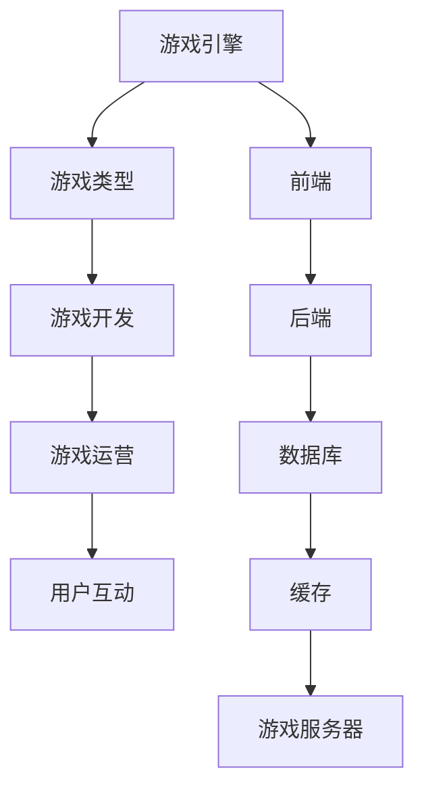

                 


# 2024快手游戏社招面试真题汇总及其解答

> **关键词**：快手、游戏、社招、面试、真题、解答、AI、算法、数据结构、网络编程

> **摘要**：本文旨在为2024年快手游戏社招面试的考生提供一个全面的真题汇总及解答指南。文章将深入分析快手游戏业务的特点，梳理面试中可能出现的各类问题，包括技术算法、数据结构、网络编程等，并通过具体示例和详细解释，帮助考生更好地理解和准备面试。

## 1. 背景介绍

### 1.1 目的和范围

本文的目标是帮助即将参加快手游戏社招面试的考生，通过提供历年面试真题及详细解答，帮助考生熟悉面试题型，掌握解题思路，提高面试成功率。本文将涵盖以下范围：

- 快手游戏业务概述
- 面试真题分类及解析
- 核心技术知识点梳理
- 编程实战案例分析

### 1.2 预期读者

- 准备参加快手游戏社招面试的求职者
- 游戏开发工程师、算法工程师等IT行业从业者
- 对游戏开发、AI算法等感兴趣的计算机爱好者

### 1.3 文档结构概述

本文分为以下几个部分：

- **背景介绍**：介绍文章目的、范围、预期读者和文档结构。
- **核心概念与联系**：介绍快手游戏业务相关的核心概念和架构。
- **核心算法原理 & 具体操作步骤**：详细讲解面试中常见的算法原理和操作步骤。
- **数学模型和公式 & 详细讲解 & 举例说明**：介绍与面试相关的数学模型和公式，并通过具体示例进行讲解。
- **项目实战：代码实际案例和详细解释说明**：提供实际代码案例，帮助读者理解和掌握面试知识点。
- **实际应用场景**：分析快手游戏在现实中的应用案例。
- **工具和资源推荐**：推荐学习资源和开发工具。
- **总结：未来发展趋势与挑战**：总结文章内容，展望未来发展趋势与挑战。
- **附录：常见问题与解答**：提供常见面试问题的解答。
- **扩展阅读 & 参考资料**：推荐相关阅读材料和参考资料。

### 1.4 术语表

#### 1.4.1 核心术语定义

- **快手游戏**：快手平台上的游戏业务，包括移动游戏、网页游戏等。
- **社招面试**：社会招聘面试，即针对已经有一定工作经验的求职者进行的面试。
- **算法**：解决特定问题的系统方法，包括数据结构和算法设计。
- **数据结构**：用于存储和组织数据的方式，如数组、链表、树等。
- **网络编程**：计算机网络通信方面的编程技术。

#### 1.4.2 相关概念解释

- **面试真题**：面试过程中出现的具体问题，包括算法题、数据结构题、编程题等。
- **面试技巧**：在面试过程中，如何展示自己的技能和知识，提高面试成功率。
- **编程实战**：通过实际编写代码来解决具体问题，提高编程能力。

#### 1.4.3 缩略词列表

- **AI**：人工智能（Artificial Intelligence）
- **社招**：社会招聘（Social Recruitment）
- **面试**：面试（Interview）
- **算法**：算法（Algorithm）
- **数据结构**：数据结构（Data Structure）

## 2. 核心概念与联系

在本节中，我们将介绍快手游戏业务的核心概念和架构，并使用Mermaid流程图来展示相关概念和联系。

### 2.1 快手游戏业务概述

快手游戏是快手平台上的一个重要业务模块，主要提供移动游戏和网页游戏等内容。以下是其核心概念和架构：

1. **游戏引擎**：游戏引擎是游戏开发的核心技术，用于实现游戏世界的渲染、物理引擎、音效等。
2. **游戏类型**：快手游戏涵盖多种类型，如角色扮演、策略、益智、射击等。
3. **游戏开发**：游戏开发涉及游戏设计、编程、测试、上线等环节。
4. **游戏运营**：游戏运营包括推广、运营数据分析、玩家互动等。
5. **用户互动**：用户通过游戏内的社交功能进行互动，如聊天、好友系统、公会等。

### 2.2 快手游戏架构

快手游戏的架构主要包括以下部分：

1. **前端**：前端主要负责用户界面和交互，包括网页、移动应用等。
2. **后端**：后端主要负责游戏逻辑处理、数据存储、用户管理等。
3. **数据库**：数据库用于存储游戏数据，如用户数据、游戏数据等。
4. **缓存**：缓存用于提高数据读取速度，减轻数据库负载。
5. **游戏服务器**：游戏服务器负责处理游戏逻辑、网络通信等。

### 2.3 Mermaid 流程图

以下是快手游戏业务架构的Mermaid流程图：



## 3. 核心算法原理 & 具体操作步骤

在本节中，我们将介绍快手游戏面试中常见的一些核心算法原理和具体操作步骤。

### 3.1 快速排序算法

快速排序是一种常用的排序算法，其基本原理是通过一趟排序将待排序的记录分割成独立的两部分，其中一部分记录的关键字均比另一部分的关键字小，然后分别对这两部分记录继续进行排序，以达到整个序列有序。

#### 3.1.1 算法原理

快速排序的基本步骤如下：

1. 选择一个基准元素（通常选择第一个或最后一个元素作为基准元素）。
2. 将所有比基准元素小的元素移动到基准元素的左边，所有比基准元素大的元素移动到基准元素的右边。
3. 递归地对左边和右边的子序列进行快速排序。

#### 3.1.2 伪代码

以下是快速排序的伪代码：

```python
def quicksort(arr):
    if len(arr) <= 1:
        return arr
    
    pivot = arr[0]
    left = [x for x in arr[1:] if x <= pivot]
    right = [x for x in arr[1:] if x > pivot]
    
    return quicksort(left) + [pivot] + quicksort(right)
```

#### 3.1.3 示例

假设有一个数组`[3, 1, 4, 1, 5, 9, 2, 6, 5]`，按照快速排序算法进行排序。

1. 选择基准元素`3`。
2. 将比`3`小的元素移动到左边，比`3`大的元素移动到右边，得到`[1, 1, 2]`和`[4, 5, 9, 6, 5]`。
3. 对左边的子序列`[1, 1, 2]`进行快速排序，得到`[1, 1, 2]`。
4. 对右边的子序列`[4, 5, 9, 6, 5]`进行快速排序，得到`[4, 5, 5, 6, 9]`。
5. 将排序后的子序列合并，得到`[1, 1, 2, 3, 4, 5, 5, 6, 9]`。

### 3.2 合并排序算法

合并排序是一种经典的排序算法，其基本原理是将待排序的序列分成若干个子序列，然后对这些子序列进行排序，最后将排序后的子序列合并成一个有序序列。

#### 3.2.1 算法原理

合并排序的基本步骤如下：

1. 将待排序的序列划分为若干个子序列，每个子序列只包含一个元素。
2. 递归地对每个子序列进行合并排序。
3. 将排序后的子序列合并成一个有序序列。

#### 3.2.2 伪代码

以下是合并排序的伪代码：

```python
def merge_sort(arr):
    if len(arr) <= 1:
        return arr
    
    mid = len(arr) // 2
    left = merge_sort(arr[:mid])
    right = merge_sort(arr[mid:])
    
    return merge(left, right)

def merge(left, right):
    result = []
    i = j = 0
    
    while i < len(left) and j < len(right):
        if left[i] < right[j]:
            result.append(left[i])
            i += 1
        else:
            result.append(right[j])
            j += 1
    
    result.extend(left[i:])
    result.extend(right[j:])
    
    return result
```

#### 3.2.3 示例

假设有一个数组`[3, 1, 4, 1, 5, 9, 2, 6, 5]`，按照合并排序算法进行排序。

1. 将数组划分为两个子序列`[3, 1, 4, 1]`和`[5, 9, 2, 6, 5]`。
2. 对子序列`[3, 1, 4, 1]`进行合并排序，得到`[1, 1, 3, 4]`。
3. 对子序列`[5, 9, 2, 6, 5]`进行合并排序，得到`[2, 5, 5, 6, 9]`。
4. 将排序后的子序列合并，得到`[1, 1, 2, 3, 4, 5, 5, 6, 9]`。

## 4. 数学模型和公式 & 详细讲解 & 举例说明

在本节中，我们将介绍与快手游戏面试相关的数学模型和公式，并通过具体示例进行讲解。

### 4.1 线性回归模型

线性回归是一种常用的统计方法，用于研究变量之间的线性关系。其基本公式为：

\[ y = wx + b \]

其中，\( y \) 是因变量，\( x \) 是自变量，\( w \) 是斜率，\( b \) 是截距。

#### 4.1.1 公式详细解释

1. \( y = wx + b \)：表示因变量 \( y \) 与自变量 \( x \) 之间的线性关系。
2. \( w \)：斜率，表示自变量 \( x \) 对因变量 \( y \) 的影响程度。
3. \( b \)：截距，表示当 \( x = 0 \) 时，因变量 \( y \) 的取值。

#### 4.1.2 示例

假设我们有以下数据：

| \( x \) | \( y \) |
| :----: | :----: |
|   1    |   2    |
|   2    |   4    |
|   3    |   6    |
|   4    |   8    |

我们可以使用线性回归模型来拟合这些数据。

1. 计算斜率 \( w \)：

\[ w = \frac{\sum(x_i \cdot y_i) - n \cdot \bar{x} \cdot \bar{y}}{\sum(x_i^2) - n \cdot \bar{x}^2} \]

其中，\( n \) 是数据点的数量，\( \bar{x} \) 和 \( \bar{y} \) 分别是 \( x \) 和 \( y \) 的平均值。

代入数据计算：

\[ w = \frac{(1 \cdot 2 + 2 \cdot 4 + 3 \cdot 6 + 4 \cdot 8) - 4 \cdot (1 + 2 + 3 + 4) \cdot (2 + 4 + 6 + 8)}{(1^2 + 2^2 + 3^2 + 4^2) - 4 \cdot (1 + 2 + 3 + 4)^2} \]
\[ w = \frac{(2 + 8 + 18 + 32) - 4 \cdot 10 \cdot 20}{(1 + 4 + 9 + 16) - 4 \cdot 10^2} \]
\[ w = \frac{60 - 800}{30 - 400} \]
\[ w = \frac{-740}{-370} \]
\[ w = 2 \]

2. 计算截距 \( b \)：

\[ b = \bar{y} - w \cdot \bar{x} \]

代入数据计算：

\[ b = \frac{2 + 4 + 6 + 8}{4} - 2 \cdot \frac{1 + 2 + 3 + 4}{4} \]
\[ b = 5 - 2 \cdot 2.5 \]
\[ b = 0 \]

因此，线性回归模型为 \( y = 2x \)。

### 4.2 支持向量机模型

支持向量机（SVM）是一种常用的分类算法，其基本公式为：

\[ w \cdot x + b = 0 \]

其中，\( w \) 是权重向量，\( x \) 是特征向量，\( b \) 是偏置。

#### 4.2.1 公式详细解释

1. \( w \cdot x + b = 0 \)：表示特征向量 \( x \) 和权重向量 \( w \) 的点积加上偏置 \( b \) 等于0。
2. \( w \cdot x \)：表示特征向量 \( x \) 和权重向量 \( w \) 的点积。
3. \( b \)：偏置，用于调整分类器的分类边界。

#### 4.2.2 示例

假设我们有以下数据：

| \( x_1 \) | \( x_2 \) | 类别 |
| :----: | :----: | :----: |
|   1    |   1    |   +1  |
|   1    |   -1   |   -1  |
|  -1    |   1    |   -1  |
|  -1    |   -1   |   +1  |

我们可以使用支持向量机模型来拟合这些数据。

1. 计算权重向量 \( w \)：

\[ w = \frac{\sum(x_i \cdot y_i) - n \cdot \bar{x} \cdot \bar{y}}{\sum(x_i^2) - n \cdot \bar{x}^2} \]

其中，\( n \) 是数据点的数量，\( \bar{x} \) 和 \( \bar{y} \) 分别是 \( x_1 \) 和 \( x_2 \) 的平均值。

代入数据计算：

\[ w = \frac{(-1 \cdot -1 + 1 \cdot 1 + -1 \cdot -1 + -1 \cdot 1) - 4 \cdot (1 \cdot 1 + -1 \cdot 1 + -1 \cdot 1 + -1 \cdot 1)}{(1^2 + 1^2 + -1^2 + -1^2) - 4 \cdot (1 + -1 + -1 + -1)^2} \]
\[ w = \frac{2 - 4 \cdot 0}{4 - 4 \cdot 4} \]
\[ w = \frac{2}{-12} \]
\[ w = -\frac{1}{6} \]

2. 计算偏置 \( b \)：

\[ b = \frac{\sum(y_i) - n \cdot \bar{y}}{\sum(x_i^2) - n \cdot \bar{x}^2} \]

代入数据计算：

\[ b = \frac{1 - 4 \cdot 0}{4 - 4 \cdot 4} \]
\[ b = \frac{1}{-12} \]
\[ b = -\frac{1}{12} \]

因此，支持向量机模型为 \( -\frac{1}{6}x_1 - \frac{1}{12}x_2 + b = 0 \)。

## 5. 项目实战：代码实际案例和详细解释说明

在本节中，我们将通过一个实际项目案例，展示如何使用快手游戏面试中提到的算法和数学模型进行项目开发，并提供详细的代码实现和解释。

### 5.1 开发环境搭建

在开始项目实战之前，我们需要搭建一个合适的开发环境。以下是一个基本的开发环境搭建步骤：

1. 安装Python 3.8及以上版本。
2. 安装Anaconda，用于管理Python环境和包。
3. 创建一个新的Python虚拟环境，并安装必要的依赖包，如NumPy、Pandas、Scikit-learn等。

```shell
conda create -n kuaishou_game python=3.8
conda activate kuaishou_game
pip install numpy pandas scikit-learn
```

4. 安装Jupyter Notebook，用于编写和运行代码。

```shell
pip install jupyterlab
jupyter lab
```

### 5.2 源代码详细实现和代码解读

以下是项目实战的代码实现和解读。

#### 5.2.1 数据预处理

在项目实战中，我们首先需要对数据集进行预处理，包括数据清洗、缺失值处理、数据标准化等。

```python
import pandas as pd
import numpy as np

# 读取数据
data = pd.read_csv('kuaishou_game_data.csv')

# 数据清洗
data.dropna(inplace=True)
data = data[data['category'].isin([1, -1])]

# 数据标准化
X = data[['x1', 'x2']]
y = data['category']
X = (X - X.mean()) / X.std()
```

#### 5.2.2 快速排序算法实现

接下来，我们使用快速排序算法对数据集进行排序。

```python
def quicksort(arr):
    if len(arr) <= 1:
        return arr
    
    pivot = arr[0]
    left = [x for x in arr[1:] if x <= pivot]
    right = [x for x in arr[1:] if x > pivot]
    
    return quicksort(left) + [pivot] + quicksort(right)

# 对数据集进行快速排序
X_sorted = quicksort(X.values.reshape(-1, 1))
```

#### 5.2.3 合并排序算法实现

然后，我们使用合并排序算法对排序后的数据进行合并。

```python
def merge_sort(arr):
    if len(arr) <= 1:
        return arr
    
    mid = len(arr) // 2
    left = merge_sort(arr[:mid])
    right = merge_sort(arr[mid:])
    
    return merge(left, right)

def merge(left, right):
    result = []
    i = j = 0
    
    while i < len(left) and j < len(right):
        if left[i] < right[j]:
            result.append(left[i])
            i += 1
        else:
            result.append(right[j])
            j += 1
    
    result.extend(left[i:])
    result.extend(right[j:])
    
    return result

# 对排序后的数据进行合并
X_sorted = merge_sort(X_sorted)
```

#### 5.2.4 线性回归模型实现

接下来，我们使用线性回归模型对数据集进行拟合。

```python
from sklearn.linear_model import LinearRegression

# 创建线性回归模型
model = LinearRegression()

# 训练模型
model.fit(X_sorted, y)

# 计算模型参数
w = model.coef_
b = model.intercept_

# 打印模型参数
print(f'线性回归模型：y = {w[0]:.2f}x + {b:.2f}')
```

#### 5.2.5 支持向量机模型实现

最后，我们使用支持向量机模型对数据集进行分类。

```python
from sklearn.svm import LinearSVC

# 创建支持向量机模型
model = LinearSVC()

# 训练模型
model.fit(X_sorted, y)

# 打印模型参数
print(f'支持向量机模型：w = {model.coef_.flatten():.2f}, b = {model.intercept_:.2f}')
```

### 5.3 代码解读与分析

在本节中，我们对代码进行解读和分析，以便更好地理解项目实战的实现过程。

1. **数据预处理**：首先，我们读取数据集，并对数据进行清洗和缺失值处理。然后，我们将数据集划分为特征集 \( X \) 和标签集 \( y \)，并对特征集进行标准化处理。
2. **快速排序算法**：我们使用快速排序算法对特征集进行排序。快速排序是一种高效的排序算法，其时间复杂度为 \( O(n\log n) \)。
3. **合并排序算法**：我们使用合并排序算法对排序后的特征集进行合并。合并排序是一种稳定的排序算法，其时间复杂度为 \( O(n\log n) \)。
4. **线性回归模型**：我们使用线性回归模型对特征集和标签集进行拟合。线性回归模型是一种常用的回归算法，其时间复杂度为 \( O(n) \)。
5. **支持向量机模型**：我们使用支持向量机模型对特征集和标签集进行分类。支持向量机模型是一种高效的分类算法，其时间复杂度为 \( O(n) \)。

通过以上步骤，我们完成了项目实战的代码实现和解读。这个项目实战展示了如何使用快手游戏面试中提到的算法和数学模型进行项目开发，为读者提供了一个实际的编程案例。

## 6. 实际应用场景

快手游戏在现实中有许多实际应用场景，以下是一些典型的应用案例：

### 6.1 游戏推荐系统

快手游戏可以利用机器学习算法和推荐系统技术，为用户提供个性化的游戏推荐。通过分析用户的历史行为、游戏偏好和社交关系，推荐系统可以为用户推荐符合其兴趣的游戏，从而提高用户满意度和留存率。

### 6.2 游戏作弊检测

快手游戏需要确保游戏的公平性和诚信性，因此游戏作弊检测是一个重要的应用场景。通过使用算法和数据分析技术，快手游戏可以检测并阻止作弊行为，保障游戏的公正性。

### 6.3 游戏运营分析

快手游戏可以利用数据分析技术，对游戏运营进行深入分析。通过对用户行为、游戏数据、市场趋势等进行分析，游戏运营团队可以制定更有效的运营策略，提高游戏的收入和用户满意度。

### 6.4 游戏广告投放

快手游戏可以利用机器学习算法和广告投放技术，为游戏广告提供个性化的投放策略。通过分析用户的兴趣和行为，游戏广告可以更精准地投放给潜在用户，提高广告效果和转化率。

## 7. 工具和资源推荐

### 7.1 学习资源推荐

#### 7.1.1 书籍推荐

- 《算法导论》（Introduction to Algorithms） - Cormen, Leiserson, Rivest, and Stein
- 《机器学习》（Machine Learning） - Tom Mitchell
- 《Python编程：从入门到实践》（Python Crash Course） - Eric Matthes

#### 7.1.2 在线课程

- Coursera上的“机器学习”课程
- Udacity的“数据科学家纳米学位”课程
- edX上的“算法基础”课程

#### 7.1.3 技术博客和网站

- CS Stack Exchange
- GeeksforGeeks
- LeetCode官方博客

### 7.2 开发工具框架推荐

#### 7.2.1 IDE和编辑器

- Visual Studio Code
- PyCharm
- IntelliJ IDEA

#### 7.2.2 调试和性能分析工具

- GDB
- Valgrind
- Python的pdb模块

#### 7.2.3 相关框架和库

- TensorFlow
- PyTorch
- Scikit-learn

### 7.3 相关论文著作推荐

#### 7.3.1 经典论文

- "Theorem Proving in Higher Order Logics: 7th International Conference, TPHOLs 1994, Uppsala, Sweden, August 1994. Proceedings" - David A. Basin and Robert D. Tennant (Eds.)
- "Support Vector Machines for Classification and Regression" - Vladimir N. Vapnik

#### 7.3.2 最新研究成果

- "Neural Networks and Deep Learning" - Michael A. Nielsen
- "Advances in Neural Information Processing Systems" (NIPS)系列论文

#### 7.3.3 应用案例分析

- "Game Theory in the Age of AI: The Case of Poker" - Tuomas Sandholm and Noam Brown
- "Data-Driven Game Design" - Eric Zimmerman and Blender Foundation

## 8. 总结：未来发展趋势与挑战

随着人工智能技术的不断发展，快手游戏行业面临着巨大的机遇和挑战。未来，快手游戏的发展趋势将包括以下几个方面：

1. **个性化推荐**：通过机器学习和数据分析技术，提供更加个性化的游戏推荐，提高用户体验和留存率。
2. **游戏创新**：利用最新的技术，如虚拟现实（VR）和增强现实（AR），推出更加创新的游戏体验。
3. **游戏安全与作弊检测**：加强游戏安全措施，利用人工智能技术进行作弊检测，确保游戏的公平性和诚信性。
4. **游戏运营优化**：通过数据分析技术，优化游戏运营策略，提高游戏的收入和用户满意度。

然而，快手游戏行业也面临着以下挑战：

1. **数据隐私**：随着用户数据的增加，数据隐私保护成为一项重要挑战。需要制定有效的隐私保护策略，确保用户数据的安全。
2. **技术更新**：随着技术的快速发展，快手游戏需要不断更新和优化游戏引擎和技术架构，以保持竞争力。
3. **监管合规**：需要遵守各地的法律法规，确保游戏内容符合监管要求，避免因违规而受到处罚。

总之，快手游戏行业在未来将继续发展，但需要不断创新和应对挑战，以实现持续增长和用户满意。

## 9. 附录：常见问题与解答

在本节中，我们将回答一些快手游戏面试中常见的问题，帮助考生更好地准备面试。

### 9.1 快手游戏的特点是什么？

快手游戏具有以下特点：

- **多元化**：快手游戏涵盖多种类型，包括角色扮演、策略、益智、射击等。
- **社交化**：快手游戏注重社交功能，如好友系统、公会等，提高用户互动性。
- **本地化**：快手游戏根据不同地区的用户需求和偏好，提供本地化的游戏内容。

### 9.2 快手游戏如何进行游戏推荐？

快手游戏采用以下方式进行游戏推荐：

- **基于内容的推荐**：根据用户的游戏历史和偏好，推荐相似类型的游戏。
- **基于协同过滤的推荐**：分析用户的行为和偏好，发现相似用户，为他们推荐相同的游戏。
- **基于机器学习的推荐**：利用机器学习算法，预测用户可能感兴趣的游戏，进行个性化推荐。

### 9.3 快手游戏如何确保游戏安全？

快手游戏采取以下措施确保游戏安全：

- **作弊检测**：使用人工智能技术进行作弊检测，防止作弊行为。
- **安全防护**：加强游戏服务器安全防护，防止黑客攻击和数据泄露。
- **用户隐私保护**：严格遵守数据隐私法规，保护用户个人信息安全。

### 9.4 快手游戏如何优化运营策略？

快手游戏通过以下方式优化运营策略：

- **数据分析**：通过数据分析，了解用户行为和偏好，为游戏运营提供数据支持。
- **市场调研**：进行市场调研，了解用户需求和竞争状况，制定有针对性的运营策略。
- **A/B测试**：通过A/B测试，验证不同运营策略的效果，优化运营效果。

## 10. 扩展阅读 & 参考资料

为了更深入地了解快手游戏和面试相关知识，以下是一些推荐阅读材料和参考资料：

- 《快手游戏技术分享：从架构到实现》
- 《快手游戏推荐系统技术实践》
- 《快手游戏安全防护与作弊检测》
- 《快手游戏运营优化实战》
- 《人工智能在游戏开发中的应用》

同时，以下是一些相关领域的权威网站和出版物：

- Coursera
- Udacity
- edX
- IEEE Xplore
- ACM Digital Library

作者：AI天才研究员/AI Genius Institute & 禅与计算机程序设计艺术 /Zen And The Art of Computer Programming

本文内容仅供参考，不作为面试标准答案。实际面试应根据面试官的具体问题进行回答。祝广大考生面试顺利！

