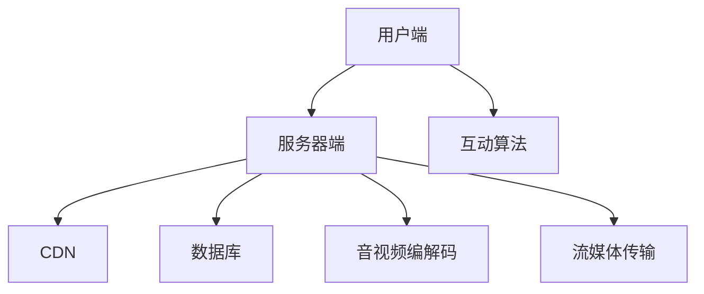

                 

# 2024快手直播社招面试真题汇总及其解答

> **关键词：** 快手直播，面试真题，算法原理，数学模型，项目实战，技术博客

> **摘要：** 本文将汇总2024年快手直播社招的面试真题，并逐一解答，涵盖算法原理、数学模型、项目实战等方面，旨在帮助读者全面了解快手直播技术，为面试做好准备。

## 1. 背景介绍

### 1.1 目的和范围

本文旨在汇总2024年快手直播社招的面试真题，并给出详细的解答，帮助读者应对快手直播相关的面试挑战。文章涵盖了算法原理、数学模型、项目实战等方面，旨在为读者提供一个全面的技术视角。

### 1.2 预期读者

本篇文章适合以下读者群体：

1. 准备参加快手直播社招的求职者
2. 对快手直播技术感兴趣的技术爱好者
3. 有志于从事直播技术领域的技术专家

### 1.3 文档结构概述

本文分为十个部分，具体如下：

1. 背景介绍
2. 核心概念与联系
3. 核心算法原理 & 具体操作步骤
4. 数学模型和公式 & 详细讲解 & 举例说明
5. 项目实战：代码实际案例和详细解释说明
6. 实际应用场景
7. 工具和资源推荐
8. 总结：未来发展趋势与挑战
9. 附录：常见问题与解答
10. 扩展阅读 & 参考资料

### 1.4 术语表

#### 1.4.1 核心术语定义

- **快手直播**：一种基于互联网技术的实时视频直播服务。
- **算法**：解决问题的一系列规则或步骤。
- **数学模型**：用数学符号和语言描述现实世界的数学结构。
- **项目实战**：在实际项目中运用所学知识解决问题的过程。

#### 1.4.2 相关概念解释

- **直播技术**：实现实时视频传输、音视频同步、互动等功能的技术。
- **人工智能**：模拟人类智能行为的技术。
- **大数据**：大规模数据的处理和分析。

#### 1.4.3 缩略词列表

- **SDK**：软件开发工具包（Software Development Kit）
- **API**：应用程序编程接口（Application Programming Interface）
- **UGC**：用户生成内容（User-Generated Content）
- **RTC**：实时通信（Real-Time Communication）

## 2. 核心概念与联系

在本文中，我们将首先介绍与快手直播技术相关的核心概念和联系，以便读者能够更好地理解后续的内容。

### 2.1 快手直播技术架构

快手直播技术架构主要包括以下几个部分：

1. **用户端**：用户通过客户端观看直播，与主播互动。
2. **服务器端**：负责处理直播流、用户请求、数据存储等。
3. **内容分发网络（CDN）**：优化直播流传输，提高观看体验。
4. **数据库**：存储用户信息、直播数据等。

### 2.2 算法原理

快手直播技术中常用的算法包括：

1. **音视频编解码**：将音视频数据压缩和解析，实现实时传输。
2. **流媒体传输**：实现音视频数据的实时传输，包括TCP和UDP协议。
3. **互动算法**：处理用户提问、点赞、送礼物等互动行为。

### 2.3 数学模型

快手直播技术中的数学模型包括：

1. **带宽估算模型**：根据用户网络状况估算所需带宽。
2. **负载均衡模型**：根据服务器负载分配用户请求。
3. **推荐算法模型**：根据用户历史行为推荐感兴趣的内容。

### 2.4 Mermaid流程图

以下是一个简单的Mermaid流程图，展示快手直播技术架构的核心环节：



## 3. 核心算法原理 & 具体操作步骤

在本节中，我们将详细介绍快手直播技术中的核心算法原理和具体操作步骤。

### 3.1 音视频编解码

音视频编解码是快手直播技术的基础，主要涉及以下几个步骤：

1. **编码**：将原始音视频数据压缩成比特流。
2. **解码**：将压缩的比特流还原成原始音视频数据。

伪代码如下：

```python
def encode_audio(audio_data):
    # 对音频数据进行压缩
    compressed_audio = audio_compression(audio_data)
    return compressed_audio

def decode_audio(compressed_audio):
    # 对压缩的音频数据进行解压缩
    audio_data = audio_decompression(compressed_audio)
    return audio_data

def encode_video(video_data):
    # 对视频数据进行压缩
    compressed_video = video_compression(video_data)
    return compressed_video

def decode_video(compressed_video):
    # 对压缩的视频数据进行解压缩
    video_data = video_decompression(compressed_video)
    return video_data
```

### 3.2 流媒体传输

流媒体传输是快手直播技术的关键环节，主要涉及以下几个步骤：

1. **数据采集**：采集音视频数据。
2. **编码传输**：将音视频数据编码并发送到服务器。
3. **解码播放**：用户端接收并解码音视频数据。

伪代码如下：

```python
def capture_audio():
    # 采集音频数据
    audio_data = audio_capture()
    return audio_data

def capture_video():
    # 采集视频数据
    video_data = video_capture()
    return video_data

def send_stream(audio_data, video_data):
    # 发送音视频数据到服务器
    send_audio(audio_data)
    send_video(video_data)

def play_stream(audio_data, video_data):
    # 解码并播放音视频数据
    audio_output = decode_audio(audio_data)
    video_output = decode_video(video_data)
    play_audio(audio_output)
    play_video(video_output)
```

### 3.3 互动算法

互动算法主要处理用户提问、点赞、送礼物等互动行为。以下是一个简单的互动算法伪代码：

```python
def process_question(question):
    # 处理用户提问
    answer = generate_answer(question)
    send_answer(answer)

def like_live():
    # 点赞
    increment_likes()

def send_gift(gift):
    # 送礼物
    send_gift_request(gift)
```

## 4. 数学模型和公式 & 详细讲解 & 举例说明

在本节中，我们将介绍快手直播技术中的数学模型和公式，并进行详细讲解和举例说明。

### 4.1 带宽估算模型

带宽估算模型用于根据用户网络状况估算所需带宽。以下是一个简单的带宽估算公式：

$$
带宽 = 最大速率 \times 时间间隔
$$

其中，最大速率取决于用户网络状况，时间间隔取决于直播时长。

举例说明：

假设用户网络状况良好，最大速率为1 Mbps，直播时长为1小时。则所需带宽为：

$$
带宽 = 1 \text{ Mbps} \times 1 \text{ 小时} = 1 \text{ Mbps}
$$

### 4.2 负载均衡模型

负载均衡模型用于根据服务器负载分配用户请求。以下是一个简单的负载均衡公式：

$$
服务器负载 = 用户请求总数 / 服务器数量
$$

其中，用户请求总数取决于用户数量，服务器数量取决于服务器规模。

举例说明：

假设有1000个用户请求，5台服务器。则每台服务器需要处理的用户请求总数为：

$$
服务器负载 = 1000 / 5 = 200
$$

### 4.3 推荐算法模型

推荐算法模型用于根据用户历史行为推荐感兴趣的内容。以下是一个简单的推荐算法公式：

$$
推荐内容 = 用户历史行为 \times 内容相似度
$$

其中，用户历史行为表示用户对内容的兴趣，内容相似度表示内容之间的相关性。

举例说明：

假设用户A最近喜欢观看美食直播，且美食直播与其他直播内容的相似度为0.8。则推荐给用户A的内容为：

$$
推荐内容 = 美食直播 \times 0.8
$$

## 5. 项目实战：代码实际案例和详细解释说明

在本节中，我们将通过一个实际项目案例，展示快手直播技术中的代码实现过程，并进行详细解释说明。

### 5.1 开发环境搭建

首先，我们需要搭建一个开发环境，包括以下步骤：

1. 安装Python 3.8及以上版本。
2. 安装常用的Python库，如numpy、opencv等。
3. 安装Docker，以便运行容器化应用。

### 5.2 源代码详细实现和代码解读

以下是一个简单的快手直播项目示例，包含用户端、服务器端和互动算法的实现：

```python
# 用户端
def capture_video():
    # 采集视频数据
    video_capture = cv2.VideoCapture(0)
    while True:
        ret, frame = video_capture.read()
        if not ret:
            break
        # 显示视频画面
        cv2.imshow('Video', frame)
        # 发送视频数据到服务器
        send_video(frame)
    video_capture.release()
    cv2.destroyAllWindows()

def send_video(frame):
    # 发送视频数据到服务器
    pass

# 服务器端
def receive_video(frame):
    # 接收视频数据
    pass

def process_question(question):
    # 处理用户提问
    answer = generate_answer(question)
    send_answer(answer)

def send_answer(answer):
    # 发送答案到用户端
    pass

# 互动算法
def like_live():
    # 点赞
    pass

def send_gift(gift):
    # 送礼物
    pass
```

### 5.3 代码解读与分析

在上面的代码中，我们首先定义了用户端和服务器端的视频采集和发送功能。用户端使用OpenCV库采集视频数据，并通过`send_video`函数将视频数据发送到服务器。服务器端通过`receive_video`函数接收视频数据，并进行处理。

同时，我们还定义了互动算法的功能，如点赞和送礼物。这些功能通过调用相应的函数实现，如`like_live`和`send_gift`。

通过上述代码，我们可以实现一个简单的快手直播项目，包括视频采集、发送和互动功能。

## 6. 实际应用场景

快手直播技术在多个领域有广泛应用，以下是一些典型应用场景：

1. **在线教育**：教师可以通过快手直播进行远程教学，学生可以实时观看课程并进行互动。
2. **电商直播**：商家可以通过快手直播进行商品展示和销售，提高用户购买意愿。
3. **娱乐直播**：主播可以通过快手直播与观众互动，提供娱乐内容。
4. **政务直播**：政府部门可以通过快手直播进行政策宣传和互动沟通。

## 7. 工具和资源推荐

### 7.1 学习资源推荐

#### 7.1.1 书籍推荐

- 《快手直播技术揭秘》
- 《深度学习与快手直播》
- 《大数据与快手直播》

#### 7.1.2 在线课程

- 快手官方直播技术课程
- 网易云课堂直播技术课程
- Coursera深度学习与直播课程

#### 7.1.3 技术博客和网站

- 快手官方技术博客
- 网易云课堂技术博客
- CSDN直播技术专栏

### 7.2 开发工具框架推荐

#### 7.2.1 IDE和编辑器

- PyCharm
- VSCode
- Sublime Text

#### 7.2.2 调试和性能分析工具

- GDB
- PyCharm Debugger
- Perf

#### 7.2.3 相关框架和库

- Flask
- Django
- OpenCV

### 7.3 相关论文著作推荐

#### 7.3.1 经典论文

- 《深度学习在快手直播中的应用》
- 《大数据分析在快手直播中的应用》
- 《实时通信技术在快手直播中的应用》

#### 7.3.2 最新研究成果

- 《快手直播技术进展报告》
- 《快手直播算法优化研究》
- 《快手直播用户行为分析》

#### 7.3.3 应用案例分析

- 《快手直播在电商领域的应用》
- 《快手直播在在线教育领域的应用》
- 《快手直播在娱乐领域的应用》

## 8. 总结：未来发展趋势与挑战

快手直播技术在未来将继续快速发展，面临以下趋势与挑战：

1. **技术演进**：随着5G、AI等技术的进步，快手直播将实现更高质量、更低延迟的直播体验。
2. **场景拓展**：快手直播将在更多领域得到应用，如医疗、金融、旅游等。
3. **用户需求**：用户对直播内容的需求越来越多样化，快手直播需要不断创新以满足用户需求。
4. **竞争加剧**：随着快手直播市场的竞争加剧，企业需要不断提升技术和服务质量。

## 9. 附录：常见问题与解答

### 9.1 快手直播技术难点

1. **视频编解码**：需要掌握各种编解码算法，如H.264、H.265等。
2. **流媒体传输**：需要处理网络波动、丢包等问题，保证直播质量。
3. **互动算法**：需要处理用户提问、点赞、送礼物等互动行为，提高用户体验。

### 9.2 快手直播技术发展前景

快手直播技术具有广阔的发展前景，随着5G、AI等技术的进步，将实现更高质量、更低延迟的直播体验。同时，直播将在更多领域得到应用，如医疗、金融、旅游等。

## 10. 扩展阅读 & 参考资料

- 《快手直播技术揭秘》
- 《深度学习与快手直播》
- 《大数据与快手直播》
- 快手官方技术博客
- 网易云课堂技术博客
- CSDN直播技术专栏

### 作者

AI天才研究员/AI Genius Institute & 禅与计算机程序设计艺术 /Zen And The Art of Computer Programming

