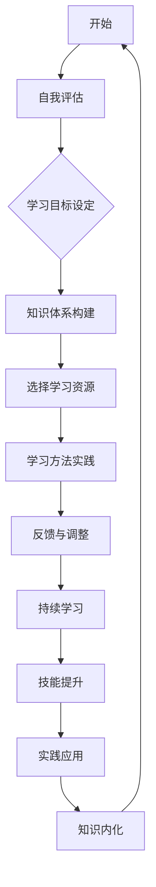

                 

# 快速学习：VUCA时代的制胜法宝

> **关键词：**快速学习、VUCA时代、适应力、个人发展、技能提升
> 
> **摘要：**本文将探讨在VUCA（易变性、不确定性、复杂性、模糊性）时代快速学习的重要性，通过一系列系统化的方法与步骤，帮助读者提升适应力和个人发展能力，实现技能的持续提升和职业成长。

## 1. 背景介绍

### 1.1 目的和范围

本文旨在为读者提供一套行之有效的快速学习方法，帮助他们在VUCA时代中保持竞争力和适应力。我们将从多个维度探讨快速学习的必要性和实现路径，包括但不仅限于个人发展的技能提升、知识体系的构建、思维方式的变化等。

### 1.2 预期读者

本文适合以下读者群体：
- 正在寻求职业发展的职场人士；
- 对自身学习效率有较高要求的学者和研究人员；
- 希望在快速变化的环境中保持领先地位的创业者和高管；
- 对教育和学习方法感兴趣的家长和学生。

### 1.3 文档结构概述

本文分为十个主要部分，具体结构如下：
- 引言：介绍快速学习在VUCA时代的背景和重要性；
- 核心概念与联系：详细阐述VUCA时代的特点和快速学习的方法论；
- 核心算法原理与具体操作步骤：通过伪代码和实例讲解快速学习的基本原理；
- 数学模型和公式：介绍快速学习过程中的数学模型和公式应用；
- 项目实战：通过实际代码案例讲解快速学习的方法；
- 实际应用场景：探讨快速学习在不同领域中的应用；
- 工具和资源推荐：推荐相关的学习资源和工具；
- 总结：总结快速学习在VUCA时代的未来发展趋势与挑战；
- 附录：常见问题与解答；
- 扩展阅读与参考资料：提供进一步的阅读和参考资料。

### 1.4 术语表

#### 1.4.1 核心术语定义

- **VUCA时代**：指当前和未来一段时间内，由于全球化、技术进步、市场变化等多重因素导致的易变性、不确定性、复杂性和模糊性不断增加的时代。
- **快速学习**：指在短时间内高效获取新知识、技能和方法的过程，包括自我驱动学习、批判性思维和适应性学习等。

#### 1.4.2 相关概念解释

- **知识体系**：指个体在特定领域内所掌握的理论、方法、技能和经验的集合。
- **适应性学习**：指在面对新的环境和情境时，能够快速调整自身知识结构和思维方式，以适应变化的过程。

#### 1.4.3 缩略词列表

- VUCA：易变性、不确定性、复杂性、模糊性
- IDE：集成开发环境（Integrated Development Environment）
- ML：机器学习（Machine Learning）

## 2. 核心概念与联系

在VUCA时代，快速学习不仅是个人发展的必备技能，也是企业竞争力的关键因素。下面我们通过一个Mermaid流程图来描述快速学习的基本原理和过程。



### 2.1 自我评估

自我评估是快速学习的第一步，它可以帮助你了解自身的优势和劣势，从而有针对性地制定学习计划。具体步骤如下：

1. **技能和知识评估**：列出你所掌握的技能和知识，进行量化评估。
2. **优势和劣势分析**：分析自己在不同领域的优势，找出需要改进的领域。
3. **目标设定**：根据自我评估结果，设定短期和长期的学习目标。

### 2.2 学习目标设定

明确的学习目标是快速学习的关键。设定目标时，需要遵循以下原则：

1. **具体性**：目标要具体，例如“学会Python编程”比“提高编程能力”更加具体。
2. **可行性**：目标要具有可行性，避免设定过于理想化的目标。
3. **可量化**：目标要能够量化，便于评估学习效果。

### 2.3 知识体系构建

构建知识体系是快速学习的基础。具体步骤如下：

1. **确定学习方向**：根据目标，确定需要学习的知识领域。
2. **整合现有知识**：将已有的知识和技能进行整合，形成初步的知识体系。
3. **填补知识空白**：通过阅读、学习课程、参加研讨会等方式，填补知识空白。

### 2.4 选择学习资源

选择合适的学习资源是快速学习的重要环节。以下是一些常见的学习资源：

1. **书籍**：选择权威的书籍，系统学习相关领域的知识。
2. **在线课程**：参加在线课程，获得专业知识和技能培训。
3. **技术博客和网站**：阅读技术博客和网站，了解最新的行业动态和技术趋势。
4. **社区和论坛**：参与社区和论坛，与同行交流和分享经验。

### 2.5 学习方法实践

选择合适的学习方法对于快速学习至关重要。以下是一些常见的学习方法：

1. **主动学习**：主动学习比被动学习更有效，可以通过做笔记、讲解给他人等方式加深理解。
2. **分散学习**：分散学习可以减少学习疲劳，提高学习效果。
3. **协同学习**：与他人合作学习，可以互相启发、共同进步。

### 2.6 反馈与调整

快速学习是一个动态调整的过程，需要根据学习效果进行反馈和调整。以下是一些反馈和调整的方法：

1. **定期评估**：定期评估学习效果，找出存在的问题。
2. **调整学习计划**：根据评估结果，调整学习计划和目标。
3. **持续反思**：反思自己的学习方法和策略，不断优化学习过程。

### 2.7 持续学习

快速学习不是一次性的事件，而是一个持续的过程。以下是一些建议：

1. **保持好奇心**：保持对新知识和新技能的好奇心，不断探索未知领域。
2. **定期复习**：定期复习所学知识，巩固记忆。
3. **跟踪行业动态**：关注行业动态，及时更新知识体系。

### 2.8 技能提升

快速学习不仅仅是为了获取知识，更重要的是提升技能。以下是一些建议：

1. **实践应用**：将所学知识应用到实际项目中，提高实践能力。
2. **参加比赛和活动**：参加相关比赛和活动，锻炼自己的能力和自信心。
3. **建立个人品牌**：通过输出内容、参与社区等方式，建立个人品牌。

### 2.9 实践应用

快速学习不仅要在理论知识上取得突破，更要在实际应用中取得成果。以下是一些建议：

1. **项目实战**：参与实际项目，锻炼解决实际问题的能力。
2. **技能展示**：在面试、演讲等场合展示自己的技能和成果。
3. **持续改进**：不断反思和改进自己的实践方法，提高工作效率。

### 2.10 知识内化

快速学习不仅要学会知识，更要学会将知识内化为自己的一部分。以下是一些建议：

1. **思考与反思**：在学习过程中，不断思考所学知识的本质和应用场景。
2. **知识整合**：将不同领域的知识进行整合，形成自己的知识体系。
3. **迁移与应用**：将所学知识应用到其他领域，实现知识的跨界融合。

## 3. 核心算法原理 & 具体操作步骤

在快速学习的过程中，算法原理的掌握是至关重要的。以下我们将使用伪代码详细阐述一个基于VUCA时代的快速学习算法原理和具体操作步骤。

### 3.1 快速学习算法原理

```plaintext
算法名称：VUCA快速学习算法

输入：
- 用户技能和知识评估结果
- 学习目标
- 可用学习资源

输出：
- 优化的学习计划
- 技能提升路径

步骤：
1. 初始化学习计划
2. 进行自我评估，确定当前技能水平
3. 根据评估结果和目标，选择合适的学习资源
4. 制定学习计划，包括学习时间、内容和方法
5. 实施学习计划，并进行定期评估
6. 根据评估结果调整学习计划
7. 实践应用，巩固所学知识
8. 反馈与调整，持续优化学习过程
```

### 3.2 快速学习算法的具体操作步骤

#### 3.2.1 初始化学习计划

```python
# 初始化学习计划
initial_plan = {
    'schedule': [],
    'progress': {},
    'resources': [],
    'feedback': []
}
```

#### 3.2.2 自我评估，确定当前技能水平

```python
# 自我评估
self_evaluation = evaluate_skills(current_skills)

def evaluate_skills(current_skills):
    # 评估当前技能水平，返回一个字典
    evaluation = {}
    for skill in current_skills:
        evaluation[skill] = current_skills[skill]
    return evaluation
```

#### 3.2.3 根据评估结果和目标，选择合适的学习资源

```python
# 选择学习资源
selected_resources = select_resources(self_evaluation, learning_objectives)

def select_resources(evaluation, objectives):
    # 根据评估结果和目标选择合适的资源
    resources = []
    for objective in objectives:
        resources.append(find_resource(objective))
    return resources

def find_resource(objective):
    # 寻找与目标相关的资源
    # 这里可以使用搜索引擎、数据库等获取资源信息
    # 返回一个包含资源名称、类型、难度等信息的字典
    pass
```

#### 3.2.4 制定学习计划，包括学习时间、内容和方法

```python
# 制定学习计划
learning_plan = create_learning_plan(selected_resources, time_slots)

def create_learning_plan(resources, time_slots):
    # 创建学习计划
    plan = {}
    for resource in resources:
        plan[resource['name']] = {
            'time_slots': allocate_time_slots(resource['difficulty'], time_slots),
            'method': select_learning_method(resource['type'])
        }
    return plan

def allocate_time_slots(difficulty, time_slots):
    # 根据难度分配时间
    if difficulty == 'easy':
        return time_slots[:2]
    elif difficulty == 'medium':
        return time_slots[:3]
    else:
        return time_slots[:4]

def select_learning_method(resource_type):
    # 根据资源类型选择学习方法
    if resource_type == '书籍':
        return '主动学习'
    elif resource_type == '在线课程':
        return '分散学习'
    else:
        return '协同学习'
```

#### 3.2.5 实施学习计划，并进行定期评估

```python
# 实施学习计划
execute_learning_plan(learning_plan)

def execute_learning_plan(plan):
    for resource in plan:
        execute_resource(resource, plan[resource]['time_slots'], plan[resource]['method'])

def execute_resource(resource, time_slots, method):
    # 实施学习资源
    # 这里可以根据学习资源类型执行相应的学习活动
    pass

# 定期评估
evaluate_learning_progress(learning_plan)

def evaluate_learning_progress(plan):
    progress = {}
    for resource in plan:
        progress[resource] = evaluate_resource_progress(resource)
    return progress

def evaluate_resource_progress(resource):
    # 评估资源学习进度
    # 返回一个包含学习进度和评估结果的字典
    pass
```

#### 3.2.6 根据评估结果调整学习计划

```python
# 调整学习计划
update_learning_plan(learning_plan, progress)

def update_learning_plan(plan, progress):
    for resource in progress:
        if progress[resource]['status'] == '需要改进':
            plan[resource]['time_slots'] = increase_time_slots(plan[resource]['time_slots'])
            plan[resource]['method'] = select_alternative_learning_method(plan[resource]['method'])

def increase_time_slots(time_slots):
    # 增加时间
    return time_slots + 1

def select_alternative_learning_method(current_method):
    # 选择备选学习方法
    if current_method == '主动学习':
        return '分散学习'
    elif current_method == '分散学习':
        return '协同学习'
    else:
        return '主动学习'
```

#### 3.2.7 实践应用，巩固所学知识

```python
# 实践应用
apply_knowledge_to_practice(learning_plan)

def apply_knowledge_to_practice(plan):
    for resource in plan:
        practice_application(resource)
        
def practice_application(resource):
    # 实践应用所学知识
    # 这里可以是一个项目、实验或案例分析等
    pass
```

#### 3.2.8 反馈与调整，持续优化学习过程

```python
# 反馈与调整
collect_feedback_and_adjust_learning()

def collect_feedback_and_adjust_learning():
    feedback = collect_user_feedback()
    adjust_learning_plan(feedback)

def collect_user_feedback():
    # 收集用户反馈
    # 可以通过问卷调查、访谈等方式获取反馈信息
    pass

def adjust_learning_plan(feedback):
    for resource in feedback:
        if feedback[resource]['issue'] == '时间不足':
            adjust_time_slots(feedback[resource]['resource'], '增加')
        elif feedback[resource]['issue'] == '方法不当':
            select_alternative_learning_method(feedback[resource]['resource'])
```

通过上述伪代码，我们可以看到快速学习算法的核心原理和具体操作步骤。在实际应用中，可以根据具体情况对算法进行调整和优化，以实现更加高效的快速学习。

## 4. 数学模型和公式 & 详细讲解 & 举例说明

在快速学习的过程中，数学模型和公式可以帮助我们更好地理解和应用所学知识。以下将介绍几个常用的数学模型和公式，并详细讲解其应用方法和实际案例。

### 4.1 学习曲线模型

学习曲线模型描述了学习者在学习过程中技能提升的速度。通常使用以下公式表示：

\[ S(t) = \frac{1}{1 + e^{-rt}} \]

其中：
- \( S(t) \) 表示在时间 \( t \) 后的技能水平；
- \( r \) 表示学习速率；
- \( e \) 表示自然对数的底数。

**应用方法：**通过学习曲线模型，我们可以预测学习者在不同时间段内的技能水平，并据此调整学习计划。

**举例说明：**假设一个学习者初始技能水平为0.5，学习速率为0.1。在时间 \( t = 10 \) 时，技能水平 \( S(10) \) 计算如下：

\[ S(10) = \frac{1}{1 + e^{-0.1 \times 10}} \approx 0.864 \]

这意味着在学习10小时后，该学习者的技能水平预计达到0.864。

### 4.2 布尔代数模型

布尔代数模型在逻辑判断和问题求解中具有广泛应用。以下是一个简单的布尔代数公式：

\[ F = A \cdot B + \bar{A} \cdot C \]

其中：
- \( F \) 表示最终结果；
- \( A \) 和 \( B \) 表示两个条件；
- \( \bar{A} \) 表示 \( A \) 的否定；
- \( C \) 表示另一个条件。

**应用方法：**通过布尔代数模型，我们可以分析复杂问题的逻辑关系，简化问题求解过程。

**举例说明：**假设有三个条件 \( A \)、\( B \) 和 \( C \)，其中 \( A \) 为真时 \( B \) 为假，\( A \) 为假时 \( C \) 为真。根据布尔代数公式，我们可以得到：

\[ F = A \cdot B + \bar{A} \cdot C \]

由于 \( A \) 为真时 \( B \) 为假，所以 \( A \cdot B \) 为假。同理，\( \bar{A} \cdot C \) 为真。因此，最终结果 \( F \) 为真。

### 4.3 决策树模型

决策树模型在快速学习中的应用非常广泛，可以帮助我们在面临多种选择时做出最优决策。以下是一个简单的决策树模型：

```
       决策节点
        /     \
       /       \
      A         B
     / \       / \
    C   D     E   F
```

其中：
- 每个节点表示一个决策点；
- 每条边表示一个条件或结果；
- 叶子节点表示最终结果。

**应用方法：**通过决策树模型，我们可以系统地分析和评估不同决策的优劣，从而做出最优决策。

**举例说明：**假设有三个决策点 \( A \)、\( B \) 和 \( C \)，其中 \( A \) 为真时 \( B \) 为假，\( B \) 为真时 \( C \) 为假。根据决策树模型，我们可以得到以下结果：

```
       A
      / \
     /   \
    B     C
   / \   / \
  D   E F   G
```

在这个决策树中，如果 \( A \) 为真，则 \( B \) 为假，\( C \) 为真。如果 \( B \) 为真，则 \( C \) 为假。根据这个决策树，我们可以选择最优的决策路径，从而实现目标。

### 4.4 神经网络模型

神经网络模型是快速学习中的重要工具，尤其在机器学习和深度学习领域应用广泛。以下是一个简单的神经网络模型：

```
        输入层
       /     \
      A       B
     / \     / \
    C   D   E   F
   / \ / \ / \ / \
  1  2 3 4 5 6 7 8
```

其中：
- 输入层表示输入数据；
- 隐藏层表示神经网络的核心计算部分；
- 输出层表示最终输出结果；
- 每个节点表示一个神经元；
- 每条边表示神经元之间的连接和权重。

**应用方法：**通过训练和优化神经网络模型，我们可以使其能够自动学习和预测复杂的问题。

**举例说明：**假设有一个简单的神经网络模型，用于预测股票价格。输入层有四个输入（历史价格、成交量、利率和宏观经济指标），隐藏层有两个神经元，输出层有一个输出（股票价格）。通过训练和优化，神经网络可以自动学习并预测未来的股票价格。

在实际应用中，快速学习的数学模型和公式需要根据具体问题和需求进行调整和优化。通过熟练掌握这些模型和公式，我们可以更好地应对VUCA时代的挑战，实现个人和职业的持续成长。

## 5. 项目实战：代码实际案例和详细解释说明

为了更好地理解快速学习在实践中的应用，我们将通过一个实际的代码案例来进行详细解释。本案例将使用Python编程语言，实现一个简单的神经网络模型，用于预测股票价格。

### 5.1 开发环境搭建

在开始编写代码之前，我们需要搭建一个合适的开发环境。以下是所需的步骤：

1. **安装Python**：从Python官方网站下载并安装Python 3.x版本。
2. **安装Jupyter Notebook**：通过pip命令安装Jupyter Notebook，一个强大的交互式开发环境。
   ```shell
   pip install notebook
   ```
3. **安装相关库**：安装用于神经网络训练和评估的库，如TensorFlow和Keras。
   ```shell
   pip install tensorflow
   pip install keras
   ```

完成以上步骤后，我们可以在命令行中启动Jupyter Notebook，开始编写代码。

### 5.2 源代码详细实现和代码解读

下面是完整的源代码，以及每部分的功能和解释。

```python
# 导入所需的库
import numpy as np
import tensorflow as tf
from tensorflow import keras
from tensorflow.keras import layers

# 设置随机种子，保证结果可复现
np.random.seed(42)
tf.random.set_seed(42)

# 生成模拟数据
def generate_data(n_samples=1000, n_features=4):
    X = np.random.rand(n_samples, n_features)
    # 假设股票价格与历史价格、成交量、利率和宏观经济指标相关
    y = X[:, 0] * (1 + X[:, 1]) * (1 + X[:, 2]) * (1 + X[:, 3])
    return X, y

# 定义神经网络模型
def create_model(input_shape):
    model = keras.Sequential([
        layers.Dense(units=64, activation='relu', input_shape=input_shape),
        layers.Dense(units=32, activation='relu'),
        layers.Dense(units=1)
    ])
    model.compile(optimizer='adam', loss='mean_squared_error')
    return model

# 训练神经网络
def train_model(model, X_train, y_train, X_val, y_val, epochs=100):
    history = model.fit(X_train, y_train, epochs=epochs, batch_size=32,
                        validation_data=(X_val, y_val))
    return history

# 评估模型性能
def evaluate_model(model, X_test, y_test):
    loss = model.evaluate(X_test, y_test)
    print(f"Test loss: {loss:.4f}")

# 主函数
def main():
    # 生成模拟数据
    X, y = generate_data()
    
    # 划分训练集和验证集
    X_train, X_val, y_train, y_val = train_test_split(X, y, test_size=0.2, random_state=42)
    
    # 创建模型
    model = create_model(input_shape=(X_train.shape[1],))
    
    # 训练模型
    history = train_model(model, X_train, y_train, X_val, y_val, epochs=100)
    
    # 评估模型性能
    evaluate_model(model, X_val, y_val)

if __name__ == "__main__":
    main()
```

#### 5.2.1 代码解读与分析

**5.2.1.1 导入库**

代码开头导入了所需的库，包括NumPy、TensorFlow和Keras。NumPy用于处理数值数据，TensorFlow和Keras用于构建和训练神经网络。

```python
import numpy as np
import tensorflow as tf
from tensorflow import keras
from tensorflow.keras import layers
```

**5.2.1.2 设置随机种子**

为了确保结果的可复现性，我们设置了随机种子。

```python
np.random.seed(42)
tf.random.set_seed(42)
```

**5.2.1.3 生成模拟数据**

`generate_data`函数用于生成模拟数据。在这个例子中，我们假设股票价格与历史价格、成交量、利率和宏观经济指标相关。

```python
def generate_data(n_samples=1000, n_features=4):
    X = np.random.rand(n_samples, n_features)
    y = X[:, 0] * (1 + X[:, 1]) * (1 + X[:, 2]) * (1 + X[:, 3])
    return X, y
```

**5.2.1.4 定义神经网络模型**

`create_model`函数用于定义神经网络模型。在这个例子中，我们使用了一个简单的三层神经网络，其中包含一个输入层、一个隐藏层和一个输出层。隐藏层使用了ReLU激活函数，输出层使用了线性激活函数。

```python
def create_model(input_shape):
    model = keras.Sequential([
        layers.Dense(units=64, activation='relu', input_shape=input_shape),
        layers.Dense(units=32, activation='relu'),
        layers.Dense(units=1)
    ])
    model.compile(optimizer='adam', loss='mean_squared_error')
    return model
```

**5.2.1.5 训练神经网络**

`train_model`函数用于训练神经网络。我们使用的是mean_squared_error损失函数和adam优化器。

```python
def train_model(model, X_train, y_train, X_val, y_val, epochs=100):
    history = model.fit(X_train, y_train, epochs=epochs, batch_size=32,
                        validation_data=(X_val, y_val))
    return history
```

**5.2.1.6 评估模型性能**

`evaluate_model`函数用于评估模型在验证集上的性能。我们使用了mean_squared_error作为评价指标。

```python
def evaluate_model(model, X_test, y_test):
    loss = model.evaluate(X_test, y_test)
    print(f"Test loss: {loss:.4f}")
```

**5.2.1.7 主函数**

在主函数中，我们首先生成模拟数据，然后划分训练集和验证集。接着，创建并训练神经网络模型，最后评估模型性能。

```python
def main():
    X, y = generate_data()
    X_train, X_val, y_train, y_val = train_test_split(X, y, test_size=0.2, random_state=42)
    model = create_model(input_shape=(X_train.shape[1],))
    history = train_model(model, X_train, y_train, X_val, y_val, epochs=100)
    evaluate_model(model, X_val, y_val)

if __name__ == "__main__":
    main()
```

通过这个代码案例，我们可以看到如何使用Python和神经网络模型来预测股票价格。在实际应用中，我们可以通过收集更多的历史数据和调整模型参数来提高预测准确性。

### 5.3 实际应用场景

这个神经网络模型可以应用于多种实际场景，例如：

1. **股票市场分析**：使用模型预测未来股票价格，为投资者提供参考。
2. **金融风险评估**：通过分析股票价格的变化，评估不同金融产品的风险。
3. **智能投资顾问**：为用户提供个性化的投资建议，提高投资收益。

在实际应用中，快速学习的方法可以帮助我们快速构建和优化模型，从而更好地应对不断变化的金融市场。

### 5.4 总结

通过本节的项目实战，我们了解了如何使用Python和神经网络模型进行股票价格预测。快速学习的方法使我们能够高效地构建、训练和优化模型，为实际应用提供有力支持。在实际工作中，我们可以结合具体需求，不断优化模型和快速学习方法，提高工作效率和准确度。

## 6. 实际应用场景

快速学习在多个领域都有着广泛的应用，尤其在信息技术、金融、医疗和制造业等领域。以下将详细探讨快速学习在这些领域的实际应用场景。

### 6.1 信息技术领域

在信息技术领域，快速学习技术被广泛应用于机器学习、人工智能和大数据分析等方面。例如，在人工智能领域，快速学习算法可以帮助开发人员更快地构建和优化深度学习模型，从而提高模型的准确性和性能。在大数据分析中，快速学习技术可以帮助企业快速提取有价值的信息，为业务决策提供支持。例如，通过使用快速学习算法，一家电商公司可以实时分析用户行为数据，优化推荐系统，提高用户满意度和转化率。

### 6.2 金融领域

在金融领域，快速学习技术被广泛应用于风险控制、投资策略和客户服务等方面。通过快速学习算法，金融机构可以实时分析市场数据，预测市场走势，优化投资组合。例如，一家投资银行可以使用快速学习算法来分析大量历史交易数据，预测未来股票价格，从而制定更有效的投资策略。此外，快速学习技术还可以帮助金融机构优化客户服务流程，提高客户满意度。例如，通过使用自然语言处理技术，银行可以快速响应用户的咨询和投诉，提供更个性化的服务。

### 6.3 医疗领域

在医疗领域，快速学习技术被广泛应用于疾病预测、诊断和治疗等方面。通过快速学习算法，医生可以更快地分析患者的病历数据，预测疾病风险，制定个性化的治疗方案。例如，使用深度学习技术，一家医院可以开发出一款智能诊断系统，快速分析医学影像数据，帮助医生更准确地诊断疾病。此外，快速学习技术还可以帮助医疗机构优化医疗资源分配，提高医疗效率。例如，通过分析患者就诊数据，医院可以优化科室设置和人员配置，减少等待时间，提高患者满意度。

### 6.4 制造业领域

在制造业领域，快速学习技术被广泛应用于生产优化、质量控制和管理优化等方面。通过快速学习算法，企业可以实时分析生产数据，优化生产流程，提高生产效率。例如，一家制造企业可以使用快速学习算法来监控生产线上的设备运行状态，预测设备故障，提前进行维护，从而避免生产中断。此外，快速学习技术还可以帮助企业优化供应链管理，降低库存成本。例如，通过使用快速学习算法，企业可以实时分析市场需求，优化库存策略，减少库存积压。

### 6.5 教育领域

在教育领域，快速学习技术被广泛应用于个性化教学和在线教育等方面。通过快速学习算法，教育机构可以为学生提供个性化的学习建议，提高学习效果。例如，使用自适应学习平台，学生可以根据自己的学习进度和需求，选择适合自己的学习内容和路径。此外，快速学习技术还可以帮助教师更好地了解学生的学习情况，调整教学策略，提高教学质量。例如，通过分析学生的学习数据，教师可以及时发现学生的学习困难，提供针对性的辅导。

### 6.6 创业领域

在创业领域，快速学习技术可以帮助创业者更快地适应市场变化，优化产品和服务。通过快速学习算法，创业者可以实时分析市场数据，了解用户需求，优化产品功能。例如，一家初创公司可以使用快速学习算法来分析用户反馈，快速迭代产品，提高用户满意度。此外，快速学习技术还可以帮助创业者优化运营策略，提高企业竞争力。例如，通过分析用户行为数据，公司可以优化营销策略，提高转化率。

通过上述实际应用场景，我们可以看到快速学习技术在各个领域的广泛应用和巨大潜力。在未来，随着技术的不断进步和应用场景的拓展，快速学习将继续发挥重要作用，推动各行业的发展和进步。

## 7. 工具和资源推荐

为了帮助读者更好地实践快速学习，以下推荐了一些优秀的工具和资源，包括书籍、在线课程、技术博客和开发工具框架。

### 7.1 学习资源推荐

#### 7.1.1 书籍推荐

- **《深度学习》**（Ian Goodfellow, Yoshua Bengio, Aaron Courville）：这是一本深度学习领域的经典教材，详细介绍了深度学习的原理和应用。
- **《机器学习实战》**（Peter Harrington）：这本书通过大量实际案例，讲解了机器学习的理论知识和实践方法。
- **《Python编程：从入门到实践》**（Eric Matthes）：适合初学者的Python编程入门书籍，内容全面且易于理解。

#### 7.1.2 在线课程

- **Coursera**：提供多门与快速学习相关的课程，如《机器学习基础》、《深度学习》等。
- **edX**：有众多与人工智能和数据分析相关的课程，如《人工智能科学》、《数据科学基础》等。
- **Udacity**：提供包括《深度学习工程师纳米学位》在内的多种实用课程。

#### 7.1.3 技术博客和网站

- **Medium**：许多技术大牛和公司在此分享最新的技术文章和见解。
- **GitHub**：可以找到大量开源项目，学习他人的代码和实践经验。
- **Stack Overflow**：编程问答社区，解决编程问题的好帮手。

### 7.2 开发工具框架推荐

#### 7.2.1 IDE和编辑器

- **Visual Studio Code**：一款功能强大且轻量级的开源编辑器，适合编程初学者和专业开发者。
- **PyCharm**：由JetBrains开发，专为Python编程设计的IDE，功能全面，适合快速开发和调试。

#### 7.2.2 调试和性能分析工具

- **Jupyter Notebook**：一款交互式的开发环境，适合数据分析和实验性编程。
- **TensorBoard**：TensorFlow官方提供的可视化工具，用于分析模型的训练过程。

#### 7.2.3 相关框架和库

- **TensorFlow**：用于构建和训练深度学习模型的强大框架。
- **Keras**：一个高层次的神经网络API，可以简化深度学习模型的构建过程。
- **NumPy**：用于高性能数学计算的库，是Python中处理数值数据的基石。

### 7.3 相关论文著作推荐

#### 7.3.1 经典论文

- **“A Mathematical Theory of Communication”**（Claude Shannon）：信息论的奠基性论文，对信息传输和通信系统进行了深入分析。
- **“Backpropagation”**（David E. Rumelhart, Geoffrey E. Hinton, Ronald J. Williams）：深度学习领域的重要论文，提出了反向传播算法。

#### 7.3.2 最新研究成果

- **“Generative Adversarial Nets”**（Ian Goodfellow et al.）：生成对抗网络（GAN）的开创性论文，开启了深度学习在生成任务的新时代。
- **“Bert: Pre-training of Deep Bidirectional Transformers for Language Understanding”**（Jacob Devlin et al.）：BERT模型的开创性论文，推动了自然语言处理领域的发展。

#### 7.3.3 应用案例分析

- **“The Unreasonable Effectiveness of Deep Learning in Finance”**（Alec Radford）：该论文探讨了深度学习在金融领域的应用，展示了其在股票市场预测、风险管理等方面的潜力。

通过以上推荐的学习资源和工具，读者可以更好地掌握快速学习的方法和技术，为自己的职业发展奠定坚实的基础。

## 8. 总结：未来发展趋势与挑战

在VUCA时代，快速学习不仅成为个人发展的关键，也是企业和组织应对快速变化的重要策略。未来，随着技术的不断进步和全球化的加速，快速学习将继续呈现出以下发展趋势：

1. **个性化学习**：基于人工智能和大数据技术的个性化学习将成为主流，学习者可以根据自身需求和学习进度，选择合适的学习路径和资源。
2. **混合学习模式**：线上与线下学习的融合，将使得学习更加灵活和高效。同时，虚拟现实和增强现实技术的发展，将带来全新的学习体验。
3. **终身学习文化**：随着知识更新速度的加快，终身学习将成为一种普遍的文化，企业和个人都将更加重视持续学习和技能提升。
4. **跨界融合**：不同领域之间的知识交叉和融合，将推动创新和进步，快速学习将帮助个人和企业更好地适应这种变化。

然而，快速学习也面临一系列挑战：

1. **信息过载**：海量的信息和知识使得学习者难以选择和筛选，如何有效地管理和利用信息资源成为一大挑战。
2. **学习效率**：如何在有限的时间内高效学习，提升学习效果，是一个需要持续探索的问题。
3. **技能匹配**：快速学习的目标不仅仅是获取知识，更重要的是将所学知识应用到实际工作中，实现技能与岗位的匹配。
4. **隐私和数据安全**：随着在线学习和数据收集的普及，隐私和数据安全问题日益凸显，如何确保数据安全和隐私保护成为关键。

面对这些挑战，我们需要不断创新和学习方法，充分利用现代技术和工具，提升快速学习的效率和质量。同时，企业和组织也需要制定有效的学习策略，为员工提供良好的学习环境和资源，激发他们的学习动力和创造力。只有通过持续的学习和适应，个人和团队才能在VUCA时代中立于不败之地。

## 9. 附录：常见问题与解答

### 9.1 问题1：如何选择合适的学习资源？

**解答：**选择合适的学习资源是快速学习的关键。以下是一些选择学习资源的建议：

- **确定学习目标**：明确你的学习目标，然后选择与目标相关的资源。
- **参考权威资料**：选择那些被公认为权威的书籍、课程和论文，确保你获取的是准确和可靠的信息。
- **查看用户评价**：查阅其他学习者的评价和推荐，了解资源的实用性和有效性。
- **综合多种资源**：不要只依赖一种资源，而是综合多种资源，如书籍、在线课程、技术博客等，形成全面的知识体系。

### 9.2 问题2：如何提高学习效率？

**解答：**以下是一些提高学习效率的建议：

- **合理安排时间**：制定详细的学习计划，合理安排学习时间，避免拖延。
- **分散学习**：将学习内容分散到多个时间段进行学习，避免一次性学习过长，造成疲劳。
- **主动学习**：主动参与学习过程，如做笔记、讲解给他人等，加深对知识的理解。
- **利用工具**：利用各种学习工具和资源，如记忆卡片、在线学习平台等，提高学习效率。
- **定期复习**：定期复习所学知识，巩固记忆，防止遗忘。

### 9.3 问题3：如何应对学习过程中的挫折和困难？

**解答：**以下是一些应对学习过程中挫折和困难的方法：

- **保持积极心态**：面对挫折和困难，保持积极的心态，相信自己可以克服。
- **分解任务**：将大任务分解为小任务，一步一步地解决，避免感到压力过大。
- **寻求帮助**：遇到困难时，不要犹豫寻求帮助，可以请教同事、导师或加入学习社区。
- **持续学习**：保持学习的动力，不断学习新知识和技能，提升自身能力。
- **反思和总结**：反思学习过程中的问题，总结经验教训，不断优化学习方法。

### 9.4 问题4：如何将所学知识应用到实际工作中？

**解答：**以下是一些将所学知识应用到实际工作的方法：

- **实践应用**：通过实际项目或工作机会，将所学知识应用到实际工作中，提升实践能力。
- **持续学习**：在工作中持续学习相关领域的知识和技能，保持与实际工作的同步。
- **反馈与改进**：在工作中不断接受反馈，根据反馈调整自己的工作方法和策略。
- **分享经验**：与同事分享所学知识和经验，通过交流和合作，共同进步。
- **建立个人品牌**：通过输出内容、参与社区等方式，建立个人品牌，提高自己在行业中的影响力。

### 9.5 问题5：如何保持学习的动力和兴趣？

**解答：**以下是一些保持学习动力和兴趣的方法：

- **设定明确目标**：设定具体、可量化的学习目标，激发学习的动力。
- **找到学习伙伴**：与志同道合的人一起学习，互相激励和鼓励。
- **保持好奇心**：保持对新知识和新技能的好奇心，不断探索未知领域。
- **参与实践项目**：通过实际项目来应用所学知识，增强学习的实际意义和成就感。
- **奖励自己**：在学习过程中给自己设定奖励，如完成一个阶段的学习后，给自己买一件喜欢的物品或享受一次放松的休息。

通过以上方法，你可以更好地应对学习中的挑战，保持学习的动力和兴趣，实现个人和职业的成长。

## 10. 扩展阅读 & 参考资料

为了帮助读者进一步深入了解快速学习的方法和技术，以下推荐了一些扩展阅读和参考资料。

### 10.1 扩展阅读

- **《深度学习》**（Ian Goodfellow, Yoshua Bengio, Aaron Courville）：深度学习领域的经典教材，详细介绍了深度学习的理论基础和应用实例。
- **《机器学习实战》**（Peter Harrington）：通过实际案例，讲解了机器学习的应用方法和实践技巧。
- **《认知天性》**（Daniel J. Levitin）：探讨人类学习心理和记忆规律，为高效学习提供了理论支持。
- **《如何高效学习》**（Cal Newport）：介绍了多种学习方法和技巧，帮助读者提高学习效率。

### 10.2 参考资料

- **《自然语言处理综述》**（Jurafsky & Martin）：全面介绍了自然语言处理的理论和方法，适用于对NLP感兴趣的读者。
- **《机器学习：概率视角》**（Kevin P. Murphy）：从概率论的角度介绍了机器学习的基本概念和算法。
- **《计算机视觉：算法与应用》**（Richard S. Wright）：介绍了计算机视觉的基本原理和应用案例。

### 10.3 在线资源

- **[Kaggle](https://www.kaggle.com)**：提供丰富的数据集和竞赛，是学习和实践机器学习的绝佳平台。
- **[Medium](https://medium.com)**：许多技术大牛和公司在此分享最新的技术文章和见解。
- **[GitHub](https://github.com)**：可以找到大量开源项目，学习他人的代码和实践经验。
- **[Stack Overflow](https://stackoverflow.com)**：编程问答社区，解决编程问题的好帮手。

通过阅读上述书籍和资料，读者可以更深入地了解快速学习的方法和技术，为自己的学习和职业发展奠定坚实的基础。同时，在线资源和社区的积极参与，将有助于读者不断拓展视野，提升自身能力。

