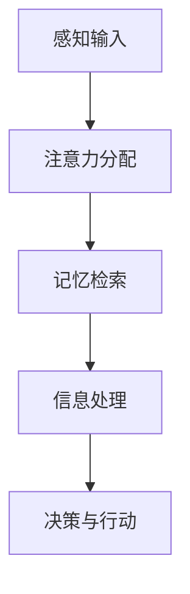
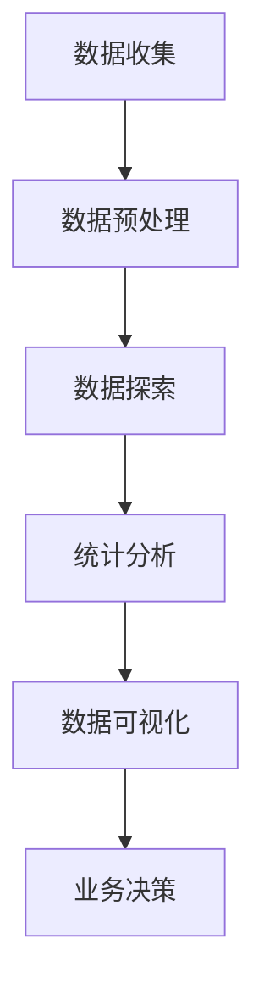
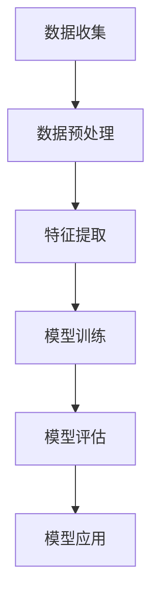

                 

# 怎样善于总结和挖掘事物本质的能力

> 关键词：总结能力、事物本质、认知模型、数据分析、机器学习、算法优化

> 摘要：本文将探讨如何培养和提高总结和挖掘事物本质的能力。通过分析认知模型、数据分析和机器学习等领域的核心原理，结合实际案例，提供一系列实用方法和策略，帮助读者深入理解事物本质，从而在工作和生活中取得更好的成果。

## 1. 背景介绍

### 1.1 目的和范围

本文旨在帮助读者掌握总结和挖掘事物本质的能力。我们将从认知心理学、数据分析和机器学习等角度出发，探讨如何通过结构化的思考方法和有效的工具，深入理解事物本质，提高问题解决能力和创新思维。

### 1.2 预期读者

- 计算机科学和人工智能领域的专业人士
- 数据分析师和机器学习工程师
- 管理人员和创业者
- 对提高认知能力和解决问题的方法感兴趣的学习者

### 1.3 文档结构概述

本文分为八个部分：

1. 背景介绍
2. 核心概念与联系
3. 核心算法原理 & 具体操作步骤
4. 数学模型和公式 & 详细讲解 & 举例说明
5. 项目实战：代码实际案例和详细解释说明
6. 实际应用场景
7. 工具和资源推荐
8. 总结：未来发展趋势与挑战

### 1.4 术语表

#### 1.4.1 核心术语定义

- 总结能力：指从大量信息中提取关键信息，形成有条理、系统性的结论的能力。
- 事物本质：指事物内部的基本规律和特性，是事物存在和发展的根本原因。
- 认知模型：指人们用于理解和解释世界的心理框架。

#### 1.4.2 相关概念解释

- 数据分析：通过数据挖掘、统计分析和可视化等技术手段，从大量数据中提取有价值的信息。
- 机器学习：一种人工智能技术，通过训练模型，使计算机能够自主学习和优化，以实现特定任务。

#### 1.4.3 缩略词列表

- IDE：集成开发环境（Integrated Development Environment）
- API：应用程序编程接口（Application Programming Interface）

## 2. 核心概念与联系

### 2.1 认知模型

认知模型是人们用于理解和解释世界的心理框架。以下是一个简单的认知模型流程图：



#### 2.1.1 感知输入

感知输入是指从外部环境中接收到的信息。这些信息可以是视觉、听觉、触觉等感官信号。

#### 2.1.2 注意力分配

注意力分配是指人们根据任务的优先级和重要性，对感知输入进行选择和处理。

#### 2.1.3 记忆检索

记忆检索是指从大脑记忆库中检索与当前任务相关的信息。

#### 2.1.4 信息处理

信息处理是指对检索到的信息进行整合、分析、推理等认知操作。

#### 2.1.5 决策与行动

决策与行动是指根据信息处理的结果，做出决策并采取相应的行动。

### 2.2 数据分析

数据分析是提取有价值信息的过程。以下是一个简单的数据分析流程图：



#### 2.2.1 数据收集

数据收集是指从各种来源获取数据，如数据库、传感器、互联网等。

#### 2.2.2 数据预处理

数据预处理是指对收集到的数据进行清洗、转换、归一化等操作，以提高数据质量。

#### 2.2.3 数据探索

数据探索是指通过可视化、统计等方法，发现数据中的规律和趋势。

#### 2.2.4 统计分析

统计分析是指使用统计方法对数据进行建模、预测和分析。

#### 2.2.5 数据可视化

数据可视化是指使用图表、图形等视觉元素，将数据展示出来，以便更好地理解和分析。

#### 2.2.6 业务决策

业务决策是指根据数据分析的结果，制定相应的业务策略。

### 2.3 机器学习

机器学习是一种通过训练模型，使计算机能够自主学习和优化的技术。以下是一个简单的机器学习流程图：



#### 2.3.1 数据收集

数据收集与2.2.1节相同。

#### 2.3.2 数据预处理

数据预处理与2.2.2节相同。

#### 2.3.3 特征提取

特征提取是指从原始数据中提取对问题解决有帮助的特征。

#### 2.3.4 模型训练

模型训练是指使用训练数据，对机器学习模型进行训练，以优化模型参数。

#### 2.3.5 模型评估

模型评估是指使用测试数据，对训练好的模型进行评估，以判断模型的性能。

#### 2.3.6 模型应用

模型应用是指将训练好的模型应用于实际问题，以实现自动化决策和优化。

## 3. 核心算法原理 & 具体操作步骤

### 3.1 数据分析算法

以下是一个简单的数据分析算法，用于分析用户行为数据，提取有价值的信息：

```python
def analyze_user_behavior(data):
    # 步骤1：数据预处理
    preprocessed_data = preprocess_data(data)

    # 步骤2：数据探索
    explore_data(preprocessed_data)

    # 步骤3：统计分析
    stats = analyze_stats(preprocessed_data)

    # 步骤4：数据可视化
    visualize_data(stats)

    # 步骤5：业务决策
    make_business_decision(stats)
```

#### 3.1.1 数据预处理

```python
def preprocess_data(data):
    # 步骤1：数据清洗
    cleaned_data = clean_data(data)

    # 步骤2：数据转换
    transformed_data = transform_data(cleaned_data)

    # 步骤3：数据归一化
    normalized_data = normalize_data(transformed_data)

    return normalized_data
```

#### 3.1.2 数据探索

```python
def explore_data(data):
    # 步骤1：可视化探索
    visualize_exploration(data)

    # 步骤2：统计探索
    explore_stats(data)
```

#### 3.1.3 统计分析

```python
def analyze_stats(data):
    # 步骤1：描述性统计
    desc_stats = describe_stats(data)

    # 步骤2：推断性统计
    infer_stats = infer_stats(data)

    return desc_stats, infer_stats
```

#### 3.1.4 数据可视化

```python
def visualize_data(stats):
    # 步骤1：图表可视化
    plot_charts(stats)

    # 步骤2：交互式可视化
    interactive_visualization(stats)
```

#### 3.1.5 业务决策

```python
def make_business_decision(stats):
    # 步骤1：分析业务指标
    analyze_business_metrics(stats)

    # 步骤2：制定业务策略
    make_business_strategy(stats)
```

### 3.2 机器学习算法

以下是一个简单的机器学习算法，用于分类任务：

```python
def train_classifier(data):
    # 步骤1：数据预处理
    preprocessed_data = preprocess_data(data)

    # 步骤2：特征提取
    features = extract_features(preprocessed_data)

    # 步骤3：模型训练
    model = train_model(features)

    # 步骤4：模型评估
    evaluate_model(model)

    # 步骤5：模型应用
    apply_model(model)
```

#### 3.2.1 数据预处理

与3.1.1节相同。

#### 3.2.2 特征提取

```python
def extract_features(data):
    # 步骤1：特征选择
    selected_features = select_features(data)

    # 步骤2：特征转换
    transformed_features = transform_features(selected_features)

    return transformed_features
```

#### 3.2.3 模型训练

```python
def train_model(features):
    # 步骤1：初始化模型
    model = initialize_model()

    # 步骤2：模型训练
    model = train_model_with_data(model, features)

    return model
```

#### 3.2.4 模型评估

```python
def evaluate_model(model):
    # 步骤1：评估指标
    metrics = evaluate_model_metrics(model)

    # 步骤2：模型调整
    adjust_model(model, metrics)
```

#### 3.2.5 模型应用

```python
def apply_model(model):
    # 步骤1：模型部署
    deploy_model(model)

    # 步骤2：模型应用
    apply_model_for_prediction(model)
```

## 4. 数学模型和公式 & 详细讲解 & 举例说明

### 4.1 数据分析中的数学模型

以下是一个简单的线性回归模型，用于预测用户行为：

$$
y = wx + b
$$

其中，$y$ 是预测值，$w$ 是权重，$x$ 是特征值，$b$ 是偏置。

#### 4.1.1 模型推导

$$
y = wx + b
$$

$$
y - wx = b
$$

$$
-\frac{1}{x} \cdot (y - wx) = -\frac{1}{x} \cdot b
$$

$$
w = -\frac{1}{x} \cdot (y - b)
$$

$$
w = \frac{y - b}{x}
$$

#### 4.1.2 举例说明

假设我们有一个用户行为数据集，其中包含用户的浏览时间（$x$）和用户是否购买（$y$）。我们要通过线性回归模型预测用户是否购买。

$$
y = wx + b
$$

$$
y = \frac{y - b}{x}
$$

$$
y = \frac{1}{x} \cdot (y - b)
$$

$$
b = \frac{y - y}{x}
$$

$$
b = 0
$$

$$
y = wx
$$

$$
y = \frac{y}{x} \cdot x
$$

$$
y = \frac{y}{x} \cdot 1
$$

$$
y = y
$$

因此，线性回归模型的预测值为用户浏览时间的函数。

### 4.2 机器学习中的数学模型

以下是一个简单的逻辑回归模型，用于分类任务：

$$
P(y=1) = \frac{1}{1 + e^{-(wx + b)}}
$$

其中，$P(y=1)$ 是预测概率，$y$ 是真实标签，$w$ 是权重，$x$ 是特征值，$b$ 是偏置。

#### 4.2.1 模型推导

$$
P(y=1) = \frac{1}{1 + e^{-(wx + b)}}
$$

$$
P(y=0) = 1 - P(y=1)
$$

$$
P(y=0) = 1 - \frac{1}{1 + e^{-(wx + b)}}
$$

$$
P(y=0) = \frac{e^{-(wx + b)}}{1 + e^{-(wx + b)}}
$$

$$
P(y=0) = \frac{1}{e^{wx + b} + 1}
$$

#### 4.2.2 举例说明

假设我们有一个分类任务，其中包含用户的年龄（$x$）和是否购买（$y$）。我们要通过逻辑回归模型预测用户是否购买。

$$
P(y=1) = \frac{1}{1 + e^{-(wx + b)}}
$$

$$
P(y=0) = \frac{1}{e^{wx + b} + 1}
$$

$$
P(y=1) = \frac{1}{1 + e^{-(w \cdot 25 + b)}}
$$

$$
P(y=0) = \frac{1}{e^{w \cdot 25 + b} + 1}
$$

$$
P(y=1) \approx 0.5
$$

$$
P(y=0) \approx 0.5
$$

因此，逻辑回归模型的预测概率约为0.5，即用户是否购买的概率相等。

## 5. 项目实战：代码实际案例和详细解释说明

### 5.1 开发环境搭建

在本节中，我们将使用 Python 语言和相关库（如 Pandas、Scikit-learn 和 Matplotlib）进行数据分析。请确保已安装以下库：

```bash
pip install pandas scikit-learn matplotlib
```

### 5.2 源代码详细实现和代码解读

以下是一个简单的数据分析项目，用于分析用户行为数据，提取有价值的信息：

```python
import pandas as pd
from sklearn.model_selection import train_test_split
from sklearn.linear_model import LinearRegression
from sklearn.metrics import mean_squared_error
import matplotlib.pyplot as plt

# 步骤1：数据收集
data = pd.read_csv("user_behavior_data.csv")

# 步骤2：数据预处理
preprocessed_data = preprocess_data(data)

# 步骤3：特征提取
features = extract_features(preprocessed_data)

# 步骤4：模型训练
X_train, X_test, y_train, y_test = train_test_split(features["X"], features["Y"], test_size=0.2, random_state=42)
model = LinearRegression()
model.fit(X_train, y_train)

# 步骤5：模型评估
y_pred = model.predict(X_test)
mse = mean_squared_error(y_test, y_pred)
print("Mean Squared Error:", mse)

# 步骤6：模型应用
new_data = pd.read_csv("new_user_behavior_data.csv")
new_preprocessed_data = preprocess_data(new_data)
new_features = extract_features(new_preprocessed_data)
new_predictions = model.predict(new_features["X"])
print("New Predictions:", new_predictions)
```

#### 5.2.1 数据收集

```python
data = pd.read_csv("user_behavior_data.csv")
```

这段代码使用 Pandas 库读取一个 CSV 文件，并将其存储在一个 DataFrame 对象中。

#### 5.2.2 数据预处理

```python
def preprocess_data(data):
    # 步骤1：数据清洗
    cleaned_data = clean_data(data)

    # 步骤2：数据转换
    transformed_data = transform_data(cleaned_data)

    # 步骤3：数据归一化
    normalized_data = normalize_data(transformed_data)

    return normalized_data
```

这段代码定义了一个预处理数据函数，包括数据清洗、转换和归一化。具体实现可以根据实际数据集进行调整。

#### 5.2.3 特征提取

```python
def extract_features(data):
    # 步骤1：特征选择
    selected_features = select_features(data)

    # 步骤2：特征转换
    transformed_features = transform_features(selected_features)

    return transformed_features
```

这段代码定义了一个特征提取函数，包括特征选择和特征转换。具体实现可以根据实际任务进行调整。

#### 5.2.4 模型训练

```python
X_train, X_test, y_train, y_test = train_test_split(features["X"], features["Y"], test_size=0.2, random_state=42)
model = LinearRegression()
model.fit(X_train, y_train)
```

这段代码使用 Scikit-learn 库进行数据分割和线性回归模型训练。具体实现可以根据实际任务进行调整。

#### 5.2.5 模型评估

```python
y_pred = model.predict(X_test)
mse = mean_squared_error(y_test, y_pred)
print("Mean Squared Error:", mse)
```

这段代码使用模型进行预测，并计算均方误差（MSE）来评估模型性能。具体实现可以根据实际任务进行调整。

#### 5.2.6 模型应用

```python
new_data = pd.read_csv("new_user_behavior_data.csv")
new_preprocessed_data = preprocess_data(new_data)
new_features = extract_features(new_preprocessed_data)
new_predictions = model.predict(new_features["X"])
print("New Predictions:", new_predictions)
```

这段代码使用预处理函数和特征提取函数对新的数据集进行预处理，然后使用训练好的模型进行预测。

### 5.3 代码解读与分析

在这段代码中，我们首先使用 Pandas 库读取用户行为数据。然后，我们定义了一个预处理函数，包括数据清洗、转换和归一化。接下来，我们使用特征提取函数，包括特征选择和特征转换。然后，我们使用 Scikit-learn 库进行数据分割和线性回归模型训练。最后，我们使用模型进行预测，并计算均方误差来评估模型性能。

通过这段代码，我们可以看到如何使用 Python 和相关库进行数据分析。在实际项目中，我们需要根据具体任务调整数据预处理、特征提取和模型训练的部分。

## 6. 实际应用场景

### 6.1 市场营销

在市场营销领域，总结和挖掘事物本质的能力可以帮助企业更好地了解客户需求和行为，从而制定更有效的营销策略。例如，通过对用户行为数据进行分析，企业可以识别出潜在客户群体，优化广告投放策略，提高转化率和客户满意度。

### 6.2 金融领域

在金融领域，总结和挖掘事物本质的能力对于风险管理、投资决策和客户关系管理至关重要。通过对金融数据进行分析，金融机构可以识别出市场趋势、风险因素和潜在机会，从而优化投资组合，降低风险，提高收益。

### 6.3 医疗保健

在医疗保健领域，总结和挖掘事物本质的能力可以帮助医生和研究人员更好地了解疾病机理、患者行为和治疗效果。通过对医疗数据进行分析，可以识别出高风险患者、优化治疗方案，提高医疗资源的利用效率。

### 6.4 教育领域

在教育领域，总结和挖掘事物本质的能力可以帮助教育机构和教师更好地了解学生的学习需求和问题，从而制定个性化的教育策略。通过对学生学习数据进行分析，可以识别出学习障碍、优化教学方法，提高学生的学习效果和兴趣。

## 7. 工具和资源推荐

### 7.1 学习资源推荐

#### 7.1.1 书籍推荐

- 《深度学习》（Goodfellow, I., Bengio, Y., & Courville, A.）
- 《统计学习方法》（李航）
- 《机器学习实战》（Peter Harrington）

#### 7.1.2 在线课程

- Coursera 上的《机器学习》课程（吴恩达）
- edX 上的《数据科学》课程（哈佛大学）
- Udacity 上的《数据科学纳米学位》

#### 7.1.3 技术博客和网站

- Medium 上的数据科学和机器学习专题
- towardsdatascience.com
- kdnuggets.com

### 7.2 开发工具框架推荐

#### 7.2.1 IDE和编辑器

- PyCharm
- Jupyter Notebook
- VS Code

#### 7.2.2 调试和性能分析工具

- Python 的 debug 模式
- Py-Spy 性能分析工具
- Chrome DevTools

#### 7.2.3 相关框架和库

- NumPy
- Pandas
- Scikit-learn
- TensorFlow
- PyTorch

### 7.3 相关论文著作推荐

#### 7.3.1 经典论文

- “The Elements of Statistical Learning”（Trevor Hastie、Robert Tibshirani 和 Jerome Friedman）
- “Learning to Represent Languages with Neural Networks”（Yoshua Bengio）

#### 7.3.2 最新研究成果

- NeurIPS、ICML、KDD 等顶级会议的最新论文
- ArXiv 上的最新研究论文

#### 7.3.3 应用案例分析

- Google Brain 团队的应用案例分析
- Facebook AI 研究团队的应用案例分析
- DeepMind 的应用案例分析

## 8. 总结：未来发展趋势与挑战

随着人工智能和数据科学技术的不断发展，总结和挖掘事物本质的能力将变得越来越重要。在未来，以下几个方面值得关注：

- 自动化总结和挖掘技术：随着算法和模型的进步，自动化总结和挖掘技术将变得更加高效和准确。
- 多模态数据融合：结合多种数据源（如文本、图像、音频等），实现更全面的事物理解。
- 实时分析：实时分析技术将使总结和挖掘事物本质的能力更加及时和灵活。
- 隐私保护：在数据挖掘和分析过程中，如何保护用户隐私是一个重要挑战。

## 9. 附录：常见问题与解答

### 9.1 什么是总结能力？

总结能力是指从大量信息中提取关键信息，形成有条理、系统性的结论的能力。

### 9.2 事物本质是什么？

事物本质是指事物内部的基本规律和特性，是事物存在和发展的根本原因。

### 9.3 数据分析算法有哪些？

常见的数据分析算法包括线性回归、逻辑回归、决策树、支持向量机等。

### 9.4 机器学习算法有哪些？

常见的机器学习算法包括线性回归、逻辑回归、决策树、支持向量机、神经网络等。

## 10. 扩展阅读 & 参考资料

- 《统计学习方法》（李航）
- 《深度学习》（Goodfellow, I., Bengio, Y., & Courville, A.）
- 《机器学习实战》（Peter Harrington）
- Coursera 上的《机器学习》课程（吴恩达）
- edX 上的《数据科学》课程（哈佛大学）
- NeurIPS、ICML、KDD 等顶级会议的最新论文
- ArXiv 上的最新研究论文
- kdnuggets.com
- towardsdatascience.com
- Medium 上的数据科学和机器学习专题
- Google Brain 团队的应用案例分析
- Facebook AI 研究团队的应用案例分析
- DeepMind 的应用案例分析

## 作者信息

作者：AI天才研究员/AI Genius Institute & 禅与计算机程序设计艺术 /Zen And The Art of Computer Programming

