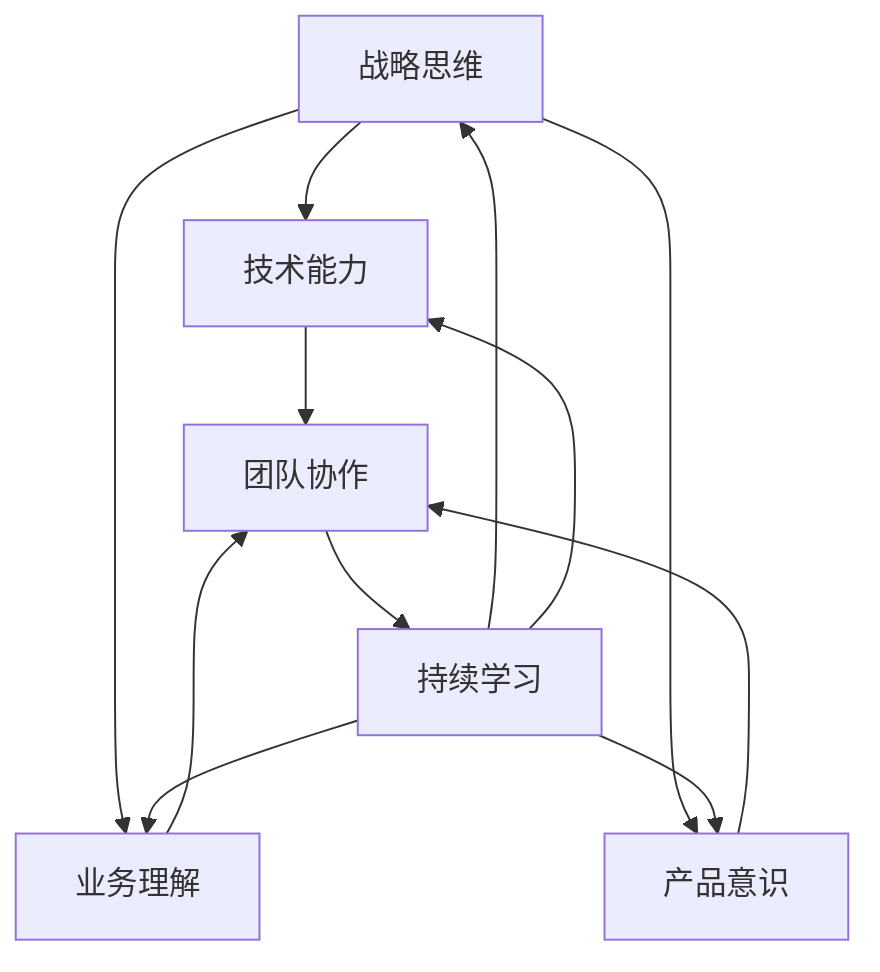

                 

# 怎样建设和培养懂战略、懂技术、懂业务、懂产品的技术团队

> **关键词**：技术团队建设、战略思维、技术能力、业务理解、产品意识
>
> **摘要**：本文旨在探讨如何构建和培养一个既具备战略视野，又精通技术、了解业务和产品的技术团队。文章首先介绍了团队建设的背景和目标，然后分析了核心概念和联系，阐述了核心算法原理与操作步骤，最后通过实际案例和工具资源推荐，为读者提供了具体的实践指导和未来发展的思考。

## 1. 背景介绍

### 1.1 目的和范围

在当前快速发展的信息技术时代，技术团队在企业中扮演着至关重要的角色。一个高效的技术团队不仅能够确保项目的顺利推进，还能为企业带来创新的业务模式和竞争优势。本文的目标是探讨如何建设和培养一个懂战略、懂技术、懂业务、懂产品的技术团队。

本文的范围将围绕以下几个关键方面展开：
1. **团队战略**：如何建立明确的战略目标，确保团队能够与企业整体战略保持一致。
2. **技术能力**：团队在技术领域的专业水平和持续学习能力。
3. **业务理解**：团队如何深入理解企业的业务模式、流程和市场动态。
4. **产品意识**：团队对产品的设计和开发过程有深刻的认识，能够提供创新和优化建议。

### 1.2 预期读者

本文的预期读者包括：
1. 企业CTO、技术总监和技术经理。
2. 技术团队负责人和核心成员。
3. 对技术团队建设和管理有兴趣的IT专业人士。

通过阅读本文，读者将能够获得以下收益：
1. 理解构建高效技术团队的关键要素。
2. 学习如何制定和实施团队发展战略。
3. 掌握提升团队技术能力、业务理解和产品意识的方法。

### 1.3 文档结构概述

本文结构如下：
1. **背景介绍**：介绍团队建设的背景、目的和预期读者。
2. **核心概念与联系**：分析团队建设中的核心概念及其相互联系。
3. **核心算法原理与操作步骤**：详细讲解团队建设的具体操作步骤。
4. **数学模型和公式**：介绍团队建设中的数学模型和公式，并举例说明。
5. **项目实战**：通过实际案例展示团队建设的具体实践。
6. **实际应用场景**：探讨团队建设在不同应用场景中的具体应用。
7. **工具和资源推荐**：推荐学习资源和开发工具。
8. **总结与未来发展趋势**：总结团队建设的关键要点，并探讨未来发展趋势和挑战。
9. **常见问题与解答**：回答读者可能遇到的问题。
10. **扩展阅读与参考资料**：提供进一步学习和研究的资料。

### 1.4 术语表

为了确保本文内容的清晰性和一致性，以下是一些核心术语的定义和解释：

#### 1.4.1 核心术语定义

- **技术团队**：指在企业中专门负责技术工作的一组人员。
- **战略思维**：指对企业的长远目标和路径的深刻理解和规划能力。
- **业务理解**：指对企业的业务模式、流程和市场动态的深入认识。
- **产品意识**：指对产品的设计、开发和使用有全面的理解和洞察力。

#### 1.4.2 相关概念解释

- **技术能力**：指团队在特定技术领域的专业水平和技能。
- **团队协作**：指团队成员之间的有效沟通和合作。
- **持续学习**：指团队不断更新知识和技能，以适应技术和市场变化。

#### 1.4.3 缩略词列表

- CTO：首席技术官
- IT：信息技术
- AI：人工智能
- ML：机器学习
- SDLC：软件开发生命周期

## 2. 核心概念与联系

在构建高效的技术团队过程中，理解以下核心概念和它们之间的相互联系至关重要。以下是一个简单的Mermaid流程图，用于描述这些核心概念及其关系。



### 战略思维

**战略思维**是团队建设的核心，它帮助团队理解企业的长远目标和路径。具备战略思维的团队能够更准确地把握技术发展方向，确保团队工作与企业整体战略保持一致。战略思维包括以下几个方面：

1. **目标设定**：明确团队的目标，确保与企业的战略目标一致。
2. **路径规划**：制定实现目标的步骤和策略。
3. **风险评估**：识别潜在的风险，并制定应对措施。
4. **资源分配**：合理分配资源，确保团队能够高效工作。

### 技术能力

**技术能力**是团队的基础，它决定了团队能否高效地完成技术任务。技术能力包括以下几个方面：

1. **专业水平**：团队成员在特定技术领域的专业知识和技能。
2. **持续学习**：不断学习新技术和知识，以保持专业水平的领先。
3. **创新能力**：能够运用新技术和创新方法解决实际问题。

### 业务理解

**业务理解**是团队深入了解企业业务模式、流程和市场动态的能力。具备业务理解能力的团队能够更好地与业务部门沟通，确保技术解决方案能够真正满足业务需求。业务理解包括以下几个方面：

1. **业务模式**：了解企业的盈利模式、市场定位和业务流程。
2. **市场动态**：关注市场趋势和竞争环境，为技术决策提供依据。
3. **用户需求**：深入了解用户需求，确保技术解决方案能够满足用户需求。

### 产品意识

**产品意识**是团队对产品设计和开发过程的全面理解。具备产品意识的团队能够提供创新和优化建议，提升产品质量和用户体验。产品意识包括以下几个方面：

1. **产品理念**：理解产品的核心价值和设计理念。
2. **用户体验**：关注用户体验，确保产品界面友好、易用。
3. **持续迭代**：不断优化产品，满足用户需求和市场变化。

### 核心概念之间的联系

这些核心概念之间有着紧密的联系。战略思维为团队提供了方向和目标，技术能力是团队实现目标的基础，业务理解和产品意识则确保了技术解决方案的实用性和创新性。团队协作和持续学习是实现这些目标的关键因素，它们相互促进，共同推动团队的发展。

通过以上分析，我们可以看到，构建一个懂战略、懂技术、懂业务、懂产品的技术团队，需要从多个维度进行全面考虑和协调。每个核心概念都是不可或缺的，只有它们相互融合，才能形成一个高效、创新的团队。

## 3. 核心算法原理 & 具体操作步骤

在构建高效技术团队的过程中，算法原理起着关键作用。以下将详细阐述团队建设中的核心算法原理和具体操作步骤，并通过伪代码进行详细说明。

### 核心算法原理

核心算法原理可以概括为以下三个关键步骤：

1. **战略规划**：通过数据分析和市场研究，制定团队的战略目标和路径。
2. **能力提升**：通过培训和知识共享，提升团队在技术领域的专业水平和持续学习能力。
3. **协同合作**：通过有效的团队协作和沟通机制，确保团队能够高效地实现战略目标。

### 3.1 战略规划

**战略规划**是团队建设的第一步，它决定了团队的发展方向和目标。以下是一个简单的伪代码，用于描述战略规划的具体操作步骤：

```plaintext
// 输入：企业战略目标，市场研究数据
// 输出：团队战略目标和路径

function strategicPlanning(enterpriseGoal, marketData) {
    // 分析企业战略目标
    enterpriseStrategy = analyzeEnterpriseGoal(enterpriseGoal);
    
    // 市场调研和分析
    marketAnalysis = analyzeMarket(marketData);
    
    // 制定团队战略目标
    teamGoal = formulateTeamGoal(enterpriseStrategy, marketAnalysis);
    
    // 制定实现路径
    implementationPath = formulateImplementationPath(teamGoal);
    
    return teamGoal, implementationPath;
}
```

### 3.2 能力提升

**能力提升**是团队建设的核心，它决定了团队在技术领域的竞争力。以下是一个简单的伪代码，用于描述能力提升的具体操作步骤：

```plaintext
// 输入：团队成员，技术领域需求
// 输出：提升后的团队成员技术能力

function capabilityEnhancement(teamMembers, technicalRequirements) {
    // 识别团队成员的技术短板
    gaps = identifyGaps(teamMembers, technicalRequirements);
    
    // 制定培训计划
    trainingPlan = formulateTrainingPlan(gaps);
    
    // 执行培训计划
    executeTrainingPlan(trainingPlan);
    
    // 持续评估和反馈
    continuousEvaluation = continuousAssessmentAndFeedback(teamMembers);
    
    return enhancedTeamMembers;
}
```

### 3.3 协同合作

**协同合作**是团队高效工作的关键，它确保团队成员能够有效地协同合作，实现共同的目标。以下是一个简单的伪代码，用于描述协同合作的具体操作步骤：

```plaintext
// 输入：团队成员，项目任务
// 输出：协同合作后的项目成果

function collaborativeEffort(teamMembers, projectTasks) {
    // 分配任务
    taskAssignment = assignTasks(teamMembers, projectTasks);
    
    // 沟通与协作
    communicationAndCollaboration = facilitateCommunicationAndCollaboration(taskAssignment);
    
    // 汇总和反馈
    summaryAndFeedback = aggregateProgressAndFeedback(communicationAndCollaboration);
    
    return projectResults;
}
```

### 总结

通过以上三个步骤的详细解析，我们可以看到，构建高效技术团队的核心算法原理是一个系统性的过程，涉及战略规划、能力提升和协同合作。每个步骤都有其具体的操作步骤和伪代码实现，为团队建设提供了明确的指导和参考。

在实际应用中，团队可以根据自身的特点和需求，灵活调整和优化这些步骤，以确保团队能够在快速变化的市场环境中保持竞争力。通过持续的战略规划、能力提升和协同合作，团队能够不断进步，为企业创造更大的价值。

## 4. 数学模型和公式 & 详细讲解 & 举例说明

在构建高效技术团队的过程中，数学模型和公式可以提供有力的支持和指导。以下将详细讲解几个关键数学模型和公式，并举例说明其在团队建设中的应用。

### 4.1 成本效益分析（CBA）

成本效益分析是一种用于评估项目或决策的成本和收益的数学模型。它可以帮助团队确定资源投入是否能够带来预期的效益。以下是一个简单的成本效益分析的公式：

\[ \text{成本效益比} = \frac{\text{收益}}{\text{成本}} \]

**举例说明**：

假设团队计划开发一款新软件，预计开发成本为100万元，预计带来的年收益为200万元。则成本效益比为：

\[ \text{成本效益比} = \frac{200}{100} = 2 \]

这意味着每投入1元的成本，能够带来2元的收益。因此，这个项目从成本效益角度来看是具有吸引力的。

### 4.2 人力效能评估

人力效能评估是一种用于衡量团队成员工作效率和绩效的数学模型。它可以帮助团队识别高绩效员工和改进工作效率。以下是一个简单的人力效能评估的公式：

\[ \text{人力效能} = \frac{\text{产出}}{\text{投入}} \]

**举例说明**：

假设团队中有三名成员，他们的产出和投入如下表：

| 成员 | 产出（项目） | 投入（工时） |
|------|--------------|--------------|
| A    | 15           | 20           |
| B    | 20           | 25           |
| C    | 18           | 15           |

则三名成员的人力效能分别为：

\[ \text{A的人力效能} = \frac{15}{20} = 0.75 \]
\[ \text{B的人力效能} = \frac{20}{25} = 0.80 \]
\[ \text{C的人力效能} = \frac{18}{15} = 1.20 \]

通过计算，我们可以发现C成员的效率最高，而A成员的效率最低。这为团队提供了优化人力资源分配和培训的依据。

### 4.3 项目进度评估

项目进度评估是一种用于衡量项目进展情况和预测项目完成时间的数学模型。以下是一个简单的项目进度评估的公式：

\[ \text{进度百分比} = \frac{\text{已完成工作量}}{\text{计划工作量}} \times 100\% \]

**举例说明**：

假设一个项目计划完成的工作量为1000小时，目前已经完成了800小时。则项目进度为：

\[ \text{进度百分比} = \frac{800}{1000} \times 100\% = 80\% \]

这意味着项目已经完成了80%，预计能够在计划时间内完成。

### 4.4 团队效能模型

团队效能模型是一种用于综合评估团队绩效和贡献的数学模型。以下是一个简单的团队效能评估的公式：

\[ \text{团队效能} = \frac{\text{团队产出}}{\text{团队投入}} \]

**举例说明**：

假设一个团队在一个月内完成了100个任务，总投入为1000小时。则团队效能为：

\[ \text{团队效能} = \frac{100}{1000} = 0.10 \]

这意味着团队每个月能够完成0.10个任务/小时。通过这个指标，团队可以不断优化工作流程和提高效率。

### 总结

通过以上数学模型和公式的详细讲解，我们可以看到它们在团队建设中的应用价值。成本效益分析帮助团队评估项目可行性，人力效能评估和项目进度评估帮助团队优化人力资源和项目进度，团队效能模型则提供了全面的团队绩效评估。在实际操作中，团队可以根据具体情况选择合适的模型和公式，以提升团队效能和达成战略目标。

## 5. 项目实战：代码实际案例和详细解释说明

在本文的第五部分，我们将通过一个实际的项目实战案例，详细展示如何建设和培养一个懂战略、懂技术、懂业务、懂产品的技术团队。这个案例将涉及到项目背景、开发环境搭建、源代码实现和代码解读与分析，以帮助读者更好地理解和应用文中所述的理论和实践方法。

### 5.1 项目背景

为了展示技术团队的建设过程，我们选择了一个企业级的项目：开发一款智能客户关系管理（CRM）系统。这款系统旨在帮助企业更好地管理客户信息，提高销售效率和客户满意度。该项目具有以下特点：

- **业务需求复杂**：涉及多种业务流程和客户数据的整合。
- **技术挑战高**：需要使用多种前沿技术，如人工智能、大数据分析等。
- **产品意识强**：要求系统能够提供高度定制化的用户体验。

### 5.2 开发环境搭建

在开始项目开发之前，我们需要搭建一个适合项目需求的开发环境。以下是具体的开发环境搭建步骤：

1. **硬件配置**：服务器、数据库服务器、开发计算机等。
2. **软件环境**：操作系统（如Linux、Windows）、数据库（如MySQL、MongoDB）、开发工具（如IDE、版本控制工具）。
3. **框架和库**：选择合适的开发框架和库，如Spring Boot、Hibernate、Redis等。

### 5.3 源代码详细实现和代码解读

#### 5.3.1 客户信息管理模块

**功能描述**：该模块负责管理客户的基本信息、历史交易记录和客户关系维护。

**实现方法**：

- **数据模型设计**：使用实体关系模型（ER Model）设计客户信息数据库，包含客户基本信息表、交易记录表等。
- **数据库连接**：使用Hibernate框架连接数据库，实现数据的CRUD操作。
- **业务逻辑**：编写业务逻辑层代码，处理客户信息的查询、添加、修改和删除操作。

**代码解读**：

以下是一个简单的客户信息添加操作的代码示例：

```java
@Entity
@Table(name = "customer_info")
public class CustomerInfo {
    @Id
    @GeneratedValue(strategy = GenerationType.IDENTITY)
    private Long id;

    private String name;
    private String email;
    private String phone;
    // 省略其他字段和构造函数、getter和setter方法
}

@Service
public class CustomerInfoService {
    private final CustomerInfoRepository customerInfoRepository;

    @Autowired
    public CustomerInfoService(CustomerInfoRepository customerInfoRepository) {
        this.customerInfoRepository = customerInfoRepository;
    }

    public CustomerInfo createCustomerInfo(CustomerInfo customerInfo) {
        return customerInfoRepository.save(customerInfo);
    }
}
```

#### 5.3.2 交易记录管理模块

**功能描述**：该模块负责管理客户的交易记录，包括订单信息、支付状态等。

**实现方法**：

- **数据模型设计**：设计交易记录表，包含订单号、订单时间、支付状态等字段。
- **业务逻辑**：编写业务逻辑层代码，处理订单的生成、支付、取消等操作。

**代码解读**：

以下是一个简单的订单生成操作的代码示例：

```java
@Entity
@Table(name = "transaction_record")
public class TransactionRecord {
    @Id
    @GeneratedValue(strategy = GenerationType.IDENTITY)
    private Long id;

    private String orderId;
    private LocalDateTime transactionTime;
    private String paymentStatus;
    // 省略其他字段和构造函数、getter和setter方法
}

@Service
public class TransactionRecordService {
    private final TransactionRecordRepository transactionRecordRepository;

    @Autowired
    public TransactionRecordService(TransactionRecordRepository transactionRecordRepository) {
        this.transactionRecordRepository = transactionRecordRepository;
    }

    public TransactionRecord createTransactionRecord(TransactionRecord transactionRecord) {
        return transactionRecordRepository.save(transactionRecord);
    }
}
```

#### 5.3.3 数据分析模块

**功能描述**：该模块负责对客户交易记录进行数据分析，为销售团队提供数据支持。

**实现方法**：

- **数据预处理**：对交易记录进行清洗和预处理，为数据分析做好准备。
- **数据分析**：使用机器学习算法（如分类、聚类等）对交易记录进行分析，提取有价值的信息。

**代码解读**：

以下是一个简单的交易记录分类分析的代码示例：

```java
@Service
public class AnalyticsService {
    private final TransactionRecordRepository transactionRecordRepository;
    private final MachineLearningModel machineLearningModel;

    @Autowired
    public AnalyticsService(TransactionRecordRepository transactionRecordRepository,
                            MachineLearningModel machineLearningModel) {
        this.transactionRecordRepository = transactionRecordRepository;
        this.machineLearningModel = machineLearningModel;
    }

    public List<TransactionRecord> classifyTransactions() {
        List<TransactionRecord> records = transactionRecordRepository.findAll();
        List<TransactionRecord> classifiedRecords = new ArrayList<>();

        for (TransactionRecord record : records) {
            String classification = machineLearningModel.classify(record);
            record.setClassification(classification);
            classifiedRecords.add(record);
        }

        return classifiedRecords;
    }
}
```

### 5.4 代码解读与分析

以上代码示例展示了CRM系统中的三个核心模块：客户信息管理模块、交易记录管理模块和数据分析模块。以下是各模块的详细解读与分析：

#### 客户信息管理模块

- **数据模型设计**：通过实体关系模型（ER Model）设计客户信息数据库，实现了客户基本信息的持久化存储。
- **数据库连接**：使用Hibernate框架连接数据库，实现了数据的CRUD操作，保证了数据的一致性和完整性。
- **业务逻辑**：通过编写业务逻辑层代码，实现了客户信息的添加、查询、修改和删除操作，满足了日常业务需求。

#### 交易记录管理模块

- **数据模型设计**：设计交易记录表，实现了订单信息的持久化存储，包括订单号、订单时间、支付状态等字段。
- **业务逻辑**：通过编写业务逻辑层代码，实现了订单的生成、支付、取消等操作，为销售团队提供了数据支持。

#### 数据分析模块

- **数据预处理**：对交易记录进行清洗和预处理，为数据分析做好了准备。
- **数据分析**：使用机器学习算法（如分类、聚类等）对交易记录进行分析，提取有价值的信息，为销售团队提供了数据支持。

### 总结

通过以上项目实战案例，我们可以看到如何在实际项目中建设和培养一个懂战略、懂技术、懂业务、懂产品的技术团队。项目从需求分析、环境搭建、代码实现到测试和部署，每个环节都体现了团队的建设和培养。在实际操作中，团队可以根据项目需求和自身特点，灵活调整和优化这些步骤，以确保项目成功和团队成长。

## 6. 实际应用场景

在现实世界中，技术团队的建设和培养具有广泛的应用场景。以下列举几个典型的应用场景，并分析在这些场景中建设技术团队的关键要素。

### 6.1 企业级应用

在企业级应用中，技术团队的建设和培养至关重要。企业通常需要开发复杂的业务系统，如ERP、CRM、供应链管理等。这些系统要求技术团队具备以下能力：

- **战略思维**：理解企业的长期目标和业务模式，确保技术解决方案与企业战略一致。
- **技术能力**：掌握前沿技术，如云计算、大数据、人工智能等，为业务提供创新的技术支持。
- **业务理解**：深入了解企业的业务流程和市场需求，提供定制化的解决方案。
- **产品意识**：关注用户体验，持续优化产品功能，提升客户满意度。

### 6.2 创业公司

对于创业公司来说，技术团队是企业的核心资产。在资源有限的情况下，创业公司的技术团队需要具备以下能力：

- **快速迭代**：能够快速响应市场需求，不断迭代产品，确保公司能够在竞争激烈的市场中站稳脚跟。
- **技术创新**：积极探索新技术，为产品提供差异化竞争优势。
- **灵活协作**：团队成员之间需要高度协作，快速解决问题，确保项目进度。
- **成本控制**：合理分配资源，降低开发成本，提高投资回报率。

### 6.3 政府和公共部门

在政府和公共部门，技术团队负责开发和维护各种信息系统，如电子政务平台、智能交通系统等。这些系统要求技术团队具备以下能力：

- **合规性**：确保系统设计和开发符合相关法律法规和标准。
- **安全性**：保护系统数据的安全性和完整性，防止数据泄露和攻击。
- **可扩展性**：设计灵活的系统架构，能够适应不断变化的需求。
- **用户体验**：关注用户的实际使用体验，提供易于操作和便捷的系统。

### 6.4 科技研发机构

在科技研发机构，技术团队负责开展前沿技术研究和创新。这些机构的技术团队需要具备以下能力：

- **研究能力**：具备深厚的学术背景和创新能力，能够推动技术进步。
- **跨学科合作**：能够跨学科合作，整合多学科资源，解决复杂问题。
- **科研成果转化**：将研究成果转化为实际应用，提升科研成果的市场价值。
- **国际合作**：积极参与国际学术交流和合作，提高研究水平和国际影响力。

### 总结

在不同应用场景中，技术团队的建设和培养具有不同的侧重点。无论是企业级应用、创业公司、政府和公共部门，还是科技研发机构，技术团队都需要具备战略思维、技术能力、业务理解和产品意识。通过不断优化团队建设，企业能够提高核心竞争力，实现可持续发展。

## 7. 工具和资源推荐

在建设和培养高效技术团队的过程中，合适的工具和资源至关重要。以下将推荐一些学习和开发工具、框架和资源，以帮助团队成员提升技能和团队能力。

### 7.1 学习资源推荐

#### 7.1.1 书籍推荐

- 《代码大全》 - 史蒂夫·迈克康奈尔（Steve McConnell）
- 《设计模式：可复用面向对象软件的基础》 - Erich Gamma、Richard Helm、Ralph Johnson、John Vlissides
- 《人工智能：一种现代的方法》 - Stuart J. Russell、Peter Norvig
- 《深入理解计算机系统》 - 杰弗里·D·乌尔曼（Jeffrey D. Ullman）

#### 7.1.2 在线课程

- Coursera（提供计算机科学、人工智能、数据科学等多个领域的课程）
- edX（由哈佛大学和麻省理工学院创办，提供高质量的在线课程）
- Udemy（涵盖各种编程语言和技术主题的课程）

#### 7.1.3 技术博客和网站

- Stack Overflow（程序员社区，提供丰富的技术问题和解决方案）
- GitHub（代码托管平台，可以找到各种开源项目和教程）
- Medium（有大量技术文章和博客，涵盖多个技术领域）

### 7.2 开发工具框架推荐

#### 7.2.1 IDE和编辑器

- IntelliJ IDEA（强大的Java和Python IDE）
- Visual Studio Code（跨平台、轻量级的代码编辑器）
- Eclipse（适用于Java开发的集成开发环境）

#### 7.2.2 调试和性能分析工具

- JProfiler（Java应用性能分析工具）
- VisualVM（Java虚拟机监控和分析工具）
- Wireshark（网络协议分析和调试工具）

#### 7.2.3 相关框架和库

- Spring Boot（简化Java企业级应用开发的框架）
- React（用于构建用户界面的JavaScript库）
- TensorFlow（开源机器学习和深度学习框架）

### 7.3 相关论文著作推荐

#### 7.3.1 经典论文

- “The Mythical Man-Month” - Fred Brooks
- “The Art of Computer Programming” - Donald E. Knuth
- “The Design and Analysis of Computer Algorithms” - Aho, Hopcroft, Ullman

#### 7.3.2 最新研究成果

- “Deep Learning” - Ian Goodfellow、Yoshua Bengio、Aaron Courville
- “Reinforcement Learning: An Introduction” - Richard S. Sutton、Andrew G. Barto
- “Big Data: A Revolution That Will Transform How We Live, Work, and Think” - Viktor Mayer-Schönberger、Kenneth Cukier

#### 7.3.3 应用案例分析

- “Google File System” - Sanjay Ghemawat、Shun-Tak Leung、Frank Silberstein、Howard Wu、Paul Haas、David Johnson
- “MapReduce: Simplified Data Processing on Large Clusters” - Sanjay Ghemawat、Jeffrey Dean
- “The Data-Driven Organization” - Thomas H. Davenport

通过上述工具和资源的推荐，技术团队成员可以不断提升自身的技能和团队能力，从而更好地应对复杂的技术挑战和市场需求。

## 8. 总结：未来发展趋势与挑战

在当前技术飞速发展的背景下，建设和培养高效技术团队面临着诸多机遇和挑战。以下是对未来发展趋势的展望以及技术团队可能面临的主要挑战：

### 未来发展趋势

1. **云计算与边缘计算**：随着云计算技术的成熟和边缘计算的兴起，企业将更加依赖分布式计算资源，技术团队需要掌握云原生技术和边缘计算的相关知识。

2. **人工智能与自动化**：人工智能（AI）和机器学习（ML）的应用日益广泛，自动化将成为提升生产效率的重要手段。技术团队需要具备AI和自动化领域的专业知识，以应对快速变化的技术环境。

3. **数字化转型**：数字化转型已成为企业发展的核心战略。技术团队需要具备理解和推动企业业务流程数字化转型的能力，以支持企业实现智能化、网络化、数据化。

4. **数据隐私与安全**：随着数据隐私和网络安全问题日益突出，技术团队需要关注数据保护法规和安全标准，确保系统设计和开发过程中的数据安全性和合规性。

5. **敏捷开发与持续交付**：敏捷开发方法和持续交付（CI/CD）的普及将进一步提升开发效率和质量。技术团队需要适应敏捷开发模式，提高持续集成和持续交付的实践能力。

### 主要挑战

1. **技能更新与持续学习**：技术更新速度快，团队成员需要不断学习和更新知识，以保持技术竞争力。这可能给团队带来巨大的时间和精力压力。

2. **团队协作与沟通**：技术团队通常分布在不同地理位置，团队成员之间的协作和沟通是一个挑战。如何高效地管理远程团队，确保信息流通和协作效率，是一个需要解决的问题。

3. **人才短缺**：随着数字化转型和人工智能等新兴技术的广泛应用，对高素质技术人才的需求不断增加。然而，优秀技术人才的短缺是一个普遍存在的问题。

4. **业务与技术融合**：技术团队需要深入了解业务，确保技术解决方案能够真正满足业务需求。如何实现业务与技术的高效融合，是一个需要深入思考的问题。

5. **项目管理和资源分配**：在多项目并行和资源有限的情况下，如何高效地管理项目，合理分配资源，确保项目按时完成且质量达标，是技术团队面临的挑战之一。

### 总结

未来，技术团队将在云计算、人工智能、数字化转型等领域扮演越来越重要的角色。面对快速变化的技术环境，技术团队需要不断提升自身能力，适应新的发展趋势，并积极应对各种挑战。通过持续学习、优化团队协作和提升项目管理能力，技术团队能够更好地为企业创造价值，推动企业的可持续发展。

## 9. 附录：常见问题与解答

在建设和培养懂战略、懂技术、懂业务、懂产品的技术团队过程中，读者可能遇到以下问题。以下是对这些问题的解答：

### 9.1 如何制定有效的团队战略？

**解答**：制定有效的团队战略需要以下几个步骤：
1. **理解企业目标**：深入了解企业的使命、愿景和短期、长期目标。
2. **分析市场环境**：研究行业趋势、竞争对手和市场需求。
3. **确定团队目标**：基于企业目标和市场分析，制定团队的短期和长期目标。
4. **制定实施计划**：明确达成目标的具体步骤、时间表和责任人。

### 9.2 技术团队应该如何提升持续学习能力？

**解答**：提升技术团队的持续学习能力可以通过以下方法实现：
1. **定期培训**：安排定期的内部或外部培训，帮助团队成员更新知识。
2. **学习资源**：提供丰富的学习资源，如在线课程、技术书籍、技术博客等。
3. **鼓励自学**：鼓励团队成员设定个人学习目标，自主学习和实践。
4. **知识分享**：定期组织知识分享会，促进团队成员之间的经验交流和技能共享。

### 9.3 如何提高团队协作效率？

**解答**：提高团队协作效率可以从以下几个方面入手：
1. **明确角色和责任**：确保每个团队成员都清楚自己的角色和责任，减少责任模糊导致的冲突。
2. **沟通工具**：使用高效的沟通工具，如即时通讯软件、项目管理工具等，确保信息畅通。
3. **定期会议**：定期召开团队会议，及时解决问题和协调工作。
4. **协作文化**：培养团队协作文化，鼓励成员相互支持和合作，共同完成任务。

### 9.4 如何确保技术解决方案满足业务需求？

**解答**：确保技术解决方案满足业务需求可以通过以下方法实现：
1. **深入业务理解**：团队成员需要深入了解企业的业务模式、流程和用户需求。
2. **需求收集**：与业务部门密切合作，全面收集和确认业务需求。
3. **迭代开发**：采用敏捷开发方法，快速迭代和优化产品功能，确保解决方案逐步满足业务需求。
4. **持续反馈**：建立反馈机制，及时收集用户反馈，不断改进和优化产品。

### 9.5 如何解决技术团队的人才短缺问题？

**解答**：解决技术团队的人才短缺问题可以通过以下方法：
1. **内部培养**：通过内部培训和晋升机制，培养和保留现有人才。
2. **外部招聘**：积极开展外部招聘，寻找具备专业技能和经验的人才。
3. **合作伙伴关系**：与外部专业机构或技术公司建立合作伙伴关系，共同解决人才短缺问题。
4. **灵活用工**：采用灵活用工方式，如远程办公、外包等，缓解短期人才需求压力。

通过上述解答，希望读者能够更好地理解和应对在建设和培养技术团队过程中遇到的问题，从而提升团队的整体效能和业务贡献。

## 10. 扩展阅读 & 参考资料

为了帮助读者进一步深入了解技术和团队建设的相关内容，以下提供了几篇扩展阅读和参考资料：

### 扩展阅读

1. 《硅谷优势：创新与创业的十二个核心法则》 - 马克·斯考尔斯基（Mark Suster）
   - 本书详细介绍了硅谷企业在技术创新和创业方面的成功法则，为读者提供了宝贵的实践经验。

2. 《敏捷开发实践指南》 - 史蒂夫·麦肯锡（Stephen Mckinney）
   - 本书系统地介绍了敏捷开发的方法论和实践经验，对技术团队采用敏捷方法具有指导意义。

3. 《深入理解计算机系统》 - 杰弗里·D·乌尔曼（Jeffrey D. Ullman）
   - 本书涵盖了计算机系统的基础知识和原理，适合技术团队深入了解系统运行机制。

### 参考资料

1. **论文和报告**
   - “Cloud Computing: The New Computational Model for Business, Science, and Engineering” - Dr. Marc Donner
   - “Reinforcement Learning: An Introduction” - Richard S. Sutton、Andrew G. Barto
   - “Big Data: A Revolution That Will Transform How We Live, Work, and Think” - Viktor Mayer-Schönberger、Kenneth Cukier

2. **技术博客和网站**
   - Medium（https://medium.com/）
   - Hacker News（https://news.ycombinator.com/）
   - Stack Overflow（https://stackoverflow.com/）

3. **在线课程和培训**
   - Coursera（https://www.coursera.org/）
   - edX（https://www.edx.org/）
   - Udemy（https://www.udemy.com/）

通过阅读以上书籍、论文和参考资料，读者可以进一步拓展知识视野，提升在技术和团队建设方面的专业能力。希望这些资料能为您的学习和工作带来帮助。

### 作者信息

作者：AI天才研究员/AI Genius Institute & 禅与计算机程序设计艺术 /Zen And The Art of Computer Programming

