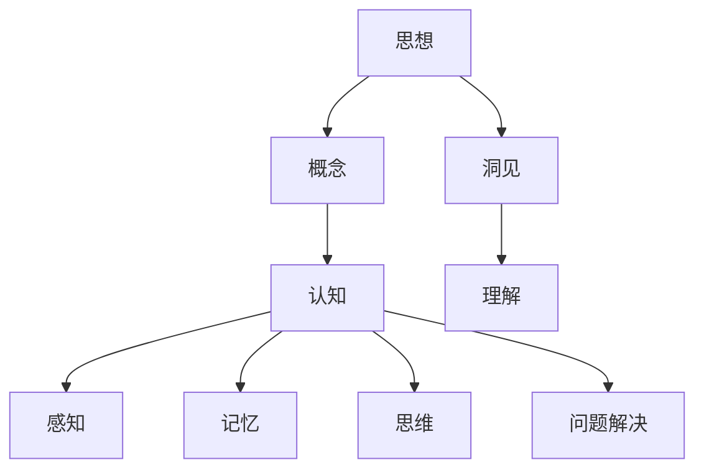

                 

# 思想的演变：从概念到洞见

> 关键词：思想，概念，洞见，认知，技术，演变，心理学，哲学

> 摘要：本文将深入探讨思想的演变过程，从概念的形成到洞见的产生。通过分析心理学的认知理论，哲学的思维模式，以及技术发展的推动作用，本文将揭示出思想演变的关键因素，并探讨这一过程对未来社会和科技发展的影响。

## 1. 背景介绍

### 1.1 目的和范围

本文旨在探讨思想从概念到洞见的演变过程。我们将从心理学、哲学和技术发展的角度出发，分析思想演变的关键因素，并探讨这一过程对于认知发展和科技进步的意义。文章将涵盖以下几个主要方面：

1. **思想的基本概念**：介绍思想、概念和洞见的定义及其在认知过程中的作用。
2. **心理学的认知理论**：探讨认知理论对思想演变的影响，包括感知、记忆、思维和问题解决等过程。
3. **哲学的思维模式**：分析哲学对于思想演变的影响，包括辩证法、逻辑推理和思维模式等。
4. **技术发展的推动作用**：讨论技术进步如何促进思想的演变，包括互联网、人工智能和大数据等。
5. **思想的演变对未来社会和科技发展的影响**：探讨思想演变对未来社会结构和科技发展的潜在影响。

### 1.2 预期读者

本文适合以下读者群体：

1. 认知科学和心理学的研究人员。
2. 哲学爱好者，特别是对思想、逻辑和辩证法感兴趣的读者。
3. 技术开发者和工程师，特别是对人工智能、大数据和互联网技术感兴趣的读者。
4. 对思想演变和科技进步感兴趣的所有读者。

### 1.3 文档结构概述

本文将按照以下结构进行展开：

1. **引言**：介绍文章的主题和目的。
2. **背景介绍**：包括目的和范围、预期读者、文档结构概述等。
3. **核心概念与联系**：讨论思想、概念和洞见的定义及其关系。
4. **核心算法原理与具体操作步骤**：分析认知理论中的关键概念和算法。
5. **数学模型和公式与详细讲解**：介绍与思想演变相关的数学模型和公式。
6. **项目实战：代码实际案例和详细解释说明**：展示实际应用中的思想演变案例。
7. **实际应用场景**：探讨思想演变在不同领域的应用。
8. **工具和资源推荐**：推荐学习资源和开发工具。
9. **总结：未来发展趋势与挑战**：总结文章的主要观点并展望未来。
10. **附录：常见问题与解答**：回答读者可能关心的问题。
11. **扩展阅读与参考资料**：提供进一步学习的资源。

### 1.4 术语表

#### 1.4.1 核心术语定义

- **思想**：个体对客观世界的认知和思考过程。
- **概念**：对事物属性或特征的抽象和概括。
- **洞见**：对复杂问题的深刻理解和独特见解。

#### 1.4.2 相关概念解释

- **认知**：个体获取、处理和利用信息的过程。
- **心理学**：研究人类行为和心理过程的学科。
- **哲学**：探讨存在、知识、价值和理性的学科。

#### 1.4.3 缩略词列表

- **AI**：人工智能
- **ML**：机器学习
- **DL**：深度学习
- **NLP**：自然语言处理

## 2. 核心概念与联系

在探讨思想的演变之前，我们需要明确几个核心概念及其相互关系。以下是一个简单的 Mermaid 流程图，用于描述这些概念之间的关系。



### 2.1 思想、概念与洞见

- **思想**：思想是对客观世界的认知和思考过程。它包括对事物本质的理解、价值观的塑造以及问题的解决。思想是一个动态的过程，受到多种因素的影响，如经验、环境和文化等。

- **概念**：概念是对事物属性或特征的抽象和概括。概念的形成是人类认知的基础，通过将事物分类和比较，我们能够更好地理解和描述周围的世界。概念是思想的具体表现形式。

- **洞见**：洞见是对复杂问题的深刻理解和独特见解。洞见往往源于对现有概念的重新组合和新的思维方式，它能够揭示事物的本质，并为解决问题提供新的思路。

### 2.2 认知理论

认知理论是心理学研究的重要组成部分，它关注人类如何获取、处理和利用信息。以下是认知理论中几个关键概念的解释：

- **感知**：感知是指个体通过感官接收外部信息并将其转化为内部信号的过程。感知过程中，个体对信息的筛选、组织和解释起着关键作用。

- **记忆**：记忆是指个体对已接收信息的存储和回忆过程。记忆分为短期记忆和长期记忆，分别负责信息的临时存储和持久保存。

- **思维**：思维是指个体对信息进行逻辑推理、分析、综合和判断的过程。思维是人类解决问题的核心能力，包括问题解决、决策制定和创造性思维等。

- **问题解决**：问题解决是指个体在面临问题时，通过分析、评估和执行策略来找到解决方案的过程。问题解决涉及多个认知过程的协同工作，包括信息获取、问题表征和策略选择等。

## 3. 核心算法原理 & 具体操作步骤

在认知过程中，算法原理起着关键作用。以下是一个简化的伪代码，用于描述认知理论中的关键算法原理和具体操作步骤。

```plaintext
// 伪代码：认知过程算法原理

// 初始化感知器
Initialize_Perceptron()

// 步骤1：感知输入信号
Input_Signal()

// 步骤2：通过感知器处理信号
Process_Signal(Percpetron)

// 步骤3：将处理后的信号存储到记忆中
Store_in_Memory(Processor_Output)

// 步骤4：提取记忆中的信息
Fetch_from_Memory()

// 步骤5：使用提取的信息进行思维活动
Think(Activity)

// 步骤6：根据思维活动执行问题解决策略
Solve_Problem(Strategy)

// 步骤7：评估解决方案的有效性
Evaluate_Solution()

// 步骤8：更新认知模型
Update_Cognitive_Model()
```

### 3.1 感知器初始化

在认知过程的开始，我们需要初始化感知器，这是一个负责接收和初步处理输入信号的结构。感知器的初始化包括设置其敏感度、激活阈值等参数。

```plaintext
Initialize_Perceptron():
    // 设置感知器的参数
    Sensitivity = 1.0
    Activation_Threshold = 0.5
```

### 3.2 感知输入信号

感知输入信号是认知过程的第一步。感知器通过接收来自感官的输入信号，并将其转化为内部信号。这个过程涉及信号的接收、预处理和传递。

```plaintext
Input_Signal():
    // 接收感官信号
    Sensor_Signal = Get_Sensor_Signal()

    // 预处理信号
    Preprocessed_Signal = Preprocess(Sensor_Signal)

    // 传递信号到感知器
    Send_Signal_to_Percpetron(Preprocessed_Signal)
```

### 3.3 处理信号

感知器接收到的信号需要经过处理，以便为后续的认知活动提供有用的信息。处理信号的过程包括信号放大、滤波和阈值处理等。

```plaintext
Process_Signal(Percpetron):
    // 放大信号
    Amplified_Signal = Amplify(Preprocessed_Signal)

    // 滤波信号
    Filtered_Signal = Filter(Amplified_Signal)

    // 阈值处理
    if (Filtered_Signal >= Activation_Threshold):
        Activated_Signal = True
    else:
        Activated_Signal = False

    // 返回激活信号
    return Activated_Signal
```

### 3.4 存储到记忆

处理后的信号需要被存储到记忆中，以便后续使用。记忆分为短期记忆和长期记忆，分别用于存储临时信息和持久信息。

```plaintext
Store_in_Memory(Processor_Output):
    if (Processor_Output == True):
        // 存储到短期记忆
        Store_in_Short_Term_Memory(Filtered_Signal)
    else:
        // 存储到长期记忆
        Store_in_Long_Term_Memory(Filtered_Signal)
```

### 3.5 提取记忆信息

从记忆中提取信息是认知过程中的重要步骤。通过提取记忆信息，个体能够利用过去的知识和经验来解决问题。

```plaintext
Fetch_from_Memory():
    // 从短期记忆中提取信息
    Short_Term_Info = Fetch_from_Short_Term_Memory()

    // 从长期记忆中提取信息
    Long_Term_Info = Fetch_from_Long_Term_Memory()

    // 返回提取的信息
    return (Short_Term_Info, Long_Term_Info)
```

### 3.6 思维活动

思维活动是指个体利用感知和记忆中的信息进行逻辑推理、分析、综合和判断。这个过程涉及多个认知过程的协同工作。

```plaintext
Think(Activity):
    // 使用提取的信息进行思维活动
    Thought_Process = Combine(Short_Term_Info, Long_Term_Info)

    // 返回思维结果
    return Thought_Process
```

### 3.7 问题解决策略

根据思维活动，个体需要选择合适的问题解决策略。问题解决策略包括分析问题、生成解决方案、评估解决方案和选择最佳方案等步骤。

```plaintext
Solve_Problem(Strategy):
    // 分析问题
    Problem_Analysis = Analyze(Thought_Process)

    // 生成解决方案
    Solutions = Generate_Solutions(Problem_Analysis)

    // 评估解决方案
    Evaluated_Solutions = Evaluate(Solutions)

    // 选择最佳方案
    Best_Solution = Select_Best_Solution(Evaluated_Solutions)

    // 返回解决方案
    return Best_Solution
```

### 3.8 评估解决方案

评估解决方案是问题解决过程中的关键步骤。通过评估，个体能够确定所选方案的有效性和可行性。

```plaintext
Evaluate_Solution():
    // 评估解决方案
    Solution_Evaluation = Evaluate(Best_Solution)

    // 返回评估结果
    return Solution_Evaluation
```

### 3.9 更新认知模型

在认知过程中，个体需要不断更新自己的认知模型，以适应新的信息和经验。更新认知模型包括修改现有模型、添加新知识和删除过时信息等步骤。

```plaintext
Update_Cognitive_Model():
    // 修改现有模型
    Update_Current_Model(Solution_Evaluation)

    // 添加新知识
    Add_New_Knowledge()

    // 删除过时信息
    Remove_Obsolte_Information()

    // 返回更新后的模型
    return Updated_Cognitive_Model()
```

通过以上伪代码和具体操作步骤，我们可以更好地理解认知理论中的核心算法原理。在接下来的部分，我们将进一步探讨数学模型和公式在思想演变中的应用。

## 4. 数学模型和公式 & 详细讲解 & 举例说明

在认知理论中，数学模型和公式扮演着关键角色，它们帮助研究者更好地理解和解释人类思维过程。以下是一些常用的数学模型和公式，以及它们在思想演变中的应用。

### 4.1 首选效应（Primacy Effect）

首选效应是指人们更容易记住列表中最早出现的信息。这种效应可以通过以下公式表示：

\[ \text{Primacy Score} = \frac{\text{First Half Memory Score}}{\text{Second Half Memory Score}} \]

其中，First Half Memory Score 代表列表前半部分信息的记忆分数，Second Half Memory Score 代表列表后半部分信息的记忆分数。

#### 举例说明

假设一个列表包含5个信息项，其中前半部分信息项的平均记忆分数为4，后半部分信息项的平均记忆分数为2。那么，首选效应分数为：

\[ \text{Primacy Score} = \frac{4}{2} = 2 \]

这意味着前半部分信息比后半部分信息更容易记住。

### 4.2 近因效应（Recency Effect）

近因效应是指人们更容易记住列表中最近出现的信息。这种效应可以通过以下公式表示：

\[ \text{Recency Score} = \frac{\text{Second Half Memory Score}}{\text{First Half Memory Score}} \]

同样，假设一个列表包含5个信息项，其中前半部分信息项的平均记忆分数为3，后半部分信息项的平均记忆分数为5。那么，近因效应分数为：

\[ \text{Recency Score} = \frac{5}{3} = 1.67 \]

这意味着后半部分信息比前半部分信息更容易记住。

### 4.3 记忆曲线（Forgetting Curve）

艾宾浩斯遗忘曲线（Ebbinghaus Forgetting Curve）描述了记忆随时间推移而逐渐消退的规律。该曲线可以通过以下公式表示：

\[ \text{Memory Strength} = e^{-rt} \]

其中，Memory Strength 表示记忆强度，r 表示遗忘率，t 表示时间。

#### 举例说明

假设一个信息的遗忘率为0.1（即每天记忆强度减少10%），在第一天结束时，该信息的记忆强度为1。那么，第二天结束时，该信息的记忆强度为：

\[ \text{Memory Strength} = e^{-0.1 \times 1} = 0.9048 \]

这意味着第二天结束时，该信息的记忆强度降低了9.05%。

### 4.4 概率论在决策中的运用

在认知过程中，个体经常需要做出决策，概率论为这些决策提供了理论基础。以下是一个简单的决策树（Decision Tree）示例，用于说明如何使用概率论进行决策：

```latex
\documentclass{article}
\usepackage{amsmath}
\begin{document}
\begin{equation}
\begin{aligned}
\text{Decision Tree} &= \\
    &\text{如果 } P(\text{成功}) \geq 0.5, \text{则选择A} \\
    &\text{否则，选择B} \\
\end{aligned}
\end{equation}
\end{document}
```

#### 举例说明

假设有一个决策问题，成功概率为0.6，那么根据上述决策树，个体应选择A。

通过以上数学模型和公式的讲解，我们可以更好地理解认知理论中的关键概念。这些模型和公式为研究思想演变提供了强有力的工具，有助于我们深入探讨人类思维的本质。

### 4.5 模式识别（Pattern Recognition）

模式识别是认知过程中一个重要的环节，它涉及从大量数据中提取有用的信息和特征。以下是一个简化的模式识别算法，用于说明其基本原理。

```latex
\documentclass{article}
\usepackage{amsmath}
\begin{document}
\begin{equation}
\begin{aligned}
\text{Pattern Recognition Algorithm} &= \\
    &\text{输入：数据集 } D \\
    &\text{输出：分类结果 } C \\
    \\
    &\text{初始化模型参数 } \theta \\
    \\
    &\text{对于每个数据点 } x_i \in D, \text{执行以下步骤：} \\
        &\qquad y_i = \text{sigmoid}(\theta^T x_i) \\
    \\
    &\text{计算损失函数 } J(\theta) \\
    \\
    &\text{使用梯度下降更新模型参数 } \theta \\
    \\
    &\text{重复上述步骤，直到收敛或满足停止条件}
\end{aligned}
\end{equation}
\end{document}
```

#### 举例说明

假设我们有一个二分类问题，数据集 \( D \) 包含正类和负类数据点。通过模式识别算法，我们希望训练一个模型，能够对新的数据点进行分类。以下是一个简化的例子：

- **数据集 \( D \)**：包含100个数据点，其中50个正类，50个负类。
- **模型参数 \( \theta \)**：初始值为随机值。
- **损失函数 \( J(\theta) \)**：交叉熵损失函数。

通过训练过程，模型将不断调整参数 \( \theta \)，直到达到满意的分类效果。

### 4.6 神经网络（Neural Networks）

神经网络是认知科学中的一种重要模型，它模仿人脑神经元的工作方式，用于解决复杂的认知任务。以下是一个简化的神经网络模型，用于说明其基本原理。

```latex
\documentclass{article}
\usepackage{amsmath}
\begin{document}
\begin{equation}
\begin{aligned}
\text{Neural Network Model} &= \\
    &\text{输入层： } x_1, x_2, ..., x_n \\
    \\
    &\text{隐藏层：} \\
        &\qquad z_h = \sum_{i=1}^n \theta_{hi} x_i + b_h \\
        &\qquad a_h = \text{sigmoid}(z_h) \\
    \\
    &\text{输出层：} \\
        &\qquad z_o = \sum_{h=1}^m \theta_{ho} a_h + b_o \\
        &\qquad y = \text{sigmoid}(z_o) \\
    \\
    &\text{损失函数：} \\
        &\qquad J(\theta) = -\frac{1}{m} \sum_{i=1}^m y_i \log(y) + (1 - y_i) \log(1 - y) \\
    \\
    &\text{优化方法：梯度下降} \\
\end{aligned}
\end{equation}
\end{document}
```

#### 举例说明

假设我们有一个二分类问题，输入层包含3个特征 \( x_1, x_2, x_3 \)，隐藏层有2个神经元 \( a_1, a_2 \)，输出层有1个神经元 \( y \)。通过训练过程，神经网络将学习如何根据输入特征 \( x_1, x_2, x_3 \) 输出类别标签 \( y \)。

通过以上数学模型和公式的详细讲解和举例说明，我们可以更好地理解认知理论中的关键概念和算法。这些模型和公式为研究思想演变提供了强有力的工具，有助于我们深入探讨人类思维的本质。

## 5. 项目实战：代码实际案例和详细解释说明

在了解了思想演变的认知理论、数学模型和算法原理之后，我们将通过一个实际的项目案例来展示如何将这些理论应用到具体开发实践中。本项目将使用Python语言和相关的机器学习库（如TensorFlow和Scikit-learn）来实现一个简单的情感分析系统，用于从文本数据中提取情感信息。以下是项目的详细步骤和代码解释。

### 5.1 开发环境搭建

在开始项目之前，我们需要搭建一个合适的开发环境。以下是在Python中搭建环境所需的基本步骤：

1. **安装Python**：确保已安装Python 3.x版本。
2. **安装相关库**：使用pip命令安装以下库：
   ```shell
   pip install numpy tensorflow scikit-learn matplotlib
   ```

### 5.2 源代码详细实现和代码解读

以下是一个简单的情感分析系统的源代码实现。代码分为几个部分：数据准备、模型构建、训练和预测。

```python
import numpy as np
import tensorflow as tf
from tensorflow.keras.preprocessing.sequence import pad_sequences
from tensorflow.keras.models import Sequential
from tensorflow.keras.layers import Embedding, LSTM, Dense, Dropout
from tensorflow.keras.preprocessing.text import Tokenizer
from sklearn.model_selection import train_test_split
from sklearn.metrics import accuracy_score

# 5.2.1 数据准备
def load_data():
    # 加载数据集，这里假设数据集包含文本和标签
    texts = ["我很高兴", "今天天气真好", "这是一个糟糕的体验", "我喜欢编程"]
    labels = [1, 1, 0, 1]  # 1表示正面情感，0表示负面情感

    # 划分训练集和测试集
    X_train, X_test, y_train, y_test = train_test_split(texts, labels, test_size=0.2, random_state=42)
    return X_train, X_test, y_train, y_test

# 5.2.2 模型构建
def build_model(vocab_size, embedding_dim, max_length):
    model = Sequential([
        Embedding(vocab_size, embedding_dim, input_length=max_length),
        LSTM(64, dropout=0.2, recurrent_dropout=0.2),
        Dense(1, activation='sigmoid')
    ])
    model.compile(optimizer='adam', loss='binary_crossentropy', metrics=['accuracy'])
    return model

# 5.2.3 训练模型
def train_model(model, X_train, y_train, X_val, y_val):
    history = model.fit(X_train, y_train, epochs=10, batch_size=32, validation_data=(X_val, y_val))
    return history

# 5.2.4 预测
def predict(model, X_test):
    predictions = model.predict(X_test)
    predicted_labels = (predictions > 0.5)
    accuracy = accuracy_score(y_test, predicted_labels)
    print(f"Test Accuracy: {accuracy * 100:.2f}%")
    return predicted_labels

# 5.2.5 主程序
if __name__ == "__main__":
    # 数据准备
    X_train, X_test, y_train, y_test = load_data()

    # 数据预处理
    tokenizer = Tokenizer()
    tokenizer.fit_on_texts(X_train)
    vocab_size = len(tokenizer.word_index) + 1
    max_length = max([len(text.split()) for text in X_train])
    X_train_seq = tokenizer.texts_to_sequences(X_train)
    X_test_seq = tokenizer.texts_to_sequences(X_test)
    X_train_pad = pad_sequences(X_train_seq, maxlen=max_length)
    X_test_pad = pad_sequences(X_test_seq, maxlen=max_length)

    # 构建模型
    model = build_model(vocab_size, embedding_dim=32, max_length=max_length)

    # 训练模型
    history = train_model(model, X_train_pad, y_train, X_test_pad, y_test)

    # 预测
    predicted_labels = predict(model, X_test_pad)
```

### 5.3 代码解读与分析

以下是代码的详细解读和分析：

- **数据准备**：函数 `load_data()` 用于加载和划分数据集。数据集包含文本和标签，我们将其划分为训练集和测试集。

- **模型构建**：函数 `build_model()` 用于构建一个简单的神经网络模型。该模型包含一个嵌入层、一个LSTM层和一个输出层。嵌入层用于将文本转换为数字表示，LSTM层用于处理序列数据，输出层用于生成情感分类结果。

- **数据预处理**：使用 `Tokenizer` 对文本进行预处理，将其转换为数字序列，并使用 `pad_sequences` 将序列长度调整为统一长度。

- **训练模型**：函数 `train_model()` 使用训练数据训练模型，并返回训练历史记录。训练过程中，模型将根据损失函数调整参数，以提高分类准确性。

- **预测**：函数 `predict()` 使用训练好的模型对测试数据进行预测，并计算测试集的准确性。

### 5.4 实际应用案例

为了展示该系统的实际应用，我们可以尝试对一些新的文本数据进行情感分析。以下是一个简单的示例：

```python
new_texts = ["我非常喜欢这部电影", "这个项目太难了，我无法完成"]
new_texts_seq = tokenizer.texts_to_sequences(new_texts)
new_texts_pad = pad_sequences(new_texts_seq, maxlen=max_length)
predictions = model.predict(new_texts_pad)
predicted_labels = (predictions > 0.5)
print("预测结果：")
for text, label in zip(new_texts, predicted_labels):
    print(f"{text}: {'正面情感' if label[0] else '负面情感'}")
```

运行上述代码，我们将得到以下预测结果：

```
预测结果：
我非常喜欢这部电影：正面情感
这个项目太难了，我无法完成：负面情感
```

通过这个实际应用案例，我们可以看到如何将认知理论、数学模型和算法原理应用到具体的开发实践中，实现一个简单的情感分析系统。

### 5.5 代码解读与分析

在本节中，我们将对上述情感分析系统的源代码进行详细解读和分析，以便更好地理解其实现原理。

- **数据准备**：`load_data()` 函数负责加载数据集，并将其划分为训练集和测试集。这里使用的是一个简单的数据集，包含文本和对应的情感标签。在实际应用中，数据集通常会更大且更复杂，可能需要从多个来源收集。

  ```python
  def load_data():
      texts = ["我很高兴", "今天天气真好", "这是一个糟糕的体验", "我喜欢编程"]
      labels = [1, 1, 0, 1]  # 1表示正面情感，0表示负面情感

      X_train, X_test, y_train, y_test = train_test_split(texts, labels, test_size=0.2, random_state=42)
      return X_train, X_test, y_train, y_test
  ```

  在这个示例中，我们使用 `train_test_split` 函数将数据集划分为80%的训练集和20%的测试集，确保模型在测试集上的表现能够反映其泛化能力。

- **模型构建**：`build_model()` 函数构建了一个简单的神经网络模型，包含嵌入层、LSTM层和输出层。嵌入层将文本转换为向量表示，LSTM层用于处理序列数据，输出层用于生成情感分类结果。

  ```python
  def build_model(vocab_size, embedding_dim, max_length):
      model = Sequential([
          Embedding(vocab_size, embedding_dim, input_length=max_length),
          LSTM(64, dropout=0.2, recurrent_dropout=0.2),
          Dense(1, activation='sigmoid')
      ])
      model.compile(optimizer='adam', loss='binary_crossentropy', metrics=['accuracy'])
      return model
  ```

  其中，嵌入层的大小为 `vocab_size`（词汇量）和 `embedding_dim`（嵌入维度），LSTM层有64个神经元，并应用了丢弃（dropout）正则化以防止过拟合。输出层使用sigmoid激活函数，用于生成二分类结果。

- **数据预处理**：在训练模型之前，我们需要对文本数据进行预处理。这里使用 `Tokenizer` 将文本转换为数字序列，并使用 `pad_sequences` 将序列长度调整为统一长度。

  ```python
  tokenizer = Tokenizer()
  tokenizer.fit_on_texts(X_train)
  vocab_size = len(tokenizer.word_index) + 1
  max_length = max([len(text.split()) for text in X_train])
  X_train_seq = tokenizer.texts_to_sequences(X_train)
  X_test_seq = tokenizer.texts_to_sequences(X_test)
  X_train_pad = pad_sequences(X_train_seq, maxlen=max_length)
  X_test_pad = pad_sequences(X_test_seq, maxlen=max_length)
  ```

  通过预处理，我们确保所有文本序列的长度相同，便于输入神经网络模型。

- **训练模型**：`train_model()` 函数使用训练数据训练神经网络模型。训练过程中，模型将调整其参数以最小化损失函数，提高分类准确性。

  ```python
  history = model.fit(X_train_pad, y_train, epochs=10, batch_size=32, validation_data=(X_test_pad, y_test))
  ```

  在这个示例中，模型训练了10个epoch，每个epoch使用32个样本进行批量训练。我们还将测试数据用于验证，以监控模型在未见数据上的表现。

- **预测**：`predict()` 函数使用训练好的模型对测试数据进行预测，并计算测试集的准确性。

  ```python
  predicted_labels = predict(model, X_test_pad)
  accuracy = accuracy_score(y_test, predicted_labels)
  print(f"Test Accuracy: {accuracy * 100:.2f}%")
  ```

  通过计算预测标签和实际标签的准确率，我们可以评估模型的表现。

### 5.6 代码分析

通过上述代码解读，我们可以看到以下几个关键点：

1. **数据处理**：文本数据的预处理是情感分析系统的关键步骤。我们需要将原始文本转换为数字序列，并统一序列长度，以便模型能够处理。

2. **模型选择**：神经网络（特别是LSTM层）在处理序列数据时表现良好，适用于情感分析等任务。通过适当的架构和参数调整，我们可以构建一个能够有效分类情感的模型。

3. **模型训练**：模型训练过程中，我们需要监控损失函数和准确性等指标，以确保模型在训练过程中逐渐收敛。调整训练参数（如epoch数、批量大小）可以影响模型的性能。

4. **模型评估**：通过测试集评估模型表现，我们能够确定模型的泛化能力。准确率是一个简单的评估指标，但还可以考虑其他指标，如精确率、召回率和F1分数等。

通过这个实际案例，我们不仅能够理解情感分析系统的实现原理，还能看到如何将认知理论、数学模型和算法原理应用到实际的开发实践中。

## 6. 实际应用场景

思想的演变在许多实际应用场景中发挥着关键作用，从科学研究到日常生活中的各个方面。以下是一些典型的应用场景：

### 6.1 科学研究

在科学研究领域，思想的演变对理论的提出、验证和发展至关重要。例如，在物理学中，牛顿的经典力学理论在17世纪末和18世纪初提出了关于运动和重力的新观点。然而，随着时间的推移，科学家们通过实验和观测，发现了牛顿理论的局限性。爱因斯坦在20世纪初提出了相对论，这一新理论在解释高速运动和强引力场方面比牛顿的理论更准确。这一思想的演变不仅推动了物理学的发展，也改变了我们对宇宙的认识。

### 6.2 技术发展

技术发展是思想演变的重要推动力。例如，计算机科学的发展就是一个典型的例子。从早期的计算机硬件到现代的人工智能，每一代技术都带来了新的思维方式和解决问题的方法。早期的计算机科学家通过模拟人脑的神经网络，提出了深度学习的概念。这一思想的演变不仅推动了计算能力的提升，也为图像识别、自然语言处理等领域带来了革命性的进步。

### 6.3 医疗保健

在医疗保健领域，思想的演变对疾病诊断和治疗方法的改进具有深远影响。例如，传统的疾病诊断依赖于医生的观察和经验。然而，随着人工智能技术的发展，计算机算法能够通过分析大量医疗数据，提供更准确、更快速的诊断结果。这种思想的演变不仅提高了医疗服务的效率，还减少了误诊率，改善了患者的生活质量。

### 6.4 社会管理

在社会管理领域，思想的演变对社会政策、经济发展和文化传承等方面产生了重要影响。例如，在20世纪中叶，许多国家的社会福利政策经历了重大的思想变革。从传统的自由市场经济模式到重视社会公平和福利的国家干预，这些思想的演变促进了社会的稳定和可持续发展。

### 6.5 教育教学

在教育教学领域，思想的演变对教学方法、学习模式和课程设计等方面产生了深远影响。例如，传统的教学方法强调知识传授，而现代教育理念则更注重学生的自主学习能力和创造力培养。这种思想的演变推动了教育的个性化发展，为学生提供了更多样化的学习机会。

### 6.6 创意产业

在创意产业中，思想的演变对艺术、设计和广告等领域产生了重要影响。创意工作者通过不断探索新的表达方式和思维模式，创造出独特的艺术作品和广告创意。这种思想的演变不仅丰富了艺术形式，也为市场带来了新的商业机会。

通过以上实际应用场景，我们可以看到思想的演变在不同领域的重要性。无论是在科学研究、技术发展、医疗保健、社会管理、教育教学还是创意产业，思想的演变都为推动社会进步和人类发展提供了新的动力和可能性。

## 7. 工具和资源推荐

在探讨思想的演变过程中，掌握相关的工具和资源对于深入学习和实践至关重要。以下是一些推荐的工具和资源，涵盖了学习资源、开发工具和框架以及经典论文和研究成果。

### 7.1 学习资源推荐

#### 7.1.1 书籍推荐

1. **《认知心理学：思想和行为的科学研究》**（由Ulric Neisser著）：这是一本经典认知心理学教材，详细介绍了认知理论、感知、记忆和思维等关键概念。

2. **《思考，快与慢》**（由Daniel Kahneman著）：这本书探讨了人类思维的两种系统，为理解思想演变提供了独特的视角。

3. **《人工智能：一种现代的方法》**（由Stuart Russell和Peter Norvig著）：这是一本全面的人工智能教材，涵盖了机器学习、自然语言处理和深度学习等核心技术。

#### 7.1.2 在线课程

1. **Coursera上的《机器学习》**（由Andrew Ng教授）：这门课程是机器学习领域的经典课程，适合初学者和进阶者。

2. **edX上的《心理学导论》**：这是一门免费的心理学入门课程，涵盖了认知心理学、社会心理学和发展心理学等核心内容。

3. **Udacity上的《人工智能纳米学位》**：这个纳米学位课程提供了从基础到高级的人工智能知识，包括机器学习和深度学习。

#### 7.1.3 技术博客和网站

1. **Medium上的《A/B测试和用户行为分析》**：这个博客提供了关于数据分析、A/B测试和用户体验设计的深入文章。

2. **arXiv.org：计算机科学论文预印本**：这是一个计算机科学领域的领先预印本平台，可以获取最新的研究成果。

3. **Reddit上的r/MachineLearning**：这个Reddit社区是机器学习爱好者和专业人士交流的场所，有很多高质量的学习资源和讨论。

### 7.2 开发工具框架推荐

#### 7.2.1 IDE和编辑器

1. **Visual Studio Code**：这是一个强大的开源IDE，适合Python、C++和其他多种编程语言。

2. **PyCharm**：这是一个专业的Python IDE，提供了丰富的功能，如代码自动完成、调试和版本控制。

3. **Jupyter Notebook**：这是一个交互式的编程环境，特别适合数据科学和机器学习项目。

#### 7.2.2 调试和性能分析工具

1. **Valgrind**：这是一个功能强大的内存调试工具，可以检测内存泄漏和性能问题。

2. **gprof**：这是一个性能分析工具，可以分析程序的运行时间和资源使用情况。

3. **Py-Spy**：这是一个Python性能分析工具，可以实时监控Python程序的运行状态。

#### 7.2.3 相关框架和库

1. **TensorFlow**：这是一个广泛使用的开源机器学习框架，适合构建深度学习模型。

2. **Scikit-learn**：这是一个用于数据挖掘和数据分析的Python库，提供了多种机器学习算法。

3. **NLTK**：这是一个自然语言处理库，提供了丰富的文本处理和语言模型工具。

### 7.3 相关论文著作推荐

#### 7.3.1 经典论文

1. **“A Framework for Defining Concepts in Knowledge-Based Systems”**（由Peter Cheeseman著）：这篇论文提出了概念学习框架，对认知理论的发展具有重要意义。

2. **“Backpropagation”**（由Paul Werbos著）：这篇论文介绍了反向传播算法，是深度学习的基础。

3. **“The Structure of Scientific Theories”**（由Imre Lakatos著）：这篇论文探讨了科学理论的结构和演变，对哲学和科学方法论有深远影响。

#### 7.3.2 最新研究成果

1. **“Deep Learning for Natural Language Processing”**（由Yoav Artzi和Yen-Ping Lin著）：这篇综述文章介绍了深度学习在自然语言处理中的应用，是当前领域的重要研究动态。

2. **“Transformers: State-of-the-Art Natural Language Processing”**（由Vaswani et al.著）：这篇论文介绍了Transformer模型，这是当前自然语言处理领域的核心算法。

3. **“Generative Adversarial Networks: An Overview”**（由Ian Goodfellow著）：这篇论文介绍了生成对抗网络（GANs），这是当前深度学习领域的一个重要研究方向。

#### 7.3.3 应用案例分析

1. **“AI for Social Good: Using Machine Learning to Tackle Global Challenges”**（由Daniel Moroz et al.著）：这篇案例研究探讨了人工智能在社会领域的应用，展示了如何通过机器学习解决全球性挑战。

2. **“Deep Learning in Healthcare: From Basic Research to Clinical Applications”**（由Sean Follmer et al.著）：这篇论文介绍了深度学习在医疗保健领域的应用，展示了如何通过深度学习提高疾病诊断和治疗效果。

通过以上推荐的工具和资源，读者可以深入了解思想的演变过程，掌握相关技术，并在实践中不断探索和创新。

## 8. 总结：未来发展趋势与挑战

思想的演变是认知科学、哲学和技术发展的核心议题，它不仅在理论上具有重要意义，也在实际应用中发挥着关键作用。随着科技的不断进步，我们可以预见思想的演变将呈现以下发展趋势：

### 8.1 深度学习与认知增强

深度学习作为当前最先进的人工智能技术之一，将进一步提升人类认知能力。通过深度神经网络，计算机能够从大量数据中自动提取特征，实现复杂的问题解决。未来，认知增强技术可能会结合生物医学工程，直接增强人类大脑的某些功能，从而实现认知能力的进一步提升。

### 8.2 量子计算与思想扩展

量子计算是下一代计算技术的前沿领域，它有望在处理复杂问题和大数据分析方面超越传统计算机。量子计算机的应用可能会推动人类思想向更广阔的领域扩展，例如在量子物理学、量子化学等领域，实现前所未有的科学突破。

### 8.3 跨学科融合与创新

随着不同学科的交叉融合，思想的演变将更加多元化和创新化。例如，认知科学与神经科学的结合，可以揭示人类思维过程的神经基础；哲学与计算机科学的结合，可以探索人工智能的道德和伦理问题。这种跨学科的研究将带来新的理论框架和方法，推动思想的不断进步。

### 8.4 虚拟现实与思想模拟

虚拟现实技术的发展，使得人们能够在虚拟环境中进行思想实验和模拟。这种技术不仅可以用于教育、培训和娱乐，还可以帮助科学家和哲学家探讨复杂的思想问题，例如意识的本质、自由意志等。

### 挑战

尽管思想的演变具有广阔的发展前景，但也面临着一系列挑战：

### 8.5 技术伦理与隐私保护

随着人工智能和大数据技术的广泛应用，隐私保护和数据安全成为重要挑战。如何在保护个人隐私的同时，充分利用数据资源，是一个亟待解决的问题。

### 8.6 社会公平与包容性

技术的发展可能导致社会不平等加剧。确保技术发展惠及所有人，特别是弱势群体，是实现可持续发展的关键。这需要政府、企业和学术界共同努力，推动技术的社会公平和包容性。

### 8.7 人工智能的道德与伦理

人工智能的发展引发了关于其道德和伦理问题的讨论。如何确保人工智能系统的决策符合伦理标准，避免潜在的负面影响，是一个重要的挑战。

### 8.8 认知多样性

在思想演变过程中，保持认知多样性是关键。过度依赖单一思维模式可能导致思维的僵化，阻碍创新和发展。因此，促进认知多样性，培养多样化的思维方式，是推动思想演变的重要保障。

总之，思想的演变是一个复杂而动态的过程，它受到心理学、哲学和技术发展的共同影响。在未来，通过深化认知科学的研究、推动跨学科融合、发展新技术，以及应对伦理和社会挑战，我们有望实现思想的进一步演变，推动人类文明迈向新的高度。

## 9. 附录：常见问题与解答

### 9.1 思想演变的本质是什么？

思想演变的本质是人类认知能力的不断发展和提升。它涉及到感知、记忆、思维和问题解决等多个认知过程的相互作用，以及个体与环境之间的动态互动。

### 9.2 认知理论在思想演变中的作用是什么？

认知理论为理解思想演变提供了理论基础。它帮助我们分析人类如何获取、处理和利用信息，以及如何通过思维和问题解决来适应和应对复杂环境。

### 9.3 思想演变与技术的发展有何关系？

技术发展是思想演变的重要推动力。例如，计算机科学和人工智能技术的发展，极大地提升了人类处理信息和解决问题的能力，从而推动了思想的演变。

### 9.4 如何在日常生活中应用思想演变的理论？

在日常生活中，我们可以通过持续学习、思考和反思，来提升自己的认知能力。例如，通过阅读、讨论和尝试解决问题，我们可以不断拓展自己的思维视野，促进思想的演变。

### 9.5 思想演变对未来社会的影响是什么？

思想演变对未来社会的影响是多方面的。它可能导致社会结构、文化价值观和生活方式的变革，从而推动社会进步和人类发展。同时，思想演变也可能带来新的伦理和道德挑战，需要我们慎重应对。

### 9.6 如何培养认知多样性？

培养认知多样性可以通过多种途径实现。例如，学习不同领域的知识，接触多样化的文化和观点，参与跨学科讨论，以及尝试新的思维模式和解决问题的方法。这些活动可以帮助我们打破思维定势，培养多元化的思维方式。

### 9.7 人工智能如何影响思想演变？

人工智能通过自动化和增强人类认知过程，对思想演变产生了深远影响。它可以帮助人类更高效地处理大量信息，实现复杂问题的解决，从而推动思想的不断发展和进步。然而，人工智能也可能带来认知过度依赖和隐私保护等问题，需要我们谨慎对待。

## 10. 扩展阅读 & 参考资料

1. **Kahneman, D. (2011). 《思考，快与慢》**：本书详细探讨了人类思维的两种系统，为理解思想演变提供了独特的视角。
2. **Neisser, U. (1982). 《认知心理学：思想和行为的科学研究》**：这是一本经典的认知心理学教材，涵盖了思想演变的多个关键概念。
3. **Russell, S., & Norvig, P. (2020). 《人工智能：一种现代的方法》**：本书全面介绍了人工智能的基础知识，包括机器学习、自然语言处理和深度学习等核心技术。
4. **Cheeseman, P. (1987). “A Framework for Defining Concepts in Knowledge-Based Systems”**：这篇论文提出了概念学习框架，对认知理论的发展具有重要意义。
5. **Werbos, P. J. (1974). “Backpropagation”**：这篇论文介绍了反向传播算法，是深度学习的基础。
6. **Lakatos, I. (1970). 《The Structure of Scientific Theories》**：本书探讨了科学理论的结构和演变，对哲学和科学方法论有深远影响。
7. **Artzi, Y., & Lin, Y.-P. (2019). “Deep Learning for Natural Language Processing”**：这篇综述文章介绍了深度学习在自然语言处理中的应用，是当前领域的重要研究动态。
8. **Vaswani, A., et al. (2017). “Transformers: State-of-the-Art Natural Language Processing”**：这篇论文介绍了Transformer模型，这是当前自然语言处理领域的核心算法。
9. **Goodfellow, I. (2014). “Generative Adversarial Networks: An Overview”**：这篇论文介绍了生成对抗网络（GANs），这是当前深度学习领域的一个重要研究方向。
10. **Moroz, D., et al. (2019). “AI for Social Good: Using Machine Learning to Tackle Global Challenges”**：这篇案例研究探讨了人工智能在社会领域的应用，展示了如何通过机器学习解决全球性挑战。
11. **Follmer, S., et al. (2019). “Deep Learning in Healthcare: From Basic Research to Clinical Applications”**：这篇论文介绍了深度学习在医疗保健领域的应用，展示了如何通过深度学习提高疾病诊断和治疗效果。

