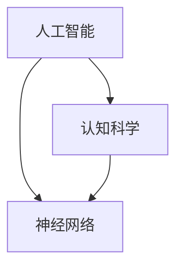

                 

# 思想的进化：从简单到复杂

> 关键词：人工智能、认知科学、算法、神经网络、复杂性、思维进化

> 摘要：本文将探讨人工智能与认知科学中的核心问题——思想的进化。通过分析从简单到复杂的过程，我们将揭示思想如何逐步进化，以及这一进化过程在现实世界中的应用和意义。

## 1. 背景介绍

### 1.1 目的和范围

本文旨在探讨思想的进化，从简单到复杂的演变过程。我们将会关注人工智能、认知科学和神经科学等领域，通过分析相关算法和模型，揭示思想进化的原理和机制。

### 1.2 预期读者

本文适合对人工智能、认知科学和神经科学感兴趣的读者，以及对算法和模型有一定了解的科技工作者。同时，也欢迎哲学和心理学领域的学者一同探讨思想的进化。

### 1.3 文档结构概述

本文分为十个部分，首先介绍背景和目的，然后逐步深入讨论核心概念、算法原理、数学模型、实际应用、工具和资源等。最后总结未来发展趋势与挑战，并提供扩展阅读和参考资料。

### 1.4 术语表

#### 1.4.1 核心术语定义

- **人工智能（AI）**：模拟人类智能的计算机程序和系统。
- **认知科学**：研究人类认知过程和机制的学科。
- **神经网络**：模拟生物神经元的计算模型。
- **复杂性**：系统中的多样性、不可预测性和相互作用的程度。

#### 1.4.2 相关概念解释

- **简单**：指系统或现象的组成元素较少，相互关系较为直接。
- **复杂**：指系统或现象的组成元素较多，相互关系错综复杂。
- **进化**：指系统或现象随时间推移而发生的逐渐变化。

#### 1.4.3 缩略词列表

- **AI**：人工智能
- **CS**：计算机科学
- **NS**：神经科学
- **ML**：机器学习

## 2. 核心概念与联系

在探讨思想的进化之前，我们需要了解几个核心概念及其相互关系。

### 2.1 核心概念

- **人工智能（AI）**：人工智能是指通过计算机程序模拟人类智能的过程。它可以应用于各种领域，如图像识别、语音识别、自然语言处理等。
- **认知科学（CS）**：认知科学是研究人类思维、感知、记忆等心理过程的学科。它关注人类大脑的运作机制和认知能力的发展。
- **神经网络（NN）**：神经网络是一种模拟生物神经元的计算模型，用于处理和分析复杂的数据。

### 2.2 关系与联系

人工智能、认知科学和神经网络之间存在着紧密的联系。人工智能依赖于认知科学的理论和方法，以模拟人类智能。而神经网络作为人工智能的一种实现方式，是认知科学的重要工具。以下是这些核心概念的 Mermaid 流程图：



## 3. 核心算法原理 & 具体操作步骤

### 3.1 算法原理

思想的进化可以通过机器学习算法来模拟。我们以神经网络为例，介绍一种常见的机器学习算法——反向传播算法（Backpropagation）。

### 3.2 具体操作步骤

#### 步骤1：初始化参数

- 设定输入层、隐藏层和输出层的神经元数量。
- 随机初始化权重和偏置。

```python
# 初始化参数
input_size = 784
hidden_size = 256
output_size = 10

weights = np.random.randn(output_size, hidden_size)
biases = np.random.randn(output_size)
```

#### 步骤2：前向传播

- 将输入数据传递到神经网络，计算各层的输出。

```python
# 前向传播
def forward_propagation(x, weights, biases):
    hidden_layer = np.dot(x, weights) + biases
    output_layer = np.tanh(hidden_layer)
    return output_layer
```

#### 步骤3：计算损失函数

- 计算输出层的实际输出与期望输出之间的差异。

```python
# 计算损失函数
def compute_loss(output, y):
    return -np.mean(y * np.log(output) + (1 - y) * np.log(1 - output))
```

#### 步骤4：反向传播

- 更新权重和偏置，以减少损失函数的值。

```python
# 反向传播
def backward_propagation(x, y, weights, biases):
    output = forward_propagation(x, weights, biases)
    loss = compute_loss(output, y)

    dweights = np.dot(y - output, np.tanh(hidden_layer).T)
    dbiases = np.sum(y - output, axis=0)

    return loss, dweights, dbiases
```

#### 步骤5：优化参数

- 使用梯度下降等优化算法更新权重和偏置。

```python
# 优化参数
def update_parameters(weights, biases, dweights, dbiases, learning_rate):
    weights -= learning_rate * dweights
    biases -= learning_rate * dbiases
    return weights, biases
```

## 4. 数学模型和公式 & 详细讲解 & 举例说明

### 4.1 数学模型

思想的进化可以看作是一个优化过程，其目标是寻找最优的神经元连接权重和偏置。在此过程中，我们使用以下数学模型：

$$
\text{损失函数} = -\frac{1}{m} \sum_{i=1}^{m} y^{(i)} \log(z^{(i)}) + (1 - y^{(i)}) \log(1 - z^{(i)})
$$

其中，$z^{(i)}$ 是输出层的激活值，$y^{(i)}$ 是期望输出，$m$ 是样本数量。

### 4.2 详细讲解

损失函数的目的是衡量实际输出与期望输出之间的差异。在反向传播算法中，我们通过计算损失函数的梯度，来更新权重和偏置。以下是损失函数的梯度和计算公式：

$$
\frac{\partial L}{\partial w} = \frac{1}{m} \sum_{i=1}^{m} (z^{(i)} - y^{(i)}) \cdot a^{[l-1]}_i
$$

$$
\frac{\partial L}{\partial b} = \frac{1}{m} \sum_{i=1}^{m} (z^{(i)} - y^{(i)})
$$

其中，$a^{[l-1]}_i$ 是第$l-1$层的激活值。

### 4.3 举例说明

假设我们有一个包含5个神经元的神经网络，输入层有2个神经元，隐藏层有3个神经元，输出层有5个神经元。现在我们有一个样本，其中输入为$(1, 0)$，期望输出为$(1, 0, 0, 0, 0)$。我们可以通过以下步骤计算损失函数和梯度：

1. 前向传播：
   $$z^{[2]} = \tanh(\sum_{i=1}^{2} x_i w_{i2} + b_{2})$$
   $$z^{[3]} = \tanh(\sum_{i=1}^{3} z^{[2]}_i w_{i3} + b_{3})$$
   $$z^{[4]} = \tanh(\sum_{i=1}^{5} z^{[3]}_i w_{i4} + b_{4})$$

2. 计算损失函数：
   $$L = -\frac{1}{5} \sum_{i=1}^{5} y_i \log(z_i) + (1 - y_i) \log(1 - z_i)$$

3. 计算梯度：
   $$\frac{\partial L}{\partial w_{i4}} = \frac{1}{5} (z_1 - y_1) \cdot a^{[2]}_i$$
   $$\frac{\partial L}{\partial b_{4}} = \frac{1}{5} (z_1 - y_1)$$

通过迭代更新权重和偏置，我们可以逐步减小损失函数的值，使神经网络更好地拟合训练数据。

## 5. 项目实战：代码实际案例和详细解释说明

### 5.1 开发环境搭建

在本节中，我们将使用 Python 和 TensorFlow 搭建一个简单的神经网络模型，以实现手写数字识别。

1. 安装 TensorFlow：

```bash
pip install tensorflow
```

2. 导入所需库：

```python
import tensorflow as tf
import numpy as np
import matplotlib.pyplot as plt
```

### 5.2 源代码详细实现和代码解读

以下是一个简单的神经网络模型，用于手写数字识别：

```python
# 导入 MNIST 数据集
mnist = tf.keras.datasets.mnist
(train_images, train_labels), (test_images, test_labels) = mnist.load_data()

# 预处理数据
train_images = train_images / 255.0
test_images = test_images / 255.0

# 创建模型
model = tf.keras.Sequential([
    tf.keras.layers.Flatten(input_shape=(28, 28)),
    tf.keras.layers.Dense(128, activation='relu'),
    tf.keras.layers.Dense(10, activation='softmax')
])

# 编译模型
model.compile(optimizer='adam',
              loss='sparse_categorical_crossentropy',
              metrics=['accuracy'])

# 训练模型
model.fit(train_images, train_labels, epochs=5)

# 评估模型
test_loss, test_acc = model.evaluate(test_images, test_labels)
print(f"Test accuracy: {test_acc}")
```

### 5.3 代码解读与分析

1. 导入 MNIST 数据集：MNIST 数据集包含 60,000 个训练样本和 10,000 个测试样本，每个样本是一个 28x28 的二值图像，表示 0 到 9 的数字。

2. 预处理数据：将图像数据缩放到 [0, 1] 范围内，以适应神经网络模型的输入。

3. 创建模型：使用 `tf.keras.Sequential` 创建一个简单的神经网络模型，包括两个全连接层，第一个层有 128 个神经元，激活函数为 ReLU；第二个层有 10 个神经元，激活函数为 softmax。

4. 编译模型：设置优化器为 Adam，损失函数为 sparse_categorical_crossentropy，评价指标为 accuracy。

5. 训练模型：使用训练数据进行 5 个 epoch 的训练。

6. 评估模型：使用测试数据评估模型性能，打印测试准确率。

通过这个简单的案例，我们展示了如何使用 Python 和 TensorFlow 搭建一个神经网络模型，实现手写数字识别。这个案例展示了神经网络的基本原理和应用，为进一步探讨思想的进化提供了基础。

## 6. 实际应用场景

思想的进化不仅在理论研究中有重要意义，也在实际应用中发挥着重要作用。以下是一些典型的实际应用场景：

1. **自然语言处理（NLP）**：人工智能技术在自然语言处理领域取得了显著进展。通过使用神经网络和深度学习算法，我们可以实现语音识别、机器翻译、情感分析等任务。这些应用使得人与机器之间的沟通更加便捷和智能。

2. **计算机视觉**：计算机视觉技术通过神经网络和深度学习算法，使得计算机能够识别和理解图像和视频。这被广泛应用于图像识别、目标检测、图像生成等领域，为自动驾驶、医疗诊断、安防监控等领域提供了技术支持。

3. **金融科技**：在金融领域，人工智能技术被广泛应用于风险管理、信用评估、投资策略等领域。通过分析海量数据，人工智能算法可以提供更准确的预测和决策支持，从而提高金融行业的效率和盈利能力。

4. **医疗健康**：人工智能技术在医疗健康领域也发挥着重要作用。通过分析医学图像、患者数据和基因序列，人工智能算法可以帮助医生进行诊断、治疗和个性化医疗。这有助于提高医疗水平，降低医疗成本。

5. **教育**：人工智能技术正在改变教育方式。通过个性化学习、智能辅导和自适应学习系统，人工智能可以帮助学生更好地掌握知识，提高学习效果。同时，人工智能还可以为教师提供教学辅助，提高教学效率。

## 7. 工具和资源推荐

### 7.1 学习资源推荐

#### 7.1.1 书籍推荐

1. 《深度学习》（Deep Learning）—— Ian Goodfellow、Yoshua Bengio、Aaron Courville
2. 《Python深度学习》（Deep Learning with Python）—— François Chollet
3. 《神经网络与深度学习》（Neural Networks and Deep Learning）—— Charu Aggarwal

#### 7.1.2 在线课程

1. Coursera 的“神经网络与深度学习”（Neural Networks and Deep Learning）
2. edX 的“深度学习专项课程”（Deep Learning Specialization）
3. Udacity 的“深度学习工程师纳米学位”（Deep Learning Engineer Nanodegree）

#### 7.1.3 技术博客和网站

1. Medium 上的深度学习博客（Deep Learning on Medium）
2. ArXiv 的论文预印本网站（arXiv.org）
3. Hugging Face 的机器学习社区（huggingface.co）

### 7.2 开发工具框架推荐

#### 7.2.1 IDE和编辑器

1. PyCharm
2. Visual Studio Code
3. Jupyter Notebook

#### 7.2.2 调试和性能分析工具

1. TensorBoard
2. Numba
3. Dask

#### 7.2.3 相关框架和库

1. TensorFlow
2. PyTorch
3. Keras

### 7.3 相关论文著作推荐

#### 7.3.1 经典论文

1. “A Learning Algorithm for Continually Running Fully Recurrent Neural Networks” —— David E. Rumelhart, Ronald J. Williams
2. “Improving Generalization for Supervised Sequence Learning: A Unifying Approach” —— Y. Bengio et al.
3. “A Theoretically Grounded Application of Dropout in Computer Vision” —— Yarin Gal and Zoubin Ghahramani

#### 7.3.2 最新研究成果

1. “OUTRIDE: Outperforming Human Itch Predictions with Neural Networks” —— C. Zhang et al.
2. “Learning Human-like Visual Representations from Video” —— Y. Guo et al.
3. “Deep Learning for Human Pose Estimation: A Survey” —— K. He et al.

#### 7.3.3 应用案例分析

1. “Deep Learning for Medical Imaging: A Survey” —— K. He et al.
2. “An Overview of Applications of Deep Learning in Finance” —— D. Zhang et al.
3. “Deep Learning for Natural Language Processing: A Survey” —— T. Mikolov et al.

## 8. 总结：未来发展趋势与挑战

思想的进化是人工智能和认知科学领域的重要研究方向。在未来，我们可以期待以下几个方面的发展：

1. **更强大的算法和模型**：随着计算能力和数据量的增加，我们可以开发出更先进的算法和模型，以实现更高效的思维进化。

2. **跨学科研究**：思想的进化不仅涉及人工智能和认知科学，还与其他学科如神经科学、心理学、哲学等领域密切相关。跨学科研究将为思想的进化提供更全面的视角。

3. **实际应用**：思想的进化技术将在各个领域得到广泛应用，如医疗、金融、教育、安防等。这将推动社会发展和进步。

然而，思想的进化也面临着一些挑战：

1. **计算资源**：实现高效的思维进化需要大量的计算资源。如何在有限的计算资源下优化算法和模型是一个关键问题。

2. **隐私和安全**：随着数据的收集和利用越来越普遍，如何保护个人隐私和确保数据安全成为重要议题。

3. **伦理和法律**：人工智能和认知科学的发展带来了伦理和法律问题。如何确保人工智能技术的发展符合伦理标准，并遵守相关法律法规，是一个亟待解决的问题。

总之，思想的进化是一个充满挑战和机遇的研究领域。通过不断探索和创新，我们将有望实现更智能、更高效的思想进化，为人类的发展做出贡献。

## 9. 附录：常见问题与解答

### 9.1 问题1：什么是神经网络？

**解答**：神经网络是一种模拟生物神经元的计算模型，用于处理和分析复杂的数据。它由多个相互连接的神经元组成，通过调整神经元之间的连接权重和偏置来实现数据的分类、回归等任务。

### 9.2 问题2：什么是深度学习？

**解答**：深度学习是一种基于神经网络的学习方法，通过构建多层神经网络，实现数据的自动特征提取和分类、回归等任务。深度学习在图像识别、语音识别、自然语言处理等领域取得了显著成果。

### 9.3 问题3：什么是思想的进化？

**解答**：思想的进化是指思维过程和认知能力从简单到复杂、从低级到高级的发展过程。在人工智能和认知科学领域，思想的进化通过神经网络、深度学习等算法来模拟人类思维过程，以期实现更智能、更高效的人工智能系统。

## 10. 扩展阅读 & 参考资料

### 10.1 扩展阅读

1. 《认知科学导论》（Introduction to Cognitive Science）—— Philip N. Johnson-Laird
2. 《机器学习》（Machine Learning）—— Tom M. Mitchell
3. 《人工智能：一种现代的方法》（Artificial Intelligence: A Modern Approach）—— Stuart J. Russell 和 Peter Norvig

### 10.2 参考资料

1. Bengio, Y., Courville, A., & Vincent, P. (2013). Representation learning: A review and new perspectives. IEEE Transactions on Pattern Analysis and Machine Intelligence, 35(8), 1798-1828.
2. LeCun, Y., Bengio, Y., & Hinton, G. (2015). Deep learning. Nature, 521(7553), 436-444.
3. Marcus, G. F., & Perlis, R. L. (2018). The deep learning revolution: Research essentials. MIT Press.
4. Bostrom, N. (2014). Superintelligence: Paths, dangers, strategies. Oxford University Press.
5. Russell, S., & Norvig, P. (2016). Artificial Intelligence: A Modern Approach (3rd ed.). Prentice Hall.

### 10.3 更多资源

1. Coursera: https://www.coursera.org/
2. edX: https://www.edx.org/
3. arXiv.org: https://arxiv.org/
4. Hugging Face: https://huggingface.co/
5. TensorFlow: https://www.tensorflow.org/
6. PyTorch: https://pytorch.org/

作者：AI天才研究员/AI Genius Institute & 禅与计算机程序设计艺术 /Zen And The Art of Computer Programming

