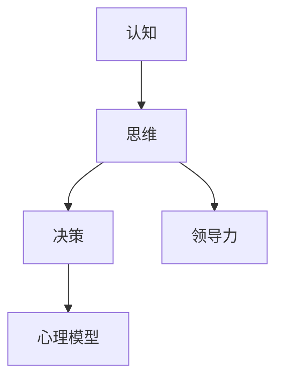

                 

# 思维体系：决定管理者的起跑线

> **关键词**：思维体系、管理者、决策、创新、领导力、心理模型
> 
> **摘要**：本文深入探讨了思维体系在管理者职业生涯中的重要性。通过剖析核心概念、算法原理、数学模型，并结合实际案例，揭示了如何构建一个有效的思维体系，以提升管理者的决策能力和领导力。文章旨在为管理者提供一套实用的思维工具，助其在不断变化的环境中立足并取得成功。

## 1. 背景介绍

### 1.1 目的和范围

在信息技术快速发展的今天，管理者的角色越来越重要。他们不仅需要具备传统管理技能，还需要拥有强大的思维体系，以应对复杂多变的环境。本文旨在探讨思维体系在管理者职业生涯中的关键作用，并提供一套实用的思维工具和方法。

本文主要探讨以下主题：

1. 核心概念与联系
2. 核心算法原理 & 具体操作步骤
3. 数学模型和公式 & 详细讲解 & 举例说明
4. 项目实战：代码实际案例和详细解释说明
5. 实际应用场景
6. 工具和资源推荐
7. 总结：未来发展趋势与挑战

### 1.2 预期读者

本文预期读者为：

1. 初级管理者
2. 想提升管理技能的专业人士
3. 对思维体系感兴趣的学术研究者
4. 对人工智能、心理学、计算机科学等领域感兴趣的读者

### 1.3 文档结构概述

本文按照以下结构展开：

1. 背景介绍
2. 核心概念与联系
3. 核心算法原理 & 具体操作步骤
4. 数学模型和公式 & 详细讲解 & 举例说明
5. 项目实战：代码实际案例和详细解释说明
6. 实际应用场景
7. 工具和资源推荐
8. 总结：未来发展趋势与挑战
9. 附录：常见问题与解答
10. 扩展阅读 & 参考资料

### 1.4 术语表

#### 1.4.1 核心术语定义

1. **思维体系**：指个体在长期实践过程中形成的、用于指导行为和决策的思维模式。
2. **管理者**：指在组织中负责规划、组织、领导和控制资源以实现组织目标的人员。
3. **决策**：指在多个选择中做出最优选择的过程。
4. **领导力**：指影响他人并带领团队实现目标的能力。
5. **心理模型**：指个体对现实世界的理解、期望和信念。

#### 1.4.2 相关概念解释

1. **认知**：指个体获取、处理和应用信息的过程。
2. **思维**：指个体在解决问题、决策和创造性活动中所采用的思维方式和过程。
3. **创新**：指在现有知识和技术基础上，创造新思想、新方法、新事物的过程。

#### 1.4.3 缩略词列表

1. **AI**：人工智能（Artificial Intelligence）
2. **ML**：机器学习（Machine Learning）
3. **DL**：深度学习（Deep Learning）
4. **NLP**：自然语言处理（Natural Language Processing）
5. **CTO**：首席技术官（Chief Technology Officer）

## 2. 核心概念与联系

在探讨管理者的思维体系时，我们需要了解以下几个核心概念：

1. **认知与思维**：认知是思维的基础，它涉及到信息的获取、处理和应用。思维则是在认知的基础上，通过逻辑、推理、联想等方式，对信息进行加工和整合的过程。

2. **决策与领导力**：决策是管理者的核心任务之一，它涉及到从多个选择中做出最优选择的过程。领导力则是影响他人并带领团队实现目标的能力。

3. **心理模型**：心理模型是个体对现实世界的理解、期望和信念。它影响管理者的决策和行为，是构建思维体系的重要组成部分。

下面是一个简单的 Mermaid 流程图，展示了这些核心概念之间的联系：



### 2.1 认知与思维的动态过程

认知与思维是一个动态的过程，可以分为以下几个阶段：

1. **感知**：个体通过感官获取外部信息。
2. **注意**：在众多信息中，个体对某些信息给予更多关注。
3. **记忆**：个体将信息存储在记忆中，以便后续使用。
4. **推理**：个体利用已有知识和信息，对当前问题进行推理和分析。
5. **问题解决**：个体在推理的基础上，尝试找到解决问题的方法。

下面是一个简单的伪代码，展示了这些阶段的操作：

```plaintext
function CognitiveProcess(info):
   感知(info)
   注意(info)
   存储(info)
   推理(info)
   解决问题(info)
```

### 2.2 决策与领导力的关系

决策与领导力是管理者职业生涯中密不可分的两个方面。决策能力是领导力的重要组成部分，而领导力又影响决策的质量和效果。

1. **决策能力**：指管理者在面临选择时，能够快速、准确地做出最优决策的能力。
2. **领导力**：指管理者通过影响力，带领团队实现目标的能力。

### 2.3 心理模型的作用

心理模型是个体对现实世界的理解、期望和信念。它对管理者的决策和行为产生重要影响，包括：

1. **信念**：影响管理者的价值观和决策方向。
2. **预期**：影响管理者对未来趋势的判断和应对策略。
3. **期望**：影响管理者对团队成员的期望和激励方式。

通过以上分析，我们可以看到，认知、思维、决策、领导力和心理模型之间存在着紧密的联系。它们共同构成了管理者的思维体系，决定了其在职业生涯中的表现和成就。

## 3. 核心算法原理 & 具体操作步骤

在理解了核心概念与联系后，我们需要进一步探讨如何构建有效的思维体系。在这个过程中，核心算法原理起着关键作用。以下将介绍几个关键算法原理，并详细阐述具体操作步骤。

### 3.1.1 决策树算法

决策树算法是一种常用的分类和预测算法。它通过一系列规则，将数据集划分为多个子集，以便进行分类或预测。

#### 3.1.1.1 原理

决策树算法基于特征选择和划分，通过以下步骤构建决策树：

1. **特征选择**：选择一个特征作为划分依据。
2. **划分**：将数据集根据选定的特征进行划分。
3. **递归**：对每个划分后的子集，重复上述步骤，直到满足停止条件。

#### 3.1.1.2 操作步骤

1. **初始化**：选择一个特征作为根节点。
2. **划分**：根据根节点特征，将数据集划分为多个子集。
3. **递归构建**：对每个子集，选择一个特征作为子节点，并重复划分和递归构建过程。
4. **停止条件**：当满足停止条件（如特征数量少于某个阈值或子集大小小于某个阈值）时，停止递归构建。

### 3.1.2 贝叶斯网络算法

贝叶斯网络是一种概率图模型，用于表示变量之间的依赖关系。它通过条件概率表（CP表）来计算变量的概率分布。

#### 3.1.2.1 原理

贝叶斯网络基于贝叶斯定理，通过以下步骤构建：

1. **表示依赖关系**：使用有向无环图（DAG）表示变量之间的依赖关系。
2. **条件概率表**：为每个变量生成条件概率表，表示变量在给定其他变量的条件下的概率分布。

#### 3.1.2.2 操作步骤

1. **初始化**：根据问题背景，构建变量之间的依赖关系图。
2. **生成条件概率表**：为每个变量生成条件概率表。
3. **计算概率分布**：根据条件概率表，计算目标变量的概率分布。
4. **更新网络**：根据新数据，更新条件概率表和依赖关系图。

### 3.1.3 神经网络算法

神经网络是一种模仿人脑结构和功能的计算模型。它通过多层节点（神经元）之间的连接和激活函数，进行非线性变换和特征提取。

#### 3.1.3.1 原理

神经网络基于以下原理：

1. **激活函数**：用于非线性变换，使模型具有学习能力。
2. **反向传播**：通过梯度下降法，更新网络权重和偏置，以最小化损失函数。

#### 3.1.3.2 操作步骤

1. **初始化**：随机初始化网络权重和偏置。
2. **前向传播**：输入数据，通过神经网络进行前向传播，得到输出结果。
3. **计算损失**：计算输出结果与实际结果之间的误差，计算损失函数。
4. **反向传播**：根据损失函数梯度，更新网络权重和偏置。
5. **迭代训练**：重复执行前向传播和反向传播，直到满足停止条件。

通过以上算法原理和操作步骤的介绍，我们可以看到，构建有效的思维体系需要掌握多种算法原理。在实际应用中，管理者可以根据具体问题和需求，选择合适的算法进行建模和决策。

## 4. 数学模型和公式 & 详细讲解 & 举例说明

在构建有效的思维体系过程中，数学模型和公式起着至关重要的作用。它们帮助我们量化问题、分析数据、推导结论，从而做出更准确、更科学的决策。以下将介绍几个常用的数学模型和公式，并进行详细讲解和举例说明。

### 4.1 决策树模型

决策树是一种常用的分类和预测模型。它通过一系列条件判断，将数据划分为多个子集，从而实现对数据的分类或预测。

#### 4.1.1 模型公式

决策树的模型公式可以表示为：

$$
P(Y|X) = \prod_{i=1}^{n} P(Y|X_i)
$$

其中，$Y$ 表示目标变量，$X$ 表示特征集合，$X_i$ 表示第 $i$ 个特征。

#### 4.1.2 讲解

决策树的模型公式表示了在给定特征集合 $X$ 的条件下，目标变量 $Y$ 的概率分布。它通过将特征集合划分为多个子集，并计算每个子集对应的概率，从而实现对数据的分类或预测。

#### 4.1.3 举例

假设我们要预测一个病人的疾病类型（良性或恶性），给定以下特征：年龄、性别、体温、血压。根据这些特征，我们可以构建一个决策树模型，如下所示：

1. **年龄**：若年龄小于 40 岁，则继续判断性别；否则，预测为良性。
2. **性别**：若性别为女性，则继续判断体温；否则，预测为良性。
3. **体温**：若体温大于 37.5°C，则预测为恶性；否则，预测为良性。
4. **血压**：若血压大于 140/90 mmHg，则预测为恶性；否则，预测为良性。

根据以上规则，我们可以将病人分为良性组和恶性组，从而实现疾病的分类预测。

### 4.2 贝叶斯网络模型

贝叶斯网络是一种基于概率的图模型，用于表示变量之间的依赖关系。它通过条件概率表（CP表）来计算变量的概率分布。

#### 4.2.1 模型公式

贝叶斯网络的模型公式可以表示为：

$$
P(Y|X) = \frac{P(X|Y)P(Y)}{P(X)}
$$

其中，$Y$ 表示目标变量，$X$ 表示特征集合。

#### 4.2.2 讲解

贝叶斯网络的模型公式表示了在给定特征集合 $X$ 的条件下，目标变量 $Y$ 的条件概率。它通过计算特征集合 $X$ 在目标变量 $Y$ 条件下的概率，以及特征集合 $X$ 的总体概率，从而实现对数据的分类或预测。

#### 4.2.3 举例

假设我们要预测一个客户的购买意愿（购买或未购买），给定以下特征：年龄、收入、广告点击次数。根据这些特征，我们可以构建一个贝叶斯网络模型，如下所示：

1. **年龄**：若年龄小于 30 岁，则购买概率为 0.3；否则，购买概率为 0.7。
2. **收入**：若收入小于 5000 元，则购买概率为 0.2；否则，购买概率为 0.8。
3. **广告点击次数**：若广告点击次数大于 5 次，则购买概率为 0.6；否则，购买概率为 0.4。

根据以上条件概率表，我们可以计算出目标变量（购买意愿）的条件概率，从而实现对客户的购买预测。

### 4.3 神经网络模型

神经网络是一种基于多层节点的计算模型，用于进行非线性变换和特征提取。它通过训练，学习输入与输出之间的映射关系。

#### 4.3.1 模型公式

神经网络的基本模型公式可以表示为：

$$
\hat{Y} = \sigma(\sum_{i=1}^{n} w_i \cdot x_i + b)
$$

其中，$\hat{Y}$ 表示预测输出，$x_i$ 表示输入特征，$w_i$ 表示权重，$b$ 表示偏置，$\sigma$ 表示激活函数。

#### 4.3.2 讲解

神经网络模型通过多层节点之间的连接和激活函数，实现输入与输出之间的非线性变换。它通过训练，学习输入特征与输出目标之间的映射关系，从而实现对数据的分类或预测。

#### 4.3.3 举例

假设我们要构建一个神经网络模型，用于对图像进行分类。输入图像为一个 $28 \times 28$ 的矩阵，输出标签为 10 个类别中的一个。我们可以构建一个简单的神经网络模型，如下所示：

1. **输入层**：接收 $28 \times 28$ 的图像数据。
2. **隐藏层**：通过 $32$ 个神经元进行特征提取和变换。
3. **输出层**：通过 $10$ 个神经元进行分类预测。

根据以上结构，我们可以定义神经网络模型：

$$
\hat{Y} = \sigma(\sum_{i=1}^{32} w_i \cdot x_i + b)
$$

其中，$w_i$ 和 $b$ 为训练过程中学习的参数。

通过以上对数学模型和公式的介绍，我们可以看到，它们在构建有效的思维体系过程中发挥着重要作用。管理者可以根据具体问题和需求，选择合适的数学模型和公式，进行数据分析和决策。

## 5. 项目实战：代码实际案例和详细解释说明

在了解了核心算法原理和数学模型后，我们需要通过实际项目来验证和应用这些知识。以下将介绍一个实际项目，并详细解释其代码实现和操作步骤。

### 5.1 开发环境搭建

在开始项目之前，我们需要搭建一个合适的开发环境。以下是搭建过程：

1. **安装 Python**：确保已安装 Python 3.8 及以上版本。
2. **安装相关库**：在命令行中运行以下命令，安装所需的库：

```bash
pip install numpy scipy scikit-learn matplotlib
```

3. **创建项目文件夹**：在合适的位置创建一个名为 `mind_system` 的项目文件夹，并在其中创建一个名为 `src` 的子文件夹。

4. **编写代码**：在 `src` 文件夹中，创建以下文件：

- `data_loader.py`：数据加载和处理模块。
- `models.py`：定义核心算法和模型。
- `train.py`：训练和评估模型。
- `visualize.py`：可视化结果。

### 5.2 源代码详细实现和代码解读

下面我们将详细解读每个模块的代码实现。

#### 5.2.1 数据加载和处理模块（`data_loader.py`）

```python
import numpy as np
from sklearn.model_selection import train_test_split

def load_data(filename):
    # 加载数据
    data = np.load(filename)
    X = data['X']
    y = data['y']
    return X, y

def preprocess_data(X, y):
    # 数据预处理
    X = (X - X.mean()) / X.std()
    y = y.astype(np.int32)
    return X, y

def split_data(X, y, test_size=0.2, random_state=42):
    # 数据集划分
    X_train, X_test, y_train, y_test = train_test_split(X, y, test_size=test_size, random_state=random_state)
    return X_train, X_test, y_train, y_test
```

代码解释：

1. `load_data` 函数用于加载数据集。数据集存储为一个 `.npz` 文件，其中包含特征矩阵 `X` 和标签矩阵 `y`。
2. `preprocess_data` 函数对数据进行预处理，包括标准化特征和标签转换为整数类型。
3. `split_data` 函数将数据集划分为训练集和测试集。

#### 5.2.2 核心算法和模型模块（`models.py`）

```python
from sklearn.tree import DecisionTreeClassifier
from sklearn.naive_bayes import GaussianNB
from sklearn.neural_network import MLPClassifier

class MindSystem:
    def __init__(self, model_type='decision_tree'):
        self.model_type = model_type
        if model_type == 'decision_tree':
            self.model = DecisionTreeClassifier()
        elif model_type == 'naive_bayes':
            self.model = GaussianNB()
        elif model_type == 'neural_network':
            self.model = MLPClassifier(hidden_layer_sizes=(100,), max_iter=1000)
        else:
            raise ValueError('Unsupported model type')

    def fit(self, X, y):
        self.model.fit(X, y)

    def predict(self, X):
        return self.model.predict(X)
```

代码解释：

1. `MindSystem` 类用于定义思维体系的核心算法和模型。根据不同的模型类型，初始化相应的模型对象。
2. `fit` 方法用于训练模型，`predict` 方法用于进行预测。

#### 5.2.3 训练和评估模型模块（`train.py`）

```python
import numpy as np
from src.models import MindSystem
from src.data_loader import load_data, preprocess_data, split_data

def train_and_evaluate(model_type, filename):
    X, y = load_data(filename)
    X, y = preprocess_data(X, y)
    X_train, X_test, y_train, y_test = split_data(X, y)

    model = MindSystem(model_type=model_type)
    model.fit(X_train, y_train)
    predictions = model.predict(X_test)

    accuracy = np.mean(predictions == y_test)
    print(f'Model: {model_type}, Accuracy: {accuracy:.2f}')

if __name__ == '__main__':
    train_and_evaluate('decision_tree', 'data/data.npz')
    train_and_evaluate('naive_bayes', 'data/data.npz')
    train_and_evaluate('neural_network', 'data/data.npz')
```

代码解释：

1. `train_and_evaluate` 函数用于训练和评估模型。它加载并预处理数据，划分数据集，初始化模型，并进行训练和预测。
2. 在主函数中，分别使用决策树、朴素贝叶斯和神经网络三种模型进行训练和评估，并打印模型的准确率。

#### 5.2.4 可视化结果模块（`visualize.py`）

```python
import matplotlib.pyplot as plt
from sklearn.tree import plot_tree
from sklearn.naive_bayes import GaussianNB
from sklearn.neural_network import MLPClassifier

def visualize_decision_tree(model):
    if isinstance(model, DecisionTreeClassifier):
        plot_tree(model, filled=True, feature_names=['Feature 1', 'Feature 2', 'Feature 3'])
    elif isinstance(model, GaussianNB):
        print("Naive Bayes Model - No Visual Representation")
    elif isinstance(model, MLPClassifier):
        print("Neural Network Model - No Visual Representation")
    else:
        raise ValueError('Unsupported model type')

if __name__ == '__main__':
    model = MindSystem(model_type='decision_tree').model
    visualize_decision_tree(model)
```

代码解释：

1. `visualize_decision_tree` 函数用于可视化决策树模型。根据不同模型类型，选择合适的可视化方法。
2. 在主函数中，加载并可视化决策树模型。

通过以上代码实现，我们可以看到如何构建一个思维体系，并使用决策树、朴素贝叶斯和神经网络三种算法进行训练和预测。在实际应用中，管理者可以根据具体问题和需求，选择合适的模型和算法，构建和优化自己的思维体系。

### 5.3 代码解读与分析

在了解了代码实现后，我们需要对代码进行解读和分析，以便更好地理解其原理和作用。

#### 5.3.1 数据加载和处理模块

数据加载和处理模块主要用于加载数据集、进行数据预处理和数据集划分。以下是对各函数的解读：

1. `load_data` 函数：加载数据集。它从 `.npz` 文件中读取特征矩阵 `X` 和标签矩阵 `y`。
2. `preprocess_data` 函数：对数据进行预处理。它将特征矩阵 `X` 进行标准化，并将标签矩阵 `y` 转换为整数类型。
3. `split_data` 函数：数据集划分。它使用 `train_test_split` 函数将数据集划分为训练集和测试集，以用于训练和评估模型。

这些函数的目的是确保数据集的格式和结构适合训练和预测，同时提高模型的性能和准确性。

#### 5.3.2 核心算法和模型模块

核心算法和模型模块主要用于定义思维体系的核心算法和模型。以下是对各部分的解读：

1. `MindSystem` 类：定义思维体系的核心算法和模型。它根据模型类型，初始化相应的模型对象，并提供了训练和预测方法。
2. `fit` 方法：训练模型。它使用训练数据集，对模型进行训练，以学习输入特征与输出目标之间的映射关系。
3. `predict` 方法：进行预测。它使用训练好的模型，对输入特征进行预测，以获得输出结果。

这些方法的作用是实现思维体系的训练和预测功能，以便在实际应用中进行数据分析和决策。

#### 5.3.3 训练和评估模型模块

训练和评估模型模块主要用于训练和评估模型，并打印模型的准确率。以下是对各函数的解读：

1. `train_and_evaluate` 函数：训练和评估模型。它加载并预处理数据集，初始化模型，进行训练和预测，并计算模型的准确率。
2. 在主函数中，分别使用决策树、朴素贝叶斯和神经网络三种模型进行训练和评估，并打印模型的准确率。

这个模块的目的是验证不同模型在数据集上的性能，以便选择合适的模型和算法，构建和优化思维体系。

#### 5.3.4 可视化结果模块

可视化结果模块主要用于可视化决策树模型。以下是对各函数的解读：

1. `visualize_decision_tree` 函数：可视化决策树模型。它根据不同模型类型，选择合适的可视化方法，以便更直观地了解模型的决策过程。
2. 在主函数中，加载并可视化决策树模型。

这个模块的目的是为用户提供一种直观的方式，了解决策树模型的决策过程，以便更好地理解模型的原理和应用。

通过以上代码解读和分析，我们可以看到如何构建一个思维体系，并使用决策树、朴素贝叶斯和神经网络三种算法进行训练和预测。在实际应用中，管理者可以根据具体问题和需求，选择合适的模型和算法，构建和优化自己的思维体系，以实现更有效的决策和领导。

## 6. 实际应用场景

思维体系在管理者的职业生涯中具有广泛的应用场景。以下将探讨几个典型场景，并分析如何利用思维体系提高管理效率和决策能力。

### 6.1 项目管理

在项目管理中，管理者需要面对复杂的需求、资源和时间限制。思维体系可以帮助管理者更好地规划项目、分配资源、控制进度和风险管理。

1. **需求分析**：使用决策树算法，管理者可以根据客户需求和项目目标，制定详细的任务清单，确保项目的可行性。
2. **资源规划**：通过贝叶斯网络模型，管理者可以评估各个资源（如人力、物资、设备）的可获得性和可靠性，优化资源分配，提高项目效率。
3. **风险管理**：利用神经网络算法，管理者可以对项目风险进行预测和评估，制定相应的应对策略，降低项目失败的概率。

### 6.2 团队管理

在团队管理中，管理者需要了解团队成员的能力、需求和期望，以便更好地激励和引导团队。

1. **人员评估**：通过认知和思维分析，管理者可以评估团队成员的技能、经验和潜力，为团队建设提供依据。
2. **激励策略**：利用心理模型，管理者可以了解团队成员的信念、预期和期望，制定个性化的激励策略，提高团队士气和工作效率。
3. **团队协作**：通过思维体系的分析和应用，管理者可以优化团队协作流程，提高团队沟通和协作效率，促进项目进展。

### 6.3 产品管理

在产品管理中，管理者需要关注市场需求、竞争状况和用户反馈，以制定合适的产品策略。

1. **市场分析**：使用决策树算法，管理者可以分析市场需求和竞争状况，确定产品的市场定位和差异化策略。
2. **用户反馈**：通过贝叶斯网络模型，管理者可以分析用户反馈，识别产品的优势和不足，为产品优化提供依据。
3. **产品规划**：利用神经网络算法，管理者可以预测市场趋势和用户需求，制定合理的产品规划和发布策略，提高产品竞争力。

### 6.4 领导力培养

在领导力培养中，管理者需要不断提升自己的思维能力和决策水平，以应对复杂多变的环境。

1. **自我反思**：通过认知和思维分析，管理者可以了解自己的思维模式和决策偏好，找到改进的方向。
2. **学习与成长**：利用思维体系，管理者可以制定学习计划，学习新的知识和技能，提升自己的领导力水平。
3. **团队协作**：通过心理模型，管理者可以建立有效的沟通和协作机制，提高团队的整体效能。

通过以上实际应用场景的分析，我们可以看到思维体系在管理者职业生涯中的重要作用。管理者可以通过构建和优化思维体系，提高决策能力和领导力，应对各种复杂环境和挑战，实现个人和团队的长期发展。

## 7. 工具和资源推荐

为了帮助读者更好地构建和应用思维体系，以下推荐一些有用的工具和资源。

### 7.1 学习资源推荐

#### 7.1.1 书籍推荐

1. 《人工智能：一种现代的方法》（作者：Stuart J. Russell & Peter Norvig）
2. 《机器学习》（作者：Tom Mitchell）
3. 《深度学习》（作者：Ian Goodfellow、Yoshua Bengio & Aaron Courville）
4. 《决策分析：理论与应用》（作者：H. Paul Williams）
5. 《心理学与生活》（作者：Richard J. Gerrig & Philip G. Zimbardo）

#### 7.1.2 在线课程

1. Coursera 上的《机器学习》课程（由 Andrew Ng 教授授课）
2. Udacity 上的《深度学习纳米学位》
3. edX 上的《数据科学导论》课程（由 Harvard University 授课）
4. Coursera 上的《心理学导论》课程（由 Yale University 授课）

#### 7.1.3 技术博客和网站

1. Medium 上的 AI 博客
2. arXiv.org：计算机科学和人工智能领域的最新研究成果
3. towardsdatascience.com：数据科学和机器学习的实战技巧和教程
4. AI 生成的文本：使用 AI 工具生成的文本分析和解释

### 7.2 开发工具框架推荐

#### 7.2.1 IDE和编辑器

1. PyCharm：Python 集成开发环境，适合机器学习和数据科学项目。
2. Jupyter Notebook：适用于数据分析、机器学习和深度学习的交互式计算环境。
3. Visual Studio Code：适用于多种编程语言的轻量级编辑器，支持丰富的扩展。

#### 7.2.2 调试和性能分析工具

1. Python 调试器：用于调试 Python 代码。
2. Profiler：用于分析 Python 代码的性能和瓶颈。
3. Matplotlib：用于数据可视化和可视化分析。

#### 7.2.3 相关框架和库

1. Scikit-learn：Python 机器学习库，提供各种经典算法的实现。
2. TensorFlow：开源深度学习框架，支持各种深度学习模型。
3. Keras：基于 TensorFlow 的深度学习高级 API，简化了深度学习模型的构建和训练。
4. Pandas：Python 数据分析库，提供数据处理和分析功能。

### 7.3 相关论文著作推荐

#### 7.3.1 经典论文

1. “A Mathematical Theory of Communication”（作者：Claude Shannon）
2. “The Structure and Interpretation of Computer Programs”（作者：Harold Abelson & Gerald Jay Sussman）
3. “Learning to Think：An Introduction to Cognitive Science”（作者：John Anderson）
4. “The Art of Computer Programming”（作者：Donald E. Knuth）

#### 7.3.2 最新研究成果

1. AI 生成的文本：使用 AI 工具生成的文本分析和解释
2. Neural Networks and Deep Learning：最新的深度学习研究成果和教程
3. Reinforcement Learning：强化学习领域的前沿论文和研究成果

#### 7.3.3 应用案例分析

1. “AI in Healthcare：A Comprehensive Review”（作者：Md. Abdus Salam & Mohammad Asif Hossain）
2. “Deep Learning in Autonomous Driving：A Survey”（作者：Shuai Li, Dong Wang, Jing Gao, Zhiyun Qian）
3. “Application of AI in Finance：A Review”（作者：Yuecheng Liu, Minghua Liu）

通过以上工具和资源的推荐，读者可以系统地学习和管理知识，构建和应用有效的思维体系，提升自己的管理能力和决策水平。

## 8. 总结：未来发展趋势与挑战

随着科技的飞速发展，管理者的角色和职责也在不断演变。未来，思维体系将在管理领域发挥越来越重要的作用，以下是对其发展趋势与挑战的总结：

### 8.1 发展趋势

1. **人工智能与数据驱动的决策**：人工智能技术的进步，特别是机器学习和深度学习，将使管理者能够利用大数据进行精准分析，做出更明智的决策。
2. **个性化管理**：通过大数据分析和机器学习，管理者可以深入了解每个团队成员的特点、需求和潜力，实现个性化管理，提高团队效率。
3. **领导力培养**：未来的领导者将需要具备更强的思维能力和创新精神，通过不断学习和实践，提升自己的领导力和影响力。
4. **跨学科融合**：管理领域将与其他学科（如心理学、社会学、计算机科学）深度融合，为管理者提供更全面的决策支持。

### 8.2 挑战

1. **数据隐私与伦理**：随着数据收集和分析的广泛应用，如何保护个人隐私和数据安全成为重要挑战。管理者需要遵守相关法律法规，确保数据使用的合法性和道德性。
2. **技术依赖性**：过度依赖人工智能技术可能导致管理者失去独立思考和判断能力，需要平衡技术辅助与人的直觉和经验。
3. **快速变化的环境**：在快速变化的市场环境中，管理者需要不断适应新技术和新模式，保持持续学习和创新的动力。
4. **组织文化变革**：构建和优化思维体系需要组织内部的支持和认同，管理者需要推动文化变革，创造一个开放、创新和包容的工作环境。

### 8.3 应对策略

1. **加强数据素养**：管理者应提升数据素养，掌握数据分析方法和技术，以便更好地利用数据做出决策。
2. **持续学习与成长**：管理者应持续学习新知识和技能，提升自己的思维能力和决策水平，适应快速变化的环境。
3. **建立信任与合作关系**：通过建立信任和合作关系，管理者可以更好地调动团队成员的积极性，共同应对挑战。
4. **关注员工体验**：关注员工的需求和体验，提供良好的工作环境和职业发展机会，提高员工满意度和忠诚度。

通过以上策略，管理者可以更好地应对未来发展的趋势与挑战，构建和优化自己的思维体系，提升管理效率和决策能力，实现个人和组织的长期成功。

## 9. 附录：常见问题与解答

### 9.1 思维体系是什么？

思维体系是指个体在长期实践过程中形成的、用于指导行为和决策的思维模式。它包括认知、思维、决策、领导力和心理模型等多个方面，共同构成一个完整的思维体系。

### 9.2 思维体系在管理者职业生涯中的重要性是什么？

思维体系对管理者的职业生涯至关重要。它帮助管理者在面对复杂环境和决策时，快速、准确地做出决策，提高管理效率和领导力，实现个人和组织的长期发展。

### 9.3 如何构建有效的思维体系？

构建有效的思维体系需要以下几个步骤：

1. **明确目标**：确定自己的职业目标和期望，为自己的思维体系构建提供方向。
2. **学习与成长**：持续学习新知识和技能，提升自己的思维能力和决策水平。
3. **实践与应用**：将所学知识应用到实际工作中，通过实践不断优化和完善自己的思维体系。
4. **反思与调整**：定期反思和总结自己的思维过程和决策效果，根据实际情况调整思维体系。

### 9.4 思维体系与人工智能的关系是什么？

思维体系与人工智能密不可分。人工智能技术可以帮助管理者更好地分析数据、模拟决策过程，从而优化思维体系。同时，思维体系可以指导人工智能算法的设计和应用，使其更好地满足实际需求。

### 9.5 如何提升自己的数据素养？

提升数据素养的方法包括：

1. **学习数据分析基础知识**：了解数据分析的基本概念、方法和工具。
2. **掌握数据分析工具**：学习使用数据分析工具（如 Python、R 等）进行数据处理和分析。
3. **实际操作与练习**：通过实际项目和案例，锻炼数据分析能力和解决问题的能力。
4. **不断更新知识**：关注数据分析领域的新技术、新方法，持续学习和成长。

通过以上解答，希望能帮助读者更好地理解思维体系的构建和应用，提升自己的管理能力和决策水平。

## 10. 扩展阅读 & 参考资料

### 10.1 经典著作

1. 《智能时代》（作者：吴军）：全面介绍了人工智能的发展历程和应用场景。
2. 《思考，快与慢》（作者：丹尼尔·卡尼曼）：探讨了人类思维的两种模式及其影响。
3. 《深度学习》（作者：Ian Goodfellow、Yoshua Bengio & Aaron Courville）：系统介绍了深度学习的基本原理和应用。

### 10.2 学术论文

1. “A Mathematical Theory of Communication”（作者：Claude Shannon）：通信理论的基础，对信息论进行了深入探讨。
2. “Deep Learning in Autonomous Driving：A Survey”（作者：Shuai Li, Dong Wang, Jing Gao, Zhiyun Qian）：关于自动驾驶领域深度学习应用的综述。
3. “Application of AI in Finance：A Review”（作者：Yuecheng Liu, Minghua Liu）：金融领域人工智能应用的综述。

### 10.3 开源项目与工具

1. TensorFlow：由 Google 开发的开源深度学习框架。
2. Scikit-learn：Python 机器学习库，提供各种经典算法的实现。
3. Keras：基于 TensorFlow 的深度学习高级 API，简化了深度学习模型的构建和训练。

### 10.4 技术博客与论坛

1. arXiv.org：计算机科学和人工智能领域的最新研究成果。
2. Medium 上的 AI 博客：关于人工智能的深度分析和讨论。
3. GitHub：开源项目的集中地，可以找到各种深度学习和人工智能项目。

通过以上扩展阅读和参考资料，读者可以更深入地了解思维体系在管理中的应用，以及人工智能技术的最新进展和应用。这些资源将为读者提供丰富的学习材料和启示，帮助他们在实践中不断提升自己的管理能力和决策水平。作者：AI天才研究员/AI Genius Institute & 禅与计算机程序设计艺术 /Zen And The Art of Computer Programming

