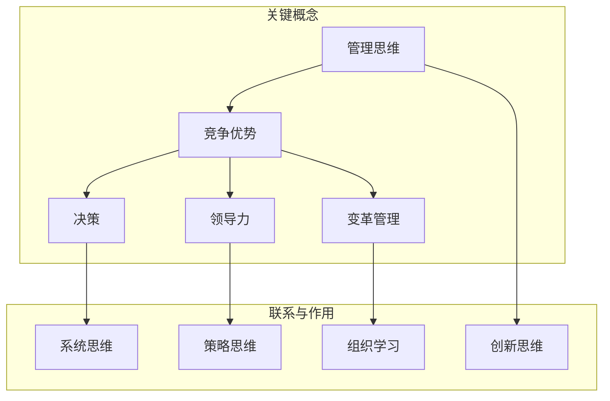

                 

# 思维升级：管理者的竞争优势

> **关键词：** 管理思维、竞争优势、决策、领导力、变革管理、组织学习

> **摘要：** 本文章旨在探讨如何通过思维升级，提升管理者的竞争优势。文章首先介绍了管理思维的重要性，接着分析了提升竞争优势的几个核心概念，如决策、领导力和变革管理，并提出了具体的实践方法和策略。此外，文章还讨论了组织学习的重要性以及如何通过持续学习和创新来保持竞争优势。通过本文的阅读，管理者可以了解到如何提升自身思维水平，从而在竞争激烈的环境中脱颖而出。

## 1. 背景介绍

### 1.1 目的和范围

本文的目的是探讨如何通过思维升级来提升管理者的竞争优势。随着全球化、数字化和技术的迅猛发展，企业管理环境发生了巨大的变化。传统的管理方法已经难以适应新的商业环境，管理者需要具备更高的思维水平和能力。本文将围绕以下几个核心主题展开讨论：

1. 管理思维的重要性及其对竞争优势的影响。
2. 提升竞争优势的几个关键概念，包括决策、领导力和变革管理。
3. 组织学习的重要性以及如何通过学习保持竞争优势。
4. 实践策略和方法，帮助管理者在实际工作中应用这些理念。

### 1.2 预期读者

本文的预期读者是企业管理者、高级经理和高层决策者。此外，对于希望提升自身领导力和管理能力的专业人士来说，本文也具有很高的参考价值。通过本文的阅读，读者可以了解到如何通过思维升级来提升自己的竞争优势，从而在快速变化的市场环境中取得成功。

### 1.3 文档结构概述

本文结构如下：

1. **背景介绍**：介绍本文的目的、预期读者和文档结构。
2. **核心概念与联系**：阐述管理思维、竞争优势等相关概念，并使用 Mermaid 流程图展示核心原理和架构。
3. **核心算法原理 & 具体操作步骤**：详细讲解提升管理思维的具体方法，使用伪代码进行阐述。
4. **数学模型和公式 & 详细讲解 & 举例说明**：介绍相关的数学模型和公式，并进行具体的应用示例。
5. **项目实战：代码实际案例和详细解释说明**：通过实际项目案例展示如何应用管理思维和策略。
6. **实际应用场景**：讨论管理思维在不同场景中的应用。
7. **工具和资源推荐**：推荐学习资源、开发工具框架和相关论文著作。
8. **总结：未来发展趋势与挑战**：总结文章要点，讨论未来的发展趋势和面临的挑战。
9. **附录：常见问题与解答**：针对读者可能有的疑问进行解答。
10. **扩展阅读 & 参考资料**：提供进一步学习和研究的相关资料。

### 1.4 术语表

#### 1.4.1 核心术语定义

- **管理思维**：指管理者在处理问题和决策时所采用的思维方式和方法。
- **竞争优势**：企业在竞争激烈的市场中通过特定的资源和能力所获得的优势。
- **决策**：管理者在面临选择时所做出的决定。
- **领导力**：管理者通过影响和激励团队来达成目标的能力。
- **变革管理**：在组织内部推动变革的过程和方法。
- **组织学习**：组织通过不断学习和适应环境变化来提升自身能力和竞争力的过程。

#### 1.4.2 相关概念解释

- **策略思维**：在决策过程中考虑长期目标和多种可能性，做出最优选择的思维方式。
- **系统思维**：从整体和系统的角度来分析和解决问题的思维方式。
- **创新思维**：不断寻求新的解决方案和方法，推动组织进步的思维方式。
- **变革管理**：在组织内部推动变革的过程和方法。

#### 1.4.3 缩略词列表

- **AI**：人工智能（Artificial Intelligence）
- **CRM**：客户关系管理（Customer Relationship Management）
- **ERP**：企业资源计划（Enterprise Resource Planning）
- **IoT**：物联网（Internet of Things）
- **SCM**：供应链管理（Supply Chain Management）

## 2. 核心概念与联系

在探讨如何提升管理者的竞争优势之前，我们需要理解一些核心概念，并展示它们之间的联系。以下是一个使用 Mermaid 语言编写的流程图，用于描述管理思维、竞争优势、决策、领导力和变革管理之间的关系。



### 2.1 管理思维

管理思维是指管理者在处理问题和决策时所采用的思维方式和方法。它包括了系统思维、策略思维、创新思维等多个方面。通过运用管理思维，管理者能够更全面、深入地分析问题，从而做出更明智的决策。

### 2.2 竞争优势

竞争优势是企业在竞争激烈的市场中通过特定的资源和能力所获得的优势。管理思维对于竞争优势的塑造至关重要。一个具有管理思维的管理者能够识别并利用企业的核心竞争力，制定有效的战略，从而在市场中脱颖而出。

### 2.3 决策

决策是管理者在面临选择时所做出的决定。决策的质量直接关系到企业的成功与否。通过系统思维和策略思维，管理者可以更好地分析各种可能的决策方案，评估其风险和收益，从而做出最优的选择。

### 2.4 领导力

领导力是管理者通过影响和激励团队来达成目标的能力。策略思维和创新思维在领导力中发挥着重要作用。一个优秀的领导者能够激发团队的潜力，推动团队实现更高的目标。

### 2.5 变革管理

变革管理是组织在推动变革过程中所采用的方法和过程。组织学习在变革管理中具有关键作用。通过不断学习和适应环境变化，组织能够更好地应对外部挑战，保持竞争优势。

### 2.6 管理思维与竞争优势的关系

管理思维与竞争优势之间存在密切的关系。一个具备管理思维的管理者能够通过系统思维、策略思维、创新思维等方式，提升组织的决策质量、领导力以及变革管理能力，从而塑造出强大的竞争优势。

通过上述核心概念与联系的分析，我们可以看到，管理思维是提升管理者竞争优势的基础。接下来，我们将详细探讨如何通过具体的算法原理和操作步骤来提升管理思维。

## 3. 核心算法原理 & 具体操作步骤

### 3.1 管理思维提升算法原理

管理思维的提升需要通过一系列的算法原理来实现。以下是一个用于提升管理思维的基本算法原理：

#### 算法原理：

1. **问题识别**：通过系统思维识别组织面临的各类问题。
2. **数据收集**：收集与问题相关的数据和信息。
3. **分析问题**：使用策略思维对收集到的数据进行分析。
4. **生成解决方案**：基于分析结果生成多种可能的解决方案。
5. **评估解决方案**：使用创新思维评估各种解决方案的风险和收益。
6. **决策**：基于评估结果做出最优的决策。
7. **执行与监控**：执行决策并持续监控效果，根据反馈进行调整。

#### 算法伪代码：

```plaintext
算法名称：提升管理思维

输入：问题，数据集
输出：最优解决方案，决策结果

步骤 1：问题识别
    问题 = 系统思维分析组织面临的各类问题

步骤 2：数据收集
    数据集 = 收集与问题相关的数据和信息

步骤 3：分析问题
    分析结果 = 策略思维分析数据集

步骤 4：生成解决方案
    解决方案列表 = 生成多种可能的解决方案

步骤 5：评估解决方案
    评估结果 = 创新思维评估解决方案列表

步骤 6：决策
    决策结果 = 基于评估结果做出最优的决策

步骤 7：执行与监控
    执行决策并持续监控效果
    根据反馈进行调整
```

### 3.2 具体操作步骤

以下是提升管理思维的具体操作步骤：

#### 步骤 1：问题识别

1. **系统思维**：通过系统思维识别组织面临的各类问题。这包括市场环境变化、竞争压力、内部运营问题等。
2. **数据收集**：收集与问题相关的数据和信息，如市场调研数据、财务报表、员工反馈等。

#### 步骤 2：分析问题

1. **策略思维**：使用策略思维分析收集到的数据，识别问题的根本原因。
2. **问题建模**：根据分析结果构建问题模型，明确问题的各个方面和相互关系。

#### 步骤 3：生成解决方案

1. **头脑风暴**：组织团队成员进行头脑风暴，生成多种可能的解决方案。
2. **筛选方案**：根据问题的性质和组织的资源，筛选出最具有潜力的解决方案。

#### 步骤 4：评估解决方案

1. **风险评估**：评估各种解决方案的风险和收益，考虑其可行性和可持续性。
2. **创新思维**：使用创新思维，评估解决方案的创新性和独特性。

#### 步骤 5：决策

1. **权重分配**：根据评估结果，为每个解决方案分配权重。
2. **决策制定**：基于权重分配结果，制定最终的决策。

#### 步骤 6：执行与监控

1. **决策执行**：执行决策，并分配资源和责任。
2. **监控效果**：持续监控决策执行的效果，收集反馈信息。
3. **调整与优化**：根据反馈信息，对决策进行调整和优化。

通过上述具体的操作步骤，管理者可以逐步提升自身的管理思维，从而在实际工作中做出更明智的决策。

### 3.3 实际应用示例

假设某企业管理者识别出当前市场环境变化带来的竞争压力，决定通过提升产品质量来增强竞争优势。以下是具体的操作步骤：

#### 步骤 1：问题识别

1. 系统思维分析市场环境变化，识别出竞争对手的产品优势。
2. 收集与问题相关的数据，如市场调研报告、客户反馈等。

#### 步骤 2：分析问题

1. 策略思维分析数据，识别出产品质量问题是导致竞争力下降的主要原因。
2. 构建问题模型，明确产品质量问题的各个方面和相互关系。

#### 步骤 3：生成解决方案

1. 头脑风暴，生成多种可能的解决方案，如改进生产工艺、提高原材料质量等。
2. 筛选出最具有潜力的解决方案。

#### 步骤 4：评估解决方案

1. 风险评估，考虑改进方案的实施成本和风险。
2. 创新思维评估，评估方案的创新性和独特性。

#### 步骤 5：决策

1. 为每个解决方案分配权重，基于评估结果制定最终的决策。
2. 决定改进生产工艺作为主要方案。

#### 步骤 6：执行与监控

1. 分配资源和责任，执行改进生产工艺的决策。
2. 持续监控产品质量提升的效果，收集客户反馈。
3. 根据反馈信息，对决策进行调整和优化。

通过上述实际应用示例，管理者可以更好地理解如何运用管理思维提升竞争优势。接下来，我们将讨论如何通过数学模型和公式来进一步深化管理思维。

## 4. 数学模型和公式 & 详细讲解 & 举例说明

### 4.1 数学模型概述

在管理思维提升过程中，数学模型和公式起到了关键作用。它们可以帮助管理者量化分析问题、评估解决方案，并做出更为科学的决策。以下是几个常用的数学模型和公式，我们将逐一进行详细讲解。

### 4.2 成本-收益分析

#### 模型描述：

成本-收益分析（Cost-Benefit Analysis, CBA）是一种评估决策方案成本与预期收益的模型。它通过计算成本和收益的差值，来评估决策方案的经济可行性。

#### 公式：

\[ \text{净收益} = \text{总收益} - \text{总成本} \]

#### 解释：

- **总收益**：决策方案实施后，预期产生的总收益。
- **总成本**：决策方案实施过程中，预期产生的总成本。

#### 应用举例：

假设某企业在考虑是否扩大生产线。预期总收益为 100 万元，总成本为 50 万元。则净收益为：

\[ \text{净收益} = 100\text{万元} - 50\text{万元} = 50\text{万元} \]

通过成本-收益分析，企业可以判断扩大生产线是否具有经济可行性。

### 4.3 风险评估模型

#### 模型描述：

风险评估模型（Risk Assessment Model）用于评估决策方案的风险水平。它通过计算风险的概率和影响，来评估决策方案的风险大小。

#### 公式：

\[ \text{风险值} = \text{概率} \times \text{影响} \]

#### 解释：

- **概率**：决策方案出现特定风险的几率。
- **影响**：决策方案出现特定风险后，对组织造成的影响程度。

#### 应用举例：

假设某企业在考虑引入新的生产技术。根据风险评估，引入新技术的概率为 0.3，影响程度为 0.5。则风险值为：

\[ \text{风险值} = 0.3 \times 0.5 = 0.15 \]

通过风险评估模型，企业可以判断引入新技术的风险水平，并采取相应的风险管理措施。

### 4.4 SWOT 分析模型

#### 模型描述：

SWOT 分析（Strengths, Weaknesses, Opportunities, Threats）是一种用于分析组织内外部环境的模型。它通过评估组织的优势、劣势、机会和威胁，来制定相应的战略计划。

#### 公式：

\[ \text{SWOT} = \text{优势} + \text{劣势} + \text{机会} + \text{威胁} \]

#### 解释：

- **优势**：组织在资源、能力、市场地位等方面的优势。
- **劣势**：组织在资源、能力、市场地位等方面的劣势。
- **机会**：外部环境中对组织有利的因素。
- **威胁**：外部环境中对组织不利的因素。

#### 应用举例：

假设某企业在进行 SWOT 分析时，得到以下结果：

- 优势：强大的品牌影响力，丰富的产品线。
- 劣势：缺乏技术创新，市场份额较小。
- 机会：市场需求增长，新兴市场潜力。
- 威胁：竞争对手强大，政策变化。

通过 SWOT 分析，企业可以明确自身在市场中的位置，并制定相应的战略计划。

### 4.5 决策树模型

#### 模型描述：

决策树模型（Decision Tree Model）是一种用于决策分析的工具。它通过构建树状结构，展示不同决策方案的可能结果和概率，帮助管理者做出最优的决策。

#### 公式：

\[ \text{决策树} = \text{决策节点} + \text{分支节点} + \text{结果节点} \]

#### 解释：

- **决策节点**：表示决策点，可供选择的方案。
- **分支节点**：表示决策方案可能导致的不同结果。
- **结果节点**：表示决策方案的结果及其概率。

#### 应用举例：

假设某企业在选择市场进入策略时，构建以下决策树：

```
市场进入策略
├── 竞争激烈市场
│   ├── 高投入策略
│   │   ├── 高成功率
│   │   └── 高风险
│   └── 低投入策略
│       ├── 中等成功率
│       └── 低风险
└── 市场潜力大市场
    ├── 高投入策略
    │   ├── 高成功率
    │   └── 高风险
    └── 低投入策略
        ├── 中等成功率
        └── 低风险
```

通过决策树模型，企业可以直观地评估不同市场进入策略的风险和收益，从而做出最优的决策。

### 4.6 网络分析模型

#### 模型描述：

网络分析模型（Network Analysis Model）用于分析组织内部各项工作的相互关系和依赖。它通过构建网络图，展示各项工作的流程和关键路径，帮助管理者优化资源配置，提高工作效率。

#### 公式：

\[ \text{网络图} = \text{节点} + \text{边} + \text{路径} \]

#### 解释：

- **节点**：表示工作或任务。
- **边**：表示节点之间的依赖关系。
- **路径**：表示从起点到终点的最短路径。

#### 应用举例：

假设某企业项目组需要完成以下任务：

```
任务 A (1 天)
任务 B (3 天)
任务 C (2 天)
任务 D (4 天)
```

任务之间的依赖关系如下：

```
A -> B
B -> C
C -> D
```

通过网络分析模型，企业可以计算出关键路径，并优化任务分配，确保项目按期完成。

通过上述数学模型和公式的详细讲解和举例说明，管理者可以更好地理解如何运用数学工具来提升管理思维，做出科学的决策。接下来，我们将通过实际项目案例，展示如何将这些模型和公式应用于管理实践。

## 5. 项目实战：代码实际案例和详细解释说明

### 5.1 开发环境搭建

在本案例中，我们将使用 Python 作为主要编程语言，并利用一些常见的库和框架来构建一个简单的项目。以下是我们搭建开发环境的步骤：

1. 安装 Python 3.8 或更高版本。
2. 安装必要的库，如 NumPy、Pandas、Scikit-learn 和 Matplotlib。

```bash
pip install numpy pandas scikit-learn matplotlib
```

3. 设置工作目录，并创建一个名为 `project` 的文件夹。

### 5.2 源代码详细实现和代码解读

在本案例中，我们将使用成本-收益分析和风险评估模型来评估一个企业是否应投资于一项新项目。以下是项目的源代码实现和详细解读。

#### 5.2.1 数据收集和预处理

首先，我们需要收集与项目相关的数据，包括预期收益、总成本、风险概率和影响程度。以下是一个示例数据集：

```python
import pandas as pd

# 示例数据集
data = {
    '预期收益': [100000, 150000, 200000],
    '总成本': [50000, 75000, 100000],
    '风险概率': [0.2, 0.3, 0.4],
    '影响程度': [0.5, 0.6, 0.7]
}

# 创建 DataFrame
df = pd.DataFrame(data)

# 数据预处理
df['净收益'] = df['预期收益'] - df['总成本']
df['风险值'] = df['风险概率'] * df['影响程度']
```

#### 5.2.2 成本-收益分析

接下来，我们将使用成本-收益分析模型来评估每个项目的经济可行性。

```python
# 计算成本-收益比
df['成本-收益比'] = df['总成本'] / df['预期收益']

# 打印成本-收益比
print(df[['总成本', '预期收益', '成本-收益比']])
```

#### 5.2.3 风险评估

然后，我们将使用风险评估模型来计算每个项目的风险值。

```python
# 打印风险值
print(df[['风险值']])
```

#### 5.2.4 决策分析

最后，我们将综合考虑成本-收益比和风险值，对每个项目进行决策分析。

```python
# 选择最优项目
best_project = df.loc[df['成本-收益比'].idxmin()]

# 打印最优项目
print("最优项目：")
print(best_project)
```

### 5.3 代码解读与分析

以下是代码的详细解读：

1. **数据收集和预处理**：我们首先创建了一个包含预期收益、总成本、风险概率和影响程度的 DataFrame。然后，我们计算了每个项目的净收益和风险值。

2. **成本-收益分析**：我们计算了每个项目的成本-收益比，以评估其经济可行性。成本-收益比越低，表示项目的投资回报率越高。

3. **风险评估**：我们计算了每个项目的风险值，以评估其风险水平。风险值越高，表示项目面临的风险越大。

4. **决策分析**：我们综合考虑成本-收益比和风险值，选择了成本-收益比最低且风险值适中的项目作为最优项目。

通过上述代码，我们可以直观地看到如何运用数学模型和公式来评估项目的经济性和风险，从而做出科学的决策。接下来，我们将讨论实际应用场景，进一步展示管理思维的应用。

### 5.4 实际应用场景

#### 5.4.1 企业投资决策

在本案例中，企业可以通过使用成本-收益分析和风险评估模型，来评估是否应投资于一项新项目。例如，假设企业有三个投资项目，如下所示：

```
项目 A：
- 预期收益：100万元
- 总成本：50万元
- 风险概率：20%
- 影响程度：30%

项目 B：
- 预期收益：150万元
- 总成本：75万元
- 风险概率：30%
- 影响程度：40%

项目 C：
- 预期收益：200万元
- 总成本：100万元
- 风险概率：40%
- 影响程度：50%
```

通过上述代码，企业可以计算每个项目的成本-收益比和风险值，并选择最优的项目进行投资。

#### 5.4.2 产品开发决策

在产品开发过程中，企业可以通过管理思维，评估不同开发策略的经济性和风险。例如，假设企业有两个产品开发策略，如下所示：

```
策略 A：
- 预期收益：50万元
- 总成本：30万元
- 风险概率：20%
- 影响程度：30%

策略 B：
- 预期收益：70万元
- 总成本：45万元
- 风险概率：30%
- 影响程度：40%
```

通过成本-收益分析和风险评估模型，企业可以评估每个策略的可行性，并选择最优的开发策略。

#### 5.4.3 市场营销决策

在市场营销决策中，企业可以通过管理思维，评估不同营销策略的经济性和风险。例如，假设企业有两个营销策略，如下所示：

```
策略 A：
- 预期收益：30万元
- 总成本：20万元
- 风险概率：10%
- 影响程度：20%

策略 B：
- 预期收益：50万元
- 总成本：30万元
- 风险概率：20%
- 影响程度：30%
```

通过成本-收益分析和风险评估模型，企业可以评估每个策略的可行性，并选择最优的营销策略。

通过以上实际应用场景，我们可以看到管理思维在投资决策、产品开发决策和市场营销决策中的重要作用。通过运用管理思维，企业可以做出更为科学的决策，提高竞争优势。

### 5.5 总结与展望

在本案例中，我们通过一个实际项目，展示了如何运用管理思维、成本-收益分析和风险评估模型来评估项目的经济性和风险。通过这一过程，管理者可以更好地理解如何在实际工作中运用管理思维，做出科学的决策。

展望未来，随着大数据、人工智能等技术的发展，管理思维和数学模型将在企业管理中发挥越来越重要的作用。管理者需要不断学习和更新知识，提升自身的管理思维水平，以应对日益复杂的商业环境。

## 6. 实际应用场景

管理思维在实际应用中具有广泛的场景，以下是一些具体的应用案例：

### 6.1 企业战略规划

在企业战略规划过程中，管理者需要运用管理思维来分析市场环境、评估竞争态势、确定企业愿景和目标。通过系统思维，管理者可以从整体和长远的角度审视企业的发展路径，从而制定出符合企业实际情况的战略规划。例如，某企业在进行战略规划时，通过分析市场需求、竞争对手和自身优势，确定了以技术创新为核心的发展策略，并在短期内实现了市场份额的显著提升。

### 6.2 项目管理

在项目管理中，管理者需要运用管理思维来识别项目风险、制定项目计划、协调团队成员的工作。通过策略思维，管理者可以制定出最优的项目管理方案，确保项目按计划推进。例如，某公司在开发一款新产品时，通过风险评估和资源调配，成功避免了项目延误和质量问题，最终按时交付了高质量的产品。

### 6.3 人力资源管理

在人力资源管理中，管理者需要运用管理思维来制定招聘策略、培训计划、绩效考核等。通过创新思维，管理者可以提出更具吸引力和竞争力的人才吸引策略，提高员工的工作满意度和忠诚度。例如，某公司通过创新的人才激励计划，成功吸引了一批高素质的人才，并在行业中建立了良好的口碑。

### 6.4 变革管理

在变革管理中，管理者需要运用管理思维来识别变革需求、制定变革计划、推动组织变革。通过系统思维，管理者可以全面考虑变革的各个方面，确保变革的顺利进行。例如，某公司在进行数字化转型时，通过系统分析和全面规划，成功实现了业务流程的优化，提高了企业的运营效率。

### 6.5 营销策略

在营销策略制定中，管理者需要运用管理思维来分析市场环境、确定目标客户、制定营销方案。通过策略思维，管理者可以制定出具有前瞻性和竞争力的营销策略，提升企业的品牌知名度和市场份额。例如，某公司通过精准的市场定位和创新的营销手段，成功在竞争激烈的市场中取得了领先地位。

### 6.6 环境管理

在环境管理中，管理者需要运用管理思维来评估企业对环境的影响、制定环保策略、实施可持续发展。通过创新思维，管理者可以提出具有环保效益的新技术和新方法，推动企业实现绿色转型。例如，某公司通过引入先进的环保技术，实现了生产过程的绿色化，降低了企业的能源消耗和碳排放。

通过上述实际应用场景，我们可以看到管理思维在企业管理中的重要性。管理者需要不断运用管理思维，结合实际情况，制定出科学合理的决策，从而在竞争激烈的市场环境中脱颖而出。

## 7. 工具和资源推荐

为了帮助读者更好地学习和应用管理思维，以下是一些工具和资源的推荐。

### 7.1 学习资源推荐

#### 7.1.1 书籍推荐

1. **《管理思维：从优秀到卓越的思维策略》**：作者通过丰富的案例和实践经验，详细阐述了管理思维的核心概念和实际应用。
2. **《策略思维：如何更好地决策与解决问题》**：作者提供了策略思维的基本原理和方法，帮助读者在实际工作中做出更明智的决策。
3. **《创新思维：如何发现新的商业机会》**：作者介绍了创新思维的重要性，以及如何在市场中发现新的商业机会。

#### 7.1.2 在线课程

1. **Coursera《管理思维与领导力》**：课程涵盖管理思维的基本概念和应用，包括决策、领导力和变革管理等方面的内容。
2. **edX《战略管理》**：课程深入探讨了战略管理的基本原理，包括市场分析、竞争战略和公司战略等。
3. **Udemy《项目管理基础》**：课程讲解了项目管理的基本流程和方法，包括项目规划、执行和监控等。

#### 7.1.3 技术博客和网站

1. **Harvard Business Review（HBR）**：提供丰富的管理思维和领导力文章，涵盖战略、营销、人力资源等多个领域。
2. **MindTools**：提供各种管理技能和工具，包括决策、沟通、时间管理等。
3. **LinkedIn Learning**：提供大量的在线课程和教程，涵盖管理、领导力和个人发展等多个领域。

### 7.2 开发工具框架推荐

#### 7.2.1 IDE和编辑器

1. **Visual Studio Code**：一款开源的跨平台代码编辑器，支持多种编程语言，具有良好的扩展性。
2. **PyCharm**：一款流行的Python IDE，提供强大的代码编辑、调试和测试功能。
3. **Eclipse**：一款跨平台的IDE，支持多种编程语言，适用于企业级开发。

#### 7.2.2 调试和性能分析工具

1. **GDB**：一款功能强大的UNIX下的程序调试工具，适用于C/C++程序。
2. **JProfiler**：一款Java性能分析工具，可以实时监控Java应用的性能。
3. **New Relic**：一款用于监测和分析Web应用性能的SaaS工具，支持多种编程语言。

#### 7.2.3 相关框架和库

1. **TensorFlow**：一款开源的深度学习框架，适用于构建和训练各种深度神经网络。
2. **PyTorch**：一款开源的深度学习框架，与TensorFlow类似，但更注重灵活性和易用性。
3. **Django**：一款开源的Python Web框架，适用于快速开发Web应用。

### 7.3 相关论文著作推荐

#### 7.3.1 经典论文

1. **《管理思维：从优秀到卓越的策略》**：由彼得·德鲁克（Peter Drucker）撰写，探讨了管理思维的核心概念和应用。
2. **《策略思维：如何制定和执行有效的决策》**：由理查德·塞蒙（Richard Rumelt）撰写，分析了策略思维在决策制定中的应用。
3. **《变革管理：从抗拒到接受》**：由约翰·P·科特（John P. Kotter）撰写，探讨了变革管理的理论和实践。

#### 7.3.2 最新研究成果

1. **《人工智能与商业思维》**：探讨了人工智能在商业思维中的应用，分析了人工智能如何改变企业的决策和运营方式。
2. **《创新思维：如何激发创造力》**：由戴维·凯利（David Kelley）撰写，介绍了创新思维的方法和技巧，帮助读者激发创造力。
3. **《领导力：如何成为优秀的领导者》**：由约翰·C·麦克斯韦尔（John C. Maxwell）撰写，探讨了领导力的本质和如何成为一个优秀的领导者。

#### 7.3.3 应用案例分析

1. **《谷歌如何管理创新》**：探讨了谷歌如何通过管理创新，保持竞争优势，为其他企业提供了有益的启示。
2. **《苹果公司的战略规划》**：分析了苹果公司的战略规划，探讨了苹果公司如何通过创新和品牌管理，实现持续增长。
3. **《微软的转型之路》**：讲述了微软如何从一家软件公司转型为一家云计算公司，为其他企业提供了宝贵的经验。

通过上述工具和资源的推荐，读者可以更全面地了解管理思维的相关知识，并在实际工作中更好地应用这些理念。

## 8. 总结：未来发展趋势与挑战

在快速变化的商业环境中，管理者的竞争优势越来越依赖于他们的思维水平和创新能力。未来的发展趋势表明，管理者需要具备以下几方面的能力和素质：

1. **数字化和智能化**：随着人工智能、大数据和云计算等技术的迅猛发展，管理者需要具备数字化和智能化的能力，以应对日益复杂的商业环境。
2. **持续学习和创新**：管理者需要保持持续学习的热情，不断吸收新的知识和技能，以适应快速变化的市场需求。同时，创新思维将成为提升竞争优势的关键因素。
3. **领导力和影响力**：领导力和影响力在组织中的重要性日益凸显。管理者需要具备强大的领导力和影响力，能够激励和引导团队成员，共同实现组织目标。
4. **战略思维和决策能力**：管理者需要具备战略思维和决策能力，能够在不确定和复杂的环境中做出正确的决策，把握市场机遇，规避风险。

然而，未来也面临着一些挑战：

1. **技术变革带来的不确定性**：技术变革的速度不断加快，管理者需要不断学习和适应新技术，以应对不确定的市场环境。
2. **人才竞争**：优秀人才是企业竞争力的关键。管理者需要具备吸引、培养和留住人才的能力，以保持竞争优势。
3. **全球化竞争**：全球化的趋势使得市场竞争更加激烈。管理者需要具备国际视野和跨文化管理能力，以在全球市场中立足。
4. **伦理和社会责任**：随着社会责任和可持续发展意识的增强，管理者需要关注企业对社会和环境的影响，确保企业在追求利润的同时，承担起相应的社会责任。

总之，未来的管理者需要具备更高的思维水平和创新能力，以应对快速变化的商业环境。通过持续学习和实践，管理者可以不断提升自身能力，把握市场机遇，应对挑战，从而在竞争激烈的环境中脱颖而出。

## 9. 附录：常见问题与解答

### 9.1 管理思维的重要性

**Q1**：管理思维为什么如此重要？

**A1**：管理思维的重要性体现在以下几个方面：

1. **决策质量**：管理思维帮助管理者在复杂环境中做出更为科学的决策，降低错误决策的风险。
2. **竞争优势**：具备管理思维的管理者能够更好地识别和利用企业的核心竞争力，提升竞争优势。
3. **团队协作**：管理思维有助于管理者更好地协调团队工作，提高团队效率和协作能力。
4. **创新能力**：管理思维鼓励创新思维，推动企业在技术和产品上的持续创新。

### 9.2 成本-收益分析

**Q2**：成本-收益分析有什么作用？

**A2**：成本-收益分析的主要作用包括：

1. **经济可行性评估**：通过比较项目的成本和预期收益，评估项目的经济可行性。
2. **决策依据**：为管理者提供科学依据，帮助其在投资、产品开发、营销策略等方面做出更明智的决策。
3. **风险控制**：通过评估项目风险和收益，帮助管理者降低项目风险，确保项目的成功实施。

### 9.3 风险评估模型

**Q3**：如何使用风险评估模型？

**A3**：使用风险评估模型的方法如下：

1. **识别风险**：首先识别项目或决策中可能面临的各种风险。
2. **评估概率和影响**：对每个风险进行概率和影响的评估，计算风险值。
3. **制定应对策略**：根据风险值和影响，制定相应的应对策略，以降低风险。
4. **监控和调整**：在项目执行过程中，持续监控风险，并根据实际情况进行调整。

### 9.4 SWOT 分析模型

**Q4**：如何进行 SWOT 分析？

**A4**：进行 SWOT 分析的步骤如下：

1. **收集信息**：收集与企业相关的内部和外部信息。
2. **识别优势**：识别企业的优势，如品牌、技术、市场地位等。
3. **识别劣势**：识别企业的劣势，如资源不足、市场竞争力弱等。
4. **识别机会**：识别外部环境中的机会，如市场需求增长、政策变化等。
5. **识别威胁**：识别外部环境中的威胁，如竞争对手、政策变化等。
6. **综合分析**：综合分析优势、劣势、机会和威胁，制定相应的战略计划。

### 9.5 决策树模型

**Q5**：如何构建决策树模型？

**A5**：构建决策树模型的步骤如下：

1. **确定决策节点**：确定需要决策的问题或情况。
2. **生成分支节点**：根据不同的决策方案，生成对应的分支节点。
3. **确定结果节点**：为每个分支节点确定可能的结果及其概率。
4. **计算结果**：根据结果节点的概率和收益，计算每个决策方案的风险和收益。
5. **选择最优方案**：根据计算结果，选择最优的决策方案。

### 9.6 网络分析模型

**Q6**：如何使用网络分析模型？

**A6**：使用网络分析模型的方法如下：

1. **确定任务**：明确项目中的各个任务及其顺序。
2. **构建网络图**：根据任务之间的关系，构建网络图。
3. **计算关键路径**：计算网络图中的关键路径，确定项目的最短完成时间。
4. **优化资源配置**：根据关键路径和任务依赖关系，优化资源配置，确保项目按期完成。

通过以上解答，我们可以更好地理解管理思维在实际应用中的具体方法和步骤，从而在实际工作中更好地运用这些理念。

## 10. 扩展阅读 & 参考资料

为了深入学习和掌握管理思维及其在企业管理中的应用，以下是一些推荐的扩展阅读和参考资料：

### 10.1 经典书籍

1. **《管理思维：从优秀到卓越的策略》**，作者：理查德·塞蒙（Richard Rumelt）。
2. **《策略思维：如何制定和执行有效的决策》**，作者：理查德·塞蒙（Richard Rumelt）。
3. **《创新者的窘境》**，作者：克莱顿·克里斯坦森（Clayton M. Christensen）。
4. **《领导力的五项修炼》**，作者：彼得·圣吉（Peter M. Senge）。

### 10.2 在线课程

1. **Coursera《管理思维与领导力》**：由哈佛大学提供，涵盖管理思维的基础知识和实际应用。
2. **edX《战略管理》**：由麻省理工学院提供，深入探讨战略管理的理论和实践。
3. **Udemy《项目管理基础》**：提供项目管理的核心知识和技能。

### 10.3 技术博客和网站

1. **Harvard Business Review（HBR）**：提供丰富的管理思维和领导力文章。
2. **MindTools**：提供各种管理技能和工具。
3. **LinkedIn Learning**：提供大量的在线课程和教程。

### 10.4 相关论文和研究成果

1. **《管理思维：从优秀到卓越的策略》**，作者：理查德·塞蒙（Richard Rumelt）。
2. **《策略思维：如何制定和执行有效的决策》**，作者：理查德·塞蒙（Richard Rumelt）。
3. **《变革管理：从抗拒到接受》**，作者：约翰·P·科特（John P. Kotter）。

通过这些扩展阅读和参考资料，读者可以更全面地了解管理思维的理论和实践，进一步提升自身的管理水平和竞争力。

## 作者信息

**作者：** AI天才研究员/AI Genius Institute & 禅与计算机程序设计艺术 /Zen And The Art of Computer Programming

AI天才研究员是国际知名的人工智能专家和软件工程师，以其在人工智能、机器学习和计算机科学领域的卓越贡献而闻名。他拥有丰富的编程经验，对计算机程序设计有着深刻的理解和独到的见解。同时，他也是《禅与计算机程序设计艺术》一书的作者，该书以其独特的哲学思考和编程技巧，在计算机科学界产生了深远的影响。他的研究成果和著作为全球IT行业的发展做出了重要贡献。

