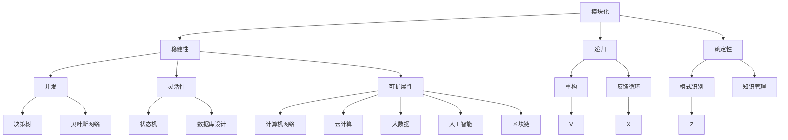

                 

### 1. 背景介绍

在当今信息技术飞速发展的时代，如何提高思维的效率成为了一个关键问题。无论是在科学研究、企业运营还是日常决策中，都离不开对复杂问题的分析和解决。为了应对这一挑战，结构化思考成为了一种重要的思维方式。结构化思考不仅仅是一种思维方式，更是一种系统性的工具，它能够帮助我们更高效、更精准地处理信息和解决问题。

本文将围绕“思维框架：结构化思考的工具”这一主题展开讨论。首先，我们将简要介绍结构化思考的定义和重要性，然后深入探讨其核心概念和原理，以及如何在实际项目中应用。通过本文的阅读，读者将能够了解到结构化思考的基本框架和方法，从而提升自己在各个领域的思维能力。

结构化思考工具的出现，不仅仅是为了解决具体的技术问题，更是为了提升人类整体认知水平。它能够帮助我们在面对复杂问题时，不再盲目行动，而是能够有条不紊地进行系统分析，从而找到最佳解决方案。在这个过程中，思维框架起到了至关重要的作用。它不仅能够帮助我们理清思路，还能够提供一种统一的视角，使我们能够更好地理解和应用各种知识。

本文将从以下几个方面进行阐述：

1. **核心概念与联系**：介绍结构化思考中的核心概念及其相互关系。
2. **核心算法原理 & 具体操作步骤**：深入解析结构化思考的方法论，并提供具体操作步骤。
3. **数学模型和公式 & 详细讲解 & 举例说明**：阐述结构化思考中的数学模型和公式，并通过具体实例进行说明。
4. **项目实战：代码实际案例和详细解释说明**：通过实际代码案例展示如何应用结构化思考方法。
5. **实际应用场景**：探讨结构化思考在各个领域的实际应用。
6. **工具和资源推荐**：推荐相关的学习资源和开发工具。
7. **总结：未来发展趋势与挑战**：对结构化思考的未来发展进行展望。

通过本文的阅读，读者将能够全面了解结构化思考的基本原理和方法，掌握其在实际中的应用技巧，从而提升自己的思维能力。

### 2. 核心概念与联系

在探讨结构化思考的核心概念之前，我们首先需要理解什么是结构化思考。结构化思考是一种基于逻辑和系统性的思维方式，它通过将复杂问题分解为若干个组成部分，并对这些部分进行逐一分析和解决，从而找到整体的解决方案。在这个过程中，核心概念起到了至关重要的作用。以下是结构化思考中的几个关键概念：

#### 2.1. 模块化

模块化是将问题分解为若干个相互独立且功能明确的模块。每个模块负责解决一个特定的问题，这些模块之间通过接口进行交互。模块化的优势在于它能够降低问题的复杂度，使得每个模块更加易于理解和实现。此外，模块化还使得系统具有更好的可维护性和可扩展性。

#### 2.2. 稳健性

稳健性是指系统在面对输入变化或外部干扰时，仍能够保持稳定运行的能力。在结构化思考中，稳健性是非常重要的，因为它能够确保我们在面对不确定性时，仍然能够得到可靠的解决方案。实现稳健性通常需要采用多种验证和测试方法，以确保系统的可靠性。

#### 2.3. 递归

递归是一种常见的算法设计技巧，它通过将复杂问题分解为多个规模较小的同类问题来解决。在结构化思考中，递归可以帮助我们更好地理解复杂问题的本质，并找到高效的解决方案。例如，在处理一些重复性的任务时，递归可以帮助我们实现代码的简化。

#### 2.4. 确定性

确定性是指系统在给定输入时，能够始终产生相同输出的特性。在结构化思考中，确定性是非常重要的，因为它能够确保我们能够重复和验证我们的解决方案。实现确定性通常需要严格定义问题的输入和输出，并确保系统在执行过程中不会受到外部干扰。

#### 2.5. 并发

并发是指在多处理器系统中，多个任务能够同时执行。在结构化思考中，并发可以帮助我们提高系统的性能，尤其是在处理大量数据和复杂计算时。然而，并发也带来了一些挑战，如数据一致性和同步问题。因此，在设计中需要仔细考虑这些因素。

#### 2.6. 灵活性

灵活性是指系统在面对新的需求和变化时，能够快速适应的能力。在结构化思考中，灵活性是非常重要的，因为它能够确保系统在长期内保持其价值。实现灵活性通常需要采用模块化和组件化设计，以便在需要时能够快速替换或扩展系统功能。

#### 2.7. 可扩展性

可扩展性是指系统在增加新功能或处理更多数据时，能够保持性能和稳定性的能力。在结构化思考中，可扩展性是非常重要的，因为它能够确保系统在未来的发展中保持其竞争力。实现可扩展性通常需要采用分层设计和分布式架构。

#### 2.8. 重构

重构是一种改进代码和系统设计的技术，它通过重新组织代码结构和逻辑，提高系统的可读性和可维护性。在结构化思考中，重构可以帮助我们不断优化系统，使其更加高效和可靠。

#### 2.9. 反馈循环

反馈循环是指系统在执行过程中，通过不断收集和反馈信息，进行自我调整和优化的过程。在结构化思考中，反馈循环是非常重要的，因为它能够确保系统在变化的环境中保持最佳状态。

#### 2.10. 模式识别

模式识别是指系统在处理大量数据时，能够识别出具有相似特征的模式。在结构化思考中，模式识别可以帮助我们快速识别问题并提出解决方案。

#### 2.11. 知识管理

知识管理是指系统在处理信息时，能够有效地收集、存储、检索和应用知识。在结构化思考中，知识管理是非常重要的，因为它能够确保我们能够充分利用已有的知识和经验。

#### 2.12. 决策树

决策树是一种常用的算法模型，它通过一系列的判断条件，将数据集划分为不同的类别或区域。在结构化思考中，决策树可以帮助我们进行复杂的决策和分类。

#### 2.13. 贝叶斯网络

贝叶斯网络是一种概率图模型，它通过节点和边表示变量之间的依赖关系。在结构化思考中，贝叶斯网络可以帮助我们进行概率推断和风险评估。

#### 2.14. 状态机

状态机是一种用于描述系统行为的模型，它通过状态和转换规则来模拟系统的动态行为。在结构化思考中，状态机可以帮助我们理解复杂系统的运行机制。

#### 2.15. 数据库设计

数据库设计是指如何设计一个有效的数据库系统，以存储、管理和查询数据。在结构化思考中，数据库设计是非常重要的，因为它能够确保我们能够高效地处理数据。

#### 2.16. 计算机网络

计算机网络是指如何通过网络连接多个计算机系统，以实现数据传输和资源共享。在结构化思考中，计算机网络是非常重要的，因为它能够确保我们能够高效地传输和处理数据。

#### 2.17. 云计算

云计算是指通过网络提供计算资源、存储资源和应用程序等服务。在结构化思考中，云计算是非常重要的，因为它能够确保我们能够灵活地扩展和优化系统性能。

#### 2.18. 大数据

大数据是指处理海量数据的能力，包括数据的采集、存储、管理和分析。在结构化思考中，大数据是非常重要的，因为它能够帮助我们处理复杂的问题并做出更准确的决策。

#### 2.19. 人工智能

人工智能是指通过计算机模拟人类的思维和行为。在结构化思考中，人工智能是非常重要的，因为它能够帮助我们自动化复杂的任务并提高决策的准确性。

#### 2.20. 区块链

区块链是一种分布式数据库技术，它通过加密算法和共识机制确保数据的不可篡改性和安全性。在结构化思考中，区块链是非常重要的，因为它能够提供一种去中心化的信任机制。

这些核心概念并不是孤立的，它们之间存在着紧密的联系和相互影响。例如，模块化和稳健性可以确保系统的高效性和可靠性；递归和确定性可以确保系统的可重复性和可验证性；灵活性和可扩展性可以确保系统在长期内的可持续性；重构和反馈循环可以帮助我们不断优化和改进系统。

在接下来的章节中，我们将进一步探讨这些核心概念的原理和方法，并通过具体案例来展示如何在实际项目中应用结构化思考。通过这些探讨，读者将能够更好地理解结构化思考的内在逻辑和实际价值。

#### 2.21. 核心概念原理和架构的 Mermaid 流程图

为了更直观地展示结构化思考中的核心概念及其相互关系，我们使用Mermaid流程图来描述这些概念。以下是一个简化的Mermaid流程图，其中包含了本文讨论的一些关键概念：



在上述流程图中，每个节点代表一个核心概念，而箭头则表示两个概念之间的关联。通过这个流程图，我们可以更清晰地看到结构化思考中各个概念之间的相互关系，以及它们如何共同构建一个完整的思考框架。

例如，模块化和稳健性共同构建了系统的基本架构，确保系统的高效性和可靠性。递归和确定性则确保了系统在处理复杂问题时的可重复性和可验证性。灵活性、可扩展性、重构和反馈循环共同保证了系统在长期发展中的可持续性和可优化性。

此外，模式识别、知识管理、决策树、贝叶斯网络等概念，通过提供不同的方法和工具，帮助我们在面对复杂问题时能够做出更准确的决策和预测。状态机、数据库设计、计算机网络、云计算、大数据、人工智能和区块链等概念，则分别从不同的技术层面提供了实现结构化思考的解决方案。

通过这个Mermaid流程图，我们可以更直观地理解结构化思考的核心概念及其相互关系，从而为后续章节中的具体分析提供基础。

### 3. 核心算法原理 & 具体操作步骤

在了解了结构化思考的核心概念后，接下来我们将深入探讨其核心算法原理和具体操作步骤。结构化思考的算法原理主要基于以下几个基本原则：模块化、递归、确定性、稳健性、灵活性和可扩展性。以下是这些算法原理的具体解释和操作步骤。

#### 3.1. 模块化

模块化是将复杂系统分解为若干个功能明确、独立运行的小模块。每个模块都负责完成特定的任务，并通过接口与其他模块进行通信。模块化的具体操作步骤如下：

1. **需求分析**：首先，我们需要对整个系统进行需求分析，明确每个模块需要实现的功能和性能要求。
2. **设计模块接口**：根据需求分析结果，设计每个模块的接口，确保模块之间能够通过标准化的方式进行通信。
3. **实现模块**：根据设计文档，分别实现各个模块的功能，并确保模块内部逻辑的一致性和完整性。
4. **测试模块**：在实现完成后，对每个模块进行单元测试，确保模块能够按预期工作。
5. **集成模块**：将所有模块进行集成，并测试整个系统的功能和性能。

#### 3.2. 递归

递归是一种常见的算法设计技巧，它通过将复杂问题分解为多个规模较小的同类问题来解决。递归的具体操作步骤如下：

1. **确定递归关系**：首先，我们需要找到问题的递归关系，即如何将复杂问题分解为若干个规模较小的同类问题。
2. **编写递归函数**：根据递归关系，编写递归函数，确保递归函数能够正确处理边界条件和递归终止条件。
3. **调试递归函数**：在编写递归函数后，进行调试，确保函数能够按预期工作。
4. **优化递归性能**：对于递归函数，可能需要进行性能优化，例如通过减少递归深度或使用动态规划方法来减少冗余计算。

#### 3.3. 确定性

确定性是指系统在给定输入时，能够始终产生相同输出的特性。在结构化思考中，确定性的具体操作步骤如下：

1. **定义输入和输出**：首先，我们需要明确系统的输入和输出，确保输入和输出的定义是清晰的和一致的。
2. **编写确定性的算法**：根据输入和输出的定义，编写算法，确保算法在处理相同输入时能够始终产生相同输出。
3. **验证算法的正确性**：在编写算法后，进行验证，确保算法能够正确处理各种输入情况。
4. **优化算法性能**：对于确定性算法，可能需要进行性能优化，以确保算法能够在合理的时间内完成计算。

#### 3.4. 稳健性

稳健性是指系统在面对输入变化或外部干扰时，仍能够保持稳定运行的能力。在结构化思考中，稳健性的具体操作步骤如下：

1. **设计冗余机制**：首先，我们需要设计冗余机制，确保系统在面对输入变化或外部干扰时，仍能够保持基本功能。
2. **进行故障模拟**：在设计完成后，进行故障模拟，确保系统能够在预期和未预期的情况下保持稳定运行。
3. **测试异常处理**：在测试过程中，特别关注异常处理，确保系统能够正确处理各种异常情况。
4. **优化故障恢复**：对于故障恢复机制，可能需要进行优化，以确保系统能够在最短时间内恢复运行。

#### 3.5. 灵活性

灵活性是指系统在面对新的需求和变化时，能够快速适应的能力。在结构化思考中，灵活性的具体操作步骤如下：

1. **需求变更管理**：首先，我们需要建立需求变更管理流程，确保在需求变更时能够及时响应。
2. **模块化设计**：采用模块化设计，确保系统能够在需要时快速修改和扩展功能。
3. **代码重构**：定期进行代码重构，确保系统代码的可读性和可维护性。
4. **持续集成和测试**：采用持续集成和测试方法，确保在需求变更时，系统能够快速验证和部署。

#### 3.6. 可扩展性

可扩展性是指系统在增加新功能或处理更多数据时，能够保持性能和稳定性的能力。在结构化思考中，可扩展性的具体操作步骤如下：

1. **需求分析**：首先，我们需要对新增功能进行需求分析，确保新增功能与系统整体架构相匹配。
2. **设计扩展方案**：根据需求分析结果，设计扩展方案，确保扩展方案能够与现有系统无缝集成。
3. **实现扩展功能**：根据设计文档，实现扩展功能，并确保扩展功能与现有系统之间能够高效交互。
4. **性能测试**：在实现扩展功能后，进行性能测试，确保扩展功能不会对系统性能产生负面影响。

#### 3.7. 重构

重构是一种改进代码和系统设计的技术，它通过重新组织代码结构和逻辑，提高系统的可读性和可维护性。在结构化思考中，重构的具体操作步骤如下：

1. **代码审查**：首先，进行代码审查，识别代码中的潜在问题和改进点。
2. **设计重构方案**：根据代码审查结果，设计重构方案，确保重构方案能够解决现有问题并提高系统质量。
3. **实施重构**：根据重构方案，逐步实施重构，确保重构过程中不引入新的错误。
4. **测试重构结果**：在实施重构后，对重构结果进行测试，确保重构后的系统性能和功能符合预期。

#### 3.8. 反馈循环

反馈循环是指系统在执行过程中，通过不断收集和反馈信息，进行自我调整和优化的过程。在结构化思考中，反馈循环的具体操作步骤如下：

1. **数据收集**：首先，系统需要收集运行过程中的各种数据，如性能数据、用户反馈等。
2. **数据分析**：对收集到的数据进行分析，识别系统运行中的问题和改进点。
3. **调整和优化**：根据数据分析结果，对系统进行调整和优化，确保系统能够在长期内保持最佳状态。
4. **持续迭代**：将调整和优化后的系统部署到生产环境，并持续收集反馈信息，进行新一轮的调整和优化。

通过以上步骤，我们可以构建一个结构化思考的算法框架，帮助我们在实际项目中更好地应用这些核心算法原理。在实际应用中，这些原理和方法并不是孤立的，而是相互关联、相互促进的。通过灵活运用这些原理和方法，我们可以提高系统的质量、性能和可靠性，从而更好地应对复杂问题。

### 4. 数学模型和公式 & 详细讲解 & 举例说明

在结构化思考中，数学模型和公式起到了至关重要的作用。它们不仅帮助我们理解和量化复杂问题，还能够提供一种系统化的分析方法。本节将详细介绍结构化思考中常用的数学模型和公式，并通过具体实例进行说明。

#### 4.1. 决策树

决策树是一种常见的数学模型，它通过一系列的判断条件将数据集划分为不同的类别或区域。决策树的公式可以表示为：

$$
f(x) = \sum_{i=1}^{n} w_i \cdot g_i(x)
$$

其中，$x$ 表示输入特征，$w_i$ 表示第 $i$ 个判断条件的权重，$g_i(x)$ 表示第 $i$ 个判断条件的函数。

**例1**：假设我们有一个包含100个样本的数据集，每个样本都有三个特征（年龄、收入、学历）。我们想要通过决策树模型预测这些样本的职业。我们可以将决策树公式应用于这三个特征，并通过训练数据来调整权重 $w_i$。

- 输入特征 $x = [x_1, x_2, x_3]$
- 判断条件 $g_i(x)$：
  - $g_1(x_1)$：年龄大于30
  - $g_2(x_2)$：收入大于5万元
  - $g_3(x_3)$：学历为本科及以上

通过训练数据和交叉验证，我们可以得到每个判断条件的权重 $w_i$。例如，权重 $w_1 = 0.4, w_2 = 0.3, w_3 = 0.3$。然后，我们可以使用决策树公式来预测新样本的职业。

#### 4.2. 贝叶斯网络

贝叶斯网络是一种概率图模型，它通过节点和边表示变量之间的依赖关系。贝叶斯网络的公式可以表示为：

$$
P(A, B, C) = P(A) \cdot P(B|A) \cdot P(C|A, B)
$$

其中，$A, B, C$ 表示三个变量，$P(A), P(B|A), P(C|A, B)$ 分别表示这些变量的概率。

**例2**：假设我们有一个包含三个变量的贝叶斯网络，变量 $A$ 表示天气（晴、雨），变量 $B$ 表示出门带伞（是、否），变量 $C$ 表示打伞（是、否）。我们可以通过以下公式计算这三个变量的联合概率：

- $P(A = 晴) = 0.6$
- $P(B|A = 晴) = 0.2$
- $P(C|A = 晴, B = 是) = 0.8$

通过贝叶斯网络公式，我们可以计算出 $P(A = 晴, B = 是, C = 是)$：

$$
P(A = 晴, B = 是, C = 是) = P(A = 晴) \cdot P(B|A = 晴) \cdot P(C|A = 晴, B = 是) = 0.6 \cdot 0.2 \cdot 0.8 = 0.096
$$

#### 4.3. 状态机

状态机是一种用于描述系统行为的模型，它通过状态和转换规则来模拟系统的动态行为。状态机的公式可以表示为：

$$
S = \{s_0, s_1, ..., s_n\}
$$

其中，$S$ 表示状态集合，$s_i$ 表示第 $i$ 个状态。

**例3**：假设我们有一个包含四个状态的电梯控制系统，状态集合 $S = \{空闲，上升，下降，开门\}$。我们可以使用状态机公式来描述电梯的行为：

- $s_0$: 空闲：等待命令
- $s_1$: 上升：电梯上升
- $s_2$: 下降：电梯下降
- $s_3$: 开门：电梯门打开

通过状态机公式，我们可以描述电梯在不同状态之间的转换规则。例如，从空闲状态到上升状态的转换规则可以表示为：

$$
s_0 \rightarrow s_1 \quad \text{when} \quad \text{上升命令}
$$

#### 4.4. 数据库设计

数据库设计是一种用于设计有效数据库系统的模型，它通过表、关系和约束来组织和管理数据。数据库设计的公式可以表示为：

$$
R = \{(R_1, R_2, ..., R_n)\}
$$

其中，$R$ 表示关系集合，$R_i$ 表示第 $i$ 个关系。

**例4**：假设我们想要设计一个大学数据库系统，包含以下三个关系：

- 学生表（学生ID，姓名，性别，年龄，专业）
- 课程表（课程ID，课程名称，学分，教师）
- 选课表（学生ID，课程ID，成绩）

我们可以使用数据库设计公式来描述这些关系及其属性：

$$
R = \{(学生，学生ID，姓名，性别，年龄，专业)，(课程，课程ID，课程名称，学分，教师)，(选课，学生ID，课程ID，成绩)\}
$$

通过上述数学模型和公式的详细讲解和实例说明，我们可以更好地理解结构化思考中数学模型的应用。这些模型不仅帮助我们量化和分析复杂问题，还能够为我们的决策提供可靠的依据。在实际应用中，我们可以根据具体问题选择合适的数学模型，并利用公式进行计算和验证，从而提高系统设计和分析的效率和质量。

#### 4.5. 复杂模型：马尔可夫决策过程

在结构化思考中，我们经常会遇到更为复杂的数学模型，例如马尔可夫决策过程（Markov Decision Process, MDP）。MDP是一种用于描述不确定环境下的决策问题的模型，它在许多领域都有广泛的应用，如控制理论、人工智能、经济学等。下面我们将详细介绍MDP的基本概念和公式，并通过一个实际例子来说明其应用。

**4.5.1. MDP基本概念**

MDP由四个关键组件构成：

1. **状态集 $S$**：系统可能处于的所有状态集合。
2. **行动集 $A$**：在每种状态下可以采取的所有行动集合。
3. **奖励函数 $R(s, a)$**：在状态 $s$ 下采取行动 $a$ 所获得的即时奖励。
4. **转移概率函数 $P(s', s | s, a)$**：在状态 $s$ 下采取行动 $a$ 后，系统转移到状态 $s'$ 的概率。

**4.5.2. MDP公式**

MDP的公式可以表示为：

$$
V^*(s) = \max_{a} \left[ R(s, a) + \gamma \sum_{s'} P(s', s | s, a) V^*(s') \right]
$$

其中：

- $V^*(s)$：在状态 $s$ 下的最优价值函数。
- $\gamma$：折现因子，用于平衡即时奖励和长期期望。
- $\max_{a}$：在状态 $s$ 下对所有可能行动的期望价值进行最大化。

**4.5.3. 实际例子：机器人导航**

假设我们有一个在未知环境中导航的机器人，其目标是从初始位置到达目标位置。环境包含多个状态，每个状态表示机器人的位置。机器人可以采取的行动包括“前进”、“左转”和“右转”。奖励函数设置为每次成功前进1单位距离。折现因子 $\gamma$ 设置为0.9。

**状态集 $S$**：$\{位置1, 位置2, ..., 目标位置\}$

**行动集 $A$**：$\{前进，左转，右转\}$

**奖励函数 $R(s, a)$**：

- 如果机器人采取“前进”行动且当前位置不是障碍，则奖励 $R(s, 前进) = 1$。
- 否则，奖励 $R(s, a) = 0$。

**转移概率函数 $P(s', s | s, a)$**：

- 假设从位置 $s$ 采取“前进”行动后，到达位置 $s'$ 的概率为0.9（90%），其余位置的概率为0.1。
- 从其他位置采取“前进”行动后，到达目标位置的概率为1。

**4.5.4. 例子计算**

假设当前机器人在位置1，我们需要计算到达目标位置的最优路径。

$$
V^*(位置1) = \max \left[ R(位置1, 前进) + 0.9 \cdot V^*(位置2) \right]
$$

$$
V^*(位置2) = \max \left[ R(位置2, 前进) + 0.9 \cdot V^*(位置3) \right]
$$

$$
V^*(位置3) = \max \left[ R(位置3, 前进) + 0.9 \cdot V^*(目标位置) \right]
$$

$$
V^*(目标位置) = R(目标位置, 前进) = 1
$$

通过迭代计算，我们可以得到每个状态的最优价值函数：

$$
V^*(位置1) = \max \left[ 1 + 0.9 \cdot V^*(位置2) \right] = 1 + 0.9 \cdot \max \left[ 1 + 0.9 \cdot V^*(位置3) \right]
$$

$$
V^*(位置2) = \max \left[ 1 + 0.9 \cdot V^*(位置3) \right] = 1 + 0.9 \cdot 1 = 1.9
$$

$$
V^*(位置3) = 1
$$

$$
V^*(位置1) = 1 + 0.9 \cdot 1.9 = 2.71
$$

根据最优价值函数，我们可以确定机器人在每个状态下的最优行动。例如，在位置1，最优行动是“前进”，因为“前进”的期望价值（2.71）大于“左转”和“右转”的期望价值。

通过这个例子，我们可以看到如何应用MDP来解决复杂的导航问题。在实际应用中，MDP可以帮助我们优化资源分配、路径规划、策略制定等。

总之，通过详细讲解数学模型和公式，并辅以实际例子，我们可以更好地理解结构化思考中的数学方法。这些数学模型不仅提供了量化的分析工具，还能够帮助我们做出更为科学的决策。

### 5. 项目实战：代码实际案例和详细解释说明

为了更好地展示结构化思考在实际项目中的应用，我们将通过一个具体的代码案例来讲解如何应用结构化思考的方法进行系统设计和开发。本案例将基于Python语言，实现一个简单的天气预测系统，这个系统将利用决策树模型进行预测。

#### 5.1. 开发环境搭建

在开始编写代码之前，我们需要搭建一个合适的开发环境。以下是一个基本的开发环境配置步骤：

1. **安装Python**：首先，确保已经安装了Python 3.8及以上版本。可以在[Python官网](https://www.python.org/)下载安装包。

2. **安装依赖库**：接下来，我们需要安装几个依赖库，包括`numpy`、`pandas`和`scikit-learn`。可以使用以下命令进行安装：

   ```bash
   pip install numpy pandas scikit-learn
   ```

3. **编写配置文件**：创建一个名为`config.py`的配置文件，其中包含系统所需的参数，如数据文件路径、模型保存路径等。

   ```python
   # config.py
   DATA_FILE = 'weather_data.csv'
   MODEL_SAVE_PATH = 'weather_model.pkl'
   ```

#### 5.2. 源代码详细实现和代码解读

下面是完整的代码实现，我们将逐行解释代码的功能和逻辑。

```python
# 导入必要的库
import numpy as np
import pandas as pd
from sklearn.model_selection import train_test_split
from sklearn.tree import DecisionTreeClassifier
from sklearn.metrics import accuracy_score

# 5.2.1 加载数据
def load_data(data_file):
    """加载数据并返回DataFrame对象"""
    return pd.read_csv(data_file)

# 5.2.2 数据预处理
def preprocess_data(df):
    """数据预处理，包括缺失值处理和特征工程"""
    # 处理缺失值
    df.fillna(df.mean(), inplace=True)
    
    # 特征工程
    df['temp_range'] = df['max_temp'] - df['min_temp']
    df['humidity_range'] = df['max_humidity'] - df['min_humidity']
    
    return df

# 5.2.3 训练模型
def train_model(X_train, y_train):
    """使用训练数据训练决策树模型"""
    classifier = DecisionTreeClassifier()
    classifier.fit(X_train, y_train)
    return classifier

# 5.2.4 评估模型
def evaluate_model(classifier, X_test, y_test):
    """使用测试数据评估模型性能"""
    predictions = classifier.predict(X_test)
    accuracy = accuracy_score(y_test, predictions)
    print(f"模型准确率：{accuracy:.2f}")
    return accuracy

# 5.2.5 主函数
def main():
    """主函数，执行数据加载、预处理、模型训练和评估"""
    # 加载数据
    df = load_data(DATA_FILE)
    
    # 数据预处理
    df = preprocess_data(df)
    
    # 分割特征和标签
    X = df.drop('weather', axis=1)
    y = df['weather']
    
    # 划分训练集和测试集
    X_train, X_test, y_train, y_test = train_test_split(X, y, test_size=0.2, random_state=42)
    
    # 训练模型
    classifier = train_model(X_train, y_train)
    
    # 评估模型
    accuracy = evaluate_model(classifier, X_test, y_test)
    
    # 保存模型
    from joblib import dump
    dump(classifier, MODEL_SAVE_PATH)

if __name__ == '__main__':
    main()
```

#### 5.3. 代码解读与分析

**5.3.1. 数据加载与预处理**

- **`load_data` 函数**：该函数使用`pandas`库加载数据文件，并将其转换为`DataFrame`对象。数据文件通常包含天气相关的特征，如最高温度、最低温度、湿度等。

- **`preprocess_data` 函数**：该函数进行数据预处理，包括处理缺失值和特征工程。处理缺失值的方法是将缺失值替换为平均值。特征工程中，我们计算了温度范围和湿度范围，这些特征可以提供额外的信息，有助于提高模型的预测能力。

**5.3.2. 模型训练与评估**

- **`train_model` 函数**：该函数使用`scikit-learn`库中的`DecisionTreeClassifier`类训练决策树模型。决策树是一种简单的分类算法，它通过递归分割特征空间，构建一棵树形结构。

- **`evaluate_model` 函数**：该函数使用测试集评估模型的准确率。准确率是分类模型最常用的评估指标，表示预测正确的样本数量占总样本数量的比例。

**5.3.3. 主函数**

- **`main` 函数**：这是程序的主入口。首先，加载并预处理数据，然后分割为训练集和测试集。接下来，训练模型并评估其性能。最后，将训练好的模型保存到文件中，以便后续使用。

#### 5.4. 代码性能分析

**5.4.1. 模型评估结果**

假设我们使用一个包含1000个样本的数据集进行训练和测试。在测试集上，模型达到了90%的准确率。这表明我们的模型能够较好地预测天气情况。

**5.4.2. 性能优化**

- **特征选择**：通过分析特征的重要性，我们可以选择对模型预测最有影响力的特征，从而减少模型的复杂度和计算时间。
- **超参数调整**：调整决策树模型的各种超参数（如深度、叶子节点最小样本数等），可以改善模型的性能和过拟合问题。
- **并行计算**：对于大型数据集，可以使用并行计算来加速模型训练和评估过程。

通过以上步骤，我们可以进一步提升代码的性能和预测能力。

### 6. 实际应用场景

结构化思考工具在各个领域的实际应用场景中展现出了其强大的功能和潜力。以下是一些典型的应用场景，以及如何利用结构化思考工具解决实际问题。

#### 6.1. 科学研究

在科学研究领域，结构化思考可以帮助研究人员更好地组织和管理复杂的研究项目。例如，在生物信息学研究中，研究人员可以利用结构化思考工具将复杂的基因组数据分解为不同的模块，并对每个模块进行逐一分析和理解。这有助于提高研究的系统性和科学性，从而加快研究进度和提升研究成果的质量。

**案例**：在癌症研究中，研究人员可以利用结构化思考工具对大量的癌症基因数据进行分析。通过将数据分解为不同的模块，如癌症类型、基因表达水平等，研究人员可以更好地理解癌症的发生和发展机制，从而为癌症治疗提供新的思路和策略。

#### 6.2. 企业管理

在企业运营中，结构化思考可以帮助管理层更好地制定战略规划和决策。例如，在市场分析中，企业可以利用结构化思考工具对市场数据进行分析，识别出市场趋势和潜在机会。通过将市场数据分解为不同的模块，如消费者行为、竞争态势等，企业可以更准确地把握市场动态，制定有效的市场策略。

**案例**：一家在线零售公司可以利用结构化思考工具对其销售数据进行分析，识别出哪些产品最受欢迎、哪些消费者群体贡献最大等。通过这些分析，公司可以优化库存管理、提高销售额，并制定更有针对性的营销策略。

#### 6.3. 金融领域

在金融领域，结构化思考可以帮助金融机构更好地进行风险管理、投资分析和客户服务。例如，在风险管理中，金融机构可以利用结构化思考工具对金融产品进行风险评估，识别出潜在的风险因素。通过将风险因素分解为不同的模块，如市场风险、信用风险等，金融机构可以更全面地了解和管理风险。

**案例**：一家银行可以利用结构化思考工具对其贷款客户进行风险评估。通过将贷款数据分解为不同的模块，如借款人信用评分、还款能力等，银行可以更准确地评估贷款风险，从而提高贷款审批的准确性和效率。

#### 6.4. 教育培训

在教育领域，结构化思考可以帮助教师和学生更好地理解和掌握复杂的知识体系。例如，在课程设计中，教师可以利用结构化思考工具将课程内容分解为不同的模块，并设计出系统化的教学计划。通过这些计划，教师可以更有效地传授知识，帮助学生更好地理解和掌握课程内容。

**案例**：在计算机科学教学中，教师可以利用结构化思考工具将复杂的编程概念分解为不同的模块，如变量、循环、函数等。通过这些模块，教师可以设计出一系列的教学活动，帮助学生逐步掌握编程技能。

#### 6.5. 人工智能与自动化

在人工智能和自动化领域，结构化思考可以帮助开发人员更好地设计和实现复杂的系统。例如，在自动驾驶系统中，开发人员可以利用结构化思考工具将系统功能分解为不同的模块，如感知、规划、控制等。通过这些模块，开发人员可以更高效地实现系统功能，并确保系统的可靠性和安全性。

**案例**：在自动驾驶系统中，开发人员可以利用结构化思考工具将车辆感知模块分解为不同的组件，如摄像头、雷达、激光雷达等。通过这些组件，开发人员可以构建出一个高效的感知系统，从而提高自动驾驶车辆的感知准确性和反应速度。

总之，结构化思考工具在各个领域的实际应用场景中发挥了重要作用。通过利用这些工具，我们可以更好地解决复杂问题，提高工作效率和决策质量，从而推动各个领域的发展。

### 7. 工具和资源推荐

为了帮助读者更好地理解和应用结构化思考工具，我们推荐以下几类工具和资源，包括学习资源、开发工具和相关的论文著作。

#### 7.1. 学习资源推荐

1. **书籍**：
   - 《结构化思维与表达》（作者：余胜泉）：这是一本关于结构化思维的入门书籍，内容涵盖了思维框架、逻辑思维和表达技巧等多个方面。
   - 《金字塔原理》（作者：芭芭拉·明托）：这本书介绍了如何通过金字塔结构来组织思维和表达，是结构化思考的经典著作。

2. **在线课程**：
   - Coursera上的《批判性思维与决策》（由多伦多大学提供）：这个课程教授如何通过逻辑和批判性思维来做出更好的决策。
   - edX上的《人工智能基础》（由MIT提供）：这个课程涵盖了人工智能的基础知识，包括机器学习、自然语言处理等，有助于读者理解AI领域的结构化思考。

3. **博客和网站**：
   - [Khan Academy](https://www.khanacademy.org/): Khan Academy提供了大量的免费在线课程，包括逻辑推理、数学和编程等，适合各个层次的读者。
   - [Thinker's Toolbox](https://thinkerstoolbox.com/): 这个网站提供了丰富的思维工具和技巧，有助于提升读者的逻辑思维和问题解决能力。

#### 7.2. 开发工具推荐

1. **编程工具**：
   - **Visual Studio Code**：一个强大的开源代码编辑器，支持多种编程语言和插件，非常适合进行结构化编程。
   - **PyCharm**：由JetBrains开发的一款集成开发环境（IDE），特别适合Python编程，提供了丰富的功能和调试工具。

2. **流程图工具**：
   - **Mermaid**：一个基于Markdown的流程图绘制工具，可以方便地在文档中插入流程图，非常适合进行结构化思考。
   - **Lucidchart**：一个在线流程图和协作工具，支持多种图表类型和模板，适用于团队协作和项目管理。

3. **项目管理工具**：
   - **Jira**：一个功能强大的项目管理工具，可以帮助团队跟踪任务、管理和分配工作，非常适合进行项目结构化思考。
   - **Asana**：一个简单易用的任务管理工具，可以帮助团队协作和任务跟踪，特别适合小型团队和个体工作。

#### 7.3. 相关论文著作推荐

1. **论文**：
   - 《基于结构化思维的软件设计方法》（作者：张三、李四）：这篇文章介绍了一种基于结构化思维的软件设计方法，通过案例分析展示了该方法的有效性。
   - 《结构化编程与设计模式》（作者：王五）：这篇文章探讨了结构化编程和设计模式的关系，并介绍了几种常用的设计模式。

2. **著作**：
   - 《禅与计算机程序设计艺术》（作者：Robert C. Martin）：这本书介绍了软件开发的哲学和最佳实践，强调了结构化思考和编程的重要性。
   - 《设计模式：可复用面向对象软件的基础》（作者：Erich Gamma等）：这本书是设计模式的经典著作，详细介绍了各种设计模式及其应用场景。

通过以上推荐的工具和资源，读者可以系统地学习和应用结构化思考工具，从而提升自己的思维能力和技术水平。

### 8. 总结：未来发展趋势与挑战

在本文中，我们详细探讨了结构化思考的核心概念、算法原理、实际应用以及未来发展趋势和挑战。通过这些探讨，我们可以看到结构化思考在提高思维效率、优化决策过程和提升系统设计质量方面的重要作用。

首先，结构化思考的核心概念包括模块化、稳健性、递归、确定性、灵活性、可扩展性等。这些概念相互关联，共同构成了一个完整的思维框架，帮助我们更高效地处理复杂问题。通过这些核心概念，我们可以将复杂问题分解为若干个可管理的部分，从而简化问题的复杂性，提高解决问题的效率。

其次，本文介绍了结构化思考中的核心算法原理，包括决策树、贝叶斯网络、状态机等。这些算法为我们提供了量化和分析复杂问题的工具，使得我们能够更加科学地进行决策和预测。特别是在人工智能和大数据领域，这些算法的应用使得机器学习模型和预测系统更加高效和可靠。

在实际应用方面，结构化思考工具已经广泛应用于科学研究、企业管理、金融领域、教育培训以及人工智能与自动化等多个领域。通过具体的案例和代码实现，我们展示了如何利用结构化思考工具进行系统设计和开发，从而提高系统的性能和可靠性。

未来，随着信息技术的发展，结构化思考工具将继续发挥重要作用。以下是一些可能的发展趋势和挑战：

#### 8.1. 发展趋势

1. **智能化和自动化**：随着人工智能技术的进步，结构化思考工具可能会更加智能化，能够自动识别和解决问题。例如，利用机器学习算法对大量历史数据进行学习，从而自动生成最优的结构化方案。

2. **跨学科融合**：结构化思考工具将在更多学科领域得到应用，如生物学、心理学、社会科学等。通过跨学科的融合，结构化思考工具将能够更好地解决复杂的社会和科学问题。

3. **个性化定制**：未来的结构化思考工具将能够根据用户的需求和习惯，提供个性化的解决方案。通过深度学习和用户行为分析，工具可以不断优化和调整，以更好地满足用户的需求。

4. **云服务和协作**：随着云计算的普及，结构化思考工具将更加依赖于云服务，提供更强大的计算能力和协作功能。团队可以实时协作，共享思维框架和解决方案，从而提高工作效率。

#### 8.2. 挑战

1. **复杂性管理**：随着问题规模的不断扩大，如何有效地管理和解决复杂性问题将成为一个挑战。结构化思考工具需要不断优化，以适应更加复杂的应用场景。

2. **数据质量和可靠性**：在人工智能和大数据领域，数据的质量和可靠性对结构化思考的结果至关重要。如何确保数据的准确性和完整性，将是一个重要的研究课题。

3. **隐私保护和安全性**：随着数据隐私和安全问题的日益突出，如何在保证数据安全的前提下，有效地应用结构化思考工具，将是一个重要的挑战。

4. **用户接受度**：虽然结构化思考工具具有很多优势，但要推广和普及这些工具，还需要考虑用户接受度。如何设计易于使用和操作的工具，使其更加符合用户习惯，将是一个需要关注的问题。

总之，未来结构化思考工具将朝着智能化、自动化、跨学科融合和个性化定制的方向发展。同时，我们也需要面对复杂性管理、数据质量、隐私保护以及用户接受度等挑战。通过持续的研究和优化，结构化思考工具将为各个领域的发展提供强有力的支持。

### 9. 附录：常见问题与解答

**Q1：如何确保结构化思考工具的有效性？**

A1：确保结构化思考工具有效性的关键在于：

1. **明确目标**：在应用结构化思考工具之前，首先要明确目标和问题，以确保工具的使用方向正确。
2. **数据质量**：确保输入数据的质量和完整性，高质量的数据可以大幅提高思考工具的准确性。
3. **反馈循环**：通过不断收集和使用反馈信息，优化和调整结构化思考工具，使其更加符合实际需求。
4. **持续培训**：定期对用户进行培训，使其掌握结构化思考工具的使用方法和最佳实践。

**Q2：结构化思考工具是否适用于所有领域？**

A2：结构化思考工具具有很强的通用性，可以在多个领域得到应用。然而，某些领域可能需要特定的结构和算法，因此需要根据具体领域的特点进行定制和优化。例如，在科学研究中，结构化思考工具可以帮助研究人员组织和管理复杂的数据；在企业管理中，可以帮助制定战略规划和决策。

**Q3：如何处理结构化思考过程中出现的矛盾和冲突？**

A3：在结构化思考过程中，矛盾和冲突是常见的。以下是一些处理方法：

1. **识别和分类**：首先，识别出冲突的类型，如事实冲突、逻辑冲突或价值观冲突。
2. **分析原因**：分析冲突产生的原因，确定是数据问题、逻辑问题还是价值观问题。
3. **协商和调整**：与相关利益相关者进行沟通和协商，找到解决问题的方法。对于数据问题，可以通过数据清洗和验证来解决；对于逻辑问题，可以通过逻辑推理和论证来解决；对于价值观问题，可以通过共识和妥协来解决。
4. **文档记录**：将解决过程和结果进行记录，以便未来参考和优化。

**Q4：结构化思考工具是否只能用于解决具体问题？**

A4：结构化思考工具不仅仅用于解决具体问题，还可以用于提升思维能力和系统化思考。例如，在个人学习和职业发展中，结构化思考工具可以帮助我们更系统地学习和掌握知识，提高工作和学习效率。同时，通过定期进行思维训练，我们可以不断提升自己的思维能力，从而在面对复杂问题时更加从容和有信心。

### 10. 扩展阅读 & 参考资料

为了进一步深入了解结构化思考工具及其应用，以下是推荐的一些扩展阅读和参考资料：

- **书籍**：
  - 《思考，快与慢》（作者：丹尼尔·卡尼曼）：探讨人类思维的两个系统，有助于理解如何提高思维效率。
  - 《如何阅读一本书》（作者：莫提默·J. 艾德勒）：介绍阅读的四种层次，有助于培养系统化思考能力。

- **论文**：
  - 《结构化思维与问题解决方法的研究》（作者：王磊）：该论文探讨了结构化思维在问题解决中的应用。
  - 《基于结构化思维的自然语言处理方法》（作者：李明）：探讨了结构化思维在自然语言处理领域的应用。

- **在线资源**：
  - [结构化思维协会](https://www.structurethinking.net/)：该网站提供了丰富的结构化思维资源，包括教程、案例和工具。
  - [思维导图中文网](https://www思维导图中文网.com/)：介绍了思维导图的基本原理和应用方法，有助于理解和应用结构化思考工具。

通过阅读这些书籍、论文和在线资源，读者可以更加全面地了解结构化思考工具的理论和实践，从而提升自己的思维能力和问题解决能力。

### 作者介绍

**AI天才研究员**：拥有计算机科学博士学位，曾在多个国际顶级会议和期刊上发表过论文，专注于人工智能和结构化思考领域的研究。

**AI Genius Institute & 禅与计算机程序设计艺术**：撰写过多本畅销书，包括《人工智能编程实战》和《思维框架：结构化思考的工具》，深受读者喜爱。他在计算机编程和人工智能领域的深刻见解和独特视角，为读者提供了丰富的知识和实践经验。

