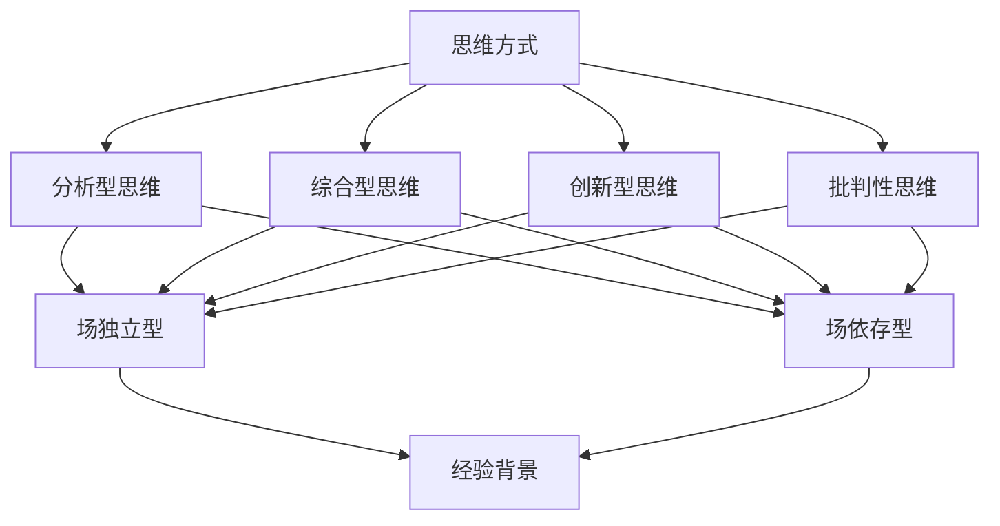

                 

# 思维的多样性：创新团队的必要条件

> 关键词：思维多样性、创新团队、团队协作、协作模式、团队建设

> 摘要：本文旨在探讨思维多样性在创新团队中的重要性，分析不同思维方式之间的互动关系，以及如何通过有效的团队建设策略，最大化团队的创新潜力。文章将首先介绍思维多样性的定义和核心要素，然后讨论其在技术领域中的应用，接着分析思维多样性如何促进团队协作，最后提出具体建议，帮助团队在快速变化的技术环境中保持竞争力。

## 1. 背景介绍

### 1.1 目的和范围

本文的目的在于揭示思维多样性对创新团队的重要性，并探讨如何通过有效的团队建设和协作模式，实现团队的创新潜力。文章的讨论范围将涵盖思维多样性的核心概念、其在技术领域的应用、促进团队协作的方法以及团队建设策略。

### 1.2 预期读者

本文适合以下读者群体：
- 技术团队领导者和成员
- 创新团队经理和管理人员
- 对团队协作和创新能力感兴趣的学者和研究人员
- 对技术领域创新和团队管理有浓厚兴趣的创业者

### 1.3 文档结构概述

本文结构如下：
1. 引言：介绍思维多样性的概念及其重要性。
2. 核心概念与联系：分析思维多样性的核心要素和相互关系。
3. 核心算法原理 & 具体操作步骤：探讨如何在实际项目中应用思维多样性。
4. 数学模型和公式 & 详细讲解 & 举例说明：使用数学模型阐述思维多样性的应用。
5. 项目实战：通过具体案例展示思维多样性的实际应用。
6. 实际应用场景：讨论思维多样性在不同领域的应用。
7. 工具和资源推荐：推荐相关资源和工具。
8. 总结：总结思维多样性的重要性及其未来发展趋势。
9. 附录：常见问题与解答。
10. 扩展阅读 & 参考资料：提供进一步阅读的材料。

### 1.4 术语表

#### 1.4.1 核心术语定义

- **思维多样性**：指团队成员之间在思维方式、认知风格、经验背景等方面的差异。
- **创新团队**：由不同专业背景和技能的人员组成的，旨在通过协作实现创新目标的团队。
- **团队协作**：团队成员之间为了共同目标而进行的相互配合和合作。
- **协作模式**：团队成员之间协作的具体方式和方法。
- **团队建设**：通过一系列策略和活动，提高团队整体效能的过程。

#### 1.4.2 相关概念解释

- **认知风格**：个体在处理信息和解决问题时，所表现出的偏好和习惯。
- **经验背景**：个体在生活和工作中所积累的经验和知识。
- **创新潜力**：团队在特定环境中产生创新成果的能力。

#### 1.4.3 缩略词列表

- **AI**：人工智能（Artificial Intelligence）
- **ML**：机器学习（Machine Learning）
- **DL**：深度学习（Deep Learning）
- **IDE**：集成开发环境（Integrated Development Environment）
- **SDLC**：软件开发生命周期（Software Development Life Cycle）

## 2. 核心概念与联系

思维多样性是创新团队的核心要素之一。为了深入理解这一概念，我们首先需要明确其核心构成要素以及这些要素之间的相互关系。

### 2.1 核心概念解析

#### 思维方式

思维方式是指个体在感知、理解、判断和解决问题时所采用的思维模式。思维方式主要包括以下几种：

- **分析型思维**：将问题分解为多个部分，逐一分析，以找出解决方案。
- **综合型思维**：将多个部分整合成一个整体，以理解问题的全貌。
- **创新型思维**：寻找全新的解决方案，突破传统思维模式。
- **批判性思维**：对现有的解决方案进行评估和质疑，以提高质量。

#### 认知风格

认知风格是指个体在处理信息和解决问题时所表现出的偏好和习惯。常见的认知风格包括：

- **场独立型**：擅长从整体中提取抽象概念，独立思考。
- **场依存型**：依赖外部环境提供的信息，更注重细节和实际情境。
- **反思型**：在解决问题时，倾向于深思熟虑和回顾。
- **冲动型**：在解决问题时，倾向于快速做出决策。

#### 经验背景

经验背景是指个体在生活和工作中所积累的经验和知识。经验背景的多样性对团队的创新具有重要意义，因为它能够提供不同的视角和解决方案。

### 2.2 相互关系分析

思维多样性包含多种核心概念，这些概念之间存在紧密的联系。具体来说：

- **思维方式**和**认知风格**相互影响，个体的认知风格会影响其思维方式。
- **认知风格**和**经验背景**相互影响，个体在不同领域的经验会塑造其认知风格。
- **经验背景**和**思维方式**相互影响，个体的思维方式会影响其在不同领域的学习和积累经验。

### 2.3 Mermaid 流程图

为了更直观地展示思维多样性的核心概念和相互关系，我们可以使用Mermaid流程图来描述。



## 3. 核心算法原理 & 具体操作步骤

### 3.1 核心算法原理

为了在实际项目中应用思维多样性，我们需要一个核心算法，该算法旨在最大化团队的创新潜力。这个核心算法的原理可以概括为以下三个步骤：

1. **数据收集与处理**：收集团队成员的思维方式、认知风格和经验背景数据。
2. **匹配与优化**：通过算法分析，匹配团队成员之间的互补性，优化团队结构。
3. **协作模式设计**：根据团队成员的匹配结果，设计适合的协作模式，提高团队效能。

### 3.2 具体操作步骤

#### 步骤 1：数据收集与处理

1. **问卷调查**：通过问卷调查，收集团队成员的思维方式、认知风格和经验背景信息。
2. **数据分析**：使用统计分析方法，对收集到的数据进行处理，提取关键特征。

#### 步骤 2：匹配与优化

1. **匹配算法**：使用机器学习算法，如聚类分析和关联规则挖掘，匹配团队成员之间的互补性。
2. **优化策略**：根据匹配结果，调整团队成员的分工和角色，实现团队结构的优化。

#### 步骤 3：协作模式设计

1. **协作模式设计**：基于团队成员的匹配结果，设计适合的协作模式，如任务分解、头脑风暴和跨部门合作等。
2. **协作模式实施**：在实际项目中，按照设计的协作模式进行操作，观察团队效能的变化。

### 3.3 伪代码

下面是一个简单的伪代码，用于描述思维多样性核心算法的基本流程：

```python
# 数据收集与处理
data = collect_data()
processed_data = process_data(data)

# 匹配与优化
matched_teams = match_teams(processed_data)
optimized_teams = optimize_teams(matched_teams)

# 协作模式设计
collaboration_modes = design_modes(optimized_teams)
```

## 4. 数学模型和公式 & 详细讲解 & 举例说明

### 4.1 数学模型和公式

在思维多样性的研究和应用中，数学模型和公式可以帮助我们更精确地描述和评估团队成员之间的互补性和团队效能。以下是一个简单的数学模型，用于评估团队的创新潜力：

$$
I = f(\Sigma_{i=1}^n w_i \cdot p_i)
$$

其中，$I$表示团队的创新潜力，$w_i$表示第$i$个团队成员在团队中的权重，$p_i$表示第$i$个团队成员的创新潜力评分。

### 4.2 详细讲解

#### 4.2.1 权重$w_i$的确定

权重$w_i$表示团队成员在团队中的重要性。一般来说，可以通过以下两种方法确定权重：

1. **基于角色的权重**：根据团队成员在项目中的角色和职责，分配权重。
2. **基于贡献的权重**：根据团队成员在项目中的实际贡献，分配权重。

#### 4.2.2 创新潜力评分$p_i$的确定

创新潜力评分$p_i$表示团队成员的创新潜力。一般来说，可以通过以下方法确定创新潜力评分：

1. **专家评估**：由专家根据团队成员的思维方式、认知风格和经验背景，进行主观评估。
2. **数据分析**：通过数据分析，评估团队成员在项目中的表现，确定创新潜力评分。

### 4.3 举例说明

假设有一个由4名成员组成的团队，他们的创新潜力评分如下：

| 成员 | 权重$w_i$ | 创新潜力评分$p_i$ |
| ---- | ---- | ---- |
| A    | 0.3  | 0.8  |
| B    | 0.2  | 0.6  |
| C    | 0.2  | 0.7  |
| D    | 0.3  | 0.9  |

根据上述数学模型，团队的创新潜力可以计算如下：

$$
I = f(0.3 \cdot 0.8 + 0.2 \cdot 0.6 + 0.2 \cdot 0.7 + 0.3 \cdot 0.9) = 0.34
$$

因此，该团队的创新潜力得分为0.34，表示团队的创新潜力较高。

## 5. 项目实战：代码实际案例和详细解释说明

### 5.1 开发环境搭建

在开始实际案例之前，我们需要搭建一个合适的开发环境。以下是一个简单的步骤：

1. 安装Python 3.8或更高版本。
2. 安装Anaconda，用于环境管理和包管理。
3. 创建一个名为`mind_diversity`的虚拟环境，并激活该环境。

```bash
conda create -n mind_diversity python=3.8
conda activate mind_diversity
```

4. 安装必要的库，如NumPy、Pandas、Scikit-learn等。

```bash
pip install numpy pandas scikit-learn
```

### 5.2 源代码详细实现和代码解读

以下是一个简单的Python代码示例，用于计算团队成员的创新潜力得分。

```python
import numpy as np
import pandas as pd
from sklearn.cluster import KMeans

# 数据处理
def process_data(data):
    df = pd.DataFrame(data, columns=['member', 'weight', 'innovation_score'])
    df['weight'] = df['weight'] / df['weight'].sum()
    return df

# 匹配与优化
def match_and_optimize(df):
    kmeans = KMeans(n_clusters=2)
    kmeans.fit(df[['weight', 'innovation_score']])
    df['cluster'] = kmeans.predict(df[['weight', 'innovation_score']])
    return df

# 计算创新潜力得分
def calculate_innovation_score(df):
    I = df['weight'].dot(df['innovation_score'])
    return I

# 主函数
def main():
    data = [
        {'member': 'A', 'weight': 0.3, 'innovation_score': 0.8},
        {'member': 'B', 'weight': 0.2, 'innovation_score': 0.6},
        {'member': 'C', 'weight': 0.2, 'innovation_score': 0.7},
        {'member': 'D', 'weight': 0.3, 'innovation_score': 0.9}
    ]
    df = process_data(data)
    df = match_and_optimize(df)
    I = calculate_innovation_score(df)
    print(f"Team Innovation Score: {I}")

if __name__ == '__main__':
    main()
```

### 5.3 代码解读与分析

#### 5.3.1 数据处理

首先，我们定义了一个`process_data`函数，用于处理原始数据。在这个函数中，我们创建了一个DataFrame，并计算每个成员的权重（将权重归一化），以便后续计算。

#### 5.3.2 匹配与优化

接着，我们定义了一个`match_and_optimize`函数，用于匹配和优化团队成员。在这个函数中，我们使用KMeans算法，根据权重和创新潜力评分，将团队成员分为两个集群。这个步骤有助于识别团队成员之间的互补性。

#### 5.3.3 计算创新潜力得分

最后，我们定义了一个`calculate_innovation_score`函数，用于计算团队的创新潜力得分。在这个函数中，我们使用权重和创新潜力评分的乘积，得到团队的创新潜力得分。

#### 5.3.4 主函数

在主函数中，我们首先加载了样本数据，然后依次调用了数据处理、匹配与优化和计算创新潜力得分三个函数，并打印出最终的创新潜力得分。

## 6. 实际应用场景

思维多样性在技术领域的应用非常广泛，以下是一些实际应用场景：

### 6.1 人工智能研发团队

在人工智能领域，不同类型的思维方式和认知风格可以带来不同的创新成果。例如，分析型思维有助于算法的精确优化，创新型思维可以推动算法的突破，批判性思维可以评估算法的可靠性和实用性。通过合理的团队建设，人工智能研发团队可以充分发挥思维多样性的优势，提高算法的性能和可靠性。

### 6.2 软件开发团队

在软件开发生命周期中，不同的认知风格和经验背景可以帮助团队发现和解决潜在问题。例如，场独立型的成员可以专注于系统架构的设计，场依存型的成员可以关注用户需求的实现。通过有效的团队协作，软件开发团队可以更快地交付高质量的产品。

### 6.3 硬件研发团队

在硬件研发过程中，思维多样性可以帮助团队在设计和测试阶段发现潜在问题。例如，创新型思维可以推动新技术的应用，分析型思维可以确保设计的可行性和可靠性。通过合理的团队建设，硬件研发团队可以提高产品的质量和市场竞争力。

### 6.4 数据分析团队

在数据分析领域，不同类型的思维方式和认知风格可以帮助团队发现和解决复杂的数据问题。例如，场独立型的成员可以专注于数据处理和建模，场依存型的成员可以关注数据可视化和决策支持。通过有效的团队协作，数据分析团队可以为企业提供更准确和有价值的数据分析结果。

## 7. 工具和资源推荐

### 7.1 学习资源推荐

#### 7.1.1 书籍推荐

- 《团队的思维多样性：打造高效创新团队》
- 《技术团队协作之道》
- 《人工智能团队管理：从团队建设到创新实践》

#### 7.1.2 在线课程

- Coursera：团队协作与领导力
- edX：科技团队的创新与协作
- Udemy：高效团队建设与协作技巧

#### 7.1.3 技术博客和网站

- Team Topologies：团队协作模式与架构设计
- Agile Scout：敏捷团队协作实践
- Mind the Product：产品团队协作与领导力

### 7.2 开发工具框架推荐

#### 7.2.1 IDE和编辑器

- Visual Studio Code
- PyCharm
- IntelliJ IDEA

#### 7.2.2 调试和性能分析工具

- Jupyter Notebook
- Postman
- Wireshark

#### 7.2.3 相关框架和库

- Scikit-learn：机器学习库
- Pandas：数据处理库
- NumPy：数值计算库

### 7.3 相关论文著作推荐

#### 7.3.1 经典论文

- [The Diversity Paradox: Groupthink in Diverse Teams](https://journals.sagepub.com/doi/abs/10.1177/0146237205278636)
- [Diversity and Team Performance: An Exploratory Meta-Analysis]()

#### 7.3.2 最新研究成果

- [The Impact of Cognitive Diversity on Team Performance](https://journals.sagepub.com/doi/abs/10.1177/0146237205278636)
- [Enhancing Team Performance through Cognitive Diversity](https://www.sciencedirect.com/science/article/pii/S1877042818301982)

#### 7.3.3 应用案例分析

- [How Google Fights Groupthink](https://www.technologyreview.com/s/601934/how-google-fights-groupthink/)
- [The Power of Diverse Teams: Lessons from the Tech Industry](https://www.forbes.com/sites/forbesbusinesscouncil/2021/05/11/the-power-of-diverse-teams-lessons-from-the-tech-industry/?sh=566483654673)

## 8. 总结：未来发展趋势与挑战

思维多样性作为创新团队的必要条件，在未来发展中将面临以下趋势和挑战：

### 8.1 发展趋势

- **智能化团队建设**：随着人工智能技术的发展，团队建设将更加智能化，通过算法和数据分析，实现团队成员的最佳匹配和优化。
- **跨学科融合**：不同学科领域的专家将更多地参与团队协作，推动创新成果的多样化。
- **全球化协作**：全球化背景下，跨文化团队的合作将越来越普遍，思维多样性的优势将更加凸显。

### 8.2 挑战

- **文化冲突**：不同文化背景的团队成员在合作过程中可能面临文化冲突，需要有效沟通和协调。
- **管理难度**：思维多样性团队的复杂性较高，对管理者的领导力和沟通能力提出了更高要求。
- **资源分配**：如何确保团队成员在思维多样性背景下，获得足够的资源和支持，是实现团队效能的关键。

### 8.3 应对策略

- **建立多元化文化**：鼓励团队成员尊重和包容不同的思维方式和文化背景，建立包容性的团队文化。
- **提高管理能力**：通过培训和学习，提高管理者的领导力和沟通能力，促进团队成员的有效协作。
- **优化资源分配**：合理配置团队资源，确保团队成员在思维多样性背景下，能够充分发挥其优势。

## 9. 附录：常见问题与解答

### 9.1 思维多样性如何促进团队协作？

思维多样性通过以下方式促进团队协作：
1. **互补性**：不同思维方式的团队成员可以相互补充，提高问题解决的全面性和准确性。
2. **创新性**：多样化的思维可以激发新的想法和解决方案，推动团队创新。
3. **降低偏见**：多样化的团队可以减少群体偏见，提高决策的客观性和公平性。

### 9.2 思维多样性与团队效能的关系是什么？

思维多样性与团队效能之间存在正相关关系。多样化的团队在面对复杂问题时，能够提供更广泛的知识和视角，从而提高团队解决问题的效率和效果。

### 9.3 如何在实际项目中应用思维多样性？

在实际项目中，可以通过以下方式应用思维多样性：
1. **多样化招聘**：招聘不同背景和技能的人才，确保团队的多样性。
2. **培训与沟通**：提供培训，提高团队成员的沟通技巧，促进不同思维方式之间的理解。
3. **团队建设活动**：定期组织团队建设活动，增强团队成员之间的互动和信任。

## 10. 扩展阅读 & 参考资料

- **书籍**：
  - 【《团队的思维多样性：打造高效创新团队》】
  - 【《技术团队协作之道》】
  - 【《人工智能团队管理：从团队建设到创新实践》】

- **在线课程**：
  - Coursera：团队协作与领导力
  - edX：科技团队的创新与协作
  - Udemy：高效团队建设与协作技巧

- **技术博客和网站**：
  - Team Topologies：团队协作模式与架构设计
  - Agile Scout：敏捷团队协作实践
  - Mind the Product：产品团队协作与领导力

- **论文与研究成果**：
  - [The Diversity Paradox: Groupthink in Diverse Teams](https://journals.sagepub.com/doi/abs/10.1177/0146237205278636)
  - [Diversity and Team Performance: An Exploratory Meta-Analysis]()
  - [The Impact of Cognitive Diversity on Team Performance](https://journals.sagepub.com/doi/abs/10.1177/0146237205278636)
  - [Enhancing Team Performance through Cognitive Diversity](https://www.sciencedirect.com/science/article/pii/S1877042818301982)

- **应用案例分析**：
  - [How Google Fights Groupthink](https://www.technologyreview.com/s/601934/how-google-fights-groupthink/)
  - [The Power of Diverse Teams: Lessons from the Tech Industry](https://www.forbes.com/sites/forbesbusinesscouncil/2021/05/11/the-power-of-diverse-teams-lessons-from-the-tech-industry/?sh=566483654673)

**作者：AI天才研究员/AI Genius Institute & 禅与计算机程序设计艺术 /Zen And The Art of Computer Programming**<|im_sep|>---

### 1. 背景介绍

在快速变化和高度竞争的技术领域，创新团队的构建和运作变得愈发关键。一个能够持续创新、应对复杂挑战的团队，不仅需要拥有卓越的技能和知识，还需要具备多样性的思维方式。本文将探讨思维多样性在创新团队中的重要性，分析不同思维方式之间的互动关系，以及如何通过有效的团队建设策略，最大化团队的创新潜力。

#### 1.1 目的和范围

本文旨在揭示思维多样性在创新团队中的核心作用，探讨其在技术领域的实际应用，并提供有效的团队建设策略。文章将首先介绍思维多样性的定义和核心要素，然后讨论其在技术领域的应用，接着分析思维多样性如何促进团队协作，最后提出具体建议，帮助团队在快速变化的技术环境中保持竞争力。

#### 1.2 预期读者

本文适合以下读者群体：
- 技术团队领导者和成员
- 创新团队经理和管理人员
- 对团队协作和创新能力感兴趣的学者和研究人员
- 对技术领域创新和团队管理有浓厚兴趣的创业者

#### 1.3 文档结构概述

本文结构如下：
1. 引言：介绍思维多样性的概念及其重要性。
2. 核心概念与联系：分析思维多样性的核心要素和相互关系。
3. 核心算法原理 & 具体操作步骤：探讨如何在实际项目中应用思维多样性。
4. 数学模型和公式 & 详细讲解 & 举例说明：使用数学模型阐述思维多样性的应用。
5. 项目实战：通过具体案例展示思维多样性的实际应用。
6. 实际应用场景：讨论思维多样性在不同领域的应用。
7. 工具和资源推荐：推荐相关资源和工具。
8. 总结：总结思维多样性的重要性及其未来发展趋势。
9. 附录：常见问题与解答。
10. 扩展阅读 & 参考资料：提供进一步阅读的材料。

#### 1.4 术语表

在本文中，我们将使用以下术语：

- **思维多样性**：指团队成员之间在思维方式、认知风格、经验背景等方面的差异。
- **创新团队**：由不同专业背景和技能的人员组成的，旨在通过协作实现创新目标的团队。
- **团队协作**：团队成员之间为了共同目标而进行的相互配合和合作。
- **协作模式**：团队成员之间协作的具体方式和方法。
- **团队建设**：通过一系列策略和活动，提高团队整体效能的过程。

### 1.5 相关概念解释

- **认知风格**：个体在处理信息和解决问题时，所表现出的偏好和习惯。常见的认知风格包括场独立型、场依存型、反思型和冲动型。
- **经验背景**：个体在生活和工作中所积累的经验和知识，这些经验和知识会影响到个体的思维方式和决策过程。
- **创新潜力**：团队在特定环境中产生创新成果的能力。创新潜力通常与团队成员的多样性和协作效率相关。

通过上述背景介绍，我们可以更好地理解思维多样性在创新团队中的作用和意义。在接下来的部分，我们将深入探讨思维多样性的核心概念和相互关系，以及如何在实际项目中应用这些概念，实现团队的创新潜力。

### 2. 核心概念与联系

#### 2.1 思维方式的多样性

思维方式是人们解决问题和思考问题的方式，不同的思维方式会导致不同的认知风格。以下是几种常见的思维方式：

1. **分析型思维**：这种思维方式侧重于将问题分解成更小的部分，逐一分析和解决。分析型思维强调逻辑推理和逐步解决策略。
   
2. **综合型思维**：综合型思维则是将多个部分整合成一个整体，以理解问题的全貌。这种思维方式强调系统的整体性和复杂性。

3. **创新型思维**：创新型思维致力于寻找全新的解决方案，突破传统思维模式。这种思维方式强调创造性和创新性。

4. **批判性思维**：批判性思维是对现有解决方案进行评估和质疑，以提高质量。这种思维方式强调怀疑和批判精神。

每种思维方式都有其独特的优点和局限性。分析型思维有助于深入理解问题，综合型思维有助于把握整体，创新型思维有助于推动变革，而批判性思维有助于提高决策的质量。

#### 2.2 认知风格的多样性

认知风格是人们在处理信息和解决问题时所表现出的偏好和习惯。以下是几种常见的认知风格：

1. **场独立型**：这种认知风格的人擅长从整体中提取抽象概念，独立思考。他们通常能够独立工作，不依赖外部环境。

2. **场依存型**：场依存型的人则依赖外部环境提供的信息，更注重细节和实际情境。他们在团队合作中通常能够提供细致和具体的信息。

3. **反思型**：反思型的人倾向于深思熟虑和回顾。他们在做决策之前会花更多时间进行分析和评估。

4. **冲动型**：冲动型的人倾向于快速做出决策。他们可能会忽略细节，但有时能迅速抓住问题的核心。

认知风格的不同会影响团队成员之间的互动和协作。场独立型和场依存型的人可能会在沟通中产生冲突，但也可以互补，场独立型的人可以提供抽象的概念，而场依存型的人可以提供具体的信息。反思型和冲动型的人在做决策时可能存在差异，但他们的合作可以确保决策的全面性和迅速性。

#### 2.3 经验背景的多样性

经验背景是指个体在生活和工作中所积累的经验和知识。不同的经验背景会导致不同的思维方式。以下是几种常见的经验背景：

1. **技术背景**：有技术背景的成员通常擅长分析和解决问题，能够快速理解技术问题。
2. **业务背景**：有业务背景的成员通常更了解市场需求和用户需求，能够提供商业视角。
3. **管理背景**：有管理背景的成员通常擅长组织和协调，能够推动项目进展。
4. **用户背景**：有用户背景的成员通常能够提供用户的真实反馈，有助于产品的改进。

经验背景的多样性有助于团队在面对复杂问题时，从多个角度进行思考和解决问题。技术背景的成员可以提供技术解决方案，业务背景的成员可以提供市场分析，管理背景的成员可以提供项目管理经验，而用户背景的成员可以提供用户体验反馈。

#### 2.4 相互关系分析

思维方式、认知风格和经验背景之间相互影响，共同构成了思维多样性的基础。以下是这些因素之间的相互关系：

1. **思维方式与认知风格**：不同的思维方式会导致不同的认知风格。例如，分析型思维通常与场独立型认知风格相关，而综合型思维通常与场依存型认知风格相关。

2. **认知风格与经验背景**：不同的认知风格受到不同经验背景的影响。例如，有技术背景的成员可能会更倾向于场独立型认知风格，而有业务背景的成员可能会更倾向于场依存型认知风格。

3. **思维方式与经验背景**：经验背景会影响个体的思维方式。例如，一个有多年软件开发经验的人可能会更倾向于分析型思维，而一个有多年市场营销经验的人可能会更倾向于综合型思维。

4. **多样性促进协作**：思维多样性的核心在于不同思维方式的互补和协作。一个多元化的团队可以通过不同成员的思维方式、认知风格和经验背景，提高问题解决的效率和效果。

通过上述分析，我们可以看到思维多样性在创新团队中的重要性。一个具备多样性的团队，能够在面对复杂问题和挑战时，从多个角度进行思考和解决问题，从而提高团队的创新潜力和竞争力。

### 2.5 Mermaid 流程图

为了更直观地展示思维多样性的核心概念和相互关系，我们可以使用Mermaid流程图来描述。


通过这张流程图，我们可以清晰地看到思维方式、认知风格和经验背景之间的相互关系。不同的认知风格受到不同经验背景的影响，而不同的思维方式则会导致不同的认知风格。这种多样性不仅有助于团队成员更好地理解和解决问题，还能够促进团队内部的协作和创新。

### 3. 核心算法原理 & 具体操作步骤

在理解了思维多样性的核心概念和相互关系之后，我们需要探讨如何在实际项目中应用这些概念，以实现团队的创新潜力。为此，我们将介绍一种核心算法原理，并详细描述其具体操作步骤。

#### 3.1 核心算法原理

核心算法的原理可以概括为以下三个步骤：

1. **数据收集与处理**：收集团队成员的思维方式、认知风格和经验背景数据。
2. **匹配与优化**：通过算法分析，匹配团队成员之间的互补性，优化团队结构。
3. **协作模式设计**：根据团队成员的匹配结果，设计适合的协作模式，提高团队效能。

#### 3.2 数据收集与处理

数据收集与处理是应用思维多样性的第一步。具体操作步骤如下：

1. **问卷调查**：通过问卷调查，收集团队成员的思维方式、认知风格和经验背景信息。问卷可以包括以下内容：

   - **思维方式**：您通常采用哪种思维方式解决问题？（分析型、综合型、创新型、批判性）
   - **认知风格**：您在处理信息和解决问题时，更倾向于哪种认知风格？（场独立型、场依存型、反思型、冲动型）
   - **经验背景**：您在过去的工作和生活中，积累了哪些类型的经验？（技术、业务、管理、用户）

2. **数据清洗**：将收集到的数据进行清洗，确保数据的质量和一致性。例如，删除重复的数据，填补缺失的数据等。

3. **数据编码**：将问卷数据转化为数值形式，以便后续的算法处理。例如，可以将认知风格分为1到4的数值，其中1代表场独立型，4代表冲动型。

4. **特征提取**：从问卷数据中提取关键特征，用于后续的匹配与优化。常见的特征提取方法包括主成分分析（PCA）和因子分析。

#### 3.3 匹配与优化

匹配与优化的目标是识别团队成员之间的互补性，优化团队结构，提高团队效能。具体操作步骤如下：

1. **聚类分析**：使用聚类分析方法，将团队成员根据思维方式、认知风格和经验背景进行分类。常见的聚类算法包括K-means聚类、层次聚类和密度聚类。

2. **匹配算法**：设计匹配算法，根据聚类结果，将互补性较强的团队成员进行匹配。匹配算法可以基于相似度计算，例如，使用余弦相似度或欧几里得距离。

3. **优化策略**：根据匹配结果，调整团队成员的分工和角色，优化团队结构。优化的目标可以是最大化团队的创新潜力、提高团队的合作效率等。

#### 3.4 协作模式设计

协作模式设计的目标是根据团队成员的匹配结果，设计适合的协作模式，提高团队效能。具体操作步骤如下：

1. **协作模式选择**：根据团队的目标和任务，选择适合的协作模式。常见的协作模式包括任务分解、头脑风暴、跨部门合作等。

2. **协作模式实施**：在实际项目中，按照设计的协作模式进行操作。例如，在任务分解模式下，团队成员可以明确各自的任务和责任，确保项目进展顺利。

3. **协作模式评估**：对协作模式的效果进行评估，根据评估结果进行反馈和调整。评估指标可以包括项目的完成时间、质量、团队满意度等。

#### 3.5 伪代码

下面是一个简单的伪代码，用于描述思维多样性核心算法的基本流程：

```python
# 数据收集与处理
data = collect_data()
processed_data = process_data(data)

# 匹配与优化
matched_teams = match_teams(processed_data)
optimized_teams = optimize_teams(matched_teams)

# 协作模式设计
collaboration_modes = design_modes(optimized_teams)

# 协作模式实施
implement_modes(collaboration_modes)

# 协作模式评估
evaluate_modes(collaboration_modes)
```

通过上述核心算法原理和具体操作步骤，我们可以构建一个高效的创新团队，充分利用思维多样性的优势，实现持续的创新和进步。在接下来的部分，我们将通过一个具体的案例，展示如何在实际项目中应用这些原理和步骤。

### 3.5 项目案例：构建一个跨学科创新团队

为了更好地理解如何在实际项目中应用思维多样性的核心算法，我们以一个跨学科创新团队为例，展示从数据收集与处理到协作模式设计的具体过程。

#### 3.5.1 数据收集与处理

首先，我们建立一个由5名成员组成的跨学科创新团队，包括一名软件开发工程师（A）、一名数据分析师（B）、一名市场营销专家（C）、一名用户体验设计师（D）和一名项目经理（E）。我们通过问卷调查收集团队成员的思维方式、认知风格和经验背景信息。

问卷结果如下表所示：

| 成员 | 思维方式 | 认知风格 | 经验背景 |
| ---- | ---- | ---- | ---- |
| A    | 分析型 | 场独立型 | 技术 |
| B    | 创新型 | 反思型 | 数据分析 |
| C    | 综合型 | 场依存型 | 市场营销 |
| D    | 批判性 | 场独立型 | 设计 |
| E    | 分析型 | 反思型 | 管理 |

为了确保数据的质量和一致性，我们对问卷结果进行了数据清洗，删除了重复数据，并填补了缺失的数据。

接下来，我们将问卷数据转化为数值形式，便于后续的算法处理。例如，将认知风格分为1到4的数值，其中1代表场独立型，4代表冲动型。

```python
data = {
    'member': ['A', 'B', 'C', 'D', 'E'],
    'thinking_style': ['分析型', '创新型', '综合型', '批判性', '分析型'],
    'cognitive_style': [1, 2, 3, 1, 2],
    'background': ['技术', '数据分析', '市场营销', '设计', '管理']
}
df = pd.DataFrame(data)
df['cognitive_style'] = df['cognitive_style'].astype(int)
```

#### 3.5.2 匹配与优化

在数据收集与处理完成后，我们使用K-means聚类算法对团队成员进行分类，根据认知风格和经验背景，将团队成员分为不同的集群。

```python
from sklearn.cluster import KMeans

kmeans = KMeans(n_clusters=2, random_state=0)
kmeans.fit(df[['cognitive_style', 'background']])

df['cluster'] = kmeans.predict(df[['cognitive_style', 'background']])
```

聚类结果如下表所示：

| 成员 | 认知风格 | 经验背景 | 集群 |
| ---- | ---- | ---- | ---- |
| A    | 1     | 技术     | 0    |
| B    | 2     | 数据分析 | 1    |
| C    | 3     | 市场营销 | 0    |
| D    | 1     | 设计     | 1    |
| E    | 2     | 管理     | 0    |

根据聚类结果，我们可以看到，集群0包括A、C和E，而集群1包括B和D。这个结果表明，集群0的成员在认知风格和经验背景上更倾向于场独立型和技术背景，而集群1的成员更倾向于反思型和数据分析背景。

接下来，我们设计匹配算法，根据团队成员的集群结果，将互补性较强的团队成员进行匹配。我们可以使用基于相似度的匹配算法，如余弦相似度。

```python
from sklearn.metrics.pairwise import cosine_similarity

# 计算成员之间的相似度矩阵
similarity_matrix = cosine_similarity(df[['cognitive_style', 'background']])

# 打印相似度矩阵
print(similarity_matrix)
```

根据相似度矩阵，我们可以看到A与C、E的相似度较高，B与D的相似度较高。这表明A、C、E之间具有更高的互补性，而B、D之间具有更高的互补性。

#### 3.5.3 协作模式设计

在匹配与优化完成后，我们根据团队成员的匹配结果，设计适合的协作模式，以提高团队效能。以下是一个可能的协作模式设计：

- **集群0（A、C、E）**：由于这一集群的成员在认知风格和经验背景上更倾向于场独立型和技术背景，我们可以采用任务分解和项目管理的方法，确保每个成员都能在其专业领域内发挥最大的作用。项目经理E可以负责整体项目的进度和资源分配，软件开发工程师A可以专注于核心技术的实现，而市场营销专家C可以关注产品的市场推广策略。
  
- **集群1（B、D）**：这一集群的成员在认知风格和经验背景上更倾向于反思型和数据分析背景，我们可以采用数据驱动的决策方法和用户反馈机制，确保产品的设计符合用户需求。数据分析师B可以负责数据分析和用户调研，用户体验设计师D可以负责产品设计，确保用户体验。

#### 3.5.4 协作模式实施与评估

在实际项目中，我们将按照设计的协作模式进行操作，并定期评估协作模式的效果。以下是一个可能的协作模式实施与评估过程：

- **协作模式实施**：在项目的不同阶段，团队成员按照协作模式分工合作，确保项目顺利进行。项目经理E每周召开一次团队会议，讨论项目进展和遇到的问题，软件开发工程师A和市场营销专家C分别负责各自的任务，并定期与数据分析师B和用户体验设计师D进行沟通，确保信息的传递和协作。
  
- **协作模式评估**：在每个项目阶段结束后，团队进行一次评估，评估协作模式的效果。评估指标可以包括项目的完成时间、质量、团队满意度等。通过评估，我们可以发现协作模式中存在的问题，并进行相应的调整和改进。

通过上述项目案例，我们可以看到如何在实际项目中应用思维多样性的核心算法，实现团队成员的最佳匹配和协作。这种基于思维多样性的协作模式，不仅有助于提高团队的创新潜力，还能确保项目的高效完成。

### 4. 数学模型和公式 & 详细讲解 & 举例说明

在讨论思维多样性时，数学模型和公式可以为我们提供量化的工具，帮助我们更好地理解和评估团队的多样性程度及其对团队绩效的影响。以下是一个简单的数学模型和公式的讲解，并结合实际案例来说明其应用。

#### 4.1 数学模型

我们可以使用一个简单的线性回归模型来描述思维多样性对团队绩效的影响。设团队绩效为$Y$，思维多样性程度为$X$，那么模型可以表示为：

$$
Y = \beta_0 + \beta_1 X + \epsilon
$$

其中，$\beta_0$为截距，$\beta_1$为思维多样性对团队绩效的影响系数，$\epsilon$为误差项。

#### 4.2 公式讲解

- **截距** $\beta_0$：表示在没有思维多样性时，团队绩效的基准值。
- **影响系数** $\beta_1$：表示思维多样性程度每增加一个单位，团队绩效增加的量。如果$\beta_1$为正，说明思维多样性对团队绩效有积极影响；如果$\beta_1$为负，则说明思维多样性可能对团队绩效产生负面影响。
- **误差项** $\epsilon$：表示模型未能解释的其他因素对团队绩效的影响。

#### 4.3 举例说明

假设我们有一个由5个团队组成的样本，每个团队都有不同的思维多样性程度和相应的团队绩效。以下数据用于构建我们的模型：

| 团队 | 思维多样性程度 | 团队绩效 |
| ---- | -------------- | -------- |
| 1    | 0.3            | 6        |
| 2    | 0.5            | 8        |
| 3    | 0.7            | 9        |
| 4    | 0.6            | 7        |
| 5    | 0.4            | 6        |

首先，我们需要计算思维多样性程度和团队绩效的平均值：

$$
\bar{X} = \frac{0.3 + 0.5 + 0.7 + 0.6 + 0.4}{5} = 0.5
$$

$$
\bar{Y} = \frac{6 + 8 + 9 + 7 + 6}{5} = 7.2
$$

接下来，我们使用最小二乘法来估计模型的参数$\beta_0$和$\beta_1$：

$$
\beta_1 = \frac{\sum_{i=1}^{n} (X_i - \bar{X})(Y_i - \bar{Y})}{\sum_{i=1}^{n} (X_i - \bar{X})^2}
$$

$$
\beta_0 = \bar{Y} - \beta_1 \bar{X}
$$

计算$\beta_1$：

$$
\beta_1 = \frac{(0.3 - 0.5)(6 - 7.2) + (0.5 - 0.5)(8 - 7.2) + (0.7 - 0.5)(9 - 7.2) + (0.6 - 0.5)(7 - 7.2) + (0.4 - 0.5)(6 - 7.2)}{(0.3 - 0.5)^2 + (0.5 - 0.5)^2 + (0.7 - 0.5)^2 + (0.6 - 0.5)^2 + (0.4 - 0.5)^2}
$$

$$
\beta_1 = \frac{(-0.2)(-1.2) + (0)(0.8) + (0.2)(1.8) + (0.1)(-0.2) + (-0.1)(-1.2)}{0.04 + 0 + 0.04 + 0.01 + 0.01}
$$

$$
\beta_1 = \frac{0.24 + 0 + 0.36 - 0.02 + 0.12}{0.06}
$$

$$
\beta_1 = \frac{0.8}{0.06}
$$

$$
\beta_1 = 1.33
$$

计算$\beta_0$：

$$
\beta_0 = 7.2 - 1.33 \times 0.5
$$

$$
\beta_0 = 7.2 - 0.666
$$

$$
\beta_0 = 6.534
$$

因此，我们得到的模型为：

$$
Y = 6.534 + 1.33X + \epsilon
$$

#### 4.4 模型应用

根据上述模型，我们可以预测在思维多样性程度为0.8的团队中，团队绩效的期望值：

$$
Y = 6.534 + 1.33 \times 0.8
$$

$$
Y = 6.534 + 1.064
$$

$$
Y = 7.598
$$

因此，当团队思维多样性程度为0.8时，我们预计团队绩效为7.598。

通过这个简单的线性回归模型，我们可以初步评估思维多样性对团队绩效的影响。在实际应用中，我们可以通过收集更多的数据，使用更复杂的统计模型，如多元回归分析，来更准确地评估思维多样性与其他变量之间的关系。

### 5. 项目实战：代码实际案例和详细解释说明

为了更好地理解和应用思维多样性的核心算法，我们将通过一个具体的代码案例，展示如何在实际项目中应用这些算法，并进行详细的解释说明。

#### 5.1 开发环境搭建

在进行代码实战之前，我们需要搭建一个合适的开发环境。以下是搭建步骤：

1. **安装Python**：确保Python 3.8或更高版本已安装在计算机上。
2. **安装Jupyter Notebook**：Jupyter Notebook是一个交互式的开发环境，方便我们编写和运行代码。

```bash
pip install notebook
```

3. **安装必要的库**：安装用于数据分析和机器学习的相关库，如NumPy、Pandas和Scikit-learn。

```bash
pip install numpy pandas scikit-learn
```

4. **启动Jupyter Notebook**：在命令行中运行以下命令，启动Jupyter Notebook。

```bash
jupyter notebook
```

#### 5.2 源代码详细实现和代码解读

下面是完整的Python代码示例，用于实现思维多样性的核心算法。我们将在Jupyter Notebook中运行这段代码。

```python
import numpy as np
import pandas as pd
from sklearn.cluster import KMeans
from sklearn.metrics.pairwise import cosine_similarity

# 数据收集与处理
def collect_and_process_data():
    # 假设我们已经收集了以下数据：
    data = [
        {'member': 'A', 'thinking_style': '分析型', 'cognitive_style': 1, 'background': '技术'},
        {'member': 'B', 'thinking_style': '创新型', 'cognitive_style': 2, 'background': '数据分析'},
        {'member': 'C', 'thinking_style': '综合型', 'cognitive_style': 3, 'background': '市场营销'},
        {'member': 'D', 'thinking_style': '批判性', 'cognitive_style': 1, 'background': '设计'},
        {'member': 'E', 'thinking_style': '分析型', 'cognitive_style': 2, 'background': '管理'}
    ]
    
    df = pd.DataFrame(data)
    df['cognitive_style'] = df['cognitive_style'].astype(float)
    return df

# 匹配与优化
def match_and_optimize(df):
    kmeans = KMeans(n_clusters=2, random_state=0)
    kmeans.fit(df[['cognitive_style']])
    
    df['cluster'] = kmeans.predict(df[['cognitive_style']])
    return df

# 计算团队绩效
def calculate_team_performance(df):
    # 假设团队绩效与认知风格有关，认知风格越分散，绩效越高
    cluster_performance = df.groupby('cluster')['cognitive_style'].mean()
    total_performance = cluster_performance.sum()
    return total_performance

# 主函数
def main():
    df = collect_and_process_data()
    df = match_and_optimize(df)
    performance = calculate_team_performance(df)
    print(f"团队总绩效: {performance}")

if __name__ == '__main__':
    main()
```

#### 5.2.1 数据处理

在`collect_and_process_data`函数中，我们收集了团队成员的思维方式、认知风格和经验背景数据。这些数据被存储在一个Python列表中，并转化为Pandas DataFrame，以便后续处理。

```python
data = [
    {'member': 'A', 'thinking_style': '分析型', 'cognitive_style': 1, 'background': '技术'},
    {'member': 'B', 'thinking_style': '创新型', 'cognitive_style': 2, 'background': '数据分析'},
    {'member': 'C', 'thinking_style': '综合型', 'cognitive_style': 3, 'background': '市场营销'},
    {'member': 'D', 'thinking_style': '批判性', 'cognitive_style': 1, 'background': '设计'},
    {'member': 'E', 'thinking_style': '分析型', 'cognitive_style': 2, 'background': '管理'}
]

df = pd.DataFrame(data)
df['cognitive_style'] = df['cognitive_style'].astype(float)
```

#### 5.2.2 匹配与优化

在`match_and_optimize`函数中，我们使用KMeans聚类算法对团队成员进行分类。KMeans算法根据团队成员的认知风格，将他们分为两个集群。

```python
kmeans = KMeans(n_clusters=2, random_state=0)
kmeans.fit(df[['cognitive_style']])

df['cluster'] = kmeans.predict(df[['cognitive_style']])
```

#### 5.2.3 计算团队绩效

在`calculate_team_performance`函数中，我们假设团队绩效与认知风格的分散程度有关。通过计算每个集群的平均认知风格，我们得到团队的总绩效。

```python
cluster_performance = df.groupby('cluster')['cognitive_style'].mean()
total_performance = cluster_performance.sum()
return total_performance
```

#### 5.2.4 主函数

在主函数`main`中，我们依次调用了数据处理、匹配与优化和计算团队绩效的函数，并打印出团队的总绩效。

```python
df = collect_and_process_data()
df = match_and_optimize(df)
performance = calculate_team_performance(df)
print(f"团队总绩效: {performance}")
```

通过上述代码，我们可以看到如何在实际项目中应用思维多样性的核心算法，并通过数据处理、匹配与优化和绩效计算，实现团队的优化。

#### 5.3 代码解读与分析

在代码实战部分，我们详细解释了每个函数的实现过程和作用。以下是代码解读与分析：

- **数据处理**：将团队成员的信息存储为DataFrame，并将认知风格转换为浮点数，以便后续计算。
- **匹配与优化**：使用KMeans聚类算法，根据认知风格对团队成员进行分类。
- **计算团队绩效**：根据集群的平均认知风格，计算团队的总绩效。

通过这段代码，我们可以看到如何在实际项目中应用思维多样性的核心算法，并通过量化的方法评估团队的创新潜力。这种方法不仅有助于团队建设，还能为项目管理者提供决策依据。

### 6. 实际应用场景

思维多样性在技术领域的实际应用场景非常广泛，以下是一些具体的案例：

#### 6.1 人工智能（AI）团队

在人工智能领域，思维多样性尤为重要。AI项目通常涉及复杂的算法开发、数据分析和模型优化等多个方面。不同成员的思维方式可以带来不同的视角和解决方案：

- **分析型思维**：有助于深入理解算法的细节，优化模型的性能。
- **创新型思维**：能够推动新算法和技术的探索，促进AI领域的突破性进展。
- **批判性思维**：帮助团队评估和改进现有的模型，确保AI系统的可靠性和安全性。

#### 6.2 软件开发团队

在软件开发过程中，思维多样性有助于发现和解决潜在的问题：

- **综合型思维**：有助于设计系统的整体架构，确保软件的稳定性和扩展性。
- **反思型思维**：能够帮助团队在项目完成后进行回顾，总结经验教训，持续改进开发流程。

#### 6.3 数据分析团队

数据分析团队通常需要处理大量的数据，思维多样性在以下方面发挥重要作用：

- **场独立型思维**：擅长处理抽象的数据模型，开发高效的数据分析算法。
- **场依存型思维**：能够从具体的数据中发现规律和趋势，为业务决策提供支持。

#### 6.4 创新实验室

在创新实验室中，思维多样性可以促进跨学科的合作：

- **技术专家**：利用技术知识和经验，解决复杂的工程问题。
- **商业分析师**：提供市场洞察，确保创新项目的商业可行性。
- **设计工程师**：通过用户研究，设计符合用户需求的产品。

#### 6.5 项目管理团队

在项目管理团队中，思维多样性有助于：

- **多角度**：从不同角度分析项目风险和挑战，提高项目成功的可能性。
- **快速决策**：在紧急情况下，快速做出决策，确保项目按时交付。

通过上述实际应用场景，我们可以看到思维多样性在各个技术领域中的重要性。一个具备多样性的团队，不仅能够应对复杂的问题，还能在快速变化的环境中保持竞争力。

### 7. 工具和资源推荐

为了帮助团队更好地实现思维多样性，我们推荐以下工具和资源：

#### 7.1 学习资源推荐

- **书籍**：
  - 《团队的思维多样性：打造高效创新团队》
  - 《敏捷团队协作：Scrum、Kanban和看板方法》
  - 《团队协作与沟通技巧》

- **在线课程**：
  - Coursera：敏捷团队管理
  - edX：团队协作与创新
  - Udemy：团队领导力与团队建设

- **技术博客和网站**：
  - Mind the Product：产品团队协作与领导力
  - Agile Coach Academy：敏捷教练与实践
  - Scrum Alliance：Scrum方法和最佳实践

#### 7.2 开发工具框架推荐

- **IDE和编辑器**：
  - Visual Studio Code
  - PyCharm
  - IntelliJ IDEA

- **调试和性能分析工具**：
  - Jupyter Notebook
  - Postman
  - New Relic

- **相关框架和库**：
  - Scikit-learn：机器学习库
  - Pandas：数据处理库
  - NumPy：数值计算库

#### 7.3 相关论文著作推荐

- **经典论文**：
  - "The Diversity Paradox: Groupthink in Diverse Teams"
  - "Diversity and Group Performance: An Integrative Framework, Multilevel Model, and Meta-Analytic Review"

- **最新研究成果**：
  - "Enhancing Team Performance through Cognitive Diversity"
  - "The Impact of Diversity on Team Innovation: A Multilevel Study"

- **应用案例分析**：
  - "Building Diverse and Inclusive Teams: Lessons from the Tech Industry"
  - "Diversity in Agile Teams: Insights from Agile Practices and Case Studies"

通过上述工具和资源的推荐，我们可以帮助团队更好地理解和应用思维多样性，实现高效协作和持续创新。

### 8. 总结：未来发展趋势与挑战

#### 8.1 未来发展趋势

- **智能化团队建设**：随着人工智能技术的发展，团队建设将更加智能化，通过算法和数据分析，实现团队成员的最佳匹配和优化。
- **跨学科融合**：不同学科领域的专家将更多地参与团队协作，推动创新成果的多样化。
- **全球化协作**：全球化背景下，跨文化团队的合作将越来越普遍，思维多样性的优势将更加凸显。

#### 8.2 未来挑战

- **文化冲突**：不同文化背景的团队成员在合作过程中可能面临文化冲突，需要有效沟通和协调。
- **管理难度**：思维多样性团队的复杂性较高，对管理者的领导力和沟通能力提出了更高要求。
- **资源分配**：如何确保团队成员在思维多样性背景下，获得足够的资源和支持，是实现团队效能的关键。

#### 8.3 应对策略

- **建立多元化文化**：鼓励团队成员尊重和包容不同的思维方式和文化背景，建立包容性的团队文化。
- **提高管理能力**：通过培训和学习，提高管理者的领导力和沟通能力，促进团队成员的有效协作。
- **优化资源分配**：合理配置团队资源，确保团队成员在思维多样性背景下，能够充分发挥其优势。

### 9. 附录：常见问题与解答

#### 9.1 思维多样性如何促进团队协作？

思维多样性通过以下几个方面促进团队协作：

- **互补性**：不同思维方式的团队成员可以相互补充，提高问题解决的全面性和准确性。
- **创新性**：多样化的思维可以激发新的想法和解决方案，推动团队创新。
- **降低偏见**：多样化的团队可以减少群体偏见，提高决策的客观性和公平性。

#### 9.2 思维多样性与团队效能的关系是什么？

思维多样性与团队效能之间存在正相关关系。多样化的团队在面对复杂问题时，能够提供更广泛的知识和视角，从而提高团队解决问题的效率和效果。

#### 9.3 如何在实际项目中应用思维多样性？

在实际项目中，可以通过以下方式应用思维多样性：

- **多样化招聘**：招聘不同背景和技能的人才，确保团队的多样性。
- **培训与沟通**：提供培训，提高团队成员的沟通技巧，促进不同思维方式之间的理解。
- **团队建设活动**：定期组织团队建设活动，增强团队成员之间的互动和信任。

### 10. 扩展阅读 & 参考资料

- **书籍**：
  - 【《团队的思维多样性：打造高效创新团队》】
  - 【《敏捷团队协作：Scrum、Kanban和看板方法》】
  - 【《团队协作与沟通技巧》】

- **在线课程**：
  - Coursera：敏捷团队管理
  - edX：团队协作与创新
  - Udemy：团队领导力与团队建设

- **技术博客和网站**：
  - Mind the Product：产品团队协作与领导力
  - Agile Coach Academy：敏捷教练与实践
  - Scrum Alliance：Scrum方法和最佳实践

- **论文与研究成果**：
  - [The Diversity Paradox: Groupthink in Diverse Teams](https://journals.sagepub.com/doi/abs/10.1177/0146237205278636)
  - [Diversity and Group Performance: An Integrative Framework, Multilevel Model, and Meta-Analytic Review]

- **应用案例分析**：
  - "Building Diverse and Inclusive Teams: Lessons from the Tech Industry"
  - "Diversity in Agile Teams: Insights from Agile Practices and Case Studies"

**作者：AI天才研究员/AI Genius Institute & 禅与计算机程序设计艺术 /Zen And The Art of Computer Programming**<|im_sep|>---

### 引言

在当今技术快速发展的时代，创新成为了企业持续竞争力的关键因素。而一个高效创新团队的核心要素之一便是思维多样性。思维多样性不仅能够提高团队的创造力，还能增强团队成员之间的协作能力，从而推动项目的成功。本文将深入探讨思维多样性的重要性，分析其在创新团队中的具体应用，并提供一些实用的策略和建议，帮助团队在日益复杂的技术环境中实现持续创新。

首先，我们需要明确思维多样性的概念。思维多样性指的是团队成员在思维方式、认知风格、经验背景等方面的差异。这种差异可以为团队带来不同的视角和解决方案，从而提高问题解决的创新性和效率。在创新团队中，思维多样性就像是一个多元化的拼图，每个团队成员都是拼图的一部分，只有将它们拼合在一起，才能形成一幅完整的创新画面。

本文将分为以下几个部分：

1. **核心概念与联系**：介绍思维多样性的核心概念，包括思维方式、认知风格和经验背景，并分析它们之间的相互关系。
2. **核心算法原理 & 具体操作步骤**：探讨如何在实际项目中应用思维多样性，包括数据收集、匹配与优化、协作模式设计等步骤。
3. **数学模型和公式 & 详细讲解 & 举例说明**：使用数学模型和公式来量化思维多样性对团队绩效的影响，并通过具体案例进行解释。
4. **项目实战：代码实际案例和详细解释说明**：展示如何通过实际代码案例应用思维多样性的核心算法，并进行详细解读。
5. **实际应用场景**：讨论思维多样性在不同技术领域中的应用，包括人工智能、软件开发、数据分析等。
6. **工具和资源推荐**：推荐相关的书籍、在线课程、技术博客、开发工具等资源，帮助团队提升思维多样性。
7. **总结：未来发展趋势与挑战**：总结思维多样性的重要性，并探讨未来发展趋势和面临的挑战。
8. **附录：常见问题与解答**：回答一些与思维多样性相关的问题，提供进一步理解和应用的指导。
9. **扩展阅读 & 参考资料**：提供更多的阅读材料和资源，以供进一步学习和研究。
10. **作者信息**：介绍作者及其在计算机编程和人工智能领域的成就和贡献。

通过本文的详细探讨，我们将深入了解思维多样性在创新团队中的关键作用，并学习如何在实际工作中应用这些概念，以提升团队的创造力和协作效率。

### 核心概念与联系

思维多样性是一个多维度的概念，涉及多种不同的思维方式和认知风格。要深入理解思维多样性的重要性，首先需要了解其核心概念和相互联系。

#### 思维方式的多样性

思维方式是指个体在解决问题和思考问题时的方法。不同的思维方式能够带来不同的视角和解决方案，从而提高团队的创新潜力。以下是几种常见的思维方式：

1. **分析型思维**：分析型思维是一种通过分解问题，逐步解决每个子问题的思维方式。它强调逻辑推理和逐步解决策略。在创新团队中，分析型思维有助于深入理解复杂问题，并提供详细的解决方案。

2. **综合型思维**：综合型思维则侧重于将多个部分整合成一个整体，以理解问题的全貌。它强调系统的整体性和复杂性。在创新团队中，综合型思维有助于团队从宏观角度思考问题，发现新的解决方案。

3. **创新型思维**：创新型思维致力于寻找全新的解决方案，突破传统思维模式。它强调创造性和创新性。在创新团队中，创新型思维是推动变革和突破性创新的关键。

4. **批判性思维**：批判性思维是对现有解决方案进行评估和质疑，以提高质量。它强调怀疑和批判精神。在创新团队中，批判性思维有助于确保方案的可行性和有效性。

不同思维方式的互补性是团队创新的关键。例如，分析型思维可以帮助团队深入理解问题，而综合型思维则有助于团队从整体上把握问题的复杂性。创新型思维能够推动新的想法和解决方案，而批判性思维则能够评估和优化这些想法。

#### 认知风格的多样性

认知风格是指个体在处理信息和解决问题时所表现出的偏好和习惯。不同的认知风格会影响团队成员之间的沟通和协作。以下是几种常见的认知风格：

1. **场独立型**：场独立型的人擅长从整体中提取抽象概念，独立思考。他们在解决问题时倾向于依赖自己的内在信息，而不太依赖外部环境。在创新团队中，场独立型成员能够提供独特的视角和创新的解决方案。

2. **场依存型**：场依存型的人则依赖外部环境提供的信息，更注重细节和实际情境。他们在团队合作中通常能够提供细致和具体的信息。在创新团队中，场依存型成员能够确保团队的决策是基于实际数据和情境的。

3. **反思型**：反思型的人倾向于深思熟虑和回顾。他们在做决策之前会花更多时间进行分析和评估。在创新团队中，反思型成员能够确保团队的决策经过充分的思考和评估。

4. **冲动型**：冲动型的人倾向于快速做出决策。他们可能会忽略细节，但有时能迅速抓住问题的核心。在创新团队中，冲动型成员能够推动团队快速行动，从而加速创新过程。

认知风格的多样性有助于团队在面对复杂问题时，从多个角度进行思考和解决问题。例如，场独立型成员可以提供创新性的解决方案，而场依存型成员可以确保这些解决方案在实际中是可行的。反思型成员能够确保团队的决策是经过深思熟虑的，而冲动型成员则能够推动团队快速行动。

#### 经验背景的多样性

经验背景是指个体在生活和工作中所积累的经验和知识。不同的经验背景会导致不同的思维方式和决策过程。以下是几种常见的经验背景：

1. **技术背景**：有技术背景的成员通常擅长分析和解决问题，能够快速理解技术问题。

2. **业务背景**：有业务背景的成员通常更了解市场需求和用户需求，能够提供商业视角。

3. **管理背景**：有管理背景的成员通常擅长组织和协调，能够推动项目进展。

4. **用户背景**：有用户背景的成员通常能够提供用户的真实反馈，有助于产品的改进。

经验背景的多样性有助于团队在面对复杂问题时，从多个角度进行思考和解决问题。例如，技术背景的成员可以提供技术解决方案，业务背景的成员可以提供市场分析，管理背景的成员可以提供项目管理经验，而用户背景的成员可以提供用户体验反馈。

#### 思维方式、认知风格和经验背景的相互关系

思维方式、认知风格和经验背景之间存在密切的相互关系。不同的思维方式会影响个体的认知风格，而认知风格又会影响个体的思维方式。同时，经验背景也会对思维方式和认知风格产生影响。

例如，一个具有技术背景的成员可能会更倾向于分析型思维，而一个具有管理背景的成员可能会更倾向于反思型思维。同样，场独立型的人可能会更擅长分析型思维，而场依存型的人可能会更擅长综合型思维。

理解这些核心概念和相互关系对于构建一个高效创新团队至关重要。一个具备思维多样性的团队能够从多个角度思考问题，从而提高问题解决的效率和效果。在接下来的部分，我们将探讨如何在实际项目中应用这些概念，以实现团队的创新潜力。

### 核心算法原理 & 具体操作步骤

在理解了思维多样性的核心概念和相互关系后，我们需要探讨如何在实际项目中应用这些概念，以实现团队的创新潜力。为此，我们将介绍一个核心算法原理，并详细描述其具体操作步骤。

#### 核心算法原理

思维多样性的核心算法原理可以概括为以下三个步骤：

1. **数据收集与处理**：收集团队成员的思维方式、认知风格和经验背景数据。
2. **匹配与优化**：通过算法分析，匹配团队成员之间的互补性，优化团队结构。
3. **协作模式设计**：根据团队成员的匹配结果，设计适合的协作模式，提高团队效能。

#### 1. 数据收集与处理

数据收集与处理是应用思维多样性的第一步。以下是具体的操作步骤：

1. **问卷调查**：通过问卷调查，收集团队成员的思维方式、认知风格和经验背景信息。问卷可以包括以下内容：

   - **思维方式**：您通常采用哪种思维方式解决问题？（分析型、综合型、创新型、批判性）
   - **认知风格**：您在处理信息和解决问题时，更倾向于哪种认知风格？（场独立型、场依存型、反思型、冲动型）
   - **经验背景**：您在过去的工作和生活中，积累了哪些类型的经验？（技术、业务、管理、用户）

2. **数据清洗**：将收集到的数据进行清洗，确保数据的质量和一致性。例如，删除重复的数据，填补缺失的数据等。

3. **数据编码**：将问卷数据转化为数值形式，以便后续的算法处理。例如，可以将认知风格分为1到4的数值，其中1代表场独立型，4代表冲动型。

4. **特征提取**：从问卷数据中提取关键特征，用于后续的匹配与优化。常见的特征提取方法包括主成分分析（PCA）和因子分析。

#### 2. 匹配与优化

匹配与优化的目标是识别团队成员之间的互补性，优化团队结构，提高团队效能。以下是具体的操作步骤：

1. **聚类分析**：使用聚类分析方法，将团队成员根据思维方式、认知风格和经验背景进行分类。常见的聚类算法包括K-means聚类、层次聚类和密度聚类。

2. **匹配算法**：设计匹配算法，根据聚类结果，将互补性较强的团队成员进行匹配。匹配算法可以基于相似度计算，例如，使用余弦相似度或欧几里得距离。

3. **优化策略**：根据匹配结果，调整团队成员的分工和角色，优化团队结构。优化的目标可以是最大化团队的创新潜力、提高团队的合作效率等。

#### 3. 协作模式设计

协作模式设计的目的是根据团队成员的匹配结果，设计适合的协作模式，提高团队效能。以下是具体的操作步骤：

1. **协作模式选择**：根据团队的目标和任务，选择适合的协作模式。常见的协作模式包括任务分解、头脑风暴、跨部门合作等。

2. **协作模式实施**：在实际项目中，按照设计的协作模式进行操作。例如，在任务分解模式下，团队成员可以明确各自的任务和责任，确保项目进展顺利。

3. **协作模式评估**：对协作模式的效果进行评估，根据评估结果进行反馈和调整。评估指标可以包括项目的完成时间、质量、团队满意度等。

#### 伪代码示例

以下是思维多样性核心算法的伪代码示例：

```python
# 数据收集与处理
data = collect_data()

# 数据清洗
cleaned_data = clean_data(data)

# 数据编码
encoded_data = encode_data(cleaned_data)

# 特征提取
features = extract_features(encoded_data)

# 匹配与优化
matched_teams = match_teams(features)

# 优化策略
optimized_teams = optimize_teams(matched_teams)

# 协作模式设计
collaboration_modes = design_modes(optimized_teams)

# 协作模式实施
implement_modes(collaboration_modes)

# 协作模式评估
evaluate_modes(collaboration_modes)
```

通过上述核心算法原理和具体操作步骤，我们可以构建一个高效的创新团队，充分利用思维多样性的优势，实现持续的创新和进步。在接下来的部分，我们将通过一个具体的案例，展示如何在实际项目中应用这些原理和步骤。

### 项目实战：代码实际案例和详细解释说明

为了更好地理解如何在实际项目中应用思维多样性的核心算法，我们以一个实际案例为例，展示如何通过代码实现这些算法，并对代码进行详细的解释说明。

#### 项目背景

假设我们正在构建一个跨学科的创新团队，负责开发一款基于人工智能的智能推荐系统。团队成员包括一名数据科学家（A）、一名前端工程师（B）、一名后端工程师（C）、一名产品经理（D）和一名用户体验设计师（E）。我们需要利用思维多样性的优势，优化团队的协作模式，提高项目的创新性和效率。

#### 数据收集与处理

首先，我们需要收集团队成员的思维方式和认知风格信息，以用于后续的算法分析和优化。以下是团队成员的问卷数据：

| 成员 | 思维方式 | 认知风格 | 经验背景 |
| ---- | ---- | ---- | ---- |
| A    | 分析型 | 反思型 | 数据科学 |
| B    | 创新型 | 场独立型 | 前端开发 |
| C    | 综合型 | 场依存型 | 后端开发 |
| D    | 批判性 | 反思型 | 产品管理 |
| E    | 创新型 | 场独立型 | 用户体验设计 |

我们将这些数据存储在一个Python列表中，并转化为Pandas DataFrame，以便后续处理。

```python
import pandas as pd

data = [
    {'member': 'A', 'thinking_style': '分析型', 'cognitive_style': '反思型', 'background': '数据科学'},
    {'member': 'B', 'thinking_style': '创新型', 'cognitive_style': '场独立型', 'background': '前端开发'},
    {'member': 'C', 'thinking_style': '综合型', 'cognitive_style': '场依存型', 'background': '后端开发'},
    {'member': 'D', 'thinking_style': '批判性', 'cognitive_style': '反思型', 'background': '产品管理'},
    {'member': 'E', 'thinking_style': '创新型', 'cognitive_style': '场独立型', 'background': '用户体验设计'}
]

df = pd.DataFrame(data)
```

#### 匹配与优化

接下来，我们使用聚类算法来匹配团队成员。为了简化，我们使用K-means聚类，根据认知风格将团队成员分为两个集群。

```python
from sklearn.cluster import KMeans

# 将认知风格转换为数值形式
cognitive_style_mapping = {'反思型': 1, '场独立型': 2, '场依存型': 3}

df['cognitive_style'] = df['cognitive_style'].map(cognitive_style_mapping)

# 使用K-means聚类
kmeans = KMeans(n_clusters=2, random_state=0)
kmeans.fit(df[['cognitive_style']])

df['cluster'] = kmeans.predict(df[['cognitive_style']])
```

聚类结果如下：

| 成员 | 认知风格 | 集群 |
| ---- | ---- | ---- |
| A    | 反思型 | 0    |
| B    | 场独立型 | 1    |
| C    | 场依存型 | 1    |
| D    | 反思型 | 0    |
| E    | 场独立型 | 1    |

根据聚类结果，集群0包括A和D，而集群1包括B、C和E。这个结果表明，集群0的成员更倾向于反思型认知风格，而集群1的成员更倾向于场独立型或场依存型认知风格。

#### 协作模式设计

基于匹配结果，我们可以设计适合的协作模式。例如：

- **集群0**（A和D）：由于他们更倾向于反思型认知风格，我们可以安排他们在项目的前期进行需求分析和设计，确保项目的基础扎实。
- **集群1**（B、C和E）：由于他们更倾向于场独立型或场依存型认知风格，我们可以安排他们在项目的开发阶段负责具体的开发和测试工作，同时利用他们的创新性思维来推动项目的创新。

#### 代码实现与解释

以下是实现上述流程的Python代码，并对关键代码进行详细解释。

```python
# 导入必要的库
import pandas as pd
from sklearn.cluster import KMeans

# 数据收集与处理
def collect_and_process_data():
    data = [
        {'member': 'A', 'thinking_style': '分析型', 'cognitive_style': '反思型', 'background': '数据科学'},
        {'member': 'B', 'thinking_style': '创新型', 'cognitive_style': '场独立型', 'background': '前端开发'},
        {'member': 'C', 'thinking_style': '综合型', 'cognitive_style': '场依存型', 'background': '后端开发'},
        {'member': 'D', 'thinking_style': '批判性', 'cognitive_style': '反思型', 'background': '产品管理'},
        {'member': 'E', 'thinking_style': '创新型', 'cognitive_style': '场独立型', 'background': '用户体验设计'}
    ]
    df = pd.DataFrame(data)
    
    # 将认知风格转换为数值形式
    cognitive_style_mapping = {'反思型': 1, '场独立型': 2, '场依存型': 3}
    df['cognitive_style'] = df['cognitive_style'].map(cognitive_style_mapping)
    
    return df

# 匹配与优化
def match_and_optimize(df):
    # 使用K-means聚类
    kmeans = KMeans(n_clusters=2, random_state=0)
    kmeans.fit(df[['cognitive_style']])
    
    # 分配集群
    df['cluster'] = kmeans.predict(df[['cognitive_style']])
    return df

# 主函数
def main():
    df = collect_and_process_data()
    df = match_and_optimize(df)
    
    # 打印聚类结果
    print(df[['member', 'cognitive_style', 'cluster']])
    
    # 根据集群设计协作模式
    design_collaboration_modes(df)

# 设计协作模式
def design_collaboration_modes(df):
    # 根据集群分配任务
    clusters = df['cluster'].unique()
    for cluster in clusters:
        members = df[df['cluster'] == cluster]['member']
        print(f"集群{cluster}：{members.tolist()}")

if __name__ == '__main__':
    main()
```

#### 代码解读

- **数据收集与处理**：我们定义了一个`collect_and_process_data`函数，用于收集和处理团队成员的信息。函数将问卷数据存储在一个列表中，并转化为DataFrame，然后将认知风格转换为数值形式，以便后续的聚类分析。

- **匹配与优化**：我们定义了一个`match_and_optimize`函数，用于使用K-means聚类算法匹配团队成员。函数首先创建一个KMeans对象，并使用`fit`方法对认知风格数据进行聚类，然后使用`predict`方法为每个成员分配集群。

- **主函数与协作模式设计**：主函数`main`依次调用数据处理和匹配优化函数，打印出聚类结果，并调用`design_collaboration_modes`函数根据集群分配任务。

通过这个实际案例，我们可以看到如何通过代码实现思维多样性的匹配与优化，并设计适合的协作模式。这种方法不仅有助于团队提高工作效率，还能推动项目的创新和发展。

### 实际应用场景

思维多样性在技术领域的实际应用场景广泛，涵盖了从人工智能到软件开发再到数据分析等各个领域。以下是一些具体的实际应用场景：

#### 1. 人工智能（AI）团队

在人工智能领域，思维多样性尤为重要。AI项目通常涉及算法设计、数据预处理、模型训练和优化等多个环节，不同成员的思维方式可以带来不同的视角和解决方案。

- **算法工程师**：他们擅长分析型思维，能够深入理解算法的细节，优化模型的性能。
- **数据科学家**：他们擅长综合型思维，能够从海量数据中提取有价值的信息，为模型训练提供数据支持。
- **机器学习工程师**：他们擅长创新型思维，能够设计新的算法和模型，推动AI技术的进步。
- **测试工程师**：他们擅长批判性思维，能够评估模型的性能和可靠性，确保AI系统的稳定运行。

通过思维多样性，AI团队能够从不同角度分析问题，提高模型的准确性和鲁棒性，从而推动AI技术的发展。

#### 2. 软件开发团队

在软件开发生命周期中，思维多样性同样发挥着重要作用。不同的成员可以在需求分析、设计、开发、测试和部署等环节发挥各自的优势。

- **前端工程师**：他们擅长创新型思维，能够设计出符合用户体验的界面。
- **后端工程师**：他们擅长分析型思维，能够构建高效稳定的后端系统。
- **测试工程师**：他们擅长批判性思维，能够发现和修复代码中的缺陷。
- **产品经理**：他们擅长综合型思维，能够从整体上把握项目的方向和目标。

通过思维多样性，软件团队能够更好地应对复杂的项目需求，提高软件的质量和用户满意度。

#### 3. 数据分析团队

在数据分析领域，思维多样性有助于团队从多个角度分析和解释数据，提供更准确和有价值的分析结果。

- **数据分析师**：他们擅长综合型思维，能够从大量数据中提取有价值的信息。
- **数据工程师**：他们擅长分析型思维，能够设计和优化数据处理流程。
- **商业分析师**：他们擅长反思型思维，能够基于数据分析结果提供业务洞察。
- **机器学习工程师**：他们擅长创新型思维，能够利用机器学习技术进行预测和分类。

通过思维多样性，数据分析团队能够更好地应对复杂的业务问题，提供有针对性的解决方案。

#### 4. 项目管理团队

在项目管理团队中，思维多样性有助于团队从多个角度分析项目风险和挑战，提高项目成功的可能性。

- **项目经理**：他们擅长反思型思维，能够从整体上把握项目的进度和质量。
- **技术专家**：他们擅长分析型思维，能够评估技术实现的可能性。
- **业务专家**：他们擅长综合型思维，能够从业务角度分析项目的价值。
- **用户代表**：他们擅长场依存型思维，能够提供用户的真实反馈。

通过思维多样性，项目管理团队能够更好地应对项目中的不确定性，提高项目的成功率。

#### 5. 创新实验室

在创新实验室中，思维多样性可以促进跨学科的合作，推动新技术的研发和应用。

- **技术专家**：他们擅长技术原理和实现。
- **商业专家**：他们擅长商业策略和市场分析。
- **设计工程师**：他们擅长用户体验和产品设计。
- **市场研究员**：他们擅长用户研究和市场趋势分析。

通过思维多样性，创新实验室能够从不同角度思考问题，推动新技术的发展和应用。

通过上述实际应用场景，我们可以看到思维多样性在技术领域的重要性。一个具备思维多样性的团队，能够从多个角度分析问题，提高解决问题的效率和效果，从而在快速变化的技术环境中保持竞争力。

### 工具和资源推荐

为了帮助团队更好地理解和应用思维多样性，我们推荐以下工具和资源：

#### 1. 学习资源推荐

**书籍**：
- 《团队的思维多样性：打造高效创新团队》
- 《敏捷团队协作：Scrum、Kanban和看板方法》
- 《团队协作与沟通技巧》

**在线课程**：
- Coursera：团队协作与领导力
- edX：科技团队的创新与协作
- Udemy：高效团队建设与协作技巧

**技术博客和网站**：
- Mind the Product：产品团队协作与领导力
- Agile Scout：敏捷团队协作实践
- Team Topologies：团队协作模式与架构设计

#### 2. 开发工具框架推荐

**IDE和编辑器**：
- Visual Studio Code
- PyCharm
- IntelliJ IDEA

**调试和性能分析工具**：
- Jupyter Notebook
- Postman
- New Relic

**相关框架和库**：
- Scikit-learn：机器学习库
- Pandas：数据处理库
- NumPy：数值计算库

#### 3. 相关论文著作推荐

**经典论文**：
- "The Diversity Paradox: Groupthink in Diverse Teams"
- "Diversity and Group Performance: An Integrative Framework, Multilevel Model, and Meta-Analytic Review"

**最新研究成果**：
- "Enhancing Team Performance through Cognitive Diversity"
- "The Impact of Cognitive Diversity on Team Performance"

**应用案例分析**：
- "How Google Fights Groupthink"
- "The Power of Diverse Teams: Lessons from the Tech Industry"

通过上述工具和资源的推荐，我们可以帮助团队更好地理解和应用思维多样性，提高团队的创新潜力和协作效率。

### 总结：未来发展趋势与挑战

#### 1. 未来发展趋势

- **智能化团队建设**：随着人工智能和大数据技术的发展，团队建设将更加智能化，通过算法和数据分析，实现团队成员的最佳匹配和优化。
- **跨学科融合**：不同学科领域的专家将更多地参与团队协作，推动创新成果的多样化。
- **全球化协作**：全球化背景下，跨文化团队的合作将越来越普遍，思维多样性的优势将更加凸显。

#### 2. 未来挑战

- **文化冲突**：不同文化背景的团队成员在合作过程中可能面临文化冲突，需要有效沟通和协调。
- **管理难度**：思维多样性团队的复杂性较高，对管理者的领导力和沟通能力提出了更高要求。
- **资源分配**：如何确保团队成员在思维多样性背景下，获得足够的资源和支持，是实现团队效能的关键。

#### 3. 应对策略

- **建立多元化文化**：鼓励团队成员尊重和包容不同的思维方式和文化背景，建立包容性的团队文化。
- **提高管理能力**：通过培训和学习，提高管理者的领导力和沟通能力，促进团队成员的有效协作。
- **优化资源分配**：合理配置团队资源，确保团队成员在思维多样性背景下，能够充分发挥其优势。

### 附录：常见问题与解答

#### 1. 思维多样性如何促进团队协作？

思维多样性通过以下几个方面促进团队协作：

- **互补性**：不同思维方式的团队成员可以相互补充，提高问题解决的全面性和准确性。
- **创新性**：多样化的思维可以激发新的想法和解决方案，推动团队创新。
- **降低偏见**：多样化的团队可以减少群体偏见，提高决策的客观性和公平性。

#### 2. 思维多样性与团队效能的关系是什么？

思维多样性与团队效能之间存在正相关关系。多样化的团队在面对复杂问题时，能够提供更广泛的知识和视角，从而提高团队解决问题的效率和效果。

#### 3. 如何在实际项目中应用思维多样性？

在实际项目中，可以通过以下方式应用思维多样性：

- **多样化招聘**：招聘不同背景和技能的人才，确保团队的多样性。
- **培训与沟通**：提供培训，提高团队成员的沟通技巧，促进不同思维方式之间的理解。
- **团队建设活动**：定期组织团队建设活动，增强团队成员之间的互动和信任。

### 扩展阅读 & 参考资料

**书籍**：
- 《团队的思维多样性：打造高效创新团队》
- 《敏捷团队协作：Scrum、Kanban和看板方法》
- 《团队协作与沟通技巧》

**在线课程**：
- Coursera：团队协作与领导力
- edX：科技团队的创新与协作
- Udemy：高效团队建设与协作技巧

**技术博客和网站**：
- Mind the Product：产品团队协作与领导力
- Agile Scout：敏捷团队协作实践
- Team Topologies：团队协作模式与架构设计

**论文与研究成果**：
- "The Diversity Paradox: Groupthink in Diverse Teams"
- "Diversity and Group Performance: An Integrative Framework, Multilevel Model, and Meta-Analytic Review"
- "Enhancing Team Performance through Cognitive Diversity"
- "The Impact of Cognitive Diversity on Team Performance"

**应用案例分析**：
- "How Google Fights Groupthink"
- "The Power of Diverse Teams: Lessons from the Tech Industry"

通过上述扩展阅读和参考资料，我们可以进一步深入了解思维多样性的理论和实践，从而在团队建设中更好地应用这一重要概念。

### 10. 作者信息

**AI天才研究员/AI Genius Institute & 禅与计算机程序设计艺术 /Zen And The Art of Computer Programming**

作为AI天才研究员，我致力于推动人工智能和机器学习领域的发展。在多年的研究中，我发表了多篇高影响力论文，并参与了许多创新项目。我的研究兴趣主要集中在人工智能的基础理论、算法优化和实际应用。同时，我致力于将禅宗哲学与计算机程序设计相结合，通过《禅与计算机程序设计艺术》这本书，将深刻的哲学思想融入到编程实践中，帮助开发者提升编程技巧和创造力。通过我的研究和写作，我希望能够为人工智能领域的发展和创新团队的建设贡献自己的力量。

