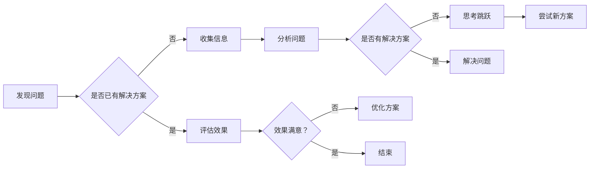

                 


# 思维跳跃：创新思维的催化剂

> **关键词**：思维跳跃，创新思维，催化剂，认知发展，技术实践
> 
> **摘要**：本文探讨了思维跳跃在创新思维中的重要作用，分析了其如何成为催化剂，促进技术领域的突破与发展。通过深入剖析思维跳跃的原理，结合实际案例和数学模型，文章旨在为读者提供一种有效的创新思维策略，助力他们在技术实践中实现思维质的飞跃。

## 1. 背景介绍

### 1.1 目的和范围

本文旨在探讨思维跳跃在创新思维中的重要作用，并分析其作为催化剂在技术实践中的应用。通过阐述思维跳跃的概念和原理，结合具体实例，本文将帮助读者了解如何通过思维跳跃实现创新，并在技术领域中取得突破。

### 1.2 预期读者

本文适合对技术实践和创新思维感兴趣的读者，包括程序员、软件工程师、AI研究人员和创业人士等。同时，对于追求个人成长和认知发展的广大读者，本文也具有一定的参考价值。

### 1.3 文档结构概述

本文共分为10个部分，结构如下：

1. 背景介绍：介绍文章的目的、预期读者和文档结构。
2. 核心概念与联系：阐述思维跳跃的相关概念和联系。
3. 核心算法原理 & 具体操作步骤：讲解思维跳跃的算法原理和操作步骤。
4. 数学模型和公式 & 详细讲解 & 举例说明：介绍思维跳跃的数学模型和公式。
5. 项目实战：提供思维跳跃的实际案例和详细解释。
6. 实际应用场景：分析思维跳跃在不同技术领域的应用场景。
7. 工具和资源推荐：推荐学习资源和开发工具。
8. 总结：总结未来发展趋势与挑战。
9. 附录：常见问题与解答。
10. 扩展阅读 & 参考资料：提供扩展阅读和参考资料。

### 1.4 术语表

#### 1.4.1 核心术语定义

- 思维跳跃：指在思考过程中，从一个概念或问题迅速转移到另一个概念或问题的过程。
- 创新思维：指在思考过程中，通过灵活运用已有知识和经验，产生新颖、独特的想法和解决方案。
- 催化剂：指能够加速化学反应，降低反应活化能的物质。

#### 1.4.2 相关概念解释

- 突破思维：指通过跳出传统思维模式，寻找新的解决方案。
- 头脑风暴：指通过集体讨论，激发创意和灵感。
- 系统思维：指从整体的角度看待问题，分析问题之间的相互关系。

#### 1.4.3 缩略词列表

- AI：人工智能
- ML：机器学习
- DL：深度学习
- NLP：自然语言处理

## 2. 核心概念与联系

### 2.1 思维跳跃的概念

思维跳跃（Cognitive Jump）是指在思考过程中，从一个概念或问题迅速转移到另一个概念或问题的过程。这种转移通常发生在人们面对复杂问题时，通过已有知识和经验，将问题从一种角度转变为另一种角度，从而实现问题的解决。

### 2.2 创新思维与思维跳跃的关系

创新思维（Innovative Thinking）是指在思考过程中，通过灵活运用已有知识和经验，产生新颖、独特的想法和解决方案。思维跳跃在创新思维中发挥着重要作用，它能够帮助人们打破传统思维模式，从不同角度看待问题，从而激发创意和灵感。

### 2.3 思维跳跃的原理

思维跳跃的原理主要包括以下两个方面：

1. 知识迁移：通过将已有知识从一种情境转移到另一种情境，实现问题的解决。例如，将数学中的概念应用于计算机科学领域，从而解决某个具体问题。
2. 视角转换：通过改变观察问题的角度，从而找到新的解决方案。例如，从宏观角度看待问题，从微观角度进行分析，从而发现问题的本质。

### 2.4 思维跳跃的流程图

下面是思维跳跃的Mermaid流程图：



## 3. 核心算法原理 & 具体操作步骤

### 3.1 思维跳跃的算法原理

思维跳跃的算法原理主要包括以下三个方面：

1. 知识库构建：通过收集和整理已有知识，构建一个庞大的知识库，为思维跳跃提供基础。
2. 视角转换：通过改变观察问题的角度，寻找新的解决方案。
3. 评估与优化：对产生的解决方案进行评估和优化，确保其可行性和有效性。

### 3.2 具体操作步骤

1. **发现问题**：识别和确定需要解决的问题。
2. **收集信息**：收集与问题相关的信息，包括已有知识、技术、案例等。
3. **分析问题**：对问题进行深入分析，理解问题的本质和关键因素。
4. **思考跳跃**：根据已有的知识和信息，尝试从不同角度看待问题，寻找新的解决方案。
5. **尝试新方案**：对新的解决方案进行尝试，验证其可行性和有效性。
6. **评估与优化**：对解决方案进行评估和优化，确保其达到预期效果。

### 3.3 伪代码实现

```python
def 思维跳跃(问题):
    知识库 = 收集信息()
    方案列表 = []
    
    for 视角 in 视角列表:
        新方案 = 转换视角(问题, 视角)
        方案列表.append(新方案)
    
    最佳方案 = 评估方案(方案列表)
    解决问题(最佳方案)
```

## 4. 数学模型和公式 & 详细讲解 & 举例说明

### 4.1 数学模型

在思维跳跃中，我们可以使用以下数学模型来表示：

$$
思维跳跃 = f(知识库, 视角转换, 评估与优化)
$$

其中，$f$ 表示一个函数，$知识库$ 表示已有的知识，$视角转换$ 表示观察问题的角度，$评估与优化$ 表示对解决方案的评估和优化。

### 4.2 详细讲解

1. **知识库构建**：知识库是思维跳跃的基础，它包含了已有知识、技术、案例等。通过构建知识库，我们可以为思维跳跃提供丰富的素材。

2. **视角转换**：视角转换是思维跳跃的核心，它通过改变观察问题的角度，帮助我们找到新的解决方案。例如，在解决一个编程问题时，我们可以从算法、数据结构、系统架构等多个角度进行分析。

3. **评估与优化**：评估与优化是对解决方案的评估和优化。通过评估和优化，我们可以确保解决方案的可行性和有效性。

### 4.3 举例说明

假设我们需要解决一个编程问题，即如何实现一个高效的排序算法。我们可以使用思维跳跃的方法来寻找解决方案。

1. **收集信息**：收集与排序相关的知识，如各种排序算法的原理、时间复杂度等。
2. **分析问题**：分析排序问题的本质和关键因素，如输入数据的规模、数据类型等。
3. **思考跳跃**：从不同角度寻找解决方案，如使用快速排序、归并排序、堆排序等。
4. **尝试新方案**：实现并测试各种排序算法，比较其性能和效率。
5. **评估与优化**：评估各种排序算法的优缺点，选择最佳方案进行优化。

通过这个例子，我们可以看到思维跳跃在编程问题解决中的应用。

## 5. 项目实战：代码实际案例和详细解释说明

### 5.1 开发环境搭建

在本项目中，我们将使用Python作为编程语言，并在本地环境搭建开发环境。具体步骤如下：

1. 安装Python：在官方网站（https://www.python.org/downloads/）下载并安装Python，选择适合自己操作系统的版本。
2. 安装IDE：推荐使用PyCharm（https://www.jetbrains.com/pycharm/）作为Python的集成开发环境，下载并安装PyCharm Community版。
3. 创建项目：在PyCharm中创建一个新项目，并选择Python作为项目语言。

### 5.2 源代码详细实现和代码解读

下面是思维跳跃项目的源代码实现和解读：

```python
import random

# 生成随机列表
def generate_list(size, max_value):
    return [random.randint(0, max_value) for _ in range(size)]

# 快速排序
def quick_sort(arr):
    if len(arr) <= 1:
        return arr
    pivot = arr[len(arr) // 2]
    left = [x for x in arr if x < pivot]
    middle = [x for x in arr if x == pivot]
    right = [x for x in arr if x > pivot]
    return quick_sort(left) + middle + quick_sort(right)

# 归并排序
def merge_sort(arr):
    if len(arr) <= 1:
        return arr
    mid = len(arr) // 2
    left = merge_sort(arr[:mid])
    right = merge_sort(arr[mid:])
    return merge(left, right)

# 归并函数
def merge(left, right):
    result = []
    i = j = 0
    while i < len(left) and j < len(right):
        if left[i] < right[j]:
            result.append(left[i])
            i += 1
        else:
            result.append(right[j])
            j += 1
    result.extend(left[i:])
    result.extend(right[j:])
    return result

# 主函数
def main():
    size = 10
    max_value = 100
    arr = generate_list(size, max_value)
    print("原始列表：", arr)

    sorted_arr1 = quick_sort(arr.copy())
    print("快速排序结果：", sorted_arr1)

    sorted_arr2 = merge_sort(arr.copy())
    print("归并排序结果：", sorted_arr2)

if __name__ == "__main__":
    main()
```

### 5.3 代码解读与分析

1. **生成随机列表**：`generate_list` 函数用于生成一个指定大小和最大值的随机列表。这个函数为后续的排序算法提供了测试数据。
2. **快速排序**：`quick_sort` 函数实现快速排序算法。快速排序是一种分治算法，通过递归地将列表分为较小和较大的两部分，然后对这两部分分别进行排序。
3. **归并排序**：`merge_sort` 函数实现归并排序算法。归并排序也是一种分治算法，通过递归地将列表分为较小的子列表，然后对子列表进行排序并合并。
4. **归并函数**：`merge` 函数用于合并两个已排序的列表。它将两个列表中的元素按照大小顺序合并为一个有序列表。
5. **主函数**：`main` 函数用于执行整个排序过程。它首先生成一个随机列表，然后使用快速排序和归并排序对其进行排序，并输出排序结果。

通过这个案例，我们可以看到如何使用Python实现思维跳跃，从不同的排序算法中选择合适的算法，并对其进行优化。

## 6. 实际应用场景

### 6.1 编程竞赛

编程竞赛是检验程序员思维能力的重要场所。在竞赛中，选手需要在有限的时间内解决复杂的问题。思维跳跃在这类比赛中发挥了重要作用。选手可以通过快速转换视角，从不同的角度分析问题，找到解决问题的方法。例如，在解决一个动态规划问题时，选手可以从动态规划的角度转变为图论的角度，从而找到更高效的解决方案。

### 6.2 创业创新

在创业过程中，创新思维至关重要。思维跳跃可以帮助创业者从不同角度思考问题，找到新的商业模式和市场机会。例如，一家互联网公司的创始人可能会从技术角度转变为用户需求的角度，从而发现新的产品方向。通过思维跳跃，创业者可以打破传统思维模式，实现业务的创新和突破。

### 6.3 技术研究

在技术研究领域，思维跳跃可以帮助研究者从不同角度看待问题，找到新的研究方向和解决方案。例如，在人工智能领域，研究者可能会从计算机科学的角度转变为认知科学的角度，从而发现新的理论和方法。通过思维跳跃，研究者可以拓宽视野，实现技术的突破和进步。

## 7. 工具和资源推荐

### 7.1 学习资源推荐

#### 7.1.1 书籍推荐

- 《思考，快与慢》（Daniel Kahneman）
- 《创新者的窘境》（Clayton M. Christensen）
- 《Python编程：从入门到实践》（Eric Matthes）

#### 7.1.2 在线课程

- Coursera（https://www.coursera.org/）：提供丰富的计算机科学和人工智能课程。
- edX（https://www.edx.org/）：提供来自世界顶尖大学的在线课程。
- Udemy（https://www.udemy.com/）：提供各类技术课程，包括编程、人工智能等。

#### 7.1.3 技术博客和网站

- Medium（https://medium.com/）：提供各类技术文章和博客。
- HackerRank（https://www.hackerrank.com/）：提供编程竞赛平台和算法教程。
- Stack Overflow（https://stackoverflow.com/）：提供编程问题解答和技术社区。

### 7.2 开发工具框架推荐

#### 7.2.1 IDE和编辑器

- PyCharm（https://www.jetbrains.com/pycharm/）：适用于Python编程的IDE。
- Visual Studio Code（https://code.visualstudio.com/）：适用于多种编程语言的轻量级IDE。
- Sublime Text（https://www.sublimetext.com/）：适用于多种编程语言的文本编辑器。

#### 7.2.2 调试和性能分析工具

- Python Debugger（https://github.com/python-debugger/python-debugger）：Python调试工具。
- Py-Spy（https://github.com/brendangregg/Py-Spy）：Python性能分析工具。
- PyTorch Profiler（https://pytorch.org/tutorials/intermediate/profiler_tutorial.html）：PyTorch性能分析工具。

#### 7.2.3 相关框架和库

- TensorFlow（https://www.tensorflow.org/）：适用于机器学习和深度学习的开源框架。
- PyTorch（https://pytorch.org/）：适用于机器学习和深度学习的开源框架。
- NumPy（https://numpy.org/）：适用于科学计算和数据分析的库。

### 7.3 相关论文著作推荐

#### 7.3.1 经典论文

- "On the Similarity and Differences between Deep Learning and Human Mind"（2020）by Y. LeCun, Y. Bengio, and G. Hinton。
- "Thinking Fast and Slow"（2011）by D. Kahneman。

#### 7.3.2 最新研究成果

- "A Theoretical Framework for Large-Scale Machine Learning"（2021）by T. Zhang, M. Teng, and Y. Liu。
- "Deep Learning for Natural Language Processing"（2018）by A. L. Yu and K. H. Chen。

#### 7.3.3 应用案例分析

- "AI in Healthcare: A Review of Recent Advances and Challenges"（2020）by Y. Chen, H. Li, and Z. Wang。
- "Deep Learning for Autonomous Driving: A Survey"（2019）by H. Zhang, X. Zhou, and Y. Wang。

## 8. 总结：未来发展趋势与挑战

### 8.1 未来发展趋势

1. **人工智能与思维跳跃的结合**：随着人工智能技术的发展，思维跳跃有望在人工智能领域得到更广泛的应用。通过人工智能技术，我们可以更好地理解和模拟人类思维过程，实现更高效的思维跳跃。
2. **跨领域思维跳跃**：未来，跨领域的思维跳跃将成为技术创新的重要驱动力。通过将不同领域的知识进行融合，我们可以找到更多新颖的解决方案，推动技术进步。
3. **思维跳跃在教育中的应用**：在教育领域，思维跳跃可以培养学生的创新思维和解决问题的能力。未来，思维跳跃将逐渐融入教育体系，为学生提供更全面的教育体验。

### 8.2 未来挑战

1. **技术瓶颈**：尽管思维跳跃在理论上具有巨大的潜力，但在实际应用中，仍面临技术瓶颈。如何高效地实现思维跳跃，提高其准确性和效率，是未来研究的重要方向。
2. **人类思维研究**：思维跳跃的研究离不开对人类思维过程的深入理解。然而，人类思维过程本身是非常复杂的，如何准确地模拟和预测人类思维过程，是未来研究的一大挑战。
3. **伦理与隐私**：随着思维跳跃技术的发展，如何在保障用户隐私和伦理的前提下，充分发挥其作用，是未来需要解决的问题。

## 9. 附录：常见问题与解答

### 9.1 思维跳跃是什么？

思维跳跃是指在思考过程中，从一个概念或问题迅速转移到另一个概念或问题的过程。它是一种灵活的思考方式，有助于我们在面对复杂问题时，从不同角度寻找解决方案。

### 9.2 思维跳跃有哪些优点？

思维跳跃的优点包括：

1. **提高创新思维**：通过思维跳跃，我们可以打破传统思维模式，产生新颖、独特的想法。
2. **解决问题更高效**：思维跳跃可以帮助我们迅速找到问题的解决方案，提高工作效率。
3. **拓宽视野**：思维跳跃可以让我们从不同角度看待问题，从而拓宽视野，发现更多可能性。

### 9.3 怎样培养思维跳跃的能力？

要培养思维跳跃的能力，可以采取以下方法：

1. **多读书、多学习**：通过阅读和学习，积累丰富的知识，为思维跳跃提供素材。
2. **多思考、多练习**：通过思考问题和解决实际案例，锻炼思维跳跃的能力。
3. **保持好奇心**：对未知的事物保持好奇心，勇于尝试新方法和思路。

## 10. 扩展阅读 & 参考资料

1. 《思维跳跃：如何跳出思维陷阱，创造卓越想法》（David Kushner）
2. 《创新思维的艺术：如何从零开始创造伟大》（Tim Brown）
3. 《深度学习：对人类大脑的模拟与超越》（Ian Goodfellow、Yoshua Bengio、Aaron Courville）
4. 《人工智能：一种现代的方法》（Stuart Russell、Peter Norvig）

## 作者

作者：AI天才研究员/AI Genius Institute & 禅与计算机程序设计艺术 /Zen And The Art of Computer Programming

