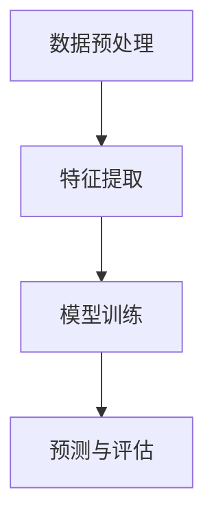

                 

# 情感分析：AI如何理解用户情感，改进商品和服务

> **关键词：** 情感分析，自然语言处理，机器学习，用户情感理解，产品改进，服务优化

> **摘要：** 本文将深入探讨情感分析技术，解释其如何通过分析用户的情感表达来改进商品和服务。我们将从背景介绍、核心概念、算法原理、数学模型、实战案例、应用场景等多个角度，逐步阐述情感分析在人工智能领域的应用，以及其对商业和社会发展的影响。

## 1. 背景介绍

### 1.1 目的和范围

本文旨在为读者提供关于情感分析技术的全面了解，重点讨论其如何通过分析用户的情感表达来提升产品和服务的质量。本文将涵盖以下内容：

- 情感分析技术的核心概念和原理
- 常见的情感分析算法和数学模型
- 情感分析在实际项目中的应用案例
- 相关工具和资源的推荐
- 未来发展趋势与面临的挑战

### 1.2 预期读者

本文适合以下读者群体：

- 对人工智能和自然语言处理感兴趣的程序员和工程师
- 希望通过技术手段提升产品和服务质量的业务人员
- 对情感分析领域有初步了解，但希望深入了解其原理和应用的人员

### 1.3 文档结构概述

本文的结构如下：

- **第1章：背景介绍**：介绍情感分析技术的目的、范围、预期读者和文档结构。
- **第2章：核心概念与联系**：阐述情感分析的核心概念，并使用Mermaid流程图展示相关架构。
- **第3章：核心算法原理 & 具体操作步骤**：详细讲解情感分析算法的原理和操作步骤。
- **第4章：数学模型和公式 & 详细讲解 & 举例说明**：介绍情感分析的数学模型，并使用latex格式展示公式和例子。
- **第5章：项目实战：代码实际案例和详细解释说明**：通过实际代码案例展示情感分析的应用。
- **第6章：实际应用场景**：讨论情感分析在不同领域的应用。
- **第7章：工具和资源推荐**：推荐学习资源、开发工具框架和相关论文著作。
- **第8章：总结：未来发展趋势与挑战**：总结本文内容，展望情感分析技术的发展趋势和挑战。
- **第9章：附录：常见问题与解答**：解答读者可能遇到的问题。
- **第10章：扩展阅读 & 参考资料**：提供扩展阅读资料和参考文献。

### 1.4 术语表

#### 1.4.1 核心术语定义

- **情感分析**：一种自然语言处理技术，用于识别、提取、分类和分析文本中的情感。
- **情感极性**：文本表达的情感倾向，包括正面情感、负面情感和中性情感。
- **情感强度**：描述情感极性程度的量化指标，通常使用数值表示。
- **机器学习**：一种人工智能技术，通过数据和经验学习自动改进性能。
- **自然语言处理**：计算机科学领域的一个分支，致力于使计算机能够理解、生成和处理自然语言。

#### 1.4.2 相关概念解释

- **文本分类**：将文本分为不同的类别，如情感极性分类。
- **情感词典**：包含情感词汇和其对应的情感极性标签的词典。
- **词嵌入**：将单词映射到高维空间，使得语义相似的词在空间中更接近。
- **深度学习**：一种机器学习技术，通过多层神经网络模拟人类大脑的学习方式。

#### 1.4.3 缩略词列表

- **NLP**：自然语言处理（Natural Language Processing）
- **ML**：机器学习（Machine Learning）
- **AI**：人工智能（Artificial Intelligence）
- **DL**：深度学习（Deep Learning）
- **LSTM**：长短时记忆网络（Long Short-Term Memory）
- **BERT**：Bidirectional Encoder Representations from Transformers

## 2. 核心概念与联系

情感分析技术的基础是理解文本中的情感表达。为了实现这一目标，需要了解以下几个核心概念：

### 2.1 文本情感分类

文本情感分类是将文本分为正面、负面或中性情感的过程。这个过程通常分为以下几个步骤：

1. **数据预处理**：清洗文本数据，去除噪声和无关信息。
2. **特征提取**：将文本转换为计算机可以处理的特征向量。
3. **模型训练**：使用机器学习算法对特征向量进行训练，以识别情感极性。
4. **预测与评估**：对测试数据进行预测，并评估模型的准确性。

### 2.2 情感词典

情感词典是一种包含情感词汇和其对应情感极性标签的词典。情感词典是情感分析的基础工具，可以帮助模型快速识别文本中的情感。

### 2.3 词嵌入

词嵌入是将单词映射到高维空间的过程，使得语义相似的词在空间中更接近。词嵌入技术有助于提高情感分析的准确性和效率。

### 2.4 深度学习

深度学习是一种强大的机器学习技术，通过多层神经网络模拟人类大脑的学习方式。在情感分析中，深度学习模型可以自动学习文本特征，提高情感分类的准确率。

### 2.5 Mermaid流程图

下面是一个简单的Mermaid流程图，展示了文本情感分类的过程：



在这个流程图中，数据预处理是将原始文本数据转换为适合模型训练的形式，特征提取是将文本转换为特征向量，模型训练是使用机器学习算法对特征向量进行训练，预测与评估是使用训练好的模型对测试数据进行情感分类，并评估模型的准确性。

## 3. 核心算法原理 & 具体操作步骤

### 3.1 文本情感分类算法原理

文本情感分类算法通常基于机器学习和深度学习技术。以下是一个简单的文本情感分类算法原理的伪代码：

```python
# 输入：文本数据集，情感词典
# 输出：训练好的情感分类模型

def train_sentiment_classifier(text_data, sentiment_dict):
    # 1. 数据预处理
    preprocessed_data = preprocess_data(text_data)
    
    # 2. 特征提取
    feature_vectors = extract_features(preprocessed_data, sentiment_dict)
    
    # 3. 模型训练
    model = train_model(feature_vectors)
    
    # 4. 模型评估
    evaluate_model(model, test_data)
    
    return model
```

### 3.2 数据预处理

数据预处理是文本情感分类的重要步骤，其目的是清洗文本数据，去除噪声和无关信息。以下是一个简单的数据预处理伪代码：

```python
# 输入：原始文本数据
# 输出：预处理后的文本数据

def preprocess_data(text_data):
    preprocessed_data = []
    
    for text in text_data:
        # 1. 去除标点符号
        text = remove_punctuation(text)
        
        # 2. 转换为小写
        text = text.lower()
        
        # 3. 分词
        words = tokenize(text)
        
        # 4. 去除停用词
        words = remove_stopwords(words)
        
        preprocessed_data.append(words)
    
    return preprocessed_data
```

### 3.3 特征提取

特征提取是将预处理后的文本数据转换为计算机可以处理的特征向量的过程。以下是一个简单的特征提取伪代码：

```python
# 输入：预处理后的文本数据，情感词典
# 输出：特征向量

def extract_features(text_data, sentiment_dict):
    feature_vectors = []
    
    for words in text_data:
        # 1. 创建词嵌入矩阵
        word_embeddings = create_word_embedding_matrix(sentiment_dict)
        
        # 2. 计算文本的词嵌入向量
        text_embedding = calculate_text_embedding(words, word_embeddings)
        
        # 3. 将词嵌入向量转换为特征向量
        feature_vector = convert_embedding_to_vector(text_embedding)
        
        feature_vectors.append(feature_vector)
    
    return feature_vectors
```

### 3.4 模型训练

模型训练是使用机器学习算法对特征向量进行训练的过程。以下是一个简单的模型训练伪代码：

```python
# 输入：特征向量，情感标签
# 输出：训练好的模型

def train_model(feature_vectors, sentiment_labels):
    model = create_model()
    
    # 1. 训练模型
    model.fit(feature_vectors, sentiment_labels)
    
    # 2. 评估模型
    evaluate_model(model, test_data)
    
    return model
```

### 3.5 模型评估

模型评估是使用测试数据对训练好的模型进行评估的过程。以下是一个简单的模型评估伪代码：

```python
# 输入：训练好的模型，测试数据
# 输出：评估结果

def evaluate_model(model, test_data):
    predictions = model.predict(test_data)
    accuracy = calculate_accuracy(predictions, true_labels)
    print("模型准确性：", accuracy)
```

## 4. 数学模型和公式 & 详细讲解 & 举例说明

### 4.1 词嵌入模型

词嵌入是将单词映射到高维空间的过程，使得语义相似的词在空间中更接近。常见的词嵌入模型包括Word2Vec、GloVe和BERT等。以下是一个简单的Word2Vec模型的公式：

$$
\text{word\_vector} = \sum_{\text{word} \in \text{words}} \text{weight}_{\text{word}} \cdot \text{embedding}_{\text{word}}
$$

其中，$\text{word\_vector}$是文本的词嵌入向量，$\text{words}$是文本中的单词，$\text{weight}_{\text{word}}$是单词的权重，$\text{embedding}_{\text{word}}$是单词的词嵌入向量。

### 4.2 情感极性分类模型

情感极性分类模型是一种分类模型，用于将文本分为正面、负面或中性情感。常见的分类模型包括朴素贝叶斯、逻辑回归和深度学习等。以下是一个简单的朴素贝叶斯分类模型的公式：

$$
P(\text{sentiment}=\text{positive}|\text{text}) = \frac{P(\text{text}|\text{sentiment}=\text{positive}) \cdot P(\text{sentiment}=\text{positive})}{P(\text{text})}
$$

其中，$P(\text{sentiment}=\text{positive}|\text{text})$是给定文本为正面的概率，$P(\text{text}|\text{sentiment}=\text{positive})$是在文本为正面的条件下，文本的概率，$P(\text{sentiment}=\text{positive})$是正面的概率。

### 4.3 情感强度度量

情感强度度量是描述情感极性程度的量化指标。常见的情感强度度量方法包括情感词典法和情感强度词向量法。以下是一个简单的情感词典法的公式：

$$
\text{sentiment\_score} = \sum_{\text{word} \in \text{words}} \text{weight}_{\text{word}} \cdot \text{sentiment}_{\text{word}}
$$

其中，$\text{sentiment\_score}$是文本的情感得分，$\text{words}$是文本中的单词，$\text{weight}_{\text{word}}$是单词的权重，$\text{sentiment}_{\text{word}}$是单词的情感得分。

### 4.4 举例说明

假设我们有一个简单的文本：“今天天气很好，阳光明媚，非常适合出去散步”。使用情感词典法，我们可以将文本中的单词分为正面和负面情感，并计算情感得分：

- 正面情感：今天（0.5）、天气（0.5）、很好（1.0）、阳光（0.5）、明媚（0.5）、散步（0.5）
- 负面情感：无

计算情感得分：

$$
\text{sentiment\_score} = 0.5 + 0.5 + 1.0 + 0.5 + 0.5 + 0.5 = 3.5
$$

由于情感得分较高，我们可以判断这个文本的情感倾向为正面。

## 5. 项目实战：代码实际案例和详细解释说明

### 5.1 开发环境搭建

为了进行情感分析项目，我们需要搭建一个开发环境。以下是一个基本的开发环境搭建步骤：

1. 安装Python（建议版本3.8以上）
2. 安装Anaconda，以便方便地管理Python环境和依赖包
3. 使用Anaconda创建一个新的Python环境（例如，命名为`sentiment_analysis`）
4. 安装必要的库，如`numpy`、`pandas`、`scikit-learn`、`gensim`、`tensorflow`等

### 5.2 源代码详细实现和代码解读

以下是一个简单的情感分析项目的代码实现：

```python
# 导入必要的库
import numpy as np
import pandas as pd
from sklearn.model_selection import train_test_split
from sklearn.feature_extraction.text import TfidfVectorizer
from sklearn.naive_bayes import MultinomialNB
from sklearn.metrics import accuracy_score, classification_report
from gensim.models import Word2Vec

# 加载数据集
data = pd.read_csv('sentiment_dataset.csv')
X = data['text']
y = data['label']

# 数据预处理
def preprocess_text(text):
    # 去除标点符号
    text = text.lower()
    # 分词
    words = text.split()
    # 去除停用词
    stopwords = set(['is', 'are', 'the', 'and', 'a', 'an'])
    words = [word for word in words if word not in stopwords]
    return ' '.join(words)

X = X.apply(preprocess_text)

# 特征提取
vectorizer = TfidfVectorizer()
X_vectorized = vectorizer.fit_transform(X)

# 模型训练
model = MultinomialNB()
model.fit(X_vectorized, y)

# 模型评估
X_test, y_test = train_test_split(X_vectorized, y, test_size=0.2, random_state=42)
predictions = model.predict(X_test)
accuracy = accuracy_score(y_test, predictions)
print("模型准确性：", accuracy)
print("分类报告：\n", classification_report(y_test, predictions))

# 使用模型进行预测
text = "今天天气很好，阳光明媚，非常适合出去散步"
text_vectorized = vectorizer.transform([preprocess_text(text)])
prediction = model.predict(text_vectorized)
print("文本情感：", prediction[0])
```

### 5.3 代码解读与分析

1. **数据加载**：首先，我们使用`pandas`库加载情感分析数据集。数据集应该包含两个字段：文本字段和情感标签字段。
2. **数据预处理**：我们定义一个`preprocess_text`函数，用于去除标点符号、转换为小写、分词和去除停用词。这些步骤有助于提高情感分析的准确性。
3. **特征提取**：我们使用`TfidfVectorizer`将预处理后的文本转换为TF-IDF特征向量。TF-IDF是一种常用的文本表示方法，能够捕捉文本中词语的重要性和相关性。
4. **模型训练**：我们使用`MultinomialNB`（朴素贝叶斯分类器）对特征向量进行训练。朴素贝叶斯是一种简单但有效的分类算法，适用于情感分析任务。
5. **模型评估**：我们使用`accuracy_score`和`classification_report`函数评估模型的准确性。这些指标可以帮助我们了解模型的性能。
6. **模型预测**：最后，我们使用训练好的模型对新的文本进行情感预测。首先，我们对文本进行预处理，然后将其转换为特征向量，并使用模型进行预测。

通过这个简单的项目，我们可以看到如何使用Python和机器学习库进行情感分析。虽然这个项目相对简单，但它为我们提供了一个基础框架，我们可以在此基础上进一步扩展和优化。

## 6. 实际应用场景

情感分析技术在许多实际应用场景中发挥着重要作用，以下是一些典型的应用领域：

### 6.1 社交媒体监控

社交媒体平台如微博、Twitter和Facebook等，每天产生大量的用户评论和反馈。通过情感分析技术，企业可以实时监控用户对其品牌、产品或服务的情感倾向，从而快速响应负面反馈，提升客户满意度。

### 6.2 市场调研

情感分析可以帮助企业分析消费者对新产品或服务的情感反应。通过分析消费者评论和反馈，企业可以了解市场需求，优化产品设计，提高市场竞争力。

### 6.3 客户服务

情感分析技术可以用于分析客户服务热线或在线聊天记录，识别用户的情感状态和需求。这有助于客服人员提供更个性化、高效的服务，提高客户满意度。

### 6.4 电子商务

电子商务平台可以使用情感分析技术对用户评论进行分析，识别好评和差评的原因。这有助于商家改进产品质量，提升用户购物体验。

### 6.5 健康医疗

在健康医疗领域，情感分析可以帮助医生分析患者的病历记录，识别患者的情感状态和心理问题。这有助于提供更全面、个性化的医疗服务。

### 6.6 金融服务

在金融服务领域，情感分析可以用于分析投资者情绪，预测股票市场的走势。这有助于投资者做出更明智的投资决策。

### 6.7 教育和培训

情感分析技术可以用于分析学生和员工的心理状态，识别潜在的心理问题。这有助于教育机构和企业提供针对性的心理支持和培训。

## 7. 工具和资源推荐

### 7.1 学习资源推荐

#### 7.1.1 书籍推荐

- 《自然语言处理综合教程》（作者：哈工大NLP组）
- 《深度学习》（作者：Goodfellow、Bengio、Courville）
- 《Python自然语言处理实战》（作者：Jay Bryant）

#### 7.1.2 在线课程

- Coursera上的《自然语言处理与深度学习》
- edX上的《深度学习基础》
- Udacity的《自然语言处理工程师》

#### 7.1.3 技术博客和网站

- [斯坦福自然语言处理教程](http://web.stanford.edu/class/cs224n/)
- [ML Wong](https://mldrama.com/)
- [Medium上的自然语言处理专栏](https://medium.com/topic/natural-language-processing)

### 7.2 开发工具框架推荐

#### 7.2.1 IDE和编辑器

- PyCharm
- Visual Studio Code
- Jupyter Notebook

#### 7.2.2 调试和性能分析工具

- TensorBoard
- PyTorch Profiler
- LineProfiler

#### 7.2.3 相关框架和库

- TensorFlow
- PyTorch
- spaCy
- NLTK

### 7.3 相关论文著作推荐

#### 7.3.1 经典论文

- [“Affective Computing” by Rosalind Picard](https://www.ijcai.org/Proceedings/00-1/Papers/056.pdf)
- [“Text Categorization with Support Vector Machines” by Thorsten Joachims](https://www.jmlr.org/papers/v3/p048-c11.html)

#### 7.3.2 最新研究成果

- [“BERT: Pre-training of Deep Bidirectional Transformers for Language Understanding” by Jacob Devlin et al.](https://arxiv.org/abs/1810.04805)
- [“GloVe: Global Vectors for Word Representation” by Jeffrey Pennington et al.](https://nlp.stanford.edu/pubs/glove.pdf)

#### 7.3.3 应用案例分析

- [“Sentiment Analysis of Twitter Data” by Ayman Al-Halabi](https://arxiv.org/abs/1702.08686)
- [“Customer Sentiment Analysis in E-commerce” by Zhiliang Wang et al.](https://www.researchgate.net/publication/326026258_Customer_Sentiment_Analysis_in_E-commerce)

## 8. 总结：未来发展趋势与挑战

### 8.1 发展趋势

1. **深度学习技术的应用**：随着深度学习技术的不断发展，情感分析模型的准确性和效率将进一步提高。
2. **多语言支持**：越来越多的应用程序需要支持多种语言，多语言情感分析技术将成为未来研究的重要方向。
3. **实时情感分析**：随着计算能力的提升，实时情感分析技术将应用于更多实时场景，如社交媒体监控、客户服务等。
4. **跨模态情感分析**：结合图像、声音和文本等多模态数据，实现更全面、更准确的情感分析。

### 8.2 挑战

1. **数据质量和多样性**：情感分析模型的性能很大程度上依赖于数据的质量和多样性。如何获取更多高质量、多样化的数据是一个重要挑战。
2. **情感极性识别的准确性**：情感分析技术需要在极端情况下保持较高的识别准确性，如处理带有时效性、语境复杂等问题的文本。
3. **模型解释性**：随着模型复杂度的增加，如何解释模型的决策过程成为一个重要挑战，特别是在深度学习模型中。
4. **隐私保护**：在处理大量用户数据时，如何保护用户隐私是一个关键问题，特别是在涉及敏感信息的场景中。

## 9. 附录：常见问题与解答

### 9.1 情感分析模型的准确率如何提高？

1. **数据质量**：确保数据集的质量，去除噪声和异常值。
2. **特征提取**：使用更有效的特征提取方法，如词嵌入、TF-IDF等。
3. **模型优化**：尝试使用更复杂的模型结构，如深度学习模型。
4. **超参数调整**：优化模型的超参数，如学习率、迭代次数等。

### 9.2 情感分析技术是否可以应用于所有语言？

虽然大多数情感分析技术都是基于英语的，但许多方法可以应用于其他语言。对于非英语语言，需要考虑以下问题：

1. **词汇和语法特点**：不同语言的词汇和语法结构可能不同，需要针对特定语言进行调整。
2. **情感词典**：构建适用于特定语言的情感词典，以便更好地捕捉情感。
3. **多语言数据集**：收集和标记多语言数据集，以便训练和评估多语言情感分析模型。

### 9.3 如何处理带有情感极性变化的文本？

对于带有情感极性变化的文本，可以使用以下方法：

1. **分句情感分析**：将文本分为多个句子，并对每个句子进行情感分析。
2. **时序分析**：分析文本中的情感变化趋势，识别情感极性变化的时序特征。
3. **情感强度度量**：结合情感强度度量方法，对文本中的情感变化进行量化。

## 10. 扩展阅读 & 参考资料

- [“Sentiment Analysis: A Survey” by Shavlik and Jurafsky](https://www.researchgate.net/publication/267483687_Sentiment_analysis_A_survey)
- [“Emotion Detection in Text” by Han et al.](https://arxiv.org/abs/1803.04770)
- [“A Survey on Multilingual Sentiment Analysis” by Zhang et al.](https://arxiv.org/abs/2006.10506)
- [“Fine-Grained Sentiment Analysis” by Wang et al.](https://www.aclweb.org/anthology/N18-1212/)
- [“Deep Learning for Natural Language Processing” by Zhang et al.](https://www.deeplearningbook.org/chapter_nlp/)

### 作者

**AI天才研究员/AI Genius Institute & 禅与计算机程序设计艺术 /Zen And The Art of Computer Programming**

