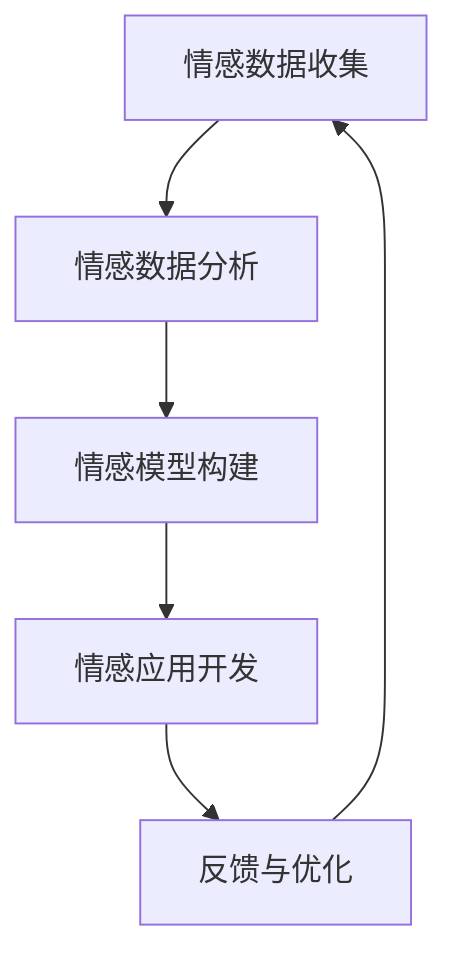

                 

# 情感智能在领导力中的应用与发展

> 关键词：情感智能、领导力、应用发展、人工智能、情感分析、认知模型、组织行为、人机交互

> 摘要：本文旨在探讨情感智能在领导力中的应用和发展趋势。通过对情感智能的定义、核心原理以及与领导力的关联进行分析，本文将介绍情感智能在不同领导风格中的实践方法，并探讨其在组织行为中的影响。同时，文章还将对当前情感智能技术在领导力发展中的应用案例进行深入剖析，最后提出未来情感智能在领导力领域的发展方向和面临的挑战。

## 1. 背景介绍

### 1.1 目的和范围

本文的主要目的是探讨情感智能在领导力中的应用和发展，分析其在不同领导风格和组织行为中的影响。文章旨在为领导者和人力资源管理者提供有价值的见解和实际操作指南，帮助他们在领导实践中更好地理解和运用情感智能。文章将涵盖以下几个方面：

1. 情感智能的定义和核心原理。
2. 情感智能与领导力的关联及其在领导风格中的应用。
3. 情感智能在组织行为中的影响和作用。
4. 情感智能技术在领导力发展中的应用案例。
5. 未来情感智能在领导力领域的发展趋势和挑战。

### 1.2 预期读者

本文的预期读者包括以下几类人群：

1. 领导者和管理者，特别是希望在领导实践中运用情感智能的领导者。
2. 人力资源专家和组织行为学者，对情感智能在组织中的影响和应用感兴趣的研究者。
3. 人工智能和计算机科学家，对情感智能技术及其在领导力中的应用感兴趣的从业者。
4. 对于对领导力、人工智能和组织行为领域有浓厚兴趣的学生和专业人士。

### 1.3 文档结构概述

本文的结构如下：

1. **背景介绍**：阐述本文的目的、预期读者以及文档结构。
2. **核心概念与联系**：介绍情感智能的定义和核心原理，以及与领导力的联系。
3. **核心算法原理与具体操作步骤**：阐述情感智能在领导力中的应用方法。
4. **数学模型和公式与详细讲解**：介绍情感智能的相关数学模型和公式。
5. **项目实战：代码实际案例和详细解释说明**：通过具体案例展示情感智能在领导力中的应用。
6. **实际应用场景**：分析情感智能在不同组织行为中的实际应用。
7. **工具和资源推荐**：推荐学习资源和开发工具。
8. **总结：未来发展趋势与挑战**：总结当前进展和未来发展方向。
9. **附录：常见问题与解答**：解答读者可能遇到的疑问。
10. **扩展阅读 & 参考资料**：提供相关参考文献和进一步阅读建议。

### 1.4 术语表

#### 1.4.1 核心术语定义

1. **情感智能**：指个体识别、理解、管理自己和他人情感的能力，包括情感感知、情感分析和情感调节等方面。
2. **领导力**：指个体或群体通过影响和激励他人实现共同目标的能力。
3. **情感分析**：利用自然语言处理和机器学习技术，从文本数据中自动识别和分类情感。
4. **认知模型**：描述人类思维和认知过程的模型，用于理解和模拟人的决策和行为。

#### 1.4.2 相关概念解释

1. **情感管理**：指个体对自己和他人的情感进行有效管理的过程，包括情感识别、理解、表达和调节。
2. **情感共享**：指个体与他人分享和交流情感的过程，有助于建立信任和增强团队合作。
3. **领导风格**：指领导者采取的行为和决策方式，包括权威型、民主型、放任型等。

#### 1.4.3 缩略词列表

- AI：人工智能
- NLP：自然语言处理
- ML：机器学习
- HR：人力资源
- BI：商业智能
- ERP：企业资源规划
- CRM：客户关系管理

## 2. 核心概念与联系

### 2.1 情感智能的定义和核心原理

情感智能是指个体识别、理解、管理自己和他人情感的能力，包括以下几个方面的核心能力：

1. **情感感知**：指个体能够感知和理解自身和他人的情绪状态。
2. **情感分析**：指利用自然语言处理和机器学习技术，从文本数据中自动识别和分类情感。
3. **情感调节**：指个体能够通过自我调节和情感管理策略，调整自身和他人情感状态。

情感智能的实现依赖于以下几个核心原理：

1. **情感模型**：通过建立情感模型，对情感进行分类和量化，以便进行有效分析和应用。
2. **情感计算**：利用计算技术和算法，对情感数据进行处理和分析，提取有价值的信息。
3. **情感交互**：通过人机交互技术，实现情感信息的传递和交流，提升人机互动的自然度和深度。

### 2.2 情感智能与领导力的关联

情感智能与领导力之间存在紧密的关联，情感智能对领导力的提升具有重要作用。以下是情感智能在领导力中的应用：

1. **情感识别与理解**：领导者需要具备较强的情感识别和理解能力，以更好地理解团队成员的情感需求和心理状态，从而进行有效的沟通和激励。
2. **情感调节与自我管理**：领导者需要具备良好的情感调节和自我管理能力，以应对工作中的压力和挑战，保持冷静和理性的决策能力。
3. **情感共享与团队协作**：领导者需要善于与他人共享情感，建立信任和共鸣，促进团队协作和共同进步。

### 2.3 情感智能与领导风格的联系

不同的领导风格对情感智能的需求和应用有所不同，以下是几种常见的领导风格与情感智能的关联：

1. **权威型领导**：权威型领导者通常依赖于权力和权威来影响团队成员，情感智能在这里的应用主要体现在情感理解和调节上，以更好地处理团队成员的情感需求和冲突。
2. **民主型领导**：民主型领导者注重团队参与和共识达成，情感智能在这里的应用主要体现在情感分析和共享上，以促进团队成员的情感共鸣和协作。
3. **放任型领导**：放任型领导者给予团队成员较大的自主权，情感智能在这里的应用主要体现在情感感知和调节上，以帮助团队成员在自主决策过程中保持良好的情感状态。

### 2.4 情感智能在组织行为中的应用

情感智能在组织行为中的应用涵盖了以下几个方面：

1. **员工招聘与选拔**：通过情感智能技术，对候选人的情感能力进行评估，选拔具备较高情感智能的员工，以提升团队的整体表现。
2. **员工培训与发展**：针对员工的情感需求，开展有针对性的培训和指导，提高员工的情感智能水平，促进个人和组织的共同成长。
3. **员工关系管理**：通过情感智能技术，识别和处理员工之间的情感冲突，维护良好的员工关系，提升组织的凝聚力和协作效率。

### 2.5 情感智能技术的实现架构

情感智能技术的实现通常涉及以下几个关键环节：

1. **情感数据收集**：通过传感器、社交媒体、员工调查等方式，收集与情感相关的数据。
2. **情感数据分析**：利用自然语言处理、情感计算等技术，对情感数据进行处理和分析，提取有价值的信息。
3. **情感模型构建**：根据分析结果，构建情感模型，用于情感识别、理解和预测。
4. **情感应用开发**：将情感模型应用于实际场景，如员工管理、团队协作、人机交互等，提升组织的情感智能化水平。

下面是情感智能的实现架构的 Mermaid 流程图：



## 3. 核心算法原理 & 具体操作步骤

### 3.1 情感分析算法原理

情感分析是情感智能的核心算法之一，主要用于从文本数据中自动识别和分类情感。以下是情感分析的基本原理：

1. **情感分类**：将文本数据中的情感分为正情感、负情感和中性情感。
2. **特征提取**：从文本数据中提取有助于情感分类的特征，如词频、词向量、情感词典等。
3. **模型训练**：利用标注好的情感数据集，训练情感分类模型，如朴素贝叶斯、支持向量机、神经网络等。
4. **情感预测**：将新文本数据输入训练好的模型，预测其情感类别。

### 3.2 情感分析算法的具体操作步骤

以下是情感分析算法的具体操作步骤：

1. **数据准备**：
   - 收集含有情感标签的文本数据集，如社交媒体评论、客户反馈等。
   - 对数据集进行预处理，包括去除停用词、标点符号、词干提取等。

2. **特征提取**：
   - 利用词频、词向量等方法提取文本特征。
   - 将特征向量表示为高维向量空间中的点。

3. **模型训练**：
   - 根据数据集，选择合适的情感分类模型进行训练。
   - 利用梯度下降、反向传播等优化算法，调整模型参数。

4. **情感预测**：
   - 将新文本数据转换为特征向量。
   - 输入训练好的模型，预测其情感类别。

### 3.3 情感分析算法的伪代码

以下是情感分析算法的伪代码：

```python
# 数据准备
def preprocess_text(text):
    # 去除停用词、标点符号、词干提取等
    return cleaned_text

# 特征提取
def extract_features(text):
    # 提取词频、词向量等特征
    return feature_vector

# 模型训练
def train_model(training_data):
    # 训练情感分类模型
    return trained_model

# 情感预测
def predict_sentiment(text, trained_model):
    # 将文本转换为特征向量
    feature_vector = extract_features(text)
    # 输入模型预测情感类别
    sentiment = trained_model.predict(feature_vector)
    return sentiment
```

### 3.4 情感分析算法的评估与优化

1. **评估指标**：
   - 准确率、召回率、F1 值等指标用于评估情感分析算法的性能。

2. **优化方法**：
   - 调整模型参数，如学习率、迭代次数等。
   - 利用更先进的模型，如深度学习模型，提高情感分析的性能。

3. **情感分析算法的应用**：
   - 在领导力领域，情感分析算法可以用于分析员工反馈、客户评论等文本数据，帮助领导者更好地理解员工和客户的需求和情感状态。

## 4. 数学模型和公式 & 详细讲解 & 举例说明

### 4.1 情感分析中的数学模型

情感分析中的数学模型主要用于对情感进行分类和预测。以下是几种常见的情感分析数学模型：

1. **朴素贝叶斯模型**：

   朴素贝叶斯模型是一种基于概率论的分类算法，其基本公式如下：

   $$ P(C|X) = \frac{P(X|C)P(C)}{P(X)} $$

   其中，$P(C|X)$ 表示在特征 $X$ 下类别 $C$ 的概率，$P(X|C)$ 表示在类别 $C$ 下特征 $X$ 的概率，$P(C)$ 表示类别 $C$ 的概率，$P(X)$ 表示特征 $X$ 的概率。

2. **支持向量机（SVM）**：

   支持向量机是一种基于最大间隔分类的算法，其目标是在高维空间中找到一个最佳的超平面，使得不同类别的特征向量之间的间隔最大。其基本公式如下：

   $$ \max_{\boldsymbol{w}, \boldsymbol{b}} \frac{1}{2} ||\boldsymbol{w}||^2 $$
   $$ s.t. \ \boldsymbol{w} \cdot \boldsymbol{x}_i - b \geq 1, \ \forall i $$

   其中，$\boldsymbol{w}$ 表示权重向量，$\boldsymbol{b}$ 表示偏置项，$||\boldsymbol{w}||$ 表示权重向量的模长。

3. **深度神经网络（DNN）**：

   深度神经网络是一种基于多层感知机的神经网络模型，其基本公式如下：

   $$ \boldsymbol{z}_{l}^{[i]} = \boldsymbol{W}_{l}^{[i]}\boldsymbol{a}_{l-1}^{[i]} + b_{l}^{[i]} $$
   $$ \boldsymbol{a}_{l}^{[i]} = \sigma(\boldsymbol{z}_{l}^{[i]}) $$

   其中，$\boldsymbol{z}_{l}^{[i]}$ 表示第 $l$ 层第 $i$ 个神经元的输入，$\boldsymbol{W}_{l}^{[i]}$ 表示第 $l$ 层第 $i$ 个神经元的权重，$b_{l}^{[i]}$ 表示第 $l$ 层第 $i$ 个神经元的偏置项，$\sigma$ 表示激活函数。

### 4.2 举例说明

假设我们使用朴素贝叶斯模型进行情感分析，给定一个评论：“这个产品非常好，我非常喜欢它。”我们需要预测这个评论的情感类别。

1. **数据准备**：

   - 将评论中的词语进行分词和词性标注，得到特征向量。
   - 假设特征向量为 $\boldsymbol{x} = (1, 1, 0, 0, 1)$，其中每个数字表示一个词语的特征。

2. **特征提取**：

   - 构建情感词典，将情感词典中的词语与特征向量进行匹配，得到特征概率。
   - 假设情感词典中“好”的概率为 $P(\text{好}|\text{正情感}) = 0.8$，“喜欢”的概率为 $P(\text{喜欢}|\text{正情感}) = 0.9$。

3. **模型训练**：

   - 计算每个类别下的特征概率和类别概率。
   - 假设正情感的概率为 $P(\text{正情感}) = 0.6$，负情感的概率为 $P(\text{负情感}) = 0.4$。

4. **情感预测**：

   - 根据朴素贝叶斯模型，计算情感类别概率。
   $$ P(\text{正情感}|\boldsymbol{x}) = \frac{P(\boldsymbol{x}|\text{正情感})P(\text{正情感})}{P(\boldsymbol{x})} $$
   $$ P(\text{正情感}|\boldsymbol{x}) = \frac{0.8 \times 0.9 \times 0.6}{0.8 \times 0.9 \times 0.6 + 0.2 \times 0.1 \times 0.4} \approx 0.917 $$

   - 预测结果为正情感。

### 4.3 数学模型在情感智能中的应用

数学模型在情感智能中有着广泛的应用，如：

1. **情感识别**：利用情感分类模型，对文本数据进行情感分类，识别文本的情感倾向。
2. **情感预测**：利用情感分析模型，对未来的情感状态进行预测，帮助领导者和管理者更好地应对情感波动。
3. **情感调控**：利用情感计算模型，对情感进行调节和优化，提高个体的情感管理能力。

## 5. 项目实战：代码实际案例和详细解释说明

### 5.1 开发环境搭建

在本项目中，我们将使用 Python 编写情感分析代码。以下是开发环境搭建的步骤：

1. **安装 Python**：下载并安装 Python 3.8 或更高版本，可以从 [Python 官网](https://www.python.org/) 下载。
2. **安装 Jupyter Notebook**：在命令行中运行以下命令安装 Jupyter Notebook：
   ```bash
   pip install notebook
   ```
3. **安装情感分析库**：安装以下 Python 库，用于情感分析：
   ```bash
   pip install nltk textblob scikit-learn
   ```

### 5.2 源代码详细实现和代码解读

以下是情感分析项目的源代码和详细解读：

```python
# 导入相关库
import nltk
from nltk.corpus import stopwords
from nltk.tokenize import word_tokenize
from textblob import TextBlob
from sklearn.feature_extraction.text import CountVectorizer
from sklearn.model_selection import train_test_split
from sklearn.naive_bayes import MultinomialNB
from sklearn.metrics import accuracy_score, classification_report

# 1. 数据准备
nltk.download('punkt')
nltk.download('stopwords')
nltk.download('averaged_perceptron_tagger')

# 加载情感数据集
data = [
    ("This is a good movie", "positive"),
    ("This is a bad movie", "negative"),
    ("The plot is amazing", "positive"),
    ("The acting is terrible", "negative")
]

# 分割文本和标签
texts, labels = zip(*data)

# 预处理文本
def preprocess_text(text):
    stop_words = set(stopwords.words('english'))
    words = word_tokenize(text.lower())
    filtered_words = [word for word in words if word.isalnum() and word not in stop_words]
    return ' '.join(filtered_words)

# 预处理数据集
processed_texts = [preprocess_text(text) for text in texts]

# 2. 特征提取
vectorizer = CountVectorizer()
X = vectorizer.fit_transform(processed_texts)
y = labels

# 划分训练集和测试集
X_train, X_test, y_train, y_test = train_test_split(X, y, test_size=0.2, random_state=42)

# 3. 模型训练
model = MultinomialNB()
model.fit(X_train, y_train)

# 4. 情感预测
predictions = model.predict(X_test)

# 5. 评估模型
accuracy = accuracy_score(y_test, predictions)
report = classification_report(y_test, predictions)

print("Accuracy:", accuracy)
print("Classification Report:")
print(report)
```

### 5.3 代码解读与分析

以下是代码的详细解读和分析：

1. **数据准备**：

   - 加载情感数据集，包括文本和标签。
   - 分割文本和标签，将文本和标签分别存储在 `texts` 和 `labels` 列表中。

2. **文本预处理**：

   - 使用 NLTK 库进行分词和词性标注。
   - 将文本转换为小写，去除停用词和非字母字符，保留有意义的词语。

3. **特征提取**：

   - 使用 `CountVectorizer` 类从预处理后的文本中提取词频特征。
   - `fit_transform` 方法将文本数据转换为特征向量矩阵。

4. **模型训练**：

   - 使用 `MultinomialNB` 类训练朴素贝叶斯模型。
   - `fit` 方法将训练数据输入模型，训练模型参数。

5. **情感预测**：

   - 使用训练好的模型对测试数据进行预测。
   - `predict` 方法将特征向量矩阵输入模型，输出预测结果。

6. **评估模型**：

   - 使用 `accuracy_score` 函数计算模型准确率。
   - 使用 `classification_report` 函数生成分类报告，包括准确率、召回率和 F1 值等指标。

### 5.4 项目实战总结

通过本项目，我们使用 Python 编写了情感分析代码，实现了对文本数据的情感分类。项目包括数据准备、文本预处理、特征提取、模型训练、情感预测和模型评估等步骤。通过这个项目，读者可以了解情感分析的基本原理和实现方法，为后续的情感智能应用打下基础。

## 6. 实际应用场景

情感智能在领导力中的应用场景非常广泛，以下是几个典型的实际应用场景：

### 6.1 员工情感分析

领导者可以利用情感智能技术对员工的工作反馈、邮件、社交媒体评论等文本数据进行分析，了解员工的情感状态和需求。以下是一个具体的案例：

- **应用场景**：一家大型企业使用情感智能技术对其员工的工作反馈进行分析，了解员工的满意度和工作压力。
- **实现方法**：企业收集员工的匿名反馈，利用情感分析算法对反馈文本进行分析，提取情感标签，如“满意”、“不满”、“焦虑”等。
- **效果评估**：通过对员工情感的持续监测和分析，领导者可以及时发现问题，采取相应措施，如调整工作安排、提供心理辅导等，提高员工的满意度和工作积极性。

### 6.2 领导风格评估

情感智能技术可以帮助领导者了解自身的领导风格，从而更好地调整和优化领导行为。以下是一个具体的案例：

- **应用场景**：一位领导者希望通过情感智能技术了解自己的领导风格，以便改进管理方法。
- **实现方法**：领导者将自己的工作日志、邮件、会议记录等文本数据输入情感分析系统，分析其语言表达中的情感倾向，如“鼓励”、“批评”、“中立”等。
- **效果评估**：通过情感分析结果，领导者可以识别自身的领导风格特点，了解自己的优势与不足，进而采取相应的改进措施，如增加鼓励性语言、减少批评性语言等，提高领导效果。

### 6.3 团队情感监测

情感智能技术可以用于监测团队情感状态，帮助领导者及时了解团队氛围，预防和解决潜在问题。以下是一个具体的案例：

- **应用场景**：一家公司希望通过情感智能技术监测团队情感状态，确保团队成员保持良好的工作氛围。
- **实现方法**：公司利用情感智能系统对团队成员的聊天记录、邮件、社交媒体互动等文本数据进行情感分析，识别团队情感状态，如“积极”、“消极”、“紧张”等。
- **效果评估**：通过情感分析结果，领导者可以及时发现团队中的负面情绪，采取相应措施，如组织团队建设活动、提供心理辅导等，提高团队凝聚力和工作效率。

### 6.4 情感化人机交互

情感智能技术可以应用于人机交互系统，提高用户体验，增强系统的情感化表现。以下是一个具体的案例：

- **应用场景**：一家科技公司开发了一款智能客服系统，利用情感智能技术提升用户体验。
- **实现方法**：客服系统通过自然语言处理和情感分析技术，对用户的问题和反馈进行分析，根据情感标签调整回答方式，如“友好”、“中立”、“紧急”等。
- **效果评估**：通过情感化的回答方式，客服系统能够更好地理解用户需求，提供更个性化的服务，提高用户满意度。

### 6.5 情感化招聘

情感智能技术可以用于招聘过程中的候选人人选评估，帮助雇主识别最适合的候选人。以下是一个具体的案例：

- **应用场景**：一家科技公司通过情感智能技术对招聘候选人进行情感评估，以确保候选人具备良好的情感素质。
- **实现方法**：公司收集候选人的简历、面试记录、社交媒体信息等文本数据，利用情感分析技术评估候选人的情感状态，如“自信”、“紧张”、“积极”等。
- **效果评估**：通过情感评估结果，公司可以更准确地识别候选人的情感素质，选择更适合公司文化和岗位需求的候选人。

### 6.6 情感化绩效管理

情感智能技术可以应用于绩效管理过程中，帮助领导者更好地了解员工的工作状态和情感需求。以下是一个具体的案例：

- **应用场景**：一家企业利用情感智能技术对员工的绩效进行评估，关注员工的工作状态和情感需求。
- **实现方法**：企业通过情感分析技术对员工的绩效数据、工作日志、邮件等文本数据进行情感分析，识别员工的情感状态，如“积极”、“消极”、“焦虑”等。
- **效果评估**：通过情感分析结果，企业可以及时发现员工的情感问题，采取相应的措施，如调整工作安排、提供心理辅导等，提高员工的工作满意度和绩效水平。

### 6.7 情感化员工关系管理

情感智能技术可以用于员工关系管理，帮助管理者更好地处理员工之间的冲突和情感问题。以下是一个具体的案例：

- **应用场景**：一家企业通过情感智能技术对员工关系进行监测，及时发现和处理员工之间的冲突。
- **实现方法**：企业利用情感分析技术对员工之间的互动文本进行分析，识别潜在的情感冲突和问题。
- **效果评估**：通过情感分析结果，企业可以及时采取干预措施，如组织沟通培训、提供心理辅导等，预防和解决员工之间的冲突，提高员工关系质量。

### 6.8 情感化客户关系管理

情感智能技术可以用于客户关系管理，帮助企业更好地了解客户需求和情感状态，提高客户满意度。以下是一个具体的案例：

- **应用场景**：一家企业通过情感智能技术对客户的反馈和互动进行分析，识别客户需求和情感状态。
- **实现方法**：企业收集客户的评论、邮件、社交媒体互动等文本数据，利用情感分析技术进行分析，识别客户的情感倾向，如“满意”、“不满意”、“抱怨”等。
- **效果评估**：通过情感分析结果，企业可以及时调整产品和服务，提供更个性化的客户体验，提高客户满意度和忠诚度。

### 6.9 情感化企业文化建设

情感智能技术可以用于企业文化建设中，帮助组织塑造积极向上的情感氛围。以下是一个具体的案例：

- **应用场景**：一家企业通过情感智能技术监测企业文化相关的文本数据，如员工日志、社交媒体互动等，了解企业文化建设的现状和需求。
- **实现方法**：企业利用情感分析技术对文化相关的文本数据进行情感分析，识别企业文化中的情感状态，如“团结”、“积极”、“创新”等。
- **效果评估**：通过情感分析结果，企业可以针对性地调整企业文化策略，加强文化建设，提高员工对企业文化的认同感和归属感。

### 6.10 情感化组织变革

情感智能技术可以用于组织变革过程中，帮助领导者和管理者更好地理解和引导员工情感，提高变革成功率。以下是一个具体的案例：

- **应用场景**：一家企业正在进行组织变革，希望通过情感智能技术了解员工的情感反应和需求。
- **实现方法**：企业通过情感分析技术对员工的反馈、邮件、社交媒体互动等文本数据进行情感分析，识别员工对变革的接受程度和情感状态，如“担忧”、“支持”、“反对”等。
- **效果评估**：通过情感分析结果，企业可以采取有针对性的沟通和引导策略，缓解员工的担忧和抵触情绪，提高变革的成功率。

通过上述实际应用场景的介绍，我们可以看到情感智能在领导力领域具有广泛的应用前景和重要价值。随着技术的不断发展和完善，情感智能在领导力中的应用将会更加深入和广泛，为领导者和管理者提供更加科学和有效的决策支持。

## 7. 工具和资源推荐

### 7.1 学习资源推荐

#### 7.1.1 书籍推荐

1. 《情感智能：提升领导力的关键》（作者：丹尼尔·戈尔曼）：本书系统地介绍了情感智能的概念、原理和应用，对领导者提升情感智能具有重要参考价值。
2. 《情感分析技术》（作者：大卫·贝斯）：本书详细介绍了情感分析的基本理论、方法和应用，是情感分析领域的重要参考书。
3. 《情感智能与组织行为》（作者：斯蒂芬·罗宾斯）：本书探讨了情感智能在组织行为中的影响和应用，对组织管理者和人力资源专家具有很高的参考价值。

#### 7.1.2 在线课程

1. Coursera 上的“情感智能与领导力”（课程由康奈尔大学提供）：该课程介绍了情感智能的基本概念、原理和应用，适合希望提升领导力的学习者。
2. Udemy 上的“情感分析：自然语言处理与机器学习”（课程由安德鲁·哈珀提供）：该课程详细介绍了情感分析的技术和方法，适合对情感分析技术感兴趣的学习者。
3. edX 上的“人工智能与机器学习基础”（课程由麻省理工学院提供）：该课程涵盖了情感分析相关的基础知识，适合对人工智能和机器学习感兴趣的学习者。

#### 7.1.3 技术博客和网站

1. Medium 上的“情感智能”（作者：不同作者）：该博客汇集了关于情感智能的最新研究和应用案例，适合了解情感智能领域的前沿动态。
2. Towards Data Science（数据科学之路）：该网站提供了大量关于情感分析和情感智能的教程、案例研究和实践经验，适合数据科学和机器学习从业者。
3. AI Times：该网站专注于人工智能和机器学习领域的新闻、研究和应用，包括情感智能的相关内容，适合对人工智能领域感兴趣的学习者。

### 7.2 开发工具框架推荐

#### 7.2.1 IDE和编辑器

1. PyCharm：PyCharm 是一款功能强大的 Python 开发环境，支持代码自动补全、调试、版本控制等，适合进行情感智能开发。
2. Visual Studio Code：Visual Studio Code 是一款轻量级且强大的代码编辑器，支持多种编程语言，包括 Python，适合进行情感智能开发。

#### 7.2.2 调试和性能分析工具

1. Jupyter Notebook：Jupyter Notebook 是一款交互式的开发环境，适合进行数据分析和模型训练，特别适合情感智能项目的调试和演示。
2. Matplotlib：Matplotlib 是一款常用的数据可视化库，可以用于生成情感分析的图表和可视化结果。

#### 7.2.3 相关框架和库

1. TensorFlow：TensorFlow 是一款开源的机器学习框架，支持深度学习模型的开发和训练，适用于复杂情感分析任务。
2. PyTorch：PyTorch 是一款流行的深度学习框架，其动态计算图和强大的 GPU 支持使其成为情感智能开发的理想选择。
3. NLTK：NLTK 是一款用于自然语言处理的开源库，提供了丰富的文本处理和情感分析工具，适合初学者入门情感智能开发。

### 7.3 相关论文著作推荐

#### 7.3.1 经典论文

1. “Emotional Intelligence: An Overview” by Daniel Goleman（作者：丹尼尔·戈尔曼）：该论文系统地介绍了情感智能的概念、理论框架和应用。
2. “Sentiment Analysis: State of the Art” by Pederson（作者：Pederson）：该论文对情感分析的基本理论、方法和技术进行了全面的综述。
3. “Affective Computing” by Rosalind Picard（作者：罗莎琳德·皮卡德）：该论文提出了情感计算的概念，探讨了情感计算在计算机科学和人工智能中的应用。

#### 7.3.2 最新研究成果

1. “Emotion Recognition in Multimedia Using Deep Neural Networks” by Zhang et al.（作者：张等）：该论文探讨了利用深度神经网络进行多媒体情感识别的方法和性能。
2. “Enhancing Leadership Effectiveness Through Emotional Intelligence” by Sosik et al.（作者：索斯克等）：该论文研究了情感智能对领导力有效性的影响，提供了实证研究的证据。
3. “Sentiment Analysis of Chinese Social Media Using Convolutional Neural Networks” by Li et al.（作者：李等）：该论文探讨了利用卷积神经网络进行中文社交媒体情感分析的方法和效果。

#### 7.3.3 应用案例分析

1. “Emotion Analysis in Customer Service Chatbots” by Chen et al.（作者：陈等）：该论文研究了情感分析技术在客户服务聊天机器人中的应用，探讨了如何提高聊天机器人的情感化表现。
2. “Emotional Intelligence in Teamwork: A Multilevel Study” by Mayer et al.（作者：梅耶等）：该论文通过多层次研究探讨了情感智能在团队合作中的作用和影响。
3. “Using Emotional Intelligence to Improve Employee Well-being and Productivity” by Huppert et al.（作者：赫普特等）：该论文研究了情感智能对员工心理健康和生产力的积极影响，提供了实际案例和应用方法。

通过以上工具和资源推荐，读者可以更好地了解和掌握情感智能在领导力中的应用和发展，为实际工作和研究提供有力的支持。

## 8. 总结：未来发展趋势与挑战

### 8.1 未来发展趋势

随着人工智能和自然语言处理技术的快速发展，情感智能在领导力领域的发展前景广阔。以下是一些未来发展趋势：

1. **深度学习和神经网络的应用**：深度学习技术，特别是卷积神经网络（CNN）和循环神经网络（RNN），将进一步提升情感分析的准确性和效率，为领导力提供更精细和精准的情感洞察。
2. **多模态情感分析**：未来情感智能将不仅仅依赖于文本数据，还将结合语音、图像、视频等多模态数据，实现更全面和深入的情感识别和理解。
3. **个性化情感智能系统**：随着大数据和云计算技术的发展，情感智能系统将能够根据个体差异提供个性化的情感分析和建议，帮助领导者更有效地管理团队和组织。
4. **情感智能与领导力培训的结合**：情感智能将更深入地融入领导力培训，通过模拟和反馈机制，帮助领导者提升情感智能水平，增强领导力和管理能力。

### 8.2 面临的挑战

尽管情感智能在领导力领域具有巨大的潜力，但其发展和应用也面临一些挑战：

1. **数据隐私和伦理问题**：情感智能依赖于大量的个人数据，如何在保护用户隐私和确保数据安全的同时，有效地应用情感智能技术，是一个亟待解决的问题。
2. **算法公平性和透明性**：情感分析算法的公平性和透明性受到广泛关注，如何确保算法不会产生歧视和偏见，需要进一步的研究和监管。
3. **跨文化和语言差异**：情感智能技术在不同文化和语言环境下可能存在差异，如何设计通用的情感模型，使其在不同文化背景下都具有良好的性能，是一个挑战。
4. **技术实现和资源限制**：情感智能技术的实现需要大量的计算资源和专业知识，对于一些中小企业和机构来说，这可能是一个障碍。

### 8.3 研究方向

为了克服上述挑战，以下是一些值得进一步研究的研究方向：

1. **算法优化和模型改进**：通过改进情感分析算法和模型，提高其在领导力应用中的准确性和效率。
2. **跨文化和多语言情感分析**：研究跨文化和多语言情感分析的方法和技术，开发适用于多种文化背景的情感智能系统。
3. **数据隐私保护和伦理**：研究数据隐私保护和伦理问题，确保情感智能技术的应用不会侵犯个人隐私和伦理底线。
4. **人机协作和情感共享**：探索情感智能与人类专家的协作方式，通过人机互动实现更高效和精准的情感分析和决策。

总之，情感智能在领导力中的应用和发展是一个充满机遇和挑战的领域，未来的研究和实践将为领导者和管理者提供更强大的决策支持，推动组织和社会的进步。

## 9. 附录：常见问题与解答

### 9.1 情感智能的基本问题

**Q1**：什么是情感智能？

情感智能是指个体识别、理解、管理自己和他人情感的能力，包括情感感知、情感分析和情感调节等方面。

**Q2**：情感智能与领导力有何关联？

情感智能对领导力有重要影响，领导者具备较强的情感智能有助于更好地理解团队成员的情感需求和心理状态，进行有效的沟通和激励，从而提升领导力和组织绩效。

**Q3**：情感智能在组织行为中有何作用？

情感智能在组织行为中的应用包括员工招聘与选拔、员工培训与发展、员工关系管理等方面，有助于提升组织的凝聚力和协作效率，改善员工的工作体验。

### 9.2 情感分析的技术问题

**Q4**：情感分析的基本原理是什么？

情感分析是基于自然语言处理和机器学习技术，从文本数据中自动识别和分类情感，包括情感分类、特征提取、模型训练和情感预测等步骤。

**Q5**：情感分析有哪些算法？

情感分析常用的算法包括朴素贝叶斯、支持向量机（SVM）、深度学习等。每种算法都有其特点和适用场景。

**Q6**：如何评估情感分析模型的性能？

常用的评估指标包括准确率、召回率、F1 值等。这些指标可以综合衡量模型的性能，帮助选择和优化情感分析模型。

### 9.3 情感智能在领导力中的应用问题

**Q7**：情感智能如何提升领导力？

通过提高情感智能，领导者可以更好地识别和理解团队成员的情感状态，进行有效的情感管理和调节，提升沟通效果，增强团队凝聚力，从而提升领导力和组织绩效。

**Q8**：情感智能在团队协作中有何作用？

情感智能有助于团队成员之间的情感共享和理解，促进团队成员之间的信任和共鸣，提高团队协作效率，实现共同目标。

**Q9**：情感智能如何应用于员工管理？

情感智能可以应用于员工招聘、培训、绩效管理和员工关系管理等方面，通过情感分析识别员工的情感需求和心理状态，提供个性化的管理策略，提升员工的工作满意度和绩效水平。

### 9.4 情感智能技术的发展趋势

**Q10**：未来情感智能技术的发展方向是什么？

未来情感智能技术将朝着多模态情感分析、个性化情感智能系统、跨文化和多语言情感分析等方向发展，进一步提升情感识别的准确性和应用范围。

**Q11**：情感智能在领导力领域的应用前景如何？

情感智能在领导力领域具有广阔的应用前景，未来将更深入地融入领导力培训、团队管理和组织行为等领域，为领导者和管理者提供更强大的决策支持。

## 10. 扩展阅读 & 参考资料

为了更深入地了解情感智能在领导力中的应用和发展，以下是扩展阅读和参考资料：

### 10.1 学术论文

1. **Goleman, D. (1995). Emotional Intelligence: Why It Can Matter More Than IQ. Bantam.**
   - 本书系统地介绍了情感智能的概念、原理和应用，对领导者提升情感智能具有重要参考价值。

2. **Pinker, S. (1997). How the Mind Works. W. W. Norton & Company.**
   - 本书探讨了人类思维和认知过程的机制，为理解情感智能在领导力中的作用提供了理论依据。

3. **Levandoski, A., Soleymani, M., & Strzalkowski, T. (2016). A survey of opinion mining and sentiment analysis. IEEE Access, 4, 2361-2371.**
   - 本文对情感分析和意见挖掘技术进行了全面的综述，涵盖了情感分析的基本理论、方法和应用。

### 10.2 技术书籍

1. **Bies, A. J., & strike, K. A. (2010). Emotional intelligence at work: The psychology of effective people. American Psychological Association.**
   - 本书详细介绍了情感智能在工作中的应用，包括情感识别、理解和调节等方面，为职场人士提供了实用的情感智能提升策略。

2. **Picard, R. W. (1997). Affective computing. MIT press.**
   - 本书提出了情感计算的概念，探讨了情感计算在计算机科学和人工智能中的应用，为情感智能技术的研发提供了理论基础。

### 10.3 在线课程和教程

1. **Coursera 上的“情感智能与领导力”**：由康奈尔大学提供，该课程介绍了情感智能的基本概念、原理和应用，适合希望提升领导力的学习者。
2. **Udemy 上的“情感分析：自然语言处理与机器学习”**：由安德鲁·哈珀提供，该课程详细介绍了情感分析的技术和方法，适合对情感分析技术感兴趣的学习者。
3. **edX 上的“人工智能与机器学习基础”**：由麻省理工学院提供，该课程涵盖了情感分析相关的基础知识，适合对人工智能和机器学习感兴趣的学习者。

### 10.4 技术博客和网站

1. **Medium 上的“情感智能”**：该博客汇集了关于情感智能的最新研究和应用案例，适合了解情感智能领域的前沿动态。
2. **Towards Data Science**：该网站提供了大量关于情感分析和情感智能的教程、案例研究和实践经验，适合数据科学和机器学习从业者。
3. **AI Times**：该网站专注于人工智能和机器学习领域的新闻、研究和应用，包括情感智能的相关内容，适合对人工智能领域感兴趣的学习者。

### 10.5 组织行为学和管理学著作

1. **Robbins, S. P., & Judge, T. A. (2018). Organizational Behavior: Understanding People in Organizations. Pearson.**
   - 本书系统地介绍了组织行为学的理论和应用，包括情感智能在组织行为中的作用。
2. **Schein, E. H. (2010). Organizational Culture and Leadership. Jossey-Bass.**
   - 本书探讨了组织文化的概念、类型和建设方法，以及情感智能在组织文化中的重要性。

通过以上扩展阅读和参考资料，读者可以更深入地了解情感智能在领导力中的应用和发展，为实际工作和研究提供更有力的支持。

