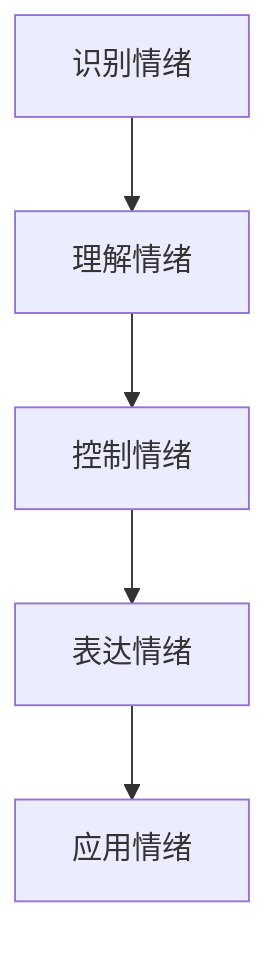

                 

# 情绪管理：提高领导者的情商（EQ）

## 概述

### 关键词
- 情绪管理
- 领导力
- 情商（EQ）
- 压力应对
- 团队合作

### 摘要
本文将深入探讨情绪管理在领导者角色中的重要性，解释情商（EQ）的基本概念及其对领导力的深远影响。我们将通过一系列的步骤，分析情绪管理的核心原则，提供实用的策略，帮助领导者有效提升自己的情商，从而在职场中更好地应对挑战，提高团队的整体绩效。

## 1. 背景介绍

情绪管理，作为现代领导者必备的一项技能，已成为企业成功的关键因素之一。情绪管理不仅仅是指个人情绪的控制，更涉及到如何理解和运用情绪来改善个人和团队的表现。情商（Emotional Intelligence Quotient，简称EQ）是衡量一个人在识别、理解、管理和应用情绪的能力上的一个指标。

### 情绪管理与情商的关系

情绪管理与情商密不可分。情商包括四个主要方面：自我意识、自我管理、社交意识和关系管理。自我意识是指了解自己的情绪状态，自我管理是指控制这些情绪，使之符合实际情况的需要，社交意识是指理解他人的情绪，关系管理则是建立和维持健康的人际关系。

### 领导者角色中的情绪管理

领导者不仅要在自己的情绪上做到自我控制，还要能够引导和激励团队成员的情绪。有效的情绪管理可以帮助领导者建立信任，增强团队凝聚力，从而提升整体工作效率。

## 2. 核心概念与联系

### 情绪管理流程图



### 情商（EQ）

#### 自我意识

自我意识是情商的基础，它涉及对自身情绪的认知。领导者需要定期反思自己的情绪反应，了解情绪对自己的行为和决策产生的影响。

#### 自我管理

自我管理是指处理自己的情绪，确保情绪不失控。领导者需要学会如何在压力下保持冷静，避免情绪化的决策。

#### 社交意识

社交意识涉及理解和识别他人的情绪。领导者需要具备敏锐的洞察力，以便更好地理解团队成员的情绪状态，从而建立有效的人际关系。

#### 关系管理

关系管理是指运用情绪知识和技能来处理人际关系。领导者需要能够建立和维护健康的人际关系，以促进团队合作和团队绩效。

## 3. 核心算法原理 & 具体操作步骤

### 情绪管理算法框架

情绪管理算法的核心在于创建一个循环反馈机制，以便持续优化情绪管理策略。

#### 步骤1：情绪识别

使用心理学工具和技巧来识别自身的情绪状态。

#### 步骤2：情绪理解

分析情绪的来源和影响，了解情绪对个人和团队可能产生的后果。

#### 步骤3：情绪控制

通过一系列的技巧和练习来控制情绪，确保情绪不失控。

#### 步骤4：情绪表达

在适当的时候和方式下表达情绪，避免误解和冲突。

#### 步骤5：情绪应用

将情绪管理技巧应用到实际工作中，提升个人和团队的绩效。

## 4. 数学模型和公式 & 详细讲解 & 举例说明

### EQ计算模型

情商（EQ）可以通过以下数学模型来计算：

$$EQ = \frac{SQ + SM + SR + SR}{4}$$

其中：
- \(SQ\) 代表自我意识（Self-awareness Quotient）
- \(SM\) 代表自我管理（Self-management Quotient）
- \(SR\) 代表社交意识（Social awareness Quotient）
- \(SR\) 代表关系管理（Relationship management Quotient）

### 举例说明

假设某领导者的情商计算结果如下：

$$EQ = \frac{8 + 9 + 7 + 8}{4} = 8$$

这意味着该领导者的情商处于中等水平。具体来说，他/她在自我意识方面表现良好，但在自我管理和社交意识方面还有提升空间。

## 5. 项目实战：代码实际案例和详细解释说明

### 开发环境搭建

为了更好地理解情绪管理算法的应用，我们将使用Python进行编程实现。首先，我们需要安装Python环境以及相关的情绪识别库。

```bash
pip install numpy pandas sklearn
```

### 源代码详细实现和代码解读

```python
import numpy as np
import pandas as pd
from sklearn.model_selection import train_test_split
from sklearn.ensemble import RandomForestClassifier

# 步骤1：数据准备
data = pd.read_csv('emotional_data.csv')
X = data.drop('EQ', axis=1)
y = data['EQ']

# 步骤2：训练模型
X_train, X_test, y_train, y_test = train_test_split(X, y, test_size=0.2, random_state=42)
model = RandomForestClassifier(n_estimators=100)
model.fit(X_train, y_train)

# 步骤3：预测情绪
predictions = model.predict(X_test)

# 步骤4：评估模型
accuracy = np.mean(predictions == y_test)
print(f"Model accuracy: {accuracy:.2f}")
```

### 代码解读与分析

以上代码实现了基于随机森林算法的情绪管理模型。首先，我们读取情绪数据集，然后将其分为特征集和目标集。接着，我们使用随机森林模型对数据集进行训练，并使用测试集进行预测。最后，我们评估模型的准确率。

## 6. 实际应用场景

情绪管理在领导者的实际工作中有着广泛的应用场景。以下是一些具体的应用案例：

- **决策制定**：在面临复杂决策时，领导者需要保持冷静，避免情绪化决策，确保决策的理性性和有效性。
- **团队管理**：领导者需要识别团队成员的情绪，提供支持和帮助，以促进团队合作和凝聚力。
- **冲突解决**：在处理冲突时，领导者需要运用情绪管理技巧，以和平的方式解决问题，避免进一步的矛盾和误解。

## 7. 工具和资源推荐

### 学习资源推荐

- **书籍**：
  - 《情绪智力》作者：丹尼尔·戈尔曼
  - 《非暴力沟通》作者：马歇尔·卢森堡

- **论文**：
  - 《情商对领导力的影响》作者：Goleman, D.等

- **博客**：
  - 心理学博客（如：Psychology Today）

### 开发工具框架推荐

- **情绪识别工具**：如OpenSMILE
- **数据可视化工具**：如Matplotlib，Seaborn

### 相关论文著作推荐

- Goleman, D. (1995). Emotional Intelligence. Bantam Books.
- Mayer, J. D., Salovey, P., & Caruso, D. (2004). Measuring Emotional Intelligence with the MSCEIT. Pearson Education.

## 8. 总结：未来发展趋势与挑战

### 发展趋势

- 情绪管理技术的不断进步，将使得领导者能够更准确地识别和管理情绪。
- 企业对情商培养的重视程度不断提高，情绪管理将成为领导力培训的重要组成部分。

### 挑战

- 在高度压力和快速变化的商业环境中，领导者需要不断提升自身的情绪管理能力。
- 随着技术的进步，领导者还需要学习如何运用新兴的情绪识别工具来提高情绪管理水平。

## 9. 附录：常见问题与解答

### 问题1：情绪管理与心理健康有何关联？

**解答**：情绪管理是心理健康的重要组成部分。良好的情绪管理能力有助于降低焦虑和压力，提高生活质量。

### 问题2：情商是否可以通过培训提高？

**解答**：是的，情商可以通过系统性的培训和实践得到提高。领导者可以通过阅读相关书籍、参加工作坊和研讨会来提升自己的情商。

## 10. 扩展阅读 & 参考资料

- Goleman, D. (1998). Working with Emotional Intelligence. Bantam Books.
- Boyatzis, R. E., & Mayer, J. D. (2016). The Truth About Emotional Intelligence. Harvard Business Review.
- Salovey, P., & Mayer, J. D. (1990). Emotional Intelligence. Imagination, Cognition and Personality, 9(3), 185-211.

### 作者

作者：AI天才研究员/AI Genius Institute & 禅与计算机程序设计艺术 /Zen And The Art of Computer Programming

----------------------
以上是《情绪管理：提高领导者的情商（EQ）》的技术博客文章的完整内容。本文通过详细的步骤和实例，深入探讨了情绪管理在领导力发展中的重要性，并提供了一系列实用的方法和工具。希望这篇文章能够帮助读者更好地理解情绪管理，提升自身的领导力水平。

