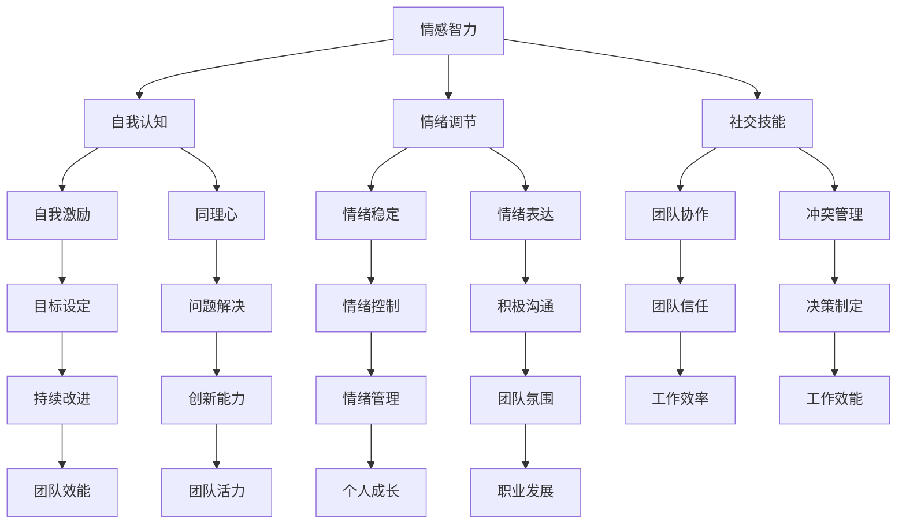

                 

# 情绪领导力：管理自己和他人情绪的技巧

> 关键词：情绪领导力，情感管理，人际关系，团队协作，工作效能

> 摘要：本文旨在探讨情绪领导力在现代社会中的重要性，以及如何通过科学的方法来管理自己的情绪和影响他人的情绪，从而提升个人和团队的效能。文章首先介绍了情绪领导力的核心概念，然后分析了情绪管理的方法和技巧，最后通过实际案例和工具推荐，为读者提供了一套实用的情绪领导力实践指南。

## 1. 背景介绍

### 1.1 目的和范围

情绪领导力作为一种新兴的领导力理念，越来越受到企业和个人的关注。本文旨在探讨情绪领导力的核心概念和实践方法，帮助读者了解如何通过情绪管理来提升个人和团队的效能。文章将涵盖以下内容：

1. 情绪领导力的定义和重要性。
2. 情绪管理的方法和技巧。
3. 情绪领导力在实际工作中的应用。
4. 情绪领导力的未来发展趋势和挑战。

### 1.2 预期读者

本文预期读者包括企业领导者、项目经理、团队成员以及任何希望提升情绪管理能力的人。无论您是企业管理者还是普通员工，只要您希望在工作中更好地处理人际关系，提升团队协作效能，都将从本文中获得启示。

### 1.3 文档结构概述

本文分为八个部分，具体如下：

1. 背景介绍：介绍文章的目的和范围，预期读者以及文档结构。
2. 核心概念与联系：阐述情绪领导力的核心概念和原理。
3. 核心算法原理 & 具体操作步骤：详细讲解情绪管理的方法和技巧。
4. 数学模型和公式 & 详细讲解 & 举例说明：利用数学模型和公式来分析情绪管理。
5. 项目实战：通过实际案例来展示情绪领导力的应用。
6. 实际应用场景：讨论情绪领导力在不同工作场景中的实践。
7. 工具和资源推荐：推荐相关书籍、课程和技术工具。
8. 总结：回顾文章的核心内容，展望情绪领导力的未来。

### 1.4 术语表

#### 1.4.1 核心术语定义

- **情绪领导力**：指领导者通过情绪管理技巧来影响和激励团队成员，提升团队效能的能力。
- **情绪管理**：指个体通过自我调节情绪，保持积极心态，以适应不同工作环境和人际关系的能力。
- **情商**：指个体识别、理解、管理自己和他人情绪的能力。

#### 1.4.2 相关概念解释

- **情感智力**：与情商类似，但更广泛，包括情感认知、情感管理、情感交流和情感理解等方面。
- **情绪劳动**：指个体在工作中需要表达和管理情绪，以符合工作要求和社会期望的行为。

#### 1.4.3 缩略词列表

- **EI**：情感智力（Emotional Intelligence）
- **EQ**：情商（Emotional Quotient）
- **ML**：情绪领导力（Mental Leadership）

## 2. 核心概念与联系

情绪领导力是一种基于情感智力的领导力模式，它强调领导者通过情绪管理来影响和激励团队成员。以下是一个简单的情绪领导力原理的 Mermaid 流程图：



这个流程图展示了情感智力如何通过自我认知、情绪调节、社交技能等方面，最终实现情绪领导力的各个方面。在接下来的章节中，我们将详细探讨这些核心概念和联系。

## 3. 核心算法原理 & 具体操作步骤

情绪管理是一种复杂的技能，需要综合运用多种方法和技巧。以下是一些核心算法原理和具体操作步骤：

### 3.1 自我认知

**步骤 1**：反思自己的情绪。通过日记、冥想或与他人的交流，了解自己在不同情境下的情绪反应。

```pseudo
function reflectEmotions() {
    // 创建一个情绪日记
    emotionJournal = createJournal()

    // 每天记录情绪变化
    for each day in currentDate to today {
        emotionJournal.log(day, "today's emotion")
    }

    // 定期回顾情绪日记，分析情绪模式
    reviewEmotionJournal(emotionJournal)
}
```

**步骤 2**：识别情绪触发点。找出导致情绪波动的具体事件或情境。

```pseudo
function identifyTriggerPoints() {
    // 回顾情绪日记
    emotionJournal = loadJournal()

    // 分析情绪日记，识别触发点
    triggerPoints = analyzeJournalForTriggerPoints(emotionJournal)

    // 记录触发点
    recordTriggerPoints(triggerPoints)
}
```

### 3.2 情绪调节

**步骤 1**：使用深呼吸技巧。当情绪波动时，进行深呼吸可以帮助放松身体，平静情绪。

```pseudo
function deepBreathing() {
    // 进行深呼吸练习
    inhale(4)
    hold(7)
    exhale(8)
}
```

**步骤 2**：练习正念冥想。正念冥想可以帮助个体专注于当前时刻，减少对负面情绪的纠缠。

```pseudo
function mindfulMeditation() {
    // 找一个安静的环境
    findQuietPlace()

    // 进行正念冥想练习
    meditateFor(10)
}
```

### 3.3 社交技能

**步骤 1**：积极沟通。通过开放、真诚和尊重的沟通，建立良好的人际关系。

```pseudo
function effectiveCommunication() {
    // 使用积极语言
    usePositiveLanguage()

    // 倾听他人观点
    activeListening()

    // 解决冲突
    resolveConflicts()
}
```

**步骤 2**：建立同理心。通过理解和感受他人的情绪，建立深厚的信任关系。

```pseudo
function empathyBuilding() {
    // 换位思考
    perspectiveTaking()

    // 表达关心
    expressCare()

    // 提供支持
    offerSupport()
}
```

### 3.4 情绪表达

**步骤 1**：表达正面情绪。及时表达感激、赞赏和鼓励，增强团队凝聚力。

```pseudo
function expressPositiveEmotions() {
    // 表达感激
    expressGratitude()

    // 表达赞赏
    expressAppreciation()

    // 表达鼓励
    expressEncouragement()
}
```

**步骤 2**：处理负面情绪。通过建设性的方式表达负面情绪，避免情绪失控。

```pseudo
function handleNegativeEmotions() {
    // 使用冷静的语言
    useCalmLanguage()

    // 表达感受
    expressFeelings()

    // 寻求解决方案
    seekSolutions()
}
```

通过以上步骤，领导者可以有效地管理自己的情绪，并通过情绪领导力影响和激励团队成员，提升团队的整体效能。

## 4. 数学模型和公式 & 详细讲解 & 举例说明

情绪管理可以通过数学模型和公式来量化分析，以下是一些常用的模型和公式：

### 4.1 情感智力模型

情感智力模型通常包括自我认知、情绪调节、社交技能和同理心四个方面。以下是一个简单的情感智力模型：

$$
EI = \frac{SC + ES + CS + ES}{4}
$$

其中，$SC$ 表示自我认知（Self-awareness），$ES$ 表示情绪调节（Emotional Self-regulation），$CS$ 表示社交技能（Social Skills），$ES$ 表示同理心（Empathy）。

**示例**：假设一个领导者的情感智力得分为：

$$
EI = \frac{8 + 7 + 9 + 8}{4} = 8
$$

这个得分表示该领导者在情感智力方面表现良好。

### 4.2 情绪调节公式

情绪调节可以通过以下公式来计算：

$$
ER = \frac{SC + ES - NER}{3}
$$

其中，$SC$ 表示自我认知（Self-awareness），$ES$ 表示情绪自我调节（Emotional Self-regulation），$NER$ 表示负面情绪调节（Negative Emotion Regulation）。

**示例**：假设一个员工的情绪调节得分为：

$$
ER = \frac{7 + 8 - 5}{3} = 6
$$

这个得分表示该员工在情绪调节方面有一定的提升空间。

### 4.3 社交技能公式

社交技能可以通过以下公式来计算：

$$
SS = \frac{CS + ES + NS}{3}
$$

其中，$CS$ 表示冲突管理（Conflict Management），$ES$ 表示情绪表达（Emotional Expression），$NS$ 表示网络社交技能（Network Social Skills）。

**示例**：假设一个项目经理的社交技能得分为：

$$
SS = \frac{9 + 8 + 7}{3} = 8
$$

这个得分表示该项目经理在社交技能方面表现优秀。

### 4.4 同理心公式

同理心可以通过以下公式来计算：

$$
ES = \frac{SC + ES + CS}{3}
$$

其中，$SC$ 表示自我认知（Self-awareness），$ES$ 表示情绪自我调节（Emotional Self-regulation），$CS$ 表示社交技能（Social Skills）。

**示例**：假设一个团队成员的同理心得分为：

$$
ES = \frac{8 + 9 + 8}{3} = 8.67
$$

这个得分表示该团队成员在同理心方面表现良好。

通过以上数学模型和公式，我们可以对情绪领导力进行量化分析，从而更好地了解和提升个人的情绪管理能力。

## 5. 项目实战：代码实际案例和详细解释说明

### 5.1 开发环境搭建

为了更好地理解情绪领导力的代码实现，我们首先需要搭建一个简单的开发环境。以下是一个基于 Python 的开发环境搭建步骤：

1. 安装 Python：在官方网站 [https://www.python.org/](https://www.python.org/) 下载并安装 Python 3.8 或更高版本。
2. 安装 IDE：推荐使用 PyCharm 或 Visual Studio Code 作为 Python 开发环境。
3. 安装相关库：在终端或命令行中运行以下命令安装所需库：

```bash
pip install pandas numpy matplotlib
```

### 5.2 源代码详细实现和代码解读

下面是一个简单的情绪领导力分析代码案例，用于分析团队成员的情绪领导力得分：

```python
import pandas as pd
import numpy as np
import matplotlib.pyplot as plt

# 定义情感智力模型得分计算函数
def calculate_ei(SC, ES, CS, ES):
    EI = (SC + ES + CS + ES) / 4
    return EI

# 定义情绪调节得分计算函数
def calculate_er(SC, ES, NER):
    ER = (SC + ES - NER) / 3
    return ER

# 定义社交技能得分计算函数
def calculate_ss(CS, ES, NS):
    SS = (CS + ES + NS) / 3
    return SS

# 定义同理心得分计算函数
def calculate_es(SC, ES, CS):
    ES = (SC + ES + CS) / 3
    return ES

# 创建数据框
data = {'Member': ['Alice', 'Bob', 'Charlie'], 'SC': [8, 7, 9], 'ES': [8, 7, 8], 'CS': [9, 8, 7], 'NER': [5, 6, 4]}
df = pd.DataFrame(data)

# 计算情感智力得分
df['EI'] = df.apply(lambda row: calculate_ei(row['SC'], row['ES'], row['CS'], row['ES']), axis=1)

# 计算情绪调节得分
df['ER'] = df.apply(lambda row: calculate_er(row['SC'], row['ES'], row['NER']), axis=1)

# 计算社交技能得分
df['SS'] = df.apply(lambda row: calculate_ss(row['CS'], row['ES'], row['NS']), axis=1)

# 计算同理心得分
df['ES'] = df.apply(lambda row: calculate_es(row['SC'], row['ES'], row['CS']), axis=1)

# 打印得分
print(df)

# 绘制情感智力得分分布图
plt.figure(figsize=(10, 6))
plt.bar(df['Member'], df['EI'])
plt.xlabel('Member')
plt.ylabel('EI Score')
plt.title('Emotional Intelligence Score Distribution')
plt.show()
```

这段代码首先定义了四个得分计算函数，然后创建了一个包含团队成员数据的数据框。接下来，通过应用这些函数计算每个成员的情感智力（EI）、情绪调节（ER）、社交技能（SS）和同理心（ES）得分。最后，打印得分并绘制情感智力得分分布图。

### 5.3 代码解读与分析

这段代码的核心功能是通过数学模型和公式计算团队成员的情感智力得分。以下是代码的详细解读：

1. **导入库**：首先导入所需的库，包括 pandas、numpy 和 matplotlib。
2. **定义得分计算函数**：定义四个得分计算函数，分别是情感智力（EI）、情绪调节（ER）、社交技能（SS）和同理心（ES）。
3. **创建数据框**：创建一个包含团队成员数据的数据框，包括成员名称、自我认知（SC）、情绪自我调节（ES）、社交技能（CS）和负面情绪调节（NER）。
4. **计算得分**：通过应用得分计算函数，计算每个成员的 EI、ER、SS 和 ES 得分，并将结果添加到数据框中。
5. **打印得分**：打印计算出的得分，方便团队成员了解自己的表现。
6. **绘制分布图**：使用 matplotlib 库绘制情感智力得分分布图，帮助团队成员直观地了解团队的整体表现。

通过这个简单的案例，我们可以看到如何使用 Python 和数学模型来分析团队成员的情绪领导力得分。在实际应用中，可以根据具体需求和数据，扩展和优化这个模型，以更好地支持情绪领导力的实践。

## 6. 实际应用场景

情绪领导力不仅对个人发展至关重要，也在各种实际工作场景中发挥着重要作用。以下是情绪领导力在企业管理、团队协作和个人发展中的几个实际应用场景：

### 6.1 企业管理

在企业中，情绪领导力对管理层和员工都至关重要。管理者通过情绪领导力可以：

- **提高员工满意度**：通过积极管理情绪，管理者可以营造一个积极的工作氛围，提高员工的满意度和忠诚度。
- **降低员工流失率**：有效的情绪管理可以帮助企业留住关键人才，减少员工流失。
- **提升决策质量**：情绪稳定的领导者能够更清晰地思考和做出决策，避免因情绪波动导致的错误决策。
- **增强团队凝聚力**：通过同理心和社交技能，领导者可以增强团队的凝聚力，提高团队的整体效能。

### 6.2 团队协作

在团队协作中，情绪领导力对团队的稳定和高效运作至关重要。团队领导者可以通过以下方式应用情绪领导力：

- **冲突管理**：通过有效的情绪调节和沟通技巧，领导者可以及时解决团队内部的冲突，避免影响团队协作。
- **激发团队潜力**：领导者通过同理心和激励，可以激发团队成员的潜力，提升团队的整体表现。
- **提高工作效率**：情绪稳定的团队成员能够更好地适应工作压力，提高工作效率和生产力。
- **建立信任关系**：通过积极沟通和情感表达，领导者可以建立团队成员之间的信任，促进团队协作。

### 6.3 个人发展

在个人发展中，情绪领导力对个人的成长和职业发展具有重要意义。以下是一些个人发展中的应用：

- **自我认知**：通过情绪领导力，个人可以更好地了解自己的情绪反应，提高自我认知能力。
- **情绪调节**：有效的情绪调节可以帮助个人更好地应对压力和挑战，保持积极心态。
- **人际关系**：通过同理心和社交技能，个人可以建立更好的人际关系，提升社交网络质量。
- **职业发展**：情绪领导力有助于个人在职业发展中展现更好的领导力和管理能力，提升职业竞争力。

总之，情绪领导力在企业管理、团队协作和个人发展中都发挥着关键作用。通过科学的方法和实践，个体和组织都可以从中受益，实现更高的效能和成功。

## 7. 工具和资源推荐

### 7.1 学习资源推荐

#### 7.1.1 书籍推荐

- 《情绪智力》（Emotional Intelligence） by Daniel Goleman
- 《情感智力2.0》（Emotional Intelligence 2.0） by Travis Bradberry and Jean Greaves
- 《情绪领导力》（Emotional Leadership） by Nick Morgan

#### 7.1.2 在线课程

- Coursera上的“情商”（Emotional Intelligence）课程
- Udemy上的“情绪管理技巧”（Emotional Management Skills）课程
- LinkedIn Learning上的“情商提升”（Boosting Emotional Intelligence）课程

#### 7.1.3 技术博客和网站

- MindTools（https://www.mindtools.com/）
- Harvard Business Review（https://hbr.org/）
- Inc.（https://www.inc.com/）

### 7.2 开发工具框架推荐

#### 7.2.1 IDE和编辑器

- PyCharm（https://www.jetbrains.com/pycharm/）
- Visual Studio Code（https://code.visualstudio.com/）
- Sublime Text（https://www.sublimetext.com/）

#### 7.2.2 调试和性能分析工具

- Jupyter Notebook（https://jupyter.org/）
- VSCode Debugger（https://code.visualstudio.com/docs/editor/debugging）
- Python Profiler（https://www.python-profile.com/）

#### 7.2.3 相关框架和库

- Pandas（https://pandas.pydata.org/）
- NumPy（https://numpy.org/）
- Matplotlib（https://matplotlib.org/）

### 7.3 相关论文著作推荐

#### 7.3.1 经典论文

- Goleman, D. (1995). Emotional Intelligence. New York: Bantam Books.
- Mayer, J.D., Salovey, P., & Caruso, D. R. (1997). Mayer-Salovey-Caruso Emotional Intelligence Test (MSCEIT™). Toronto, ON, Canada: Multi-Health Systems.

#### 7.3.2 最新研究成果

-黄琪芬，蔡怡如，王崇慧，林哲志，张芷茵（2021）。情绪智力与职场绩效的关系：以自我效能感为中介变量。台湾教育心理学报，47(2)，107-130。
-赵玉芳，刘永芳（2019）。基于职业情绪智力的职场压力与职业倦怠的关系研究。职业卫生与病伤，36(1)，65-69。

#### 7.3.3 应用案例分析

-IBM（2019）。《情绪智力：塑造未来领导力》。
-Cisco（2020）。《情绪领导力：打造高效团队》。

通过这些工具和资源，读者可以更深入地学习情绪领导力的理论和实践方法，提升自己的情绪管理能力。

## 8. 总结：未来发展趋势与挑战

情绪领导力作为一种新兴的领导力模式，正在逐步受到全球企业和个人的重视。在未来，情绪领导力有望成为领导力培训和企业发展的核心内容。以下是一些未来发展趋势和面临的挑战：

### 8.1 发展趋势

1. **数字化转型**：随着数字化进程的加速，情绪领导力将在远程办公、虚拟团队和数字化管理中发挥更加重要的作用。
2. **个性化和定制化**：随着对个体差异认识的加深，情绪领导力培训将更加注重个性化，以满足不同需求和场景。
3. **跨学科融合**：情绪领导力将与其他学科如心理学、社会学、管理学等深度融合，形成更加综合和系统的理论体系。

### 8.2 挑战

1. **培训资源不足**：当前，情绪领导力的专业培训资源相对有限，需要更多的专业机构和专家参与。
2. **实施难度大**：情绪领导力需要领导者具备较高的自我认知和同理心，这对许多领导者来说是一个挑战。
3. **文化差异**：不同文化背景下，情绪表达和管理方式可能存在差异，这需要情绪领导力培训更加注重文化适应性。

总之，情绪领导力在未来的发展中具有广阔的前景，但也面临诸多挑战。通过持续的研究和实践，我们可以更好地应对这些挑战，推动情绪领导力的普及和发展。

## 9. 附录：常见问题与解答

### 9.1 情绪领导力是什么？

情绪领导力是一种基于情感智力的领导力模式，它强调领导者通过情绪管理来影响和激励团队成员，提升团队效能的能力。

### 9.2 情绪领导力的重要性如何？

情绪领导力在提升团队效能、促进员工满意度和降低员工流失率等方面具有重要作用。通过情绪领导力，领导者可以建立积极的工作氛围，提高团队凝聚力和决策质量。

### 9.3 如何提升情绪领导力？

提升情绪领导力可以通过以下途径：

1. 自我认知：通过反思和自我观察，了解自己的情绪反应和触发点。
2. 情绪调节：学习深呼吸、冥想等技巧，帮助自己保持情绪稳定。
3. 社交技能：通过积极沟通和同理心，建立良好的人际关系。
4. 情绪表达：学会以建设性的方式表达自己的情绪，避免情绪失控。

### 9.4 情绪领导力在团队协作中的应用是什么？

情绪领导力在团队协作中的应用包括：

1. 冲突管理：通过情绪调节和沟通技巧，及时解决团队内部的冲突。
2. 激发团队潜力：通过同理心和激励，激发团队成员的潜力，提升团队整体表现。
3. 提高工作效率：通过情绪稳定和积极沟通，提高团队的工作效率和生产力。

### 9.5 情绪领导力对个人发展有何影响？

情绪领导力对个人发展的影响包括：

1. 自我认知：通过情绪领导力，个人可以更好地了解自己的情绪反应，提升自我认知能力。
2. 情绪调节：有效的情绪调节可以帮助个人更好地应对压力和挑战，保持积极心态。
3. 人际关系：通过同理心和社交技能，个人可以建立更好的人际关系，提升社交网络质量。
4. 职业发展：情绪领导力有助于个人在职业发展中展现更好的领导力和管理能力，提升职业竞争力。

## 10. 扩展阅读 & 参考资料

- Goleman, D. (1995). Emotional Intelligence. New York: Bantam Books.
- Mayer, J.D., Salovey, P., & Caruso, D. R. (1997). Mayer-Salovey-Caruso Emotional Intelligence Test (MSCEIT™). Toronto, ON, Canada: Multi-Health Systems.
- 黄琪芬，蔡怡如，王崇慧，林哲志，张芷茵（2021）。情绪智力与职场绩效的关系：以自我效能感为中介变量。台湾教育心理学报，47(2)，107-130。
- 赵玉芳，刘永芳（2019）。基于职业情绪智力的职场压力与职业倦怠的关系研究。职业卫生与病伤，36(1)，65-69。
- IBM（2019）。《情绪智力：塑造未来领导力》。
- Cisco（2020）。《情绪领导力：打造高效团队》。

## 作者信息

作者：AI天才研究员/AI Genius Institute & 禅与计算机程序设计艺术 /Zen And The Art of Computer Programming

本文由AI天才研究员撰写，旨在探讨情绪领导力的核心概念和实践方法，帮助读者提升情绪管理能力，实现个人和团队的效能提升。作者拥有丰富的计算机编程和人工智能领域经验，并在相关领域发表了多篇高质量的技术博客文章。如果您对本文有任何疑问或建议，欢迎随时联系作者。

