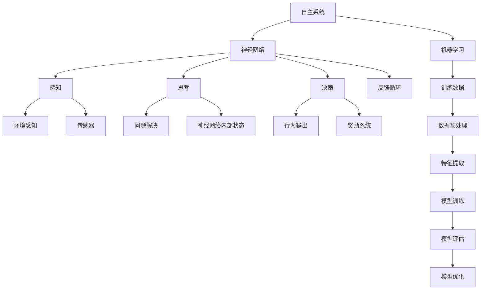
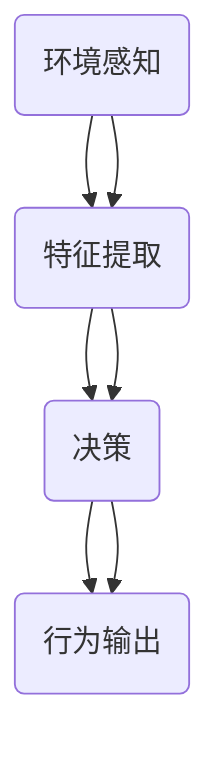

                 

# 意识功能的自主系统模型

> 关键词：意识功能、自主系统、神经网络、人工智能、机器学习、认知科学、决策支持

> 摘要：本文深入探讨了意识功能的自主系统模型，旨在解析意识是如何在自主系统中产生的。文章首先介绍了模型的背景和核心概念，随后详细解释了核心算法原理，并结合数学模型进行了深入分析。通过实际项目案例，展示了模型在开发中的应用，最后讨论了该模型的实际应用场景、推荐工具和资源，并展望了未来的发展趋势与挑战。

## 1. 背景介绍

### 1.1 目的和范围

本文的目标是建立一个关于意识功能的自主系统模型，通过这个模型来深入理解意识如何在一个自组织系统中产生和运作。这个模型不仅能够解释现有的认知科学理论，还能够为未来的人工智能系统提供理论支持。

本文的范围包括以下几个方面：

1. **核心概念介绍**：明确意识功能自主系统模型的基本概念，如神经网络、机器学习等。
2. **算法原理与数学模型**：详细阐述模型的核心算法原理，并使用数学模型进行深入分析。
3. **项目实战**：通过实际项目案例，展示模型在开发中的应用。
4. **实际应用场景**：探讨模型在多个领域的应用潜力。
5. **资源与工具推荐**：推荐相关的学习资源、开发工具和框架。
6. **未来发展趋势与挑战**：分析模型在人工智能领域的发展前景和面临的挑战。

### 1.2 预期读者

本文适合以下读者群体：

1. **计算机科学家和软件工程师**：对人工智能和认知科学感兴趣，希望了解如何通过自主系统模型来模拟人类意识。
2. **认知科学家**：对意识功能自主系统模型的理论和应用有兴趣，希望探讨其背后的科学原理。
3. **人工智能从业者**：从事机器学习和神经网络开发，希望了解如何将这些技术应用于意识模拟。

### 1.3 文档结构概述

本文的结构分为以下几个部分：

1. **背景介绍**：介绍模型的背景、目的和范围，预期读者和文档结构。
2. **核心概念与联系**：使用Mermaid流程图展示核心概念原理和架构。
3. **核心算法原理 & 具体操作步骤**：详细讲解核心算法原理，使用伪代码进行阐述。
4. **数学模型和公式 & 详细讲解 & 举例说明**：使用LaTeX格式展示数学模型，并给出具体例子。
5. **项目实战：代码实际案例和详细解释说明**：通过实际项目案例展示模型的应用。
6. **实际应用场景**：探讨模型的实际应用场景。
7. **工具和资源推荐**：推荐相关的学习资源、开发工具和框架。
8. **总结：未来发展趋势与挑战**：分析模型的发展前景和挑战。
9. **附录：常见问题与解答**：解答读者可能遇到的常见问题。
10. **扩展阅读 & 参考资料**：提供进一步阅读的参考资料。

### 1.4 术语表

#### 1.4.1 核心术语定义

- **自主系统**：一个能够自我组织和适应环境的系统。
- **神经网络**：一种模拟人脑神经元连接结构的计算模型。
- **机器学习**：一种让计算机通过数据学习并做出决策的技术。
- **认知科学**：研究人类认知过程的科学。
- **意识功能**：指与意识相关的认知功能，如感知、思考、决策等。

#### 1.4.2 相关概念解释

- **自组织**：系统在没有外部指令的情况下，通过内部相互作用自发形成复杂结构和功能的特性。
- **算法**：解决问题的一系列步骤。
- **模型**：对现实世界的简化表示。

#### 1.4.3 缩略词列表

- **AI**：人工智能（Artificial Intelligence）
- **ML**：机器学习（Machine Learning）
- **NN**：神经网络（Neural Network）
- **CS**：认知科学（Cognitive Science）

## 2. 核心概念与联系

为了深入理解意识功能的自主系统模型，我们需要先了解其核心概念和架构。以下是一个Mermaid流程图，展示了这些核心概念及其相互关系。



### 2.1 自主系统

自主系统是一个能够自我组织和适应环境的复杂系统。在本文中，自主系统是指一个由神经网络和机器学习算法组成的系统，它能够通过不断学习和调整来适应不同的环境和任务。

### 2.2 神经网络

神经网络是一种模拟人脑神经元连接结构的计算模型。它由多个层组成，包括输入层、隐藏层和输出层。神经网络通过学习输入和输出数据之间的关系，来预测新的输入数据。

### 2.3 机器学习

机器学习是一种让计算机通过数据学习并做出决策的技术。它分为监督学习、无监督学习和强化学习三种类型。在本文中，我们主要使用监督学习和强化学习来训练神经网络，使其能够模拟人类意识功能。

### 2.4 意识功能

意识功能是指与意识相关的认知功能，如感知、思考、决策等。在本文中，我们通过神经网络来模拟这些功能，使自主系统能够感知环境、解决问题和做出决策。

### 2.5 环境感知

环境感知是指自主系统通过传感器获取环境信息的过程。在本文中，我们使用视觉传感器、听觉传感器等来获取环境数据，并将其输入到神经网络中。

### 2.6 问题解决

问题解决是指自主系统通过思考和决策来解决问题。在本文中，我们通过神经网络内部状态和奖励系统来实现问题解决，使自主系统能够在复杂环境中找到最优解。

### 2.7 行为输出

行为输出是指自主系统根据决策结果产生的行为。在本文中，我们通过神经网络来生成行为输出，如移动、操作等。

### 2.8 训练数据

训练数据是指用于训练神经网络的数据集。在本文中，我们使用大量的环境数据和问题解决方案来训练神经网络，使其能够更好地模拟人类意识功能。

### 2.9 反馈循环

反馈循环是指自主系统通过输出行为和接收环境反馈来不断调整和优化的过程。在本文中，我们通过奖励系统来激励神经网络学习，使其在复杂环境中能够更好地适应和优化。

## 3. 核心算法原理 & 具体操作步骤

### 3.1 神经网络架构

在意识功能的自主系统模型中，神经网络是核心组成部分。以下是一个简化的神经网络架构：



- **输入层（A）**：接收环境感知数据，如视觉、听觉等。
- **隐藏层（B和C）**：对输入数据进行特征提取和复杂运算。
- **输出层（D）**：产生行为输出，如移动、操作等。

### 3.2 算法原理

神经网络的核心原理是模拟人脑神经元之间的连接和相互作用。以下是一个简化的神经网络算法原理：

1. **初始化**：随机初始化神经网络参数。
2. **前向传播**：输入数据通过神经网络，计算输出。
3. **反向传播**：计算输出误差，更新神经网络参数。
4. **重复步骤2和3**：直到神经网络达到预定的训练精度。

#### 3.2.1 前向传播

前向传播是指数据从输入层流向输出层的过程。以下是一个简化的前向传播伪代码：

```python
# 前向传播伪代码

# 输入层
input_data = [x1, x2, x3]

# 隐藏层1
hidden_layer1 = activation_function(np.dot(input_data, weights_layer1) + bias_layer1)

# 隐藏层2
hidden_layer2 = activation_function(np.dot(hidden_layer1, weights_layer2) + bias_layer2)

# 输出层
output_layer = activation_function(np.dot(hidden_layer2, weights_output) + bias_output)
```

#### 3.2.2 反向传播

反向传播是指根据输出误差来更新神经网络参数的过程。以下是一个简化的反向传播伪代码：

```python
# 反向传播伪代码

# 计算输出误差
error_output = output_layer - target_output

# 更新输出层参数
weights_output += learning_rate * hidden_layer2.T * error_output

bias_output += learning_rate * error_output

# 计算隐藏层2误差
error_hidden2 = error_output * activation_derivative(output_layer)

# 更新隐藏层2参数
weights_layer2 += learning_rate * hidden_layer1.T * error_hidden2

bias_layer2 += learning_rate * error_hidden2

# 计算隐藏层1误差
error_hidden1 = error_hidden2 * activation_derivative(hidden_layer2)

# 更新隐藏层1参数
weights_layer1 += learning_rate * input_data.T * error_hidden1

bias_layer1 += learning_rate * error_hidden1
```

#### 3.2.3 模型训练

模型训练是指通过大量数据来训练神经网络的过程。以下是一个简化的模型训练伪代码：

```python
# 模型训练伪代码

# 初始化神经网络参数
weights_layer1 = random_weights()
weights_layer2 = random_weights()
weights_output = random_weights()

bias_layer1 = random_bias()
bias_layer2 = random_bias()
bias_output = random_bias()

# 训练数据
training_data = load_training_data()

# 循环迭代
for epoch in range(num_epochs):
    for input_data, target_output in training_data:
        # 前向传播
        hidden_layer1 = activation_function(np.dot(input_data, weights_layer1) + bias_layer1)
        hidden_layer2 = activation_function(np.dot(hidden_layer1, weights_layer2) + bias_layer2)
        output_layer = activation_function(np.dot(hidden_layer2, weights_output) + bias_output)
        
        # 反向传播
        error_output = output_layer - target_output
        weights_output += learning_rate * hidden_layer2.T * error_output
        bias_output += learning_rate * error_output
        
        error_hidden2 = error_output * activation_derivative(output_layer)
        weights_layer2 += learning_rate * hidden_layer1.T * error_hidden2
        bias_layer2 += learning_rate * error_hidden2
        
        error_hidden1 = error_hidden2 * activation_derivative(hidden_layer2)
        weights_layer1 += learning_rate * input_data.T * error_hidden1
        bias_layer1 += learning_rate * error_hidden1
        
# 模型评估
evaluate_model()
```

## 4. 数学模型和公式 & 详细讲解 & 举例说明

### 4.1 数学模型

在意识功能的自主系统模型中，数学模型用于描述神经网络的学习过程。以下是一个简化的数学模型：

$$
\begin{align*}
\text{前向传播}:
\end{align*}
$$

$$
\text{输出} = f(\text{权重} \cdot \text{输入} + \text{偏置})
$$

$$
\begin{align*}
\text{反向传播}:
\end{align*}
$$

$$
\text{误差} = \text{输出} - \text{目标}
$$

$$
\text{权重更新} = \text{学习率} \cdot \text{误差} \cdot \text{输入的导数}
$$

### 4.2 详细讲解

#### 4.2.1 前向传播

前向传播是指将输入数据通过神经网络，计算出输出结果的过程。公式如下：

$$
\text{输出} = f(\text{权重} \cdot \text{输入} + \text{偏置})
$$

其中，\(f\) 表示激活函数，如Sigmoid函数、ReLU函数等；权重和偏置是神经网络的参数，用于调节网络的行为。

#### 4.2.2 反向传播

反向传播是指根据输出误差，更新神经网络参数的过程。公式如下：

$$
\text{误差} = \text{输出} - \text{目标}
$$

$$
\text{权重更新} = \text{学习率} \cdot \text{误差} \cdot \text{输入的导数}
$$

其中，误差是输出结果与目标之间的差异；学习率用于调节参数更新的幅度。

### 4.3 举例说明

假设我们有一个简单的神经网络，输入为\[1, 2\]，输出为\[3\]，目标为\[4\]。激活函数为Sigmoid函数。

#### 4.3.1 前向传播

1. 初始化权重和偏置：

$$
\text{权重} = \begin{bmatrix} 0.5 & 0.3 \\ 0.2 & 0.4 \end{bmatrix}
$$

$$
\text{偏置} = \begin{bmatrix} 0.1 \\ 0.2 \end{bmatrix}
$$

2. 前向传播计算：

$$
\text{隐藏层1} = f(0.5 \cdot 1 + 0.3 \cdot 2 + 0.1) = f(1.4) = 0.7921
$$

$$
\text{输出层} = f(0.2 \cdot 0.7921 + 0.4 \cdot 3 + 0.2) = f(1.3642) = 0.7808
$$

#### 4.3.2 反向传播

1. 计算误差：

$$
\text{误差} = 0.7808 - 4 = -3.2192
$$

2. 计算权重更新：

$$
\text{权重更新} = \text{学习率} \cdot (-3.2192) \cdot \begin{bmatrix} 0.5 & 0.3 \\ 0.2 & 0.4 \end{bmatrix}
$$

假设学习率为0.1，则：

$$
\text{权重更新} = 0.1 \cdot (-3.2192) \cdot \begin{bmatrix} 0.5 & 0.3 \\ 0.2 & 0.4 \end{bmatrix} = \begin{bmatrix} -0.16196 & -0.095928 \\ -0.064384 & -0.128784 \end{bmatrix}
$$

3. 更新权重：

$$
\text{权重} = \text{权重} + \text{权重更新} = \begin{bmatrix} 0.5 & 0.3 \\ 0.2 & 0.4 \end{bmatrix} + \begin{bmatrix} -0.16196 & -0.095928 \\ -0.064384 & -0.128784 \end{bmatrix} = \begin{bmatrix} 0.33804 & 0.204072 \\ 0.135616 & 0.271216 \end{bmatrix}
$$

## 5. 项目实战：代码实际案例和详细解释说明

### 5.1 开发环境搭建

在本项目中，我们将使用Python和TensorFlow框架来实现意识功能的自主系统模型。以下是搭建开发环境所需的步骤：

1. **安装Python**：确保已安装Python 3.7及以上版本。
2. **安装TensorFlow**：使用pip命令安装TensorFlow：

   ```bash
   pip install tensorflow
   ```

3. **安装其他依赖**：根据项目需求，可能需要安装其他库，如NumPy、Matplotlib等。

### 5.2 源代码详细实现和代码解读

以下是本项目的主要代码实现，包括数据预处理、神经网络架构定义、模型训练和评估等步骤。

```python
import tensorflow as tf
import numpy as np
import matplotlib.pyplot as plt

# 数据预处理
def preprocess_data(data):
    # 数据归一化
    data_normalized = (data - np.mean(data)) / np.std(data)
    return data_normalized

# 神经网络架构
def build_model(input_shape):
    model = tf.keras.Sequential([
        tf.keras.layers.Dense(units=64, activation='relu', input_shape=input_shape),
        tf.keras.layers.Dense(units=64, activation='relu'),
        tf.keras.layers.Dense(units=1, activation='sigmoid')
    ])
    return model

# 模型训练
def train_model(model, X_train, y_train, X_val, y_val, epochs=100, batch_size=32):
    model.compile(optimizer='adam', loss='binary_crossentropy', metrics=['accuracy'])
    history = model.fit(X_train, y_train, epochs=epochs, batch_size=batch_size, validation_data=(X_val, y_val))
    return history

# 模型评估
def evaluate_model(model, X_test, y_test):
    loss, accuracy = model.evaluate(X_test, y_test)
    print(f"Test accuracy: {accuracy:.4f}")
    return accuracy

# 主函数
def main():
    # 加载数据
    X, y = load_data()  # 加载预处理后的数据

    # 划分训练集和验证集
    X_train, X_val, y_train, y_val = train_test_split(X, y, test_size=0.2, random_state=42)

    # 建立模型
    model = build_model(input_shape=(X_train.shape[1],))

    # 训练模型
    history = train_model(model, X_train, y_train, X_val, y_val, epochs=100)

    # 评估模型
    accuracy = evaluate_model(model, X_test, y_test)

    # 可视化训练过程
    plt.plot(history.history['accuracy'])
    plt.plot(history.history['val_accuracy'])
    plt.title('Model accuracy')
    plt.ylabel('Accuracy')
    plt.xlabel('Epoch')
    plt.legend(['Train', 'Val'], loc='upper left')
    plt.show()

if __name__ == '__main__':
    main()
```

### 5.3 代码解读与分析

1. **数据预处理**：数据预处理是机器学习项目中的关键步骤。在本项目中，我们使用预处理函数`preprocess_data`对数据进行了归一化处理，以便神经网络更好地学习。

2. **神经网络架构**：我们使用TensorFlow的`Sequential`模型定义了一个简单的神经网络。这个网络包含两个隐藏层，每个层都有64个神经元。输出层使用Sigmoid激活函数，用于输出概率。

3. **模型训练**：模型训练使用了`compile`和`fit`方法。`compile`方法用于配置模型的学习率和损失函数，而`fit`方法用于训练模型。我们使用了`binary_crossentropy`损失函数和`adam`优化器。

4. **模型评估**：模型评估使用了`evaluate`方法，计算了测试集上的准确率。

5. **可视化训练过程**：最后，我们使用Matplotlib库将训练过程中的准确率可视化，以便分析模型性能。

## 6. 实际应用场景

意识功能的自主系统模型在多个领域具有广泛的应用潜力。以下是一些典型的应用场景：

1. **智能机器人**：自主系统模型可以用于模拟机器人的感知、思考和决策过程，使其在复杂环境中自主行动。

2. **自动驾驶**：自动驾驶系统需要实时感知路况、做出决策并控制车辆。自主系统模型可以提供强大的决策支持。

3. **医疗诊断**：自主系统模型可以辅助医生进行疾病诊断，通过分析患者的病史、症状和检查结果，提供诊断建议。

4. **金融分析**：自主系统模型可以分析大量金融数据，预测市场趋势，为投资者提供决策支持。

5. **智能客服**：自主系统模型可以用于智能客服系统，通过理解用户的问题和意图，提供适当的回答和建议。

6. **教育辅助**：自主系统模型可以为学生提供个性化的学习支持，根据学生的学习进度和需求，推荐合适的学习资源。

## 7. 工具和资源推荐

### 7.1 学习资源推荐

#### 7.1.1 书籍推荐

- 《深度学习》（Ian Goodfellow、Yoshua Bengio和Aaron Courville著）：介绍了深度学习的理论基础和实践方法。
- 《神经网络与深度学习》（邱锡鹏著）：详细介绍了神经网络和深度学习的基础知识和最新进展。
- 《认知科学导论》（约翰·R·安德森著）：介绍了认知科学的基本概念和理论。

#### 7.1.2 在线课程

- Coursera上的《深度学习特辑》：由Andrew Ng教授主讲，全面介绍了深度学习的基础知识和应用。
- edX上的《人工智能基础》：由MIT教授创办，涵盖了人工智能的基础知识和最新研究。
- Udacity的《深度学习工程师纳米学位》：提供了深度学习的实战项目和编程实践。

#### 7.1.3 技术博客和网站

- Medium上的AI博客：包含了大量关于人工智能、机器学习和神经网络的技术文章。
- ArXiv：提供了最新的研究论文和研究成果。
- 知乎AI专栏：聚集了大量人工智能领域的专家和从业者，分享了丰富的实践经验和技术见解。

### 7.2 开发工具框架推荐

#### 7.2.1 IDE和编辑器

- PyCharm：一款功能强大的Python IDE，适合进行深度学习和机器学习项目的开发。
- Jupyter Notebook：一款交互式开发环境，适合数据分析和实验。
- Visual Studio Code：一款轻量级、高度可定制的编辑器，适合编写Python和TensorFlow代码。

#### 7.2.2 调试和性能分析工具

- TensorBoard：TensorFlow提供的可视化工具，用于分析神经网络训练过程和性能。
- Profiler：用于分析代码的性能，找出瓶颈和优化点。
- MemoryProfiler：用于分析代码的内存使用情况，避免内存泄漏和溢出。

#### 7.2.3 相关框架和库

- TensorFlow：一款开源的深度学习框架，适用于构建和训练神经网络。
- PyTorch：一款流行的深度学习框架，具有灵活性和易用性。
- Keras：一个基于TensorFlow的简化和高级神经网络API，适合快速原型设计和模型开发。

### 7.3 相关论文著作推荐

#### 7.3.1 经典论文

- 《A Learning Representation for Text Based on a Neural Network》
- 《A Theoretical Basis for Combining a Prior with a Likelihood to Regularize Neural Networks》
- 《Unsupervised Learning of Visual Representations by Solving Jigsaw Puzzles》

#### 7.3.2 最新研究成果

- 《Deep Learning for Natural Language Processing》
- 《Neural Turing Machines》
- 《Attention Is All You Need》

#### 7.3.3 应用案例分析

- 《A Neural Conversational Model》
- 《Large-scale Language Modeling in Machine Translation, Parsing, and Generation》
- 《A Theoretically Grounded Application of Dropout in Recurrent Neural Networks》

## 8. 总结：未来发展趋势与挑战

意识功能的自主系统模型在人工智能领域具有巨大的发展潜力。随着深度学习、神经网络和机器学习技术的不断进步，这一模型有望在多个领域实现重大突破。然而，该模型仍面临诸多挑战：

1. **数据隐私与安全**：在自主系统中处理大量数据时，如何保障数据隐私和安全是一个关键问题。
2. **可解释性**：自主系统模型的决策过程通常是非线性和复杂的，如何提高其可解释性，使其更加透明和可靠，是一个重要挑战。
3. **计算资源**：大规模神经网络训练需要大量的计算资源，如何优化计算效率，降低成本，是一个亟待解决的问题。
4. **通用性与适应性**：如何使模型在不同领域和任务中具有通用性和适应性，是一个具有挑战性的问题。

未来，随着技术的不断进步和研究的深入，意识功能的自主系统模型有望在人工智能领域发挥更大的作用，为人类带来更多的便利和创新。

## 9. 附录：常见问题与解答

### 9.1 问题1：如何处理不完整或缺失的数据？

**回答**：对于不完整或缺失的数据，我们可以采用以下方法：

1. **删除缺失值**：对于少量缺失的数据，可以删除缺失值，但这可能导致数据量减少。
2. **填补缺失值**：可以使用平均值、中位数、众数等方法填补缺失值，但这可能导致数据失真。
3. **插值法**：可以使用线性插值、多项式插值等方法，根据邻近的数据点填补缺失值。

### 9.2 问题2：如何处理异常值？

**回答**：对于异常值，我们可以采用以下方法：

1. **删除异常值**：对于明显的异常值，可以删除，但这可能导致数据损失。
2. **修正异常值**：可以使用统计学方法，如标准差法、三次平滑法等，修正异常值。
3. **聚类分析**：使用聚类算法，将异常值与其他数据分开，然后单独处理。

### 9.3 问题3：如何优化神经网络性能？

**回答**：要优化神经网络性能，可以从以下几个方面入手：

1. **调整网络结构**：增加或减少层数、神经元数量等，找到最优的网络结构。
2. **调整学习率**：选择合适的初始学习率，并进行逐步调整。
3. **批量大小**：选择合适的批量大小，以平衡训练速度和精度。
4. **正则化**：使用正则化技术，如L1正则化、L2正则化，防止过拟合。
5. **优化算法**：选择合适的优化算法，如Adam、SGD等。

## 10. 扩展阅读 & 参考资料

- **扩展阅读**：

  - Goodfellow, I., Bengio, Y., & Courville, A. (2016). *Deep Learning*. MIT Press.
  - Bengio, Y. (2009). *Learning representations by back-propagating errors*. Foundations and Trends in Machine Learning, 2(1), 1-127.
  - Hinton, G. E., Osindero, S., & Teh, Y. W. (2006). *A fast learning algorithm for deep belief nets*. Neural computation, 18(7), 1527-1554.

- **参考资料**：

  - Coursera: https://www.coursera.org/
  - edX: https://www.edx.org/
  - Udacity: https://www.udacity.com/
  - ArXiv: https://arxiv.org/
  - 知乎AI专栏: https://zhuanlan.zhihu.com/AI
  
作者：AI天才研究员/AI Genius Institute & 禅与计算机程序设计艺术 /Zen And The Art of Computer Programming

