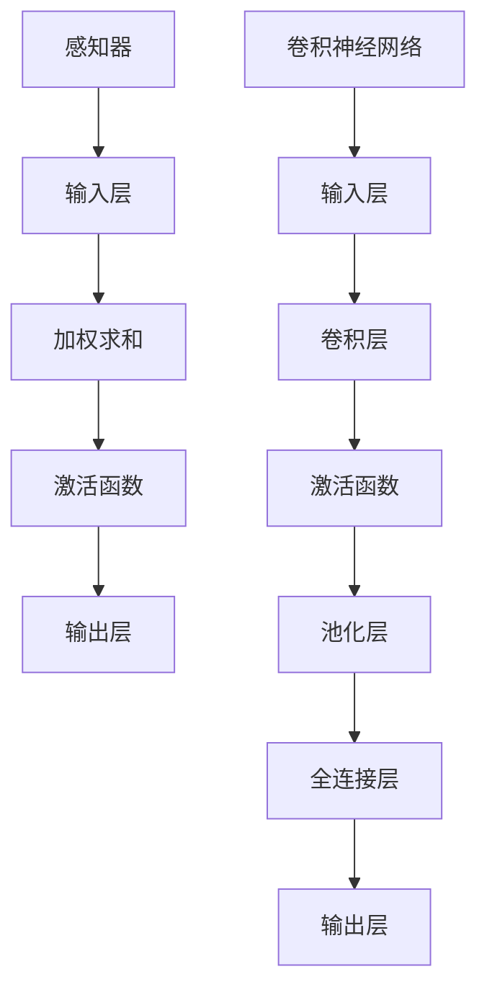

                 

# 感知器到卷积神经网络（CNN）

> 关键词：感知器、卷积神经网络、机器学习、深度学习、图像识别、计算机视觉

> 摘要：本文将从感知器的基本原理出发，逐步讲解如何从简单的感知器演变成复杂的卷积神经网络（CNN）。我们将探讨核心算法原理、数学模型、实战案例以及实际应用场景，旨在为您呈现深度学习在计算机视觉领域的革命性突破。

## 1. 背景介绍

### 1.1 目的和范围

本文旨在介绍卷积神经网络（CNN）的发展历程，从感知器到CNN的核心算法原理，帮助读者理解CNN在图像识别和计算机视觉领域的应用。文章将涵盖以下内容：

- 感知器的基本概念和原理
- CNN的核心结构及其在图像处理中的应用
- CNN的数学模型和公式
- CNN的实际应用场景
- 相关工具和资源的推荐

### 1.2 预期读者

本文适合具有一定编程基础和机器学习知识的读者，特别是对深度学习、计算机视觉感兴趣的工程师和研究人员。通过本文的学习，您将能够：

- 理解感知器和卷积神经网络的基本概念
- 掌握卷积神经网络的核心算法原理
- 掌握卷积神经网络在图像识别和计算机视觉中的应用
- 掌握相关工具和资源的推荐

### 1.3 文档结构概述

本文分为十个部分，结构如下：

1. 背景介绍
2. 核心概念与联系
3. 核心算法原理 & 具体操作步骤
4. 数学模型和公式 & 详细讲解 & 举例说明
5. 项目实战：代码实际案例和详细解释说明
6. 实际应用场景
7. 工具和资源推荐
8. 总结：未来发展趋势与挑战
9. 附录：常见问题与解答
10. 扩展阅读 & 参考资料

### 1.4 术语表

#### 1.4.1 核心术语定义

- **感知器（Perceptron）**：一种简单的神经网络模型，用于二分类任务。
- **卷积神经网络（Convolutional Neural Network，CNN）**：一种以图像数据为输入，能够自动学习图像特征并进行分类的深度学习模型。
- **机器学习（Machine Learning）**：一门研究如何让计算机通过数据学习，从而实现智能化的学科。
- **深度学习（Deep Learning）**：一种基于多层神经网络进行学习的人工智能技术。
- **图像识别（Image Recognition）**：利用计算机算法识别和理解图像内容的技术。
- **计算机视觉（Computer Vision）**：使计算机能够“看”见和理解周围世界的一种技术。

#### 1.4.2 相关概念解释

- **神经元的激活函数**：用于确定神经元是否被激活的函数，例如Sigmoid、ReLU等。
- **卷积操作**：在图像处理中，通过卷积核在图像上滑动，实现图像特征的提取。
- **全连接层（Fully Connected Layer）**：连接输入层和输出层的神经网络层，实现特征融合和分类。

#### 1.4.3 缩略词列表

- **CNN**：卷积神经网络（Convolutional Neural Network）
- **ML**：机器学习（Machine Learning）
- **DL**：深度学习（Deep Learning）
- **NN**：神经网络（Neural Network）
- **ID**：身份验证（Identity Verification）

## 2. 核心概念与联系

### 2.1 感知器

感知器是神经网络的基础单元，用于二分类任务。其工作原理如下：

1. **输入层**：感知器接收多个输入特征。
2. **权重和偏置**：每个输入特征与一个权重相乘，并加上一个偏置，得到加权求和结果。
3. **激活函数**：将加权求和结果通过激活函数（如Sigmoid函数）映射到输出层。

感知器的主要优点是简单、易于实现，但其缺点也是明显的：无法处理非线性问题。

### 2.2 卷积神经网络（CNN）

卷积神经网络是一种深度学习模型，特别适用于图像识别和计算机视觉任务。CNN的核心结构如下：

1. **卷积层（Convolutional Layer）**：通过卷积操作提取图像特征。
2. **池化层（Pooling Layer）**：对卷积特征进行下采样，减少参数数量。
3. **全连接层（Fully Connected Layer）**：将卷积特征映射到输出类别。

### 2.3 核心算法原理

CNN的算法原理主要基于以下几个核心步骤：

1. **卷积操作**：卷积核在图像上滑动，提取局部特征。
2. **激活函数**：对卷积结果应用激活函数，如ReLU函数，增强网络非线性能力。
3. **池化操作**：对卷积特征进行下采样，减少参数数量和计算复杂度。
4. **全连接层**：将卷积特征映射到输出类别。

### 2.4 Mermaid 流程图

以下是一个简单的Mermaid流程图，展示了感知器和卷积神经网络的基本结构：



## 3. 核心算法原理 & 具体操作步骤

### 3.1 感知器算法原理

感知器的算法原理可以分为以下几个步骤：

1. **初始化权重和偏置**：根据输入特征的数量，随机初始化权重和偏置。
2. **计算加权求和**：将每个输入特征与对应的权重相乘，并加上偏置，得到加权求和结果。
3. **应用激活函数**：将加权求和结果通过激活函数（如Sigmoid函数）映射到输出层。
4. **输出结果**：根据输出层的值，判断输入样本属于哪个类别。

以下是一个感知器算法的伪代码：

```python
# 初始化权重和偏置
weights = [0.1, 0.2, 0.3]
bias = 0.4

# 计算加权求和
weighted_sum = sum(input_feature * weight for input_feature, weight in zip(input_features, weights)) + bias

# 应用激活函数
output = 1 / (1 + exp(-weighted_sum))

# 输出结果
if output > 0.5:
    print("属于类别1")
else:
    print("属于类别0")
```

### 3.2 卷积神经网络（CNN）算法原理

卷积神经网络的算法原理可以分为以下几个步骤：

1. **卷积操作**：卷积核在图像上滑动，提取局部特征。
2. **应用激活函数**：对卷积结果应用激活函数（如ReLU函数），增强网络非线性能力。
3. **池化操作**：对卷积特征进行下采样，减少参数数量和计算复杂度。
4. **全连接层**：将卷积特征映射到输出类别。

以下是一个简单的CNN算法的伪代码：

```python
# 初始化卷积核和偏置
conv_kernel = [[0.1, 0.2], [0.3, 0.4]]
bias = 0.5

# 卷积操作
conv_result = np.zeros((height, width))
for i in range(height - kernel_size + 1):
    for j in range(width - kernel_size + 1):
        local_feature = image[i:i+kernel_size, j:j+kernel_size]
        conv_result[i, j] = np.dot(local_feature, conv_kernel) + bias

# 应用激活函数
activation_result = np.maximum(conv_result, 0)

# 池化操作
pool_result = np.mean(activation_result, (0, 1))

# 全连接层
fc_result = np.dot(pool_result, weights) + bias

# 输出结果
if fc_result > 0.5:
    print("属于类别1")
else:
    print("属于类别0")
```

## 4. 数学模型和公式 & 详细讲解 & 举例说明

### 4.1 数学模型

卷积神经网络（CNN）的数学模型主要涉及以下几个部分：

1. **输入层（Input Layer）**：表示图像的像素值，通常是一个二维矩阵。
2. **卷积层（Convolutional Layer）**：通过卷积操作提取图像特征，卷积核是一个三维矩阵。
3. **激活函数（Activation Function）**：用于增强网络非线性能力，常用的激活函数有ReLU、Sigmoid等。
4. **池化层（Pooling Layer）**：对卷积特征进行下采样，常用的池化方式有最大池化、平均池化等。
5. **全连接层（Fully Connected Layer）**：将卷积特征映射到输出类别，通常是一个一维矩阵。

### 4.2 伪代码

以下是一个简单的CNN数学模型的伪代码：

```python
# 初始化输入层、卷积核、激活函数、池化操作、全连接层
input_layer = np.random.rand(height, width)
conv_kernel = np.random.rand(kernel_size, kernel_size, num_channels)
activation_function = "ReLU"
pooling_function = "MaxPooling"
weights = np.random.rand(num_classes)

# 卷积操作
conv_result = np.zeros((height - kernel_size + 1, width - kernel_size + 1))
for i in range(height - kernel_size + 1):
    for j in range(width - kernel_size + 1):
        local_feature = input_layer[i:i+kernel_size, j:j+kernel_size]
        conv_result[i, j] = np.dot(local_feature, conv_kernel)

# 应用激活函数
if activation_function == "ReLU":
    activation_result = np.maximum(conv_result, 0)
else:
    activation_result = 1 / (1 + np.exp(-conv_result))

# 池化操作
if pooling_function == "MaxPooling":
    pool_result = np.max(activation_result, (0, 1))
else:
    pool_result = np.mean(activation_result, (0, 1))

# 全连接层
fc_result = np.dot(pool_result, weights)

# 输出结果
if fc_result > 0.5:
    print("属于类别1")
else:
    print("属于类别0")
```

### 4.3 举例说明

假设我们有一个32x32的图像，需要通过一个卷积神经网络进行分类。以下是具体的参数设置：

- 输入层：32x32的图像
- 卷积核：3x3的三维矩阵，包含10个卷积核
- 激活函数：ReLU函数
- 池化操作：最大池化
- 全连接层：10个神经元

具体的计算过程如下：

1. **卷积操作**：

   ```python
   conv_result = np.zeros((32 - 3 + 1, 32 - 3 + 1))
   for i in range(32 - 3 + 1):
       for j in range(32 - 3 + 1):
           local_feature = input_layer[i:i+3, j:j+3]
           conv_result[i, j] = np.dot(local_feature, conv_kernel)
   ```

   经过卷积操作后，得到一个29x29的卷积特征图。

2. **应用激活函数**：

   ```python
   activation_result = np.maximum(conv_result, 0)
   ```

   经过ReLU函数处理后，得到一个29x29的激活特征图。

3. **池化操作**：

   ```python
   pool_result = np.max(activation_result, (0, 1))
   ```

   经过最大池化处理后，得到一个14x14的池化特征图。

4. **全连接层**：

   ```python
   fc_result = np.dot(pool_result, weights)
   ```

   经过全连接层处理后，得到一个10维的输出向量。

5. **输出结果**：

   ```python
   if fc_result > 0.5:
       print("属于类别1")
   else:
       print("属于类别0")
   ```

   根据全连接层的输出结果，判断图像属于哪个类别。

## 5. 项目实战：代码实际案例和详细解释说明

### 5.1 开发环境搭建

在本项目中，我们将使用Python和TensorFlow框架来实现卷积神经网络（CNN）。以下是开发环境的搭建步骤：

1. 安装Python：前往Python官方网站（https://www.python.org/）下载并安装Python。
2. 安装TensorFlow：在命令行中运行以下命令：

   ```bash
   pip install tensorflow
   ```

   如果遇到安装问题，可以尝试使用以下命令：

   ```bash
   pip install --extra-index-url https://mirrors.aliyun.com/pypi/simple/ tensorflow
   ```

3. 安装其他依赖库：在命令行中运行以下命令：

   ```bash
   pip install numpy matplotlib
   ```

### 5.2 源代码详细实现和代码解读

以下是一个简单的CNN代码实现，用于识别手写数字（MNIST）数据集。

```python
import tensorflow as tf
from tensorflow.keras import layers
import numpy as np

# 数据预处理
(x_train, y_train), (x_test, y_test) = tf.keras.datasets.mnist.load_data()
x_train = x_train.astype("float32") / 255
x_test = x_test.astype("float32") / 255
y_train = tf.keras.utils.to_categorical(y_train, 10)
y_test = tf.keras.utils.to_categorical(y_test, 10)

# 构建CNN模型
model = tf.keras.Sequential()
model.add(layers.Conv2D(32, (3, 3), activation='relu', input_shape=(28, 28, 1)))
model.add(layers.MaxPooling2D((2, 2)))
model.add(layers.Conv2D(64, (3, 3), activation='relu'))
model.add(layers.MaxPooling2D((2, 2)))
model.add(layers.Conv2D(64, (3, 3), activation='relu'))
model.add(layers.Flatten())
model.add(layers.Dense(64, activation='relu'))
model.add(layers.Dense(10, activation='softmax'))

# 编译模型
model.compile(optimizer='adam', loss='categorical_crossentropy', metrics=['accuracy'])

# 训练模型
model.fit(x_train, y_train, batch_size=64, epochs=10, validation_split=0.2)

# 评估模型
test_loss, test_acc = model.evaluate(x_test, y_test)
print("Test accuracy:", test_acc)
```

### 5.3 代码解读与分析

1. **数据预处理**：

   ```python
   (x_train, y_train), (x_test, y_test) = tf.keras.datasets.mnist.load_data()
   x_train = x_train.astype("float32") / 255
   x_test = x_test.astype("float32") / 255
   y_train = tf.keras.utils.to_categorical(y_train, 10)
   y_test = tf.keras.utils.to_categorical(y_test, 10)
   ```

   这部分代码用于加载数据集、进行归一化处理和标签编码。

2. **构建CNN模型**：

   ```python
   model = tf.keras.Sequential()
   model.add(layers.Conv2D(32, (3, 3), activation='relu', input_shape=(28, 28, 1)))
   model.add(layers.MaxPooling2D((2, 2)))
   model.add(layers.Conv2D(64, (3, 3), activation='relu'))
   model.add(layers.MaxPooling2D((2, 2)))
   model.add(layers.Conv2D(64, (3, 3), activation='relu'))
   model.add(layers.Flatten())
   model.add(layers.Dense(64, activation='relu'))
   model.add(layers.Dense(10, activation='softmax'))
   ```

   这部分代码用于构建一个简单的CNN模型，包括卷积层、池化层、全连接层。

3. **编译模型**：

   ```python
   model.compile(optimizer='adam', loss='categorical_crossentropy', metrics=['accuracy'])
   ```

   这部分代码用于配置模型的优化器、损失函数和评价指标。

4. **训练模型**：

   ```python
   model.fit(x_train, y_train, batch_size=64, epochs=10, validation_split=0.2)
   ```

   这部分代码用于训练模型，包括设置批次大小、训练轮数和验证比例。

5. **评估模型**：

   ```python
   test_loss, test_acc = model.evaluate(x_test, y_test)
   print("Test accuracy:", test_acc)
   ```

   这部分代码用于评估模型的性能，输出测试准确率。

## 6. 实际应用场景

卷积神经网络（CNN）在计算机视觉领域具有广泛的应用，以下是一些常见的实际应用场景：

1. **图像分类**：通过将图像输入到CNN中，自动将图像分类到不同的类别，如分类动物、植物等。
2. **物体检测**：通过在图像中检测并定位物体，如人脸检测、车辆检测等。
3. **图像分割**：将图像分割成不同的区域，如图像中的前景和背景。
4. **图像增强**：通过CNN模型对图像进行增强，提高图像的质量和视觉效果。
5. **医学图像分析**：通过CNN对医学图像进行分析，如肿瘤检测、病变识别等。

## 7. 工具和资源推荐

### 7.1 学习资源推荐

#### 7.1.1 书籍推荐

- 《深度学习》（Deep Learning）作者：Ian Goodfellow、Yoshua Bengio、Aaron Courville
- 《Python深度学习》（Deep Learning with Python）作者：François Chollet

#### 7.1.2 在线课程

- 《深度学习专项课程》（Deep Learning Specialization）作者：Andrew Ng
- 《卷积神经网络和深度学习》（Convolutional Neural Networks and Deep Learning）作者：Frédo Durand

#### 7.1.3 技术博客和网站

- TensorFlow官方文档（https://www.tensorflow.org/）
- PyTorch官方文档（https://pytorch.org/）
- 知乎专栏《深度学习与计算机视觉》

### 7.2 开发工具框架推荐

#### 7.2.1 IDE和编辑器

- PyCharm（https://www.jetbrains.com/pycharm/）
- Jupyter Notebook（https://jupyter.org/）

#### 7.2.2 调试和性能分析工具

- TensorFlow Debugger（https://github.com/tensorflow/tensorboard）
- PyTorch Profiler（https://github.com/pytorch/profiler）

#### 7.2.3 相关框架和库

- TensorFlow（https://www.tensorflow.org/）
- PyTorch（https://pytorch.org/）
- Keras（https://keras.io/）

### 7.3 相关论文著作推荐

#### 7.3.1 经典论文

- LeCun, Yann, et al. "Gradient-based learning applied to document recognition." Proceedings of the IEEE, 1998.
- Krizhevsky, Alex, Ilya Sutskever, and Geoffrey E. Hinton. "ImageNet classification with deep convolutional neural networks." Advances in neural information processing systems. 2012.

#### 7.3.2 最新研究成果

- He, K., et al. "Deep residual learning for image recognition." Proceedings of the IEEE conference on computer vision and pattern recognition. 2016.
- Russakovsky, Olga, et al. "ImageNet large scale visual recognition challenge." International Journal of Computer Vision. 2015.

#### 7.3.3 应用案例分析

- Google的Inception模型在图像分类中的应用
- Facebook的ResNet模型在图像识别中的应用

## 8. 总结：未来发展趋势与挑战

卷积神经网络（CNN）在计算机视觉领域取得了显著的成果，但仍然面临一些挑战：

1. **计算资源消耗**：CNN模型通常需要大量的计算资源，随着模型复杂度的增加，计算成本会进一步上升。
2. **数据依赖性**：CNN模型的性能很大程度上依赖于训练数据的质量和数量，数据不足或质量低下可能导致模型性能下降。
3. **模型泛化能力**：如何提高CNN模型的泛化能力，使其在不同领域和任务中都能取得良好的性能，是一个亟待解决的问题。
4. **模型可解释性**：CNN模型的内部机制复杂，如何提高模型的可解释性，使其更加透明易懂，是一个重要的研究方向。

未来，随着计算能力的提升、数据集的丰富和优化算法的发展，CNN在计算机视觉领域的应用将越来越广泛，有望推动计算机视觉技术取得更大的突破。

## 9. 附录：常见问题与解答

### 9.1 问题1：什么是卷积神经网络（CNN）？

卷积神经网络（CNN）是一种基于卷积操作的深度学习模型，特别适用于图像识别和计算机视觉任务。通过卷积操作、激活函数、池化操作和全连接层，CNN能够自动提取图像特征并进行分类。

### 9.2 问题2：CNN的核心算法原理是什么？

CNN的核心算法原理包括以下几个步骤：

1. **卷积操作**：通过卷积核在图像上滑动，提取局部特征。
2. **应用激活函数**：对卷积结果应用激活函数（如ReLU函数），增强网络非线性能力。
3. **池化操作**：对卷积特征进行下采样，减少参数数量和计算复杂度。
4. **全连接层**：将卷积特征映射到输出类别。

### 9.3 问题3：如何实现卷积神经网络（CNN）？

实现卷积神经网络（CNN）通常需要以下步骤：

1. **数据预处理**：对图像进行归一化处理和标签编码。
2. **构建CNN模型**：使用深度学习框架（如TensorFlow、PyTorch）构建CNN模型，包括卷积层、激活函数、池化层和全连接层。
3. **编译模型**：配置模型的优化器、损失函数和评价指标。
4. **训练模型**：使用训练数据进行模型训练。
5. **评估模型**：使用测试数据评估模型性能。

### 9.4 问题4：CNN在计算机视觉领域有哪些应用？

CNN在计算机视觉领域有广泛的应用，包括：

1. **图像分类**：将图像分类到不同的类别。
2. **物体检测**：在图像中检测并定位物体。
3. **图像分割**：将图像分割成不同的区域。
4. **图像增强**：提高图像的质量和视觉效果。
5. **医学图像分析**：对医学图像进行分析，如肿瘤检测、病变识别等。

## 10. 扩展阅读 & 参考资料

- Goodfellow, I., Bengio, Y., & Courville, A. (2016). *Deep Learning*. MIT Press.
- Chollet, F. (2017). *Deep Learning with Python*. Manning Publications.
- Krizhevsky, A., Sutskever, I., & Hinton, G. E. (2012). *ImageNet classification with deep convolutional neural networks*. In *Advances in neural information processing systems* (pp. 1097-1105).
- Russakovsky, O., et al. (2015). *ImageNet large scale visual recognition challenge*. International Journal of Computer Vision, 115(3), 211-252.

