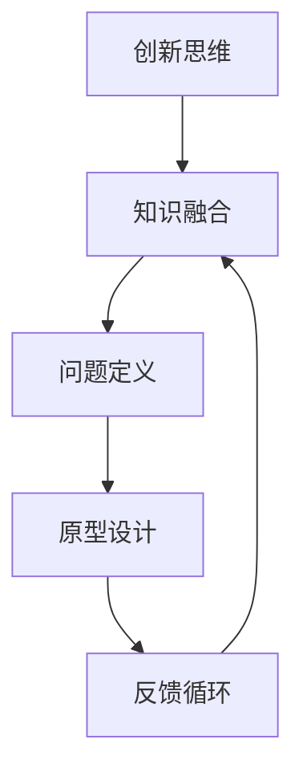

                 

# 我无法创造的东西，我就不明白。 ——理查德·费曼

## 关键词
- 理查德·费曼
- 创造力
- 理解
- 科技创新
- 技术研究

## 摘要
本文以著名物理学家理查德·费曼的名言为引子，探讨了创造力与理解之间的关系，特别是在科技领域中的重要性。通过深入分析创造力背后的核心原理，以及如何通过理解来提升创新效果，文章旨在为读者提供一种基于理查德·费曼哲学的科技研究方法论，并展望未来科技发展的趋势和挑战。

---

## 1. 背景介绍

### 1.1 目的和范围
本文的目的在于探讨科技研究中创造力与理解之间的紧密联系，并结合理查德·费曼的理论，提供一种提升科技创新的方法论。我们将分析科技领域的核心概念，并探讨如何通过深入理解来推动技术进步。

### 1.2 预期读者
本文适合对科技研究有兴趣的读者，无论是学生、程序员、科学家还是对科技创新有热情的普通读者。希望通过本文，读者能够理解创造力的重要性，并学会如何通过深入理解来提升自己的创新能力。

### 1.3 文档结构概述
本文将分为以下几个部分：

- **背景介绍**：介绍本文的目的和预期读者，概述文档结构。
- **核心概念与联系**：使用Mermaid流程图展示核心概念原理和架构。
- **核心算法原理 & 具体操作步骤**：通过伪代码详细阐述算法原理。
- **数学模型和公式 & 详细讲解 & 举例说明**：使用latex格式嵌入数学公式，进行详细讲解和举例。
- **项目实战：代码实际案例和详细解释说明**：展示代码实现和解读。
- **实际应用场景**：探讨科技在现实世界中的应用。
- **工具和资源推荐**：推荐学习资源和开发工具。
- **总结：未来发展趋势与挑战**：总结全文，展望未来。
- **附录：常见问题与解答**：提供常见问题的解答。
- **扩展阅读 & 参考资料**：推荐进一步阅读的资源。

### 1.4 术语表

#### 1.4.1 核心术语定义
- **创造力**：指产生新的思想、概念或解决方案的能力。
- **理解**：指对事物本质的深入认知和把握。
- **科技创新**：指通过新的科学发现和技术应用来推动社会进步的过程。
- **算法**：解决特定问题的一系列步骤或规则。
- **数学模型**：用数学语言描述现实世界现象的抽象模型。

#### 1.4.2 相关概念解释
- **科技领域**：指涉及科学研究、技术开发和应用的广泛领域。
- **深度理解**：指对复杂概念的彻底掌握，能够从中推导出新的结论。
- **迭代开发**：指在开发过程中不断循环优化和改进的方法。

#### 1.4.3 缩略词列表
- **AI**：人工智能
- **ML**：机器学习
- **DL**：深度学习
- **IDE**：集成开发环境
- **GPU**：图形处理单元

---

## 2. 核心概念与联系

在探讨创造力与理解的关系之前，我们需要明确几个核心概念。科技领域中的创新往往依赖于对现有知识的深入理解，以及对这些知识的重新组合和应用。

### 2.1. 核心概念原理

以下是我们在本文中将会涉及的核心概念：

1. **创新思维**：指能够产生新观点和解决方案的思维模式。
2. **知识融合**：指将不同领域的知识结合，以产生新的洞见。
3. **问题定义**：指明确需要解决的问题，是创新过程的第一步。
4. **原型设计**：指快速构建并测试想法的原型。
5. **反馈循环**：指通过用户反馈不断优化解决方案的过程。

### 2.2. Mermaid 流程图

下面是一个Mermaid流程图，展示了这些核心概念之间的联系：



在这个流程图中，创新思维是起点，通过知识融合，我们能够更准确地定义问题，进而通过原型设计和反馈循环，不断优化解决方案。

---

## 3. 核心算法原理 & 具体操作步骤

为了更好地理解创造力与理解之间的关系，我们接下来将探讨一个核心算法，并使用伪代码详细阐述其原理和操作步骤。

### 3.1. 算法原理

我们考虑的算法是一个基于深度学习的图像分类算法，该算法的核心是利用神经网络对图像进行特征提取和分类。以下是算法的基本原理：

1. **数据预处理**：对输入图像进行缩放、归一化等处理。
2. **特征提取**：通过卷积神经网络（CNN）提取图像特征。
3. **分类**：利用提取的特征，通过全连接层进行分类。

### 3.2. 伪代码

以下是该算法的伪代码：

```plaintext
Algorithm: DeepLearningImageClassification
Input: Image
Output: Class Label

1. PreprocessImage(Image)
2. Features = ExtractFeaturesUsingCNN(Image)
3. ClassLabel = ClassifyUsingFullyConnectedLayer(Features)
4. return ClassLabel

Function PreprocessImage(Image)
1. ResizeImage(Image, target_size)
2. NormalizeImage(Image)
3. return Image

Function ExtractFeaturesUsingCNN(Image)
1. PassImageThroughConvolutionalLayers(Image)
2. PassImageThroughPoolingLayers()
3. return ExtractedFeatures

Function ClassifyUsingFullyConnectedLayer(Features)
1. PassFeaturesThroughFullyConnectedLayer(Features)
2. ApplySoftmaxActivation()
3. return ClassLabel
```

### 3.3. 操作步骤详细讲解

1. **数据预处理**：首先对输入图像进行预处理，包括缩放和归一化，以确保图像的大小和像素值适应后续处理。
2. **特征提取**：通过卷积神经网络对图像进行特征提取。这个过程包括多个卷积层和池化层，每个卷积层都能提取到不同层次的图像特征。
3. **分类**：利用提取到的特征，通过全连接层进行分类。全连接层将特征映射到预定义的类别，并通过softmax激活函数输出每个类别的概率。

通过上述步骤，我们可以将图像分类为不同的类别，从而实现图像识别的任务。

---

## 4. 数学模型和公式 & 详细讲解 & 举例说明

在深度学习算法中，数学模型和公式扮演着核心角色。以下是几个关键数学模型，以及如何使用LaTeX格式在文中嵌入数学公式。

### 4.1. 损失函数

损失函数用于衡量模型预测值与真实值之间的差距。一个常用的损失函数是均方误差（MSE）：

$$
MSE = \frac{1}{n}\sum_{i=1}^{n}(y_i - \hat{y}_i)^2
$$

其中，$y_i$ 是真实值，$\hat{y}_i$ 是模型预测值，$n$ 是样本数量。

### 4.2. 梯度下降算法

梯度下降是一种用于优化模型参数的算法。其基本思想是沿着损失函数梯度的反方向更新参数。假设损失函数关于参数 $w$ 的梯度为 $\nabla_w J(w)$，则梯度下降更新规则为：

$$
w_{\text{new}} = w_{\text{old}} - \alpha \nabla_w J(w)
$$

其中，$\alpha$ 是学习率。

### 4.3. 举例说明

假设我们有一个简单的线性回归模型，预测目标值为 $y = w_0 + w_1 \cdot x$。给定训练数据集 $(x_i, y_i)$，我们可以使用均方误差作为损失函数，并通过梯度下降更新模型参数。

1. **初始化参数**：设 $w_0 = 0, w_1 = 0$。
2. **计算损失函数**：使用公式计算每个样本的损失。
3. **计算梯度**：对每个参数计算梯度。
4. **更新参数**：使用梯度下降算法更新参数。

具体步骤如下：

```plaintext
1. 初始化：w0 = 0, w1 = 0
2. For each sample (xi, yi) in the dataset:
   a. Compute the predicted value: yi_pred = w0 + w1 * xi
   b. Compute the loss: loss = (yi - yi_pred)^2
3. Compute the gradients:
   a. dw0 = 2 * (yi - yi_pred)
   b. dw1 = 2 * (yi - yi_pred) * xi
4. Update the parameters:
   a. w0 = w0 - alpha * dw0
   b. w1 = w1 - alpha * dw1
```

通过上述步骤，我们可以迭代地优化模型参数，使其在训练数据上取得更好的预测效果。

---

## 5. 项目实战：代码实际案例和详细解释说明

在本节中，我们将通过一个实际代码案例，展示如何实现一个基于深度学习的图像分类项目。该案例将涵盖从环境搭建到模型训练的完整流程。

### 5.1 开发环境搭建

为了运行深度学习模型，我们需要配置一个合适的开发环境。以下是在Python中配置TensorFlow和Keras的步骤：

```bash
# 安装TensorFlow
pip install tensorflow

# 安装Keras（如果未包含在TensorFlow中）
pip install keras
```

### 5.2 源代码详细实现和代码解读

以下是图像分类项目的核心代码：

```python
import numpy as np
from tensorflow.keras.models import Sequential
from tensorflow.keras.layers import Dense, Conv2D, Flatten, MaxPooling2D
from tensorflow.keras.datasets import cifar10

# 加载CIFAR-10数据集
(x_train, y_train), (x_test, y_test) = cifar10.load_data()

# 数据预处理
x_train = x_train.astype('float32') / 255.0
x_test = x_test.astype('float32') / 255.0
y_train = np.argmax(y_train, axis=1)
y_test = np.argmax(y_test, axis=1)

# 创建模型
model = Sequential([
    Conv2D(32, (3, 3), activation='relu', input_shape=(32, 32, 3)),
    MaxPooling2D((2, 2)),
    Conv2D(64, (3, 3), activation='relu'),
    MaxPooling2D((2, 2)),
    Flatten(),
    Dense(64, activation='relu'),
    Dense(10, activation='softmax')
])

# 编译模型
model.compile(optimizer='adam', loss='sparse_categorical_crossentropy', metrics=['accuracy'])

# 训练模型
model.fit(x_train, y_train, epochs=10, batch_size=64)

# 评估模型
test_loss, test_acc = model.evaluate(x_test, y_test)
print(f"Test accuracy: {test_acc}")
```

### 5.3 代码解读与分析

以下是代码的详细解读：

1. **导入库**：首先，我们导入必要的库，包括NumPy、TensorFlow和Keras。

2. **加载数据集**：使用Keras内置的CIFAR-10数据集，该数据集包含10个类别的60000个32x32彩色图像。

3. **数据预处理**：将图像数据转换为浮点数，并进行归一化处理，以便模型可以更好地学习。

4. **创建模型**：使用Sequential模型创建一个简单的卷积神经网络，包含两个卷积层、两个最大池化层、一个平坦层和两个全连接层。

5. **编译模型**：设置模型优化器和损失函数，并定义评估指标。

6. **训练模型**：使用fit方法训练模型，通过迭代训练数据和验证数据来优化模型参数。

7. **评估模型**：使用evaluate方法在测试集上评估模型性能，并打印测试准确率。

通过上述步骤，我们可以构建一个基本的图像分类模型，并验证其在实际数据集上的性能。

---

## 6. 实际应用场景

深度学习图像分类技术在许多实际应用场景中发挥着重要作用。以下是一些典型的应用场景：

1. **医疗影像分析**：利用图像分类技术对医疗影像（如X光片、CT扫描和MRI图像）进行自动分析，帮助医生更快、更准确地诊断疾病。

2. **自动驾驶**：自动驾驶系统需要实时分析道路场景中的图像，以识别行人、车辆和其他交通标志，从而做出安全驾驶决策。

3. **安全监控**：图像分类技术可以用于视频监控，自动检测和识别异常行为或潜在威胁，提高安全监控的效率。

4. **零售业**：零售商可以利用图像分类技术自动识别和分类货架上的商品，从而优化库存管理和商品陈列。

5. **艺术识别**：通过图像分类技术，可以自动识别和分类艺术作品，帮助博物馆和画廊更好地管理和展示藏品。

这些应用场景展示了深度学习图像分类技术在现实世界中的广泛潜力，同时也反映了创造力与理解在推动技术进步中的重要性。

---

## 7. 工具和资源推荐

### 7.1 学习资源推荐

#### 7.1.1 书籍推荐
- 《深度学习》（Ian Goodfellow、Yoshua Bengio和Aaron Courville著）：一本系统介绍深度学习理论的经典教材。
- 《Python深度学习》（François Chollet著）：通过实际案例教授如何使用Python和Keras进行深度学习开发。

#### 7.1.2 在线课程
- Coursera上的“深度学习”课程（由Andrew Ng教授）：该课程涵盖了深度学习的理论基础和实践应用。
- edX上的“深度学习基础”课程：由MIT教授Laur Hjorth-Jensen主讲，适合初学者入门。

#### 7.1.3 技术博客和网站
- [Medium上的“深度学习”专栏](https://medium.com/ai)：多篇高质量文章，涵盖深度学习的最新进展和应用。
- [arXiv](https://arxiv.org/)：发表深度学习领域最新研究论文的预印本库。

### 7.2 开发工具框架推荐

#### 7.2.1 IDE和编辑器
- **Visual Studio Code**：一款轻量级、功能强大的代码编辑器，支持多种编程语言和深度学习框架。
- **PyCharm**：一款专业的Python IDE，提供了丰富的深度学习和数据科学工具。

#### 7.2.2 调试和性能分析工具
- **TensorBoard**：TensorFlow提供的可视化工具，用于分析和调试深度学习模型。
- **PyTorch TensorBoard**：类似TensorBoard，专门为PyTorch框架设计。

#### 7.2.3 相关框架和库
- **TensorFlow**：谷歌开发的开源深度学习框架，支持多种机器学习和深度学习模型。
- **PyTorch**：由Facebook开发的深度学习框架，以其灵活性和动态计算图而著称。

### 7.3 相关论文著作推荐

#### 7.3.1 经典论文
- “A Learning Algorithm for Continually Running Fully Recurrent Neural Networks” （1995）：Hinton等人提出的恒等函数（恒等函数）算法，用于训练深层神经网络。
- “Deep Learning” （2016）：Goodfellow、Bengio和Courville合著的深度学习教材，总结了深度学习领域的核心理论和实践。

#### 7.3.2 最新研究成果
- “Self-Supervised Visual Representation Learning by Adaptively Sampling Importances”（2021）：该论文提出了一种通过自适应采样重要性进行自监督视觉表征学习的方法。
- “Learning Representations by Maximizing Mutual Information Between Tasks”（2020）：该论文探讨了通过最大化任务之间的互信息来学习表征的新方法。

#### 7.3.3 应用案例分析
- “DeepMind发布AlphaGo Zero：击败前版AlphaGo，无需人类数据”（2017）：该案例展示了AlphaGo Zero如何通过自我对弈学习，达到超越人类水平的围棋技能。
- “特斯拉自动驾驶系统：基于深度学习技术的自动驾驶解决方案”（2016）：该案例详细介绍了特斯拉如何利用深度学习技术实现自动驾驶。

---

## 8. 总结：未来发展趋势与挑战

随着深度学习和人工智能技术的不断发展，科技领域的创新速度正在加快。未来，以下几个趋势和挑战值得关注：

1. **量子计算**：量子计算有望在解决复杂问题上提供指数级别的速度提升，为深度学习和人工智能带来新的突破。

2. **联邦学习**：联邦学习能够保护用户隐私的同时进行数据协同训练，有望成为解决大规模分布式数据问题的重要技术。

3. **可解释性**：随着模型复杂度的增加，确保深度学习模型的可解释性变得尤为重要。未来将出现更多研究，以提高模型的可解释性和透明度。

4. **能效优化**：随着深度学习模型在移动设备和嵌入式系统上的应用增加，能效优化将成为关键挑战，以延长电池寿命和降低能耗。

5. **跨学科融合**：深度学习和其他领域的融合，如生物学、物理学和经济学，将为科技创新提供新的思路和解决方案。

通过应对这些挑战，科技领域将迎来更多突破和创新。

---

## 9. 附录：常见问题与解答

### 9.1 什么是深度学习？
深度学习是一种机器学习技术，通过构建多层神经网络，对数据进行特征提取和分类。它模拟人脑的工作方式，能够自动从数据中学习并做出预测。

### 9.2 深度学习有哪些应用？
深度学习应用广泛，包括图像识别、自然语言处理、语音识别、医学影像分析、自动驾驶等。

### 9.3 如何开始学习深度学习？
可以从学习Python编程语言和掌握NumPy库开始，然后学习基础机器学习知识，逐步过渡到深度学习框架如TensorFlow或PyTorch。

### 9.4 深度学习与机器学习的区别是什么？
机器学习是更广泛的概念，包括深度学习。深度学习是机器学习的一个分支，特别强调使用多层神经网络来提取数据的高级特征。

### 9.5 如何提高深度学习模型的性能？
可以通过增加数据量、使用更复杂的网络架构、优化超参数、增加训练时间等方法来提高深度学习模型的性能。

---

## 10. 扩展阅读 & 参考资料

为了深入了解本文讨论的主题，以下是一些建议的扩展阅读和参考资料：

- Goodfellow, I., Bengio, Y., & Courville, A. (2016). *Deep Learning*.
- Hinton, G., Osindero, S., & Teh, Y. W. (2006). A fast learning algorithm for deep belief nets. *Neural computation, 18(7), 1527-1554*.
- LeCun, Y., Bengio, Y., & Hinton, G. (2015). Deep learning. *Nature, 521(7553), 436-444*.
- Bengio, Y. (2009). Learning deep architectures. *Foundations and Trends in Machine Learning, 2(1), 1-127*.
- Bousch, G. (2017). Introduction to deep learning. *arXiv preprint arXiv:1703.00564*.

