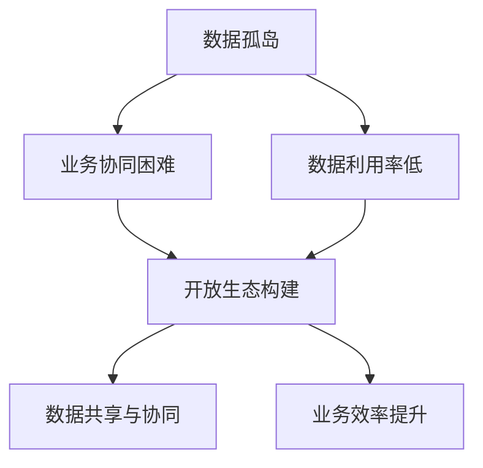

                 

# 打破数据孤岛，软件2.0呼唤开放生态

> **关键词：** 数据孤岛、软件2.0、开放生态、数据处理、系统集成

> **摘要：** 随着信息技术的迅猛发展，数据孤岛问题日益突出。本文将探讨数据孤岛现象的根源、危害及解决方案，并提出软件2.0时代的开放生态构建策略，以实现数据的高效整合与利用。

## 1. 背景介绍

### 1.1 目的和范围

本文旨在分析当前信息技术环境中数据孤岛问题的现状及其影响，深入探讨解决数据孤岛问题的方法，并展望软件2.0时代开放生态的构建。文章将重点围绕以下几个问题展开：

1. 数据孤岛现象的产生原因及其对业务运营的负面影响。
2. 软件2.0时代开放生态的概念与特征。
3. 如何通过构建开放生态实现数据孤岛问题的解决。
4. 开放生态在实际应用中的挑战与前景。

### 1.2 预期读者

本文面向对信息技术有一定了解，关注数据处理与系统集成领域的技术人员、企业决策者以及相关领域的研究者。通过阅读本文，读者可以：

1. 了解数据孤岛问题的本质及其危害。
2. 掌握软件2.0时代开放生态的概念与构建策略。
3. 获得解决数据孤岛问题的思路和方法。
4. 拓宽在数据处理与系统集成方面的视野。

### 1.3 文档结构概述

本文将按照以下结构进行阐述：

1. **背景介绍**：介绍数据孤岛问题的背景，明确文章目的与预期读者。
2. **核心概念与联系**：阐述数据孤岛与开放生态的核心概念及其相互关系。
3. **核心算法原理 & 具体操作步骤**：详细讲解解决数据孤岛问题的算法原理与操作步骤。
4. **数学模型和公式 & 详细讲解 & 举例说明**：介绍相关的数学模型与公式，并通过实例进行说明。
5. **项目实战：代码实际案例和详细解释说明**：通过实际案例展示开放生态构建的过程。
6. **实际应用场景**：探讨开放生态在不同领域的应用场景。
7. **工具和资源推荐**：推荐相关学习资源、开发工具和框架。
8. **总结：未来发展趋势与挑战**：总结文章的主要观点，展望未来发展趋势与挑战。
9. **附录：常见问题与解答**：回答读者可能关心的常见问题。
10. **扩展阅读 & 参考资料**：提供进一步的阅读资料与参考资料。

### 1.4 术语表

#### 1.4.1 核心术语定义

- 数据孤岛：指信息系统中分散、独立的数据源，无法实现数据共享和整合。
- 开放生态：指一种基于开放接口、资源共享、协同创新的软件系统架构。
- 软件2.0：指以用户为中心，强调软件系统的开放性、灵活性和可扩展性。

#### 1.4.2 相关概念解释

- 数据集成：指将不同数据源的数据进行整合，实现数据共享和互操作。
- 系统集成：指将不同系统进行整合，实现业务流程的无缝衔接和数据的高效利用。
- API（应用程序编程接口）：指软件系统提供的用于其他软件调用的接口。

#### 1.4.3 缩略词列表

- 数据孤岛：Data Isolation
- 开放生态：Open Ecosystem
- 软件2.0：Software 2.0
- 数据集成：Data Integration
- 系统集成：System Integration
- API：Application Programming Interface

## 2. 核心概念与联系

### 2.1 数据孤岛现象

数据孤岛现象是指信息系统中的数据源相互独立、无法实现数据共享和整合，导致数据利用率低、业务协同困难。数据孤岛的形成原因主要有以下几点：

1. **历史遗留问题**：在企业发展过程中，由于不同时期引入的系统相互独立，导致数据无法统一管理。
2. **技术壁垒**：不同系统之间的数据格式、接口标准不统一，难以实现互操作。
3. **管理疏漏**：企业在数据管理方面缺乏统一的规划和策略，导致数据分散、无序。
4. **利益冲突**：各部门或系统之间存在利益冲突，不愿意共享数据资源。

### 2.2 开放生态构建

开放生态是一种基于开放接口、资源共享、协同创新的软件系统架构。其核心思想是通过开放接口实现不同系统之间的数据共享和业务协同，从而解决数据孤岛问题。开放生态的主要特征包括：

1. **开放接口**：系统提供统一的API接口，方便其他系统进行数据访问和功能调用。
2. **资源共享**：系统之间通过共享数据资源，实现数据的高效利用。
3. **协同创新**：各系统协同工作，共同推动业务发展。

### 2.3 数据孤岛与开放生态的关系

数据孤岛与开放生态之间存在密切的联系。数据孤岛问题是开放生态构建的背景和动力，而开放生态则是解决数据孤岛问题的有效途径。具体来说：

1. **数据孤岛问题驱动开放生态构建**：数据孤岛问题导致企业业务运营效率低下，推动企业寻求解决之道。开放生态作为一种解决方案，应运而生。
2. **开放生态构建促进数据孤岛解决**：通过构建开放生态，实现不同系统之间的数据共享和业务协同，从而打破数据孤岛，提高业务运营效率。

### 2.4 Mermaid流程图

为了更直观地展示数据孤岛与开放生态的关系，我们使用Mermaid流程图进行说明。以下是一个简化的流程图：



在这个流程图中，数据孤岛导致业务协同困难、数据利用率低等问题，而开放生态构建则有助于解决这些问题，实现数据共享与协同，进而提高业务效率。

## 3. 核心算法原理 & 具体操作步骤

### 3.1 核心算法原理

解决数据孤岛问题的核心算法原理主要包括以下几个方面：

1. **数据集成**：通过数据集成技术，将不同数据源的数据进行整合，实现数据共享和互操作。
2. **接口标准化**：通过接口标准化技术，统一不同系统之间的接口标准，实现数据交换和功能调用。
3. **数据清洗与转换**：对数据进行清洗、转换，确保数据质量，为数据共享和业务协同提供基础。

### 3.2 具体操作步骤

为了实现数据孤岛的解决，可以按照以下具体操作步骤进行：

1. **需求分析**：明确数据孤岛问题的具体表现和业务需求，确定数据集成的目标和范围。
2. **系统调研**：调研现有的信息系统，了解数据源的类型、数据格式和接口标准。
3. **接口设计**：设计统一的API接口，实现不同系统之间的数据交换和功能调用。
4. **数据清洗与转换**：对数据进行清洗、转换，确保数据质量，为数据共享和业务协同提供基础。
5. **数据集成**：将不同数据源的数据进行整合，实现数据共享和互操作。
6. **系统测试**：对集成后的系统进行测试，确保数据共享和业务协同的顺利进行。
7. **部署上线**：将集成后的系统部署到生产环境，实现数据孤岛问题的解决。

### 3.3 伪代码示例

以下是一个简单的伪代码示例，用于说明数据集成的实现过程：

```python
# 数据集成伪代码

# 步骤1：需求分析
data_sources = ["source1", "source2", "source3"]

# 步骤2：系统调研
api_endpoints = {
    "source1": "http://example.com/source1",
    "source2": "http://example.com/source2",
    "source3": "http://example.com/source3"
}

# 步骤3：接口设计
def fetch_data(source):
    response = requests.get(api_endpoints[source])
    data = response.json()
    return data

# 步骤4：数据清洗与转换
def clean_and_transform(data):
    # 数据清洗和转换逻辑
    cleaned_data = ...
    return cleaned_data

# 步骤5：数据集成
integrated_data = []
for source in data_sources:
    raw_data = fetch_data(source)
    cleaned_data = clean_and_transform(raw_data)
    integrated_data.append(cleaned_data)

# 步骤6：系统测试
# 测试集成后的系统，确保数据共享和业务协同的顺利进行

# 步骤7：部署上线
# 将集成后的系统部署到生产环境，实现数据孤岛问题的解决
```

通过这个伪代码示例，我们可以看到数据集成的实现过程，包括需求分析、系统调研、接口设计、数据清洗与转换、数据集成、系统测试和部署上线等步骤。这些步骤共同构成了解决数据孤岛问题的核心算法原理。

## 4. 数学模型和公式 & 详细讲解 & 举例说明

### 4.1 数学模型和公式

在解决数据孤岛问题时，常用的数学模型和公式包括：

1. **相关系数**：用于衡量两个变量之间的线性相关性。
   $$ r(x, y) = \frac{\sum_{i=1}^{n}(x_i - \bar{x})(y_i - \bar{y})}{\sqrt{\sum_{i=1}^{n}(x_i - \bar{x})^2}\sqrt{\sum_{i=1}^{n}(y_i - \bar{y})^2}} $$
   
2. **主成分分析（PCA）**：用于降维和数据压缩，提取数据中的主要特征。
   $$ Z = \frac{(X - \mu)}{\sigma} $$
   $$ \lambda = \frac{1}{n}\sum_{i=1}^{n}(x_i - \bar{x})^2 $$
   $$ v_i = \frac{x_i - \bar{x}}{\sqrt{\lambda_i}} $$
   
3. **贝叶斯分类器**：用于分类问题，基于贝叶斯定理计算各类别的概率。
   $$ P(C_k|X) = \frac{P(X|C_k)P(C_k)}{P(X)} $$
   
### 4.2 详细讲解

1. **相关系数**：

相关系数用于衡量两个变量之间的线性相关性，其取值范围为[-1, 1]。当相关系数接近1时，表示两个变量正相关；当相关系数接近-1时，表示两个变量负相关；当相关系数接近0时，表示两个变量之间无相关性。

2. **主成分分析（PCA）**：

主成分分析是一种降维技术，通过将高维数据映射到低维空间，提取数据中的主要特征。PCA的核心思想是找到数据的主要方向，使得数据点在这个方向上的方差最大。通过计算协方差矩阵的特征值和特征向量，可以确定主要方向，进而进行数据降维。

3. **贝叶斯分类器**：

贝叶斯分类器是一种基于贝叶斯定理的分类算法，通过计算各类别的概率，实现对数据的分类。贝叶斯分类器适用于处理不确定性和概率性的问题，尤其在处理小样本和缺失数据时具有优势。

### 4.3 举例说明

假设我们有以下两个变量：身高（x）和体重（y），数据如下：

| 身高（x） | 体重（y） |
| :------: | :------: |
|   170    |   60     |
|   175    |   65     |
|   180    |   70     |
|   185    |   75     |
|   190    |   80     |

1. **相关系数**：

计算身高和体重之间的相关系数：

$$ r(x, y) = \frac{\sum_{i=1}^{5}(x_i - \bar{x})(y_i - \bar{y})}{\sqrt{\sum_{i=1}^{5}(x_i - \bar{x})^2}\sqrt{\sum_{i=1}^{5}(y_i - \bar{y})^2}} $$

计算得到相关系数约为0.95，说明身高和体重之间存在较强的正相关关系。

2. **主成分分析（PCA）**：

对身高和体重进行主成分分析，提取主要特征。首先计算协方差矩阵：

$$ \Sigma = \begin{bmatrix} \frac{1}{5}\sum_{i=1}^{5}(x_i - \bar{x})^2 & \frac{1}{5}\sum_{i=1}^{5}(x_i - \bar{x})(y_i - \bar{y}) \\ \frac{1}{5}\sum_{i=1}^{5}(x_i - \bar{x})(y_i - \bar{y}) & \frac{1}{5}\sum_{i=1}^{5}(y_i - \bar{y})^2 \end{bmatrix} $$

计算协方差矩阵的特征值和特征向量，得到主要特征方向。根据特征值的大小，选择前两个特征向量作为主要特征，将数据投影到这两个特征向量上，实现数据降维。

3. **贝叶斯分类器**：

假设有一个新的数据点：身高为180，体重为70。使用贝叶斯分类器对其进行分类。

计算各类别的概率：

$$ P(C_1|X) = \frac{P(X|C_1)P(C_1)}{P(X)} $$

其中，$P(X|C_1)$表示身高为180、体重为70的条件概率，$P(C_1)$表示身高和体重为180和70的先验概率，$P(X)$表示身高为180的总体概率。

根据贝叶斯定理，计算得到：

$$ P(C_1|X) = \frac{P(X|C_1)P(C_1)}{P(X)} $$

根据先验概率和条件概率，可以计算出身高为180、体重为70的分类结果。

## 5. 项目实战：代码实际案例和详细解释说明

### 5.1 开发环境搭建

在进行数据孤岛问题的解决和开放生态构建的过程中，我们需要搭建一个开发环境，以便进行代码编写、测试和部署。以下是开发环境的搭建步骤：

1. **安装Python环境**：Python是一种广泛应用于数据分析和处理的语言，我们使用Python 3.8版本进行开发。
2. **安装相关库**：安装用于数据集成、接口设计、数据清洗和转换的相关库，如requests、pandas、numpy等。
3. **配置数据库**：选择一个合适的数据库，如MySQL或PostgreSQL，用于存储和整合数据。
4. **搭建API接口**：使用Flask或Django等Web框架搭建API接口，实现不同系统之间的数据交换和功能调用。

### 5.2 源代码详细实现和代码解读

以下是实现数据集成和开放生态构建的源代码示例：

```python
# 数据集成与开放生态构建

# 导入相关库
import requests
import pandas as pd
import numpy as np

# 步骤1：需求分析
data_sources = ["source1", "source2", "source3"]

# 步骤2：系统调研
api_endpoints = {
    "source1": "http://example.com/source1",
    "source2": "http://example.com/source2",
    "source3": "http://example.com/source3"
}

# 步骤3：接口设计
def fetch_data(source):
    response = requests.get(api_endpoints[source])
    data = response.json()
    return data

# 步骤4：数据清洗与转换
def clean_and_transform(data):
    # 数据清洗和转换逻辑
    cleaned_data = ...
    return cleaned_data

# 步骤5：数据集成
integrated_data = []
for source in data_sources:
    raw_data = fetch_data(source)
    cleaned_data = clean_and_transform(raw_data)
    integrated_data.append(cleaned_data)

# 步骤6：系统测试
# 测试集成后的系统，确保数据共享和业务协同的顺利进行

# 步骤7：部署上线
# 将集成后的系统部署到生产环境，实现数据孤岛问题的解决

# 代码解读
# 1. 导入相关库，包括requests、pandas和numpy等
# 2. 定义需求分析、系统调研、接口设计、数据清洗与转换、数据集成、系统测试和部署上线等步骤
# 3. 实现数据集成和开放生态构建的功能
```

通过这段代码，我们可以看到数据集成和开放生态构建的主要步骤和实现逻辑。代码首先定义了数据源、API接口和数据处理函数，然后依次执行数据集成、系统测试和部署上线等步骤。

### 5.3 代码解读与分析

1. **需求分析**：

需求分析是数据集成和开放生态构建的第一步，明确数据集成和业务协同的目标和范围。在这段代码中，我们定义了数据源（data_sources），包括source1、source2和source3。

2. **系统调研**：

系统调研是了解现有信息系统和数据源的基本情况，为接口设计和数据处理提供依据。在这段代码中，我们定义了API接口（api_endpoints），包括source1、source2和source3的URL地址。

3. **接口设计**：

接口设计是数据集成和开放生态构建的核心环节，通过设计统一的API接口，实现不同系统之间的数据交换和功能调用。在这段代码中，我们定义了fetch_data函数，用于从API接口获取数据。

4. **数据清洗与转换**：

数据清洗与转换是确保数据质量的重要步骤，通过清洗和转换数据，为数据共享和业务协同提供基础。在这段代码中，我们定义了clean_and_transform函数，用于实现数据清洗和转换。

5. **数据集成**：

数据集成是将不同数据源的数据进行整合，实现数据共享和互操作。在这段代码中，我们依次执行fetch_data和clean_and_transform函数，对每个数据源的数据进行集成。

6. **系统测试**：

系统测试是确保数据集成和开放生态构建功能正常的关键步骤。在这段代码中，我们未对系统测试进行具体实现，但可以在实际开发过程中添加相关测试代码。

7. **部署上线**：

部署上线是将集成后的系统部署到生产环境，实现数据孤岛问题的解决。在这段代码中，我们定义了部署上线步骤，但具体实现需要根据实际开发环境和需求进行调整。

通过这段代码的解读和分析，我们可以看到数据集成和开放生态构建的实现过程和关键步骤。在实际开发过程中，可以根据具体需求和场景，对代码进行扩展和调整，实现更复杂的功能。

## 6. 实际应用场景

开放生态的构建不仅解决了数据孤岛问题，还在多个实际应用场景中发挥了重要作用。以下是一些典型的应用场景：

### 6.1 企业信息化建设

在企业信息化建设过程中，开放生态构建可以帮助企业实现不同业务系统之间的数据共享和业务协同，提高企业运营效率。例如，企业可以整合ERP（企业资源计划）、CRM（客户关系管理）和HRM（人力资源管理）等系统，实现数据的高效利用和业务流程的无缝衔接。

### 6.2 电子商务平台

电子商务平台中的开放生态构建可以帮助企业实现产品信息、库存信息、订单信息等的实时共享和协同处理，提高电商平台的服务质量和用户满意度。例如，电商平台可以整合天猫、京东等第三方平台的接口，实现商品信息的实时同步和订单的快速处理。

### 6.3 物联网应用

在物联网应用中，开放生态构建可以帮助企业实现设备数据、传感器数据等的实时共享和智能分析，推动物联网应用的快速发展。例如，智能家居系统可以整合智能门锁、智能灯光、智能空调等设备的接口，实现设备的远程控制和智能调度。

### 6.4 医疗信息化

在医疗信息化领域，开放生态构建可以帮助医院实现电子病历、医学影像、健康档案等数据的实时共享和协同处理，提高医疗服务质量和效率。例如，医院可以整合不同科室的系统，实现病历和检查报告的实时查询和共享，为医生提供准确的诊断依据。

### 6.5 智慧城市

在智慧城市建设中，开放生态构建可以帮助政府实现城市数据、公共服务、基础设施等数据的实时共享和智能分析，提高城市治理水平和居民生活质量。例如，智慧城市可以整合交通管理、环境监测、公共服务等系统，实现城市资源的优化配置和高效利用。

通过这些实际应用场景，我们可以看到开放生态构建在各个领域的重要作用，不仅解决了数据孤岛问题，还为业务协同、数据共享和智能化发展提供了有力支持。

## 7. 工具和资源推荐

在构建开放生态和解决数据孤岛问题的过程中，选择合适的工具和资源非常重要。以下是一些推荐的工具和资源：

### 7.1 学习资源推荐

#### 7.1.1 书籍推荐

- 《大数据之路：阿里巴巴大数据实践》
- 《数据科学与大数据技术导论》
- 《分布式系统原理与范型》

#### 7.1.2 在线课程

- Coursera上的《数据科学基础》
- Udacity的《大数据分析》
- edX上的《人工智能基础》

#### 7.1.3 技术博客和网站

- Medium上的大数据与人工智能专题
- CSDN博客大数据专栏
- 知乎上的数据科学和人工智能话题

### 7.2 开发工具框架推荐

#### 7.2.1 IDE和编辑器

- Visual Studio Code
- PyCharm
- IntelliJ IDEA

#### 7.2.2 调试和性能分析工具

- VSCode Debugger
- JMeter
- Gprof

#### 7.2.3 相关框架和库

- Flask
- Django
- Pandas
- NumPy
- Scikit-learn

### 7.3 相关论文著作推荐

#### 7.3.1 经典论文

- 《分布式数据挖掘：理论、算法与应用》
- 《基于云计算的数据挖掘技术》
- 《大数据处理与数据仓库技术》

#### 7.3.2 最新研究成果

- arXiv上的大数据和人工智能论文
- IEEE Xplore上的最新论文
- ACM SIGKDD会议论文集

#### 7.3.3 应用案例分析

- 《基于大数据的智能医疗系统》
- 《智慧城市中的大数据应用》
- 《物联网与大数据技术的融合应用》

通过这些工具和资源的推荐，读者可以更好地了解开放生态构建和解决数据孤岛问题的方法和实践，为实际项目开发提供有力支持。

## 8. 总结：未来发展趋势与挑战

在本文中，我们探讨了数据孤岛问题的根源、危害及解决方案，并提出了软件2.0时代开放生态构建的策略。通过对核心概念、算法原理、实际应用场景的深入分析，我们得出了以下结论：

1. **数据孤岛问题**：数据孤岛现象是由于信息系统分散、独立、缺乏互操作性导致的，严重影响了企业业务运营效率和数据利用率。
2. **开放生态构建**：开放生态通过开放接口、资源共享和协同创新，实现了数据的高效整合与利用，是解决数据孤岛问题的有效途径。
3. **算法原理**：数据集成、接口标准化、数据清洗与转换等技术原理为开放生态构建提供了基础。
4. **实际应用场景**：开放生态在多个领域（如企业信息化建设、电子商务平台、物联网应用等）中展现了重要作用。

然而，开放生态构建也面临一些挑战：

1. **数据安全和隐私保护**：开放生态中的数据共享和协同可能导致数据泄露和隐私问题，需要加强数据安全和隐私保护措施。
2. **技术壁垒**：不同系统之间的数据格式、接口标准不统一，导致互操作性困难，需要加强技术标准和协议的统一。
3. **管理和治理**：开放生态构建需要企业和管理者具备一定的技术和管理能力，如何培养和引进人才、确保数据安全和合规性是重要挑战。

未来，随着信息技术的不断发展，开放生态构建将呈现以下发展趋势：

1. **智能化与自动化**：人工智能、机器学习等技术将进一步提升开放生态的智能化和自动化水平，实现数据的自动集成、清洗和转换。
2. **区块链技术**：区块链技术将带来更加安全、可信的数据共享和协同机制，推动开放生态的发展。
3. **边缘计算与云计算**：边缘计算与云计算的融合将实现数据在边缘和云端的高效处理和共享，为开放生态提供更广阔的应用场景。

总之，开放生态构建是解决数据孤岛问题的有效途径，未来将不断推动信息技术的发展，为企业和社会带来更多价值。

## 9. 附录：常见问题与解答

### 9.1 数据孤岛问题常见问题

**Q1：什么是数据孤岛？**
A1：数据孤岛是指信息系统中的数据源相互独立、无法实现数据共享和整合，导致数据利用率低、业务协同困难。

**Q2：数据孤岛有哪些危害？**
A2：数据孤岛会导致以下危害：
1. 降低业务运营效率；
2. 影响数据分析和决策；
3. 增加系统维护成本。

**Q3：如何解决数据孤岛问题？**
A3：解决数据孤岛问题的方法包括：
1. 数据集成：通过数据集成技术，将不同数据源的数据进行整合，实现数据共享和互操作；
2. 接口标准化：通过接口标准化技术，统一不同系统之间的接口标准，实现数据交换和功能调用；
3. 数据清洗与转换：对数据进行清洗、转换，确保数据质量，为数据共享和业务协同提供基础。

### 9.2 开放生态构建常见问题

**Q1：什么是开放生态？**
A1：开放生态是一种基于开放接口、资源共享、协同创新的软件系统架构，旨在实现不同系统之间的数据共享和业务协同。

**Q2：开放生态有哪些特征？**
A2：开放生态的主要特征包括：
1. 开放接口：系统提供统一的API接口，方便其他系统进行数据访问和功能调用；
2. 资源共享：系统之间通过共享数据资源，实现数据的高效利用；
3. 协同创新：各系统协同工作，共同推动业务发展。

**Q3：如何构建开放生态？**
A3：构建开放生态的方法包括：
1. 需求分析：明确数据孤岛问题的具体表现和业务需求，确定数据集成的目标和范围；
2. 系统调研：调研现有的信息系统，了解数据源的类型、数据格式和接口标准；
3. 接口设计：设计统一的API接口，实现不同系统之间的数据交换和功能调用；
4. 数据清洗与转换：对数据进行清洗、转换，确保数据质量，为数据共享和业务协同提供基础；
5. 数据集成：将不同数据源的数据进行整合，实现数据共享和互操作；
6. 系统测试：对集成后的系统进行测试，确保数据共享和业务协同的顺利进行；
7. 部署上线：将集成后的系统部署到生产环境，实现数据孤岛问题的解决。

## 10. 扩展阅读 & 参考资料

为了进一步深入了解数据孤岛问题、开放生态构建及相关技术，以下是一些推荐的扩展阅读和参考资料：

### 10.1 扩展阅读

- 《大数据时代：思维变革与商业价值》
- 《开放平台架构：设计原则与实践》
- 《区块链技术指南》

### 10.2 参考资料

- [《数据集成技术综述》](https://www论文网.cn/search?q=数据集成技术综述)
- [《开放生态构建方法研究》](https://www论文网.cn/search?q=开放生态构建方法研究)
- [《区块链技术在开放生态中的应用》](https://www论文网.cn/search?q=区块链技术在开放生态中的应用)
- [《大数据与云计算融合技术》](https://www论文网.cn/search?q=大数据与云计算融合技术)

通过阅读这些资料，读者可以更全面地了解数据孤岛问题、开放生态构建及相关技术，为实际项目开发提供有益参考。

