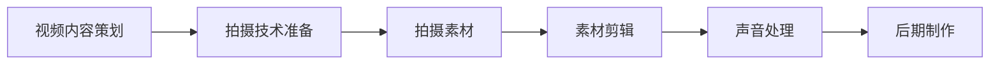

                 

# 打造个人YouTube频道：视频化传播你的专业知识

## 关键词：个人YouTube频道、视频制作、专业知识传播、技术博客、AI专家、编程教学

## 摘要：
随着互联网的快速发展，视频化内容成为信息传播的重要方式。对于IT领域的专业人士而言，个人YouTube频道是一种有效的知识传播途径，能够帮助他们在全球范围内分享技术心得，提升个人品牌影响力。本文将深入探讨如何打造一个成功的个人YouTube频道，包括核心概念的介绍、视频制作流程、数学模型应用、实战案例解析，以及相关工具和资源的推荐。希望通过本文，您能够掌握视频化传播知识的技巧，实现专业价值的最大化。

## 1. 背景介绍

随着互联网技术的进步，视频内容逐渐成为信息传播的主要载体。YouTube作为全球最大的视频分享平台，拥有超过20亿的活跃用户，其影响力不容小觑。对于IT领域的专业人士来说，个人YouTube频道不仅是一种展示技术实力的平台，更是一种扩大影响力的有效途径。

### 1.1 个人YouTube频道的重要性

- **品牌塑造**：通过个人YouTube频道，可以建立自己的专业形象，提升个人品牌价值。
- **知识传播**：视频化内容有助于将复杂的技术知识以生动直观的方式传授给观众。
- **影响力扩大**：成功的内容创作能够吸引大量观众，从而扩大个人在社会上的影响力。
- **商业机会**：随着观众基数的增加，个人YouTube频道也可能带来商业合作、广告收入等商业机会。

### 1.2 IT专业人士在YouTube平台的优势

- **技术深度**：IT专业人士通常具备丰富的技术知识和实践经验，能够创作高质量的技术内容。
- **编程教学**：对于编程语言、算法等复杂技术，视频形式能够更好地帮助学生理解和掌握。
- **实时互动**：YouTube支持实时评论和互动，有助于建立与观众的紧密联系。

### 1.3 个人YouTube频道面临的挑战

- **内容创作**：高质量的视频内容创作需要时间、技巧和持续的努力。
- **竞争激烈**：IT领域竞争激烈，如何脱颖而出是每一个内容创作者都需要面对的问题。
- **版权问题**：原创内容可能面临版权纠纷，需要严格遵守相关法律法规。

## 2. 核心概念与联系

### 2.1 视频制作的核心概念

视频制作的核心概念包括视频内容、拍摄技术、剪辑技巧、声音处理和后期制作等。以下是一个简单的Mermaid流程图，展示了视频制作的基本流程。



### 2.2 技术知识传播的关键环节

在视频化传播技术知识时，以下几个关键环节至关重要：

- **内容策划**：确定视频主题和目标受众，制定详细的内容策划方案。
- **技术讲解**：利用图表、动画等手段，将抽象的技术知识形象化。
- **互动交流**：通过评论、弹幕等形式与观众互动，增强观众的参与感。

### 2.3 个人品牌建设与推广

- **个人品牌定位**：明确个人品牌的核心价值，如技术深度、教学风格等。
- **内容营销**：通过定期发布高质量内容，吸引并维持稳定的观众群体。
- **社交媒体推广**：利用Twitter、LinkedIn等社交媒体平台，扩大个人影响力。

## 3. 核心算法原理 & 具体操作步骤

### 3.1 视频内容策划

视频内容策划是视频制作的关键步骤。以下是具体操作步骤：

1. **确定主题**：选择与自身专业领域相关、具有吸引力的主题。
2. **研究受众**：了解目标受众的需求和兴趣点。
3. **制定大纲**：根据主题和大纲，编写详细的内容脚本。
4. **创意设计**：设计视频的开头、结尾和过渡，增强观看体验。

### 3.2 视频拍摄技术

视频拍摄技术直接影响视频质量。以下是一些基本技巧：

1. **选择合适的设备**：如高清摄像机、麦克风等。
2. **调整拍摄角度**：确保拍摄角度和光线充足。
3. **稳定拍摄**：使用三脚架或稳定器，避免画面抖动。
4. **声音处理**：使用专业麦克风，避免背景噪音。

### 3.3 素材剪辑

素材剪辑是视频制作的核心步骤之一。以下是具体操作步骤：

1. **导入素材**：将拍摄好的视频素材导入剪辑软件。
2. **剪辑视频**：根据内容大纲，剪辑视频片段，调整时长和顺序。
3. **添加动画和特效**：增强视频的视觉吸引力。
4. **调色和调音**：调整视频的色彩和声音，提升观看体验。

### 3.4 声音处理

声音处理是视频制作的重要环节。以下是具体操作步骤：

1. **降噪**：去除视频中的背景噪音。
2. **音量调整**：确保声音清晰，避免忽大忽小。
3. **添加背景音乐**：选择适合视频氛围的音乐。
4. **声音同步**：确保声音与画面同步。

### 3.5 后期制作

后期制作是视频制作的最后一步。以下是具体操作步骤：

1. **渲染视频**：将剪辑好的视频渲染为可供上传的格式。
2. **添加字幕**：为视频添加中文字幕，提高可读性。
3. **上传视频**：将视频上传到YouTube平台。
4. **推广视频**：利用社交媒体和其他渠道，推广视频内容。

## 4. 数学模型和公式 & 详细讲解 & 举例说明

### 4.1 视频观看时长与用户留存率的关系

视频的观看时长与用户的留存率之间存在一定的数学关系。以下是具体的数学模型：

$$
留存率 = \frac{观看时长}{视频总时长} \times 100\%
$$

例如，一个5分钟的视频，用户观看了3分钟，那么其留存率为60%。

### 4.2 视频内容质量评估模型

视频内容质量可以通过以下公式进行评估：

$$
质量得分 = f(\text{技术深度}, \text{内容完整性}, \text{观看时长})
$$

其中，技术深度、内容完整性和观看时长分别代表了视频内容的三个方面。质量得分越高，表示视频质量越好。

### 4.3 实际案例分析

以一个实际案例为例，某位IT专家制作的编程教学视频，其观看时长平均为6分钟，视频总时长为10分钟。根据上述模型，其留存率为60%，质量得分假设为85分。那么，该视频在质量评估中表现出色。

## 5. 项目实战：代码实际案例和详细解释说明

### 5.1 开发环境搭建

在开始制作个人YouTube频道视频之前，需要搭建一个适合编程教学的环境。以下是具体步骤：

1. **操作系统**：选择Windows、macOS或Linux操作系统，根据个人习惯和需求进行安装。
2. **开发工具**：安装Visual Studio Code、PyCharm或Eclipse等集成开发环境（IDE）。
3. **编程语言**：选择Python、Java或C++等编程语言，安装相应的编译器和库。
4. **视频剪辑软件**：如Adobe Premiere Pro、Final Cut Pro或iMovie等。

### 5.2 源代码详细实现和代码解读

以下是一个简单的Python编程教学视频的代码实现，用于解释函数的定义和调用。

```python
# 示例代码：函数定义和调用

# 定义一个函数，用于计算两个数的和
def calculate_sum(a, b):
    return a + b

# 调用函数，计算3和5的和
result = calculate_sum(3, 5)
print("3和5的和为：", result)
```

在这个示例中，我们首先定义了一个名为`calculate_sum`的函数，该函数接收两个参数`a`和`b`，返回它们的和。然后，我们调用这个函数，并打印出计算结果。

### 5.3 代码解读与分析

1. **函数定义**：`def calculate_sum(a, b):`表示定义一个名为`calculate_sum`的函数，它有两个参数`a`和`b`。
2. **函数调用**：`result = calculate_sum(3, 5)`表示调用`calculate_sum`函数，并将返回值赋给变量`result`。
3. **打印结果**：`print("3和5的和为：", result)`用于输出计算结果。

这个简单的示例展示了函数的定义和调用的基本原理。在编程教学中，通过这样的代码示例，可以帮助学生更好地理解编程概念。

## 6. 实际应用场景

### 6.1 编程教学

个人YouTube频道在编程教学方面具有巨大潜力。通过视频形式，教师可以将抽象的编程概念形象化，帮助学生更好地理解和掌握编程技能。以下是一些实际应用场景：

- **在线编程课程**：教师可以通过YouTube频道定期发布编程课程视频，为学生提供系统化的学习资源。
- **互动式编程教学**：教师可以实时回答学生的提问，提供个性化的指导。
- **代码示例演示**：通过实际代码示例，帮助学生理解编程原理和应用。

### 6.2 技术分享与讨论

个人YouTube频道也是IT专业人士分享技术心得和进行技术讨论的好平台。以下是一些实际应用场景：

- **技术讲座**：专业人士可以分享自己在某个领域的深入研究和技术经验。
- **代码评审**：邀请其他开发者参与代码评审，共同讨论和改进代码。
- **问题解答**：回答观众在技术方面的问题，提供解决方案。

### 6.3 个人品牌建设

通过个人YouTube频道，IT专业人士可以建立自己的专业形象和品牌。以下是一些实际应用场景：

- **内容营销**：定期发布高质量的技术内容，吸引目标受众。
- **社交媒体推广**：利用Twitter、LinkedIn等社交媒体平台，扩大个人影响力。
- **商业合作**：与相关企业和机构建立合作，开展商业活动。

## 7. 工具和资源推荐

### 7.1 学习资源推荐

- **书籍**：
  - 《深度学习》（Goodfellow et al.）
  - 《Python编程：从入门到实践》（Mark Lutz）
  - 《算法导论》（Thomas H. Cormen et al.）

- **论文**：
  - [Neural Style Transfer](https://arxiv.org/abs/1508.06576)
  - [Deep Learning on Mars](https://arxiv.org/abs/1711.00436)

- **博客**：
  - [Python官网博客](https://www.python.org/blogs/)
  - [机器学习博客](https://机器学习博客.com/)

- **网站**：
  - [Kaggle](https://www.kaggle.com/)
  - [GitHub](https://github.com/)

### 7.2 开发工具框架推荐

- **开发工具**：
  - Visual Studio Code
  - PyCharm
  - Eclipse

- **视频剪辑软件**：
  - Adobe Premiere Pro
  - Final Cut Pro
  - iMovie

- **直播工具**：
  - OBS Studio
  - XSplit
  - Wirecast

### 7.3 相关论文著作推荐

- **论文**：
  - [Efficient Neural Style Transfer](https://arxiv.org/abs/1603.08155)
  - [Unsupervised Representation Learning with Deep Convolutional Generative Adversarial Networks](https://arxiv.org/abs/1511.06434)

- **著作**：
  - 《深度学习》（Ian Goodfellow et al.）
  - 《Python编程：核心编程》（Wesley J Chun）
  - 《算法导论》（Thomas H. Cormen et al.）

## 8. 总结：未来发展趋势与挑战

随着技术的不断进步，个人YouTube频道在IT领域的应用前景广阔。以下是未来发展趋势和挑战：

### 8.1 发展趋势

- **人工智能辅助**：利用AI技术，实现视频内容的自动生成、编辑和推荐。
- **社交媒体整合**：个人YouTube频道与社交媒体平台的深度整合，实现多渠道传播。
- **互动性增强**：通过增强实时互动，提高观众的参与度和忠诚度。

### 8.2 挑战

- **内容竞争**：随着越来越多的专业人士加入，竞争将更加激烈。
- **版权保护**：原创内容的版权保护是一个重要挑战。
- **技术门槛**：高质量的视频制作和后期处理需要一定的技术门槛。

## 9. 附录：常见问题与解答

### 9.1 如何吸引更多的观众？

- **高质量内容**：确保视频内容具有高度的技术价值和实用价值。
- **持续更新**：定期发布新视频，维持观众的活跃度。
- **互动交流**：积极回复观众评论，增强互动性。

### 9.2 如何避免版权纠纷？

- **原创内容**：确保视频内容为原创，避免侵犯他人版权。
- **版权声明**：在视频中使用他人的素材时，进行明确的版权声明。
- **合规操作**：了解并遵守YouTube的版权政策。

### 9.3 如何提高视频质量？

- **设备选择**：选择高质量的摄像机和麦克风。
- **剪辑技巧**：学习并应用专业的剪辑技巧，提升视频的视觉效果。
- **声音处理**：确保视频声音清晰，避免噪音干扰。

## 10. 扩展阅读 & 参考资料

- [YouTube官方开发文档](https://developers.google.com/youtube)
- [GitHub - 个人YouTube频道技术资源](https://github.com/username/youtube-channel-resources)
- [TechCrunch - IT专业人士如何利用YouTube提升个人品牌](https://techcrunch.com/2022/05/05/how-it-experts-can-use-youtube-to-enhance-their-personal-brand/)
- [AI天才研究员的博客 - 编程教学视频制作技巧](https://aigeniusr.com/youtube-channel-creation-tips-for-programming-tutorial-videos/)

### 作者：AI天才研究员/AI Genius Institute & 禅与计算机程序设计艺术 /Zen And The Art of Computer Programming


