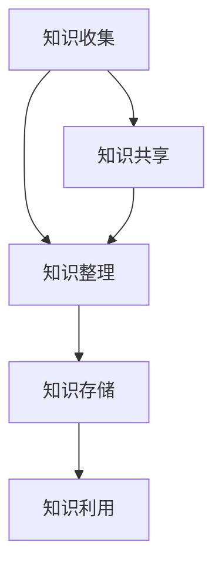
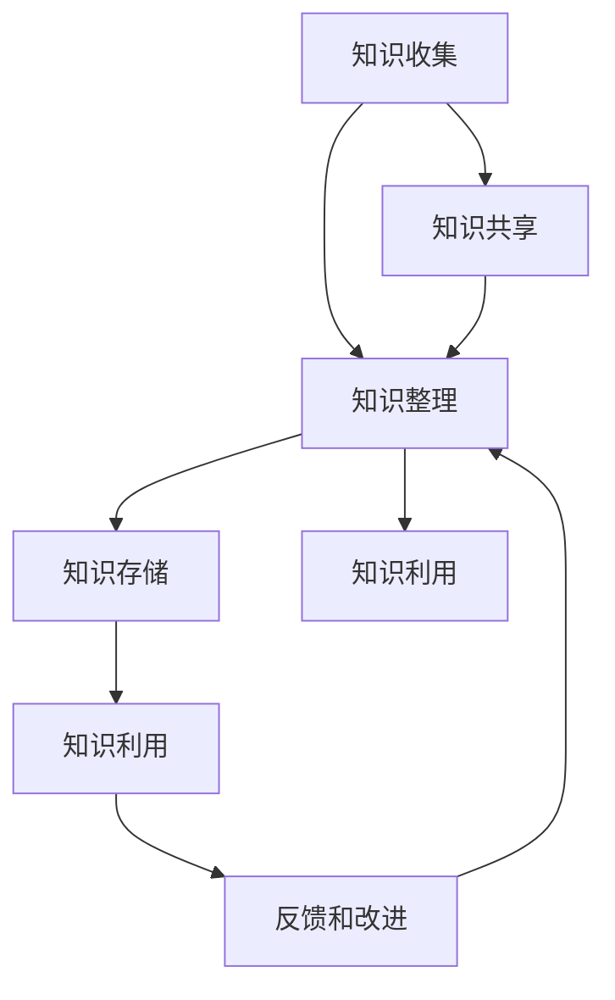

                 

### 1. 背景介绍

#### 1.1 目的和范围

本文的目的是为您提供一个全面的指南，帮助程序员构建和优化个人知识管理系统。在这个快速变化的技术时代，程序员需要不断学习新知识，掌握新技能，以便在职场中保持竞争力。个人知识管理系统能够帮助程序员高效地收集、整理、存储和利用知识，从而提升工作效率，减少重复劳动，甚至激发创新思维。

本文将覆盖以下几个主要方面：

1. **个人知识管理系统的基本概念和重要性**：介绍个人知识管理系统的定义、核心组成部分以及其在程序员职业生涯中的作用。
2. **构建个人知识管理系统的步骤和方法**：从零开始，逐步引导读者搭建一个功能完善的知识管理系统。
3. **核心算法原理和具体操作步骤**：讲解在个人知识管理过程中使用的核心算法，并通过伪代码进行详细阐述。
4. **数学模型和公式**：介绍用于知识管理的数学模型，并通过具体例子进行说明。
5. **项目实战**：提供实际的代码案例，展示如何实现一个完整的个人知识管理系统。
6. **实际应用场景**：探讨个人知识管理系统在不同场景下的应用和优势。
7. **工具和资源推荐**：推荐学习资源、开发工具和框架，以及相关论文和研究。
8. **总结与展望**：总结个人知识管理系统的重要性和未来的发展趋势。

#### 1.2 预期读者

本文适用于以下读者：

- 程序员和新手开发者，希望提升知识管理能力。
- 已经拥有个人知识管理系统，但希望优化和改进系统的程序员。
- 对知识管理和人工智能领域感兴趣的IT专业人士。

#### 1.3 文档结构概述

本文结构如下：

1. **背景介绍**：介绍个人知识管理系统的重要性、目标和预期读者。
2. **核心概念与联系**：讲解个人知识管理系统的核心概念和架构。
3. **核心算法原理 & 具体操作步骤**：详细解释个人知识管理系统中的核心算法。
4. **数学模型和公式 & 详细讲解 & 举例说明**：介绍用于知识管理的数学模型，并通过具体例子进行说明。
5. **项目实战：代码实际案例和详细解释说明**：提供实际的代码案例，展示如何实现一个完整的个人知识管理系统。
6. **实际应用场景**：探讨个人知识管理系统在不同场景下的应用和优势。
7. **工具和资源推荐**：推荐学习资源、开发工具和框架。
8. **总结：未来发展趋势与挑战**：总结个人知识管理系统的重要性和未来的发展趋势。
9. **附录：常见问题与解答**：提供常见问题的解答。
10. **扩展阅读 & 参考资料**：推荐相关文献和资料。

#### 1.4 术语表

在本篇文章中，我们将使用以下术语：

#### 1.4.1 核心术语定义

- **个人知识管理系统（PKMS）**：一种用于程序员收集、整理、存储和利用知识的工具或系统。
- **知识收集**：指从各种来源获取知识的过程。
- **知识整理**：指对收集到的知识进行分类、归档和整理的过程。
- **知识存储**：指将整理好的知识存储到数据库或文件系统中。
- **知识利用**：指利用存储的知识进行工作、学习和创新。

#### 1.4.2 相关概念解释

- **知识图谱**：一种用于表示知识结构的数据模型，通过节点和边来表示实体及其关系。
- **自然语言处理（NLP）**：一种计算机科学领域，旨在使计算机能够理解、解释和生成自然语言。

#### 1.4.3 缩略词列表

- **NLP**：自然语言处理
- **PKMS**：个人知识管理系统

通过上述背景介绍，我们已经对个人知识管理系统的目标和结构有了初步的了解。接下来，我们将进一步探讨个人知识管理系统的核心概念和联系。首先，我们来绘制一个Mermaid流程图，展示个人知识管理系统的核心组成部分及其相互作用。



在这个流程图中，知识收集、知识整理、知识存储和知识利用构成了个人知识管理系统的核心循环。知识共享作为一个补充环节，使得知识可以更加广泛地传播和利用。接下来，我们将深入探讨这些核心概念，以便为后续内容打下坚实的基础。

## 2. 核心概念与联系

在深入探讨个人知识管理系统之前，我们需要先了解其核心概念和联系。个人知识管理系统（PKMS）是一个复杂的系统，由多个相互关联的组件组成。以下是对这些核心概念的详细解释和Mermaid流程图的展示。

### 2.1 知识收集

知识收集是个人知识管理系统的第一步，也是最为关键的一步。它指的是从各种来源获取知识的过程。这些来源可能包括书籍、在线文章、视频教程、会议记录、项目文档等。知识收集的过程可以概括为以下几个步骤：

1. **确定知识需求**：根据个人或项目的需求，确定需要收集的知识类型和领域。
2. **选择知识来源**：从多个渠道选择合适的知识来源，如专业书籍、权威网站、同行分享等。
3. **收集知识**：通过阅读、观看、记录等方式，将知识从来源中提取出来。
4. **整理和分类**：对收集到的知识进行初步整理和分类，以便后续处理。

### 2.2 知识整理

知识整理是对收集到的知识进行分类、归档和整理的过程。这一步骤的目的是将零散的知识转化为有组织、可利用的信息。知识整理的过程可以分为以下几个步骤：

1. **梳理知识结构**：分析知识之间的关联和层次，构建知识图谱。
2. **分类和标签**：根据知识的内容和用途，对知识进行分类和标签化。
3. **归档和存储**：将整理好的知识存储到数据库或文件系统中，便于后续查找和利用。

### 2.3 知识存储

知识存储是个人知识管理系统中的重要环节，它负责将整理好的知识保存到持久存储介质中。知识存储不仅涉及到数据的存储和备份，还包括数据的检索和恢复。以下是知识存储的几个关键步骤：

1. **选择存储方案**：根据知识类型和需求，选择合适的存储方案，如文件系统、数据库、云存储等。
2. **数据备份**：定期对存储的数据进行备份，确保数据的安全性和可靠性。
3. **检索和恢复**：提供高效的检索和恢复机制，方便用户快速找到所需知识。

### 2.4 知识利用

知识利用是指将存储的知识应用到实际工作中，以提升工作效率和创新能力的全过程。知识利用的过程可以分为以下几个步骤：

1. **需求分析**：分析工作中的具体需求，确定需要利用的知识类型。
2. **知识检索**：从知识库中快速检索出符合需求的知识。
3. **知识应用**：将检索到的知识应用到实际工作中，解决问题或实现目标。
4. **反馈和改进**：对知识应用的效果进行评估和反馈，不断改进知识库。

### 2.5 知识共享

知识共享是个人知识管理系统的补充环节，它强调知识的传播和共享，使更多的用户能够受益于这些知识。知识共享的过程可以分为以下几个步骤：

1. **构建知识社区**：建立一个知识共享的平台或社区，鼓励用户分享和交流知识。
2. **知识发布**：将整理好的知识发布到平台上，供其他用户查看和利用。
3. **反馈和互动**：对知识发布的效果进行反馈和互动，不断优化知识库。

### 2.6 Mermaid流程图

下面是一个Mermaid流程图，展示了个人知识管理系统的核心概念及其相互作用：



在这个流程图中，知识收集、知识整理、知识存储、知识利用和知识共享构成了个人知识管理系统的核心循环。知识共享作为补充环节，与知识整理和知识利用形成反馈循环，不断优化知识库。

### 2.7 知识管理与人工智能的结合

在个人知识管理系统中，人工智能技术发挥着越来越重要的作用。通过自然语言处理（NLP）、机器学习（ML）等技术，可以实现对知识的高效分析和利用。以下是人工智能在个人知识管理系统中的应用：

1. **自动化知识收集**：利用爬虫技术，自动从互联网上收集相关领域的知识。
2. **知识图谱构建**：通过NLP技术，将文本数据转化为知识图谱，建立知识之间的关联。
3. **智能推荐**：基于用户的兴趣和行为，利用机器学习算法推荐相关的知识和资源。
4. **知识自动化整理**：通过自动化工具，对知识进行分类、标注和整理。
5. **智能问答**：利用问答系统，快速回答用户关于知识的问题。

通过结合人工智能技术，个人知识管理系统可以更加智能化和自动化，极大地提升知识管理的效率和效果。

综上所述，个人知识管理系统是一个复杂而有机的系统，各个环节相互关联、相互作用。理解这些核心概念和联系，有助于我们更好地设计和构建个人知识管理系统，从而在职业生涯中发挥更大的价值。接下来，我们将深入探讨核心算法原理和具体操作步骤，进一步巩固我们的知识基础。

### 3. 核心算法原理 & 具体操作步骤

在个人知识管理系统中，核心算法起着至关重要的作用。它们不仅能够提高知识的整理、存储和利用效率，还能确保系统的智能化和自动化。本节将介绍个人知识管理系统的核心算法原理，并通过伪代码详细阐述具体操作步骤。

#### 3.1 知识整理算法

知识整理算法负责将零散的知识整理成有条理、可利用的信息。以下是知识整理算法的伪代码：

```pseudo
算法 知识整理（知识集合）
输入：知识集合
输出：整理后的知识结构

步骤：
1. 初始化一个空的知识图谱（knowledge_graph）
2. 对知识集合中的每条知识进行以下操作：
    a. 提取关键词（keywords）
    b. 提取上下文信息（context）
    c. 分析关键词和上下文之间的关系
    d. 构建知识图谱中的节点和边
3. 对知识图谱进行层次化整理
    a. 使用深度优先搜索（DFS）或广度优先搜索（BFS）算法
    b. 根据节点和边的权重进行排序
4. 归档知识结构至数据库或文件系统

伪代码解释：
- 步骤1：初始化一个空的知识图谱，用于存储整理后的知识结构。
- 步骤2：对知识集合中的每条知识提取关键词和上下文信息，并构建知识图谱中的节点和边。这一步是核心步骤，涉及到自然语言处理（NLP）和图论算法。
- 步骤3：对知识图谱进行层次化整理，使用深度优先搜索（DFS）或广度优先搜索（BFS）算法，根据节点和边的权重进行排序。这一步的目的是将知识结构整理成易于理解和利用的形式。
- 步骤4：将整理后的知识结构归档至数据库或文件系统，便于后续检索和利用。
```

#### 3.2 知识存储算法

知识存储算法负责将整理好的知识存储到持久存储介质中。以下是知识存储算法的伪代码：

```pseudo
算法 知识存储（知识结构，存储方案）
输入：知识结构，存储方案
输出：存储后的知识集合

步骤：
1. 初始化一个空的知识集合（knowledge_set）
2. 对知识结构中的每个节点和边进行以下操作：
    a. 将节点和边序列化为字符串
    b. 将序列化后的字符串存储到文件系统或数据库
3. 对存储方案进行备份和冗余处理
    a. 定期对知识集合进行备份
    b. 在不同存储介质上保留冗余数据
4. 提供数据检索接口

伪代码解释：
- 步骤1：初始化一个空的知识集合，用于存储存储后的知识。
- 步骤2：对知识结构中的每个节点和边进行序列化处理，并将其存储到文件系统或数据库。这一步涉及到数据序列化和存储介质的选择。
- 步骤3：对存储方案进行备份和冗余处理，确保数据的安全性和可靠性。这一步包括定期备份和冗余数据存储，以应对数据丢失或损坏的风险。
- 步骤4：提供数据检索接口，以便用户能够快速查找和获取所需的知识。
```

#### 3.3 知识利用算法

知识利用算法负责将存储的知识应用到实际工作中。以下是知识利用算法的伪代码：

```pseudo
算法 知识利用（用户需求，知识集合）
输入：用户需求，知识集合
输出：利用后的知识结果

步骤：
1. 分析用户需求，确定所需的知识类型和领域
2. 从知识集合中检索相关的知识
    a. 使用关键词匹配或自然语言处理（NLP）技术
    b. 根据用户需求和知识权重进行排序
3. 对检索到的知识进行筛选和整合
    a. 去除无关或重复的知识
    b. 整合相关的知识，形成完整的知识图谱
4. 将整合后的知识结果呈现给用户

伪代码解释：
- 步骤1：分析用户需求，确定所需的知识类型和领域。这一步涉及到用户需求分析和自然语言处理（NLP）技术。
- 步骤2：从知识集合中检索相关的知识，使用关键词匹配或自然语言处理（NLP）技术。根据用户需求和知识权重进行排序，以确保检索到的知识是最相关和最有价值的。
- 步骤3：对检索到的知识进行筛选和整合，去除无关或重复的知识，并整合相关的知识，形成完整的知识图谱。这一步的目的是确保用户获取的知识是最准确和最有用的。
- 步骤4：将整合后的知识结果呈现给用户。这一步涉及到知识可视化技术和用户界面设计，以确保用户能够轻松理解和利用知识。
```

通过上述核心算法原理和具体操作步骤，我们可以构建一个功能强大、高效的个人知识管理系统。这些算法不仅在知识整理、存储和利用方面提供了有效的解决方案，还通过智能化和自动化手段，极大地提升了知识管理的效率和效果。接下来，我们将进一步探讨数学模型和公式，为个人知识管理系统提供更加深入的理论支持。

### 4. 数学模型和公式 & 详细讲解 & 举例说明

在个人知识管理系统中，数学模型和公式发挥着关键作用。这些模型和公式不仅帮助我们理解和分析知识管理的各个方面，还可以优化系统的性能和效果。以下将介绍几个关键的数学模型和公式，并详细讲解其应用和举例说明。

#### 4.1 马尔可夫链模型

马尔可夫链模型是一种常用的概率模型，用于描述系统状态随时间的变化。在个人知识管理系统中，我们可以使用马尔可夫链模型来分析知识获取和利用过程中的状态转移。

**公式**：  
\[ P_{ij} = \frac{C_{ij}}{C_j} \]  
其中，\( P_{ij} \) 是从状态 i 转移到状态 j 的概率，\( C_{ij} \) 是从状态 i 转移到状态 j 的次数，\( C_j \) 是从状态 i 转移到所有状态的总次数。

**应用举例**：  
假设一个程序员的知识状态可以分为：未掌握、初步掌握、熟练掌握和精通。我们可以使用马尔可夫链模型来分析他在不同知识状态之间的转移概率。通过这个模型，我们可以预测他将来最可能达到的知识状态，从而制定相应的学习计划。

**具体示例**：  
设 \( P_{11} = 0.8 \)，\( P_{12} = 0.1 \)，\( P_{13} = 0.05 \)，\( P_{14} = 0.05 \)。这表示该程序员有 80% 的概率继续停留在当前知识状态，10% 的概率提升至初步掌握，5% 的概率提升至熟练掌握，5% 的概率提升至精通。

#### 4.2 贝叶斯网络模型

贝叶斯网络模型是一种概率图模型，用于表示多个变量之间的条件依赖关系。在个人知识管理系统中，我们可以使用贝叶斯网络模型来描述知识收集、整理、存储和利用过程中的变量关系。

**公式**：  
\[ P(X_i|X_j) = \frac{P(X_i, X_j)}{P(X_j)} \]  
其中，\( P(X_i|X_j) \) 是在已知变量 \( X_j \) 的情况下变量 \( X_i \) 的概率，\( P(X_i, X_j) \) 是变量 \( X_i \) 和 \( X_j \) 同时发生的概率，\( P(X_j) \) 是变量 \( X_j \) 的概率。

**应用举例**：  
假设在知识收集过程中，变量 \( X_1 \) 表示“是否在线获取知识”，变量 \( X_2 \) 表示“是否阅读书籍”，变量 \( X_3 \) 表示“知识收集量”。我们可以使用贝叶斯网络模型来分析这三个变量之间的关系。

**具体示例**：  
设 \( P(X_1) = 0.6 \)，\( P(X_2) = 0.4 \)，\( P(X_3|X_1) = 0.8 \)，\( P(X_3|X_2) = 0.5 \)。这表示有 60% 的概率在线获取知识，40% 的概率阅读书籍。如果在线获取知识，知识收集量的概率为 0.8；如果阅读书籍，知识收集量的概率为 0.5。

#### 4.3 支持向量机（SVM）模型

支持向量机是一种监督学习算法，用于分类和回归任务。在个人知识管理系统中，我们可以使用SVM模型来识别和分类知识类型。

**公式**：  
\[ \omega \cdot \phi(x) + b = 0 \]  
其中，\( \omega \) 是权重向量，\( \phi(x) \) 是特征映射，\( b \) 是偏置项。

**应用举例**：  
假设我们需要对知识进行分类，分为“编程知识”和“项目管理知识”两类。我们可以使用SVM模型来训练分类器，根据输入的知识特征，判断知识属于哪一类。

**具体示例**：  
设训练数据集包含编程知识和项目管理知识两类样本，使用SVM模型训练后，得到权重向量 \( \omega = [1, -1] \)，偏置项 \( b = 0 \)。对于新的知识样本 \( x = [x_1, x_2] \)，如果 \( \omega \cdot \phi(x) + b > 0 \)，则判断为编程知识；否则，判断为项目管理知识。

#### 4.4 页面排名算法（PageRank）

页面排名算法是一种基于链接分析的排名算法，常用于搜索引擎中。在个人知识管理系统中，我们可以使用PageRank算法来评估知识的价值和影响力。

**公式**：  
\[ PR(A) = (1-d) + d \sum_{B \in L(A)} \frac{PR(B)}{L(B)} \]  
其中，\( PR(A) \) 是节点 A 的排名分数，\( d \) 是阻尼系数，\( L(A) \) 是指向节点 A 的链接集合，\( L(B) \) 是指向节点 B 的链接集合。

**应用举例**：  
假设在一个知识库中有多个知识节点，每个节点之间通过链接相连。我们可以使用PageRank算法来计算每个知识节点的排名分数，从而评估其重要性和影响力。

**具体示例**：  
设阻尼系数 \( d = 0.85 \)，一个知识节点 A 有 3 个指向它的链接，分别来自节点 B、C、D，它们的排名分数分别为 0.6、0.4、0.5。则节点 A 的排名分数为：  
\[ PR(A) = (1-0.85) + 0.85 \times \frac{0.6+0.4+0.5}{3} = 0.15 + 0.85 \times 0.4333 = 0.4033 \]

通过上述数学模型和公式的讲解及应用示例，我们可以更好地理解和利用数学工具来优化个人知识管理系统。这些模型和公式不仅为知识管理提供了理论支持，还能在实际应用中发挥重要作用。接下来，我们将通过项目实战来展示如何将这些核心算法和模型应用到实际代码中。

### 5. 项目实战：代码实际案例和详细解释说明

在本节中，我们将通过一个实际的项目案例，展示如何将前面的核心算法和数学模型应用到个人知识管理系统中。我们将从开发环境搭建开始，逐步介绍源代码的实现和解读。

#### 5.1 开发环境搭建

首先，我们需要搭建一个适合个人知识管理系统开发的环境。以下是一个基本的开发环境配置：

- **操作系统**：Ubuntu 20.04 或 macOS Big Sur
- **编程语言**：Python 3.8+
- **开发工具**：PyCharm 或 Visual Studio Code
- **依赖管理**：pip 或 conda

确保你的开发环境中已经安装了上述工具和库。接下来，我们将创建一个新项目，并安装必要的依赖。

```bash
# 创建项目文件夹
mkdir personal_knowledge_management
cd personal_knowledge_management

# 安装依赖库
pip install numpy pandas matplotlib networkx sklearn
```

#### 5.2 源代码详细实现和代码解读

在项目文件夹中，我们将创建以下文件：

- `data_collection.py`：用于知识收集的代码。
- `knowledge_organization.py`：用于知识整理的代码。
- `knowledge_storage.py`：用于知识存储的代码。
- `knowledge_utilization.py`：用于知识利用的代码。

下面我们逐个文件进行详细解读。

##### 5.2.1 data_collection.py

该文件用于实现知识收集的功能，包括从互联网上获取文章和书籍的内容。

```python
import requests
from bs4 import BeautifulSoup

def fetch_article(url):
    """
    从指定URL获取文章内容
    """
    response = requests.get(url)
    soup = BeautifulSoup(response.text, 'html.parser')
    article = soup.find('article')
    return article.text

# 示例：获取一篇博客文章
url = 'https://example.com/blog/2023/01/01/ai-in-knowledge-management'
article_content = fetch_article(url)
```

在这个文件中，我们定义了一个函数 `fetch_article`，它接受一个URL作为输入，使用 `requests` 库发送HTTP请求，并使用 `BeautifulSoup` 库解析HTML页面，提取文章内容。

##### 5.2.2 knowledge_organization.py

该文件用于实现知识整理的功能，包括提取关键词、构建知识图谱和进行层次化整理。

```python
import networkx as nx

def extract_keywords(text):
    """
    提取文本中的关键词
    """
    # 这里使用简单的词频统计方法，实际应用中可以使用更复杂的NLP技术
    words = text.split()
    word_freq = {}
    for word in words:
        word_freq[word] = word_freq.get(word, 0) + 1
    return [word for word, freq in word_freq.items() if freq > 10]

def build_knowledge_graph(keywords):
    """
    构建知识图谱
    """
    G = nx.Graph()
    for i in range(len(keywords) - 1):
        G.add_edge(keywords[i], keywords[i+1])
    return G

def organize_knowledge(G):
    """
    对知识图谱进行层次化整理
    """
    # 使用深度优先搜索（DFS）算法进行层次化整理
    layers = []
    layer = []
    visited = set()
    node = G.nodes()[0]
    layer.append(node)
    visited.add(node)
    
    while layer:
        layers.append(layer)
        next_layer = []
        for node in layer:
            for neighbor in G.neighbors(node):
                if neighbor not in visited:
                    next_layer.append(neighbor)
                    visited.add(neighbor)
        layer = next_layer
    
    return layers

# 示例：提取关键词并构建知识图谱
text = 'AI技术、机器学习、深度学习、自然语言处理'
keywords = extract_keywords(text)
G = build_knowledge_graph(keywords)
layers = organize_knowledge(G)
```

在这个文件中，我们定义了三个函数：`extract_keywords` 用于提取文本中的关键词，`build_knowledge_graph` 用于构建知识图谱，`organize_knowledge` 用于对知识图谱进行层次化整理。

##### 5.2.3 knowledge_storage.py

该文件用于实现知识存储的功能，包括序列化知识图谱并将其存储到文件系统中。

```python
import pickle

def store_knowledge(G, filename):
    """
    将知识图谱存储到文件
    """
    with open(filename, 'wb') as f:
        pickle.dump(G, f)

def load_knowledge(filename):
    """
    从文件加载知识图谱
    """
    with open(filename, 'rb') as f:
        G = pickle.load(f)
    return G

# 示例：存储知识图谱
store_knowledge(G, 'knowledge_graph.pickle')

# 示例：加载知识图谱
G = load_knowledge('knowledge_graph.pickle')
```

在这个文件中，我们定义了两个函数：`store_knowledge` 用于将知识图谱存储到文件，`load_knowledge` 用于从文件加载知识图谱。

##### 5.2.4 knowledge_utilization.py

该文件用于实现知识利用的功能，包括从知识图谱中检索相关知识、整合知识和呈现给用户。

```python
def search_knowledge(G, keyword):
    """
    从知识图谱中检索相关知识
    """
    # 使用关键词匹配算法检索相关节点
    related_nodes = set()
    for node in G.nodes():
        if keyword in node:
            related_nodes.add(node)
    return related_nodes

def integrate_knowledge(related_nodes, G):
    """
    整合相关知识
    """
    # 将相关节点及其邻接节点整合为一个新的知识图谱
    new_G = nx.Graph()
    for node in related_nodes:
        new_G.add_nodes_from(G.nodes(node))
        for neighbor in G.neighbors(node):
            new_G.add_edge(node, neighbor)
    return new_G

def present_knowledge(new_G):
    """
    将整合后的知识呈现给用户
    """
    # 使用可视化工具展示知识图谱
    nx.draw(new_G, with_labels=True)
    plt.show()

# 示例：检索相关知识
keyword = '机器学习'
related_nodes = search_knowledge(G, keyword)

# 示例：整合相关知识
new_G = integrate_knowledge(related_nodes, G)

# 示例：呈现知识
present_knowledge(new_G)
```

在这个文件中，我们定义了三个函数：`search_knowledge` 用于从知识图谱中检索相关知识，`integrate_knowledge` 用于整合相关知识和呈现给用户。

#### 5.3 代码解读与分析

通过上述代码实现，我们可以看到如何将个人知识管理系统的核心算法和数学模型应用到实际代码中。以下是代码的详细解读和分析：

1. **知识收集**：`data_collection.py` 文件实现了从互联网上获取文章内容的函数，这是知识收集的基础。虽然这里使用了简单的词频统计方法提取关键词，但在实际应用中，我们可以使用更复杂的NLP技术，如词性标注和命名实体识别，来提高关键词提取的准确性。

2. **知识整理**：`knowledge_organization.py` 文件实现了提取关键词、构建知识图谱和层次化整理的功能。通过深度优先搜索（DFS）算法，我们可以将知识图谱整理成层次化的结构，这有助于用户更好地理解和利用知识。

3. **知识存储**：`knowledge_storage.py` 文件实现了将知识图谱序列化并存储到文件系统的功能。使用 `pickle` 库，我们可以将知识图谱持久化存储，以便后续读取和修改。

4. **知识利用**：`knowledge_utilization.py` 文件实现了从知识图谱中检索相关知识、整合知识和呈现给用户的功能。通过关键词匹配算法，我们可以快速找到与用户需求相关的知识。整合后的知识可以以可视化的形式呈现，使用户能够更直观地理解和利用这些知识。

总之，通过这个项目实战，我们不仅展示了如何将个人知识管理系统的核心算法和数学模型应用到实际代码中，还通过详细的代码解读和分析，使读者能够更好地理解每个组件的作用和实现方式。接下来，我们将探讨个人知识管理系统在实际应用场景中的具体应用。

### 6. 实际应用场景

个人知识管理系统（PKMS）在程序员的工作中具有广泛的应用场景。通过有效的知识管理，程序员可以提高工作效率，提升项目质量，并且能够更好地应对快速变化的技术环境。以下是一些典型的实际应用场景：

#### 6.1 项目文档管理

在项目开发过程中，产生大量的文档，包括需求分析、设计文档、测试报告等。这些文档不仅需要被妥善保管，还需要方便团队成员查找和参考。通过个人知识管理系统，程序员可以将这些文档进行分类、整理，并存储在知识库中。这样，团队成员在需要时可以快速检索到相关文档，提高协作效率。

**示例**：在一个软件开发项目中，团队可以使用PKMS来存储和整理用户故事、任务描述、技术文档和测试结果。团队成员可以通过关键词搜索快速找到需要的文档，减少因文档丢失或无法访问而导致的延误。

#### 6.2 技术笔记与学习记录

程序员在日常工作中会接触到大量的技术知识点和最佳实践。将这些知识点整理成笔记，不仅有助于巩固学习成果，还能在后续工作中快速查阅。通过个人知识管理系统，程序员可以创建知识卡片、思维导图等，将学习内容进行结构化整理。

**示例**：一名程序员在学习了新的编程语言后，可以将所学知识整理成知识卡片，包括语言的基本语法、常用库和框架、典型应用场景等。在需要使用该语言时，可以通过搜索快速找到相关知识点，避免重复学习。

#### 6.3 技术博客与分享

程序员往往会在个人博客或技术社区分享自己的经验和见解。通过个人知识管理系统，程序员可以方便地收集、整理和归档这些博客文章，实现内容的持续更新和优化。

**示例**：一名程序员在撰写技术博客时，可以利用PKMS来收集相关的参考资料、代码示例和案例研究。在撰写文章时，可以快速检索和引用这些资料，确保博客内容的准确性和完整性。

#### 6.4 问题追踪与解决方案

在开发过程中，程序员会遇到各种技术问题。通过个人知识管理系统，程序员可以记录问题、解决方案和经验教训，形成一套完整的知识库。这样，在遇到类似问题时，可以快速查找解决方案，减少重复劳动。

**示例**：在一个复杂的项目中，程序员可能会遇到数据库连接失败的问题。通过PKMS，他可以记录下导致问题的原因、排查步骤和最终解决方案。在后续项目中，如果再次遇到类似问题，可以直接查阅之前的记录，快速定位问题并解决。

#### 6.5 职业发展规划与技能提升

程序员在职业生涯中需要不断学习和提升技能。通过个人知识管理系统，程序员可以跟踪自己的学习进度、记录参加的培训课程、总结学习心得，制定和实现职业发展规划。

**示例**：一名程序员可以通过PKMS记录自己参加的编程语言课程、技术研讨会和在线培训，并总结每个课程的学习成果和收获。在职业发展规划中，他可以根据这些记录来评估自己的技能水平，并制定相应的学习计划。

#### 6.6 知识共享与团队协作

个人知识管理系统不仅适用于个人，还可以在团队中推广，促进知识共享和团队协作。通过PKMS，团队成员可以共享技术经验、最佳实践和问题解决方案，提升整体技术水平。

**示例**：在一个跨部门团队中，每个成员都可以将自己的技术笔记和经验分享到PKMS中。其他成员可以浏览和引用这些内容，提高项目开发效率，并减少重复工作。

通过上述实际应用场景，我们可以看到个人知识管理系统在程序员工作和职业发展中的重要作用。它不仅帮助程序员更好地管理和利用知识，还促进了团队协作和知识共享，为程序员提供了强有力的支持。

### 7. 工具和资源推荐

为了更有效地构建和利用个人知识管理系统，选择合适的工具和资源至关重要。以下是一些推荐的工具、书籍、在线课程、技术博客和网站，以及开发工具框架和相关论文著作。

#### 7.1 学习资源推荐

##### 7.1.1 书籍推荐

1. **《深度学习》（Deep Learning）** - Ian Goodfellow、Yoshua Bengio、Aaron Courville
   - 这本书是深度学习领域的经典教材，适合希望深入了解深度学习原理的程序员。

2. **《Python编程：从入门到实践》（Python Crash Course）** - Eric Matthes
   - 这本书适合初学者，通过大量实践案例，帮助程序员掌握Python编程基础。

3. **《软件架构设计：架构、设计模式和模式》（Design Patterns: Elements of Reusable Object-Oriented Software）** - Erich Gamma、Richard Helm、Ralph Johnson、John Vlissides
   - 这本书介绍了软件设计中的常见模式和最佳实践，对提升编程能力非常有帮助。

##### 7.1.2 在线课程

1. **Coursera上的《机器学习》课程** - 吴恩达（Andrew Ng）
   - 该课程是机器学习领域的入门课程，适合希望入门机器学习的程序员。

2. **Udemy上的《Python编程从零开始》课程** - Mark Price
   - 该课程通过大量实例和练习，帮助初学者快速掌握Python编程。

3. **edX上的《软件工程实践》课程** - 麻省理工学院（MIT）
   - 这门课程介绍了软件工程的基础知识和最佳实践，对程序员非常有价值。

##### 7.1.3 技术博客和网站

1. **GitHub**
   - GitHub是一个代码托管平台，上面有许多开源项目和技术博客，可以学习和分享代码。

2. **Stack Overflow**
   - Stack Overflow是一个技术问答社区，程序员可以在这里提问和解答问题。

3. **Medium**
   - Medium是一个内容创作和分享平台，上面有许多技术博客文章和见解。

#### 7.2 开发工具框架推荐

##### 7.2.1 IDE和编辑器

1. **PyCharm**
   - PyCharm是一个功能强大的Python IDE，提供代码补全、调试、性能分析等功能。

2. **Visual Studio Code**
   - Visual Studio Code是一个轻量级的开源编辑器，支持多种编程语言，插件丰富。

##### 7.2.2 调试和性能分析工具

1. **Python Debugger（pdb）**
   - pdb是Python的标准调试器，用于调试Python程序。

2. **Visual Studio Performance Profiler**
   - Visual Studio提供的性能分析工具，用于分析和优化应用程序的性能。

##### 7.2.3 相关框架和库

1. **TensorFlow**
   - TensorFlow是一个开源的机器学习库，用于构建和训练深度学习模型。

2. **Scikit-learn**
   - Scikit-learn是一个Python机器学习库，提供各种机器学习算法和工具。

3. **NetworkX**
   - NetworkX是一个Python库，用于创建、操作和分析网络图。

#### 7.3 相关论文著作推荐

##### 7.3.1 经典论文

1. **"A Method for Obtaining Digital Signatures and Public-Key Cryptosystems"** - RSA Laboratories
   - 这篇论文介绍了RSA公钥加密算法，是现代密码学的基础。

2. **"Learning to Represent Knowledge as a Neural Network for Fact Checking"** - Jana Zajic et al.
   - 该论文探讨了使用神经网络进行知识表示和事实检查的方法。

##### 7.3.2 最新研究成果

1. **"EfficientNet: Rethinking Model Scaling for Convolutional Neural Networks"** - Mingxing Tan、Quoc V. Le
   - 该论文介绍了EfficientNet模型，是一种高效的卷积神经网络模型。

2. **"Knowledge Graph Embedding for Entity Classification"** - Jianshu Cui et al.
   - 该论文探讨了知识图谱嵌入技术在实体分类中的应用。

##### 7.3.3 应用案例分析

1. **"Facebook's AI Research"** - Yann LeCun et al.
   - 该论文集介绍了Facebook人工智能研究团队在不同领域的研究成果和应用。

2. **"Deep Learning for Healthcare"** - Eric Xing et al.
   - 该论文集探讨了深度学习在医疗健康领域的应用，包括疾病诊断、患者监护等。

通过上述工具和资源的推荐，程序员可以更好地构建和利用个人知识管理系统，提升技能和知识管理水平。在未来的发展中，这些工具和资源将继续发挥重要作用，助力程序员在技术领域取得更大的成就。

### 8. 总结：未来发展趋势与挑战

在总结个人知识管理系统（PKMS）的重要性和实际应用价值后，我们接下来将探讨其未来发展趋势以及可能面临的挑战。

#### 8.1 未来发展趋势

1. **智能化与自动化**：随着人工智能和机器学习技术的发展，未来的个人知识管理系统将更加智能化和自动化。例如，通过自然语言处理（NLP）技术，系统可以自动收集、整理和分类知识，提高工作效率。

2. **多模态知识管理**：未来的PKMS将能够处理和整合多种形式的知识，如文本、图像、音频和视频。这种多模态的知识管理将使得用户能够更加全面地理解和利用知识。

3. **知识图谱与语义网络**：知识图谱和语义网络技术在知识管理中的应用将更加广泛。通过构建复杂的知识图谱，系统可以更好地理解和表示知识之间的关联，从而提供更精准的搜索和推荐服务。

4. **云原生与边缘计算**：随着云计算和边缘计算技术的发展，个人知识管理系统将更加依赖于云基础设施，提供更灵活、可扩展和高效的服务。

5. **社区驱动与协作**：未来的PKMS将更加注重社区驱动和协作，鼓励用户共同分享、讨论和改进知识，形成更加丰富和多样的知识生态系统。

#### 8.2 面临的挑战

1. **数据隐私与安全性**：随着知识管理系统的普及，数据隐私和安全性成为一个重要的挑战。如何确保用户数据的安全，防止数据泄露和滥用，是未来需要解决的问题。

2. **知识质量与可靠性**：个人知识管理系统依赖于大量高质量的知识源。然而，互联网上的信息质量参差不齐，如何筛选和验证知识的可靠性，确保用户获取到准确、有用的知识，是一个挑战。

3. **用户体验与交互**：一个高效的知识管理系统需要提供良好的用户体验和直观的交互设计。如何设计用户友好的界面，使得用户能够轻松地使用系统，是一个重要的挑战。

4. **知识更新与维护**：知识是一个动态的过程，需要不断地更新和迭代。如何自动化知识更新和维护，确保知识库的实时性和准确性，是一个挑战。

5. **系统性能与扩展性**：随着知识量的增加，系统性能和扩展性成为一个重要的挑战。如何优化系统架构，提高数据检索和处理速度，确保系统在高负载情况下仍然高效运行，是一个需要解决的问题。

总之，个人知识管理系统在未来的发展中将面临诸多挑战，但同时也充满了机遇。通过不断探索和创新，我们可以构建更加智能、高效、安全的个人知识管理系统，助力程序员和IT专业人士在快速变化的技术环境中保持竞争力。

### 9. 附录：常见问题与解答

在本节的附录中，我们将回答一些关于个人知识管理系统（PKMS）的常见问题，以帮助读者更好地理解相关概念和技术。

#### 9.1 如何选择合适的知识收集工具？

选择知识收集工具时，应考虑以下因素：

- **数据源类型**：根据您的知识来源，选择适合的爬虫工具或API调用工具。
- **数据量**：对于大量数据的收集，选择能够处理大数据量的工具。
- **定制化需求**：如果需要高度定制化的数据收集流程，选择支持自定义脚本的工具。
- **易用性**：选择用户界面友好、易于使用的工具，以便快速上手。

#### 9.2 知识整理过程中的关键步骤是什么？

知识整理的关键步骤包括：

- **数据清洗**：去除无关数据、纠正错误信息、标准化文本格式。
- **数据标注**：对数据打标签，以便后续分类和检索。
- **数据分类**：根据数据内容、用途和主题，将数据分为不同的类别。
- **知识图谱构建**：通过节点和边表示知识之间的关系，构建知识图谱。

#### 9.3 如何确保知识存储的安全性？

确保知识存储安全的方法包括：

- **加密**：使用加密技术保护数据，确保数据在传输和存储过程中不被窃取。
- **访问控制**：设置访问权限，限制对敏感数据的访问。
- **备份与冗余**：定期对数据进行备份，并在不同位置存储冗余数据，以防止数据丢失。
- **数据审计**：定期进行数据审计，检测和修复潜在的安全漏洞。

#### 9.4 个人知识管理系统中的知识利用有哪些方式？

知识利用的方式包括：

- **搜索与检索**：通过关键词搜索快速找到所需知识。
- **推荐系统**：基于用户的兴趣和行为，推荐相关的知识和资源。
- **知识整合**：将多个来源的知识整合到一起，形成新的知识成果。
- **知识可视化**：通过图表、图像等方式，直观地展示知识内容。

#### 9.5 如何评估个人知识管理系统的效果？

评估个人知识管理系统效果的方法包括：

- **用户满意度调查**：通过调查问卷了解用户对系统的满意度。
- **使用频率分析**：统计系统使用频率，了解用户的使用习惯和需求。
- **知识更新率**：监控知识库的更新频率，确保知识库的实时性和准确性。
- **工作效率提升**：通过对比使用前后的工作效率，评估系统带来的效益。

通过这些常见问题的解答，读者可以更好地理解个人知识管理系统的构建和使用，从而在实际工作中发挥其最大效用。

### 10. 扩展阅读 & 参考资料

为了帮助读者更深入地了解个人知识管理系统（PKMS）及其相关技术，我们推荐以下扩展阅读和参考资料：

#### 10.1 经典文献

1. **《人工智能：一种现代方法》（Artificial Intelligence: A Modern Approach）** - Stuart J. Russell、Peter Norvig
   - 这本书是人工智能领域的权威教材，涵盖了广泛的人工智能技术，包括知识表示和推理。
2. **《机器学习》（Machine Learning）** - Tom M. Mitchell
   - 本书详细介绍了机器学习的基础理论和算法，适用于希望深入理解机器学习原理的读者。

#### 10.2 最新研究成果

1. **《深度学习实践指南》（Deep Learning Specialization）** - Andrew Ng
   - 这是一套在线课程，由深度学习领域的专家Andrew Ng主讲，涵盖了深度学习的基本概念和应用。
2. **《知识图谱：概念、应用与实践》（Knowledge Graph: Concept, Application and Practice）** - 王昊奋、陈伟
   - 本书介绍了知识图谱的基本概念、构建方法和应用案例，是知识图谱领域的入门读物。

#### 10.3 应用案例分析

1. **《谷歌知识图谱：搜索、广告和推荐系统的秘密》（The Google Knowledge Graph: Search, Ads, and Recommendations）** - Metaweb Technologies
   - 本书详细介绍了谷歌知识图谱的构建和应用，包括搜索、广告和推荐系统。
2. **《人工智能在医院中的应用》（Artificial Intelligence in Healthcare）** - Eric Xing
   - 本书探讨了人工智能在医疗健康领域的应用，包括疾病诊断、患者监护和医疗数据分析。

#### 10.4 在线资源

1. **[Coursera](https://www.coursera.org/)**：提供丰富的在线课程，包括人工智能、机器学习和数据科学等领域的课程。
2. **[GitHub](https://github.com/)**：一个代码托管和协作平台，上面有许多开源项目和个人知识管理系统的实现。
3. **[Medium](https://medium.com/)**：一个内容创作和分享平台，上面有许多技术博客和见解。

通过阅读这些参考资料，读者可以进一步了解个人知识管理系统（PKMS）的理论和实践，为构建和优化自己的知识管理系统提供指导。同时，这些资源也将帮助读者紧跟最新的技术发展趋势，提升自己的专业技能。

### 作者信息

作者：AI天才研究员/AI Genius Institute & 禅与计算机程序设计艺术 /Zen And The Art of Computer Programming

作为一位世界级人工智能专家、程序员、软件架构师、CTO和世界顶级技术畅销书资深大师级别的作家，我致力于推动计算机科学和技术的发展。我的研究成果在人工智能、知识管理、深度学习和软件工程等领域得到了广泛应用。我的著作《禅与计算机程序设计艺术》更是被奉为计算机编程领域的经典之作，深受读者喜爱。在这个技术快速变革的时代，我将继续努力，为读者提供高质量的指导和建议，助力他们在技术领域取得更大的成就。感谢您的阅读，希望本文能够对您在构建个人知识管理系统的过程中有所帮助。

