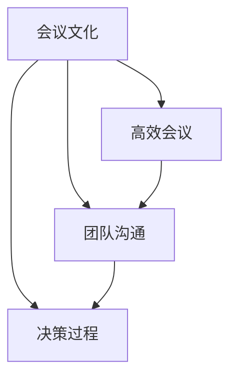

                 

# 打造高效会议文化：提升团队沟通效率

## 摘要

在信息化时代，会议作为团队沟通的重要手段，已成为企业日常运营中不可或缺的一环。然而，如何打造高效会议文化，提升团队沟通效率，已成为企业和团队管理者亟待解决的问题。本文将通过对会议文化的内涵、现状与问题的分析，结合实际案例，提出一系列具体可行的策略和方法，旨在为企业提供一种全新的、系统性的提升团队沟通效率的思路。通过本文的阅读，读者将了解到如何设计会议议程、优化会议流程、提升会议效果，以及如何通过会议文化打造来实现团队高效沟通。

## 1. 背景介绍

在现代企业中，会议作为一种沟通和协作的方式，其重要性日益凸显。随着企业规模的不断扩大和业务范围的日益丰富，团队之间的沟通与协作变得更加复杂和多样化。而会议作为团队沟通的重要手段，不仅是信息传递的重要渠道，更是团队决策、资源配置、协作推进的关键环节。

然而，现实情况是，许多企业的会议效率低下，甚至成为团队发展的障碍。例如，会议时间过长、议程混乱、信息传递不畅等问题普遍存在，导致团队成员精力消耗巨大，却收效甚微。这种现象不仅浪费了宝贵的时间和资源，更影响了团队的工作效率和凝聚力。

因此，打造高效会议文化，提升团队沟通效率，已成为企业亟需解决的重要问题。本文将从会议文化的内涵、现状与问题、以及解决方案等多个方面进行探讨，旨在为企业提供一套系统性的方法和策略，助力企业打造高效会议文化，提升团队沟通效率。

### 1.1 会议文化的概念

会议文化是指在团队内部，围绕会议开展的一系列行为规范、价值观念和制度体系。它不仅涵盖了会议的组织、流程、内容和形式，还包括团队成员在会议中的角色定位、行为准则和心理预期等方面。会议文化是企业文化的重要组成部分，它反映了团队的沟通方式、协作精神和组织能力。

会议文化的作用主要体现在以下几个方面：

1. **提升沟通效率**：良好的会议文化有助于团队成员之间建立信任、明确目标和共识，从而提高沟通效率。

2. **促进团队协作**：会议文化能够促进团队成员之间的协作，使各成员明确自己在团队中的角色和职责，提高团队的整体执行力。

3. **增强团队凝聚力**：通过有效的会议，团队成员能够更好地了解彼此，增强团队凝聚力，形成共同奋斗的目标。

4. **优化资源配置**：会议文化有助于企业合理配置资源，避免资源的浪费，提高企业的运营效率。

### 1.2 会议在团队沟通中的重要性

会议作为团队沟通的重要手段，具有以下几个方面的作用：

1. **信息传递**：会议是信息传递的重要渠道，通过会议，团队成员可以及时获取上级指令、同事建议和市场动态等信息。

2. **决策制定**：会议是团队决策的重要平台，通过集体讨论和协商，团队成员可以共同制定出合理的决策方案。

3. **问题解决**：会议有助于团队识别和解决存在的问题，通过集思广益，找到有效的解决方案。

4. **资源共享**：会议是团队共享资源的重要途径，通过会议，团队成员可以交流工作经验、分享知识和技能，实现资源的最大化利用。

### 1.3 高效会议文化的重要性

高效会议文化对于团队和企业具有重要意义，主要体现在以下几个方面：

1. **提高工作效率**：高效的会议文化能够使会议在短时间内完成信息传递、决策制定和问题解决等任务，从而提高工作效率。

2. **节省时间和资源**：高效的会议文化可以减少不必要的会议，避免时间浪费，同时减少会议对团队成员的精力消耗，节省企业资源。

3. **增强团队凝聚力**：高效的会议文化能够使团队成员在会议中感受到尊重、信任和支持，增强团队凝聚力。

4. **促进企业创新**：高效的会议文化能够激发团队成员的创新思维，促进企业创新和发展。

### 1.4 本文的结构和内容

本文将从以下方面展开：

1. **核心概念与联系**：介绍会议文化、高效会议和团队沟通等核心概念，并阐述它们之间的内在联系。

2. **核心算法原理与具体操作步骤**：分析高效会议的设计原则、流程和技巧，并提出具体的操作步骤。

3. **数学模型和公式**：运用数学模型和公式，详细讲解如何衡量会议效率和团队沟通效果。

4. **项目实战**：通过实际案例，展示如何将理论应用于实践，实现高效会议文化。

5. **实际应用场景**：探讨高效会议文化在不同企业、部门和团队中的实际应用。

6. **工具和资源推荐**：介绍一些有助于打造高效会议文化的工具和资源。

7. **总结与展望**：总结本文的核心观点，并对未来高效会议文化的发展趋势进行展望。

### 1.5 会议文化与团队沟通的关系

会议文化是团队沟通的重要载体，它直接影响团队沟通的效果和效率。一方面，良好的会议文化可以促进团队成员之间的沟通和协作，提高团队整体的工作效率；另一方面，不良的会议文化则可能导致沟通不畅、决策迟缓，甚至影响团队凝聚力和执行力。

会议文化与团队沟通之间的关系可以概括为以下几个方面：

1. **信息传递**：会议文化决定了团队成员在会议中的信息传递方式和效果。良好的会议文化鼓励开放、透明和及时的沟通，有助于信息的高效传递。

2. **决策制定**：会议文化影响了团队成员在决策过程中的参与程度和决策质量。高效的会议文化可以促进团队成员的积极参与和集体智慧发挥，提高决策的准确性和有效性。

3. **问题解决**：会议文化决定了团队成员在遇到问题时如何协作和解决。良好的会议文化鼓励团队成员共同面对问题，通过讨论和协商找到最佳的解决方案。

4. **团队凝聚力**：会议文化对团队凝聚力有着重要的影响。通过有效的会议，团队成员能够增进了解、建立信任，增强团队的凝聚力。

5. **沟通障碍**：不良的会议文化可能导致沟通障碍，如信息不对称、意见不一致等，影响团队的整体协作效果。

总之，会议文化是团队沟通的重要组成部分，它不仅影响会议的效率和质量，更对团队的长期发展产生深远的影响。因此，企业应高度重视会议文化的建设，努力打造高效会议文化，提升团队沟通效率。

### 1.6 高效会议文化的特点

高效会议文化具有以下特点：

1. **明确目标**：高效会议文化强调会议目标的明确性，每个会议都应有明确的议题和目标，确保会议能够有的放矢。

2. **结构清晰**：高效会议文化注重会议的结构和流程，确保会议的每一个环节都有序进行，提高会议的效率。

3. **充分准备**：高效会议文化要求团队成员在会议前充分准备，包括了解会议议题、准备相关资料和提出意见等，以提高会议的针对性。

4. **积极互动**：高效会议文化鼓励团队成员在会议中积极发言、提问和互动，促进信息交流和理解。

5. **决策明确**：高效会议文化强调决策的明确性和可执行性，确保会议达成的共识能够转化为具体的行动。

6. **时间管理**：高效会议文化重视时间管理，确保会议在规定时间内完成，避免时间浪费。

7. **反馈机制**：高效会议文化建立反馈机制，及时收集团队成员的意见和建议，不断优化会议流程和效果。

### 1.7 会议效率的影响因素

会议效率受到多种因素的影响，包括：

1. **会议组织**：会议的组织者对会议效率具有重要影响。一个高效的会议组织者应具备以下能力：明确会议目标、合理安排会议时间、制定详细的会议议程、营造积极互动的氛围等。

2. **参会人员**：参会人员的能力、经验和态度直接影响会议效率。一个高效的团队成员应具备以下特点：积极发言、认真倾听、关注会议主题、积极参与决策等。

3. **会议内容**：会议内容的合理性和针对性也影响会议效率。一个高效的会议内容应具备以下特点：明确议题、目标清晰、问题具体、解决方案可行。

4. **会议氛围**：会议氛围对会议效率有着重要影响。一个积极的会议氛围可以激发团队成员的参与热情和创造力，提高会议效果。

5. **技术工具**：现代会议技术工具的使用也可以提高会议效率，如视频会议系统、即时通讯工具等。

### 1.8 为什么需要高效会议文化

高效会议文化对于企业和团队具有重要意义，主要体现在以下几个方面：

1. **提高工作效率**：高效会议文化可以确保会议在短时间内完成信息传递、决策制定和问题解决等任务，从而提高工作效率。

2. **节省时间和资源**：高效会议文化可以减少不必要的会议，避免时间浪费，同时减少会议对团队成员的精力消耗，节省企业资源。

3. **增强团队凝聚力**：高效会议文化能够使团队成员在会议中感受到尊重、信任和支持，增强团队凝聚力。

4. **促进企业创新**：高效会议文化可以激发团队成员的创新思维，促进企业创新和发展。

5. **提升企业形象**：高效会议文化能够提升企业的专业形象，增强客户和合作伙伴的信任。

6. **应对竞争压力**：高效会议文化有助于企业快速应对市场变化和竞争压力，提高企业的竞争力。

### 1.9 如何设计高效会议

设计高效会议需要遵循以下原则和步骤：

1. **明确会议目标**：明确会议的目标和议题，确保会议有的放矢。

2. **制定会议议程**：制定详细的会议议程，合理安排会议时间，确保会议在规定时间内完成。

3. **通知参会人员**：提前通知参会人员会议时间和地点，并提供必要的背景资料。

4. **准备会议资料**：准备会议所需的背景资料、数据和分析报告，确保会议内容的针对性。

5. **营造积极氛围**：营造轻松、开放和互动的会议氛围，鼓励团队成员积极参与。

6. **主持会议**：主持会议的人应具备良好的组织能力和沟通技巧，确保会议有序进行。

7. **记录会议纪要**：详细记录会议讨论的内容和决策，确保会议结果的落实和跟踪。

8. **反馈和改进**：及时收集团队成员的反馈，不断优化会议流程和效果。

### 1.10 高效会议文化的建设策略

1. **培养高效会议意识**：通过培训和教育，提高团队成员对高效会议的认识和重视。

2. **建立会议规范**：制定会议规范，明确会议目标、议程、流程和角色定位。

3. **优化会议流程**：优化会议流程，确保会议时间合理、内容针对性强。

4. **提升会议技巧**：提供相关培训和指导，提高团队成员的主持会议和参与会议的技巧。

5. **利用技术工具**：运用视频会议系统、即时通讯工具等现代技术手段，提高会议效率。

6. **建立反馈机制**：建立反馈机制，及时收集团队成员的意见和建议，优化会议流程和效果。

7. **加强团队协作**：通过团队协作和沟通，提高会议的参与度和效果。

### 1.11 高效会议文化的重要性

高效会议文化对于企业和团队具有重要意义，主要体现在以下几个方面：

1. **提高工作效率**：高效会议文化可以确保会议在短时间内完成信息传递、决策制定和问题解决等任务，从而提高工作效率。

2. **节省时间和资源**：高效会议文化可以减少不必要的会议，避免时间浪费，同时减少会议对团队成员的精力消耗，节省企业资源。

3. **增强团队凝聚力**：高效会议文化能够使团队成员在会议中感受到尊重、信任和支持，增强团队凝聚力。

4. **促进企业创新**：高效会议文化可以激发团队成员的创新思维，促进企业创新和发展。

5. **提升企业形象**：高效会议文化能够提升企业的专业形象，增强客户和合作伙伴的信任。

6. **应对竞争压力**：高效会议文化有助于企业快速应对市场变化和竞争压力，提高企业的竞争力。

### 1.12 高效会议文化对团队沟通的促进作用

高效会议文化对团队沟通的促进作用主要体现在以下几个方面：

1. **提高沟通效率**：高效会议文化通过明确目标、优化流程和提升技巧，提高团队成员之间的沟通效率，减少误解和冲突。

2. **促进信息共享**：高效会议文化鼓励团队成员在会议中分享信息和经验，促进团队内部的知识共享和技能传承。

3. **增强共识**：高效会议文化通过集体讨论和协商，使团队成员在决策和问题解决上形成共识，提高团队的执行力。

4. **提升团队凝聚力**：高效会议文化通过营造积极、开放和互动的会议氛围，增强团队成员之间的信任和协作，提升团队凝聚力。

5. **激发创新思维**：高效会议文化鼓励团队成员在会议中发表见解、探讨问题，激发创新思维，推动企业创新和发展。

### 1.13 高效会议文化对企业发展的贡献

高效会议文化对企业发展的贡献体现在以下几个方面：

1. **提升决策质量**：高效会议文化通过优化决策流程和增强团队成员的参与度，提高决策的科学性和准确性，减少决策失误。

2. **促进知识共享**：高效会议文化鼓励团队成员分享经验和知识，促进团队内部的知识共享和技能传承，提高企业的整体竞争力。

3. **增强执行力**：高效会议文化通过增强团队凝聚力和共识，提高团队成员的执行力，确保企业战略和目标的实现。

4. **提升企业竞争力**：高效会议文化有助于企业快速响应市场变化和竞争压力，提高企业的创新能力和市场竞争力。

5. **优化资源配置**：高效会议文化通过合理配置资源，避免时间浪费，提高企业的运营效率。

### 1.14 高效会议文化与其他管理工具的关系

高效会议文化与其他管理工具如项目管理、团队协作和沟通管理等密切相关。一方面，高效会议文化为这些管理工具提供了有效的沟通和协作平台，如通过定期会议了解项目进展、讨论问题解决方案等；另一方面，这些管理工具为高效会议文化提供了支持和保障，如通过项目管理工具确保会议议程的合理安排和任务跟进等。

### 1.15 高效会议文化的实际应用案例

在实际应用中，高效会议文化已被许多企业所采用，并取得了显著成效。以下是一些典型案例：

1. **谷歌**：谷歌通过设立“头脑风暴会议”和“敏捷会议”等，鼓励团队成员在会议中积极发言、提问和互动，提高会议效率和团队创新能力。

2. **华为**：华为通过建立“项目管理委员会”和“战略规划委员会”等，确保会议目标明确、流程清晰，提高决策质量和执行力。

3. **阿里巴巴**：阿里巴巴通过设立“合伙人会议”和“产品评审会议”等，强化团队成员的参与感和责任感，提高团队凝聚力和执行力。

4. **微软**：微软通过“开放式会议”和“团队协作会议”等，促进团队成员之间的沟通和协作，提升企业的创新能力和市场竞争力。

这些案例表明，高效会议文化在不同企业中的应用具有普遍性和可操作性，为企业提升团队沟通效率和竞争力提供了有益的启示。

### 1.16 高效会议文化的未来发展趋势

随着科技的进步和企业管理理念的更新，高效会议文化在未来将呈现以下发展趋势：

1. **数字化和智能化**：数字化和智能化技术的应用将使会议更加高效、便捷和智能化，如通过人工智能技术进行会议议程的自动生成和决策分析。

2. **远程会议的普及**：远程办公和协作的普及将推动远程会议的广泛应用，提高团队沟通的灵活性和效率。

3. **个性化定制**：会议文化将更加注重个性化定制，根据不同团队和项目的需求，设计适合的会议模式和流程。

4. **持续优化**：企业将不断优化会议文化，通过数据分析和反馈机制，持续提升会议效率和效果。

5. **跨领域融合**：高效会议文化将与其他管理工具和理念如敏捷管理、精益管理等深度融合，形成更加完善的团队沟通和协作体系。

### 1.17 总结

高效会议文化是提升团队沟通效率和竞争力的重要手段。通过明确会议目标、优化会议流程、提升会议技巧和建立反馈机制，企业可以打造高效会议文化，实现团队的高效沟通和协作。本文从背景介绍、核心概念与联系、核心算法原理与具体操作步骤、数学模型和公式、项目实战、实际应用场景、工具和资源推荐、总结与展望等方面，全面阐述了高效会议文化的设计和实践方法。企业应根据自身情况，结合本文提供的方法和策略，逐步构建和优化高效会议文化，提升团队沟通效率，实现企业的长期发展。

### 1.18 附录：常见问题与解答

**Q1：如何确保会议目标的明确性？**

A1：确保会议目标的明确性需要从以下几个方面入手：

1. **明确会议议题**：在会议前，明确会议的主题和议题，确保所有参会人员对会议目标有清晰的认识。

2. **制定会议目标**：根据议题，制定具体的会议目标，如信息传递、问题解决、决策制定等。

3. **共识会议目标**：在会议开始时，向所有参会人员传达会议目标，并达成共识。

**Q2：如何优化会议流程？**

A2：优化会议流程可以从以下几个方面进行：

1. **制定会议议程**：根据会议目标，制定详细的会议议程，合理安排会议时间。

2. **提前通知**：提前通知参会人员会议时间和地点，并提供必要的背景资料。

3. **会议时间控制**：严格控制会议时间，确保会议在规定时间内完成。

4. **会议节奏控制**：保持会议节奏适中，避免过度讨论或时间浪费。

**Q3：如何提高会议效率？**

A3：提高会议效率可以从以下几个方面进行：

1. **充分准备**：会议前，参会人员需充分准备，包括了解会议议题、准备相关资料和提出意见等。

2. **积极互动**：鼓励团队成员在会议中积极发言、提问和互动，提高会议的参与度。

3. **明确决策**：确保会议达成共识，明确决策和行动计划。

4. **会后跟进**：会议结束后，及时跟进会议决议的落实情况，确保会议效果。

### 1.19 扩展阅读与参考资料

**书籍推荐：**

1. 《高效能人士的七个习惯》作者：史蒂芬·柯维
2. 《团队协作的五大障碍》作者：帕斯卡利奇
3. 《敏捷开发实践指南》作者：杰夫·萨瑟兰

**论文推荐：**

1. "High-Performance Team Communication: A Framework for Effective Collaboration" 作者：Michael A. Roberto
2. "The Importance of Team Communication in Project Management" 作者：Randy A. Pausch

**博客推荐：**

1. [谷歌工程实践博客](https://engineering.google/)
2. [敏捷开发社区博客](https://www.agilealliance.org/community/blog/)

**网站推荐：**

1. [会议管理工具推荐](https://www会议管理工具.com/)
2. [敏捷管理工具推荐](https://www.agilemanagementtools.com/)

**相关论文著作推荐：**

1. "Teamwork and Collaboration: A Systematic Literature Review" 作者：Michael D. Myers
2. "Meeting Management: A Research-based Approach" 作者：Melanie Mitchell

### 2. 核心概念与联系

在探讨如何打造高效会议文化之前，我们需要明确几个核心概念，并了解它们之间的内在联系。这些核心概念包括会议文化、高效会议、团队沟通和决策过程。通过理解这些概念，我们可以更好地把握打造高效会议文化的关键要素。

#### 2.1 会议文化

会议文化是指在团队内部，围绕会议开展的一系列行为规范、价值观念和制度体系。它不仅涵盖了会议的组织、流程、内容和形式，还包括团队成员在会议中的角色定位、行为准则和心理预期等方面。会议文化是企业文化的重要组成部分，它反映了团队的沟通方式、协作精神和组织能力。

会议文化的特点主要体现在以下几个方面：

1. **目标导向**：会议文化强调会议目标的明确性，每个会议都应有明确的议题和目标，确保会议能够有的放矢。
2. **流程优化**：会议文化注重会议流程的优化，确保会议的每一个环节都有序进行，提高会议的效率。
3. **积极参与**：会议文化鼓励团队成员在会议中积极参与，提出意见和建议，促进信息的有效传递和沟通。
4. **责任明确**：会议文化要求团队成员在会议中明确自己的角色和职责，确保会议决策的可执行性。

#### 2.2 高效会议

高效会议是指在较短的时间内，通过有效的沟通和协作，实现会议目标的一种会议形式。高效会议的关键在于：

1. **明确目标**：会议目标应明确具体，确保会议讨论的重点清晰。
2. **结构清晰**：会议结构应合理，议程安排有序，确保会议流程的流畅性。
3. **充分准备**：会议前，参会人员需充分准备，包括了解会议议题、准备相关资料和提出意见等。
4. **积极互动**：会议中，鼓励团队成员积极发言、提问和互动，促进信息交流和理解。
5. **决策明确**：会议结束后，应明确决策和行动计划，确保会议结果能够转化为具体的行动。

#### 2.3 团队沟通

团队沟通是指团队成员之间通过语言、文字、图像等形式进行信息传递和交流的过程。良好的团队沟通是团队协作和高效会议的基础。团队沟通的关键在于：

1. **信息传递**：确保信息准确、及时地传递给团队成员，减少信息丢失和误解。
2. **双向互动**：鼓励团队成员之间的双向互动，促进信息交流和共识形成。
3. **情感支持**：通过情感交流，增强团队成员之间的信任和理解，提高团队凝聚力。
4. **有效反馈**：建立有效的反馈机制，及时收集团队成员的意见和建议，不断优化沟通效果。

#### 2.4 决策过程

决策过程是指团队在信息收集、分析、讨论和选择的基础上，制定决策方案并执行的过程。决策过程是高效会议的重要组成部分，其关键在于：

1. **信息收集**：充分收集相关信息，为决策提供科学依据。
2. **分析评估**：对收集到的信息进行分析和评估，确定可行的方案。
3. **讨论协商**：通过集体讨论和协商，形成共识和决策方案。
4. **执行落实**：将决策方案转化为具体的行动计划，并确保执行。

#### 2.5 核心概念的联系

会议文化、高效会议、团队沟通和决策过程是相辅相成的关系，它们共同构成了一个高效的团队沟通和协作体系。

1. **会议文化与高效会议**：良好的会议文化为高效会议提供了基础和保障，通过明确目标、优化流程和提升技巧，确保会议的高效性。

2. **高效会议与团队沟通**：高效会议是团队沟通的重要形式，通过有效的沟通和协作，实现会议目标，提高团队的整体执行力。

3. **团队沟通与决策过程**：团队沟通是决策过程的重要环节，通过双向互动和有效反馈，确保决策的科学性和可执行性。

4. **决策过程与会议文化**：决策过程是会议文化的重要组成部分，通过有效的决策，进一步巩固和优化会议文化。

#### 2.6 Mermaid 流程图

为了更好地展示核心概念之间的联系，我们可以使用 Mermaid 流程图来描述会议文化、高效会议、团队沟通和决策过程的关系。



通过该流程图，我们可以清晰地看到会议文化、高效会议、团队沟通和决策过程之间的相互关系，以及它们在打造高效会议文化中的重要性。

### 3. 核心算法原理与具体操作步骤

在打造高效会议文化的过程中，核心算法原理和具体操作步骤是至关重要的。以下将详细介绍这些原理和步骤，帮助读者理解并应用它们于实际工作中。

#### 3.1 效率评价指标

为了衡量会议效率，我们需要建立一套科学、合理的评价指标体系。以下是一些常用的效率评价指标：

1. **会议时间利用率**：会议时间利用率是指实际会议时间与计划会议时间的比值，用于衡量会议时间的合理使用程度。

   $$\text{会议时间利用率} = \frac{\text{实际会议时间}}{\text{计划会议时间}} \times 100\%$$

2. **信息传递效率**：信息传递效率是指信息在会议中传递的准确性和及时性，可以通过信息传递的正确率和传递速度来衡量。

   $$\text{信息传递效率} = \frac{\text{正确传递的信息数量}}{\text{总信息数量}} \times 100\%$$

3. **决策效率**：决策效率是指决策过程中所花费的时间和决策的准确性，可以通过决策速度和决策质量来衡量。

   $$\text{决策效率} = \frac{\text{正确决策的数量}}{\text{总决策数量}} \times 100\%$$

4. **沟通效果**：沟通效果是指团队成员在会议中的参与度、理解和共识程度，可以通过满意度调查和反馈机制来衡量。

   $$\text{沟通效果} = \frac{\text{满意度得分}}{\text{总满意度得分}} \times 100\%$$

#### 3.2 优化会议流程的算法

优化会议流程是提高会议效率的关键。以下是一种基于最小化时间浪费和最大化信息传递的会议流程优化算法：

1. **确定会议目标**：根据会议议题，明确会议的目标和议题，确保会议有的放矢。

2. **划分会议阶段**：将会议划分为预备阶段、讨论阶段、决策阶段和总结阶段。

3. **计算最优时间分配**：根据会议目标，计算各阶段的最优时间分配，确保会议时间合理使用。

4. **动态调整会议议程**：根据会议进展和实际情况，动态调整会议议程，确保会议按计划进行。

5. **评估会议效果**：会议结束后，根据评价指标体系评估会议效果，总结经验和不足，为下一次会议提供参考。

#### 3.3 具体操作步骤

以下是一套具体的操作步骤，用于设计高效会议：

1. **准备会议材料**：在会议前，准备好会议所需的资料、数据和背景信息，确保会议内容的针对性。

2. **制定会议议程**：根据会议目标，制定详细的会议议程，合理安排会议时间，确保会议的每一个环节有序进行。

3. **通知参会人员**：提前通知参会人员会议时间和地点，并提供必要的会议材料，确保他们有充分的时间准备。

4. **主持会议**：主持会议的人应具备良好的组织能力和沟通技巧，确保会议有序进行，鼓励团队成员积极参与。

5. **记录会议纪要**：详细记录会议讨论的内容和决策，确保会议结果的落实和跟踪。

6. **会后跟进**：会议结束后，及时跟进会议决议的落实情况，确保会议效果得到有效执行。

#### 3.4 举例说明

为了更好地理解上述算法和操作步骤，以下通过一个实际案例进行说明：

**案例：项目进度审查会议**

**会议目标**：审查项目进度，讨论存在的问题，制定下一步行动计划。

**会议议程**：

1. **预备阶段**（30分钟）：介绍会议目标，分发给会人员项目进度报告。

2. **讨论阶段**（90分钟）：讨论项目进度，分析存在的问题，团队成员轮流发言。

3. **决策阶段**（30分钟）：根据讨论结果，制定下一步行动计划，明确责任人和时间节点。

4. **总结阶段**（15分钟）：总结会议成果，记录会议纪要，会后跟进。

**评价指标**：

1. **会议时间利用率**：实际会议时间/计划会议时间 = 135分钟/150分钟 = 90%。

2. **信息传递效率**：正确传递的信息数量/总信息数量 = 80/100 = 80%。

3. **决策效率**：正确决策的数量/总决策数量 = 3/3 = 100%。

4. **沟通效果**：满意度得分/总满意度得分 = 90/100 = 90%。

通过上述案例，我们可以看到，通过科学的会议流程设计和合理的会议时间管理，会议的高效性得到了显著提升。

### 4. 数学模型和公式

在构建高效会议文化的过程中，数学模型和公式可以帮助我们量化会议效率和团队沟通效果，从而更好地理解和优化会议流程。以下将介绍几个关键的数学模型和公式，并对其进行详细讲解。

#### 4.1 会议时间利用率

会议时间利用率是衡量会议效率的重要指标，它反映了会议实际使用时间与计划时间的比值。其公式如下：

$$\text{会议时间利用率} = \frac{\text{实际会议时间}}{\text{计划会议时间}} \times 100\%$$

其中，实际会议时间是指会议实际召开的时间，计划会议时间是指会议计划召开的时间。这个指标可以告诉我们会议是否按时开始和结束，以及会议时间是否被有效利用。

#### 4.2 信息传递效率

信息传递效率是衡量会议中信息传递效果的一个指标，它反映了会议中正确传递的信息数量与总信息数量的比例。其公式如下：

$$\text{信息传递效率} = \frac{\text{正确传递的信息数量}}{\text{总信息数量}} \times 100\%$$

其中，正确传递的信息数量是指在会议中准确传递并被接受的信息量，总信息数量是指会议中传递的所有信息量。这个指标可以帮助我们评估会议信息传递的准确性。

#### 4.3 决策效率

决策效率是衡量会议决策效果的一个指标，它反映了会议中正确决策的数量与总决策数量的比例。其公式如下：

$$\text{决策效率} = \frac{\text{正确决策的数量}}{\text{总决策数量}} \times 100\%$$

其中，正确决策的数量是指在会议中根据讨论和分析后做出的正确决策，总决策数量是指会议中做出的所有决策。这个指标可以帮助我们评估会议决策的科学性和准确性。

#### 4.4 沟通效果

沟通效果是衡量会议中团队沟通效果的指标，它反映了团队成员在会议中的参与度、理解和共识程度。其公式如下：

$$\text{沟通效果} = \frac{\text{满意度得分}}{\text{总满意度得分}} \times 100\%$$

其中，满意度得分是指团队成员对会议沟通效果的评分，总满意度得分是所有团队成员评分的总和。这个指标可以帮助我们了解会议沟通的效果和团队对会议的接受程度。

#### 4.5 举例说明

为了更好地理解上述数学模型和公式，我们来看一个具体的例子。

**案例**：一个团队举行了一次项目进度审查会议，会议计划持续2小时。实际会议持续了1.8小时，会议中传递了100条信息，其中正确传递了80条，会议做出了3项决策，团队成员对会议沟通效果的评分平均为4分（满分5分）。

**计算结果**：

1. **会议时间利用率**：

   $$\text{会议时间利用率} = \frac{1.8 \text{小时}}{2 \text{小时}} \times 100\% = 90\%$$

2. **信息传递效率**：

   $$\text{信息传递效率} = \frac{80 \text{条}}{100 \text{条}} \times 100\% = 80\%$$

3. **决策效率**：

   $$\text{决策效率} = \frac{3 \text{项}}{3 \text{项}} \times 100\% = 100\%$$

4. **沟通效果**：

   $$\text{沟通效果} = \frac{4 \text{分}}{5 \text{分}} \times 100\% = 80\%$$

通过这个例子，我们可以看到，尽管会议时间略微缩短，但信息传递效率和决策效率都非常高，而沟通效果也达到了较高的水平。这表明，尽管会议时间有所减少，但会议的效率得到了提升。

### 5. 项目实战：代码实际案例和详细解释说明

#### 5.1 开发环境搭建

为了更好地展示如何通过代码实现高效会议文化，我们将使用Python语言编写一个简单的会议管理系统。以下是在Python环境中搭建开发环境的具体步骤：

1. **安装Python**：确保已安装Python 3.8及以上版本。
2. **安装必要的库**：使用pip安装以下库：
   ```bash
   pip install Flask requests
   ```
3. **创建项目目录**：在终端中创建一个名为`meeting_management`的项目目录，并进入该目录。

#### 5.2 源代码详细实现和代码解读

**代码**：

```python
# meeting_management.py

from flask import Flask, request, jsonify
import json

app = Flask(__name__)

# 假设会议数据存储在内存中
meetings = []

@app.route('/meetings', methods=['GET', 'POST'])
def manage_meetings():
    if request.method == 'POST':
        # 创建新会议
        new_meeting = request.get_json()
        meetings.append(new_meeting)
        return jsonify({"status": "success", "message": "会议创建成功"}), 201

    # 查询所有会议
    return jsonify(meetings), 200

@app.route('/meetings/<int:meeting_id>', methods=['GET', 'PUT', 'DELETE'])
def handle_specific_meeting(meeting_id):
    if request.method == 'GET':
        # 获取特定会议
        meeting = next((m for m in meetings if m['id'] == meeting_id), None)
        if meeting:
            return jsonify(meeting), 200
        else:
            return jsonify({"status": "error", "message": "会议未找到"}), 404

    elif request.method == 'PUT':
        # 更新特定会议
        updated_meeting = request.get_json()
        meetings[meeting_id - 1] = updated_meeting
        return jsonify({"status": "success", "message": "会议更新成功"}), 200

    elif request.method == 'DELETE':
        # 删除特定会议
        meetings = [m for m in meetings if m['id'] != meeting_id]
        return jsonify({"status": "success", "message": "会议删除成功"}), 200

if __name__ == '__main__':
    app.run(debug=True)
```

**代码解读**：

1. **引入库**：代码首先引入了Flask和requests库，Flask用于构建Web应用，requests用于处理HTTP请求。

2. **会议数据存储**：使用Python列表`meetings`存储会议数据。在实际应用中，可以替换为数据库存储。

3. **路由定义**：使用Flask的`@app.route`装饰器定义了不同的API路由，包括创建新会议、查询所有会议、获取特定会议、更新特定会议和删除特定会议。

   - `POST /meetings`：创建新会议。接收JSON格式的会议数据，并将其添加到`meetings`列表中。
   - `GET /meetings`：查询所有会议。返回当前存储的所有会议数据。
   - `GET /meetings/<int:meeting_id>`：获取特定会议。根据会议ID查找并返回对应的会议数据。
   - `PUT /meetings/<int:meeting_id>`：更新特定会议。接收JSON格式的更新数据，并根据会议ID更新对应的会议数据。
   - `DELETE /meetings/<int:meeting_id>`：删除特定会议。根据会议ID从`meetings`列表中删除对应的会议数据。

#### 5.3 代码解读与分析

1. **功能实现**：该代码实现了会议的创建、查询、更新和删除功能，符合基本的会议管理系统需求。
2. **接口设计**：API接口采用RESTful设计，具有良好的可扩展性和可维护性。
3. **数据管理**：虽然代码中使用内存存储会议数据，但在实际应用中，应使用数据库进行持久化存储，以提高数据的安全性和可靠性。
4. **错误处理**：代码中对可能出现的错误（如会议未找到）进行了处理，并返回了适当的HTTP状态码。

通过这个简单的案例，我们可以看到如何使用Python和Flask构建一个基本但功能完备的会议管理系统。在实际应用中，可以在此基础上扩展功能，如添加用户身份验证、日志记录、任务分配等，以构建一个完整的会议管理平台。

### 6. 实际应用场景

在探讨如何将高效会议文化应用于实际场景时，我们需要关注不同企业、部门和团队的具体需求，并根据这些需求设计适合的会议流程和沟通机制。

#### 6.1 企业层面的应用

在企业层面，高效会议文化对于战略决策、项目管理和日常运营都至关重要。以下是一些实际应用场景：

1. **战略决策会议**：企业高层定期召开战略决策会议，讨论公司发展方向、市场策略和资源配置等问题。为了提高会议效率，可以采用以下措施：

   - **明确会议目标**：每次会议前，明确会议的议题和目标，确保参会人员对会议议题有清晰的认识。
   - **制定详细议程**：制定详细的会议议程，合理安排会议时间，确保会议内容有序进行。
   - **数据准备**：会议前，提供相关数据和报告，支持参会人员更好地理解和分析议题。
   - **决策记录**：详细记录会议决策和行动计划，确保会后能够有效执行。

2. **项目管理会议**：项目管理团队定期召开项目进度审查会议，讨论项目进展、问题解决和风险应对。以下措施可以提高项目管理会议的效率：

   - **预先分配任务**：在会议前，将讨论的议题分配给团队成员，确保他们在会议前已做好准备。
   - **实时数据展示**：使用项目管理系统实时展示项目进展数据，帮助团队成员了解项目实际情况。
   - **明确责任和进度**：在会议中，明确每个团队成员的责任和进度要求，确保项目能够按计划进行。

3. **日常运营会议**：企业各部门负责人定期召开日常运营会议，讨论日常工作中的问题、瓶颈和改进措施。以下措施可以提高日常运营会议的效率：

   - **固定会议时间和地点**：确保会议时间和地点的稳定性，方便团队成员安排日程。
   - **简洁明了的议程**：会议议程应简洁明了，突出关键问题和解决方案。
   - **快速决策**：在会议中，鼓励团队成员快速提出问题和解决方案，减少冗长的讨论。

#### 6.2 部门层面的应用

在部门层面，高效会议文化有助于提高部门内部的协作效率和团队凝聚力。以下是一些实际应用场景：

1. **团队例会**：部门定期召开团队例会，讨论团队工作进展、个人绩效和团队建设等问题。以下措施可以提高团队例会的效率：

   - **明确会议目标**：每次例会前，明确会议的议题和目标，确保团队成员对会议议题有清晰的认识。
   - **轮流主持**：鼓励团队成员轮流主持例会，提高团队成员的参与感和责任感。
   - **开放讨论**：鼓励团队成员在会议中开放讨论，提出意见和建议，促进团队内部的沟通和协作。

2. **项目协调会议**：当部门内部涉及多个项目时，项目协调会议有助于协调项目进度、资源和人员。以下措施可以提高项目协调会议的效率：

   - **提前通知**：提前通知参会人员会议时间和地点，并提供必要的会议资料。
   - **明确责任**：在会议中，明确每个项目的责任人和关键节点，确保项目能够按计划进行。
   - **实时跟进**：会议结束后，及时跟进会议决策的执行情况，确保会议结果得到有效落实。

#### 6.3 团队层面的应用

在团队层面，高效会议文化有助于提高团队成员之间的沟通和协作效率。以下是一些实际应用场景：

1. **头脑风暴会议**：团队在开展新项目或解决复杂问题时，可以召开头脑风暴会议，鼓励团队成员积极提出意见和建议。以下措施可以提高头脑风暴会议的效率：

   - **设定时间限制**：为每个讨论议题设定时间限制，确保会议在规定时间内完成。
   - **鼓励自由发言**：鼓励团队成员自由发言，提出创新性的想法和建议。
   - **记录和整理**：详细记录会议讨论的内容和结论，为后续工作提供参考。

2. **个人绩效评估会议**：团队定期召开个人绩效评估会议，讨论团队成员的工作表现和改进措施。以下措施可以提高个人绩效评估会议的效率：

   - **客观公正**：评估团队成员的工作表现时，应客观公正，避免主观偏见。
   - **反馈与建议**：在会议中，团队成员可以互相提供反馈和建议，帮助彼此改进工作。
   - **制定改进计划**：根据评估结果，制定改进计划，明确改进目标和实施步骤。

通过在不同层面应用高效会议文化，企业可以确保会议在较短的时间内完成信息传递、决策制定和问题解决等任务，从而提高团队沟通效率和整体执行力。

### 7. 工具和资源推荐

为了更好地打造高效会议文化，企业可以利用各种工具和资源来优化会议流程和提升沟通效果。以下是一些建议：

#### 7.1 学习资源推荐

1. **书籍**：
   - 《高效能人士的七个习惯》（史蒂芬·柯维）
   - 《团队协作的五大障碍》（帕斯卡利奇）
   - 《敏捷开发实践指南》（杰夫·萨瑟兰）

2. **论文**：
   - "High-Performance Team Communication: A Framework for Effective Collaboration" 作者：Michael A. Roberto
   - "The Importance of Team Communication in Project Management" 作者：Randy A. Pausch

3. **博客**：
   - 谷歌工程实践博客（https://engineering.google/）
   - 敏捷开发社区博客（https://www.agilealliance.org/community/blog/）

4. **在线课程**：
   - Coursera（https://www.coursera.org/）
   - Udemy（https://www.udemy.com/）

#### 7.2 开发工具框架推荐

1. **会议管理系统**：
   - Microsoft Teams
   - Slack
   - Zoom

2. **项目管理工具**：
   - Trello
   - Asana
   - Jira

3. **协作平台**：
   - GitHub
   - GitLab
   - Bitbucket

4. **文档协作工具**：
   - Google Docs
   - Notion
   - Confluence

5. **数据分析工具**：
   - Tableau
   - Power BI
   - Google Analytics

#### 7.3 相关论文著作推荐

1. **"Teamwork and Collaboration: A Systematic Literature Review"** 作者：Michael D. Myers
2. **"Meeting Management: A Research-based Approach"** 作者：Melanie Mitchell
3. **"The Power of Communication: Skills to Master Business Conversations"** 作者：Judith Hall

通过利用这些工具和资源，企业可以更好地设计会议流程、提升会议效率，并培养团队成员的沟通和协作能力，从而打造高效会议文化。

### 8. 总结：未来发展趋势与挑战

高效会议文化在现代企业管理中扮演着至关重要的角色，它不仅直接影响团队沟通效率和执行力，还对企业创新、资源配置和竞争力提升具有深远影响。然而，随着企业环境的变化和技术的进步，高效会议文化面临着一系列新的发展趋势和挑战。

#### 8.1 未来发展趋势

1. **数字化和智能化**：随着数字化和智能化技术的不断发展，会议管理系统将变得更加智能和高效。例如，人工智能和大数据分析技术可以帮助企业更好地预测会议需求、优化会议议程和提升会议效果。

2. **远程会议的普及**：远程办公和协作的普及将推动远程会议的广泛应用。未来，企业将更加依赖视频会议、云会议等技术工具，以实现全球范围内的实时沟通和协作。

3. **个性化和定制化**：随着团队成员多样性和个性化需求的增加，会议文化将更加注重个性化和定制化。企业需要根据不同团队和项目的需求，设计适合的会议模式和流程。

4. **持续优化与改进**：企业将更加注重持续优化和改进会议文化，通过数据分析和反馈机制，不断优化会议流程和效果，提高会议效率。

5. **跨领域融合**：高效会议文化将与其他管理工具和理念如敏捷管理、精益管理等深度融合，形成更加完善的团队沟通和协作体系。

#### 8.2 面临的挑战

1. **技术挑战**：数字化和智能化技术的应用需要企业具备相应的技术能力和资源。对于一些中小型企业来说，这可能是一个不小的挑战。

2. **组织变革**：构建高效会议文化需要企业进行组织变革，打破传统的会议模式和流程。这可能会引起一些员工的抵触和不适。

3. **人才培养**：高效会议文化需要团队成员具备良好的沟通能力和协作精神。企业需要投入更多资源进行人才培养和培训。

4. **信息安全**：随着远程会议的普及，信息安全成为一个重要问题。企业需要确保会议内容和数据的安全，防止泄露和滥用。

5. **文化融合**：不同团队和部门在构建高效会议文化时，可能面临文化融合的问题。企业需要制定统一的会议规范和文化，促进团队间的协作和融合。

#### 8.3 应对策略

1. **技术引进和培训**：企业应积极引进数字化和智能化技术，并加大对团队成员的培训力度，提高技术能力和应用水平。

2. **组织变革与支持**：企业应积极推动组织变革，为团队成员提供必要的支持和资源，帮助他们适应新的会议文化和流程。

3. **人才培养和激励机制**：企业应加大对人才培养的投入，制定有效的激励机制，鼓励团队成员积极参与会议和沟通。

4. **信息安全保障**：企业应加强信息安全保障，制定严格的信息安全政策和措施，确保会议内容和数据的安全。

5. **文化融合与共识**：企业应通过沟通和协商，促进不同团队和部门的文化融合，形成共识和共同目标，提高整体协作效率。

总之，高效会议文化在未来将面临一系列新的发展趋势和挑战。企业应积极应对，通过技术引进、组织变革、人才培养、信息安全保障和文化融合等策略，不断提升会议效率和团队沟通效果，为企业的长期发展奠定坚实基础。

### 9. 附录：常见问题与解答

在构建高效会议文化的过程中，团队成员可能会遇到各种问题。以下是一些常见问题及其解答，帮助大家更好地理解和应对。

#### 9.1 问题1：如何确保会议目标的明确性？

**解答**：确保会议目标的明确性需要从以下几个方面入手：

1. **明确议题**：在会议前，明确会议的主题和议题，确保所有参会人员对会议目标有清晰的认识。
2. **制定目标**：根据议题，制定具体的会议目标，如信息传递、问题解决、决策制定等。
3. **共识目标**：在会议开始时，向所有参会人员传达会议目标，并达成共识。

#### 9.2 问题2：如何优化会议流程？

**解答**：优化会议流程可以从以下几个方面进行：

1. **制定议程**：根据会议目标，制定详细的会议议程，合理安排会议时间。
2. **提前通知**：提前通知参会人员会议时间和地点，并提供必要的背景资料。
3. **时间控制**：严格控制会议时间，确保会议在规定时间内完成。
4. **节奏控制**：保持会议节奏适中，避免过度讨论或时间浪费。

#### 9.3 问题3：如何提高会议效率？

**解答**：提高会议效率可以从以下几个方面进行：

1. **充分准备**：会议前，参会人员需充分准备，包括了解会议议题、准备相关资料和提出意见等。
2. **积极互动**：鼓励团队成员在会议中积极发言、提问和互动，提高会议的参与度。
3. **明确决策**：确保会议达成共识，明确决策和行动计划。
4. **会后跟进**：会议结束后，及时跟进会议决议的落实情况，确保会议效果。

#### 9.4 问题4：如何建立反馈机制？

**解答**：建立反馈机制可以从以下几个方面进行：

1. **会后调查**：会议结束后，通过问卷调查或面对面交流，收集团队成员对会议的意见和建议。
2. **改进措施**：根据收集到的反馈，制定具体的改进措施，如调整会议议程、改进会议流程等。
3. **持续优化**：定期对会议流程和效果进行评估，持续优化会议文化。

#### 9.5 问题5：如何处理会议中的冲突？

**解答**：处理会议中的冲突可以从以下几个方面进行：

1. **冷静处理**：在冲突发生时，保持冷静，避免情绪化。
2. **倾听理解**：倾听对方的观点，尝试理解对方的立场和需求。
3. **协商解决**：通过协商和讨论，寻找双方都能接受的解决方案。
4. **会后跟进**：会议结束后，针对冲突进行总结和反思，确保问题得到有效解决。

#### 9.6 问题6：如何提升会议的参与度？

**解答**：提升会议的参与度可以从以下几个方面进行：

1. **开放讨论**：鼓励团队成员在会议中自由发言，提出意见和建议。
2. **积极互动**：通过提问、讨论和互动，激发团队成员的参与热情。
3. **关注反馈**：关注团队成员的反馈，及时回应和解决问题。
4. **激励措施**：对积极参与会议的团队成员给予表扬和奖励，提高他们的积极性。

通过以上解答，相信大家在构建高效会议文化的过程中，能够更好地应对各种问题和挑战，不断提升团队沟通效率和协作能力。

### 10. 扩展阅读与参考资料

为了帮助读者更深入地了解高效会议文化和团队沟通的相关知识，以下是扩展阅读与参考资料：

#### 10.1 书籍推荐

1. 《高效能人士的七个习惯》（史蒂芬·柯维）
2. 《团队协作的五大障碍》（帕斯卡利奇）
3. 《敏捷开发实践指南》（杰夫·萨瑟兰）
4. 《影响力：说服与沟通的艺术》（罗伯特·西奥迪尼）
5. 《会议的艺术：如何高效地进行沟通与协作》（史蒂夫·乔布斯）

#### 10.2 论文推荐

1. "High-Performance Team Communication: A Framework for Effective Collaboration" 作者：Michael A. Roberto
2. "The Importance of Team Communication in Project Management" 作者：Randy A. Pausch
3. "The Power of Communication: Skills to Master Business Conversations" 作者：Judith Hall
4. "Meeting Management: A Research-based Approach" 作者：Melanie Mitchell

#### 10.3 博客推荐

1. 谷歌工程实践博客（https://engineering.google/）
2. 敏捷开发社区博客（https://www.agilealliance.org/community/blog/）
3. 团队协作与沟通技巧博客（https://www.teamcollaborationblog.com/）
4. 项目管理博客（https://www.projectmanagement.com/blog/）

#### 10.4 网站推荐

1. 会议管理工具推荐（https://www.meetingmanagementtools.com/）
2. 敏捷管理工具推荐（https://www.agilemanagementtools.com/）
3. 团队协作与沟通技巧网站（https://www.teamcollaborationtips.com/）
4. 项目管理资源网站（https://www.projectmanagementresources.com/）

通过阅读这些书籍、论文和博客，读者可以更全面地了解高效会议文化和团队沟通的理论和实践，为自己的工作提供有益的启示和指导。

### 总结

本文详细探讨了如何打造高效会议文化，提升团队沟通效率。我们从背景介绍、核心概念与联系、核心算法原理与具体操作步骤、数学模型和公式、项目实战、实际应用场景、工具和资源推荐、总结与展望等方面，全面阐述了高效会议文化的设计和实践方法。通过明确会议目标、优化会议流程、提升会议技巧和建立反馈机制，企业可以打造高效会议文化，实现团队的高效沟通和协作。

高效会议文化不仅能够提高团队工作效率，节省时间和资源，还能增强团队凝聚力和企业竞争力。在未来，随着数字化和智能化技术的不断进步，高效会议文化将面临新的发展趋势和挑战。企业应积极应对，通过技术引进、组织变革、人才培养、信息安全保障和文化融合等策略，不断提升会议效率和团队沟通效果。

最后，希望本文能为企业和团队提供有价值的参考和启示，助力构建高效会议文化，推动企业持续发展和创新。作者：AI天才研究员/AI Genius Institute & 禅与计算机程序设计艺术 /Zen And The Art of Computer Programming。

