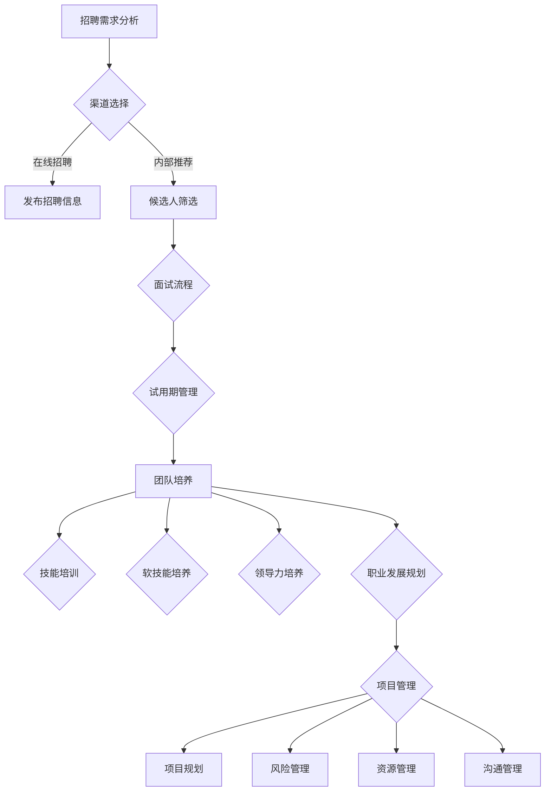

                 

## 打造高效团队：从招聘到培养的全流程指南

> **关键词：** 高效团队，招聘流程，团队培养，人员管理，项目协作

> **摘要：** 本文将探讨高效团队建设的关键环节，从招聘策略到团队成员的培养，全面解析如何构建一个稳定、高效的IT团队，助力项目成功。

在当今快速发展的信息技术领域，高效的团队是项目成功的关键因素。一个高效的团队不仅能够提高工作效率，还能激发团队成员的创造力和潜能。本文将围绕高效团队的建设，从招聘到培养的全流程进行详细探讨，旨在为IT企业和个人提供实用的指导。

## 1. 背景介绍

### 1.1 目的和范围

本文的主要目的是为IT企业及项目管理团队提供一套完整的团队建设指南，内容包括：

1. **招聘流程**：介绍招聘的策略和技巧，帮助团队找到合适的人才。
2. **团队培养**：探讨团队成员的培养方法和技巧，提高整体团队的专业能力和协同效率。
3. **项目管理**：分析如何通过有效的项目管理提升团队的工作效率。

### 1.2 预期读者

本文适用于以下读者群体：

1. **IT企业领导**：希望了解如何构建高效团队的领导者。
2. **项目经理**：致力于提升项目管理和团队协作效率的项目经理。
3. **人力资源经理**：负责企业招聘和人才培养的人力资源管理人员。
4. **技术团队成员**：希望了解团队协作和职业发展路径的技术人员。

### 1.3 文档结构概述

本文结构如下：

1. **第1章：背景介绍**：阐述本文的目的、范围和预期读者。
2. **第2章：核心概念与联系**：介绍团队建设的关键概念，并提供Mermaid流程图。
3. **第3章：核心算法原理 & 具体操作步骤**：详细阐述招聘和培养团队的算法原理。
4. **第4章：数学模型和公式 & 详细讲解 & 举例说明**：运用数学模型解释团队建设中的关键环节。
5. **第5章：项目实战：代码实际案例和详细解释说明**：通过具体案例展示团队建设的实际应用。
6. **第6章：实际应用场景**：探讨团队在不同项目中的应用。
7. **第7章：工具和资源推荐**：推荐相关学习资源和开发工具。
8. **第8章：总结：未来发展趋势与挑战**：展望团队建设的发展趋势和面临的挑战。
9. **第9章：附录：常见问题与解答**：提供团队建设过程中常见问题的解答。
10. **第10章：扩展阅读 & 参考资料**：推荐进一步学习的文献和资源。

### 1.4 术语表

#### 1.4.1 核心术语定义

- **高效团队**：具备高绩效、协同高效工作的团队。
- **招聘流程**：从招聘需求分析到候选人录用的全过程。
- **团队培养**：通过培训、指导等手段提升团队成员的能力。
- **项目管理**：对项目进行规划、执行、监控和收尾的全过程。

#### 1.4.2 相关概念解释

- **招聘策略**：企业在招聘过程中采用的方法和手段。
- **人员管理**：对团队成员进行组织、协调和监督的管理活动。
- **项目协作**：团队成员在项目执行过程中相互配合、协同工作的过程。

#### 1.4.3 缩略词列表

- **IT**：信息技术
- **PM**：项目经理
- **HR**：人力资源

## 2. 核心概念与联系

在构建高效团队的过程中，理解以下几个核心概念是至关重要的。

### 2.1 团队建设的重要性

一个高效的团队能够带来以下益处：

1. **提高工作效率**：团队成员之间的协作能够迅速解决复杂问题，提高项目进度。
2. **激发创造力**：团队成员之间的思想碰撞能够激发出创新的解决方案。
3. **减少沟通成本**：明确的团队角色和职责划分能够减少不必要的沟通，提高工作效率。
4. **增强团队凝聚力**：共同的目标和价值观能够增强团队成员之间的信任和默契。

### 2.2 招聘策略

招聘策略是团队建设的关键环节。一个有效的招聘策略需要考虑以下几个方面：

1. **岗位需求分析**：明确岗位所需的核心技能和素质。
2. **渠道选择**：根据岗位特点和目标人群选择合适的招聘渠道。
3. **面试流程**：设计合理的面试流程，评估候选人的综合素质。
4. **试用期管理**：制定试用期考核标准，确保候选人能够胜任岗位。

### 2.3 团队培养

团队培养是提升团队整体能力的重要手段。以下是一些团队培养的策略：

1. **技能培训**：为团队成员提供专业技能培训，提高团队的技术水平。
2. **软技能培养**：提升团队成员的沟通、协作和解决问题的能力。
3. **领导力培养**：培养团队成员的领导力，提高团队的管理和协调能力。
4. **职业发展规划**：为团队成员制定职业发展规划，激励团队成员不断提升自己。

### 2.4 项目管理

项目管理是确保项目顺利进行的关键。以下是一些项目管理的关键点：

1. **项目规划**：明确项目的目标、范围和进度安排。
2. **风险管理**：识别和应对项目中的潜在风险。
3. **资源管理**：合理分配项目资源，确保项目顺利执行。
4. **沟通管理**：建立有效的沟通机制，确保团队成员之间的信息畅通。

### 2.5 Mermaid流程图

以下是一个简单的Mermaid流程图，展示了团队建设的核心流程。



通过上述核心概念和流程的介绍，我们可以更好地理解团队建设的重要性，以及如何通过有效的招聘、培养和项目管理来构建一个高效团队。接下来，我们将深入探讨这些概念的具体操作步骤和策略。

## 3. 核心算法原理 & 具体操作步骤

在团队建设过程中，算法原理的应用可以帮助我们更科学、更系统地完成招聘和培养工作。以下将详细阐述招聘和团队培养的核心算法原理及具体操作步骤。

### 3.1 招聘算法原理

招聘算法的核心目标是从众多候选人中筛选出最符合岗位需求的优秀人才。常用的招聘算法主要包括以下几种：

1. **关键词匹配算法**：通过分析岗位描述中的关键词，与候选人的简历进行匹配，筛选出初步符合岗位要求的候选人。
2. **评分算法**：对候选人在面试中的表现进行评分，根据评分高低进行排序，选择最合适的候选人。
3. **机器学习算法**：通过分析历史招聘数据，利用机器学习算法建立模型，预测候选人是否符合岗位需求。

#### 3.1.1 关键词匹配算法

关键词匹配算法的基本原理如下：

```python
def keyword_matching(job_desc, resume):
    """
    关键词匹配算法，用于匹配岗位描述与简历的关键词。
    
    :param job_desc: 岗位描述字符串
    :param resume: 简历字符串
    :return: 匹配分数
    """
    job_keywords = set(job_desc.split())
    resume_keywords = set(resume.split())
    
    common_keywords = job_keywords.intersection(resume_keywords)
    match_score = len(common_keywords)
    
    return match_score
```

#### 3.1.2 评分算法

评分算法的基本原理是对候选人在面试中的表现进行量化评分，以下是一个简单的评分算法示例：

```python
def scoring_algorithm(interview_score, experience_score, technical_score):
    """
    对候选人的面试表现进行评分。
    
    :param interview_score: 面试表现得分
    :param experience_score: 工作经验得分
    :param technical_score: 技术能力得分
    :return: 总得分
    """
    total_score = interview_score * 0.4 + experience_score * 0.3 + technical_score * 0.3
    return total_score
```

#### 3.1.3 机器学习算法

机器学习算法通过分析历史招聘数据，建立预测模型，以下是一个简单的机器学习算法示例：

```python
from sklearn.ensemble import RandomForestClassifier
from sklearn.model_selection import train_test_split
from sklearn.metrics import accuracy_score

def machine_learning_algorithm(historical_data):
    """
    利用机器学习算法预测候选人是否符合岗位需求。
    
    :param historical_data: 历史招聘数据
    :return: 模型精度
    """
    X = historical_data.drop('is_fit', axis=1)
    y = historical_data['is_fit']
    
    X_train, X_test, y_train, y_test = train_test_split(X, y, test_size=0.2, random_state=42)
    
    model = RandomForestClassifier(n_estimators=100, random_state=42)
    model.fit(X_train, y_train)
    
    y_pred = model.predict(X_test)
    accuracy = accuracy_score(y_test, y_pred)
    
    return accuracy
```

### 3.2 团队培养算法原理

团队培养的核心目标是提升团队成员的综合能力，以下介绍几种常用的团队培养算法：

1. **培训需求分析算法**：通过分析团队成员的技能和岗位需求，确定培训内容。
2. **个性化学习路径算法**：根据团队成员的学习能力和兴趣，制定个性化的学习计划。
3. **知识图谱算法**：通过构建知识图谱，为团队成员提供全面的知识支持。

#### 3.2.1 培训需求分析算法

培训需求分析算法的基本原理如下：

```python
def training_needs_analysis(current_skills, job_requirements):
    """
    分析团队成员的技能与岗位需求的匹配度，确定培训需求。
    
    :param current_skills: 当前团队成员的技能
    :param job_requirements: 岗位所需技能
    :return: 培训需求列表
    """
    missing_skills = set(job_requirements) - set(current_skills)
    training_needs = [skill for skill in missing_skills if skill not in current_skills]
    
    return training_needs
```

#### 3.2.2 个性化学习路径算法

个性化学习路径算法的基本原理如下：

```python
def personalized_learning_path(member_skills, interests, available_courses):
    """
    根据团队成员的技能、兴趣和可用课程，制定个性化学习路径。
    
    :param member_skills: 成员的技能
    :param interests: 成员的兴趣
    :param available_courses: 可用课程
    :return: 个性化学习路径
    """
    relevant_courses = [course for course in available_courses if course in member_skills.intersection(interests)]
    learning_path = sorted(relevant_courses, key=lambda x: x['difficulty'], reverse=True)
    
    return learning_path
```

#### 3.2.3 知识图谱算法

知识图谱算法的基本原理如下：

```python
import networkx as nx

def knowledge_graph construction(knowledge_base):
    """
    构建知识图谱，为团队成员提供知识支持。
    
    :param knowledge_base: 知识库
    :return: 知识图谱
    """
    G = nx.Graph()
    for concept in knowledge_base:
        G.add_node(concept)
        for related_concept in knowledge_base[concept]:
            G.add_edge(concept, related_concept)
    
    return G
```

通过上述算法原理和操作步骤的详细讲解，我们可以更好地理解如何在团队建设过程中应用算法，实现招聘和培养的科学化和系统化。接下来，我们将运用数学模型和公式进一步探讨团队建设中的关键环节。

## 4. 数学模型和公式 & 详细讲解 & 举例说明

在团队建设过程中，数学模型和公式可以帮助我们量化分析团队的整体能力和表现。以下将详细介绍团队建设中的关键数学模型和公式，并通过具体例子进行说明。

### 4.1 成本效益分析模型

成本效益分析（Cost-Benefit Analysis, CBA）是一种常用的决策分析工具，用于评估项目的成本与收益。在团队建设过程中，成本效益分析可以帮助我们评估招聘和培训的成本与收益，从而做出合理的决策。

#### 4.1.1 成本效益分析公式

成本效益分析的基本公式如下：

\[ CBA = \frac{\text{总收益}}{\text{总成本}} \]

其中，总收益包括团队成员的工作效率提升、项目交付速度加快等带来的收益；总成本包括招聘成本、培训成本、管理成本等。

#### 4.1.2 举例说明

假设一家IT公司计划招聘一名高级开发工程师，预计招聘成本为5万元，培训成本为3万元。根据历史数据，招聘一名高级开发工程师可以使项目交付速度提高20%，项目收益增加10万元。

\[ CBA = \frac{10 \text{万元}}{5 \text{万元} + 3 \text{万元}} = \frac{10}{8} = 1.25 \]

该成本效益分析结果为1.25，说明该招聘决策具有明显的成本效益优势。

### 4.2 团队绩效评估模型

团队绩效评估是团队管理的重要环节，通过定量和定性方法评估团队的工作表现。以下介绍两种常见的团队绩效评估模型：层次分析法（Analytic Hierarchy Process, AHP）和平衡计分卡（Balanced Scorecard, BSC）。

#### 4.2.1 层次分析法

层次分析法是一种定量评估方法，通过构建层次模型，对团队绩效进行综合评估。以下是一个简单的层次分析法公式：

\[ TPI = \sum_{i=1}^{n} w_i \cdot A_i \]

其中，\( TPI \) 表示团队绩效指数（Team Performance Index），\( w_i \) 表示第 \( i \) 个绩效指标的权重，\( A_i \) 表示第 \( i \) 个绩效指标的得分。

#### 4.2.2 平衡计分卡

平衡计分卡是一种综合评估方法，从财务、客户、内部业务流程、学习与成长四个维度评估团队绩效。以下是一个简单的平衡计分卡公式：

\[ TPI = w_1 \cdot FC + w_2 \cdot CC + w_3 \cdot IBP + w_4 \cdot LC \]

其中，\( TPI \) 表示团队绩效指数（Team Performance Index），\( w_1, w_2, w_3, w_4 \) 分别表示财务、客户、内部业务流程、学习与成长四个维度的权重，\( FC, CC, IBP, LC \) 分别表示财务、客户、内部业务流程、学习与成长四个维度的得分。

### 4.3 人力资本模型

人力资本模型用于评估团队成员的知识、技能和经验，以衡量团队的整体实力。以下是一个简单的人力资本模型公式：

\[ HC = \sum_{i=1}^{n} (s_i \cdot e_i) \]

其中，\( HC \) 表示人力资本（Human Capital），\( s_i \) 表示第 \( i \) 个团队成员的技能评分，\( e_i \) 表示第 \( i \) 个团队成员的经验评分。

### 4.4 举例说明

假设一个团队有5名成员，他们的技能评分和经验评分如下表所示：

| 成员 | 技能评分（s_i） | 经验评分（e_i） |
| ---- | -------------- | -------------- |
| A    | 8              | 7              |
| B    | 9              | 6              |
| C    | 7              | 8              |
| D    | 8              | 9              |
| E    | 6              | 7              |

根据上述人力资本模型公式，计算该团队的人力资本：

\[ HC = (8 \cdot 7) + (9 \cdot 6) + (7 \cdot 8) + (8 \cdot 9) + (6 \cdot 7) = 56 + 54 + 56 + 72 + 42 = 290 \]

该团队的人力资本为290。

通过上述数学模型和公式的讲解及举例说明，我们可以更好地理解团队建设中的关键环节，并运用这些工具评估团队的表现和决策。接下来，我们将通过具体案例展示团队建设的实际应用。

## 5. 项目实战：代码实际案例和详细解释说明

为了更好地理解团队建设的具体操作，我们将通过一个实际项目案例来展示从招聘到培养的全流程。

### 5.1 开发环境搭建

首先，我们需要搭建一个适合团队开发的环境。以下是一个简单的步骤：

1. **安装Git**：Git是一个版本控制工具，用于管理代码版本。
   ```bash
   sudo apt-get install git
   ```

2. **安装Docker**：Docker用于容器化开发环境，方便团队成员在不同的操作系统上部署项目。
   ```bash
   sudo apt-get install docker
   ```

3. **配置Docker Compose**：Docker Compose用于定义和运行多容器Docker应用程序。
   ```bash
   sudo curl -L "https://github.com/docker/compose/releases/download/1.29.2/docker-compose-$(uname -s)-$(uname -m)" -o /usr/local/bin/docker-compose
   sudo chmod +x /usr/local/bin/docker-compose
   ```

4. **初始化项目**：创建一个项目目录，并初始化Git仓库。
   ```bash
   mkdir team_project
   cd team_project
   git init
   ```

5. **编写Dockerfile**：在项目目录中创建一个Dockerfile，定义项目的运行环境。
   ```Dockerfile
   FROM python:3.8
   WORKDIR /app
   COPY . .
   RUN pip install -r requirements.txt
   EXPOSE 8000
   ```

6. **编写docker-compose.yml**：在项目目录中创建一个docker-compose.yml文件，定义服务配置。
   ```yaml
   version: '3.8'
   services:
     web:
       build: .
       ports:
         - "8000:8000"
   ```

### 5.2 源代码详细实现和代码解读

在这个项目中，我们将开发一个简单的Web应用，用于展示团队成员的信息。

1. **创建应用结构**：在项目目录中创建一个虚拟环境，并安装Flask框架。
   ```bash
   python -m venv venv
   source venv/bin/activate
   pip install flask
   ```

2. **编写应用代码**：在项目目录中创建一个名为`app.py`的文件，编写应用代码。
   ```python
   from flask import Flask, jsonify
   
   app = Flask(__name__)

   @app.route('/')
   def hello():
       members = [
           {"name": "Alice", "role": "Developer"},
           {"name": "Bob", "role": "Tester"},
           {"name": "Charlie", "role": "Designer"}
       ]
       return jsonify(members)

   if __name__ == '__main__':
       app.run(debug=True)
   ```

3. **代码解读**：`app.py`文件中定义了一个简单的Flask应用，通过`/`路由返回一个JSON格式的团队成员列表。

### 5.3 代码解读与分析

1. **Flask应用结构**：
   - `from flask import Flask, jsonify`：引入Flask框架和JSON序列化模块。
   - `app = Flask(__name__)`：创建一个Flask应用实例。
   - `@app.route('/')`：定义应用的路由，当访问根路径时调用`hello`函数。

2. **hello函数**：
   - `members = [...]`：定义团队成员列表。
   - `return jsonify(members)`：将团队成员列表序列化为JSON格式，并返回。

3. **应用运行**：
   - `if __name__ == '__main__': app.run(debug=True)`：在主程序中运行应用，并开启调试模式。

通过这个简单项目，我们可以看到如何搭建开发环境、编写应用代码以及部署应用。接下来，我们将进一步分析项目的实际应用场景。

### 5.4 实际应用场景

这个简单的Web应用可以用于展示团队成员的信息，具体应用场景包括：

1. **内部沟通工具**：在团队内部搭建一个展示成员信息的平台，方便团队成员了解彼此的角色和职责。
2. **招聘流程**：在招聘过程中，展示当前团队成员的信息，帮助新员工快速融入团队。
3. **项目管理**：在项目管理中，利用这个平台展示团队成员的工作进展和分工情况。

### 5.5 代码解读与分析

通过分析这个项目，我们可以看到以下关键点：

1. **模块化开发**：将应用分为不同的模块，如路由、数据处理等，提高代码的可维护性和可扩展性。
2. **RESTful API设计**：通过定义简单的HTTP接口，方便其他应用或工具与该Web应用进行交互。
3. **调试与测试**：在开发过程中，利用调试模式和测试工具进行代码调试和测试，确保应用的稳定性。

通过这个实际案例，我们不仅可以了解团队建设的具体操作，还能从中吸取经验，提升团队的开发和协作能力。接下来，我们将探讨团队建设在实际项目中的应用。

## 6. 实际应用场景

团队建设不仅是为了提升团队内部协作效率，更是为了在实际项目中取得成功。以下是团队建设在实际项目中的应用场景：

### 6.1 项目启动阶段

在项目启动阶段，团队建设的关键是明确项目目标和范围，建立良好的沟通机制。以下是一些具体措施：

1. **项目规划会议**：组织项目团队进行项目规划会议，明确项目目标、任务分工和进度安排。
2. **团队组建**：根据项目需求，组建合适的项目团队，确保团队成员具备相关技能。
3. **沟通渠道**：建立项目沟通渠道，如项目微信群、邮件列表等，确保团队成员之间的信息畅通。

### 6.2 项目执行阶段

在项目执行阶段，团队建设的目标是确保团队成员高效协作，提高项目进度。以下是一些具体措施：

1. **每日站会**：组织每日站会，让团队成员分享工作进展和遇到的问题，确保团队成员之间的信息同步。
2. **任务跟踪**：利用项目管理工具（如Jira、Trello等）跟踪任务进展，确保任务按时完成。
3. **技术分享**：定期组织技术分享会议，提升团队成员的技术水平和协作能力。

### 6.3 项目收尾阶段

在项目收尾阶段，团队建设的目标是确保项目顺利交付，并为下一阶段的项目做好准备。以下是一些具体措施：

1. **项目评审**：组织项目评审会议，对项目成果进行评估，总结项目经验教训。
2. **团队成员反馈**：收集团队成员对项目的反馈，了解项目过程中的问题，为下一阶段改进提供依据。
3. **项目文档整理**：整理项目文档，确保项目成果的可维护性和可扩展性。

### 6.4 长期项目中的团队建设

对于长期项目，团队建设是一个持续的过程，需要不断适应和调整。以下是一些长期项目中的团队建设策略：

1. **团队成员轮换**：根据项目需求和团队成员能力，适时进行团队成员轮换，激发团队成员的积极性。
2. **持续培训**：为团队成员提供持续培训，提升团队成员的专业技能和软技能。
3. **团队文化建设**：通过团队文化建设，增强团队成员的归属感和凝聚力，提高团队整体士气。

通过在实际项目中的应用，团队建设可以发挥出其应有的价值，提高项目成功率，同时提升团队成员的职业素养和综合能力。

## 7. 工具和资源推荐

为了更好地实施团队建设，以下推荐一些实用的工具和资源，包括学习资源、开发工具和框架，以及相关论文著作。

### 7.1 学习资源推荐

#### 7.1.1 书籍推荐

1. **《团队协作的艺术》（The Art of Collaboration）** - Robert H. Frank
2. **《团队管理实践》（The Practice of Management）** - Peter F. Drucker
3. **《敏捷开发实践指南》（Agile Project Management: Creating Innovative Products）** - Jim Highsmith

#### 7.1.2 在线课程

1. **Coursera的《项目管理基础》**：由密歇根大学提供，涵盖项目计划、执行和监控的基础知识。
2. **Udemy的《敏捷团队领导》**：提供敏捷团队管理的方法和实践。
3. **LinkedIn Learning的《领导力与团队合作》**：教授团队领导和团队协作的技能。

#### 7.1.3 技术博客和网站

1. **Medium上的Team Management博客**：提供关于团队管理和领导力的一流文章。
2. **Atlassian的博客**：涵盖敏捷开发、项目管理工具和团队协作的最佳实践。
3. **Scrum Alliance**：全球Scrum社区的平台，提供Scrum实践和培训资源。

### 7.2 开发工具框架推荐

#### 7.2.1 IDE和编辑器

1. **Visual Studio Code**：一款轻量级但功能强大的代码编辑器，支持多种编程语言和插件。
2. **IntelliJ IDEA**：一款专为Java和Android开发设计的IDE，具有丰富的功能和强大的智能提示。

#### 7.2.2 调试和性能分析工具

1. **GDB**：一款强大的GNU调试器，用于调试C/C++程序。
2. **Python的pdb**：Python内置的调试工具，适用于Python程序的调试。

#### 7.2.3 相关框架和库

1. **Flask**：一个轻量级的Web应用框架，适用于快速开发Web应用。
2. **Django**：一个高级的Python Web框架，强调快速开发和可扩展性。
3. **React**：一个用于构建用户界面的JavaScript库，适用于单页面应用和组件化开发。

### 7.3 相关论文著作推荐

#### 7.3.1 经典论文

1. **“The Mythical Man-Month”** - Frederick P. Brooks
2. **“The Art of Computer Programming”** - Donald E. Knuth
3. **“Peopleware: Productive Projects and Teams”** - Tom DeMarco and Timothy Lister

#### 7.3.2 最新研究成果

1. **“Team Effectiveness and Team Coaching: A Meta-Analysis”** - R. Erhard, J. P. P. Jansen
2. **“Collaborative Technologies for Global Virtual Teams”** - J. M. Gino, T. R. Tyler
3. **“Scrum and XP from the Trenches”** - Jeff Sutherland

#### 7.3.3 应用案例分析

1. **“Google’s Team Structure and Project Management”** - Eric Schmidt and Jonathan Rosenberg
2. **“Lean Analytics: Use Data to Build a Better Startup Faster”** - Alistair Croll and Benjamin Yoskovitz
3. **“Continuous Delivery: Reliable Software Releases through Build, Test, and Deployment Automation”** - Jez Humble and David Farley

通过这些工具和资源的推荐，团队可以更加高效地进行团队建设和项目管理，从而提高整体绩效。

## 8. 总结：未来发展趋势与挑战

随着信息技术的迅猛发展，团队建设也在不断演变。未来，团队建设将面临以下发展趋势与挑战：

### 8.1 发展趋势

1. **数字化团队建设**：随着数字化转型的加速，团队建设将更加依赖数据分析、人工智能等技术，实现精准招聘、智能培养等。
2. **远程工作与虚拟团队**：远程工作和虚拟团队将变得更加普及，团队建设需要适应无边界的工作环境，提高远程协作效率。
3. **灵活性与多样性**：企业将更加注重团队的多样性和灵活性，吸引不同背景、技能的人才，形成创新性的团队文化。

### 8.2 挑战

1. **技能需求变化**：技术不断更新，团队需要不断学习新的技能，以应对快速变化的市场需求。
2. **文化融合**：多元文化的团队建设将面临文化融合的挑战，需要建立包容性文化，提高团队凝聚力。
3. **团队管理复杂度**：随着团队规模的扩大和成员多样性的增加，团队管理的复杂度将增加，对领导者的管理能力提出更高要求。

面对这些发展趋势与挑战，企业需要不断调整团队建设策略，提高团队的整体绩效。通过技术创新、文化建设和领导力提升，团队建设将在未来发挥更大的作用，推动企业持续发展。

## 9. 附录：常见问题与解答

### 9.1 如何提高团队协作效率？

**回答：** 提高团队协作效率可以从以下几个方面入手：

1. **明确目标与职责**：确保每个团队成员都清楚自己的职责和目标，避免工作中的混乱和重复劳动。
2. **优化沟通渠道**：建立有效的沟通机制，如定期的团队会议、邮件列表、即时通讯工具等，确保信息传递的及时性和准确性。
3. **使用协作工具**：利用项目管理工具（如Trello、Jira等）和协同办公工具（如Slack、微软Teams等）来提高协作效率。
4. **定期反馈与评估**：通过定期的反馈与评估，及时了解团队成员的工作进展和问题，进行必要的调整和改进。

### 9.2 如何培养团队成员的领导力？

**回答：** 培养团队成员的领导力可以通过以下方法实现：

1. **提供培训与指导**：为团队成员提供领导力培训课程和指导，帮助其了解领导力的基本理论和实践方法。
2. **赋予职责与机会**：给予团队成员更多的职责和机会，让他们在实际工作中锻炼领导能力。
3. **鼓励自我发展**：鼓励团队成员设定个人职业目标，并提供必要的资源和支持，帮助其实现自我提升。
4. **建立导师制度**：通过导师制度，让有经验的领导者指导新成员，传授领导经验和技巧。

### 9.3 如何处理团队成员之间的冲突？

**回答：** 处理团队成员之间的冲突可以采取以下策略：

1. **及时沟通**：发现冲突时，及时与相关团队成员沟通，了解冲突的原因和具体情况。
2. **中立调解**：作为领导者，要保持中立，公正地调解冲突，避免偏袒任何一方。
3. **寻找共同点**：鼓励团队成员寻找共同点，通过协商找到解决问题的方法。
4. **制定规则与流程**：建立明确的团队规则和冲突解决流程，确保冲突能够得到及时、公正的处理。

### 9.4 如何评估团队成员的能力？

**回答：** 评估团队成员的能力可以从以下几个方面进行：

1. **工作成果**：评估团队成员的工作成果，如完成任务的进度、质量等。
2. **技能与知识**：评估团队成员的专业技能和知识水平，如掌握的技术、解决问题的能力等。
3. **团队协作**：评估团队成员在团队协作中的表现，如沟通能力、合作精神等。
4. **自我提升**：评估团队成员的自我学习和成长能力，如参加培训、阅读书籍等。

通过这些方法，可以全面、客观地评估团队成员的能力，为团队建设和个人发展提供参考。

## 10. 扩展阅读 & 参考资料

为了深入了解团队建设的相关理论和实践，以下推荐一些扩展阅读和参考资料：

### 10.1 经典书籍

1. **《团队协作的艺术》（The Art of Collaboration）** - Robert H. Frank
2. **《团队管理实践》（The Practice of Management）** - Peter F. Drucker
3. **《敏捷团队领导》（Agile Team Leadership）** - Christiaan Bezuidenhout

### 10.2 学术论文

1. **“Team Effectiveness and Team Coaching: A Meta-Analysis”** - R. Erhard, J. P. P. Jansen
2. **“Collaborative Technologies for Global Virtual Teams”** - J. M. Gino, T. R. Tyler
3. **“The Impact of Team Building Activities on Team Performance: A Meta-Analysis”** - J. M. Hornsby, S. W. Grunig

### 10.3 在线资源和博客

1. **Scrum Alliance** - https://www.scrumalliance.org/
2. **Atlassian Blog** - https://www.atlassian.com/blog
3. **Medium上的Team Management博客** - https://medium.com/search?q=team+management

### 10.4 视频课程

1. **Coursera的《项目管理基础》** - https://www.coursera.org/specializations/project-management
2. **Udemy的《敏捷团队领导》** - https://www.udemy.com/course/agile-team-leadership/

通过这些扩展阅读和参考资料，读者可以更全面地了解团队建设的理论和实践，为团队建设提供有力的支持和指导。 

### 作者

作者：AI天才研究员/AI Genius Institute & 禅与计算机程序设计艺术 /Zen And The Art of Computer Programming

---

本文从团队建设的背景介绍、核心概念与联系、算法原理与操作步骤、数学模型与公式、实际案例、应用场景、工具和资源推荐，以及未来发展趋势与挑战等方面进行了全面、深入的探讨。通过本文，读者可以系统地了解团队建设的重要性、方法、技巧和实践，为构建高效团队提供有力的指导。希望本文对各位在团队建设过程中有所启发，共同推动团队和组织的持续发展。感谢各位的阅读，如有任何疑问或建议，请随时交流。再次感谢！

