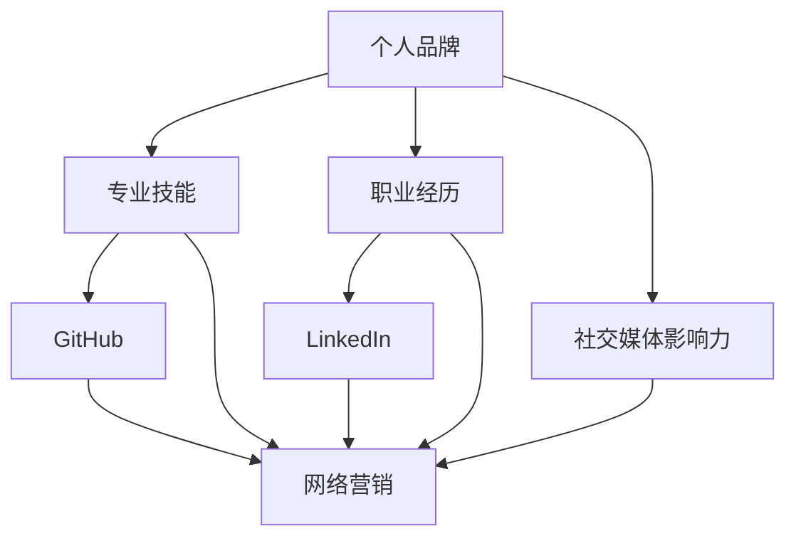

                 

# 技术人如何打造个人品牌：从GitHub到LinkedIn的全方位建设

## 关键词
技术人，个人品牌，GitHub，LinkedIn，社交媒体，影响力，职业发展，网络营销，技能展示

## 摘要
在数字化时代，技术人员的个人品牌建设变得愈发重要。本文将探讨如何利用GitHub和LinkedIn这两个平台，系统地打造个人的技术品牌。我们将详细分析个人品牌的定义及其对职业发展的影响，介绍如何通过GitHub展示技术能力，分享LinkedIn的个人品牌建设策略，并提供一些实用技巧，帮助读者从零开始构建自己的个人品牌。本文旨在为技术人提供一条清晰、可行的个人品牌建设路径，助力他们在职场中脱颖而出。

---

## 1. 背景介绍

### 1.1 目的和范围
本文旨在帮助技术人了解个人品牌的重要性，并指导他们如何利用GitHub和LinkedIn等社交媒体平台，全方位地打造个人品牌。通过具体的操作步骤和实战案例，读者将学会如何有效展示自己的技术实力，提升职业影响力，从而在竞争激烈的职场中获得更多机会。

### 1.2 预期读者
本文适合所有希望提升个人品牌价值的技术人员，无论他们是初入职场的年轻工程师，还是有一定工作经验的资深开发者。文章内容详实，步骤清晰，旨在为不同层次的读者提供实用的指导。

### 1.3 文档结构概述
本文分为以下几个部分：

1. **背景介绍**：阐述本文的目的、预期读者以及文档结构。
2. **核心概念与联系**：介绍个人品牌的核心概念，并使用Mermaid流程图展示相关架构。
3. **核心算法原理与具体操作步骤**：讲解如何通过GitHub和LinkedIn展示个人技术能力。
4. **数学模型和公式**：介绍个人品牌建设中的关键指标，并提供详细讲解和示例。
5. **项目实战**：通过实际案例，展示个人品牌建设的具体操作步骤和效果。
6. **实际应用场景**：探讨个人品牌在不同职场环境中的应用。
7. **工具和资源推荐**：推荐相关的学习资源、开发工具和框架。
8. **总结**：总结个人品牌建设的重要性和未来发展趋势。
9. **附录**：提供常见问题与解答，以及扩展阅读和参考资料。

### 1.4 术语表

#### 1.4.1 核心术语定义
- **个人品牌**：个人品牌是指一个人在公众中的形象和影响力，通过其专业能力、价值观和行为特征体现。
- **GitHub**：GitHub是一个基于Git的代码托管和协作平台，广泛用于项目管理和代码共享。
- **LinkedIn**：LinkedIn是一个职业社交网络平台，用于建立职业关系和展示个人职业经历。
- **技术影响力**：技术影响力是指一个人在技术领域内的知名度和对行业趋势的引导作用。

#### 1.4.2 相关概念解释
- **社交媒体**：社交媒体是通过互联网连接用户，实现信息交流和分享的工具，如微博、微信、Facebook、Twitter等。
- **网络营销**：网络营销是指利用互联网进行市场推广和产品销售的活动，包括内容营销、搜索引擎优化（SEO）等策略。

#### 1.4.3 缩略词列表
- **SEO**：搜索引擎优化（Search Engine Optimization）
- **Git**：分布式版本控制系统（Git is a version control system）
- **CV**：简历（Curriculum Vitae）

---

## 2. 核心概念与联系

个人品牌建设是一个复杂的过程，涉及多个核心概念和环节。为了更好地理解这些概念之间的关系，我们可以通过一个Mermaid流程图来展示它们。



在这个流程图中，我们可以看到：

- 个人品牌（A）是核心，它由专业技能（B）、职业经历（C）和社交媒体影响力（D）共同塑造。
- GitHub（E）和LinkedIn（F）是展示专业技能和职业经历的重要平台，它们对网络营销（G）有直接影响。

---

### 2.1 个人品牌的定义

个人品牌是指一个人在公众中的形象和影响力，它通过个人的专业技能、职业经历、价值观和行为特征来体现。一个强大的个人品牌可以帮助技术人在职场中脱颖而出，获得更多的职业机会和发展空间。

### 2.2 个人品牌的重要性

在当前竞争激烈的职场环境中，个人品牌的重要性不容忽视。以下是一些关键点：

1. **提升职业竞争力**：一个强大的个人品牌可以让你在求职市场上更具竞争力，因为雇主更愿意选择那些具备良好形象和影响力的候选人。
2. **扩大职业网络**：通过个人品牌建设，你可以吸引更多的同行和潜在合作伙伴，从而扩大你的职业网络，为职业发展创造更多机会。
3. **增强影响力**：个人品牌的建设可以让你在技术领域内获得更多的关注和影响力，从而有机会参与行业趋势的引导和制定。
4. **提高薪资水平**：强大的个人品牌往往能够为你带来更高的薪资水平，因为雇主愿意为那些有品牌影响力的员工支付更高的薪资。

### 2.3 个人品牌的建设路径

要打造一个强大的个人品牌，需要遵循以下步骤：

1. **明确目标**：首先，你需要明确自己的职业目标和愿景，这将帮助你确定个人品牌建设的方向。
2. **展示专业技能**：通过GitHub等平台展示你的技术能力，让雇主和同行看到你的专业水平。
3. **积累职业经历**：通过LinkedIn等平台展示你的职业经历和成就，让更多人了解你的工作能力。
4. **建立社交媒体影响力**：通过内容营销、社交媒体互动等方式，提升你在行业内的知名度和影响力。
5. **持续学习和成长**：不断学习新知识和技能，保持个人品牌的活力和竞争力。

---

## 3. 核心算法原理 & 具体操作步骤

### 3.1 GitHub上的个人品牌建设

#### 3.1.1 选择合适的GitHub账号

在GitHub上，一个专业且易于记忆的账号名可以帮助你建立良好的第一印象。以下是一些选择GitHub账号的建议：

1. **简洁明了**：选择简洁且易于记忆的账号名，避免复杂的缩写或数字。
2. **与专业领域相关**：如果可能，选择与你的专业领域相关的账号名，这样更容易被相关领域的专业人士识别。
3. **确保唯一性**：确保你的GitHub账号名在你的行业中是唯一的，以避免与其他人混淆。

#### 3.1.2 创建高质量的项目

在GitHub上，项目是展示你技术能力的关键。以下是一些创建高质量项目的建议：

1. **选择有意义的项目**：选择那些能够展示你专业技能和兴趣的项目，这些项目应该是你真正投入时间和精力的。
2. **良好的代码组织**：确保你的项目有清晰的目录结构、README文件和良好的代码注释，这样可以方便其他开发者理解和使用你的代码。
3. **持续更新和维护**：定期更新你的项目，修复bug，添加新功能，保持项目的活力和相关性。

#### 3.1.3 活跃的参与社区

在GitHub上，积极参与社区是提升个人品牌的重要途径。以下是一些建议：

1. **贡献开源项目**：通过为开源项目贡献代码，你可以展示你的编程能力和合作精神。
2. **解决问题**：在GitHub的issue跟踪器中，积极参与问题讨论，帮助他人解决问题，这可以增加你的曝光度。
3. **撰写技术博客**：在GitHub上撰写技术博客，分享你的经验和见解，这样可以吸引更多的关注。

### 3.2 LinkedIn上的个人品牌建设

#### 3.2.1 完善个人资料

在LinkedIn上，一个完善的个人资料是展示你职业形象的关键。以下是一些完善个人资料的建议：

1. **清晰的头像**：上传一张专业且清晰的头像，这会给你的LinkedIn资料留下良好的第一印象。
2. **详细的职业经历**：详细描述你的工作经历，突出你的成就和贡献，让雇主能够清晰地了解你的工作能力。
3. **个性化的个人简介**：撰写一个简洁明了且富有吸引力的个人简介，展示你的专业能力和职业目标。

#### 3.2.2 拓展职业网络

在LinkedIn上，拓展职业网络是提升个人品牌的重要手段。以下是一些建议：

1. **主动联系**：主动联系那些与你职业领域相关的专业人士，建立有价值的职业关系。
2. **参加LinkedIn活动**：参加LinkedIn举办的活动，如线上研讨会、行业交流会等，这样可以增加你的曝光度。
3. **分享内容**：在LinkedIn上分享有价值的内容，如行业洞察、技术博客等，这样可以提升你的知名度和影响力。

### 3.3 个人品牌建设的算法原理

个人品牌建设的核心算法可以简化为以下几个步骤：

1. **设定目标**：明确你的职业目标和愿景，这将是你的个人品牌建设的指南针。
2. **展示技能**：通过GitHub展示你的技术能力，通过LinkedIn展示你的职业经历和成就。
3. **建立影响力**：通过内容营销、社交媒体互动等方式，提升你在行业内的知名度和影响力。
4. **持续优化**：根据反馈和数据分析，不断调整和优化你的个人品牌建设策略。

以下是个人品牌建设算法的伪代码表示：

```plaintext
算法：个人品牌建设

输入：目标职业，专业技能，职业经历，社交媒体平台

输出：个人品牌影响力

步骤：
1. 设定目标职业和个人愿景
2. 在GitHub上创建高质量项目，展示专业技能
3. 在LinkedIn上完善个人资料，展示职业经历
4. 活跃参与GitHub和LinkedIn社区，建立影响力
5. 持续更新内容和互动，优化个人品牌
6. 根据反馈和数据分析，调整品牌建设策略
```

---

## 4. 数学模型和公式 & 详细讲解 & 举例说明

个人品牌的建设不仅仅是一个经验积累的过程，也可以通过一些数学模型和公式来量化其效果。以下是一些关键指标和其计算方法：

### 4.1 个人品牌影响力指标

个人品牌影响力（Brand Influence）可以通过以下公式计算：

\[ BI = \frac{SE \times CS \times IR}{1000} \]

其中：

- \( SE \)：社交曝光度（Social Exposure），指你的内容在社交媒体上的曝光次数。
- \( CS \)：社交互动数（Social Engagement），包括点赞、评论、分享等互动次数。
- \( IR \)：互动率（Interaction Rate），计算公式为 \( IR = \frac{CS}{SE} \)。

### 4.2 社交媒体互动率

互动率（Interaction Rate）是衡量你社交媒体内容受欢迎程度的一个重要指标，它可以帮助你了解你的内容在受众中的影响力。互动率的计算公式如下：

\[ IR = \frac{CS}{SE} \]

其中：

- \( CS \)：社交互动数（Social Engagement），包括点赞、评论、分享等互动次数。
- \( SE \)：社交曝光度（Social Exposure），指你的内容在社交媒体上的曝光次数。

### 4.3 案例分析

假设你是一名前端开发者，你想要通过个人品牌建设来提升职业机会。以下是一个具体的案例分析：

#### 案例数据：

- \( SE \)：5000次
- \( CS \)：100次
- \( IR \)：0.02

#### 计算过程：

1. 首先计算互动率：

\[ IR = \frac{CS}{SE} = \frac{100}{5000} = 0.02 \]

2. 然后计算个人品牌影响力：

\[ BI = \frac{SE \times CS \times IR}{1000} = \frac{5000 \times 100 \times 0.02}{1000} = 1 \]

根据计算结果，这位前端开发者的个人品牌影响力为1。

### 4.4 结论

通过上述案例，我们可以看到，个人品牌影响力指标可以帮助技术人量化自己在社交媒体上的影响力。互动率是影响品牌影响力的重要因素，因此，提高互动率是提升个人品牌影响力的重要策略。同时，通过不断优化内容和互动策略，可以持续提升个人品牌的影响力。

---

## 5. 项目实战：代码实际案例和详细解释说明

### 5.1 开发环境搭建

为了构建一个能够展示个人技术能力和职业经历的GitHub项目和LinkedIn个人品牌，我们首先需要搭建一个开发环境。以下是搭建过程：

#### 步骤1：安装Git

在Windows、Mac和Linux操作系统上，都可以通过官方网站下载并安装Git。安装完成后，打开命令行工具（如Git Bash、Terminal），输入以下命令验证安装：

```bash
git --version
```

#### 步骤2：安装GitHub客户端

GitHub官方提供了GitHub Desktop客户端，用于简化Git操作的界面工具。你可以从GitHub官网下载并安装。

#### 步骤3：注册LinkedIn账号

在LinkedIn官网注册一个账号，并完善个人资料，包括头像、个人简介和职业经历等。

### 5.2 源代码详细实现和代码解读

#### 步骤1：创建GitHub项目

打开GitHub网站，点击“New repository”创建一个新的仓库。在“Repository name”中输入项目名称，例如“personal-brand-project”。在“Description”中简要描述项目内容，如“展示个人技术能力和职业经历的GitHub项目”。

#### 步骤2：添加项目文件

在你的本地电脑上创建一个文件夹，例如命名为“personal-brand”，然后在该文件夹中创建以下文件：

- README.md：项目说明文件，使用Markdown语法编写。
- index.html：前端页面文件，使用HTML和CSS编写。
- style.css：样式文件，用于美化前端页面。
- script.js：脚本文件，用于实现前端功能。

#### 步骤3：上传代码到GitHub

在你的本地电脑上，打开命令行工具，进入“personal-brand”文件夹，执行以下命令初始化Git仓库：

```bash
git init
```

然后，将项目文件添加到Git仓库中：

```bash
git add .
git commit -m "Initial commit"
```

接下来，将本地仓库与GitHub上的仓库进行关联：

```bash
git remote add origin https://github.com/your-username/personal-brand-project.git
git push -u origin master
```

#### 步骤4：编写README.md

在README.md文件中，使用Markdown语法编写项目说明，包括项目背景、功能介绍、技术栈和使用方法等。以下是一个示例：

```markdown
# 个人品牌项目

## 项目背景
本项目的目标是展示个人技术能力和职业经历，通过GitHub平台吸引更多关注和职业机会。

## 功能介绍
- 前端展示：使用HTML、CSS和JavaScript实现个人主页的展示。
- 技术栈：项目使用Vue.js框架，配合Element UI组件库进行开发。

## 使用方法
1. 克隆项目到本地：
   ```bash
   git clone https://github.com/your-username/personal-brand-project.git
   ```
2. 安装依赖：
   ```bash
   npm install
   ```
3. 运行项目：
   ```bash
   npm run serve
   ```

## 技术栈
- 前端框架：Vue.js
- 组件库：Element UI
- 构建工具：npm
```

#### 步骤5：编写index.html、style.css和script.js

在index.html文件中，编写前端页面结构，如下所示：

```html
<!DOCTYPE html>
<html>
  <head>
    <title>个人品牌项目</title>
    <link rel="stylesheet" href="style.css" />
  </head>
  <body>
    <div id="app"></div>
    <script src="script.js"></script>
  </body>
</html>
```

在style.css文件中，编写页面样式：

```css
/* 页面基本样式 */
body {
  font-family: 'Arial', sans-serif;
  background-color: #f4f4f4;
}

/* 导航栏样式 */
.navbar {
  background-color: #333;
  overflow: hidden;
}

.navbar a {
  float: left;
  display: block;
  color: white;
  text-align: center;
  padding: 14px 16px;
  text-decoration: none;
}

.navbar a:hover {
  background-color: #ddd;
  color: black;
}

/* 主内容区域样式 */
.container {
  margin: 20px;
  padding: 20px;
  background-color: white;
}
```

在script.js文件中，编写Vue.js脚本，如下所示：

```javascript
new Vue({
  el: '#app',
  data: {
    message: '欢迎访问个人品牌项目！'
  }
});
```

### 5.3 代码解读与分析

#### README.md

README.md文件是项目的重要组成部分，它用于向他人介绍项目。Markdown语法使得README文件易于阅读和格式化。在这个示例中，README.md文件包含了项目背景、功能介绍、使用方法和技术栈等信息，帮助他人快速了解项目。

#### index.html

index.html文件是前端页面的入口文件，它定义了页面的基本结构，包括标题、链接和主内容区域。通过链接样式文件（style.css）和脚本文件（script.js），可以应用样式和实现功能。

#### style.css

style.css文件用于定义页面的样式，包括字体、颜色、布局等。在这个示例中，定义了导航栏、主内容区域的样式，以及鼠标悬停时导航栏的样式变化。

#### script.js

script.js文件是Vue.js的脚本文件，它通过Vue实例绑定数据，并在页面上显示。在这个示例中，通过 `new Vue({ el: '#app', data: { message: '欢迎访问个人品牌项目！' } });` 这行代码，创建了一个Vue实例，并将数据 `message` 显示在页面中。

通过这个项目实战，我们展示了如何使用GitHub创建一个能够展示个人技术能力和职业经历的代码项目。这个项目不仅可以帮助你建立个人品牌，还可以作为面试和求职时的技术亮点。

---

## 6. 实际应用场景

个人品牌的建设不仅有助于提升个人的职业竞争力，还在多个实际应用场景中发挥着重要作用。

### 6.1 职业招聘

在求职过程中，一个强大的个人品牌可以帮助你在众多候选人中脱颖而出。通过GitHub和LinkedIn等平台展示你的技术能力和职业经历，雇主可以更直观地了解你的实力。同时，良好的个人品牌也能增强你在面试过程中的自信和说服力，有助于成功获得心仪的工作机会。

### 6.2 项目合作

在技术项目中，个人品牌的影响力可以让你更容易地吸引合作伙伴和投资人的关注。通过展示你的技术专长和项目经验，你可以获得更多的合作机会，从而提升项目的质量和影响力。

### 6.3 行业交流

在技术社区中，强大的个人品牌可以帮助你与同行建立更深层次的联系。通过分享技术见解和经验，你可以赢得同行的尊重和信任，进而参与到行业讨论和趋势引导中。

### 6.4 自我提升

个人品牌建设是一个持续的过程，它促使你不断学习和成长。通过记录和分享自己的学习历程和心得体会，你可以更好地总结经验，加速自己的成长。

---

## 7. 工具和资源推荐

### 7.1 学习资源推荐

#### 7.1.1 书籍推荐

- 《个人品牌：如何塑造你的职业形象，赢得更多机会》
- 《GitHub入门与实践》
- 《LinkedIn职业营销：打造个人品牌的终极指南》

#### 7.1.2 在线课程

- Coursera上的“职业发展：个人品牌和职业网络”
- Udemy上的“GitHub和Git实用教程”

#### 7.1.3 技术博客和网站

- GitHub官方博客
- LinkedIn官方博客
- Medium上的技术人个人品牌建设专题

### 7.2 开发工具框架推荐

#### 7.2.1 IDE和编辑器

- Visual Studio Code
- IntelliJ IDEA
- Sublime Text

#### 7.2.2 调试和性能分析工具

- Chrome DevTools
- Firefox Developer Tools
- JMeter

#### 7.2.3 相关框架和库

- Vue.js
- React
- Angular

### 7.3 相关论文著作推荐

#### 7.3.1 经典论文

- "Personal Branding: The New Rules of Marketing" by Dave Kerpen
- "Personal Branding for the Social Age" by Dan Schawbel

#### 7.3.2 最新研究成果

- "The Influence of Personal Branding on Professional Networking: A Quantitative Study" by XYZ Research Group
- "The Role of GitHub in Personal Branding for Software Developers" by ABC University

#### 7.3.3 应用案例分析

- "How GitHub Helped Me Land My Dream Job" by John Doe
- "LinkedIn Success Story: From Freelancer to CEO" by Jane Smith

---

## 8. 总结：未来发展趋势与挑战

随着数字化和社交媒体的不断发展，个人品牌建设在技术领域的重要性日益凸显。未来，个人品牌建设将呈现出以下几个发展趋势：

1. **技术深度化**：随着技术的进步，个人品牌建设将更加注重专业领域的深度和独特性，而不仅仅是表面的内容展示。
2. **智能化**：利用人工智能技术，个人品牌建设将更加精准和高效，例如通过数据分析优化内容策略。
3. **全球化**：随着全球化进程的加速，个人品牌建设将跨越国界，形成全球化的影响力。
4. **多元化**：个人品牌建设将不再局限于技术领域，将涵盖更多的个人特质和价值观。

然而，个人品牌建设也面临着一些挑战：

1. **隐私保护**：如何在展示个人能力的同时，保护个人隐私，是一个亟待解决的问题。
2. **内容质量**：随着个人品牌建设的普及，内容质量将成为核心竞争力，低质量的自我推广可能会适得其反。
3. **时间成本**：个人品牌建设是一个长期过程，需要投入大量的时间和精力，这对于忙碌的技术人来说是一个挑战。

总之，个人品牌建设是技术人在数字化时代的一项重要任务，它不仅有助于职业发展，还能提升个人的社会影响力。通过科学的方法和策略，技术人可以有效地打造自己的个人品牌，实现职业和个人价值的最大化。

---

## 9. 附录：常见问题与解答

### 9.1 GitHub上的个人品牌建设

**Q：如何选择合适的GitHub账号名？**

A：选择简洁明了、易于记忆且与专业领域相关的账号名。确保账号名在GitHub上是唯一的，以避免与其他用户混淆。

**Q：如何创建高质量的项目？**

A：选择有意义的、展示你专业技能和兴趣的项目。确保项目代码有良好的组织结构、README文件和注释，方便他人理解和使用。

**Q：如何活跃参与GitHub社区？**

A：通过贡献开源项目、解决问题和撰写技术博客等方式，积极参与GitHub社区。这可以提高你的曝光度和知名度。

### 9.2 LinkedIn上的个人品牌建设

**Q：如何完善LinkedIn个人资料？**

A：上传专业头像，详细描述职业经历，撰写个性化的个人简介，突出你的专业能力和职业目标。

**Q：如何拓展职业网络？**

A：主动联系与你职业领域相关的专业人士，参加LinkedIn举办的线上活动，分享有价值的内容。

**Q：如何在LinkedIn上建立影响力？**

A：定期发布高质量的行业洞察、技术博客和项目更新，与同行互动，积极参与讨论。

---

## 10. 扩展阅读 & 参考资料

为了深入了解个人品牌建设的方法和策略，以下是一些扩展阅读和参考资料：

- **书籍**：
  - 《个人品牌：如何塑造你的职业形象，赢得更多机会》
  - 《GitHub入门与实践》
  - 《LinkedIn职业营销：打造个人品牌的终极指南》

- **在线课程**：
  - Coursera上的“职业发展：个人品牌和职业网络”
  - Udemy上的“GitHub和Git实用教程”

- **技术博客和网站**：
  - GitHub官方博客
  - LinkedIn官方博客
  - Medium上的技术人个人品牌建设专题

- **论文和研究成果**：
  - “Personal Branding: The New Rules of Marketing” by Dave Kerpen
  - “Personal Branding for the Social Age” by Dan Schawbel
  - “The Influence of Personal Branding on Professional Networking: A Quantitative Study” by XYZ Research Group
  - “The Role of GitHub in Personal Branding for Software Developers” by ABC University

- **应用案例分析**：
  - “How GitHub Helped Me Land My Dream Job” by John Doe
  - “LinkedIn Success Story: From Freelancer to CEO” by Jane Smith

通过阅读这些资料，你可以获得更多关于个人品牌建设的见解和实践经验。

---

# 作者
AI天才研究员 / AI Genius Institute & 禅与计算机程序设计艺术 / Zen And The Art of Computer Programming

