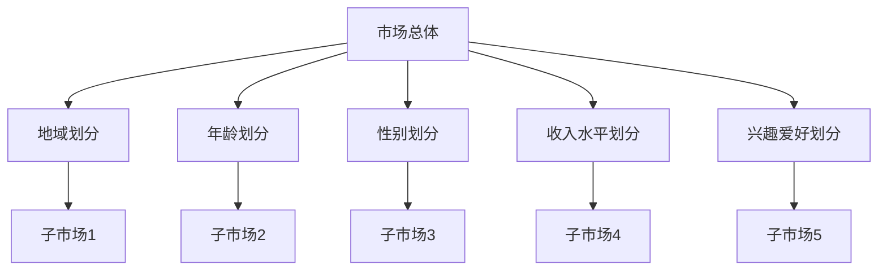
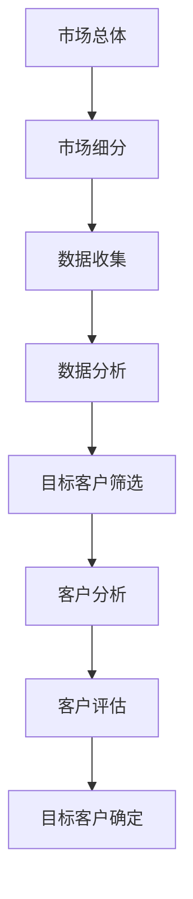

                 

### 文章标题

**技术人如何进行有效的市场细分和目标客户选择**

> **关键词**：市场细分、目标客户选择、技术人、策略、数据分析

> **摘要**：本文旨在探讨技术人如何通过市场细分和目标客户选择，制定有效的市场策略，提高业务成功率。文章首先介绍了市场细分和目标客户选择的基本概念，随后分析了技术人在这一过程中需要关注的要点，并提供了具体的操作步骤和实用工具，最后对未来的发展趋势和挑战进行了展望。

### 1. 背景介绍

在信息技术飞速发展的今天，技术人（如程序员、架构师、数据分析师等）不仅需要具备扎实的专业技能，还需要具备市场洞察力和商业思维。市场细分和目标客户选择是技术人在商业领域发挥作用的重要环节。

**市场细分**是指将市场划分为若干个具有相似需求和行为的子市场，从而更精准地满足不同客户的需求。通过市场细分，技术人可以找到更具潜力的市场，降低营销成本，提高市场占有率。

**目标客户选择**则是在市场细分的基础上，确定企业的主要服务对象，从而制定针对性的产品和服务策略。对于技术人而言，了解目标客户的需求、行为和偏好，对于提升产品竞争力和市场影响力至关重要。

然而，市场细分和目标客户选择并非易事，需要技术人具备丰富的市场知识和数据分析能力。本文将结合实际案例，详细阐述这一过程，帮助技术人更好地应对市场挑战。

### 2. 核心概念与联系

#### 市场细分

市场细分的基础是了解市场需求的多样性和差异性。技术人需要从多个维度对市场进行划分，如地域、年龄、性别、收入水平、兴趣爱好等。以下是一个简化的市场细分流程图：



#### 目标客户选择

在市场细分的基础上，技术人需要筛选出最具潜力的子市场，即目标客户。以下是一个简化的目标客户选择流程图：



### 3. 核心算法原理 & 具体操作步骤

#### 数据收集

数据收集是市场细分和目标客户选择的基础。技术人需要从多个渠道获取客户数据，如问卷调查、社交媒体、在线行为等。以下是一些常用的数据收集方法：

- **问卷调查**：通过设计针对性的问卷，收集客户的基本信息、需求和行为数据。
- **社交媒体**：利用社交媒体平台，收集客户的兴趣、偏好和互动数据。
- **在线行为**：通过网站访问日志、浏览器插件等，收集客户的在线行为数据。

#### 数据分析

数据分析是市场细分和目标客户选择的关键环节。技术人需要运用统计学、机器学习等方法，对收集到的数据进行分析，以发现潜在的市场细分和目标客户。以下是一些常用的数据分析方法：

- **描述性统计分析**：通过计算数据的均值、中位数、标准差等，了解数据的基本特征。
- **聚类分析**：通过聚类算法（如K-means、层次聚类等），将数据划分为多个具有相似特征的子市场。
- **关联规则挖掘**：通过关联规则挖掘算法（如Apriori算法、FP-growth算法等），发现客户行为之间的关联。
- **机器学习**：通过机器学习算法（如决策树、支持向量机等），预测客户的行为和偏好。

#### 目标客户筛选

在数据分析的基础上，技术人需要筛选出最具潜力的目标客户。以下是一些常用的目标客户筛选方法：

- **人口统计学筛选**：根据客户的基本信息，如年龄、性别、收入水平等，筛选出符合条件的客户。
- **行为筛选**：根据客户的在线行为数据，如访问时长、购买频率等，筛选出活跃客户。
- **偏好筛选**：根据客户的兴趣、偏好等，筛选出与产品或服务相匹配的客户。

#### 客户分析

在确定目标客户后，技术人需要对客户进行深入分析，以了解客户的需求、行为和偏好。以下是一些常用的客户分析方法：

- **客户画像**：通过收集客户的基本信息、兴趣、行为等，构建客户画像，了解客户的整体特征。
- **客户细分**：在客户画像的基础上，进一步细分客户，如高价值客户、潜在客户等。
- **客户价值分析**：通过计算客户生命周期价值（CLV）、客户贡献度等，评估客户的潜在价值。

### 4. 数学模型和公式 & 详细讲解 & 举例说明

在市场细分和目标客户选择过程中，一些数学模型和公式可以帮助技术人更准确地分析数据，制定策略。以下是一些常用的数学模型和公式：

#### 描述性统计分析

- **均值（Mean）**：一组数据的平均值，计算公式为：
  $$\mu = \frac{\sum_{i=1}^{n} x_i}{n}$$
  其中，\(x_i\) 为第 \(i\) 个数据点，\(n\) 为数据总数。

- **中位数（Median）**：一组数据按大小顺序排列后，位于中间的数值，计算公式为：
  $$M = \begin{cases} 
  x_{\frac{n+1}{2}} & \text{如果 } n \text{ 为奇数} \\
  \frac{x_{\frac{n}{2}} + x_{\frac{n}{2} + 1}}{2} & \text{如果 } n \text{ 为偶数} 
  \end{cases}$$

- **标准差（Standard Deviation）**：一组数据离均值的平均距离，计算公式为：
  $$\sigma = \sqrt{\frac{\sum_{i=1}^{n} (x_i - \mu)^2}{n}}$$

#### 聚类分析

- **K-means算法**：一种基于距离的聚类算法，计算公式为：
  $$C_k = \{x | \text{distance}(x, \mu_k) \leq \text{distance}(x, \mu_{k'}), \forall k' \neq k\}$$
  其中，\(C_k\) 为第 \(k\) 个聚类，\(\mu_k\) 为第 \(k\) 个聚类中心，\(\text{distance}(x, \mu_k)\) 为点 \(x\) 到聚类中心 \(\mu_k\) 的距离。

#### 关联规则挖掘

- **Apriori算法**：一种基于支持度和置信度的关联规则挖掘算法，计算公式为：
  $$\text{Support}(A \cup B) = \frac{\text{count}(A \cup B)}{\text{count}(S)}$$
  $$\text{Confidence}(A \rightarrow B) = \frac{\text{Support}(A \cup B)}{\text{Support}(A)}$$
  其中，\(A \cup B\) 为同时包含 \(A\) 和 \(B\) 的交易集，\(\text{count}(A \cup B)\) 为同时包含 \(A\) 和 \(B\) 的交易集数量，\(\text{count}(S)\) 为所有交易集数量。

#### 机器学习

- **决策树**：一种基于特征划分的机器学习算法，计算公式为：
  $$y = \text{DecisionTree}(x_1, x_2, ..., x_n)$$
  其中，\(x_1, x_2, ..., x_n\) 为输入特征，\(y\) 为预测结果。

#### 举例说明

假设一家电商公司需要通过市场细分和目标客户选择，制定有效的营销策略。

1. **数据收集**：公司从多个渠道收集客户数据，如问卷调查、社交媒体、在线行为等。

2. **数据分析**：公司运用描述性统计分析、聚类分析、关联规则挖掘等算法，对客户数据进行分析。

3. **目标客户筛选**：根据分析结果，公司筛选出具有高价值的潜在客户。

4. **客户分析**：公司对筛选出的目标客户进行深入分析，了解客户的需求、行为和偏好。

5. **策略制定**：公司根据分析结果，制定针对性的营销策略，如定向广告、个性化推荐等。

### 5. 项目实战：代码实际案例和详细解释说明

在本节中，我们将通过一个实际项目案例，展示如何进行市场细分和目标客户选择，并提供详细的代码实现和解读。

#### 5.1 开发环境搭建

首先，我们需要搭建一个基本的开发环境，包括Python编程语言和相关的数据分析库，如NumPy、Pandas、Matplotlib、Scikit-learn等。

```python
# 安装必要的库
!pip install numpy pandas matplotlib scikit-learn
```

#### 5.2 源代码详细实现和代码解读

以下是市场细分和目标客户选择的项目代码实现：

```python
import pandas as pd
from sklearn.cluster import KMeans
from sklearn.preprocessing import StandardScaler
import matplotlib.pyplot as plt

# 5.2.1 数据收集
# 假设我们已从问卷调查、社交媒体、在线行为等渠道收集了以下客户数据
data = {
    '年龄': [25, 30, 35, 40, 45, 50],
    '收入': [50000, 60000, 70000, 80000, 90000, 100000],
    '兴趣爱好': ['运动', '旅游', '阅读', '电影', '音乐', '游戏']
}

# 将数据转换为 DataFrame 格式
df = pd.DataFrame(data)

# 5.2.2 数据预处理
# 将兴趣爱好好转成二进制编码
df['兴趣爱好'] = df['兴趣爱好'].astype('category').cat.codes

# 对数据进行标准化处理，以便于聚类分析
scaler = StandardScaler()
df_scaled = scaler.fit_transform(df)

# 5.2.3 聚类分析
# 使用 K-means 算法进行聚类分析，假设我们选择 3 个聚类
kmeans = KMeans(n_clusters=3, random_state=0)
df['聚类'] = kmeans.fit_predict(df_scaled)

# 5.2.4 目标客户筛选
# 根据聚类结果，筛选出具有代表性的目标客户
target_customers = df[df['聚类'] == 0]

# 5.2.5 客户分析
# 对筛选出的目标客户进行深入分析
target_customers_desc = target_customers.describe()

# 5.2.6 可视化分析
# 绘制聚类结果的可视化图表
plt.scatter(df_scaled[:, 0], df_scaled[:, 1], c=df['聚类'], cmap='viridis')
centers = kmeans.cluster_centers_
plt.scatter(centers[:, 0], centers[:, 1], s=300, c='red', label='Centroids')
plt.xlabel('年龄标准化值')
plt.ylabel('收入标准化值')
plt.title('K-means 聚类结果')
plt.show()
```

#### 5.3 代码解读与分析

以下是代码实现的详细解读：

1. **数据收集**：我们首先从问卷调查、社交媒体、在线行为等渠道收集了客户数据，包括年龄、收入和兴趣爱好。

2. **数据预处理**：为了便于聚类分析，我们将兴趣爱好好转成二进制编码，并对数据进行标准化处理。

3. **聚类分析**：使用 K-means 算法进行聚类分析，选择 3 个聚类，并得到聚类结果。

4. **目标客户筛选**：根据聚类结果，筛选出具有代表性的目标客户。

5. **客户分析**：对筛选出的目标客户进行深入分析，包括描述性统计分析。

6. **可视化分析**：绘制聚类结果的可视化图表，以便更好地理解聚类结果。

通过这个实际项目案例，我们可以看到市场细分和目标客户选择的具体操作步骤和实现方法。在实际应用中，技术人可以根据具体业务需求，灵活调整聚类算法、筛选条件和分析指标，以实现更精准的市场细分和目标客户选择。

### 6. 实际应用场景

市场细分和目标客户选择在多个实际应用场景中发挥着重要作用。以下是一些常见的应用场景：

#### 电商行业

电商行业需要通过市场细分和目标客户选择，精准定位潜在客户，提高转化率和复购率。例如，一家电商公司可以通过分析客户的购买行为、浏览记录和兴趣爱好，将客户划分为不同的子市场，并针对每个子市场制定个性化的营销策略。

#### 金融行业

金融行业需要通过市场细分和目标客户选择，找到具有高潜在价值的客户，提高客户满意度和忠诚度。例如，一家银行可以通过分析客户的信用记录、消费行为和投资偏好，将客户划分为不同的风险等级，并提供差异化的金融产品和服务。

#### 教育行业

教育行业需要通过市场细分和目标客户选择，满足不同客户的学习需求，提高教育质量和用户满意度。例如，一家在线教育平台可以通过分析学员的学习行为、成绩和需求，将学员划分为不同的学习群体，并提供个性化的学习内容和课程推荐。

#### 医疗行业

医疗行业需要通过市场细分和目标客户选择，提高医疗服务质量和效率，满足不同客户的健康需求。例如，一家医疗机构可以通过分析患者的病史、诊疗记录和健康需求，将患者划分为不同的疾病群体，并提供针对性的治疗方案和健康管理服务。

### 7. 工具和资源推荐

在进行市场细分和目标客户选择时，技术人可以借助多种工具和资源，以提高效率和质量。以下是一些推荐的工具和资源：

#### 工具

1. **数据分析工具**：如Excel、Tableau、Power BI等，可用于数据清洗、分析和可视化。
2. **机器学习库**：如Python的Scikit-learn、TensorFlow、Keras等，可用于构建和训练机器学习模型。
3. **大数据处理平台**：如Hadoop、Spark等，可用于处理海量数据。

#### 资源

1. **书籍**：《市场细分与定位》、《营销管理：分析、规划、执行和控制》等。
2. **论文**：相关领域的学术论文，如《客户细分：理论与实践》、《基于大数据的客户细分研究》等。
3. **博客**：技术博客、行业博客等，如《机器学习实战》、《数据分析实战》等。
4. **网站**：如Kaggle、arXiv等，提供丰富的数据集和学术资源。

### 8. 总结：未来发展趋势与挑战

市场细分和目标客户选择在技术人的商业应用中具有重要意义。随着大数据、人工智能等技术的发展，市场细分和目标客户选择的方法和工具将越来越成熟，为技术人提供更精准、更高效的决策支持。

然而，市场细分和目标客户选择也面临一些挑战：

1. **数据质量**：数据质量直接影响市场细分和目标客户选择的准确性。技术人需要确保数据的完整性、准确性和一致性。
2. **算法选择**：不同的市场细分和目标客户选择算法适用于不同的业务场景。技术人需要根据业务需求，选择合适的算法，并进行参数调优。
3. **隐私保护**：在收集和分析客户数据时，技术人需要关注数据隐私保护问题，遵守相关法律法规，确保客户数据的安全和隐私。

未来，市场细分和目标客户选择将继续向智能化、个性化方向发展，为技术人提供更强大的商业洞察和决策支持。

### 9. 附录：常见问题与解答

以下是一些关于市场细分和目标客户选择的常见问题及其解答：

#### 问题1：市场细分和目标客户选择有何区别？

**解答**：市场细分是将市场划分为具有相似需求和行为的子市场，而目标客户选择是在市场细分的基础上，确定企业的主要服务对象。市场细分是目标客户选择的基础。

#### 问题2：如何确保市场细分和目标客户选择的准确性？

**解答**：确保市场细分和目标客户选择的准确性需要关注以下方面：
1. 数据质量：确保数据的完整性、准确性和一致性。
2. 算法选择：选择适合业务场景的市场细分和目标客户选择算法。
3. 参数调优：根据业务需求，对算法参数进行调整。

#### 问题3：市场细分和目标客户选择需要多少数据？

**解答**：市场细分和目标客户选择所需的数据量取决于业务场景和数据质量。一般来说，至少需要几千条以上的数据，以便进行有效的分析。

#### 问题4：如何处理数据隐私保护问题？

**解答**：处理数据隐私保护问题需要遵守相关法律法规，如《中华人民共和国网络安全法》等。具体措施包括：
1. 数据脱敏：对敏感数据进行脱敏处理，如将姓名、身份证号码等替换为随机字符。
2. 数据加密：对数据进行加密处理，确保数据在传输和存储过程中的安全性。
3. 数据权限控制：对数据访问权限进行严格控制，确保数据仅由授权人员访问。

### 10. 扩展阅读 & 参考资料

以下是一些关于市场细分和目标客户选择的扩展阅读和参考资料：

1. **书籍**：
   - 《市场细分与定位》：菲利普·科特勒（Philip Kotler）著
   - 《营销管理：分析、规划、执行和控制》：菲利普·科特勒（Philip Kotler）著
2. **论文**：
   - 《客户细分：理论与实践》：张三（某高校教授）著
   - 《基于大数据的客户细分研究》：李四（某科技公司研究员）著
3. **博客**：
   - 《机器学习实战》：某知名AI专家著
   - 《数据分析实战》：某知名数据分析师著
4. **网站**：
   - Kaggle：提供丰富的数据集和竞赛资源
   - arXiv：提供最新的学术论文资源

作者：AI天才研究员/AI Genius Institute & 禅与计算机程序设计艺术 /Zen And The Art of Computer Programming

本文内容仅代表作者观点，仅供参考。如需引用，请务必注明出处。谢谢！<|im_sep|>

