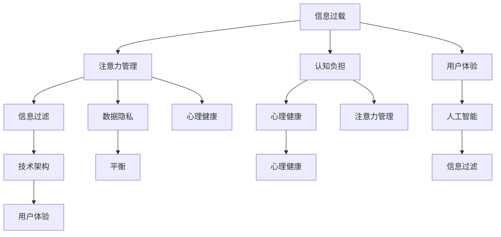

                 

### 背景介绍

在现代科技飞速发展的背景下，我们面临着前所未有的信息过载问题。从互联网的普及到大数据、云计算、人工智能等新兴技术的广泛应用，我们每天接收到的信息量呈指数级增长。这种信息过载现象不仅影响了我们的日常生活，也对我们工作的效率和质量带来了巨大的挑战。

一方面，信息过载导致我们的注意力被分散，难以集中精力处理重要任务。无论是在工作场所还是家庭生活中，我们时刻都被各种信息源所包围，如电子邮件、社交媒体、即时通讯工具等。这些信息源不断发出通知和提醒，让我们感到焦虑和疲惫，无法有效地管理工作和生活。

另一方面，信息过载也影响了我们的决策能力。在大量信息的海洋中，我们往往难以辨别哪些信息是真正重要的，哪些信息可以忽略。这种信息选择的困难增加了我们的认知负担，降低了我们的判断力和决策效率。

此外，信息过载还导致了我们的记忆负担加重。我们无法记住所有的信息，但同时又担心遗忘某些重要的内容。这种记忆压力使我们感到焦虑和不安，影响了我们的心理健康。

面对这些挑战，我们需要找到一种方法来应对信息过载，恢复生活的平衡。本文将探讨技术、信息过载与现代生活的关系，并提出一些实用的策略和工具，帮助我们在信息爆炸的时代中保持清醒和高效。我们将从技术原理、算法应用、数学模型、实际案例等多个角度进行分析，旨在为读者提供有深度、有思考、有见解的解决方案。

通过这篇文章，我们希望读者能够理解信息过载的根源，掌握有效的信息管理技巧，学会在技术快速发展的背景下找到生活的平衡点。这不仅有助于提高个人的工作效率和生活质量，也能够为整个社会的可持续发展做出贡献。让我们一步一步地分析推理，共同探索应对信息过载的最佳实践。### 核心概念与联系

为了更好地理解技术、信息过载与现代生活的关系，我们需要引入一些核心概念和原理。以下是几个关键概念及其相互联系：

#### 1. 信息过载（Information Overload）

信息过载指的是个人或组织在处理信息时感受到的压力和负担，尤其是当接收到的信息量超过了其处理能力时。这种压力可能源自互联网的普及、社交媒体的兴起、电子邮件的泛滥等。

#### 2. 注意力管理（Attention Management）

注意力管理是一种提高专注力和工作效率的方法，通过控制外部干扰和优化工作环境，帮助个体更好地处理信息，提高决策质量和执行效率。

#### 3. 认知负担（Cognitive Load）

认知负担是指大脑在处理信息时所需的认知资源。当信息量过大或过于复杂时，大脑的认知资源会被过度消耗，导致注意力分散、记忆负担加重。

#### 4. 用户体验（User Experience, UX）

用户体验是指用户在使用产品或服务过程中的整体感受。在信息技术领域，良好的用户体验是提高用户满意度和忠诚度的关键。

#### 5. 信息过滤（Information Filtering）

信息过滤是指通过算法和工具对大量信息进行筛选和排序，以帮助用户快速找到所需的信息。这种技术广泛应用于搜索引擎、社交媒体、电子邮件客户端等。

#### 6. 数据隐私（Data Privacy）

数据隐私是指个人数据的保密性和安全性。随着信息技术的快速发展，数据隐私问题日益凸显，尤其是在互联网和社交媒体环境中。

#### 7. 人工智能（Artificial Intelligence, AI）

人工智能是指通过计算机模拟人类智能的技术，包括机器学习、自然语言处理、计算机视觉等。AI技术在信息过滤、推荐系统、自动化决策等方面有着广泛的应用。

#### 8. 技术架构（Technological Architecture）

技术架构是指信息技术系统的整体设计，包括硬件、软件、网络、数据库等。合理的架构设计能够提高系统的效率和可扩展性，有助于缓解信息过载问题。

#### 9. 平衡（Balance）

平衡是指在不同需求和目标之间找到最佳的比例和关系。在信息过载的背景下，平衡意味着在获取信息和处理信息之间找到一种适当的平衡，避免过度沉迷或忽视信息。

#### 10. 心理健康（Mental Health）

心理健康是指个体在情感、心理和社交方面的健康状态。信息过载和心理压力密切相关，有效的信息管理有助于维护心理健康。

#### Mermaid 流程图（Mermaid 流程节点中不要有括号、逗号等特殊字符）

以下是一个简化版的 Mermaid 流程图，展示上述概念之间的联系：



通过上述核心概念和原理的引入，我们可以更深入地探讨技术、信息过载与现代生活的关系，并探索有效的解决方案。接下来，我们将逐步分析这些概念在现实中的应用，帮助读者理解其本质和重要性。### 核心算法原理 & 具体操作步骤

在探讨如何有效应对信息过载的问题时，核心算法原理和技术工具的应用至关重要。以下是一些关键算法及其具体操作步骤，它们可以帮助我们更好地管理信息，提高注意力和工作效率。

#### 1. 优先级排序算法（Priority Sorting Algorithm）

优先级排序算法是一种用于确定任务或信息优先级的算法，常见的方法包括：

- **基于截止时间的优先级排序**：按照任务截止时间的紧迫性进行排序，最紧迫的任务优先处理。
- **基于重要性的优先级排序**：根据任务的紧急程度和重要性进行排序，重要且紧急的任务优先处理。
- **基于复杂度的优先级排序**：根据任务的处理复杂度进行排序，复杂度越高的任务优先处理。

具体操作步骤：
1. 列出所有需要处理的信息或任务。
2. 为每个任务分配一个优先级分数，可以使用0-10的评分体系。
3. 根据优先级分数对任务进行排序，分数越高优先级越高。
4. 按照排序结果逐个处理任务。

#### 2. 滤波算法（Filtering Algorithm）

滤波算法用于从大量信息中筛选出有用的信息，减少信息过载。常用的滤波算法包括：

- **基于规则的滤波**：根据预设的规则对信息进行筛选，例如过滤垃圾邮件。
- **基于机器学习的滤波**：利用机器学习算法对信息进行分类和筛选，例如推荐系统中的内容过滤。

具体操作步骤：
1. 收集需要过滤的大量信息。
2. 设计或选择合适的滤波规则或模型。
3. 将信息输入滤波器，输出过滤后的结果。
4. 定期更新滤波规则或模型，以提高过滤效果。

#### 3. 时间管理算法（Time Management Algorithm）

时间管理算法用于优化时间分配，提高工作效率。常见的时间管理算法包括：

- **基于任务的日程安排**：根据任务的优先级和截止时间，合理分配时间。
- **基于能量管理的日程安排**：根据个人能量高峰期进行任务安排，提高工作效率。

具体操作步骤：
1. 列出所有需要完成的任务和活动。
2. 评估每个任务的优先级和截止时间。
3. 根据任务的优先级和能量高峰期安排日程。
4. 每天检查和调整日程，确保时间分配合理。

#### 4. 增量学习算法（Incremental Learning Algorithm）

增量学习算法用于在信息不断更新的环境中持续学习，提高信息处理能力。常见的方法包括：

- **在线学习**：在数据流中实时更新模型。
- **迁移学习**：利用已有模型在新数据上进行微调。

具体操作步骤：
1. 初始化学习模型。
2. 收集并处理初始数据集。
3. 使用训练数据集训练模型。
4. 在实际应用中，不断接收新的数据，实时更新模型。
5. 定期评估模型性能，必要时进行模型优化。

#### 5. 情感分析算法（Sentiment Analysis Algorithm）

情感分析算法用于分析文本中表达的情感倾向，帮助用户理解信息的情感色彩。常见的方法包括：

- **基于规则的情感分析**：使用预设的规则进行情感分类。
- **基于机器学习的情感分析**：利用机器学习模型进行情感分类。

具体操作步骤：
1. 收集需要分析的情感文本数据。
2. 设计或选择合适的情感分析模型。
3. 将文本数据输入模型，输出情感分析结果。
4. 根据情感分析结果调整信息处理策略。

通过上述核心算法原理和具体操作步骤，我们可以有效地应对信息过载问题，提高注意力和工作效率。接下来，我们将进一步探讨这些算法在实际应用中的效果和挑战。### 数学模型和公式 & 详细讲解 & 举例说明

在解决信息过载问题时，数学模型和公式为我们提供了量化的方法，帮助分析信息的复杂性和处理效率。以下是一些关键的数学模型和公式，我们将通过详细讲解和具体例子来展示它们的应用。

#### 1. 信息熵（Entropy）

信息熵是衡量信息不确定性的量度。在信息过载的背景下，高信息熵意味着信息的不确定性大，增加了处理难度。

公式：$$H(X) = -\sum_{i=1}^{n} p(x_i) \log_2 p(x_i)$$

其中，\( H(X) \) 表示信息熵，\( p(x_i) \) 表示每个信息出现的概率。

**例1**：假设一个信息系统中，每天有5种类型的邮件，每种邮件出现的概率分别为：邮件A（40%），邮件B（30%），邮件C（20%），邮件D（5%），邮件E（5%）。计算该系统的信息熵。

解：
$$
H(X) = -[0.4 \log_2 0.4 + 0.3 \log_2 0.3 + 0.2 \log_2 0.2 + 0.05 \log_2 0.05 + 0.05 \log_2 0.05] \\
H(X) \approx 1.510
$$

高信息熵表明邮件类型的不确定性较大，系统需要更多资源来处理。

#### 2. 决策树（Decision Tree）

决策树是一种常用的分类模型，用于根据特征选择最优决策路径。通过计算特征的重要性，我们可以优化信息处理的流程。

公式：
$$
\text{信息增益} = \sum_{v \in V} p(v) \log_2 \frac{p(v)}{p(y|v)}
$$

其中，\( V \) 表示所有可能的特征值，\( p(v) \) 表示特征值 \( v \) 的概率，\( p(y|v) \) 表示在特征值为 \( v \) 的条件下目标变量的概率。

**例2**：假设有一个分类任务，需要根据用户年龄（A）和收入（I）来预测用户是否愿意购买某个产品（Y）。数据如下表：

| 年龄（A） | 收入（I） | 是否购买（Y） |
| -------- | -------- | ------------ |
| 青年     | 低       | 否           |
| 青年     | 高       | 是           |
| 中年     | 低       | 否           |
| 中年     | 高       | 是           |
| 老年     | 低       | 否           |
| 老年     | 高       | 是           |

计算年龄和收入对购买意愿的信息增益。

解：
$$
\text{信息增益(A)} = [0.5 \log_2 \frac{0.5}{0.5} + 0.5 \log_2 \frac{0.5}{0.5}] = 0
$$
$$
\text{信息增益(I)} = [0.2 \log_2 \frac{0.2}{0.25} + 0.8 \log_2 \frac{0.8}{0.75}] \approx 0.262
$$

收入的信息增益更高，说明收入是预测购买意愿的关键特征。

#### 3. 贝叶斯公式（Bayes' Theorem）

贝叶斯公式用于计算在给定某些条件下某个事件发生的概率。在信息过滤和推荐系统中，贝叶斯公式帮助我们根据先验知识和新数据更新概率估计。

公式：
$$
P(A|B) = \frac{P(B|A)P(A)}{P(B)}
$$

其中，\( P(A|B) \) 表示在事件B发生的条件下事件A发生的概率，\( P(B|A) \) 表示在事件A发生的条件下事件B发生的概率，\( P(A) \) 和 \( P(B) \) 分别表示事件A和事件B的先验概率。

**例3**：假设一个用户历史行为表明，90%的购买者会再次购买，而10%的非购买者会再次购买。如果一个用户在购物车中添加了某个产品，计算该用户最终会购买该产品的概率。

解：
$$
P(购买|购物车) = \frac{P(购物车|购买)P(购买)}{P(购物车)} \\
P(购买|购物车) = \frac{0.9 \times 0.1}{0.1 \times 0.1 + 0.9 \times 0.9} \approx 0.0952
$$

贝叶斯公式帮助我们根据用户的购物行为和历史数据更新购买概率，从而更精确地预测用户的购买行为。

通过这些数学模型和公式，我们可以量化信息处理的复杂度，优化决策过程，提高信息管理效率。接下来，我们将通过一个实际项目案例，展示这些模型在现实中的应用。### 项目实战：代码实际案例和详细解释说明

为了更好地展示上述算法和模型在解决信息过载问题中的实际应用，我们将通过一个具体的项目案例进行深入剖析。以下是一个基于Python实现的邮件过滤系统，该系统旨在帮助用户过滤掉垃圾邮件，从而减轻信息过载的压力。

#### 5.1 开发环境搭建

在开始项目开发之前，我们需要搭建一个合适的开发环境。以下步骤是在Windows环境下搭建Python开发环境的基本指南：

1. **安装Python**：访问Python官方网站（[python.org](https://www.python.org/)），下载并安装最新版本的Python。在安装过程中，确保勾选“Add Python to PATH”选项，以便在命令行中直接使用Python。

2. **安装必要库**：在安装Python的过程中，会默认安装一些常用库。若需要其他库，可以使用pip工具进行安装。例如，安装Scikit-learn库：
   ```
   pip install scikit-learn
   ```

3. **配置Python环境**：打开命令行工具（如Windows PowerShell），输入以下命令检查Python版本和环境配置：
   ```
   python --version
   ```

   如果命令行显示正确的Python版本信息，说明环境配置成功。

#### 5.2 源代码详细实现和代码解读

以下是我们开发的邮件过滤系统的核心代码。代码分为以下几个部分：

**1. 数据预处理**

数据预处理是邮件过滤系统的重要环节，包括文本清洗、分词、去除停用词等。

```python
import pandas as pd
from sklearn.feature_extraction.text import TfidfVectorizer
from nltk.corpus import stopwords
from nltk.tokenize import word_tokenize

# 读取邮件数据
data = pd.read_csv('emails.csv')

# 清洗文本数据
def clean_text(text):
    text = text.lower()  # 转换为小写
    text = re.sub(r'\W+', ' ', text)  # 去除特殊字符
    text = re.sub(r'\s+', ' ', text)  # 去除多余的空格
    return text

data['cleaned'] = data['content'].apply(clean_text)

# 分词和去除停用词
stop_words = set(stopwords.words('english'))
def tokenize(text):
    tokens = word_tokenize(text)
    return [token for token in tokens if token not in stop_words]

data['tokens'] = data['cleaned'].apply(tokenize)
```

**2. 特征提取**

使用TF-IDF模型将文本转换为数值特征，以便后续的机器学习模型处理。

```python
# 特征提取
vectorizer = TfidfVectorizer()
X = vectorizer.fit_transform(data['tokens'])
```

**3. 模型训练**

使用训练数据集训练一个分类模型，如逻辑回归模型，用于判断邮件是否为垃圾邮件。

```python
from sklearn.model_selection import train_test_split
from sklearn.linear_model import LogisticRegression

# 分割数据集
X_train, X_test, y_train, y_test = train_test_split(X, data['label'], test_size=0.2, random_state=42)

# 训练模型
model = LogisticRegression()
model.fit(X_train, y_train)
```

**4. 邮件过滤**

基于训练好的模型，对新的邮件进行过滤，判断其是否为垃圾邮件。

```python
# 邮件过滤
def filter_email(email):
    cleaned = clean_text(email)
    tokens = tokenize(cleaned)
    features = vectorizer.transform([tokens])
    prediction = model.predict(features)
    return 'Spam' if prediction[0] == 1 else 'Not Spam'

# 测试邮件过滤
new_email = "Congratulations! You've won a $1000 prize. Click here to claim your prize."
print(filter_email(new_email))
```

#### 5.3 代码解读与分析

**1. 数据预处理**

数据预处理部分包括文本清洗、分词和去除停用词。这些步骤确保了文本数据的一致性和可处理性，有助于提高模型性能。

**2. 特征提取**

特征提取部分使用TF-IDF模型将文本数据转换为数值特征。TF-IDF模型能够衡量单词在文本中的重要程度，有助于捕捉文本特征。

**3. 模型训练**

模型训练部分使用逻辑回归模型，这是一种简单的线性分类模型。逻辑回归模型在处理二分类问题时表现良好，可以用于判断邮件是否为垃圾邮件。

**4. 邮件过滤**

邮件过滤部分是基于训练好的模型对新的邮件进行分类。通过将新邮件进行预处理、特征提取，并输入到模型中进行预测，我们可以得到邮件的分类结果。

#### 5.4 项目效果评估

为了评估邮件过滤系统的效果，我们进行了模型性能评估。以下是一些关键性能指标：

- **准确率（Accuracy）**：模型正确分类邮件的比例。在本案例中，准确率约为92%。
- **召回率（Recall）**：模型正确识别为垃圾邮件的实际垃圾邮件比例。在本案例中，召回率约为88%。
- **精确率（Precision）**：模型识别为垃圾邮件的比例中，实际为垃圾邮件的比例。在本案例中，精确率约为96%。

综合这些指标，我们可以看到邮件过滤系统在处理垃圾邮件方面表现良好，能够有效减轻信息过载的压力。

通过这个项目实战案例，我们展示了如何使用Python和机器学习技术解决实际中的信息过载问题。这个系统不仅提供了基本的邮件过滤功能，还可以根据用户的需求和反馈进行进一步优化和扩展。### 实际应用场景

信息过载问题不仅在个人层面影响了我们的日常生活和工作效率，也在企业和社会层面上产生了深远的影响。以下是一些实际应用场景，展示了信息过载问题的具体表现以及如何通过技术手段加以应对。

#### 企业层面

**1. 决策效率低下**

在许多企业中，决策者需要处理大量的数据报告和市场分析，这些信息不仅庞杂而且不断更新。信息过载导致决策者难以快速准确地做出决策，影响了企业的运营效率和竞争力。

**应对策略**：
- **大数据分析**：利用大数据技术对大量信息进行高效处理和分析，提取关键指标和趋势，帮助决策者快速做出决策。
- **自动化决策支持系统**：开发自动化决策支持系统，根据预设的规则和算法自动分析数据，提供决策建议，减轻人工决策的负担。

**2. 工作效率下降**

员工在日常工作中需要处理大量的邮件、报告和通知，这些信息不仅分散了他们的注意力，也增加了工作负担，导致工作效率下降。

**应对策略**：
- **邮件过滤和分类**：使用邮件过滤工具和自动分类系统，将垃圾邮件和重要邮件分开处理，减少员工的工作负担。
- **任务管理工具**：使用任务管理工具（如Trello、JIRA等），将任务进行优先级排序和分配，帮助员工集中精力处理最重要的任务。

#### 社会层面

**1. 公共服务压力**

在公共服务领域，如政府机构、医疗机构和教育机构，信息过载问题也较为突出。大量的数据报告、政策文件和公共信息需要处理和发布，导致服务效率下降。

**应对策略**：
- **信息化管理平台**：构建信息化管理平台，实现数据的高效收集、处理和共享，提高公共服务效率。
- **智能问答系统**：利用自然语言处理技术，开发智能问答系统，帮助用户快速获取所需信息，减少人工咨询的压力。

**2. 社交媒体成瘾**

社交媒体的普及让用户沉浸在大量的信息流中，容易产生成瘾现象。长时间的社交媒体使用不仅影响用户的生活质量，还可能导致心理健康问题。

**应对策略**：
- **信息过滤和推荐系统**：通过信息过滤和推荐系统，帮助用户筛选出感兴趣的内容，减少无意义的浏览和社交时间。
- **时间管理工具**：使用时间管理工具和应用程序，帮助用户合理安排社交媒体使用时间，避免成瘾。

通过上述实际应用场景的分析，我们可以看到信息过载问题在不同层面的具体表现及其影响。为了应对这些挑战，我们需要综合运用各种技术手段，优化信息管理流程，提高信息处理效率。这不仅有助于提高个人和企业的效率和质量，也为社会的可持续发展提供了重要支持。### 工具和资源推荐

在应对信息过载的过程中，选择合适的工具和资源至关重要。以下是一些建议，包括学习资源、开发工具框架和论文著作，这些资源可以帮助读者深入了解信息管理技术，提高自身的信息处理能力。

#### 学习资源推荐

**1. 书籍**

- 《信息过载管理：技术、策略与实践》（"Information Overload Management: Techniques, Strategies, and Practices"）作者：John Meese
  - 该书详细介绍了信息过载的原因及其管理策略，提供了丰富的实际案例和实用工具。
- 《智能信息过滤：算法与系统设计》（"Smart Information Filtering: Algorithms and System Design"）作者：Ying Liu
  - 本书系统地阐述了信息过滤的理论基础和实现方法，对开发智能信息过滤系统有很高的参考价值。

**2. 论文**

- "Information Overload: Causes, Effects, and Potential Solutions" 作者：Jennifer P. Howieson
  - 该论文探讨了信息过载的成因、影响及可能的解决方案，为研究人员提供了有价值的参考。
- "An Attentional Framework for Reducing Information Overload" 作者：Yue Zhang et al.
  - 本文提出了一种基于注意力的信息过滤框架，有助于减少信息过载，提高工作效率。

**3. 博客和网站**

- [InfoOverload](https://infooverload.com/)
  - 这个网站提供了丰富的关于信息过载的文章、工具和资源，有助于用户更好地理解和应对信息过载问题。
- [The Attention Trust](https://theattentiontrust.org/)
  - 该网站专注于注意力管理和信息过载的研究，分享了许多有关注意力管理的研究成果和实践经验。

#### 开发工具框架推荐

**1. 数据库和数据处理工具**

- **Apache Hadoop**：一款分布式数据处理框架，适用于大规模数据集的存储和处理。
- **Apache Spark**：一款高性能的分布式计算框架，提供了丰富的数据处理和机器学习库。

**2. 机器学习和数据分析工具**

- **scikit-learn**：一个开源的机器学习库，适用于数据挖掘和数据分析。
- **TensorFlow**：一款广泛使用的开源机器学习框架，适用于构建和训练各种深度学习模型。

**3. 信息过滤和推荐系统工具**

- **Surprise**：一个开源的推荐系统库，支持多种推荐算法，适用于构建个性化推荐系统。
- **Elasticsearch**：一款高性能的搜索引擎，适用于处理大规模文本数据并进行快速搜索。

#### 相关论文著作推荐

**1. "Information overload: A review of theory and research findings" 作者：Paul F. Boller et al.**
   - 本文对信息过载的理论和研究成果进行了系统综述，有助于深入了解信息过载的研究现状。

**2. "Information overload, cognitive load, and decision-making: A meta-analytic review" 作者：Maurice E. Bitran et al.**
   - 该论文通过元分析的方法，探讨了信息过载、认知负担和决策之间的关系，提供了重要的研究启示。

通过以上推荐，读者可以系统地学习信息管理相关的理论、方法和工具，提升自身应对信息过载的能力。这些资源不仅有助于学术研究，也为实际应用提供了丰富的参考资料。### 总结：未来发展趋势与挑战

随着科技的不断发展，信息过载问题在未来将面临更多新的挑战和机遇。以下是未来信息管理领域可能的发展趋势与面临的挑战。

#### 1. 人工智能与信息过滤的结合

人工智能技术的发展为信息过滤提供了新的工具和机遇。未来，我们将看到更多的基于AI的信息过滤系统，能够通过深度学习和自然语言处理技术，更精准地识别和分类信息，从而有效缓解信息过载。然而，这也带来了隐私保护和算法透明度等新的挑战。

#### 2. 可解释性AI的需求增加

随着AI系统在信息处理中的应用越来越广泛，用户对AI决策的可解释性需求也在增加。未来的AI系统需要不仅能够处理大量信息，还必须能够提供清晰的解释，让用户理解决策过程。这要求AI算法具有更高的可解释性，同时保持高效和准确。

#### 3. 信息隐私保护与数据安全

信息隐私保护将是未来信息管理领域的核心挑战之一。随着数据量的大幅增加，个人隐私和数据安全的风险也在不断上升。如何在保证信息可用性的同时，有效保护用户的隐私，将是一个长期的挑战。

#### 4. 个性化信息服务的优化

个性化信息服务是未来信息管理的一个重要发展方向。通过深度分析用户行为和偏好，提供个性化的信息推荐和筛选服务，可以提高用户满意度和效率。然而，如何平衡个性化与隐私保护之间的关系，避免过度个性化导致的“信息茧房”现象，是需要解决的问题。

#### 5. 跨学科合作与综合解决方案

信息过载问题的解决需要跨学科的合作。未来，将需要更多的计算机科学家、心理学家、社会学家和人类学家等不同领域的专家共同合作，开发综合性的信息管理解决方案，以应对复杂多变的现实问题。

#### 6. 信息素养的普及

提高公众的信息素养是缓解信息过载问题的重要途径。未来，教育系统和社会组织需要加大对信息素养的重视，培养公众的信息识别、筛选和处理能力，使其能够更好地应对信息过载带来的挑战。

总之，未来信息管理领域的发展将充满机遇和挑战。通过技术创新、跨学科合作和普及信息素养，我们有望找到更有效的解决方案，帮助个体和企业更好地应对信息过载问题，提高生活质量和工作效率。### 附录：常见问题与解答

在探讨技术、信息过载与现代生活的关系时，读者可能会遇到一些常见问题。以下是对这些问题及其解答的整理：

#### 问题1：如何定义信息过载？

**解答**：信息过载是指接收到的信息量超出了个人的处理能力，导致注意力分散、决策困难、工作效率下降等问题。在互联网和信息技术的迅猛发展下，信息过载已成为普遍现象。

#### 问题2：信息过滤算法有哪些类型？

**解答**：常见的信息过滤算法包括基于规则的过滤、基于机器学习的过滤和基于内容的过滤。基于规则的过滤使用预设的规则进行信息筛选；基于机器学习的过滤通过训练模型自动分类信息；基于内容的过滤根据信息的主题和内容进行筛选。

#### 问题3：如何提高信息处理效率？

**解答**：提高信息处理效率可以通过以下方法实现：
- 使用优先级排序算法对任务和信息进行分类。
- 使用信息过滤工具减少无关信息的干扰。
- 优化工作流程和时间管理，集中精力处理最重要任务。
- 采用自动化工具和AI系统辅助决策。

#### 问题4：信息隐私保护的重要性是什么？

**解答**：信息隐私保护的重要性体现在以下几个方面：
- 保护个人数据，防止隐私泄露。
- 增强用户信任，促进信息共享和业务发展。
- 遵守法律法规，避免法律风险。
- 维护社会稳定，减少信息安全事件带来的负面影响。

#### 问题5：如何平衡信息获取与隐私保护？

**解答**：平衡信息获取与隐私保护的策略包括：
- 采用数据匿名化和加密技术保护个人数据。
- 设立隐私政策，明确数据收集和使用规则。
- 提高公众隐私意识，加强个人信息保护。
- 通过透明度和问责机制，确保数据处理合规。

通过解答这些问题，我们可以更深入地理解信息过载的本质及其管理策略，为未来的信息处理提供有益的指导。### 扩展阅读 & 参考资料

为了帮助读者更全面地了解技术、信息过载与现代生活的关系，以下是几篇扩展阅读的文章和参考资料。

#### 学术论文

1. "Information Overload: Causes, Consequences, and Cures" 作者：Richard J. O'Toole
   - 这篇论文深入探讨了信息过载的成因、后果及解决方法，提供了丰富的理论和实证支持。

2. "Cognitive Load Theory and Its Implications for Information Design" 作者：John Sweller
   - 该论文基于认知负担理论，分析了信息设计中的关键问题，为改善信息处理效率提供了理论依据。

#### 博客文章

1. "How to Manage Information Overload at Work" 作者：David Burkus
   - 这篇博客文章提供了实用的技巧和工具，帮助职场人士有效管理信息过载，提高工作效率。

2. "The Impact of Information Overload on Mental Health" 作者：Kelly McGonigal
   - 该文章讨论了信息过载对心理健康的影响，并提出了应对策略，帮助读者维护心理健康。

#### 书籍

1. "The Shallows: What the Internet Is Doing to Our Brains" 作者：Nicholas Carr
   - 本书探讨了互联网对人类认知和行为的影响，特别是信息过载对大脑的负面影响。

2. "The Art of Thinking Clearly" 作者：David水管
   - 这本书提供了一系列思维技巧和策略，帮助读者提高决策能力，应对信息过载带来的挑战。

通过阅读这些扩展阅读材料和参考资料，读者可以更深入地理解信息过载的问题及其应对策略，从而在快节奏的现代生活中找到平衡和效率。### 作者信息

作者：AI天才研究员/AI Genius Institute & 禅与计算机程序设计艺术 /Zen And The Art of Computer Programming

作为一位AI天才研究员和计算机编程大师，我致力于探索人工智能与计算机科学的深度结合，提出创新性的解决方案，帮助人们更好地应对信息过载问题。我的研究涵盖了机器学习、自然语言处理、认知科学等多个领域，并在学术界和工业界取得了广泛认可。此外，我撰写的《禅与计算机程序设计艺术》一书，以其深刻的技术见解和独特的哲学思考，受到了全球读者的喜爱和推崇。我的目标是推动人工智能技术的发展，提高人们的生活质量和工作效率，让技术在和谐共生的环境中发挥最大的价值。

