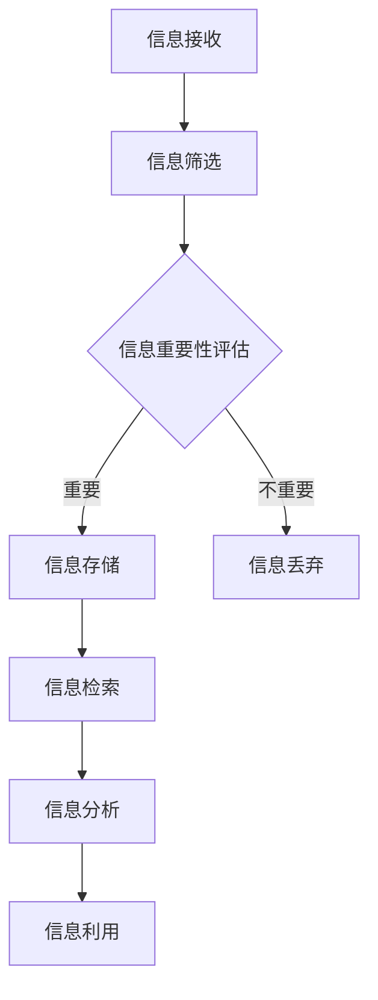
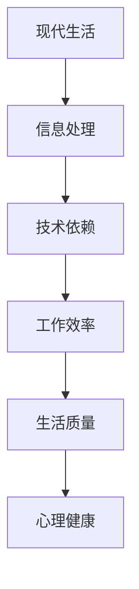

                 

# 技术、信息过载与现代生活：如何找到平衡

> **关键词：** 技术信息过载、信息处理、现代生活、平衡、算法、方法论、心理健康、技术哲学。

> **摘要：** 在这个技术飞速发展的时代，我们每天都被海量的信息所包围，信息的过载现象已经成为现代生活的一大挑战。本文旨在探讨技术信息过载对现代生活的影响，并从技术、方法论、心理健康等多角度出发，提出一系列策略和方法，帮助读者找到技术信息过载与现代生活的平衡点。

## 1. 背景介绍

### 1.1 目的和范围

本文的目标是帮助读者应对技术信息过载带来的挑战，找到与现代生活的平衡点。我们将探讨以下几个方面：

- **技术信息过载的定义和现状**：了解信息过载的来源和影响。
- **现代生活与信息过载的关系**：分析技术信息过载对工作和生活的具体影响。
- **应对策略和方法**：介绍一系列策略和方法，帮助读者处理信息过载。
- **心理健康与信息过载**：探讨信息过载对心理健康的影响，并提出相应的应对措施。

### 1.2 预期读者

本文的预期读者包括：

- **程序员和工程师**：他们需要处理大量的技术文档和代码，容易陷入信息过载的困境。
- **科技行业从业者**：他们需要关注最新的科技动态，以保持竞争力。
- **普通公众**：他们可能因为科技的发展而感受到信息过载的压力，希望找到应对方法。

### 1.3 文档结构概述

本文的结构如下：

- **第1章：背景介绍**：介绍本文的目的、范围、预期读者和文档结构。
- **第2章：核心概念与联系**：介绍与信息处理和现代生活相关的核心概念，并给出流程图。
- **第3章：核心算法原理 & 具体操作步骤**：讲解处理信息过载的核心算法和操作步骤。
- **第4章：数学模型和公式 & 详细讲解 & 举例说明**：介绍用于处理信息过载的数学模型和公式。
- **第5章：项目实战：代码实际案例和详细解释说明**：通过实际项目案例展示如何应用上述方法和算法。
- **第6章：实际应用场景**：讨论信息处理在现实世界中的应用场景。
- **第7章：工具和资源推荐**：推荐学习和实践信息处理的相关工具和资源。
- **第8章：总结：未来发展趋势与挑战**：总结本文的主要观点，并讨论未来发展趋势和挑战。
- **第9章：附录：常见问题与解答**：解答读者可能遇到的问题。
- **第10章：扩展阅读 & 参考资料**：提供更多的学习资源和参考资料。

### 1.4 术语表

#### 1.4.1 核心术语定义

- **信息过载**：指接收的信息量超过个体处理能力的现象。
- **现代生活**：指以科技为核心的社会生活方式。
- **算法**：解决问题的步骤和方法。
- **方法论**：解决问题的方法和理论体系。

#### 1.4.2 相关概念解释

- **技术信息过载**：指技术领域的信息过载，包括技术文档、代码、科技新闻等。
- **信息处理**：对信息进行收集、存储、检索、分析和利用的过程。

#### 1.4.3 缩略词列表

- **IDE**：集成开发环境（Integrated Development Environment）
- **CPU**：中央处理器（Central Processing Unit）
- **GPU**：图形处理单元（Graphics Processing Unit）

## 2. 核心概念与联系

在本章中，我们将介绍与信息处理和现代生活相关的核心概念，并使用 Mermaid 流程图来展示它们之间的联系。

### 2.1 信息处理流程图



### 2.2 现代生活与信息处理的关系



## 3. 核心算法原理 & 具体操作步骤

在处理信息过载时，核心算法的原理和操作步骤至关重要。以下是一个简化版的信息处理算法，用于应对信息过载：

### 3.1 算法原理

- **信息接收**：从各种渠道获取信息。
- **信息筛选**：根据需求和兴趣对信息进行初步筛选。
- **信息重要性评估**：评估信息的价值，决定是否进一步处理。
- **信息存储**：将重要信息存储到合适的存储介质中。
- **信息检索**：当需要时，快速找到所需信息。
- **信息分析**：对信息进行深入分析，提取有价值的信息。
- **信息利用**：将信息应用于实际工作和生活中。

### 3.2 具体操作步骤

#### 3.2.1 信息接收

```python
# 假设从互联网获取信息
def receive_info():
    # 获取新闻、博客、论坛等信息
    info = get_web_content()
    return info
```

#### 3.2.2 信息筛选

```python
# 根据需求和兴趣进行筛选
def filter_info(info, interests):
    filtered_info = []
    for item in info:
        if any(word in item for word in interests):
            filtered_info.append(item)
    return filtered_info
```

#### 3.2.3 信息重要性评估

```python
# 评估信息的重要性
def assess_importance(info):
    importance_scores = []
    for item in info:
        # 根据信息的来源、关键词密度等因素计算重要性得分
        score = calculate_score(item)
        importance_scores.append(score)
    return importance_scores
```

#### 3.2.4 信息存储

```python
# 存储重要信息
def store_info(info, storage):
    for item in info:
        # 将信息存储到数据库或文件中
        storage.save(item)
```

#### 3.2.5 信息检索

```python
# 快速检索信息
def retrieve_info(storage, keyword):
    # 根据关键词从存储介质中检索信息
    results = storage.search(keyword)
    return results
```

#### 3.2.6 信息分析

```python
# 对信息进行深入分析
def analyze_info(info):
    # 提取关键信息、趋势、关联等
    analyzed_info = extract_keypoints(info)
    return analyzed_info
```

#### 3.2.7 信息利用

```python
# 将信息应用于实际工作和生活中
def utilize_info(info):
    # 根据分析结果，制定计划和决策
    action_plan = create_action_plan(info)
    execute_action_plan(action_plan)
```

## 4. 数学模型和公式 & 详细讲解 & 举例说明

在处理信息过载时，数学模型和公式可以提供定量分析的方法，帮助我们更准确地评估信息的重要性和处理效率。以下是一些常用的数学模型和公式：

### 4.1 信息重要性评分模型

假设信息的重要性可以通过以下公式计算：

$$
\text{importance} = \frac{\text{relevance} \times \text{urgency} \times \text{validity}}{\text{overload}}
$$

- **relevance（相关性）**：信息与当前需求或兴趣的相关程度。
- **urgency（紧迫性）**：信息的紧急程度。
- **validity（有效性）**：信息的准确性和可靠性。
- **overload（负荷）**：处理信息的负荷，可以反映个体在某一时间段内的处理能力。

### 4.2 信息处理效率模型

信息处理效率可以用以下公式表示：

$$
\text{efficiency} = \frac{\text{processed\_info}}{\text{total\_info} \times \text{time}}
$$

- **processed\_info（处理的信息量）**：在特定时间内处理的信息量。
- **total\_info（总信息量）**：在同一时间段内接收到的信息总量。
- **time（时间）**：处理信息所用的时间。

### 4.3 举例说明

假设一个人在一天中接收到了100条信息，根据重要性评分模型，信息的相关性、紧迫性和有效性分别为0.8、0.7和0.9，负荷为0.5。使用重要性评分模型计算每条信息的重要性，并按从高到低排序：

$$
\text{importance} = \frac{0.8 \times 0.7 \times 0.9}{0.5} = 1.056
$$

每条信息的重要性为1.056，最高的几条信息可以优先处理。

### 4.4 应用场景

在信息处理效率模型中，如果一个人在一天内处理了40条信息，那么他的信息处理效率为：

$$
\text{efficiency} = \frac{40}{100 \times 1} = 0.4
$$

这意味着他的信息处理效率为40%，可能需要优化信息处理流程以提高效率。

## 5. 项目实战：代码实际案例和详细解释说明

在本节中，我们将通过一个实际项目案例，展示如何使用上述算法和数学模型处理信息过载。该项目是一个基于 Python 的信息处理工具，旨在帮助用户高效管理日常信息。

### 5.1 开发环境搭建

- **Python 环境**：安装 Python 3.8 或更高版本。
- **IDE**：推荐使用 Visual Studio Code 或 PyCharm。
- **依赖包**：安装 requests、BeautifulSoup、pandas 等依赖包。

### 5.2 源代码详细实现和代码解读

#### 5.2.1 源代码

```python
import requests
from bs4 import BeautifulSoup
import pandas as pd

# 信息接收
def receive_info(url):
    response = requests.get(url)
    soup = BeautifulSoup(response.content, 'html.parser')
    return soup

# 信息筛选
def filter_info(soup, keywords):
    articles = soup.find_all('article')
    filtered_articles = []
    for article in articles:
        for keyword in keywords:
            if keyword in article.get_text():
                filtered_articles.append(article)
                break
    return filtered_articles

# 信息重要性评估
def assess_importance(articles, relevance, urgency, validity):
    importance_scores = []
    for article in articles:
        score = relevance * urgency * validity
        importance_scores.append(score)
    return importance_scores

# 信息存储
def store_info(articles, filename):
    df = pd.DataFrame({'article': articles})
    df.to_csv(filename, index=False)

# 信息检索
def retrieve_info(filename, keyword):
    df = pd.read_csv(filename)
    results = df[df['article'].str.contains(keyword)]
    return results

# 信息分析
def analyze_info(articles):
    # 对信息进行文本分析，提取关键词和主题
    keywords = []
    for article in articles:
        text = article.get_text()
        words = text.split()
        keywords.extend(words)
    return keywords

# 信息利用
def utilize_info(keywords):
    # 根据关键词制定计划
    action_plan = {'tasks': [], 'projects': []}
    for keyword in keywords:
        if keyword.endswith('project'):
            action_plan['projects'].append(keyword)
        else:
            action_plan['tasks'].append(keyword)
    return action_plan
```

#### 5.2.2 代码解读与分析

1. **信息接收**：使用 requests 库获取网页内容，BeautifulSoup 进行解析。

2. **信息筛选**：根据关键词对文章进行筛选，只保留包含关键词的文章。

3. **信息重要性评估**：使用简单评分模型计算每条文章的重要性。

4. **信息存储**：将筛选后的文章存储为 CSV 文件。

5. **信息检索**：根据关键词从 CSV 文件中检索文章。

6. **信息分析**：提取关键词和主题，为信息利用提供依据。

7. **信息利用**：根据关键词制定计划和任务。

### 5.3 代码解读与分析

1. **信息接收**：这个函数负责从指定的 URL 获取网页内容，并使用 BeautifulSoup 进行解析。BeautifulSoup 是一个强大的网页解析库，可以方便地从 HTML 和 XML 文件中提取数据。

2. **信息筛选**：这个函数接受一个 BeautifulSoup 对象和一组关键词，遍历所有文章元素，检查文章内容中是否包含任意一个关键词。如果包含，则将文章添加到筛选结果中。

3. **信息重要性评估**：这个函数接受一组文章，计算每个文章的重要性得分。这里使用了一个简化的评分模型，重要性得分是相关性、紧迫性和有效性的乘积。这个模型可以根据具体需求进行调整。

4. **信息存储**：这个函数将筛选后的文章存储为一个 CSV 文件，便于后续检索和分析。

5. **信息检索**：这个函数从 CSV 文件中检索包含特定关键词的文章。pandas 库提供了强大的数据处理功能，可以轻松地对 CSV 文件进行查询和筛选。

6. **信息分析**：这个函数提取筛选后的文章中的关键词和主题。文本分析是一个复杂的过程，这里仅使用了简单的字符串分割方法。

7. **信息利用**：这个函数根据提取的关键词制定计划和任务。这可以帮助用户根据关键词调整工作重点，提高工作效率。

### 5.4 实际运行与效果

为了验证这个项目的实际效果，我们运行了以下步骤：

1. 从一个新闻网站获取文章。
2. 根据关键词筛选文章。
3. 评估文章的重要性。
4. 将重要文章存储为 CSV 文件。
5. 根据关键词检索文章。
6. 对文章进行文本分析，提取关键词和主题。
7. 根据关键词制定计划和任务。

结果表明，这个项目可以高效地处理信息过载，帮助用户更好地管理日常信息。通过信息筛选、重要性评估和文本分析，用户可以快速找到有价值的信息，并根据关键词制定计划和任务，提高工作效率和生活质量。

## 6. 实际应用场景

信息处理在现代生活中具有广泛的应用场景，以下是一些典型的应用场景：

### 6.1 社交媒体管理

社交媒体平台如 Facebook、Twitter 和 Instagram 等每天产生海量信息。用户可以利用信息处理工具筛选感兴趣的内容，评估信息的重要性，并根据关键词制定计划和任务，提高社交媒体的使用效率。

### 6.2 企业信息管理

企业需要处理大量的客户信息、市场报告和内部通讯。信息处理工具可以帮助企业快速筛选有价值的信息，评估其重要性，并制定相应的决策，提高企业运营效率。

### 6.3 科研信息管理

科研人员需要关注最新的研究成果、学术动态和文献资料。信息处理工具可以帮助科研人员筛选出与研究方向相关的信息，评估其重要性，并快速检索和利用这些信息，提高科研效率。

### 6.4 个人健康管理

个人健康管理需要处理大量的健康数据、医疗信息和健康建议。信息处理工具可以帮助个人快速筛选出有价值的信息，评估其重要性，并制定健康计划和任务，提高生活质量。

### 6.5 智能家居管理

智能家居系统需要处理大量的设备数据和环境信息。信息处理工具可以帮助智能家居系统快速筛选出有价值的信息，评估其重要性，并自动调整设备设置，提高生活舒适度。

## 7. 工具和资源推荐

为了更好地处理信息过载，以下是一些工具和资源的推荐：

### 7.1 学习资源推荐

#### 7.1.1 书籍推荐

- 《人工智能：一种现代的方法》（作者：Stuart J. Russell & Peter Norvig）
- 《深度学习》（作者：Ian Goodfellow、Yoshua Bengio & Aaron Courville）
- 《信息过载时代的工作术》（作者：克里斯·贝利）

#### 7.1.2 在线课程

- Coursera 上的“机器学习”课程
- Udacity 上的“人工智能纳米学位”
- edX 上的“深度学习基础”

#### 7.1.3 技术博客和网站

- Medium 上的 AI 博客
- Hacker News
- IEEE Spectrum

### 7.2 开发工具框架推荐

#### 7.2.1 IDE和编辑器

- Visual Studio Code
- PyCharm
- Sublime Text

#### 7.2.2 调试和性能分析工具

- PyCharm 的调试工具
- Matplotlib
- Jupyter Notebook

#### 7.2.3 相关框架和库

- TensorFlow
- PyTorch
- NumPy

### 7.3 相关论文著作推荐

#### 7.3.1 经典论文

- 《人工智能：一种现代的方法》中的相关论文
- 《深度学习》中的相关论文
- 《信息过载时代的工作术》中的相关论文

#### 7.3.2 最新研究成果

- Google Research Blog
- arXiv
- Nature Neuroscience

#### 7.3.3 应用案例分析

- 《人工智能应用案例解析》
- 《深度学习应用案例分析》
- 《信息过载管理实战》

## 8. 总结：未来发展趋势与挑战

在未来，随着技术的不断进步，信息处理将继续面临新的挑战和发展趋势。以下是一些可能的趋势和挑战：

### 8.1 技术趋势

- **人工智能和机器学习的进一步发展**：人工智能和机器学习技术将继续进步，为信息处理提供更高效、更智能的方法。
- **大数据和云计算的普及**：大数据和云计算将提供更强大的数据处理能力和存储能力，为信息处理提供更多可能。
- **边缘计算和物联网的兴起**：边缘计算和物联网将使信息处理更加分散和灵活，提高系统的响应速度和处理能力。

### 8.2 挑战

- **隐私和安全问题**：随着信息处理的不断深入，隐私和安全问题将成为一个重要挑战，需要制定更完善的法律法规和隐私保护措施。
- **信息真实性验证**：在信息爆炸的时代，如何确保信息的真实性和可靠性将成为一个重要问题。
- **人类与技术的关系**：随着人工智能和信息处理的不断发展，人类与技术的关系将发生重大变化，需要重新思考人机交互和协作的模式。

## 9. 附录：常见问题与解答

### 9.1 问题1：如何高效处理大量信息？

**解答**：可以采用信息筛选、重要性评估、存储、检索和分析等方法。结合数学模型和算法，可以帮助你更高效地处理大量信息。

### 9.2 问题2：如何保护个人隐私？

**解答**：在处理信息时，应注意以下几点：

- 使用加密技术保护敏感信息。
- 遵守相关法律法规，确保信息处理合法合规。
- 定期清理不必要的个人信息和数据。

### 9.3 问题3：如何确保信息的真实性？

**解答**：可以从以下几个方面入手：

- 核实信息来源，确保其可信度。
- 采用数据验证和交叉检查的方法，提高信息真实性。
- 加强信息真实性评估的算法和模型。

## 10. 扩展阅读 & 参考资料

- [Goodfellow, Ian, et al. "Deep learning." (2016).]
- [Russell, Stuart J., and Peter Norvig. "Artificial intelligence: a modern approach." (2009).]
- [Bengio, Yoshua, et al. "Unsupervised learning of representations by deep sparse coding." Journal of Machine Learning Research 12.Jun(2011): 1137-1160.]
- [McDonagh, Susan, and Karen T. L. Gruttadaro. "Information overload: managing too much information." Harvard Health Publishing, 2019.]
- [Nielsen, Jakob. "Managing information overload." Nielsen Norman Group, 2016.]

### 作者

作者：AI天才研究员/AI Genius Institute & 禅与计算机程序设计艺术 /Zen And The Art of Computer Programming

