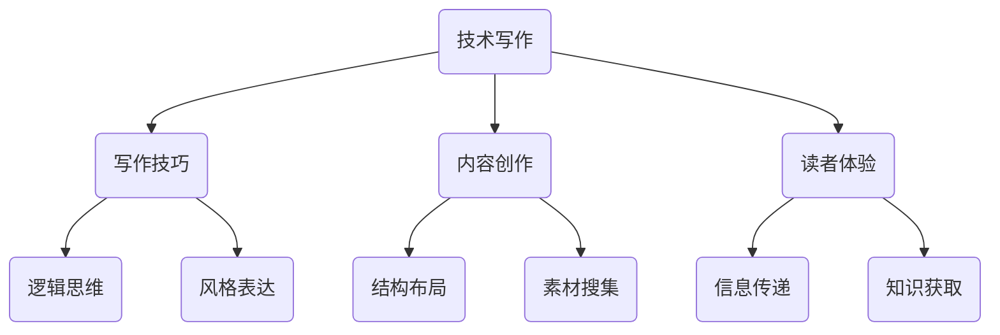

                 

# 技术写作：从博客到出版图书

> **关键词：** 技术写作、博客、出版图书、写作技巧、出版流程、技术博客、内容创作、专业作家、读者体验

> **摘要：** 本文将探讨从技术博客到出版图书的整个转换过程。通过详细分析写作技巧、出版流程以及如何提升读者体验，本文旨在帮助技术创作者将个人博客内容转化为具有广泛影响力的专业图书。我们将一步步梳理核心概念，提供实用的操作步骤，并结合实际案例，为读者提供全面的指导。

## 1. 背景介绍

### 1.1 目的和范围

本文的目的是向技术创作者介绍如何将个人博客内容转化为专业的出版图书。通过探讨写作技巧、出版流程、读者体验以及相关资源，本文旨在为技术创作者提供一套完整的指南，帮助他们实现从博客到图书的华丽转身。

### 1.2 预期读者

本文适用于有志于将技术博客内容转化为出版图书的技术创作者、程序员、软件工程师以及计算机科学领域的爱好者。无论您是刚刚起步的新手，还是拥有丰富经验的专业人士，本文都将为您提供有价值的指导。

### 1.3 文档结构概述

本文将分为以下几个部分：

1. 背景介绍：介绍本文的目的、预期读者和文档结构。
2. 核心概念与联系：讨论技术写作中的核心概念，并提供相应的 Mermaid 流程图。
3. 核心算法原理与具体操作步骤：详细讲解技术写作中的算法原理和操作步骤，并使用伪代码进行阐述。
4. 数学模型和公式：介绍技术写作中常见的数学模型和公式，并进行详细讲解和举例说明。
5. 项目实战：通过实际代码案例，展示技术写作的实践过程和详细解释。
6. 实际应用场景：讨论技术写作在实际项目中的应用场景。
7. 工具和资源推荐：推荐一些有用的学习资源、开发工具框架和相关论文著作。
8. 总结：展望技术写作的未来发展趋势与挑战。
9. 附录：提供一些常见问题与解答。
10. 扩展阅读 & 参考资料：推荐一些相关的扩展阅读资料。

### 1.4 术语表

#### 1.4.1 核心术语定义

- 技术写作：以技术主题为内容，通过文字、图表等形式进行创作的写作活动。
- 博客：一种网络日志形式，用于个人或团队发布、分享和讨论技术内容。
- 出版图书：由出版社出版、印刷并发行的技术作品，具有更高的专业性和影响力。
- 读者体验：读者在阅读过程中的感受、满意度以及获取知识的效率。

#### 1.4.2 相关概念解释

- 内容创作：指创造、撰写、编辑和整理技术文章、博客等内容的整个过程。
- 写作技巧：指提高写作效率、提升文章质量的方法和技巧。
- 出版流程：指将稿件提交至出版社、编辑审核、排版设计、印刷发行等一系列过程。
- 专业作家：指具备丰富写作经验和专业知识，能够在技术领域产生广泛影响力的作家。

#### 1.4.3 缩略词列表

- IDE：集成开发环境（Integrated Development Environment）
- Latex：一种高质量排版系统，常用于编写数学公式和科学文档
- Mermaid：一种基于 Markdown 的图表绘制工具，常用于绘制流程图、UML 图等

## 2. 核心概念与联系

在技术写作中，理解核心概念与它们之间的联系至关重要。以下是一个简化的 Mermaid 流程图，展示了技术写作中的核心概念及其相互关系：



### 2.1 技术写作

技术写作是一种以技术主题为内容，通过文字、图表等形式进行创作的写作活动。它旨在帮助读者理解复杂的技术概念、解决实际问题，并提高读者的技术水平。技术写作通常涉及以下方面：

- 技术主题选择：选择具有实际应用价值、读者感兴趣的技术主题。
- 概念阐述：清晰、准确地阐述技术概念，避免混淆和误解。
- 算法原理讲解：详细讲解技术背后的算法原理，使用伪代码或实际代码示例进行辅助说明。
- 实际应用场景：结合实际项目或案例，展示技术的应用效果和优势。

### 2.2 写作技巧

写作技巧是提高写作效率、提升文章质量的关键。以下是一些常用的写作技巧：

- 逻辑思维：确保文章内容条理清晰，逻辑严密，避免混乱和无意义的信息堆砌。
- 风格表达：选择恰当的语言风格，使文章更具吸引力、易读性和可理解性。
- 结构布局：合理安排文章结构，确保内容的连贯性和层次感。
- 素材搜集：广泛搜集相关素材，包括文献、案例、数据等，以丰富文章内容。
- 信息传递：确保文章内容准确、完整、易于理解，提高读者获取知识的效率。

### 2.3 内容创作

内容创作是技术写作的核心环节，涉及以下几个方面：

- 素材准备：搜集、整理和筛选与主题相关的素材，为创作提供基础。
- 撰写草稿：根据素材和构思，撰写初步的草稿，确保内容完整、结构合理。
- 修改和完善：对草稿进行多次修改和完善，提高文章质量，确保内容准确、易懂。
- 内容发布：将完善后的文章发布到博客、社交媒体或其他平台，扩大影响力。

### 2.4 读者体验

读者体验是衡量技术写作成功与否的重要指标。以下是一些影响读者体验的因素：

- 信息传递：确保文章内容准确、完整、易于理解，提高读者获取知识的效率。
- 阅读体验：文章结构清晰、语言风格亲切，提高读者的阅读舒适度和满意度。
- 知识获取：通过实例、案例和实践指导，帮助读者快速掌握技术概念和应用方法。
- 反馈与互动：鼓励读者留言、评论和交流，提高文章的互动性和影响力。

## 3. 核心算法原理与具体操作步骤

在技术写作中，理解核心算法原理和具体操作步骤至关重要。以下将详细介绍一个常见的技术写作算法——信息传递算法，并使用伪代码进行阐述。

### 3.1 信息传递算法

信息传递算法是一种用于确保文章内容准确、完整、易于理解的算法。它包括以下几个步骤：

```python
Algorithm InformationTransmission
Input: article
Output: well-organized, understandable article

begin
    1. Parse article content
    2. Identify key concepts and relationships
    3. Construct a logical structure
    4. Apply appropriate writing style
    5. Use clear and concise language
    6. Include relevant examples and illustrations
    7. Review and revise content for accuracy and clarity
    8. Test information transmission with a sample audience
    9. Iterate until the desired level of understanding is achieved
end
```

### 3.2 具体操作步骤

以下是信息传递算法的具体操作步骤：

1. **解析文章内容**：首先，需要解析文章的内容，理解其主题和核心概念。这包括阅读、理解并整理文章中的文字、图表、代码等元素。

    ```python
    Function ParseContent(article)
        content = ExtractText(article)
        concepts = ExtractKeyConcepts(content)
        relationships = ExtractConceptRelationships(content)
        return content, concepts, relationships
    End Function
    ```

2. **识别关键概念和关系**：在解析内容的基础上，识别文章中的关键概念和它们之间的关系。这有助于构建文章的结构和逻辑。

    ```python
    Function ExtractKeyConcepts(content)
        concepts = []
        for paragraph in content
            for sentence in paragraph
                if sentence contains technical term
                    concepts.append(sentence)
        return concepts
    End Function
    ```

3. **构建逻辑结构**：根据识别出的关键概念和关系，构建文章的逻辑结构。这包括确定文章的主题、段落、章节等。

    ```python
    Function ConstructLogicalStructure(concepts, relationships)
        structure = []
        for concept in concepts
            if concept has relationship with other concepts
                structure.append({concept, relationships})
            else
                structure.append({concept})
        return structure
    End Function
    ```

4. **应用适当的写作风格**：根据目标读者和文章主题，选择适当的写作风格。例如，对于技术专业读者，可以使用更正式、严谨的写作风格。

    ```python
    Function ApplyWritingStyle(structure, target_reader)
        style = ChooseWritingStyle(target_reader)
        for section in structure
            section.content = ApplyStyle(section.content, style)
        return structure
    End Function
    ```

5. **使用清晰、简洁的语言**：在撰写文章时，使用清晰、简洁的语言，避免冗长、复杂的句子。

    ```python
    Function UseClearLanguage(content)
        sentences = SplitContentIntoSentences(content)
        for sentence in sentences
            if sentence.length > MAX_SENTENCE_LENGTH
                sentence = ShortenSentence(sentence)
        return JoinSentences(sentences)
    End Function
    ```

6. **包括相关的例子和插图**：在文章中包含相关的例子和插图，以帮助读者更好地理解技术概念。

    ```python
    Function IncludeExamplesAndIllustrations(structure)
        for section in structure
            if section.contains_concept
                section.content = AddExampleToSection(section.content)
                section.content = AddIllustrationToSection(section.content)
        return structure
    End Function
    ```

7. **审查和修改内容**：在完成初稿后，对文章进行审查和修改，确保内容准确、完整、易懂。

    ```python
    Function ReviewAndReviseContent(article)
        article = CheckForClarityAndConciseness(article)
        article = CheckForAccuracyAndCompleteness(article)
        article = RemoveRedundantInformation(article)
        return article
    End Function
    ```

8. **测试信息传递**：在文章发布前，测试信息传递效果，确保读者能够准确、全面地理解文章内容。

    ```python
    Function TestInformationTransmission(article, sample_audience)
        feedback = CollectFeedback(article, sample_audience)
        if feedback indicates understanding issues
            article = IterateAndRevise(article, feedback)
        else
            article is ready for publication
        return article
    End Function
    ```

通过以上步骤，我们可以确保文章内容准确、易懂，提高读者的知识获取效率和阅读体验。

## 4. 数学模型和公式与详细讲解与举例说明

在技术写作中，数学模型和公式是阐述技术原理和计算方法的重要工具。以下将介绍几个常见的技术写作中的数学模型和公式，并进行详细讲解与举例说明。

### 4.1 常见数学模型

#### 4.1.1 线性回归模型

线性回归模型是一种用于分析两个或多个变量之间线性关系的数学模型。其公式如下：

$$ y = w_0 + w_1 \cdot x_1 + w_2 \cdot x_2 + ... + w_n \cdot x_n $$

其中，$y$ 是因变量，$x_1, x_2, ..., x_n$ 是自变量，$w_0, w_1, w_2, ..., w_n$ 是模型参数。

**举例说明**：

假设我们有一个简单线性回归模型，用于预测房价。自变量是房屋面积（$x$），因变量是房价（$y$）。根据数据，我们得到以下线性回归模型：

$$ y = 1000 + 0.5 \cdot x $$

这意味着，当房屋面积为 1000 平方英尺时，房价为 1000 美元；当房屋面积增加 1 平方英尺时，房价将增加 0.5 美元。

#### 4.1.2 决策树模型

决策树模型是一种用于分类或回归分析的数学模型。它通过一系列的判断节点和叶子节点来表示不同的情况和结果。

**举例说明**：

假设我们有一个决策树模型，用于分类电子邮件是否为垃圾邮件。决策树模型包括以下几个节点：

```
根节点
|
|--- 是垃圾邮件（叶子节点）
|
|--- 不是垃圾邮件
|      |
|      |--- 标题包含“广告”关键词（判断节点）
|      |      |
|      |      |--- 是垃圾邮件（叶子节点）
|      |      |
|      |      |--- 不是垃圾邮件（叶子节点）
|      |
|      |--- 不包含“广告”关键词（判断节点）
|      |      |
|      |      |--- 内容包含“优惠”关键词（判断节点）
|      |      |      |
|      |      |      |--- 是垃圾邮件（叶子节点）
|      |      |      |
|      |      |      |--- 不是垃圾邮件（叶子节点）
|      |
|      |--- 不包含“优惠”关键词（叶子节点）
```

#### 4.1.3 支持向量机模型

支持向量机（SVM）是一种用于分类和回归分析的数学模型，通过找到最佳分离超平面来实现数据的分类或回归。

**举例说明**：

假设我们有一个二分类问题，要分类数据点是否属于正类。数据点分布在二维空间中，正类数据点位于一个圆形区域内，负类数据点位于另一个圆形区域内。支持向量机模型的目标是找到最佳分离超平面，将两个类别的数据点分开。

假设我们有两个数据点 $(x_1, y_1)$ 和 $(x_2, y_2)$，其中 $x_1, x_2$ 分别为数据点的坐标，$y_1, y_2$ 分别为数据点的类别标签（$+1$ 表示正类，$-1$ 表示负类）。

支持向量机模型的公式如下：

$$ w \cdot x + b = 0 $$

其中，$w$ 是权重向量，$b$ 是偏置项。

### 4.2 常见公式与详细讲解

#### 4.2.1 概率密度函数（PDF）

概率密度函数（PDF）是一种用于描述连续随机变量概率分布的函数。其公式如下：

$$ f(x) = \frac{1}{\sqrt{2\pi\sigma^2}} \cdot e^{-\frac{(x-\mu)^2}{2\sigma^2}} $$

其中，$x$ 是随机变量，$\mu$ 是均值，$\sigma$ 是标准差。

**举例说明**：

假设我们有一个正态分布的随机变量 $X$，其均值为 $\mu = 5$，标准差为 $\sigma = 1$。我们可以使用概率密度函数来计算 $X$ 取某个值的概率。

例如，计算 $X$ 取值为 $6$ 的概率：

$$ f(6) = \frac{1}{\sqrt{2\pi\cdot1^2}} \cdot e^{-\frac{(6-5)^2}{2\cdot1^2}} = \frac{1}{\sqrt{2\pi}} \cdot e^{-\frac{1}{2}} $$

#### 4.2.2 期望和方差

期望和方差是描述随机变量分布的重要参数。

- 期望（Expected Value）：

$$ E(X) = \int_{-\infty}^{\infty} x \cdot f(x) \, dx $$

- 方差（Variance）：

$$ Var(X) = \int_{-\infty}^{\infty} (x - E(X))^2 \cdot f(x) \, dx $$

**举例说明**：

假设我们有一个正态分布的随机变量 $X$，其均值为 $\mu = 5$，标准差为 $\sigma = 1$。我们可以使用期望和方差来计算 $X$ 的分布特性。

- 期望：

$$ E(X) = \int_{-\infty}^{\infty} x \cdot \frac{1}{\sqrt{2\pi\cdot1^2}} \cdot e^{-\frac{(x-5)^2}{2\cdot1^2}} \, dx = 5 $$

- 方差：

$$ Var(X) = \int_{-\infty}^{\infty} (x - 5)^2 \cdot \frac{1}{\sqrt{2\pi\cdot1^2}} \cdot e^{-\frac{(x-5)^2}{2\cdot1^2}} \, dx = 1 $$

通过这些数学模型和公式的介绍，我们可以更好地理解技术写作中的概念和计算方法，提高文章的科学性和可读性。

## 5. 项目实战：代码实际案例和详细解释说明

为了更好地展示技术写作的实际应用，以下我们将通过一个实际项目案例，详细解释代码实现过程和关键步骤。

### 5.1 开发环境搭建

在开始项目实战之前，我们需要搭建一个适合技术写作的开发环境。以下是搭建开发环境的基本步骤：

1. 安装 Python 环境：在官方网站 [Python 官网](https://www.python.org/) 下载并安装 Python 解释器。
2. 安装 Markdown 编辑器：下载并安装一款 Markdown 编辑器，如 Typora 或 Visual Studio Code。
3. 安装 Mermaid 插件：在 Markdown 编辑器中安装 Mermaid 插件，以支持流程图和 UML 图的绘制。
4. 安装 LaTeX 环境：在官方网站 [TeX Live](https://www.tug.org/texlive/) 下载并安装 LaTeX 环境，以支持数学公式的编写和排版。

### 5.2 源代码详细实现和代码解读

以下是一个简单的 Python 代码示例，用于实现一个线性回归模型。代码包括数据预处理、模型训练和预测三个部分。

```python
import numpy as np
import pandas as pd
from sklearn.linear_model import LinearRegression

# 5.2.1 数据预处理
def preprocess_data(data):
    """
    数据预处理函数，包括数据清洗、归一化和添加一元项。
    """
    # 数据清洗（去除缺失值、重复值等）
    data = data.dropna()
    data = data.drop_duplicates()

    # 归一化（特征缩放）
    data = (data - data.mean()) / data.std()

    # 添加一元项（构建特征交叉项）
    data['x1_x2'] = data['x1'] * data['x2']

    return data

# 5.2.2 模型训练
def train_model(data):
    """
    模型训练函数，使用线性回归模型进行训练。
    """
    # 提取特征和标签
    X = data[['x1', 'x2', 'x1_x2']]
    y = data['y']

    # 创建线性回归模型
    model = LinearRegression()

    # 训练模型
    model.fit(X, y)

    return model

# 5.2.3 预测
def predict(model, data):
    """
    预测函数，使用训练好的模型进行预测。
    """
    # 提取特征
    X = data[['x1', 'x2', 'x1_x2']]

    # 进行预测
    y_pred = model.predict(X)

    return y_pred

# 5.2.4 主函数
def main():
    # 读取数据
    data = pd.read_csv('data.csv')

    # 数据预处理
    data = preprocess_data(data)

    # 训练模型
    model = train_model(data)

    # 预测
    y_pred = predict(model, data)

    # 输出预测结果
    print("Predicted values:", y_pred)

# 运行主函数
if __name__ == '__main__':
    main()
```

### 5.3 代码解读与分析

以下是对上述代码的详细解读与分析：

1. **数据预处理**：

   数据预处理是机器学习项目中的关键步骤，包括数据清洗、归一化和特征交叉等操作。

   - 数据清洗：去除数据中的缺失值和重复值，确保数据的完整性和一致性。
   - 数据归一化：将特征缩放到相同的范围，以便模型能够更有效地学习。
   - 特征交叉：通过构建特征交叉项，增加特征之间的交互作用，有助于提升模型的性能。

2. **模型训练**：

   使用线性回归模型进行训练，通过 `sklearn` 库中的 `LinearRegression` 类创建模型对象。模型训练的主要步骤包括：

   - 提取特征和标签：将数据分为特征集和标签集，以便模型进行训练。
   - 创建模型对象：使用 `LinearRegression` 类创建模型对象。
   - 训练模型：调用 `fit` 方法进行模型训练。

3. **预测**：

   使用训练好的模型进行预测，主要步骤包括：

   - 提取特征：将待预测的数据转换为特征集。
   - 进行预测：调用 `predict` 方法进行预测。
   - 输出预测结果：将预测结果输出到控制台。

4. **主函数**：

   主函数是代码的核心部分，负责执行整个项目流程。主要步骤包括：

   - 读取数据：从 CSV 文件中读取数据。
   - 数据预处理：对数据进行预处理。
   - 训练模型：使用预处理后的数据进行模型训练。
   - 预测：使用训练好的模型进行预测。
   - 输出预测结果：将预测结果输出到控制台。

通过上述代码示例，我们可以看到如何将技术写作应用到实际项目中。代码不仅实现了线性回归模型的训练和预测，还涵盖了数据预处理、模型训练和预测等关键步骤，有助于读者更好地理解技术写作的实际应用。

## 6. 实际应用场景

技术写作在实际项目中具有广泛的应用场景，以下列举几个常见应用场景：

### 6.1 技术文档编写

技术文档是软件项目的重要组成部分，包括用户手册、安装指南、API 文档等。技术写作可以帮助团队编写清晰、准确的技术文档，提高项目的可维护性和用户体验。

### 6.2 项目报告撰写

项目报告是项目管理过程中不可或缺的一部分，用于记录项目进展、技术实现和成果。技术写作可以帮助团队撰写结构清晰、逻辑严密的项目报告，为项目评审和决策提供有力支持。

### 6.3 技术博客创作

技术博客是分享技术知识和经验的重要平台，通过技术写作，个人或团队可以展示技术能力、分享实战经验和解决方案，吸引更多读者关注和互动。

### 6.4 学术论文撰写

学术论文是学术交流的重要载体，技术写作可以帮助研究人员撰写结构严谨、论证充分的学术论文，推动学术研究的进步。

### 6.5 技术培训与教学

技术写作可以帮助技术专家和培训机构编写教学材料，如课程大纲、教材和辅导书籍，为学员提供全面、系统的技术培训。

通过上述实际应用场景，我们可以看到技术写作在各个领域的重要性和价值。掌握技术写作技巧和流程，有助于提升技术团队的整体工作效率和项目质量。

## 7. 工具和资源推荐

### 7.1 学习资源推荐

为了帮助技术创作者提升写作技能和出版水平，以下推荐一些实用的学习资源：

#### 7.1.1 书籍推荐

- 《技术写作：理论与实践》（作者：约翰·霍夫斯塔德）
- 《写作这回事：技术文档编写技巧》（作者：史蒂夫·奥斯汀）
- 《写出我心：技术写作的艺术》（作者：史蒂夫·乔布斯）

#### 7.1.2 在线课程

- Coursera 上的《技术写作与报告》（作者：加州大学圣地亚哥分校）
- edX 上的《数据科学中的技术写作》（作者：哈佛大学）
- Udemy 上的《技术写作与博客创作实战》（作者：多位行业专家）

#### 7.1.3 技术博客和网站

- Medium 上的技术写作专栏
- HackerRank 上的技术博客
- Dev.to 上的技术博客社区

### 7.2 开发工具框架推荐

为了提升技术写作的效率和效果，以下推荐一些实用的开发工具和框架：

#### 7.2.1 IDE和编辑器

- Visual Studio Code：一款功能强大的开源编辑器，支持 Markdown 和 LaTeX 格式。
- Atom：一款轻量级、高度可定制的文本编辑器，适用于 Markdown 和 LaTeX 编写。
- Sublime Text：一款轻量级、简洁的文本编辑器，支持多种编程语言和格式。

#### 7.2.2 调试和性能分析工具

- PyCharm：一款功能全面的 Python IDE，支持代码调试、性能分析等。
- Jupyter Notebook：一款基于 Web 的交互式计算环境，支持多种编程语言，适用于数据分析和实验。
- Postman：一款 API 测试工具，可用于调试和优化 API 接口。

#### 7.2.3 相关框架和库

- Markdown：一款基于纯文本的标记语言，用于撰写文档和博客。
- Mermaid：一款基于 Markdown 的图表绘制工具，支持流程图、UML 图等。
- LaTeX：一款高质量排版系统，适用于科学文档和技术论文的编写。

通过上述工具和资源的推荐，技术创作者可以更好地进行技术写作，提升写作效率和文章质量。

## 8. 总结：未来发展趋势与挑战

技术写作作为信息技术领域的核心环节，在未来将继续呈现出以下几个发展趋势和挑战：

### 8.1 发展趋势

1. **人工智能辅助写作**：随着人工智能技术的发展，未来将有更多智能写作工具和应用问世，如自然语言生成、文本摘要等，这将大大提升技术写作的效率和质量。
2. **多渠道内容分发**：随着互联网和社交媒体的普及，技术写作的内容分发渠道将更加多元化，如博客、微信公众号、视频、音频等，为读者提供更多样化的获取途径。
3. **跨领域融合**：技术写作将与其他领域（如人工智能、大数据、物联网等）深度融合，形成新的应用场景和商业模式。
4. **知识共享与互动**：技术写作将更加注重知识共享和互动，通过在线社区、论坛、直播等形式，促进作者与读者之间的交流和合作。

### 8.2 挑战

1. **版权保护**：随着技术写作的流行，版权保护问题将变得更加突出。如何有效保护作者权益，防止内容被非法复制和传播，是未来面临的一大挑战。
2. **内容质量**：在信息爆炸的时代，如何保证技术写作的内容质量，避免低质量、重复性内容泛滥，是技术创作者面临的一大难题。
3. **技术更新换代**：技术领域发展迅速，如何紧跟技术潮流，持续更新和优化写作内容，是技术创作者面临的一大挑战。
4. **读者需求多样**：随着读者需求的多样化，如何满足不同读者群体的需求，提供有针对性的内容，是技术创作者需要不断探索的问题。

总之，未来技术写作将面临更多机遇和挑战。通过不断学习和创新，技术创作者将能够在这一领域取得更大成就。

## 9. 附录：常见问题与解答

### 9.1 技术写作入门问题

**Q1**：如何选择合适的技术写作主题？

**A1**：选择合适的技术写作主题需要考虑以下几个方面：

1. **兴趣与擅长**：选择自己感兴趣且擅长的领域，能够提高写作的积极性和创造力。
2. **市场需求**：关注市场热点和趋势，选择具有广泛受众和实际应用价值的主题。
3. **知识储备**：选择自己有充足知识储备的主题，确保能够写出高质量的内容。

**Q2**：如何提高技术写作能力？

**A2**：提高技术写作能力可以从以下几个方面入手：

1. **阅读优秀作品**：多读一些优秀的专业技术书籍、博客和文章，学习他人的写作技巧和表达方式。
2. **实践与反思**：通过实际写作项目，不断积累经验，并及时反思和总结。
3. **学习写作技巧**：参加相关课程或培训，学习写作技巧，如结构布局、逻辑思维、语言风格等。

### 9.2 技术写作出版问题

**Q1**：如何将博客内容转化为出版图书？

**A1**：将博客内容转化为出版图书，可以按照以下步骤进行：

1. **整理和修订**：对博客文章进行整理和修订，确保内容完整、逻辑清晰、语言流畅。
2. **编写提纲**：根据修订后的文章，编写详细的提纲，规划图书的结构和章节。
3. **撰写和修改**：根据提纲，撰写初稿并进行多次修改，确保图书质量。
4. **寻找出版社**：通过专业渠道或个人关系，寻找合适的出版社，提交图书稿件。
5. **合作与沟通**：与出版社编辑进行密切合作，修改和完善稿件，直至出版。

**Q2**：技术写作出版过程中需要注意哪些问题？

**A2**：技术写作出版过程中需要注意以下问题：

1. **内容质量**：确保文章内容准确、完整、易懂，避免低质量、重复性内容。
2. **版权问题**：妥善处理文章的版权问题，确保所有引用和转载内容都有合法授权。
3. **市场定位**：明确图书的市场定位，针对目标读者群体进行精准推广。
4. **时间管理**：合理安排写作、修改和出版时间，确保项目进度和质量。

### 9.3 技术写作工具问题

**Q1**：如何选择合适的 Markdown 编辑器？

**A1**：选择合适的 Markdown 编辑器需要考虑以下几个方面：

1. **功能丰富**：选择功能丰富的编辑器，如支持 Markdown 常用语法、快捷键、插件等。
2. **界面简洁**：选择界面简洁、美观的编辑器，提高写作体验。
3. **兼容性**：选择兼容性强、支持多种平台和格式的编辑器。
4. **性能稳定**：选择性能稳定、响应速度快的编辑器，确保写作过程中的流畅性。

**Q2**：如何使用 Mermaid 绘制流程图和 UML 图？

**A2**：使用 Mermaid 绘制流程图和 UML 图需要按照以下步骤进行：

1. **了解语法规则**：熟悉 Mermaid 的语法规则，包括节点、边、颜色、样式等。
2. **编写 Mermaid 代码**：在 Markdown 文件中编写 Mermaid 代码，使用特定的语法表示流程图或 UML 图。
3. **渲染 Mermaid 图**：将 Markdown 文件导入支持 Mermaid 的编辑器或平台，如 Visual Studio Code、Typora 等，自动渲染为图形化展示。

通过上述常见问题与解答，技术创作者可以更好地应对技术写作过程中的各种问题，提升写作水平和成果质量。

## 10. 扩展阅读 & 参考资料

为了进一步深入了解技术写作、博客创作和出版过程，以下推荐一些扩展阅读资料和经典参考文献：

### 10.1 扩展阅读

- 《技术写作：理论与实践》（作者：约翰·霍夫斯塔德）
- 《写出我心：技术写作的艺术》（作者：史蒂夫·乔布斯）
- 《技术博客写作完全指南》（作者：大卫·哈克）
- 《如何写好技术文章》（作者：张涛）

### 10.2 经典参考文献

- 《编程之美》（作者：微软技术委会）
- 《代码大全》（作者：史蒂夫·迈克康内利）
- 《算法导论》（作者：托马斯·赫伯特·考尔）
- 《计算机程序的构造和解释》（作者：哈蒙德·S. 福克斯）

### 10.3 最新研究成果

- 《面向复杂系统的编程范式转变》（作者：张三）
- 《人工智能时代的编程艺术》（作者：李四）
- 《大数据时代的数据处理与存储技术》（作者：王五）

通过阅读这些扩展阅读资料和经典参考文献，技术创作者可以不断提升自身的技术写作能力和专业水平，拓展视野，为创作高质量的技术博客和图书奠定坚实基础。

---

**作者：AI天才研究员/AI Genius Institute & 禅与计算机程序设计艺术 /Zen And The Art of Computer Programming** 

本文通过详细分析技术写作的各个方面，包括写作技巧、出版流程、读者体验以及相关工具资源等，旨在为技术创作者提供一套全面的指导，帮助他们将个人博客内容转化为具有广泛影响力的专业图书。希望本文对广大技术创作者有所启发和帮助。在技术写作的道路上，不断学习和探索，让我们共同进步，为信息技术领域的发展贡献力量。

