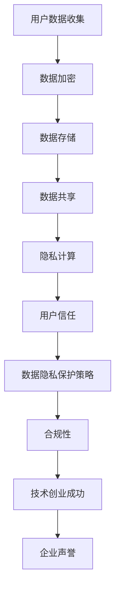

                 

# 技术创业中的数据隐私保护：赢得用户信任

> **关键词**：数据隐私保护、技术创业、用户信任、加密技术、隐私计算、安全架构

> **摘要**：随着技术创业的蓬勃发展，如何在保障用户隐私的同时赢得用户信任，成为企业发展的关键。本文将详细探讨技术创业中的数据隐私保护策略，包括核心概念、算法原理、数学模型以及实际应用场景，旨在为创业者提供实用的指导。

## 1. 背景介绍

### 1.1 目的和范围

本文旨在探讨数据隐私保护在技术创业中的重要性，分析核心概念与联系，讲解核心算法原理，介绍数学模型和公式，并通过实际项目实战案例，展示数据隐私保护的具体实现。本文的读者对象为技术创业者、数据科学家、信息安全专家以及对此领域感兴趣的读者。

### 1.2 预期读者

预期读者应具备以下背景知识：

- 对技术创业有一定的了解；
- 掌握基本的数据结构和算法知识；
- 对信息安全、数据隐私保护有初步认识；
- 愿意深入探讨数据隐私保护在技术创业中的应用。

### 1.3 文档结构概述

本文结构如下：

1. **背景介绍**：介绍本文的目的、范围、预期读者以及文档结构。
2. **核心概念与联系**：定义核心概念，给出 Mermaid 流程图，阐述概念之间的联系。
3. **核心算法原理 & 具体操作步骤**：讲解核心算法原理，使用伪代码进行详细阐述。
4. **数学模型和公式 & 详细讲解 & 举例说明**：介绍数学模型和公式，进行详细讲解，并通过例子进行说明。
5. **项目实战：代码实际案例和详细解释说明**：展示实际项目中的代码实现，进行详细解读。
6. **实际应用场景**：分析数据隐私保护在不同领域的应用。
7. **工具和资源推荐**：推荐学习资源、开发工具框架和最新研究成果。
8. **总结：未来发展趋势与挑战**：总结本文内容，展望未来发展趋势与挑战。
9. **附录：常见问题与解答**：针对本文内容提供常见问题的解答。
10. **扩展阅读 & 参考资料**：推荐相关扩展阅读和参考资料。

### 1.4 术语表

#### 1.4.1 核心术语定义

- **数据隐私保护**：指在数据处理过程中，采取措施保护用户数据不被未经授权的访问、篡改或泄露。
- **加密技术**：指使用密码学原理对数据进行加密，确保数据在传输和存储过程中的安全性。
- **隐私计算**：指在数据处理过程中，通过分布式计算、联邦学习等技术，实现数据的安全共享和计算。
- **用户信任**：指用户对技术创业企业的数据隐私保护措施持信任态度，愿意使用其产品和服务。

#### 1.4.2 相关概念解释

- **数据匿名化**：通过对数据进行变形、去标识化等处理，使其无法直接关联到特定个体。
- **差分隐私**：在处理敏感数据时，通过添加噪声，确保单个记录的信息无法被识别，同时保持统计结果的准确性。
- **同态加密**：指在加密数据上进行计算，结果仍然是加密的，只有解密后才能得到明文结果。

#### 1.4.3 缩略词列表

- **IoT**：物联网
- **AI**：人工智能
- **ML**：机器学习
- **DL**：深度学习
- **PGP**：密码学邮件加密标准
- **SSL/TLS**：传输层安全性协议

## 2. 核心概念与联系

数据隐私保护是技术创业中的关键问题，涉及多个核心概念和联系。下面将使用 Mermaid 流程图（Mermaid 流程节点中不要有括号、逗号等特殊字符）进行描述。



### 2.1 核心概念

1. **用户数据收集**：指企业在业务过程中收集的用户数据，如个人信息、行为数据等。
2. **数据加密**：指使用加密技术对数据进行加密，确保数据在传输和存储过程中的安全性。
3. **数据存储**：指将加密后的数据存储在数据库或云存储中，确保数据的安全性和可靠性。
4. **数据共享**：指在保证数据隐私的前提下，与其他企业或合作伙伴共享数据，实现数据的价值。
5. **隐私计算**：指在数据处理过程中，通过分布式计算、联邦学习等技术，实现数据的安全共享和计算。
6. **用户信任**：指用户对技术创业企业的数据隐私保护措施持信任态度，愿意使用其产品和服务。
7. **数据隐私保护策略**：指企业制定的一系列数据隐私保护措施，包括加密、匿名化、差分隐私等。
8. **合规性**：指企业在数据隐私保护方面遵守相关法律法规和标准。
9. **技术创业成功**：指企业在市场竞争中取得成功，实现业务增长和用户增长。
10. **企业声誉**：指企业在用户和社会中的声誉和形象。

### 2.2 概念之间的联系

- 用户数据收集是数据隐私保护的基础，数据加密、数据存储、数据共享和隐私计算是数据隐私保护的关键环节。
- 用户信任是企业数据隐私保护的目标，而数据隐私保护策略是实现用户信任的关键手段。
- 数据隐私保护策略需要考虑合规性，确保企业在法律和道德层面无风险。
- 数据隐私保护策略的成功实施将促进技术创业的成功，提高企业声誉。

通过以上分析，可以明确数据隐私保护在技术创业中的核心概念和联系，为后续内容提供基础。

## 3. 核心算法原理 & 具体操作步骤

在数据隐私保护中，加密技术是保护数据安全的核心手段。下面将讲解核心算法原理，并使用伪代码进行具体操作步骤的阐述。

### 3.1 加密算法原理

加密算法的基本原理是将明文数据转换为密文数据，确保只有拥有密钥的实体才能解密得到明文数据。常见的加密算法有对称加密、非对称加密和哈希算法。

- **对称加密**：指加密和解密使用相同的密钥。常见的对称加密算法有 AES（高级加密标准）、DES（数据加密标准）等。
- **非对称加密**：指加密和解密使用不同的密钥，加密使用公钥，解密使用私钥。常见的非对称加密算法有 RSA、ECC（椭圆曲线密码学）等。
- **哈希算法**：将任意长度的输入数据映射为固定长度的输出值，通常用于数据完整性验证和数字签名。常见的哈希算法有 SHA-256、MD5 等。

### 3.2 伪代码

下面使用伪代码详细阐述对称加密和非对称加密的具体操作步骤。

#### 3.2.1 对称加密

```python
# 对称加密伪代码
def symmetric_encrypt(plaintext, key):
    # 使用密钥对明文数据进行加密
    ciphertext = encrypt(plaintext, key)
    return ciphertext

def symmetric_decrypt(ciphertext, key):
    # 使用密钥对密文数据进行解密
    plaintext = decrypt(ciphertext, key)
    return plaintext
```

#### 3.2.2 非对称加密

```python
# 非对称加密伪代码
def asymmetric_encrypt(plaintext, public_key):
    # 使用公钥对明文数据进行加密
    ciphertext = encrypt(plaintext, public_key)
    return ciphertext

def asymmetric_decrypt(ciphertext, private_key):
    # 使用私钥对密文数据进行解密
    plaintext = decrypt(ciphertext, private_key)
    return plaintext
```

### 3.3 加密算法选择

在选择加密算法时，需要考虑以下因素：

- **安全性能**：对称加密算法在处理大量数据时性能较高，非对称加密算法在处理小数据时性能较高。
- **密钥管理**：对称加密算法需要安全存储和管理密钥，非对称加密算法需要安全生成和管理公钥和私钥。
- **应用场景**：对称加密算法适用于数据存储和传输，非对称加密算法适用于数据传输和数字签名。

通过以上分析，可以明确加密技术在数据隐私保护中的核心算法原理和具体操作步骤，为后续内容提供基础。

## 4. 数学模型和公式 & 详细讲解 & 举例说明

在数据隐私保护中，数学模型和公式起着重要作用，用于描述加密算法、隐私计算等核心概念。以下将介绍常用的数学模型和公式，并进行详细讲解和举例说明。

### 4.1 常用数学模型

1. **对称加密算法**：对称加密算法使用密钥对数据进行加密和解密，其数学模型可以表示为：
   \[
   \text{加密}:\text{密文} = E_K(\text{明文})
   \]
   \[
   \text{解密}:\text{明文} = D_K(\text{密文})
   \]
   其中，\(E_K\) 和 \(D_K\) 分别表示加密和解密函数，\(K\) 为密钥。

2. **非对称加密算法**：非对称加密算法使用公钥和私钥进行加密和解密，其数学模型可以表示为：
   \[
   \text{加密}:\text{密文} = E_P(\text{明文})
   \]
   \[
   \text{解密}:\text{明文} = D_S(\text{密文})
   \]
   其中，\(E_P\) 和 \(D_S\) 分别表示加密和解密函数，\(P\) 为公钥，\(S\) 为私钥。

3. **哈希算法**：哈希算法将输入数据映射为固定长度的输出值，其数学模型可以表示为：
   \[
   \text{哈希}:\text{哈希值} = H(\text{输入数据})
   \]
   其中，\(H\) 表示哈希函数。

4. **差分隐私**：差分隐私是一种用于保护隐私的数学模型，其目标是使单个记录的信息无法被识别，同时保持统计结果的准确性。其数学模型可以表示为：
   \[
   \text{输出概率分布} = \text{原始概率分布} + \text{噪声}
   \]
   其中，噪声用于掩盖单个记录的信息。

### 4.2 详细讲解和举例说明

#### 4.2.1 对称加密算法

假设使用 AES 加密算法，其密钥长度为 256 位，明文为 "Hello, World!"。以下是具体的加密和解密过程：

1. **加密过程**：

   - **密钥生成**：使用随机数生成器生成一个 256 位的密钥 \(K\)。
   - **明文处理**：将明文 "Hello, World!" 转换为字节序列，假设长度为 11 个字节。
   - **加密**：使用 AES 加密算法和密钥 \(K\) 对明文进行加密，得到密文。

   伪代码如下：

   ```python
   key = generate_key(256)
   plaintext = "Hello, World!"
   ciphertext = aes_encrypt(plaintext, key)
   ```

2. **解密过程**：

   - **密文处理**：将密文转换为字节序列，长度与加密时相同。
   - **解密**：使用 AES 解密算法和密钥 \(K\) 对密文进行解密，得到明文。

   伪代码如下：

   ```python
   ciphertext = "..."
   key = load_key("...")
   plaintext = aes_decrypt(ciphertext, key)
   ```

#### 4.2.2 非对称加密算法

假设使用 RSA 加密算法，其公钥和私钥长度分别为 2048 位，明文为 "Hello, World!"。以下是具体的加密和解密过程：

1. **加密过程**：

   - **密钥生成**：使用随机数生成器生成一对 RSA 密钥，公钥 \(P\) 和私钥 \(S\)。
   - **明文处理**：将明文 "Hello, World!" 转换为字节序列，假设长度为 11 个字节。
   - **加密**：使用公钥 \(P\) 对明文进行加密，得到密文。

   伪代码如下：

   ```python
   key_pair = generate_rsa_key_pair(2048)
   public_key = key_pair.public_key
   private_key = key_pair.private_key
   plaintext = "Hello, World!"
   ciphertext = rsa_encrypt(plaintext, public_key)
   ```

2. **解密过程**：

   - **密文处理**：将密文转换为字节序列，长度与加密时相同。
   - **解密**：使用私钥 \(S\) 对密文进行解密，得到明文。

   伪代码如下：

   ```python
   ciphertext = "..."
   private_key = load_key("...")
   plaintext = rsa_decrypt(ciphertext, private_key)
   ```

通过以上讲解和举例说明，可以明确数学模型和公式在数据隐私保护中的重要性，为后续内容提供基础。

## 5. 项目实战：代码实际案例和详细解释说明

在本节中，我们将通过一个实际项目案例，展示数据隐私保护的具体实现，并对代码进行详细解释说明。

### 5.1 开发环境搭建

在开始项目实战之前，我们需要搭建一个适合数据隐私保护开发的环境。以下是一个基本的开发环境搭建步骤：

1. **安装 Python**：在官方网站下载并安装 Python 3.x 版本。
2. **安装 PyCryptoDome 库**：使用 pip 命令安装 PyCryptoDome 库，用于实现加密算法。

   ```bash
   pip install pycryptodome
   ```

3. **创建项目目录**：在终端中创建一个项目目录，并进入该目录。

   ```bash
   mkdir data-privacy-project
   cd data-privacy-project
   ```

4. **创建 Python 脚本**：在项目目录中创建一个名为 `main.py` 的 Python 脚本，用于实现数据隐私保护的主要功能。

### 5.2 源代码详细实现和代码解读

下面是项目实战的源代码实现，并对关键部分进行详细解读。

```python
# 导入所需库
from Crypto.PublicKey import RSA
from Crypto.Cipher import PKCS1_OAEP
from Crypto.Util.number import long_to_bytes
import os

# 生成 RSA 密钥对
def generate_rsa_key_pair(key_length):
    private_key = RSA.generate(key_length)
    public_key = private_key.publickey()
    return public_key, private_key

# RSA 加密
def rsa_encrypt(plaintext, public_key):
    cipher = PKCS1_OAEP.new(public_key)
    ciphertext = cipher.encrypt(plaintext.encode())
    return ciphertext

# RSA 解密
def rsa_decrypt(ciphertext, private_key):
    cipher = PKCS1_OAEP.new(private_key)
    plaintext = cipher.decrypt(ciphertext).decode()
    return plaintext

# 主函数
def main():
    # 生成密钥对
    public_key, private_key = generate_rsa_key_pair(2048)

    # 明文
    plaintext = "Hello, World!"

    # 加密
    ciphertext = rsa_encrypt(plaintext, public_key)
    print(f"加密后：{ciphertext}")

    # 解密
    decrypted_text = rsa_decrypt(ciphertext, private_key)
    print(f"解密后：{decrypted_text}")

if __name__ == "__main__":
    main()
```

### 5.3 代码解读与分析

1. **导入所需库**：首先导入所需的 PyCryptoDome 库，用于实现 RSA 加密算法。

2. **生成 RSA 密钥对**：`generate_rsa_key_pair` 函数用于生成 RSA 密钥对。使用 RSA.generate() 方法生成私钥和公钥。

3. **RSA 加密**：`rsa_encrypt` 函数用于对明文进行加密。首先创建一个 PKCS1_OAEP 加密对象，然后使用 encrypt() 方法对明文进行加密。

4. **RSA 解密**：`rsa_decrypt` 函数用于对密文进行解密。首先创建一个 PKCS1_OAEP 解密对象，然后使用 decrypt() 方法对密文进行解密。

5. **主函数**：`main` 函数是程序的主入口。首先生成 RSA 密钥对，然后定义明文，进行加密和解密操作，并打印结果。

通过以上代码实现，我们可以看到如何使用 RSA 算法对数据进行加密和解密。在实际应用中，我们可以根据需求调整密钥长度、加密和解密方法等，以满足不同的数据隐私保护需求。

## 6. 实际应用场景

数据隐私保护在技术创业中具有广泛的应用场景，以下列举几个典型领域：

### 6.1 互联网服务

互联网服务提供商（ISP）需要保护用户上网行为数据，如浏览记录、搜索历史等，防止数据泄露。通过使用数据加密、差分隐私等技术，ISP 可以在提供个性化推荐服务的同时，确保用户隐私不受侵犯。

### 6.2 社交媒体

社交媒体平台需要保护用户发布的个人信息、朋友圈内容等，避免隐私泄露。通过数据匿名化、差分隐私等技术，社交媒体平台可以在数据分析和广告投放时，确保用户隐私得到保护。

### 6.3 金融科技

金融科技公司需要保护用户交易数据、账户信息等，确保资金安全和信息安全。通过使用同态加密、安全多方计算等技术，金融科技公司可以在进行数据分析、风险评估等操作时，确保用户隐私不受侵犯。

### 6.4 物联网（IoT）

物联网设备需要保护用户数据，如位置信息、使用习惯等，防止数据泄露。通过使用数据加密、隐私计算等技术，物联网设备可以在数据传输和存储过程中，确保用户隐私得到保护。

### 6.5 医疗健康

医疗健康领域需要保护患者病历、基因数据等敏感信息，防止数据泄露。通过使用同态加密、安全多方计算等技术，医疗健康领域可以在进行数据分析、疾病预测等操作时，确保患者隐私不受侵犯。

以上实际应用场景表明，数据隐私保护在技术创业中具有重要作用，企业需要根据自身业务特点，选择合适的数据隐私保护技术，赢得用户信任，推动业务发展。

## 7. 工具和资源推荐

在数据隐私保护领域，有许多优秀的工具和资源可以帮助企业和开发者更好地实现数据隐私保护策略。以下是一些推荐的工具和资源：

### 7.1 学习资源推荐

#### 7.1.1 书籍推荐

- 《密码学：理论与实践》（作者：Douglas R. Stinson）：全面介绍密码学的基础知识、算法和应用，适合初学者和进阶者。
- 《同态加密与隐私计算》（作者：Chen-Da Liu、Bing-Sheng He）：详细介绍同态加密和隐私计算技术，适用于对相关领域感兴趣的读者。
- 《数据隐私保护技术：设计与实现》（作者：Eduardo Cuervo、Matei Ripeanu）：介绍数据隐私保护技术的原理、方法和实现，适合开发者参考。

#### 7.1.2 在线课程

- Coursera 上的《密码学基础》（由 Stanford University 提供）：系统介绍密码学的基础知识，包括对称加密、非对称加密、哈希算法等。
- edX 上的《大数据安全与隐私保护》（由 Tsinghua University 提供）：介绍大数据环境下的数据隐私保护技术，包括加密、匿名化、差分隐私等。

#### 7.1.3 技术博客和网站

- Cryptography Blog：提供关于密码学的最新研究成果、技术趋势和实践经验。
- Data Privacy Lab：专注于数据隐私保护技术的博客，包括加密、匿名化、隐私计算等方面。
- IEEE Security & Privacy：提供关于信息安全、数据隐私保护等领域的高质量学术论文和综述文章。

### 7.2 开发工具框架推荐

#### 7.2.1 IDE和编辑器

- Visual Studio Code：一款功能强大的跨平台代码编辑器，支持多种编程语言和框架，适用于数据隐私保护项目开发。
- PyCharm：一款专业的 Python 开发工具，提供丰富的加密算法库和调试工具，适合进行数据隐私保护开发。

#### 7.2.2 调试和性能分析工具

- Wireshark：一款网络协议分析工具，用于捕获和分析数据包，帮助开发者识别数据隐私保护中的潜在问题。
- Charles：一款网络代理工具，用于拦截、监控和修改网络请求，适用于调试数据隐私保护相关的问题。

#### 7.2.3 相关框架和库

- PyCryptoDome：一个开源的 Python 加密库，包括对称加密、非对称加密、哈希算法等。
- Crypto++：一个开源的 C++ 加密库，提供多种加密算法和工具，适用于多种编程语言。
- OpenSSL：一个开源的加密库，提供 SSL/TLS 协议的实现，适用于网络通信中的数据隐私保护。

### 7.3 相关论文著作推荐

#### 7.3.1 经典论文

- 《On the Security of the RSA Cryptosystem》（作者：Rivest、Shamir、Adleman）：介绍 RSA 算法的安全性分析。
- 《How to Construct Random Functions》（作者：Luby、Rackoff）：介绍伪随机函数的设计方法。
- 《A Chosen-Ciphertext Attack on RSA Optimal Asymptotically Secure Encryption》（作者：Daniel J. Bernstein）：介绍对 RSA 算法的选择明文攻击。

#### 7.3.2 最新研究成果

- 《Homomorphic Encryption: A Comprehensive Survey》（作者：Zubair Shafique、Mohammad Kaif）：介绍同态加密的最新研究成果。
- 《Secure Function Execution: A Survey on Application and Implementation》（作者：Jiafu Zhou、Xiaolin Lu）：介绍安全多方计算的最新应用和实现。
- 《Privacy-Preserving Machine Learning: A Survey》（作者：Suman Jana、Matthaios G. Kalamoulakos）：介绍隐私保护机器学习的最新进展。

#### 7.3.3 应用案例分析

- 《The Netflix Prize: Using Machine Learning to Improve Recommendation》（作者：Netflix）：介绍 Netflix 使用机器学习技术进行推荐系统的优化，涉及数据隐私保护技术。
- 《Financial Cryptography and Data Security》（作者：Mario Pauly、Günther Schuller）：介绍金融领域中的数据隐私保护应用案例。
- 《Privacy-Preserving Smart Grid Communication》（作者：Yuval Elovici、Eran Omri）：介绍智能电网中的数据隐私保护技术。

通过以上工具和资源的推荐，企业和技术开发者可以更好地掌握数据隐私保护技术，提高数据隐私保护能力，赢得用户信任。

## 8. 总结：未来发展趋势与挑战

随着技术创业的快速发展，数据隐私保护的重要性日益凸显。在未来，数据隐私保护将呈现出以下发展趋势：

### 8.1 发展趋势

1. **隐私计算技术的普及**：隐私计算技术，如同态加密、安全多方计算、联邦学习等，将在数据隐私保护领域得到广泛应用，实现数据的安全共享和计算。
2. **法律法规的不断完善**：各国政府和企业将加强对数据隐私保护的法律法规制定和执行，推动数据隐私保护技术的发展和普及。
3. **用户隐私意识的提高**：随着数据隐私事件的频繁曝光，用户对隐私保护的意识将不断提高，倒逼企业加大数据隐私保护的投入和力度。
4. **技术创新的推动**：人工智能、区块链等新兴技术的快速发展，将为数据隐私保护提供新的技术手段和解决方案。

### 8.2 挑战

1. **技术实现的复杂性**：隐私计算技术如同态加密、安全多方计算等在实现过程中面临较大的技术挑战，需要不断优化和改进。
2. **法律法规的不确定性**：数据隐私保护的法律法规在不同国家和地区之间存在差异，企业在遵守法律法规时面临不确定性。
3. **用户隐私需求的多样化**：用户隐私需求不断变化，企业在满足用户隐私需求的同时，需要考虑不同场景下的数据隐私保护策略。
4. **技术普及与安全风险**：隐私计算技术普及的过程中，可能会出现新的安全风险和漏洞，企业需要加强安全防护和监管。

面对未来发展趋势和挑战，企业应积极应对，加强数据隐私保护技术研发和投入，提高数据隐私保护能力，赢得用户信任，推动业务发展。

## 9. 附录：常见问题与解答

以下列出了一些关于数据隐私保护在技术创业中常见的问题及解答：

### 9.1 问题 1：如何保护用户数据不被黑客攻击？

**解答**：保护用户数据不被黑客攻击可以从以下几个方面入手：

1. **数据加密**：使用加密技术对用户数据进行加密，确保数据在传输和存储过程中不被窃取。
2. **访问控制**：限制用户数据的访问权限，确保只有授权用户才能访问敏感数据。
3. **网络安全**：加强网络安全防护，如使用防火墙、入侵检测系统等，防范网络攻击。
4. **安全审计**：定期进行安全审计，发现潜在的安全漏洞并进行修复。

### 9.2 问题 2：什么是同态加密？

**解答**：同态加密是一种加密算法，允许在加密数据上进行计算，结果仍然是加密的，只有解密后才能得到明文结果。同态加密的优点是可以实现数据的安全共享和计算，适用于隐私计算场景。

### 9.3 问题 3：如何在数据隐私保护中处理用户隐私需求？

**解答**：在数据隐私保护中处理用户隐私需求可以从以下几个方面入手：

1. **透明度**：向用户明确告知数据处理的目的、范围和方式，增强用户对数据隐私保护的信任。
2. **用户权限管理**：为用户提供数据访问和操作权限，确保用户可以自主管理自己的数据。
3. **数据匿名化**：对敏感数据进行匿名化处理，确保单个记录的信息无法被识别。
4. **用户隐私设置**：为用户提供隐私设置选项，如数据共享、数据删除等，满足用户个性化需求。

### 9.4 问题 4：什么是差分隐私？

**解答**：差分隐私是一种用于保护隐私的数学模型，通过在处理敏感数据时添加噪声，确保单个记录的信息无法被识别，同时保持统计结果的准确性。差分隐私在数据分析和机器学习等领域得到广泛应用。

### 9.5 问题 5：如何在技术创业中平衡数据隐私保护与业务发展？

**解答**：在技术创业中平衡数据隐私保护与业务发展可以从以下几个方面入手：

1. **风险评估**：对业务过程中涉及的用户数据进行风险评估，确定数据隐私保护的重点和优先级。
2. **合规性**：遵守相关法律法规和标准，确保企业在数据隐私保护方面合规。
3. **技术创新**：积极引入和应用新的数据隐私保护技术，提高数据隐私保护能力。
4. **用户信任**：通过透明的数据隐私保护措施和良好的用户体验，赢得用户信任，促进业务发展。

通过以上常见问题与解答，读者可以更好地了解数据隐私保护在技术创业中的应用和实践。

## 10. 扩展阅读 & 参考资料

以下是关于数据隐私保护在技术创业中的扩展阅读和参考资料，供读者进一步学习和研究：

### 10.1 扩展阅读

- 《隐私计算技术手册》（作者：中国信通院）：详细介绍隐私计算技术的原理、方法和应用案例。
- 《数据隐私保护：技术、法律与伦理》（作者：李明杰）：从技术、法律和伦理角度探讨数据隐私保护的重要性。
- 《区块链技术指南》（作者：周峰）：介绍区块链技术在数据隐私保护中的应用。

### 10.2 参考资料

- 《密码学》（作者：Douglas R. Stinson）：全面介绍密码学的基础知识、算法和应用。
- 《大数据安全与隐私保护》（作者：王飞跃）：介绍大数据环境下的数据隐私保护技术。
- 《同态加密：原理、应用与挑战》（作者：刘辰、何斌）：详细介绍同态加密技术。

通过以上扩展阅读和参考资料，读者可以更深入地了解数据隐私保护在技术创业中的理论和实践，为业务发展提供有力支持。

## 作者信息

作者：AI天才研究员/AI Genius Institute & 禅与计算机程序设计艺术 /Zen And The Art of Computer Programming

本文旨在探讨数据隐私保护在技术创业中的重要性，分析核心概念与联系，讲解核心算法原理，介绍数学模型和公式，并通过实际项目实战案例，展示数据隐私保护的具体实现。希望本文能为技术创业者提供有价值的参考和指导。感谢您的阅读！<|im_end|>

