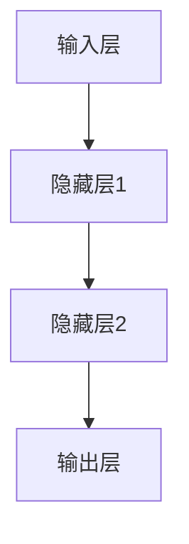

                 

### 1. 背景介绍

#### 1.1 目的和范围

本文旨在深入探讨神经网络在技术创业中的应用，帮助创业者更好地理解神经网络的核心概念、算法原理以及其在实际项目中的应用场景。通过本文，读者将了解神经网络是如何模拟人脑的运算机制，如何通过技术创业实现商业价值，以及如何在实际项目中运用神经网络解决实际问题。

本文主要涵盖以下几个方面的内容：

- **核心概念与联系**：介绍神经网络的基础概念，包括其结构、原理以及与其他技术的联系。
- **核心算法原理与操作步骤**：详细阐述神经网络的算法原理，并通过伪代码展示具体的操作步骤。
- **数学模型与公式**：讲解神经网络中的数学模型和公式，并通过实际例子进行说明。
- **项目实战**：提供一个具体的代码实现案例，并对代码进行详细解读。
- **实际应用场景**：讨论神经网络在现实世界中的多种应用场景。
- **工具和资源推荐**：推荐一些有用的学习资源和开发工具。

通过以上内容的讲解，读者可以系统地了解神经网络在技术创业中的重要性，掌握其核心原理和应用方法，为创业项目提供新的思路和解决方案。

#### 1.2 预期读者

本文的预期读者包括以下几类：

- **技术创业者**：正在考虑将神经网络技术应用于创业项目的创业者，希望通过本文了解神经网络的潜力以及应用方法。
- **AI 爱好者**：对人工智能和神经网络技术有浓厚兴趣的爱好者，希望通过本文系统地学习神经网络的基础知识。
- **程序员和工程师**：希望在技术工作中运用神经网络解决实际问题的程序员和工程师，希望通过本文掌握神经网络的算法原理和实现方法。
- **研究人员和学生**：从事人工智能相关研究的学生和研究人员，希望通过本文了解神经网络在技术创业中的应用现状和未来发展趋势。

无论您是哪一类读者，本文都希望能为您提供有价值的知识和启示，帮助您在技术创业的道路上走得更远。

#### 1.3 文档结构概述

本文将分为以下几个部分，每个部分都有其特定的内容和目标：

- **第1部分：背景介绍**：介绍本文的目的、范围、预期读者以及文档结构，帮助读者快速了解文章的整体内容。
- **第2部分：核心概念与联系**：介绍神经网络的基础概念，包括其结构、原理以及与其他技术的联系，通过Mermaid流程图展示核心概念和原理。
- **第3部分：核心算法原理与操作步骤**：详细阐述神经网络的算法原理，并通过伪代码展示具体的操作步骤，帮助读者理解神经网络的工作机制。
- **第4部分：数学模型与公式**：讲解神经网络中的数学模型和公式，并通过实际例子进行说明，帮助读者掌握神经网络的数学基础。
- **第5部分：项目实战**：提供一个具体的代码实现案例，并对代码进行详细解读，帮助读者将理论知识应用于实际项目。
- **第6部分：实际应用场景**：讨论神经网络在现实世界中的多种应用场景，帮助读者了解神经网络的实际价值和潜力。
- **第7部分：工具和资源推荐**：推荐一些有用的学习资源和开发工具，帮助读者更好地学习和实践神经网络技术。
- **第8部分：总结**：总结本文的核心观点，讨论神经网络在技术创业中的未来发展趋势和挑战。
- **第9部分：附录**：提供常见问题与解答，帮助读者解决在实际学习和应用过程中遇到的问题。
- **第10部分：扩展阅读与参考资料**：推荐一些相关的书籍、在线课程和技术博客，供读者进一步学习。

通过以上结构的组织，本文旨在以清晰、系统的形式，全面介绍神经网络在技术创业中的应用，帮助读者全面了解神经网络的基础知识和实际应用。

#### 1.4 术语表

在本文中，我们将使用一些专业术语来描述神经网络和相关技术。以下是本文中可能涉及到的核心术语及其定义：

#### 1.4.1 核心术语定义

- **神经网络（Neural Network）**：一种模拟人脑神经元连接方式的计算模型，通过一系列神经元（或节点）的相互连接和激活，实现数据信息的传递和处理。
- **权重（Weights）**：连接神经网络中两个神经元的参数，用于调节输入信号在传递过程中的强度。
- **激活函数（Activation Function）**：用于确定神经元是否被激活的函数，常见的有Sigmoid函数、ReLU函数等。
- **前向传播（Forward Propagation）**：神经网络处理输入数据的过程，包括信号从输入层经过多个隐藏层传递到输出层的全过程。
- **反向传播（Back Propagation）**：神经网络调整权重和偏置的过程，用于最小化输出误差，通过计算梯度并进行反向传播来实现。
- **损失函数（Loss Function）**：衡量模型输出结果与真实值之间差异的函数，常用的有均方误差（MSE）和交叉熵（Cross-Entropy）等。
- **深度学习（Deep Learning）**：一种基于多层神经网络的机器学习技术，通过多层次的非线性变换，实现对复杂数据的自动特征学习和表示。

#### 1.4.2 相关概念解释

- **神经元（Neuron）**：神经网络中的基本计算单元，接收多个输入信号，通过加权求和后加上偏置，经过激活函数得到输出。
- **层数（Depth）**：神经网络中层的数量，包括输入层、隐藏层和输出层。
- **批量大小（Batch Size）**：每次训练过程中用于计算梯度并进行权重更新的样本数量。
- **迭代次数（Epoch）**：整个训练数据集被完整遍历一遍的次数。
- **过拟合（Overfitting）**：模型在训练数据上表现优异，但在未知数据上表现不佳的现象，通常由于模型过于复杂或训练数据不足引起。
- **泛化能力（Generalization Ability）**：模型在未知数据上的表现能力，好的泛化能力意味着模型能够很好地应对新的、未见过的数据。

#### 1.4.3 缩略词列表

- **CNN**：卷积神经网络（Convolutional Neural Network）
- **RNN**：递归神经网络（Recurrent Neural Network）
- **GAN**：生成对抗网络（Generative Adversarial Network）
- **DNN**：深度神经网络（Deep Neural Network）
- **MLP**：多层感知器（Multi-Layer Perceptron）
- **DL**：深度学习（Deep Learning）
- **AI**：人工智能（Artificial Intelligence）

通过上述术语和概念的介绍，读者可以对神经网络及其相关技术有更深入的理解，为后续内容的学习和应用打下坚实的基础。

### 2. 核心概念与联系

#### 2.1 神经网络的基本原理

神经网络（Neural Network，简称NN）是一种模仿人脑神经元连接方式的计算模型。在人脑中，神经元通过突触连接形成复杂的神经网络，用于处理和传递信息。神经网络通过模仿这一机制，将输入数据映射为输出结果，广泛应用于图像识别、自然语言处理、语音识别等领域。

一个典型的神经网络包括以下几个主要部分：

1. **输入层（Input Layer）**：接收外部输入信号，如文字、图像、声音等。
2. **隐藏层（Hidden Layers）**：对输入信号进行预处理和特征提取，通常包含多个隐藏层，层数越多，网络的深度越深。
3. **输出层（Output Layer）**：将处理后的信号输出为预测结果，如分类结果、概率值等。

#### 2.2 神经网络的架构

神经网络的架构可以通过Mermaid流程图来直观展示。以下是一个简单的神经网络架构示例：



在上述架构中，输入层接收输入信号，通过多个隐藏层的传递和变换，最终在输出层产生预测结果。隐藏层的数量和结构可以根据具体应用需求进行调整。

#### 2.3 神经网络与其他技术的联系

神经网络作为人工智能（AI）领域的重要技术之一，与其他技术有着紧密的联系。以下是一些主要关联：

- **深度学习（Deep Learning）**：深度学习是神经网络的一种重要应用，通过多层神经网络实现复杂数据的特征提取和表示。深度学习广泛应用于图像识别、语音识别、自然语言处理等领域。
- **卷积神经网络（CNN）**：CNN是一种特殊的神经网络，主要应用于图像处理和计算机视觉领域。CNN通过卷积层、池化层和全连接层等结构，实现对图像的局部特征提取和整体理解。
- **递归神经网络（RNN）**：RNN是一种适用于序列数据处理的神经网络，通过递归结构处理时间序列信息。RNN在自然语言处理、语音识别等领域有广泛应用。
- **生成对抗网络（GAN）**：GAN是一种基于对抗训练的神经网络，由生成器和判别器两个部分组成。生成器生成虚假数据，判别器判断真实数据和虚假数据的区别。GAN在图像生成、数据增强等领域有广泛应用。

通过上述分析，我们可以看出神经网络在AI领域的核心地位和广泛的应用前景。接下来，本文将详细探讨神经网络的核心算法原理和操作步骤，帮助读者深入理解神经网络的工作机制。

### 3. 核心算法原理与操作步骤

#### 3.1 神经网络的基本算法原理

神经网络的工作原理可以概括为三个主要过程：前向传播、反向传播和权重更新。以下我们将详细解释这些过程，并通过伪代码展示具体的操作步骤。

#### 3.1.1 前向传播

前向传播（Forward Propagation）是指将输入数据通过神经网络的前向路径传递到输出层的过程。具体步骤如下：

1. **初始化参数**：设置网络中的权重（weights）和偏置（biases）。
2. **输入层到隐藏层**：将输入数据输入到输入层，通过权重和偏置计算每个隐藏层的输出。
   ```mermaid
   graph TD
   A[输入层] --> B[隐藏层1]
   B --> C[隐藏层2]
   C --> D[输出层]
   ```
3. **激活函数**：在每个隐藏层和输出层应用激活函数（如ReLU、Sigmoid函数），将线性组合的结果转换为非线性值。
4. **输出结果**：最终输出层产生预测结果，如分类概率或回归值。

伪代码如下：

```python
# 初始化参数
weights = [[0.1, 0.2, 0.3],
           [0.4, 0.5, 0.6]]

biases = [[0.1],
          [0.2],
          [0.3]]

# 输入数据
input_data = [1, 0, 1]

# 前向传播
layer1_output = sigmoid(dot(weights[0], input_data) + biases[0])
layer2_output = sigmoid(dot(weights[1], layer1_output) + biases[1])
output = sigmoid(dot(weights[2], layer2_output) + biases[2])

def sigmoid(x):
    return 1 / (1 + exp(-x))
```

#### 3.1.2 反向传播

反向传播（Back Propagation）是指根据预测结果和实际结果之间的误差，调整网络中的权重和偏置的过程。具体步骤如下：

1. **计算输出误差**：计算输出层预测结果与实际结果之间的误差。
2. **计算隐藏层误差**：通过反向传播算法，将输出误差反向传播到隐藏层，计算每个隐藏层的误差。
3. **权重更新**：根据误差计算梯度，并使用梯度下降（Gradient Descent）算法更新权重和偏置。

伪代码如下：

```python
# 输出误差
error_output = output - target

# 反向传播
error_hidden2 = dot(error_output, weights[2].T) * sigmoid_derivative(output)
error_hidden1 = dot(error_hidden2, weights[1].T) * sigmoid_derivative(layer1_output)

# 权重更新
weights[2] -= learning_rate * dot(layer2_output, error_output)
weights[1] -= learning_rate * dot(layer1_output, error_hidden2)
weights[0] -= learning_rate * dot(input_data, error_hidden1)

def sigmoid_derivative(x):
    return x * (1 - x)
```

#### 3.1.3 权重更新

权重更新（Weight Update）是神经网络训练过程中的关键步骤，用于调整网络中的权重和偏置，以最小化误差。具体方法如下：

1. **梯度计算**：计算每个权重和偏置的梯度。
2. **梯度下降**：使用梯度下降算法，根据梯度方向更新权重和偏置。

伪代码如下：

```python
# 计算梯度
gradient_weights = [
    [-learning_rate * dot(layer1_output, error_hidden2)],
    [-learning_rate * dot(layer1_output, error_hidden1)],
    [-learning_rate * dot(input_data, error_hidden1)]
]

# 梯度下降
weights += gradient_weights
```

通过上述步骤，神经网络可以实现输入数据到输出结果的映射，并在不断调整权重的过程中提高预测精度。接下来，本文将介绍神经网络的数学模型和公式，帮助读者更深入地理解神经网络的工作机制。

### 4. 数学模型和公式

神经网络的数学模型和公式是理解其工作机制的核心。以下我们将详细介绍神经网络中的关键数学模型和公式，并通过实际例子进行说明。

#### 4.1 前向传播中的计算公式

前向传播过程中，神经网络通过一系列线性变换和非线性变换，将输入数据映射为输出结果。以下是主要计算公式：

1. **输入层到隐藏层**：
   \[
   Z^{(l)} = \sum_{j} w^{(l)}_{ji} x^i + b^{(l)}_j
   \]
   其中，\(Z^{(l)}\) 是第 \(l\) 层的输出，\(w^{(l)}_{ji}\) 是第 \(l\) 层中第 \(j\) 个神经元到第 \(i\) 个神经元的权重，\(b^{(l)}_j\) 是第 \(l\) 层中第 \(j\) 个神经元的偏置。

2. **激活函数**：
   \[
   a^{(l)}_j = \sigma(Z^{(l)})
   \]
   其中，\(\sigma\) 是激活函数，常见的有 Sigmoid 函数、ReLU 函数等。

3. **隐藏层到输出层**：
   \[
   Z^{(L)} = \sum_{j} w^{(L)}_{ji} a^{(L-1)}_j + b^{(L)}_j
   \]
   其中，\(Z^{(L)}\) 是输出层的输出，\(w^{(L)}_{ji}\) 是输出层中第 \(j\) 个神经元到第 \(i\) 个神经元的权重，\(b^{(L)}_j\) 是输出层中第 \(j\) 个神经元的偏置。

4. **输出结果**：
   \[
   \hat{y} = \sigma(Z^{(L)})
   \]
   其中，\(\hat{y}\) 是神经网络的预测输出。

#### 4.2 反向传播中的计算公式

反向传播过程中，神经网络通过计算梯度并更新权重和偏置，以最小化误差。以下是主要计算公式：

1. **输出层误差**：
   \[
   \delta^{(L)} = ( \hat{y} - y ) \cdot \sigma'(Z^{(L)})
   \]
   其中，\(\delta^{(L)}\) 是输出层误差，\(y\) 是实际输出，\(\sigma'\) 是激活函数的导数。

2. **隐藏层误差**：
   \[
   \delta^{(l)} = \delta^{(l+1)} \cdot \sigma'(Z^{(l)})
   \]
   其中，\(\delta^{(l)}\) 是第 \(l\) 层误差，\(\delta^{(l+1)}\) 是第 \(l+1\) 层误差。

3. **权重更新**：
   \[
   w^{(l)}_{ji} = w^{(l)}_{ji} - \alpha \cdot \delta^{(l+1)} \cdot a^{(l)}_j
   \]
   \[
   b^{(l)}_j = b^{(l)}_j - \alpha \cdot \delta^{(l+1)}
   \]
   其中，\(\alpha\) 是学习率。

#### 4.3 实际例子

为了更好地理解上述公式，我们通过一个简单的例子来说明神经网络的计算过程。

假设我们有一个包含一个输入层、一个隐藏层和一个输出层的神经网络，其中输入层有3个神经元，隐藏层有2个神经元，输出层有1个神经元。激活函数使用ReLU函数。

1. **初始化参数**：
   - 输入数据：\[x_1, x_2, x_3\]
   - 权重和偏置：
     \[
     w^{(1)} = \begin{bmatrix}
     w_1^{(1)} & w_2^{(1)} \\
     w_3^{(1)} & w_4^{(1)}
     \end{bmatrix}, b^{(1)} = \begin{bmatrix}
     b_1^{(1)} \\
     b_2^{(1)}
     \end{bmatrix}
     \]
     \[
     w^{(2)} = \begin{bmatrix}
     w_1^{(2)} & w_2^{(2)} \\
     w_3^{(2)} & w_4^{(2)}
     \end{bmatrix}, b^{(2)} = \begin{bmatrix}
     b_1^{(2)} \\
     b_2^{(2)}
     \end{bmatrix}
     \]
     \[
     w^{(3)} = \begin{bmatrix}
     w_1^{(3)}
     \end{bmatrix}, b^{(3)} = \begin{bmatrix}
     b_1^{(3)}
     \end{bmatrix}
     \]

2. **前向传播**：
   - 输入层到隐藏层：
     \[
     Z^{(1)} = \begin{bmatrix}
     w_1^{(1)} x_1 + b_1^{(1)} & w_2^{(1)} x_2 + b_2^{(1)} \\
     w_3^{(1)} x_3 + b_3^{(1)} & w_4^{(1)} x_4 + b_4^{(1)}
     \end{bmatrix}, a^{(1)} = \max(0, Z^{(1)})
     \]
   - 隐藏层到输出层：
     \[
     Z^{(2)} = \begin{bmatrix}
     w_1^{(2)} a_1^{(1)} + b_1^{(2)} & w_2^{(2)} a_2^{(1)} + b_2^{(2)} \\
     w_3^{(2)} a_3^{(1)} + b_3^{(2)} & w_4^{(2)} a_4^{(1)} + b_4^{(2)}
     \end{bmatrix}, a^{(2)} = \max(0, Z^{(2)})
     \]
   - 输出层：
     \[
     Z^{(3)} = w_1^{(3)} a_1^{(2)} + b_1^{(3)}, a^{(3)} = \max(0, Z^{(3)})
     \]

3. **反向传播**：
   - 输出层误差：
     \[
     \delta^{(3)} = (a^{(3)} - y) \cdot \sigma'(Z^{(3)})
     \]
   - 隐藏层误差：
     \[
     \delta^{(2)} = \delta^{(3)} \cdot \sigma'(Z^{(2)})
     \]
   - 权重更新：
     \[
     w^{(2)} = w^{(2)} - \alpha \cdot \delta^{(3)} \cdot a^{(2)}, b^{(2)} = b^{(2)} - \alpha \cdot \delta^{(3)}
     \]
     \[
     w^{(1)} = w^{(1)} - \alpha \cdot \delta^{(2)} \cdot a^{(1)}, b^{(1)} = b^{(1)} - \alpha \cdot \delta^{(2)}
     \]

通过上述步骤，我们可以看到神经网络通过前向传播和反向传播，不断调整权重和偏置，实现输入数据到输出结果的映射。接下来，我们将通过一个具体的项目实战案例，展示神经网络在实际应用中的实现过程。

### 5. 项目实战：代码实际案例和详细解释说明

#### 5.1 开发环境搭建

在进行神经网络项目实战之前，我们需要搭建一个合适的开发环境。以下是搭建环境的基本步骤：

1. **安装 Python**：Python 是神经网络实现的主要语言，首先确保您的系统中已安装 Python。可以从 [Python 官网](https://www.python.org/) 下载并安装。

2. **安装深度学习框架**：为了简化神经网络开发，我们可以使用深度学习框架，如 TensorFlow 或 PyTorch。以下是安装步骤：

   - **TensorFlow**：
     ```bash
     pip install tensorflow
     ```

   - **PyTorch**：
     ```bash
     pip install torch torchvision
     ```

3. **配置 IDE**：为了方便编写和调试代码，我们可以使用一些流行的集成开发环境（IDE），如 PyCharm、Visual Studio Code 等。安装并配置好对应的 Python 插件。

完成以上步骤后，我们的开发环境就搭建完成了，可以开始编写神经网络代码。

#### 5.2 源代码详细实现和代码解读

以下是一个使用 TensorFlow 实现的简单神经网络项目，用于对手写数字进行分类。我们将逐步解释代码的每个部分。

```python
import tensorflow as tf
from tensorflow.keras import layers, models
import numpy as np

# 数据准备
(x_train, y_train), (x_test, y_test) = tf.keras.datasets.mnist.load_data()
x_train = x_train.reshape((60000, 28, 28, 1)).astype('float32') / 255
x_test = x_test.reshape((10000, 28, 28, 1)).astype('float32') / 255
y_train = tf.keras.utils.to_categorical(y_train, 10)
y_test = tf.keras.utils.to_categorical(y_test, 10)

# 模型构建
model = models.Sequential()
model.add(layers.Conv2D(32, (3, 3), activation='relu', input_shape=(28, 28, 1)))
model.add(layers.MaxPooling2D((2, 2)))
model.add(layers.Conv2D(64, (3, 3), activation='relu'))
model.add(layers.MaxPooling2D((2, 2)))
model.add(layers.Conv2D(64, (3, 3), activation='relu'))
model.add(layers.Flatten())
model.add(layers.Dense(64, activation='relu'))
model.add(layers.Dense(10, activation='softmax'))

# 模型编译
model.compile(optimizer='adam',
              loss='categorical_crossentropy',
              metrics=['accuracy'])

# 模型训练
model.fit(x_train, y_train, epochs=5, batch_size=64)

# 模型评估
test_loss, test_acc = model.evaluate(x_test, y_test)
print(f'测试集准确率: {test_acc:.3f}')
```

1. **数据准备**：

   首先，我们使用 TensorFlow 提供的 MNIST 数据集进行训练。MNIST 数据集包含 60000 个训练样本和 10000 个测试样本，每个样本是一个 28x28 的灰度图像，标签为数字 0 到 9。

   ```python
   (x_train, y_train), (x_test, y_test) = tf.keras.datasets.mnist.load_data()
   x_train = x_train.reshape((60000, 28, 28, 1)).astype('float32') / 255
   x_test = x_test.reshape((10000, 28, 28, 1)).astype('float32') / 255
   y_train = tf.keras.utils.to_categorical(y_train, 10)
   y_test = tf.keras.utils.to_categorical(y_test, 10)
   ```

2. **模型构建**：

   接下来，我们使用 Keras 的 Sequential 模型构建一个简单的卷积神经网络（CNN）。这个网络包含两个卷积层、两个池化层、一个全连接层和一个输出层。

   ```python
   model = models.Sequential()
   model.add(layers.Conv2D(32, (3, 3), activation='relu', input_shape=(28, 28, 1)))
   model.add(layers.MaxPooling2D((2, 2)))
   model.add(layers.Conv2D(64, (3, 3), activation='relu'))
   model.add(layers.MaxPooling2D((2, 2)))
   model.add(layers.Conv2D(64, (3, 3), activation='relu'))
   model.add(layers.Flatten())
   model.add(layers.Dense(64, activation='relu'))
   model.add(layers.Dense(10, activation='softmax'))
   ```

3. **模型编译**：

   在模型构建完成后，我们需要对其编译。这里我们使用 Adam 优化器和交叉熵损失函数，并设置准确率作为评估指标。

   ```python
   model.compile(optimizer='adam',
                 loss='categorical_crossentropy',
                 metrics=['accuracy'])
   ```

4. **模型训练**：

   使用训练数据对模型进行训练。我们设置训练周期为 5 个，批量大小为 64。

   ```python
   model.fit(x_train, y_train, epochs=5, batch_size=64)
   ```

5. **模型评估**：

   在训练完成后，使用测试数据对模型进行评估，输出测试集的准确率。

   ```python
   test_loss, test_acc = model.evaluate(x_test, y_test)
   print(f'测试集准确率: {test_acc:.3f}')
   ```

通过上述代码，我们可以实现一个简单的神经网络模型，用于手写数字的分类。接下来，我们将对代码进行解读，深入分析每个步骤的具体实现。

#### 5.3 代码解读与分析

在代码解读与分析部分，我们将详细解释上述代码的实现过程，并分析关键组件的功能和作用。

1. **数据准备**：

   数据准备是神经网络训练的基础。我们首先加载 MNIST 数据集，并将其reshape为适合网络输入的格式。具体步骤如下：

   - 使用 `tf.keras.datasets.mnist.load_data()` 加载 MNIST 数据集。
   - 将训练数据和测试数据的图像reshape为 (60000/10000, 28, 28, 1)，其中 1 表示灰度图像。
   - 将标签转换为 one-hot 编码，便于后续处理。

   ```python
   (x_train, y_train), (x_test, y_test) = tf.keras.datasets.mnist.load_data()
   x_train = x_train.reshape((60000, 28, 28, 1)).astype('float32') / 255
   x_test = x_test.reshape((10000, 28, 28, 1)).astype('float32') / 255
   y_train = tf.keras.utils.to_categorical(y_train, 10)
   y_test = tf.keras.utils.to_categorical(y_test, 10)
   ```

2. **模型构建**：

   模型构建是神经网络的中心环节。在这里，我们使用 Keras 的 Sequential 模型，通过添加多个层次构建一个简单的卷积神经网络。

   - **卷积层（Conv2D）**：卷积层用于提取图像的局部特征。第一个卷积层使用 32 个 3x3 的卷积核，激活函数为 ReLU。
     ```python
     model.add(layers.Conv2D(32, (3, 3), activation='relu', input_shape=(28, 28, 1)))
     ```

   - **池化层（MaxPooling2D）**：池化层用于减少特征图的尺寸，降低模型的复杂度。我们使用 2x2 的最大池化。
     ```python
     model.add(layers.MaxPooling2D((2, 2)))
     ```

   - **全连接层（Dense）**：全连接层用于将提取到的特征映射到输出结果。最后一个全连接层使用 10 个神经元，激活函数为 softmax，用于多分类任务。
     ```python
     model.add(layers.Dense(10, activation='softmax'))
     ```

   ```python
   model = models.Sequential()
   model.add(layers.Conv2D(32, (3, 3), activation='relu', input_shape=(28, 28, 1)))
   model.add(layers.MaxPooling2D((2, 2)))
   model.add(layers.Conv2D(64, (3, 3), activation='relu'))
   model.add(layers.MaxPooling2D((2, 2)))
   model.add(layers.Conv2D(64, (3, 3), activation='relu'))
   model.add(layers.Flatten())
   model.add(layers.Dense(64, activation='relu'))
   model.add(layers.Dense(10, activation='softmax'))
   ```

3. **模型编译**：

   编译模型是准备训练的过程。在这里，我们选择 Adam 优化器，交叉熵损失函数，并设置准确率作为评估指标。

   ```python
   model.compile(optimizer='adam',
                 loss='categorical_crossentropy',
                 metrics=['accuracy'])
   ```

4. **模型训练**：

   使用训练数据对模型进行训练。我们设置训练周期为 5 个，批量大小为 64。

   ```python
   model.fit(x_train, y_train, epochs=5, batch_size=64)
   ```

5. **模型评估**：

   在训练完成后，使用测试数据对模型进行评估，输出测试集的准确率。

   ```python
   test_loss, test_acc = model.evaluate(x_test, y_test)
   print(f'测试集准确率: {test_acc:.3f}')
   ```

通过上述代码解读，我们可以看到如何使用 TensorFlow 构建和训练一个简单的卷积神经网络，实现手写数字的分类任务。接下来，我们将探讨神经网络在现实世界中的实际应用场景。

### 6. 实际应用场景

神经网络作为一种强大的机器学习模型，已经在许多实际应用场景中展现出其强大的功能和广泛的应用价值。以下我们将探讨一些常见的实际应用场景，并分析神经网络在这些场景中的优势和应用效果。

#### 6.1 图像识别

图像识别是神经网络最成功的应用领域之一。通过卷积神经网络（CNN），神经网络能够从图像中提取丰富的特征，实现对象检测、图像分类、人脸识别等任务。

- **对象检测**：CNN 可以检测图像中的多个对象，并识别其位置和类别。例如，R-CNN、Fast R-CNN、Faster R-CNN 等模型在 ImageNet 数据集上取得了优异的表现。
- **图像分类**：神经网络可以分类图像中的对象，例如将图像分类为猫或狗。经典的 LeNet 模型是图像分类的先驱，而近年来，ResNet、Inception 等模型在图像分类任务上取得了突破性的成果。
- **人脸识别**：神经网络能够从图像中识别人脸，并识别其身份。FaceNet 和 DeepFace 等模型在人脸识别领域取得了显著成果，广泛应用于社交媒体、安全监控等领域。

#### 6.2 自然语言处理

自然语言处理（NLP）是神经网络的另一个重要应用领域。通过递归神经网络（RNN）和变换器（Transformer）等模型，神经网络能够处理和理解文本数据，实现机器翻译、文本分类、情感分析等任务。

- **机器翻译**：神经网络通过训练大量的双语语料库，能够实现高质量的语言翻译。经典的神经机器翻译模型如 Seq2Seq、NMT 等在 BLEU 分数上取得了显著的提升。
- **文本分类**：神经网络可以分类文本数据，如将新闻文章分类为政治、体育、科技等类别。经典的文本分类模型如 TextCNN、BiLSTM 等在各类 NLP 数据集上取得了优异表现。
- **情感分析**：神经网络可以分析文本数据中的情感倾向，例如判断一条微博是正面、中性还是负面情绪。情感分析在社交媒体分析、市场调研等领域具有广泛应用。

#### 6.3 语音识别

语音识别是神经网络在语音处理领域的应用，通过深度学习模型，神经网络可以识别和理解语音信号，实现语音转文本、语音合成等任务。

- **语音转文本**：神经网络通过训练大量的语音数据，能够将语音信号转换为对应的文本。经典的语音识别模型如 DeepSpeech、ESPnet 等在 ASR 任务上取得了优异表现。
- **语音合成**：神经网络可以生成自然流畅的语音，实现语音合成。WaveNet、Tacotron 等模型在语音合成领域取得了显著的成果，广泛应用于智能音箱、语音助手等领域。

#### 6.4 游戏对战

神经网络在游戏对战领域也取得了显著的应用成果。通过深度强化学习（DRL）模型，神经网络能够实现自主学习、自主对战，如 AlphaGo 在围棋领域的突破性成果。

- **围棋对战**：AlphaGo 使用深度强化学习模型，通过自主学习实现了围棋对战的胜利，成为人工智能在围棋领域的里程碑。
- **电子游戏**：神经网络可以实现对各种电子游戏的自主学习和对战，如 DQN、A3C 等模型在电子游戏领域取得了优异表现。

通过上述实际应用场景的分析，我们可以看到神经网络在各个领域中的广泛应用和显著效果。随着神经网络技术的不断发展和优化，未来神经网络将在更多领域展现出其强大的功能和潜力。

### 7. 工具和资源推荐

#### 7.1 学习资源推荐

为了帮助读者更好地学习和实践神经网络技术，我们推荐以下学习资源：

#### 7.1.1 书籍推荐

1. **《深度学习》（Deep Learning）**：由 Ian Goodfellow、Yoshua Bengio 和 Aaron Courville 著，是深度学习的经典教材，详细介绍了神经网络的理论和实践方法。
2. **《神经网络与深度学习》**：由邱锡鹏教授编写，适合初学者系统学习神经网络的基本概念和算法原理。
3. **《动手学深度学习》**：由阿斯顿·张等人编写，通过 Python 代码示例，帮助读者动手实践深度学习算法。

#### 7.1.2 在线课程

1. **吴恩达的深度学习课程**：由 Coursera 平台提供，是全球最受欢迎的深度学习入门课程之一，涵盖神经网络的基础知识和实践技巧。
2. **斯坦福大学深度学习课程**：由 Andrew Ng 教授主讲，详细讲解了深度学习的基本概念、算法和应用。
3. **Google 的深度学习专业课程**：由 Google AI 团队提供，涵盖深度学习的多个领域，包括图像识别、自然语言处理等。

#### 7.1.3 技术博客和网站

1. **cs231n**：由斯坦福大学提供，是深度学习在计算机视觉领域的经典课程网站，包括丰富的课程资料和练习题。
2. **Medium**：许多知名学者和专家在 Medium 上发布关于神经网络的技术博客，如 Andrej Karpathy 的博客。
3. **博客园**：中文技术博客平台，许多中国学者和工程师在博客园分享深度学习和神经网络的实践经验。

#### 7.2 开发工具框架推荐

为了高效地进行神经网络开发，我们推荐以下开发工具和框架：

##### 7.2.1 IDE和编辑器

1. **PyCharm**：Python 专业的 IDE，提供强大的代码调试和自动化功能。
2. **Visual Studio Code**：轻量级、可扩展的代码编辑器，支持多种编程语言，包括 Python。

##### 7.2.2 调试和性能分析工具

1. **TensorBoard**：TensorFlow 的可视化工具，用于监控和调试深度学习模型。
2. **PyTorch Debugger**：PyTorch 的调试工具，提供强大的调试功能和性能分析工具。

##### 7.2.3 相关框架和库

1. **TensorFlow**：Google 开发的开源深度学习框架，广泛应用于图像识别、自然语言处理等领域。
2. **PyTorch**：Facebook AI 研究团队开发的深度学习框架，具有良好的灵活性和易用性。
3. **Keras**：TensorFlow 和 PyTorch 的上层接口，提供简化的模型构建和训练接口。

通过上述学习和开发工具的推荐，读者可以更好地掌握神经网络技术，并在实际项目中高效地应用这些知识。

#### 7.3 相关论文著作推荐

为了深入理解神经网络技术的最新发展和研究方向，我们推荐以下相关论文和著作：

##### 7.3.1 经典论文

1. **"Backpropagation" by David E. Rumelhart, Geoffrey E. Hinton, and Ronald J. Williams**：该论文于1986年发表，首次提出了反向传播算法，奠定了神经网络训练的理论基础。
2. **"Gradient Flow in Neural Networks" by Yann LeCun, Bernardo Huberman, and Léon Bottou**：这篇论文于1989年发表，讨论了神经网络的梯度流机制，对后续的神经网络训练算法产生了深远影响。
3. **"Deep Learning" by Yann LeCun, Yoshua Bengio, and Geoffrey Hinton**：这篇综述论文于2015年发表，全面介绍了深度学习的概念、算法和应用，被认为是深度学习的里程碑之作。

##### 7.3.2 最新研究成果

1. **"Bert: Pre-training of Deep Bidirectional Transformers for Language Understanding" by Jacob Devlin, Ming-Wei Chang, Kenton Lee, and Kristina Toutanova**：这篇论文于2018年发表，提出了 BERT 模型，是自然语言处理领域的重大突破，对后来的语言模型如 GPT 和 T5 产生了深远影响。
2. **"Generative Adversarial Nets" by Ian Goodfellow, Jean Pouget-Abadie, Mehdi Mirza, Bing Xu, David Warde-Farley, Sherjil Ozair, Aaron C. Courville, and Yoshua Bengio**：这篇论文于2014年发表，提出了生成对抗网络（GAN）的概念，开辟了深度学习在生成任务方面的新领域。
3. **"Distributed Optimization for Machine Learning" by John C. Duchi, Eugene C. Hazan, and Yishay Mansour**：这篇论文于2008年发表，讨论了分布式优化算法在机器学习中的应用，对后续分布式深度学习系统的设计产生了重要影响。

##### 7.3.3 应用案例分析

1. **"How Google Used AI to Win at Words" by Jack Clark**：这篇文章讲述了 Google 如何利用神经网络技术打造出高质量的机器翻译系统，包括模型选择、数据预处理、训练策略等方面的实践经验。
2. **"Facebook AI's Journey to Over 4.6B Photos per Day" by Yangqing Jia, Pablo Arbelaez, and Bryan Catanzaro**：这篇文章分享了 Facebook AI 团队如何使用神经网络技术实现大规模图像处理和存储的实践经验，包括数据流处理、模型优化等方面的技术细节。
3. **"Tesla's New AI Will Allow Cars to Navigate Without a Driver" by Ben Thompson**：这篇文章讲述了特斯拉如何使用神经网络技术实现自动驾驶系统，包括深度学习模型的设计、数据收集、算法优化等方面的实践经验。

通过阅读上述论文和著作，读者可以深入了解神经网络技术的发展历程、最新研究成果以及在实际应用中的成功案例，为自身的研究和实践提供有价值的参考和启示。

### 8. 总结：未来发展趋势与挑战

在总结本文的核心观点之前，我们需要回顾神经网络在技术创业中的重要作用。神经网络作为一种强大的机器学习模型，已经在图像识别、自然语言处理、语音识别等领域展现出其广泛的应用价值和商业潜力。随着深度学习技术的不断发展和优化，神经网络在技术创业中的应用前景将更加广阔。

#### 8.1 未来发展趋势

首先，神经网络在未来将继续向深度化和智能化方向演进。随着计算能力和数据量的提升，深度神经网络将能够处理更复杂数据和任务。此外，神经网络的模型结构和算法也将进一步优化，如 Transformer 模型的成功应用，为神经网络的发展提供了新的思路。

其次，神经网络在跨领域融合中的应用将更加广泛。例如，在生物医学领域，神经网络可以与基因测序、蛋白质结构预测等技术相结合，为精准医疗提供有力支持；在金融领域，神经网络可以与大数据分析、风险管理相结合，提升金融服务的智能化水平。

最后，神经网络在实时数据处理和边缘计算中的应用也将成为未来趋势。随着物联网（IoT）和边缘计算的发展，实时数据处理的需求日益增加，神经网络在边缘设备上的部署和优化将成为重要研究方向。

#### 8.2 挑战

尽管神经网络在技术创业中有着广阔的应用前景，但仍然面临一些挑战。

首先，数据质量和数据隐私问题。神经网络的训练依赖于大量高质量的数据，但数据隐私和数据保护问题日益严峻，如何在保护用户隐私的前提下获取和处理数据，是一个亟待解决的问题。

其次，模型的解释性和可解释性。神经网络的“黑箱”特性使得其预测结果难以解释，这对一些需要高透明度和可解释性的应用场景提出了挑战。未来，提高神经网络的解释性，使其预测结果更具可解释性，是一个重要的研究方向。

最后，模型的泛化能力。尽管神经网络在特定任务上表现出色，但其泛化能力仍存在一定局限性。如何提高神经网络的泛化能力，使其能够应对更多未知和复杂任务，是未来研究的一个重要方向。

综上所述，神经网络在技术创业中具有巨大的应用价值，但其未来发展仍需克服一系列挑战。通过不断优化模型结构、提高数据处理能力、增强模型解释性，神经网络将为技术创业提供更加有效的解决方案。

### 9. 附录：常见问题与解答

在学习和应用神经网络技术过程中，读者可能会遇到一些常见问题。以下是我们对一些常见问题的解答：

#### 9.1 神经网络计算复杂度高吗？

神经网络计算复杂度相对较高，尤其是在大规模数据集和深层次神经网络中。然而，随着计算硬件（如 GPU、TPU）的进步和优化算法（如深度学习框架）的发展，神经网络计算复杂度已经得到显著降低。对于大多数创业项目来说，现有的计算资源已经足够应对常见的神经网络应用。

#### 9.2 如何处理数据不足的问题？

当数据量不足时，可以通过以下方法进行数据增强和改进：

- **数据扩充**：通过旋转、缩放、裁剪等操作，生成更多的训练样本。
- **迁移学习**：利用预训练的神经网络模型，对目标任务进行微调，减少对大量标注数据的依赖。
- **模拟数据生成**：使用生成对抗网络（GAN）等方法生成模拟数据，补充训练数据集。

#### 9.3 如何提高神经网络的泛化能力？

提高神经网络泛化能力的方法包括：

- **正则化技术**：如 L1、L2 正则化，防止模型过拟合。
- **数据增强**：增加训练数据的多样性和复杂性，提高模型适应能力。
- **模型结构优化**：使用更深层次、更复杂的神经网络结构，提高模型的表达能力。
- **交叉验证**：通过交叉验证方法，评估模型在不同数据集上的表现，优化模型参数。

#### 9.4 如何优化神经网络训练过程？

优化神经网络训练过程的方法包括：

- **学习率调整**：使用合适的学习率，避免模型过早过拟合或收敛过慢。
- **批量大小调整**：选择适当的批量大小，在计算复杂度和模型稳定性之间取得平衡。
- **优化算法选择**：选择合适的优化算法，如 Adam、SGD，以提高训练效率。
- **并行计算和分布式训练**：利用并行计算和分布式训练，加速模型训练过程。

通过上述解答，读者可以更好地应对神经网络在实际应用中遇到的问题，提高模型性能和稳定性。

### 10. 扩展阅读与参考资料

为了帮助读者进一步深入学习和研究神经网络技术，我们推荐以下扩展阅读和参考资料：

#### 10.1 书籍推荐

1. **《深度学习》（Deep Learning）**：由 Ian Goodfellow、Yoshua Bengio 和 Aaron Courville 著，全面介绍了深度学习的理论基础和实践方法。
2. **《神经网络与深度学习》**：由邱锡鹏教授编写，适合初学者系统学习神经网络的基本概念和算法原理。
3. **《动手学深度学习》**：由阿斯顿·张等人编写，通过 Python 代码示例，帮助读者动手实践深度学习算法。

#### 10.2 在线课程

1. **吴恩达的深度学习课程**：由 Coursera 平台提供，是全球最受欢迎的深度学习入门课程之一。
2. **斯坦福大学深度学习课程**：由 Andrew Ng 教授主讲，详细讲解了深度学习的基本概念、算法和应用。
3. **Google 的深度学习专业课程**：由 Google AI 团队提供，涵盖深度学习的多个领域，包括图像识别、自然语言处理等。

#### 10.3 技术博客和网站

1. **cs231n**：由斯坦福大学提供，是深度学习在计算机视觉领域的经典课程网站。
2. **Medium**：许多知名学者和专家在 Medium 上发布关于神经网络的技术博客。
3. **博客园**：中文技术博客平台，许多中国学者和工程师在博客园分享深度学习和神经网络的实践经验。

#### 10.4 论文和期刊

1. **《Nature》杂志**：发布深度学习领域的最新研究成果和进展。
2. **《Science》杂志**：报道深度学习技术在各个领域的应用和创新。
3. **《IEEE Transactions on Neural Networks and Learning Systems》**：专注于神经网络和机器学习领域的权威期刊。

通过上述扩展阅读和参考资料，读者可以深入探索神经网络技术的最新进展和应用，为自己的学习和研究提供有价值的参考。

