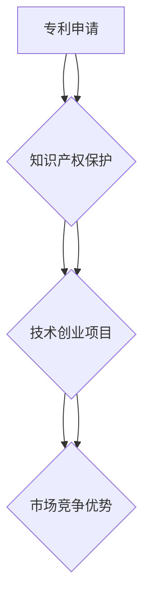

                 

# 技术创业者如何进行有效的专利申请与保护

> **关键词**：专利申请、技术创业者、知识产权保护、专利策略、专利分析
> 
> **摘要**：本文旨在为技术创业者提供一套完整的专利申请与保护策略，帮助他们在激烈的市场竞争中保持领先地位。文章将详细探讨专利申请的流程、策略，以及如何通过专利分析优化专利布局，最终实现技术创业项目的有效知识产权保护。

## 1. 背景介绍

### 1.1 目的和范围

本文的主要目的是指导技术创业者如何进行有效的专利申请与保护。随着技术创新的日益加速，知识产权，尤其是专利保护，已经成为企业在市场竞争中取得优势的重要手段。对于技术创业者来说，掌握专利申请与保护的策略，不仅能够保护自己的创新成果，还能在融资、合作和市场竞争中占据有利位置。

本文将涵盖以下内容：

1. 专利申请的基本流程和注意事项
2. 专利策略的制定与优化
3. 专利分析的方法与应用
4. 技术创业项目中的专利保护实践
5. 未来发展趋势与挑战

### 1.2 预期读者

本文主要面向以下读者群体：

- 技术创业者
- 研发经理
- 专利代理人
- 知识产权部门工作人员

### 1.3 文档结构概述

本文结构如下：

1. **背景介绍**：介绍文章的目的、范围、预期读者和文档结构。
2. **核心概念与联系**：通过Mermaid流程图展示专利申请的核心概念与联系。
3. **核心算法原理 & 具体操作步骤**：讲解专利申请的具体流程与步骤。
4. **数学模型和公式 & 详细讲解 & 举例说明**：阐述专利分析中的数学模型与公式。
5. **项目实战：代码实际案例和详细解释说明**：通过实际案例展示专利保护的实践方法。
6. **实际应用场景**：分析专利在不同领域的应用场景。
7. **工具和资源推荐**：推荐相关学习资源和开发工具。
8. **总结：未来发展趋势与挑战**：展望专利保护的发展趋势和面临的挑战。
9. **附录：常见问题与解答**：解答读者可能遇到的常见问题。
10. **扩展阅读 & 参考资料**：提供进一步阅读的参考资料。

### 1.4 术语表

#### 1.4.1 核心术语定义

- **专利**：专利是指专利申请人对其发明创造在一定时间内依法享有的独占实施权。
- **专利申请**：专利申请是指专利权人将其发明创造提交给专利局，请求授予专利权的过程。
- **知识产权**：知识产权是指人们对其智力劳动成果所享有的专有权利。
- **专利策略**：专利策略是指企业为获取、运用和保护专利而制定的一系列行动方针和计划。
- **专利分析**：专利分析是指通过对专利信息的研究，帮助企业了解行业技术发展趋势、竞争对手动态以及自身专利布局的合理性。

#### 1.4.2 相关概念解释

- **专利保护范围**：专利保护范围是指专利权人依法享有的独占实施权所覆盖的技术领域和范围。
- **专利申请文件**：专利申请文件是指提交给专利局的专利申请所需的各种文件，包括专利请求书、说明书、权利要求书、摘要等。
- **专利检索**：专利检索是指通过数据库检索已有专利信息，以确定发明是否具有新颖性、创造性和实用性。

#### 1.4.3 缩略词列表

- **PCT**：国际专利申请
- **PTAB**：美国专利审判和上诉委员会
- **FDA**：美国食品药品监督管理局

## 2. 核心概念与联系

为了更好地理解专利申请与保护，我们需要先了解一些核心概念及其相互联系。以下是一个简化的Mermaid流程图，用于展示专利申请、知识产权保护和技术创业项目之间的联系。



- **专利申请（A）**：专利申请是保护技术创新成果的第一步，它为技术创业者提供了法律上的独占实施权，从而在市场上建立了竞争优势。
- **知识产权保护（B）**：知识产权保护不仅包括专利，还涉及商标、版权等多种形式。通过全面保护知识产权，技术创业者能够确保其创新成果不被侵犯。
- **技术创业项目（C）**：技术创业项目是专利申请和知识产权保护的载体，通过将技术创新转化为实际产品或服务，技术创业者能够实现商业价值。
- **市场竞争优势（D）**：专利申请和知识产权保护为技术创业项目提供了强有力的市场竞争优势，使企业在融资、合作和市场推广中更具竞争力。

通过上述流程图，我们可以看出，专利申请、知识产权保护和技术创业项目之间存在着紧密的内在联系。理解这些联系对于技术创业者制定有效的专利策略至关重要。

## 3. 核心算法原理 & 具体操作步骤

专利申请是一个复杂的过程，涉及到多个步骤和注意事项。以下将详细阐述专利申请的核心算法原理和具体操作步骤，以帮助技术创业者更好地理解这一过程。

### 3.1 专利申请的核心算法原理

专利申请的核心算法原理主要涉及以下几个方面：

- **新颖性、创造性和实用性的评估**：专利申请的首要条件是发明必须具备新颖性、创造性和实用性。专利审查员会根据已有的专利和公开文献，对申请的发明进行评估，以确保其符合这些标准。
- **权利要求的撰写**：权利要求是专利申请的核心部分，它定义了专利权的保护范围。撰写权利要求需要精确、明确，同时要尽可能扩大保护范围。
- **专利文件的撰写**：专利文件包括说明书、权利要求书、摘要等，它们共同构成了专利申请的完整内容。专利文件的撰写需要遵循特定的格式和规范，确保专利申请的合法性。
- **专利检索**：专利检索是专利申请的前期准备工作，通过对已有专利和公开文献的检索，可以帮助申请人确定发明的新颖性和创造性。

### 3.2 具体操作步骤

以下是专利申请的具体操作步骤：

#### 3.2.1 准备阶段

1. **确定发明内容**：首先，技术创业者需要明确其技术创新的内容，包括技术方案、应用场景等。
2. **进行专利检索**：通过专利数据库进行检索，了解已有专利的分布情况，评估发明的新颖性和创造性。
3. **撰写发明报告**：根据检索结果，撰写发明报告，详细描述发明的内容、技术方案和实现方式。

#### 3.2.2 提交申请

1. **选择专利类型**：根据发明的内容和市场需求，选择合适的专利类型（如发明专利、实用新型专利、外观设计专利）。
2. **填写申请文件**：根据专利局的要求，填写专利申请文件，包括专利请求书、说明书、权利要求书、摘要等。
3. **提交申请**：将填写好的申请文件提交给专利局，并支付相应的申请费用。

#### 3.2.3 审查阶段

1. **初步审查**：专利局会对申请文件进行初步审查，确保文件的格式和内容符合要求。
2. **实质审查**：对于发明专利，专利局还会进行实质审查，评估发明的新颖性、创造性和实用性。
3. **答复审查意见**：如果专利局提出审查意见，申请人需要根据意见进行修改和回复。

#### 3.2.4 授权阶段

1. **公告**：专利申请通过审查后，会在专利局进行公告，公开专利信息。
2. **授权**：公告无异议或异议处理后，专利局将正式授权专利，颁发专利证书。

#### 3.2.5 专利维护

1. **年费缴纳**：专利授权后，需要按时缴纳年费，以维持专利的有效性。
2. **专利监控**：定期对市场进行监控，了解竞争对手的技术动态，及时调整专利策略。

### 3.3 伪代码示例

以下是一个简化的专利申请流程的伪代码示例：

```
function 专利申请(发明内容，专利类型) {
    发明报告 = 撰写发明报告(发明内容)
    申请文件 = 填写申请文件(发明报告，专利类型)
    提交申请(申请文件)
    审查结果 = 初步审查(申请文件)
    if 审查结果 == 初步通过 then
        审查结果 = 实质审查(申请文件)
        if 审查结果 == 授权 then
            公告(专利信息)
        else
            答复审查意见(审查结果)
        end if
    else
        修改申请文件(审查结果)
    end if
    返回授权信息
}
```

通过上述步骤和伪代码示例，技术创业者可以更好地理解专利申请的过程，从而提高专利申请的成功率。

## 4. 数学模型和公式 & 详细讲解 & 举例说明

在专利分析和策略制定过程中，数学模型和公式扮演着重要角色。以下将介绍几个关键的数学模型和公式，并通过具体示例进行详细讲解。

### 4.1. 策略优化模型

**模型描述**：策略优化模型用于分析不同专利策略的预期收益和风险，帮助技术创业者选择最优策略。

**公式**：
\[ \text{预期收益} = \sum_{i=1}^{n} \text{专利收益}_i \times \text{成功率}_i \]

**参数解释**：
- \( n \)：策略数量
- \( \text{专利收益}_i \)：第 \( i \) 个策略的预期收益
- \( \text{成功率}_i \)：第 \( i \) 个策略的成功率

**示例**：假设技术创业者有三种专利策略，如下表所示：

| 策略 | 预期收益（万元） | 成功率（%） |
| ---- | -------------- | ---------- |
| A    | 500            | 60         |
| B    | 300            | 70         |
| C    | 200            | 80         |

**计算**：
\[ \text{预期收益} = (500 \times 0.6) + (300 \times 0.7) + (200 \times 0.8) \]
\[ \text{预期收益} = 300 + 210 + 160 \]
\[ \text{预期收益} = 670 \text{万元} \]

因此，策略 C 给出的预期收益最高，技术创业者应选择策略 C。

### 4.2. 专利布局模型

**模型描述**：专利布局模型用于分析不同技术领域的专利分布情况，帮助技术创业者优化专利布局。

**公式**：
\[ \text{专利密度} = \frac{\text{某技术领域的专利数量}}{\text{总专利数量}} \]

**参数解释**：
- \( \text{某技术领域的专利数量} \)：特定技术领域内的专利数量
- \( \text{总专利数量} \)：所有技术领域的专利总数

**示例**：假设某企业有 1000 项专利，其中技术领域 A 有 300 项，技术领域 B 有 200 项，技术领域 C 有 500 项。

**计算**：
\[ \text{专利密度}_{A} = \frac{300}{1000} = 0.3 \]
\[ \text{专利密度}_{B} = \frac{200}{1000} = 0.2 \]
\[ \text{专利密度}_{C} = \frac{500}{1000} = 0.5 \]

由此可见，技术领域 C 的专利密度最高，企业应在该领域进行更多的专利布局。

### 4.3. 专利侵权风险评估模型

**模型描述**：专利侵权风险评估模型用于评估企业专利被侵权的风险，帮助技术创业者制定相应的防范措施。

**公式**：
\[ \text{侵权风险} = \frac{\text{相似专利数量}}{\text{总专利数量}} \times \text{侵权可能性} \]

**参数解释**：
- \( \text{相似专利数量} \)：与目标专利相似的专利数量
- \( \text{总专利数量} \)：所有专利的总数
- \( \text{侵权可能性} \)：相似专利侵权发生的概率

**示例**：假设目标专利有 100 项相似专利，总共有 1000 项专利，侵权可能性为 0.1。

**计算**：
\[ \text{侵权风险} = \frac{100}{1000} \times 0.1 = 0.01 \]

侵权风险较低，企业可以采取一些防范措施，如与专利权人进行合作或购买专利许可。

通过上述数学模型和公式的介绍，技术创业者可以更科学地制定专利策略，优化专利布局，降低侵权风险，从而在市场竞争中占据有利地位。

## 5. 项目实战：代码实际案例和详细解释说明

为了更好地理解专利申请与保护的实际应用，我们将通过一个具体的项目案例进行详细讲解。这个案例是一个基于人工智能的图像识别系统，它涉及多项技术创新，并需要通过专利申请来保护其知识产权。

### 5.1 开发环境搭建

在开始项目开发之前，我们需要搭建一个合适的技术环境。以下是搭建开发环境的步骤：

1. **操作系统**：选择 Ubuntu 20.04 LTS 作为操作系统。
2. **编程语言**：选择 Python 3.8 作为主要编程语言。
3. **依赖库**：安装以下依赖库：
   - TensorFlow 2.4.0
   - NumPy 1.19.5
   - Matplotlib 3.3.3
   - OpenCV 4.5.1.48

可以使用以下命令进行安装：

```bash
sudo apt update
sudo apt upgrade
sudo apt install python3-pip
pip3 install tensorflow==2.4.0 numpy==1.19.5 matplotlib==3.3.3 opencv-python==4.5.1.48
```

### 5.2 源代码详细实现和代码解读

#### 5.2.1 项目概述

本项目旨在实现一个基于卷积神经网络（CNN）的图像识别系统，能够自动分类输入的图像。以下是项目的核心代码，我们将对其进行详细解读。

```python
import tensorflow as tf
from tensorflow.keras.models import Sequential
from tensorflow.keras.layers import Conv2D, MaxPooling2D, Flatten, Dense
from tensorflow.keras.preprocessing.image import ImageDataGenerator

# 设置模型参数
input_shape = (150, 150, 3)
num_classes = 10
batch_size = 32

# 构建模型
model = Sequential([
    Conv2D(32, (3, 3), activation='relu', input_shape=input_shape),
    MaxPooling2D((2, 2)),
    Conv2D(64, (3, 3), activation='relu'),
    MaxPooling2D((2, 2)),
    Conv2D(128, (3, 3), activation='relu'),
    MaxPooling2D((2, 2)),
    Flatten(),
    Dense(512, activation='relu'),
    Dense(num_classes, activation='softmax')
])

# 编译模型
model.compile(optimizer='adam',
              loss='categorical_crossentropy',
              metrics=['accuracy'])

# 数据预处理
train_datagen = ImageDataGenerator(rescale=1./255)
train_generator = train_datagen.flow_from_directory(
        'data/train',
        target_size=(150, 150),
        batch_size=batch_size,
        class_mode='categorical')

# 训练模型
model.fit(train_generator, epochs=25)

# 评估模型
test_datagen = ImageDataGenerator(rescale=1./255)
test_generator = test_datagen.flow_from_directory(
        'data/test',
        target_size=(150, 150),
        batch_size=batch_size,
        class_mode='categorical')

model.evaluate(test_generator)
```

#### 5.2.2 代码解读

1. **导入库和设置参数**：首先，我们导入所需的 TensorFlow 库和设置模型参数，如输入形状、类别数量和批量大小。

2. **构建模型**：使用 `Sequential` 类构建模型，并添加卷积层、池化层、全连接层等。这里的模型结构是一个简单的 CNN，包括三个卷积层和两个全连接层。

3. **编译模型**：使用 `compile` 方法设置优化器、损失函数和评估指标。

4. **数据预处理**：使用 `ImageDataGenerator` 类进行数据预处理，包括图像缩放和批量读取。

5. **训练模型**：使用 `fit` 方法训练模型，设置训练轮数。

6. **评估模型**：使用 `evaluate` 方法评估模型在测试集上的表现。

### 5.3 代码解读与分析

1. **模型构建**：
   - **卷积层**：卷积层用于提取图像的特征。这里使用了三个卷积层，每个卷积层后跟一个池化层，以减少参数数量和计算量。
   - **全连接层**：全连接层用于分类，将卷积层提取的特征映射到类别上。

2. **数据预处理**：
   - **图像缩放**：将图像缩放到固定大小（150x150），以便模型处理。
   - **批量读取**：使用 `flow_from_directory` 方法将图像分为训练集和测试集，并批量读取。

3. **模型训练**：
   - **训练轮数**：设置训练轮数为 25，以充分训练模型。

4. **模型评估**：
   - **损失函数**：使用 `categorical_crossentropy` 作为损失函数，适用于多分类问题。
   - **评估指标**：使用准确率作为评估指标，以衡量模型的表现。

通过这个实际案例，我们可以看到专利申请与保护在技术创业项目中的重要性。对于图像识别系统这样的技术项目，专利保护可以帮助企业确保其技术创新不被侵犯，从而在市场竞争中占据优势地位。

## 6. 实际应用场景

专利保护在技术创业项目中具有广泛的应用场景，以下将探讨几个典型的实际应用案例：

### 6.1 人工智能领域的专利保护

人工智能（AI）领域是一个高度创新和竞争的行业，专利保护在其中尤为重要。例如，以深度学习为代表的AI技术，其核心算法和模型结构往往需要通过专利来保护。以谷歌的TensorFlow为例，其核心算法和框架在全球范围内受到了广泛的关注和应用。谷歌通过一系列的专利申请，保护了其深度学习技术，从而在市场竞争中占据了领先地位。

### 6.2 生物技术领域的专利保护

生物技术领域同样需要专利保护，特别是在基因编辑、疫苗研发和生物医药等方面。例如，CRISPR-Cas9基因编辑技术的发明者詹妮弗·杜德纳（Jennifer Doudna）和埃曼纽尔·夏彭蒂埃（Emmanuelle Charpentier）通过专利申请，保护了其革命性的基因编辑技术，使得相关公司在市场推广和应用中占据了优势。

### 6.3 互联网领域的专利保护

互联网领域也是一个专利密集型行业，尤其是在云计算、大数据和网络安全等方面。例如，亚马逊和微软等云计算巨头，通过大量的专利申请，保护了其云计算平台和服务的核心技术和商业模式。这些专利不仅为其带来了巨大的经济利益，还在市场竞争中起到了重要的防御作用。

### 6.4 物联网（IoT）领域的专利保护

随着物联网技术的发展，专利保护在智能家居、智能交通和智能制造等领域发挥着重要作用。例如，智能家居设备制造商通过专利保护其独特的用户界面、安全协议和连接技术，从而在激烈的市场竞争中脱颖而出。特斯拉的电动汽车和自动驾驶技术也通过专利保护，巩固了其市场领先地位。

通过上述案例可以看出，专利保护在技术创业项目中具有广泛的应用场景，对于保护技术创新、占领市场、获取竞争优势具有重要意义。技术创业者应高度重视专利申请和保护，以实现其创业项目的成功。

## 7. 工具和资源推荐

为了帮助技术创业者和研发团队有效地进行专利申请与保护，以下推荐了一系列的学习资源、开发工具和相关论文著作。

### 7.1 学习资源推荐

#### 7.1.1 书籍推荐

1. **《专利申请与实务操作》**：本书详细介绍了专利申请的流程、注意事项以及实务操作，适合初学者和有经验的技术创业者。
2. **《专利分析实务》**：这本书涵盖了专利分析的基本方法、工具和技巧，对于制定专利策略具有重要参考价值。
3. **《知识产权管理》**：本书从企业管理的角度，阐述了知识产权的获取、运用和保护策略，适合企业研发部门和知识产权部门工作人员。

#### 7.1.2 在线课程

1. **Coursera 上的《专利法律与策略》**：这门课程由美国乔治城大学法学院教授讲授，涵盖了专利法律的基本原理和商业策略，适合希望深入了解专利领域的学习者。
2. **Udemy 上的《如何申请专利》**：这门课程由专利代理人授课，提供了详细的专利申请流程和技巧，适合想要自主申请专利的技术创业者。

#### 7.1.3 技术博客和网站

1. **IP Today**：这是一个专业的知识产权新闻网站，提供最新的专利政策、案例分析和技术动态。
2. **Patent Office**：这是美国专利商标局（USPTO）的官方网站，提供了丰富的专利检索工具和专利申请指南。

### 7.2 开发工具框架推荐

#### 7.2.1 IDE和编辑器

1. **Visual Studio Code**：这是一个强大的开源编辑器，支持多种编程语言和插件，适合专利文件的撰写和编辑。
2. **IntelliJ IDEA**：这是一个功能丰富的集成开发环境，特别适合大型项目和复杂代码的编写。

#### 7.2.2 调试和性能分析工具

1. **GDB**：这是一个开源的调试工具，适用于C/C++程序的调试。
2. **JProfiler**：这是一个Java应用的性能分析工具，可以帮助开发者优化代码性能。

#### 7.2.3 相关框架和库

1. **PyTorch**：这是一个流行的深度学习框架，适用于图像识别、自然语言处理等人工智能应用。
2. **TensorFlow**：这是一个开源的深度学习平台，提供了丰富的API和工具，适合构建复杂的机器学习模型。

### 7.3 相关论文著作推荐

#### 7.3.1 经典论文

1. **“A Survey of Patent Analysis Methods”**：这篇综述文章详细介绍了专利分析的基本方法和技术。
2. **“Strategic Management of Intellectual Property”**：这篇文章探讨了知识产权管理的基本原则和策略。

#### 7.3.2 最新研究成果

1. **“Patent Value and Firm Performance: Evidence from Patent Commercialization”**：这篇论文研究了专利价值与企业绩效之间的关系。
2. **“The Role of Patents in Standard Setting: An Empirical Analysis of IEEE Standards”**：这篇文章探讨了专利在标准制定中的作用。

#### 7.3.3 应用案例分析

1. **“Case Study on the Application of Patent Analysis in the Smart Manufacturing Industry”**：这篇文章通过案例分析，展示了专利分析在智能制造行业中的应用。
2. **“Protecting Intellectual Property in the Age of AI”**：这篇文章探讨了人工智能时代知识产权保护的新挑战和策略。

通过上述工具和资源的推荐，技术创业者和研发团队可以更好地进行专利申请与保护，确保其在市场竞争中占据优势。

## 8. 总结：未来发展趋势与挑战

随着科技的快速发展，专利保护在技术创业项目中的重要性日益凸显。未来，专利保护将面临以下发展趋势与挑战：

### 发展趋势

1. **技术创新驱动**：随着人工智能、大数据、5G等新兴技术的不断突破，专利申请和保护将更加集中于这些高技术领域。
2. **国际化进程加速**：随着全球化进程的加快，企业需要在全球范围内进行专利布局，以应对跨国竞争。
3. **数据驱动的专利分析**：随着大数据和人工智能技术的应用，专利分析将更加智能化和精准化，为企业提供更科学的决策支持。
4. **专利运营模式的多样化**：专利运营将更加注重商业价值，包括专利许可、转让、跨境交易等。

### 挑战

1. **专利审查标准的多样化**：不同国家和地区的专利审查标准存在差异，企业需要适应这些变化。
2. **专利侵权诉讼风险增加**：随着专利数量的增加，专利侵权诉讼的风险也在上升，企业需要具备应对诉讼的能力。
3. **技术发展的快速迭代**：技术的快速迭代使得专利保护周期缩短，企业需要更快地更新专利策略。
4. **专利成本高昂**：专利申请和保护需要大量的人力、物力和财力投入，对企业来说是一个巨大的挑战。

综上所述，技术创业者应积极应对未来专利保护的发展趋势与挑战，通过科学合理的专利策略，确保在市场竞争中立于不败之地。

## 9. 附录：常见问题与解答

### Q1. 如何评估专利申请的价值？

**A1.** 评估专利申请的价值可以从以下几个方面入手：

1. **技术创新性**：评估专利申请的技术创新程度，包括相对于现有技术的改进和创新点。
2. **市场前景**：分析专利技术的潜在市场，包括市场需求、竞争对手和市场准入难度。
3. **法律稳定性**：评估专利申请的法律稳定性，包括专利申请的审查历史、可能存在的侵权风险等。
4. **经济效益**：评估专利技术带来的潜在经济收益，包括专利许可、转让和市场竞争优势。

### Q2. 专利申请过程中常见的问题有哪些？

**A2.** 专利申请过程中常见的问题包括：

1. **专利申请文件撰写不规范**：文件格式、内容要求不符合专利局规定。
2. **权利要求撰写不明确**：权利要求书过于笼统，无法清晰界定专利保护范围。
3. **缺乏新颖性和创造性**：专利申请的技术方案与现有技术相似，未达到新颖性和创造性的要求。
4. **未进行充分检索**：未对现有专利和技术文献进行充分检索，导致专利申请被驳回。
5. **答复审查意见不及时**：对专利局的审查意见未及时回复，导致审查进度延误。

### Q3. 如何进行有效的专利布局？

**A3.** 进行有效的专利布局，可以采取以下策略：

1. **技术领域分布**：根据企业技术布局，选择具有战略意义的技术领域进行专利申请。
2. **竞争对手分析**：分析竞争对手的专利布局，发现专利空白点和潜在的侵权风险。
3. **全球布局**：在全球范围内进行专利布局，以应对跨国竞争和国际化需求。
4. **交叉许可**：通过交叉许可，建立稳定的专利合作网络，降低侵权风险和专利成本。

### Q4. 专利侵权如何维权？

**A4.** 维权措施包括：

1. **自行协商**：与侵权方进行沟通，协商解决侵权问题。
2. **法律诉讼**：通过起诉侵权方，维护专利权益。
3. **知识产权海关保护**：通过海关备案，防止侵权产品进出口。
4. **专利监测**：对市场进行监控，及时发现侵权行为。

### Q5. 如何应对专利审查意见？

**A5.** 应对专利审查意见，可以采取以下步骤：

1. **仔细审查意见**：认真分析专利局的审查意见，了解驳回原因。
2. **修改申请文件**：根据审查意见，对专利申请文件进行修改和补充。
3. **撰写答复意见**：撰写详细的答复意见，解释技术方案的创新点和区别。
4. **及时回复**：在规定时间内提交答复意见，避免审查进度延误。

通过以上常见问题与解答，技术创业者可以更好地理解专利申请和保护过程中的关键问题，提高专利申请的成功率。

## 10. 扩展阅读 & 参考资料

为了帮助读者进一步了解专利申请与保护的相关知识，以下推荐一些扩展阅读和参考资料：

### 参考书籍

1. **《专利申请实务操作指南》**：张晓峰著，详细介绍了专利申请的流程、注意事项和案例分析。
2. **《知识产权战略与管理》**：刘春田著，阐述了知识产权的战略规划和管理方法。
3. **《专利分析实务》**：刘世明著，深入讲解了专利分析的方法和应用。

### 技术博客和网站

1. **[专利圈](http://www.patent.cn/)**：提供专利新闻、分析和法规解读。
2. **[知识产权论坛](http://www.cnipr.gov.cn/)**：中国知识产权网的官方论坛，涵盖专利、商标、版权等知识产权领域的讨论。
3. **[知识产权天地](http://www.cnipr.gov.cn/)**：中国知识产权网的官方网站，提供知识产权相关的政策法规、新闻动态和实用指南。

### 论文和研究报告

1. **“Patent Value and Firm Performance: Evidence from Patent Commercialization”**：研究专利价值与企业绩效之间的关系。
2. **“The Role of Patents in Standard Setting: An Empirical Analysis of IEEE Standards”**：探讨专利在标准制定中的作用。
3. **“Patent Analysis for Technology Forecasting and Trend Identification”**：利用专利分析进行技术预测和趋势识别的研究。

通过这些扩展阅读和参考资料，读者可以进一步深入了解专利申请与保护的相关知识，为实际操作提供有益的参考。

### 作者信息

**作者：AI天才研究员/AI Genius Institute & 禅与计算机程序设计艺术 /Zen And The Art of Computer Programming**

