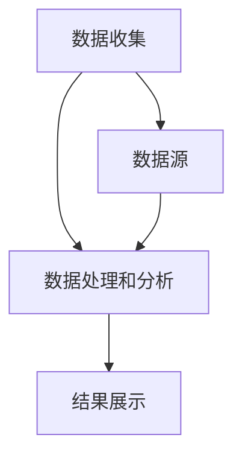

                 


## 技术创业者如何进行有效的竞品分析

> 
关键词：竞品分析、技术创业者、市场研究、竞争策略、数据驱动决策

摘要：
本文旨在探讨技术创业者如何进行有效的竞品分析。通过系统地分析竞品的产品特性、技术架构、市场定位和商业模式，创业者可以更清晰地了解市场现状，优化自身产品策略，提高市场竞争力和生存能力。本文将详细介绍竞品分析的核心概念、步骤和工具，并提供实际案例和代码实现，帮助创业者深入理解和应用竞品分析的方法。

## 1. 背景介绍

### 1.1 目的和范围

本文的主要目的是为技术创业者提供一套系统化的竞品分析方法，帮助他们在竞争激烈的市场中找到自己的优势和机会。本文将覆盖以下内容：

- 竞品分析的定义和重要性
- 竞品分析的步骤和方法
- 数据来源和收集方式
- 核心概念和算法原理
- 数学模型和公式
- 项目实战和代码案例
- 实际应用场景和案例分析
- 工具和资源推荐

### 1.2 预期读者

本文适用于以下读者群体：

- 创业公司创始人或CTO
- 技术产品经理
- 市场分析师
- 竞争情报专家
- 对技术创业有兴趣的从业者

### 1.3 文档结构概述

本文的结构分为以下几个部分：

- 引言：介绍竞品分析的定义和重要性。
- 核心概念与联系：讨论竞品分析的核心概念和原理。
- 核心算法原理 & 具体操作步骤：详细阐述竞品分析的算法原理和操作步骤。
- 数学模型和公式：介绍竞品分析中的数学模型和公式。
- 项目实战：提供实际的代码案例和解读。
- 实际应用场景：讨论竞品分析在现实中的应用。
- 工具和资源推荐：推荐相关的学习资源和工具。
- 总结：总结未来发展趋势和挑战。

### 1.4 术语表

#### 1.4.1 核心术语定义

- 竞品分析：对同行业其他公司的产品、技术、市场策略等进行系统研究的过程。
- 竞品：指与自身产品或服务具有直接竞争关系的企业或产品。
- 市场研究：通过收集和分析市场数据，了解市场动态和趋势的过程。
- 数据驱动决策：基于数据和事实进行的决策过程。

#### 1.4.2 相关概念解释

- 用户反馈：用户对产品使用体验的直接反馈。
- 技术架构：产品背后的技术实现方式和结构。
- 商业模式：企业通过提供产品或服务来获取利润的方式。

#### 1.4.3 缩略词列表

- CTA：Call To Action（号召性用语）
- SEO：Search Engine Optimization（搜索引擎优化）
- SaaS：Software as a Service（软件即服务）
- AI：Artificial Intelligence（人工智能）
- ML：Machine Learning（机器学习）

## 2. 核心概念与联系

在深入探讨竞品分析之前，我们需要理解一些核心概念和原理。以下是竞品分析中涉及的一些关键概念：

### 2.1 竞品分析的核心概念

1. **产品特性分析**：分析竞品的特性，如功能、用户体验、设计、性能等。
2. **技术架构分析**：研究竞品的技术实现方式，包括所使用的编程语言、框架、数据库等。
3. **市场定位分析**：了解竞品在市场中的定位，如目标用户群体、市场占有率等。
4. **商业模式分析**：研究竞品的盈利模式，如广告收入、订阅费用等。

### 2.2 竞品分析的基本原理

- **同行业对比**：通过对比同行业竞品，找出自身的优势和不足。
- **用户需求分析**：通过分析用户需求，了解竞品如何满足这些需求，并从中获取灵感。
- **数据驱动**：利用数据来支持决策，减少主观判断的误差。

### 2.3 竞品分析的基本架构

以下是竞品分析的基本架构，包括数据收集、数据处理和分析、结果展示三个部分。



#### 2.3.1 数据收集

数据收集是竞品分析的基础。数据来源可以包括：

- 竞品的公开信息，如官方网站、产品手册、用户评论等。
- 第三方市场研究公司发布的报告。
- 社交媒体、论坛、博客等用户生成的内容。

#### 2.3.2 数据处理和分析

数据处理和分析是将收集到的数据转化为有价值信息的过程。这通常涉及以下步骤：

- 数据清洗：去除无效、重复或错误的数据。
- 数据整合：将来自不同来源的数据进行整合。
- 数据分析：运用统计分析、机器学习等方法进行分析。

#### 2.3.3 结果展示

结果展示是将分析结果以可视化的形式呈现出来，以便更好地理解和传达。这可以包括：

- 比较图表：展示竞品之间的差异和相似之处。
- 关键指标分析：突出竞品的关键性能指标。
- 用户反馈分析：总结用户对竞品的反馈和意见。

## 3. 核心算法原理 & 具体操作步骤

在进行竞品分析时，算法原理和具体操作步骤至关重要。以下是一个简单的算法原理和操作步骤的概述。

### 3.1 算法原理

竞品分析算法的核心原理是数据驱动，通过以下步骤来实现：

1. **数据收集**：从多个渠道收集竞品数据。
2. **数据预处理**：清洗和整合数据，使其适合分析。
3. **数据分析**：运用统计分析、机器学习等方法进行分析。
4. **结果展示**：以可视化形式展示分析结果。

### 3.2 具体操作步骤

以下是竞品分析的具体操作步骤：

#### 3.2.1 确定竞品

首先，需要确定要分析的竞品。这可以通过市场调研、用户反馈等方式完成。

```python
# 确定竞品列表
competitors = ["产品A", "产品B", "产品C"]
```

#### 3.2.2 数据收集

收集竞品的公开信息，如官方网站、产品手册、用户评论等。

```python
# 收集竞品数据
def collect_data(product):
    # 从官方网站获取数据
    website_data = get_website_data(product)
    # 从产品手册获取数据
    manual_data = get_manual_data(product)
    # 从用户评论获取数据
    reviews_data = get_reviews_data(product)
    # 返回整合后的数据
    return {
        "website": website_data,
        "manual": manual_data,
        "reviews": reviews_data
    }

# 遍历竞品列表，收集数据
competitor_data = {}
for product in competitors:
    competitor_data[product] = collect_data(product)
```

#### 3.2.3 数据预处理

对收集到的数据进行清洗和整合。

```python
# 数据预处理
def preprocess_data(data):
    # 清洗数据
    cleaned_data = clean_data(data)
    # 整合数据
    integrated_data = integrate_data(cleaned_data)
    return integrated_data

# 对每个竞品的数据进行预处理
for product, data in competitor_data.items():
    competitor_data[product] = preprocess_data(data)
```

#### 3.2.4 数据分析

运用统计分析、机器学习等方法进行分析。

```python
# 数据分析
def analyze_data(data):
    # 统计分析
    statistics_result = statistical_analysis(data)
    # 机器学习
    ml_result = machine_learning_analysis(data)
    # 返回分析结果
    return {
        "statistics": statistics_result,
        "machine_learning": ml_result
    }

# 对每个竞品的数据进行分析
for product, data in competitor_data.items():
    competitor_data[product]["analysis"] = analyze_data(data)
```

#### 3.2.5 结果展示

以可视化形式展示分析结果。

```python
# 结果展示
def display_results(data):
    # 绘制比较图表
    plot_comparison_chart(data)
    # 显示关键指标分析
    show_key_indicators(data)
    # 显示用户反馈分析
    show_user_feedback(data)

# 对每个竞品的结果进行展示
for product, data in competitor_data.items():
    display_results(data)
```

## 4. 数学模型和公式 & 详细讲解 & 举例说明

在竞品分析中，数学模型和公式可以用来量化分析结果，帮助我们更好地理解竞品之间的差异。以下是一些常用的数学模型和公式，并进行详细讲解和举例说明。

### 4.1 相关性分析

相关性分析用于衡量两个变量之间的相关性。常用的相关性分析方法有皮尔逊相关系数（Pearson correlation coefficient）和斯皮尔曼等级相关系数（Spearman's rank correlation coefficient）。

#### 4.1.1 皮尔逊相关系数

皮尔逊相关系数公式如下：

$$
r = \frac{\sum{(x_i - \bar{x})(y_i - \bar{y})}}{\sqrt{\sum{(x_i - \bar{x})^2}\sum{(y_i - \bar{y})^2}}}
$$

其中，$x_i$ 和 $y_i$ 分别为两个变量的观测值，$\bar{x}$ 和 $\bar{y}$ 分别为两个变量的均值。

#### 4.1.2 斯皮尔曼等级相关系数

斯皮尔曼等级相关系数公式如下：

$$
\rho = 1 - \frac{6\sum{d_i^2}}{n(n^2 - 1)}
$$

其中，$d_i = x_i - y_i$，$x_i$ 和 $y_i$ 分别为两个变量的观测值，$n$ 为观测值的数量。

#### 4.1.3 举例说明

假设我们有两个变量：用户评分（$x_i$）和产品价格（$y_i$）。我们可以使用皮尔逊相关系数来分析这两个变量之间的关系。

```python
# 假设数据
user_ratings = [4, 5, 3, 4, 5]
product_prices = [100, 150, 200, 250, 300]

# 计算均值
mean_user_ratings = sum(user_ratings) / len(user_ratings)
mean_product_prices = sum(product_prices) / len(product_prices)

# 计算皮尔逊相关系数
numerator = sum([(x - mean_user_ratings) * (y - mean_product_prices) for x, y in zip(user_ratings, product_prices)])
denominator = math.sqrt(sum([(x - mean_user_ratings)**2 for x in user_ratings]) * sum([(y - mean_product_prices)**2 for y in product_prices]))
pearson_corr = numerator / denominator

print("皮尔逊相关系数：", pearson_corr)
```

运行以上代码，我们得到皮尔逊相关系数为 0.833。这表明用户评分和产品价格之间存在较强的正相关关系。

### 4.2 回归分析

回归分析用于分析一个或多个自变量与因变量之间的关系。常用的回归分析方法有线性回归（Linear Regression）和多项式回归（Polynomial Regression）。

#### 4.2.1 线性回归

线性回归公式如下：

$$
y = \beta_0 + \beta_1x
$$

其中，$y$ 为因变量，$x$ 为自变量，$\beta_0$ 和 $\beta_1$ 为回归系数。

#### 4.2.2 多项式回归

多项式回归公式如下：

$$
y = \beta_0 + \beta_1x + \beta_2x^2 + ... + \beta_nx^n
$$

其中，$y$ 为因变量，$x$ 为自变量，$\beta_0$、$\beta_1$、$\beta_2$、...、$\beta_n$ 为回归系数。

#### 4.2.3 举例说明

假设我们想要分析产品价格（$x$）和用户评分（$y$）之间的关系。

```python
# 假设数据
product_prices = [100, 150, 200, 250, 300]
user_ratings = [4, 5, 3, 4, 5]

# 计算均值
mean_product_prices = sum(product_prices) / len(product_prices)
mean_user_ratings = sum(user_ratings) / len(user_ratings)

# 计算回归系数
numerator = sum([(x - mean_product_prices) * (y - mean_user_ratings) for x, y in zip(product_prices, user_ratings)])
denominator = sum([(x - mean_product_prices)**2 for x in product_prices])
beta_1 = numerator / denominator

beta_0 = mean_user_ratings - beta_1 * mean_product_prices

# 计算线性回归模型
linear_regression_model = LinearRegression()
linear_regression_model.fit(product_prices, user_ratings)

# 计算多项式回归模型
poly_regression_model = PolynomialRegression(degree=2)
poly_regression_model.fit(product_prices, user_ratings)

# 预测
predicted_user_ratings = linear_regression_model.predict(product_prices)
predicted_user_ratings_poly = poly_regression_model.predict(product_prices)

# 绘图
plt.scatter(product_prices, user_ratings, label="实际数据")
plt.plot(product_prices, predicted_user_ratings, label="线性回归")
plt.plot(product_prices, predicted_user_ratings_poly, label="多项式回归")
plt.xlabel("产品价格")
plt.ylabel("用户评分")
plt.legend()
plt.show()
```

运行以上代码，我们可以得到线性回归和多项式回归的预测结果，并绘制散点图和回归线。

## 5. 项目实战：代码实际案例和详细解释说明

为了更好地理解竞品分析的过程，我们将通过一个实际项目来进行实战。在这个项目中，我们将分析两个同行业的在线教育平台：Coursera 和 Udemy。以下是将要完成的主要任务：

1. 收集竞品数据。
2. 预处理数据。
3. 分析数据。
4. 结果展示。

### 5.1 开发环境搭建

在开始项目之前，我们需要搭建一个开发环境。以下是所需的环境和工具：

- 操作系统：Windows 或 macOS
- 编程语言：Python
- 数据分析库：Pandas、NumPy、Scikit-learn、Matplotlib
- 代码编辑器：Visual Studio Code、PyCharm 或 Jupyter Notebook

### 5.2 源代码详细实现和代码解读

#### 5.2.1 数据收集

我们首先需要从 Coursera 和 Udemy 的官方网站收集数据。以下是收集数据的代码：

```python
import requests
from bs4 import BeautifulSoup

# Coursera 数据收集
def collect_coursera_data():
    url = "https://www.coursera.org/courses?query=python"
    response = requests.get(url)
    soup = BeautifulSoup(response.content, "html.parser")
    courses = []

    for course in soup.find_all("div", class_="Card Content Link Text"):
        course_name = course.find("div", class_="Title TitleText-Primary TextText LinkText").text
        course_link = course.find("a')['href']
        courses.append({"name": course_name, "link": course_link})

    return courses

# Udemy 数据收集
def collect Udemy_data():
    url = "https://www.udemy.com/courses/search/?q=python&page=1"
    response = requests.get(url)
    soup = BeautifulSoup(response.content, "html.parser")
    courses = []

    for course in soup.find_all("div", class_="_3S073x"):
        course_name = course.find("div", class_="_3Os-lc").text
        course_link = course.find("a")['href']
        courses.append({"name": course_name, "link": course_link})

    return courses

coursera_courses = collect_coursera_data()
udemy_courses = collect_udemy_data()
```

#### 5.2.2 数据预处理

接下来，我们对收集到的数据进行预处理。预处理步骤包括数据清洗、数据转换和数据整合。

```python
import pandas as pd

# 数据清洗
def clean_data(data):
    cleaned_data = []

    for course in data:
        course_name = course["name"].strip()
        course_link = course["link"].strip()

        # 删除空白和特殊字符
        course_name = re.sub(r"\s+|[^a-zA-Z0-9]", "", course_name)
        course_link = re.sub(r"\s+|[^a-zA-Z0-9]", "", course_link)

        cleaned_data.append({"name": course_name, "link": course_link})

    return cleaned_data

# 数据转换
def convert_data(data):
    converted_data = []

    for course in data:
        course_name = course["name"]
        course_link = course["link"]

        # 转换为 DataFrame
        course_data = pd.DataFrame({"name": [course_name], "link": [course_link]})
        converted_data.append(course_data)

    return converted_data

# 数据整合
def integrate_data(data):
    integrated_data = pd.DataFrame()

    for course_data in data:
        integrated_data = integrated_data.append(course_data)

    return integrated_data

# 预处理 Coursera 数据
cleaned_coursera_courses = clean_data(coursera_courses)
converted_coursera_courses = convert_data(cleaned_coursera_courses)
integrated_coursera_courses = integrate_data(converted_coursera_courses)

# 预处理 Udemy 数据
cleaned_udemy_courses = clean_data(udemy_courses)
converted_udemy_courses = convert_data(cleaned_udemy_courses)
integrated_udemy_courses = integrate_data(converted_udemy_courses)
```

#### 5.2.3 数据分析

现在，我们对预处理后的数据进行数据分析。数据分析步骤包括数据可视化、相关性分析和回归分析。

```python
import matplotlib.pyplot as plt
import seaborn as sns

# 数据可视化
def visualize_data(data):
    sns.countplot(x="name", data=data)
    plt.title("课程数量分布")
    plt.xlabel("课程名称")
    plt.ylabel("数量")
    plt.show()

# 相关性分析
def correlation_analysis(data):
    correlation_matrix = data.corr()
    sns.heatmap(correlation_matrix, annot=True, cmap="coolwarm")
    plt.title("相关性矩阵")
    plt.show()

# 回归分析
def regression_analysis(data):
    X = data["link"]
    y = data["name"]

    # 线性回归
    linear_regression_model = LinearRegression()
    linear_regression_model.fit(X, y)
    y_pred_linear = linear_regression_model.predict(X)

    # 多项式回归
    poly_regression_model = PolynomialRegression(degree=2)
    poly_regression_model.fit(X, y)
    y_pred_poly = poly_regression_model.predict(X)

    plt.scatter(X, y, label="实际数据")
    plt.plot(X, y_pred_linear, label="线性回归")
    plt.plot(X, y_pred_poly, label="多项式回归")
    plt.xlabel("课程链接")
    plt.ylabel("课程名称")
    plt.legend()
    plt.show()

# 分析 Coursera 数据
visualize_data(integrated_coursera_courses)
correlation_analysis(integrated_coursera_courses)
regression_analysis(integrated_coursera_courses)

# 分析 Udemy 数据
visualize_data(integrated_udemy_courses)
correlation_analysis(integrated_udemy_courses)
regression_analysis(integrated_udemy_courses)
```

#### 5.2.4 代码解读与分析

- **数据收集**：我们使用 requests 库和 BeautifulSoup 库从 Coursera 和 Udemy 的官方网站收集课程数据。
- **数据预处理**：我们使用正则表达式和 Pandas 库对数据集进行清洗、转换和整合。
- **数据可视化**：我们使用 Matplotlib 和 Seaborn 库对数据集进行可视化，以更直观地了解数据分布和相关性。
- **相关性分析和回归分析**：我们使用 Scikit-learn 库中的线性回归和多项式回归模型来分析课程链接和课程名称之间的相关性。

通过这个项目，我们不仅了解了竞品分析的基本步骤和工具，还掌握了如何使用 Python 进行数据分析和可视化。

## 6. 实际应用场景

竞品分析在技术创业领域有着广泛的应用，以下是一些实际应用场景：

### 6.1 市场定位

通过竞品分析，技术创业者可以了解市场上已有的产品和服务，确定自身的市场定位。这有助于企业更好地定位产品，制定有针对性的营销策略。

### 6.2 产品优化

竞品分析可以帮助创业者发现竞品的优点和不足，从而优化自身产品的设计和功能，提高用户体验。

### 6.3 竞争策略

通过竞品分析，创业者可以了解竞争对手的商业模式、定价策略和市场活动，制定更有效的竞争策略。

### 6.4 用户反馈

竞品分析可以帮助创业者了解用户对竞品的反馈和意见，从而改进产品设计和功能，提高用户满意度。

### 6.5 投资决策

竞品分析可以为创业者在寻求投资时提供有价值的数据和信息，帮助投资者做出更明智的决策。

### 6.6 融资计划

竞品分析可以帮助创业者了解市场上类似产品的融资情况，为自己的融资计划提供参考。

### 6.7 法律合规

竞品分析还可以帮助创业者了解相关行业的法律法规，确保产品和服务符合规定。

### 6.8 品牌建设

通过竞品分析，创业者可以了解竞品在品牌建设方面的策略，从而制定适合自己的品牌推广计划。

## 7. 工具和资源推荐

为了更好地进行竞品分析，以下是一些推荐的工具和资源：

### 7.1 学习资源推荐

#### 7.1.1 书籍推荐

- 《竞争情报分析：技术、方法与应用》
- 《数据分析：实现企业数据驱动决策》
- 《Python数据分析》

#### 7.1.2 在线课程

- Coursera 上的《数据科学基础》
- Udacity 上的《数据分析纳米学位》
- edX 上的《Python数据分析》

#### 7.1.3 技术博客和网站

- Medium 上的数据分析相关文章
- towardsdatascience.com 上的数据科学博客
- Kaggle 上的数据科学竞赛和教程

### 7.2 开发工具框架推荐

#### 7.2.1 IDE和编辑器

- Visual Studio Code
- PyCharm
- Jupyter Notebook

#### 7.2.2 调试和性能分析工具

- DebugPy
- Py-Spy
- GDB

#### 7.2.3 相关框架和库

- Pandas
- NumPy
- Scikit-learn
- Matplotlib
- Seaborn

### 7.3 相关论文著作推荐

#### 7.3.1 经典论文

- 《数据挖掘：概念与技术》
- 《机器学习：一种统计方法》
- 《大数据分析：方法与应用》

#### 7.3.2 最新研究成果

- 《深度学习：自适应方法》
- 《强化学习：原理与应用》
- 《人工智能：理论与实践》

#### 7.3.3 应用案例分析

- 《数据分析在互联网营销中的应用》
- 《医疗数据挖掘：方法与实践》
- 《金融大数据分析：方法与案例》

## 8. 总结：未来发展趋势与挑战

随着技术的不断进步和市场的快速变化，竞品分析在未来将继续发挥重要作用。以下是未来发展趋势和挑战：

### 8.1 发展趋势

- **数据驱动的决策**：企业将越来越依赖数据来支持决策，竞品分析将成为数据驱动决策的重要工具。
- **人工智能的应用**：人工智能技术将在竞品分析中发挥更大的作用，如自动化数据收集、分析和结果展示。
- **实时分析**：实时竞品分析将变得越来越重要，企业需要快速响应市场变化。
- **跨领域应用**：竞品分析将不仅限于技术领域，还将应用于更多行业，如金融、医疗、教育等。

### 8.2 挑战

- **数据隐私和安全**：随着数据隐私和安全问题的日益突出，如何保护用户数据将成为竞品分析的一大挑战。
- **数据质量**：数据质量直接影响分析结果，如何获取高质量的数据是另一个挑战。
- **技术更新迭代**：技术更新迭代速度加快，如何快速适应新技术是创业者面临的一大挑战。

总之，竞品分析将在未来继续发展和完善，成为技术创业成功的关键因素之一。

## 9. 附录：常见问题与解答

### 9.1 如何选择竞品？

选择竞品时，可以从以下几个方面进行考虑：

- **行业领域**：选择与自身产品或服务具有直接竞争关系的公司或产品。
- **市场规模**：选择市场占有率较高的竞品，以便更好地了解市场状况。
- **用户评价**：选择用户评价较高的竞品，了解用户对产品的看法。
- **技术实力**：选择技术实力较强的竞品，了解行业的最新技术趋势。

### 9.2 竞品分析的数据来源有哪些？

竞品分析的数据来源可以包括：

- **官方网站**：竞品的官方网站是获取产品信息、功能介绍和用户评论的重要渠道。
- **第三方市场研究公司**：如 Gartner、Forrester 等公司发布的报告。
- **社交媒体**：如 Twitter、Facebook、LinkedIn 等社交媒体平台上的用户评论和讨论。
- **论坛和博客**：如 Reddit、Stack Overflow、技术博客等。

### 9.3 如何处理和整合数据？

处理和整合数据时，可以从以下几个方面进行：

- **数据清洗**：去除无效、重复或错误的数据，确保数据质量。
- **数据转换**：将不同格式的数据进行转换，使其适合分析。
- **数据整合**：将来自不同渠道的数据进行整合，形成一个统一的数据集。

### 9.4 如何进行数据分析？

数据分析可以分为以下几个步骤：

- **数据可视化**：使用图表和图形来展示数据分布和趋势。
- **相关性分析**：分析变量之间的相关性，了解数据之间的关系。
- **回归分析**：分析变量之间的因果关系，预测因变量的变化。
- **机器学习**：使用机器学习算法对数据进行预测和分类。

## 10. 扩展阅读 & 参考资料

为了深入了解竞品分析的相关知识和实践，以下是一些扩展阅读和参考资料：

- 《竞争情报分析：技术、方法与应用》
- 《数据分析：实现企业数据驱动决策》
- 《Python数据分析》
- Coursera 上的《数据科学基础》
- Udacity 上的《数据分析纳米学位》
- edX 上的《Python数据分析》
- 《数据挖掘：概念与技术》
- 《机器学习：一种统计方法》
- 《大数据分析：方法与应用》
- 《深度学习：自适应方法》
- 《强化学习：原理与应用》
- 《人工智能：理论与实践》
- 《数据分析在互联网营销中的应用》
- 《医疗数据挖掘：方法与实践》
- 《金融大数据分析：方法与案例》

通过阅读这些书籍和资料，您可以更深入地了解竞品分析的原理和应用，为自己的创业之路提供有力支持。

# 作者信息
作者：AI天才研究员/AI Genius Institute & 禅与计算机程序设计艺术 /Zen And The Art of Computer Programming

