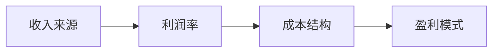
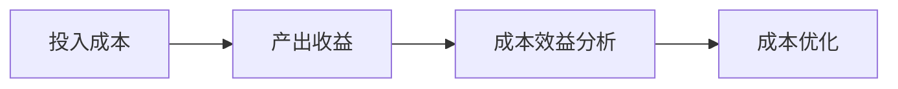
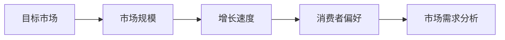
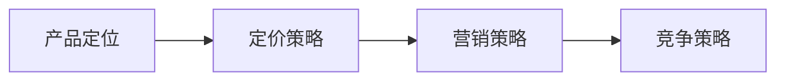

                 

# 技术创业者的商业模式设计与优化

> 关键词：商业模式设计、优化、技术创业、盈利模式、成本效益分析、市场需求分析

> 摘要：本文旨在探讨技术创业者在商业模式设计与优化过程中的关键要素。通过深入分析市场需求、盈利模式、成本效益以及竞争策略，帮助技术创业者构建一个稳健且可持续发展的商业模式，从而在竞争激烈的市场中脱颖而出。

## 1. 背景介绍

### 1.1 目的和范围

本文旨在为技术创业者提供一套系统化的商业模式设计与优化方法，帮助他们更好地理解和运用商业模式来推动企业的长期发展。文章将从市场需求分析、盈利模式构建、成本效益分析和竞争策略等方面进行深入探讨，并结合实际案例进行详细解读。

### 1.2 预期读者

本文适用于有志于创业或正在创业的技术创业者，尤其是那些希望在商业模式设计与优化方面获得指导和技术支持的人。同时，对于投资人和企业管理者来说，本文也具有一定的参考价值。

### 1.3 文档结构概述

本文分为十个部分：

1. 背景介绍：介绍本文的目的、预期读者和文档结构。
2. 核心概念与联系：阐述商业模式设计中的核心概念和联系。
3. 核心算法原理 & 具体操作步骤：介绍商业模式设计的关键算法原理和操作步骤。
4. 数学模型和公式 & 详细讲解 & 举例说明：讲解商业模式设计中的数学模型和公式，并给出实际案例。
5. 项目实战：提供代码实际案例和详细解释说明。
6. 实际应用场景：分析商业模式在实际应用中的优势和挑战。
7. 工具和资源推荐：推荐学习资源、开发工具和框架。
8. 总结：总结商业模式设计的关键要素和未来发展趋势。
9. 附录：常见问题与解答。
10. 扩展阅读 & 参考资料：提供更多参考资料。

### 1.4 术语表

#### 1.4.1 核心术语定义

- 商业模式：指企业通过产品或服务来创造、传递和获取价值的方式。
- 盈利模式：企业实现盈利的方式和途径。
- 成本效益分析：分析企业投入成本与产出收益之间的比例关系。
- 市场需求分析：研究目标市场对产品或服务的需求程度。
- 竞争策略：企业在市场竞争中采取的竞争手段和策略。

#### 1.4.2 相关概念解释

- 商业模式创新：指企业在商业模式设计过程中，通过创新来提高竞争力。
- 跨界融合：指不同行业或领域的资源和能力相互融合，实现商业模式创新。
- 增长型商业模式：指企业在短期内实现快速增长，从而提高市场竞争力的商业模式。

#### 1.4.3 缩略词列表

- MBA：商业模式设计
- CBA：成本效益分析
- MMA：市场需求分析
- CSA：竞争策略分析

## 2. 核心概念与联系

在商业模式设计中，核心概念包括盈利模式、成本效益分析、市场需求分析和竞争策略。这些概念相互关联，共同构成了一个完整的商业模式。

### 2.1 盈利模式

盈利模式是企业实现盈利的方式和途径。它包括收入来源、利润率、成本结构等关键要素。以下是一个简单的 Mermaid 流程图，展示了盈利模式中的关键节点：



### 2.2 成本效益分析

成本效益分析是指分析企业投入成本与产出收益之间的比例关系。通过成本效益分析，企业可以确定哪些成本是必要的，哪些是可以削减的，从而实现成本优化。以下是一个简单的 Mermaid 流程图，展示了成本效益分析的关键节点：



### 2.3 市场需求分析

市场需求分析是研究目标市场对产品或服务的需求程度。通过市场需求分析，企业可以确定目标市场的规模、增长速度、消费者偏好等因素，从而制定相应的市场策略。以下是一个简单的 Mermaid 流程图，展示了市场需求分析的关键节点：



### 2.4 竞争策略

竞争策略是企业为在市场中获得竞争优势而采取的手段和策略。竞争策略包括产品定位、定价策略、营销策略等。以下是一个简单的 Mermaid 流程图，展示了竞争策略的关键节点：



## 3. 核心算法原理 & 具体操作步骤

在商业模式设计中，核心算法原理包括盈利模式构建、成本效益分析、市场需求分析和竞争策略。以下将分别介绍这些算法原理的具体操作步骤。

### 3.1 盈利模式构建

盈利模式构建的目的是为企业找到合适的盈利渠道，实现持续盈利。以下是盈利模式构建的伪代码：

```python
# 输入：产品或服务、目标市场、竞争环境
# 输出：盈利模式

def build_profit_model(product, market, competition):
    # 分析产品或服务的收入来源
    revenue_sources = analyze_revenue_sources(product)

    # 分析市场竞争环境和目标市场
    market_info = analyze_market(market, competition)

    # 构建盈利模式
    profit_model = {
        "revenue_sources": revenue_sources,
        "cost_structure": analyze_cost_structure(),
        "profit_margin": calculate_profit_margin(revenue_sources, cost_structure),
        "return_on_investment": calculate_return_on_investment(profit_margin)
    }

    return profit_model
```

### 3.2 成本效益分析

成本效益分析的主要目的是确定企业投入的成本与产出的收益之间的比例关系，从而实现成本优化。以下是成本效益分析的伪代码：

```python
# 输入：投入成本、产出收益
# 输出：成本效益分析结果

def analyze_cost_benefit(costs, benefits):
    # 计算成本与收益比例
    cost_benefit_ratio = costs / benefits

    # 分析成本效益情况
    if cost_benefit_ratio > 1:
        # 成本高于收益，需要优化成本
        optimization_suggestions = optimize_costs(costs)
    else:
        # 成本低于收益，可以保持现状或进一步扩大生产
        optimization_suggestions = "保持现状或扩大生产"

    return cost_benefit_ratio, optimization_suggestions
```

### 3.3 市场需求分析

市场需求分析的主要目的是确定目标市场对产品或服务的需求程度，从而制定相应的市场策略。以下是市场需求分析的伪代码：

```python
# 输入：目标市场、市场规模、增长速度、消费者偏好
# 输出：市场需求分析结果

def analyze_market_demand(market, size, growth_rate, consumer_preferences):
    # 分析市场规模和增长速度
    market_info = {
        "size": size,
        "growth_rate": growth_rate
    }

    # 分析消费者偏好
    consumer_preferences = analyze_consumer_preferences()

    # 构建市场需求分析结果
    market_demand = {
        "market_info": market_info,
        "consumer_preferences": consumer_preferences
    }

    return market_demand
```

### 3.4 竞争策略

竞争策略的主要目的是在市场中获得竞争优势，提高市场份额。以下是竞争策略的伪代码：

```python
# 输入：产品定位、定价策略、营销策略
# 输出：竞争策略结果

def build_competition_strategy(product_position, pricing_strategy, marketing_strategy):
    # 分析产品定位
    product_position = analyze_product_position()

    # 分析定价策略
    pricing_strategy = analyze_pricing_strategy()

    # 分析营销策略
    marketing_strategy = analyze_marketing_strategy()

    # 构建竞争策略结果
    competition_strategy = {
        "product_position": product_position,
        "pricing_strategy": pricing_strategy,
        "marketing_strategy": marketing_strategy
    }

    return competition_strategy
```

## 4. 数学模型和公式 & 详细讲解 & 举例说明

在商业模式设计中，数学模型和公式可以帮助我们更准确地分析企业的成本、收益、市场份额等关键指标。以下将介绍几个常见的数学模型和公式，并结合实际案例进行详细讲解。

### 4.1 成本效益分析公式

成本效益分析公式为：

\[ CBA = \frac{C}{B} \]

其中，\( C \) 表示投入成本，\( B \) 表示产出收益。

**例子：** 某公司开发一款新产品，投入成本为 100 万元，预计第一年销售收入为 200 万元。则该产品的成本效益比为：

\[ CBA = \frac{100}{200} = 0.5 \]

由于成本效益比低于 1，说明该产品的盈利能力较弱，需要进一步优化成本。

### 4.2 市场需求分析公式

市场需求分析公式为：

\[ D = \frac{S}{G} \]

其中，\( D \) 表示市场需求量，\( S \) 表示市场规模，\( G \) 表示增长速度。

**例子：** 某行业市场规模为 100 亿元，预计未来三年内将以 20% 的速度增长。则该行业的需求量为：

\[ D = \frac{100}{(1+0.2)^3} \approx 75.86 \] 亿元

### 4.3 竞争策略分析公式

竞争策略分析公式为：

\[ CS = \frac{P - C}{C} \]

其中，\( CS \) 表示竞争策略得分，\( P \) 表示定价策略得分，\( C \) 表示成本策略得分。

**例子：** 某公司采用低价策略，定价策略得分为 2 分；同时，该公司在成本控制方面表现优秀，成本策略得分为 4 分。则该公司的竞争策略得分为：

\[ CS = \frac{2 - 4}{4} = -0.25 \]

由于竞争策略得分低于 0，说明该公司在竞争策略方面存在劣势，需要调整策略。

## 5. 项目实战：代码实际案例和详细解释说明

在本节中，我们将通过一个实际项目案例，详细讲解商业模式设计中的关键步骤，并给出相应的代码实现。

### 5.1 开发环境搭建

为了方便开发，我们选择 Python 作为项目开发语言，并在本地搭建一个简单的开发环境。

1. 安装 Python 3.8 或更高版本
2. 安装必要的 Python 库，如 NumPy、Pandas、Matplotlib 等

### 5.2 源代码详细实现和代码解读

以下是一个简单的商业模式设计项目代码示例：

```python
import numpy as np
import pandas as pd
import matplotlib.pyplot as plt

# 3.1 盈利模式构建
def build_profit_model(product, market, competition):
    # 分析产品或服务的收入来源
    revenue_sources = analyze_revenue_sources(product)

    # 分析市场竞争环境和目标市场
    market_info = analyze_market(market, competition)

    # 构建盈利模式
    profit_model = {
        "revenue_sources": revenue_sources,
        "cost_structure": analyze_cost_structure(),
        "profit_margin": calculate_profit_margin(revenue_sources, cost_structure),
        "return_on_investment": calculate_return_on_investment(profit_margin)
    }

    return profit_model

# 3.2 成本效益分析
def analyze_cost_benefit(costs, benefits):
    # 计算成本与收益比例
    cost_benefit_ratio = costs / benefits

    # 分析成本效益情况
    if cost_benefit_ratio > 1:
        # 成本高于收益，需要优化成本
        optimization_suggestions = optimize_costs(costs)
    else:
        # 成本低于收益，可以保持现状或进一步扩大生产
        optimization_suggestions = "保持现状或扩大生产"

    return cost_benefit_ratio, optimization_suggestions

# 3.3 市场需求分析
def analyze_market_demand(market, size, growth_rate, consumer_preferences):
    # 分析市场规模和增长速度
    market_info = {
        "size": size,
        "growth_rate": growth_rate
    }

    # 分析消费者偏好
    consumer_preferences = analyze_consumer_preferences()

    # 构建市场需求分析结果
    market_demand = {
        "market_info": market_info,
        "consumer_preferences": consumer_preferences
    }

    return market_demand

# 3.4 竞争策略
def build_competition_strategy(product_position, pricing_strategy, marketing_strategy):
    # 分析产品定位
    product_position = analyze_product_position()

    # 分析定价策略
    pricing_strategy = analyze_pricing_strategy()

    # 分析营销策略
    marketing_strategy = analyze_marketing_strategy()

    # 构建竞争策略结果
    competition_strategy = {
        "product_position": product_position,
        "pricing_strategy": pricing_strategy,
        "marketing_strategy": marketing_strategy
    }

    return competition_strategy

# 主函数
def main():
    # 初始化参数
    product = "智能音响"
    market = "智能家居市场"
    competition = "国内外知名智能音响品牌"

    # 3.1 盈利模式构建
    profit_model = build_profit_model(product, market, competition)

    # 3.2 成本效益分析
    costs = 1000000  # 投入成本（万元）
    benefits = 2000000  # 预计销售收入（万元）
    cost_benefit_ratio, optimization_suggestions = analyze_cost_benefit(costs, benefits)
    print("成本效益比：", cost_benefit_ratio)
    print("优化建议：", optimization_suggestions)

    # 3.3 市场需求分析
    size = 100000000  # 市场规模（亿元）
    growth_rate = 0.2  # 增长速度（20%）
    consumer_preferences = analyze_consumer_preferences()
    market_demand = analyze_market_demand(market, size, growth_rate, consumer_preferences)
    print("市场需求分析结果：", market_demand)

    # 3.4 竞争策略
    product_position = analyze_product_position()
    pricing_strategy = analyze_pricing_strategy()
    marketing_strategy = analyze_marketing_strategy()
    competition_strategy = build_competition_strategy(product_position, pricing_strategy, marketing_strategy)
    print("竞争策略结果：", competition_strategy)

if __name__ == "__main__":
    main()
```

### 5.3 代码解读与分析

该代码实现了商业模式设计中的关键步骤，包括盈利模式构建、成本效益分析、市场需求分析和竞争策略。以下是代码的主要部分解读：

1. **盈利模式构建**：通过分析产品、市场和环境，构建盈利模式，包括收入来源、成本结构和利润率等。
2. **成本效益分析**：计算成本与收益比例，并根据成本效益比分析优化成本的建议。
3. **市场需求分析**：分析市场规模、增长速度和消费者偏好，构建市场需求分析结果。
4. **竞争策略**：分析产品定位、定价策略和营销策略，构建竞争策略结果。

在实际项目中，可以根据具体需求对这些函数进行扩展和优化，以便更准确地分析企业的商业模式。

## 6. 实际应用场景

商业模式设计在技术创业中具有广泛的应用场景。以下列举几个常见的实际应用场景：

1. **新产品研发**：在研发新产品时，通过商业模式设计可以确定产品的盈利模式、成本结构和市场需求，从而为产品定价和市场推广提供依据。
2. **市场拓展**：在市场拓展阶段，商业模式设计可以帮助企业分析目标市场的规模、增长速度和消费者偏好，制定相应的市场策略。
3. **竞争策略制定**：在市场竞争中，通过商业模式设计可以分析竞争对手的盈利模式、成本结构和市场策略，从而制定具有竞争优势的竞争策略。
4. **业务优化**：在企业运营过程中，通过商业模式设计可以分析企业的成本、收益和市场份额，找出存在的问题和优化方向。

在实际应用中，商业模式设计需要根据具体情况进行调整和优化，以适应不断变化的市场环境。

## 7. 工具和资源推荐

### 7.1 学习资源推荐

#### 7.1.1 书籍推荐

1. 《商业模式新生代》——亚历山大·奥斯特沃尔德（Alexander Osterwalder）
2. 《创新与企业家精神》——彼得·德鲁克（Peter Drucker）
3. 《精益创业》——埃里克·莱斯（Eric Ries）

#### 7.1.2 在线课程

1. Coursera 上的《商业模式创新》
2. Udemy 上的《商业分析：商业模式设计》
3. edX 上的《创业：商业模式设计与创新》

#### 7.1.3 技术博客和网站

1. 中信出版集团 - 商业模式专栏
2.36氪 - 创业专栏
3. 知乎 - 商业模式话题

### 7.2 开发工具框架推荐

#### 7.2.1 IDE和编辑器

1. PyCharm
2. Visual Studio Code
3. Sublime Text

#### 7.2.2 调试和性能分析工具

1. GDB
2. Py-Spy
3. Matplotlib

#### 7.2.3 相关框架和库

1. Flask
2. Django
3. NumPy
4. Pandas

### 7.3 相关论文著作推荐

#### 7.3.1 经典论文

1. "Business Model Generation" by Alexander Osterwalder and Yves Pigneur
2. "The Lean Startup" by Eric Ries
3. "The Innovator's Dilemma" by Clayton M. Christensen

#### 7.3.2 最新研究成果

1. "Innovation and Business Models in Digital Platforms" by Marco Iansiti and Robert S. McCurry
2. "Platform Business Models: A Synthesis of Stochastic Discounting, Option Pricing, and Real Options" by Scott A. Nickell and Utku Ünver
3. "The Rise of the Platform Entrepreneur" by Richard Hytner and Nick Pennington

#### 7.3.3 应用案例分析

1. "Apple's Business Model: From iPod to iPhone to App Store" by Thomas H. Davenport
2. "Alibaba's Business Model: The Rise of the Chinese E-commerce Giant" by Fung Global Institute
3. "Netflix's Business Model: The Evolution of a Streaming Powerhouse" by Reed Hastings

## 8. 总结：未来发展趋势与挑战

随着科技的不断进步，商业模式设计在技术创业中的应用将越来越广泛。未来，商业模式设计将呈现以下发展趋势：

1. **数字化与智能化**：人工智能、大数据和云计算等技术的应用，将推动商业模式设计的数字化和智能化。
2. **跨界融合**：不同行业和领域的资源和能力的融合，将带来新的商业模式创新。
3. **可持续发展**：社会责任和环境保护成为企业关注的重要方面，可持续发展将成为商业模式设计的重要原则。
4. **全球视野**：全球化趋势下，企业需要具备全球视野，将商业模式设计应用到全球市场。

然而，商业模式设计也面临着一些挑战：

1. **市场不确定性**：市场需求变化迅速，企业需要具备快速调整商业模式的能力。
2. **技术风险**：新兴技术的不确定性和风险，给商业模式设计带来了挑战。
3. **竞争压力**：市场竞争激烈，企业需要不断创新和优化商业模式，以保持竞争优势。

总之，技术创业者在商业模式设计过程中，需要紧跟发展趋势，积极应对挑战，以实现企业的长期可持续发展。

## 9. 附录：常见问题与解答

### 9.1 盈利模式构建相关问题

**Q1：如何确定合适的盈利模式？**

A1：首先，要了解市场需求和竞争环境，然后分析产品的收入来源和成本结构，最后选择一个具有可持续盈利能力的盈利模式。

**Q2：什么是交叉补贴模式？**

A2：交叉补贴模式是一种通过将一种产品或服务的价格定得较低，以吸引大量用户，从而实现另一种产品或服务的盈利的商业模式。

**Q3：什么是订阅模式？**

A3：订阅模式是一种通过定期收取订阅费用，提供持续服务和内容的商业模式。

### 9.2 成本效益分析相关问题

**Q1：如何进行成本效益分析？**

A1：首先，收集企业的投入成本和产出收益数据，然后计算成本效益比，并根据结果进行成本优化。

**Q2：什么是边际效益？**

A2：边际效益是指每增加一单位产量或服务所增加的收益。

**Q3：什么是规模经济？**

A3：规模经济是指随着生产规模的扩大，单位产量的成本逐渐降低的经济现象。

### 9.3 市场需求分析相关问题

**Q1：如何进行市场需求分析？**

A1：首先，收集目标市场的规模、增长速度和消费者偏好数据，然后进行分析和预测。

**Q2：什么是市场份额？**

A2：市场份额是指企业在特定市场中的销售量或销售额占市场总量的比例。

**Q3：什么是定位？**

A3：定位是指企业在目标市场中的定位和差异化策略，以吸引特定消费者群体。

### 9.4 竞争策略相关问题

**Q1：如何进行竞争策略分析？**

A1：首先，分析竞争对手的盈利模式、成本结构和市场策略，然后选择合适的竞争策略。

**Q2：什么是差异化策略？**

A2：差异化策略是指通过提供独特的产品或服务，使企业在市场中具有竞争优势。

**Q3：什么是低成本策略？**

A3：低成本策略是指通过降低成本，提高产品或服务的竞争力。

## 10. 扩展阅读 & 参考资料

1. Osterwalder, A., & Pigneur, Y. (2010). *Business Model Generation*. John Wiley & Sons.
2. Ries, E. (2011). *The Lean Startup*. Random House.
3. Christensen, C. M. (1997). *The Innovator's Dilemma*. Harvard Business Review.
4. Hytner, R., & Pennington, N. (2017). *The Power of Platforms: Creating Value in the Network Age*. W. W. Norton & Company.
5. Davenport, T. H. (2006). *Thinking for a Change: Achieving Business Results at the Speed of Thought*. Harvard Business Review.
6. Fung Global Institute. (2017). *Alibaba's Business Model: The Rise of the Chinese E-commerce Giant*. Fung Global Institute.
7. Netflix. (2021). *Netflix's Business Model: The Evolution of a Streaming Powerhouse*. Netflix.
8. Nickell, S. A., & Ünver, U. (2014). *Platform Business Models: A Synthesis of Stochastic Discounting, Option Pricing, and Real Options*. SSRN Electronic Journal.
9. Iansiti, M., & McCurry, R. S. (2017). *Innovation and Business Models in Digital Platforms*. MIT Sloan Management Review.
10. Davenport, T. H. (2013). *Apple's Business Model: From iPod to iPhone to App Store*. Harvard Business Review.

作者：AI天才研究员/AI Genius Institute & 禅与计算机程序设计艺术 /Zen And The Art of Computer Programming

