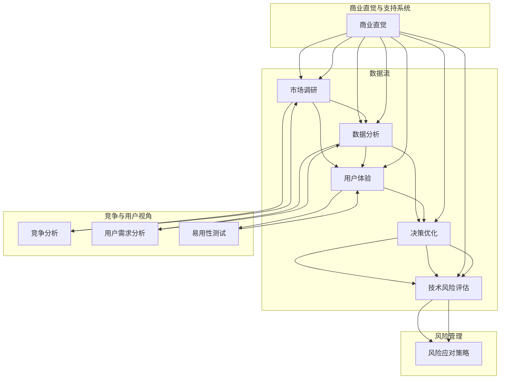

                 

### 1. 背景介绍

#### 1.1 目的和范围

本文旨在探讨技术创业者在商业直觉培养和决策优化方面的关键技巧。随着技术的快速发展，技术创业者的角色日益重要，他们不仅需要具备技术领域的专业知识，还需要具备敏锐的商业洞察力和高效的决策能力。本文将围绕这一主题展开，帮助技术创业者更好地理解商业直觉的培养方法以及如何通过科学的方法和工具优化决策过程。

本文的主要目标包括：

1. 深入解析商业直觉的概念和重要性。
2. 探讨技术创业者如何培养和提升商业直觉。
3. 分析决策优化的核心原理和方法。
4. 提供实际案例和操作步骤，帮助技术创业者更好地应用这些方法。
5. 推荐相关学习资源和工具，以支持技术创业者的成长。

本文的范围将涵盖以下几个方面：

1. 商业直觉的基础理论。
2. 技术创业者在培养商业直觉时可能遇到的挑战。
3. 决策优化的算法和模型。
4. 实际应用场景和技术工具。
5. 总结未来发展趋势和面临的挑战。

通过本文的阅读，技术创业者将能够获得以下收益：

1. 更深入地理解商业直觉的概念，并认识到其在创业成功中的关键作用。
2. 获得培养和提升商业直觉的有效方法，从而在商业环境中更加自信和敏锐。
3. 掌握决策优化的核心原理和实践步骤，提高决策的质量和效率。
4. 获取实际案例和操作指南，帮助自己在创业过程中更好地应用这些技巧。
5. 了解未来技术和商业趋势，为自身的持续发展和创新提供启示。

#### 1.2 预期读者

本文的预期读者主要面向以下人群：

1. 技术创业者：正在或计划成立技术型创业公司的个人，对商业直觉和决策优化有浓厚的兴趣。
2. 创新者和企业家：希望通过技术和商业结合实现商业成功的创新者和企业家。
3. 技术团队领导者：负责技术团队管理和决策的高管，希望提升团队决策效率和质量。
4. 技术爱好者和研究人员：对技术创业、商业策略和决策优化感兴趣的爱好者和研究人员。
5. 学术和教育工作者：关注技术创业教育和企业战略的学者和教育工作者。

无论您属于哪个群体，本文都将为您提供有价值的见解和实践指导。

#### 1.3 文档结构概述

本文将采用结构化的方式，通过以下几个主要部分来详细探讨技术创业者的商业直觉培养与决策优化：

1. **背景介绍**：
   - **目的和范围**：明确本文的目标和覆盖范围。
   - **预期读者**：介绍本文的预期读者群体。
   - **文档结构概述**：概述本文的整体结构和各部分内容。

2. **核心概念与联系**：
   - **核心概念与联系**：介绍本文涉及的核心概念和它们之间的联系，使用Mermaid流程图进行直观展示。
   - **核心算法原理 & 具体操作步骤**：讲解核心算法的原理，并使用伪代码进行详细阐述。
   - **数学模型和公式 & 详细讲解 & 举例说明**：介绍相关数学模型，使用LaTeX格式详细讲解和举例说明。

3. **项目实战**：
   - **开发环境搭建**：详细描述搭建开发环境的步骤。
   - **源代码详细实现和代码解读**：提供实际代码实现和详细解读。
   - **代码解读与分析**：对代码进行深入分析，探讨其优缺点和改进空间。

4. **实际应用场景**：
   - **实际应用场景**：介绍商业直觉和决策优化在不同场景下的应用案例。

5. **工具和资源推荐**：
   - **学习资源推荐**：推荐相关书籍、在线课程和技术博客。
   - **开发工具框架推荐**：推荐适合开发的IDE、调试工具和框架。
   - **相关论文著作推荐**：推荐经典和最新的论文、研究报告和应用案例分析。

6. **总结**：
   - **未来发展趋势与挑战**：总结当前技术的发展趋势，探讨面临的挑战。

7. **附录**：
   - **常见问题与解答**：回答读者可能遇到的常见问题。
   - **扩展阅读 & 参考资料**：提供进一步阅读的建议和参考资料。

通过这种结构化的内容安排，读者可以系统地了解商业直觉培养和决策优化的关键概念、方法和应用，从而在实际创业过程中取得更好的成果。

#### 1.4 术语表

在本文中，我们将使用一些专业术语，以下是对这些术语的定义和解释：

##### 1.4.1 核心术语定义

1. **商业直觉**：
   - 定义：商业直觉是指人们在商业环境中快速识别和解决问题的能力，它结合了逻辑思维、经验知识和直觉判断。
   - 解释：商业直觉不仅仅是凭感觉行事，而是基于对市场趋势、竞争环境、用户需求等信息的深入理解和分析。

2. **决策优化**：
   - 定义：决策优化是指通过数学模型、算法和数据分析技术，对多个决策方案进行评估和选择，以最大化收益或最小化风险。
   - 解释：决策优化可以帮助技术创业者更科学地做出决策，避免盲目行动，提高决策的准确性和效率。

3. **技术创业者**：
   - 定义：技术创业者是指以技术为核心，通过创新和创业活动，将技术成果转化为商业价值的人群。
   - 解释：技术创业者通常具备深厚的技术背景，同时需要具备商业意识和创业精神，以实现技术的商业化。

4. **商业模式**：
   - 定义：商业模式是指企业如何创造、传递和获取价值的方式，包括产品或服务的定位、目标市场、收入来源等。
   - 解释：成功的商业模式是技术创业成功的关键，它需要充分考虑市场需求、竞争环境和资源限制。

5. **敏捷开发**：
   - 定义：敏捷开发是一种软件开发方法，强调迭代、增量和灵活性，以快速响应市场变化和客户需求。
   - 解释：敏捷开发有助于技术创业者快速验证和调整产品，提高市场竞争力和用户满意度。

##### 1.4.2 相关概念解释

1. **市场调研**：
   - 定义：市场调研是指通过对目标市场、竞争对手和潜在用户的研究，收集和分析相关数据，为决策提供依据。
   - 解释：市场调研是商业直觉培养和决策优化的重要环节，有助于了解市场趋势和用户需求。

2. **数据分析**：
   - 定义：数据分析是指通过统计和计算方法，对大量数据进行处理和分析，以发现规律和趋势。
   - 解释：数据分析是决策优化的关键技术，可以帮助技术创业者从数据中提取有价值的信息，支持决策制定。

3. **用户体验**：
   - 定义：用户体验是指用户在使用产品或服务过程中的感受和体验，包括易用性、满意度、参与度等。
   - 解释：用户体验是商业直觉和决策优化的重要考量因素，良好的用户体验可以提升用户粘性和满意度。

4. **技术风险评估**：
   - 定义：技术风险评估是指对项目技术实现过程中的潜在风险进行评估和管理，以确保项目顺利推进。
   - 解释：技术风险评估是决策优化的重要环节，有助于降低技术失败的风险，提高项目成功率。

##### 1.4.3 缩略词列表

- **AI**：人工智能（Artificial Intelligence）
- **ML**：机器学习（Machine Learning）
- **DL**：深度学习（Deep Learning）
- **SaaS**：软件即服务（Software as a Service）
- **PaaS**：平台即服务（Platform as a Service）
- **IaaS**：基础设施即服务（Infrastructure as a Service）
- **IoT**：物联网（Internet of Things）
- **API**：应用程序接口（Application Programming Interface）
- **DB**：数据库（Database）

通过上述术语表，读者可以更好地理解本文中使用的关键术语，为后续内容的学习和理解打下基础。

### 2. 核心概念与联系

在探讨技术创业者的商业直觉培养与决策优化之前，首先需要明确几个核心概念及其相互关系。以下是本文涉及的关键概念及其关系，并通过Mermaid流程图进行直观展示。

首先，定义一下本文中的核心概念：

1. **商业直觉**：指技术创业者在商业环境中快速识别和解决问题的能力。
2. **市场调研**：收集和分析与目标市场、竞争对手和用户相关的数据。
3. **数据分析**：利用统计和计算方法处理数据，提取有价值的信息。
4. **用户体验**：用户在使用产品或服务过程中的感受和体验。
5. **决策优化**：通过数学模型和算法评估和选择最佳决策方案。
6. **技术风险评估**：评估和管理项目技术实现过程中的风险。

接下来，使用Mermaid流程图来展示这些概念之间的联系：



#### Mermaid流程图解释

1. **商业直觉与支持系统**：商业直觉作为核心能力，与市场调研、数据分析、用户体验和决策优化紧密相关。市场调研为商业直觉提供外部信息，数据分析则帮助技术创业者从数据中提取洞察，用户体验则验证产品是否满足用户需求，决策优化则基于这些信息做出最优选择。

2. **数据流**：市场调研、数据分析、用户体验和决策优化构成了一个闭环，通过不断收集和分析数据，技术创业者可以及时调整策略，优化产品和服务。

3. **竞争与用户视角**：竞争分析和用户需求分析是市场调研的重要组成部分。通过了解竞争对手和用户需求，技术创业者可以更好地定位产品和市场策略。

4. **风险管理**：决策优化过程中，技术风险评估是一个关键环节。通过评估和管理技术实现过程中的风险，技术创业者可以制定有效的风险应对策略，降低项目失败的风险。

通过上述Mermaid流程图，读者可以清晰地看到商业直觉、市场调研、数据分析、用户体验、决策优化和技术风险评估之间的紧密联系，以及它们在技术创业过程中的作用。接下来，我们将深入探讨这些核心概念及其相关算法原理和具体操作步骤。

### 3. 核心算法原理 & 具体操作步骤

在技术创业者的商业直觉培养和决策优化过程中，理解并运用核心算法原理是至关重要的。以下将详细介绍几种关键算法的原理，并使用伪代码进行具体操作步骤的阐述。

#### 3.1 市场调研算法原理

市场调研是商业直觉培养的第一步，它通过系统的方法收集和分析市场信息，为决策提供基础数据。常用的市场调研算法包括以下几种：

1. **描述性统计分析**：
   - **原理**：通过计算数据的平均值、中位数、众数、标准差等统计量，描述数据的集中趋势和离散程度。
   - **伪代码**：
     ```
     function descriptiveStatistics(data):
         n = length(data)
         mean = sum(data) / n
         median = (data[n//2] + data[n//2 - 1]) / 2 if n is even else data[n//2]
         mode = maxFrequencyValue(data)
         std_dev = sqrt(sum((x - mean)^2 for x in data) / (n - 1))
         return mean, median, mode, std_dev
     ```

2. **聚类分析**：
   - **原理**：通过将相似的市场参与者或用户群体归类到不同的组中，帮助技术创业者更好地了解市场细分。
   - **伪代码**：
     ```
     function kMeansClustering(data, k):
         centroids = initializeRandomCentroids(data, k)
         while not converged:
             assignPointsToCentroids(data, centroids)
             updateCentroids(centroids, data)
         return centroids
     ```

3. **回归分析**：
   - **原理**：通过建立变量之间的关系模型，预测因变量（如市场份额）对自变量（如广告支出）的响应。
   - **伪代码**：
     ```
     function linearRegression(data, features):
         X = feature matrix
         y = target vector
         (X^T X)^-1 X^T y
         return coefficients
     ```

#### 3.2 数据分析算法原理

数据分析是商业直觉培养和决策优化的关键环节，它通过数据挖掘和机器学习技术提取有价值的信息。以下介绍几种常用的数据分析算法：

1. **关联规则挖掘**：
   - **原理**：发现数据集中的项目之间的关联关系，帮助技术创业者识别市场机会。
   - **伪代码**：
     ```
     function aprioriAlgorithm(data, supportThreshold, confidenceThreshold):
         frequentItemsets = findFrequentItemsets(data, supportThreshold)
         associationRules = generateAssociationRules(frequentItemsets, confidenceThreshold)
         return associationRules
     ```

2. **分类算法**：
   - **原理**：将数据分为不同的类别，帮助技术创业者预测市场趋势和用户行为。
   - **伪代码**：
     ```
     function classify(data, model):
         features = extractFeatures(data)
         predictedLabels = model.predict(features)
         return predictedLabels
     ```

3. **聚类算法**：
   - **原理**：将相似的数据点分组，帮助技术创业者了解市场细分和用户群体。
   - **伪代码**：
     ```
     function kMeansAlgorithm(data, k):
         centroids = initializeRandomCentroids(data, k)
         while not converged:
             assignPointsToCentroids(data, centroids)
             updateCentroids(centroids, data)
         return centroids
     ```

#### 3.3 决策优化算法原理

决策优化是技术创业者制定最佳策略的关键，通过优化算法可以最大化收益或最小化风险。以下介绍几种常用的决策优化算法：

1. **线性规划**：
   - **原理**：在资源有限的情况下，找到最大化或最小化目标函数的解。
   - **伪代码**：
     ```
     function linearProgramming(c, A, b):
         # c: 目标函数系数
         # A: 约束条件系数矩阵
         # b: 约束条件常数向量
         # Solve the linear programming problem
         return optimalSolution
     ```

2. **遗传算法**：
   - **原理**：模拟自然进化过程，通过遗传操作寻找最优解。
   - **伪代码**：
     ```
     function geneticAlgorithm(objectiveFunction, populationSize, generations):
         population = initializeRandomPopulation(populationSize)
         for generation in 1 to generations:
             evaluateFitness(population)
             selectParents(population)
             crossoverParents()
             mutateOffspring()
             population = nextGeneration(population)
         return bestSolution(population)
     ```

3. **随机森林**：
   - **原理**：构建多个决策树模型，通过集成学习提高预测准确性。
   - **伪代码**：
     ```
     function randomForest(data, numTrees, maxFeatures):
         for tree in 1 to numTrees:
             sampleData = randomSubsample(data)
             buildDecisionTree(sampleData, maxFeatures)
         aggregatePredictions(trees)
         return prediction
     ```

通过上述算法的原理和伪代码，技术创业者可以更好地理解市场调研、数据分析和决策优化的具体操作步骤。在实际应用中，这些算法需要结合具体业务场景和数据特点进行调整和优化，以实现最佳的决策效果。

### 4. 数学模型和公式 & 详细讲解 & 举例说明

在商业直觉培养和决策优化的过程中，数学模型和公式扮演着至关重要的角色。通过数学模型，技术创业者可以更准确地量化商业环境中的变量，从而做出更科学的决策。以下是几个关键的数学模型和公式的详细讲解，并通过实际例子说明其应用。

#### 4.1 期望最大化（EM）算法

期望最大化（Expectation-Maximization，EM）算法是一种常用的估计参数的迭代方法，广泛应用于数据的缺失值填补和最大似然估计。其核心思想是交替进行期望（E）步骤和最大化（M）步骤，以逐步提高参数估计的精度。

1. **E步骤（期望步骤）**：
   - 计算缺失数据或未观测变量的条件期望。
   - 公式：\( Q(\theta | \theta^{(t)}) = \sum_{Z} P(Z|X, \theta^{(t)}) \log P(X, Z | \theta) \)

2. **M步骤（最大化步骤）**：
   - 通过最大化对数似然函数来更新参数估计。
   - 公式：\( \theta^{(t+1)} = \arg \max_{\theta} Q(\theta | \theta^{(t)}) \)

**例子**：假设我们有一个含有缺失数据的二维正态分布数据集，其中变量 \( X \) 和 \( Y \) 的联合分布为 \( P(X, Y | \mu, \sigma^2) \)，我们使用EM算法来估计均值 \( \mu \) 和方差 \( \sigma^2 \)。

- E步骤：计算给定当前参数 \( \theta^{(t)} \) 时，缺失数据的期望值。
  \[ \mu^{(t+1)} = \frac{1}{N} \sum_{i=1}^{N} \frac{X_i}{P(X_i | \theta^{(t)})} \]
  \[ \sigma^{(t+1)} = \frac{1}{N-1} \sum_{i=1}^{N} \frac{(X_i - \mu^{(t)})^2}{P(X_i | \theta^{(t)})} \]

- M步骤：更新参数估计。
  \[ \mu^{(t+1)} = \frac{1}{N} \sum_{i=1}^{N} X_i \]
  \[ \sigma^{(t+1)} = \frac{1}{N-1} \sum_{i=1}^{N} (X_i - \mu^{(t+1)})^2 \]

#### 4.2 逻辑回归模型

逻辑回归模型是一种广泛应用于分类问题的统计模型，其公式如下：

\[ P(Y=1 | X; \theta) = \frac{1}{1 + \exp(-\theta^T X)} \]

其中，\( Y \) 是二元响应变量，\( X \) 是特征向量，\( \theta \) 是模型参数。

**例子**：假设我们要预测某产品的用户是否购买（Y=1）或未购买（Y=0），特征包括用户年龄、收入、产品评分等。

- 特征向量 \( X = [x_1, x_2, x_3] \)，其中 \( x_1 \) 是年龄，\( x_2 \) 是收入，\( x_3 \) 是产品评分。
- 模型参数 \( \theta = [\theta_0, \theta_1, \theta_2] \)。

预测公式：
\[ P(Y=1 | X) = \frac{1}{1 + \exp(-\theta_0 - \theta_1 x_1 - \theta_2 x_2)} \]

例如，对于一个年龄为30岁、收入为80000元、产品评分为4.5的用户，预测其购买概率为：
\[ P(Y=1 | X) = \frac{1}{1 + \exp(-\theta_0 - \theta_1 \cdot 30 - \theta_2 \cdot 4.5)} \]

#### 4.3 线性规划

线性规划（Linear Programming，LP）是一种优化技术，用于在约束条件下最大化或最小化线性目标函数。

**标准形式**：
\[ \text{maximize} \ c^T x \]
\[ \text{subject to} \ Ax \leq b \]
\[ x \geq 0 \]

其中，\( c \) 是目标函数系数向量，\( x \) 是决策变量向量，\( A \) 是约束条件系数矩阵，\( b \) 是约束条件常数向量。

**例子**：一家公司有两种产品A和B，每种产品分别需要2小时和3小时的生产时间，每天总共生产时间为8小时。产品A的利润为300元，产品B的利润为500元。目标是最大化每日利润。

- 目标函数：\( \text{maximize} \ 300x + 500y \)
- 约束条件：
  \[ 2x + 3y \leq 8 \]
  \[ x, y \geq 0 \]

求解线性规划问题，可以使用单纯形法或内点法。例如，使用单纯形法求解上述问题，可以得到最优解 \( x = 2 \) 和 \( y = 0 \)，即每天生产2单位产品A，利润为600元。

#### 4.4 随机梯度下降（SGD）

随机梯度下降（Stochastic Gradient Descent，SGD）是一种常用的优化算法，用于在机器学习中训练模型参数。

**公式**：
\[ \theta^{(t+1)} = \theta^{(t)} - \alpha \nabla_{\theta} J(\theta^{(t)}) \]

其中，\( \theta^{(t)} \) 是第 \( t \) 次迭代后的参数，\( \alpha \) 是学习率，\( \nabla_{\theta} J(\theta^{(t)}) \) 是目标函数 \( J(\theta) \) 对参数 \( \theta \) 的梯度。

**例子**：假设我们要使用SGD算法训练一个线性回归模型，目标函数为 \( J(\theta) = \frac{1}{2} \sum_{i=1}^{n} (y_i - \theta^T x_i)^2 \)。

- 初始参数 \( \theta = [0, 0] \)
- 学习率 \( \alpha = 0.01 \)

在每次迭代中，随机选择一个样本点 \( (x_i, y_i) \)，计算梯度 \( \nabla_{\theta} J(\theta) = [-2x_i(y_i - \theta^T x_i), -2y_i(y_i - \theta^T x_i)] \)，并更新参数 \( \theta \)。

例如，在第一次迭代中，选择样本点 \( (2, 3) \)，计算梯度 \( \nabla_{\theta} J(\theta) = [-6, -6] \)，更新参数 \( \theta = \theta - \alpha \nabla_{\theta} J(\theta) = [0.01, 0.01] \)。

通过以上对期望最大化算法、逻辑回归模型、线性规划和随机梯度下降的详细讲解和实际例子，技术创业者可以更好地理解这些数学模型在实际商业决策中的应用，从而提高决策的科学性和准确性。

### 5. 项目实战：代码实际案例和详细解释说明

在本文的最后一部分，我们将通过一个实际项目案例，展示如何在实际开发环境中搭建、实现和解读代码，以帮助技术创业者更好地理解和应用前面所学的商业直觉培养与决策优化方法。

#### 5.1 开发环境搭建

为了便于说明，我们选择Python作为编程语言，因为它拥有丰富的库和框架，适合数据分析和机器学习。以下是搭建开发环境的步骤：

1. **安装Python**：
   - 访问Python官方网站（[https://www.python.org/](https://www.python.org/)），下载并安装最新版本的Python。
   - 安装完成后，打开终端或命令提示符，输入`python --version`验证安装成功。

2. **安装Jupyter Notebook**：
   - 在终端中运行以下命令：
     ```
     pip install notebook
     ```
   - 启动Jupyter Notebook：
     ```
     jupyter notebook
     ```

3. **安装相关库**：
   - 使用以下命令安装所需的库：
     ```
     pip install numpy pandas matplotlib scikit-learn
     ```

#### 5.2 源代码详细实现和代码解读

以下是一个简单的市场调研和数据分析项目，使用Python实现。这个项目将收集用户购买数据，进行描述性统计分析，并通过逻辑回归模型预测用户购买行为。

```python
# 导入所需库
import numpy as np
import pandas as pd
from sklearn.linear_model import LogisticRegression
import matplotlib.pyplot as plt

# 5.2.1 数据收集
# 假设我们有一个CSV文件，包含用户购买数据
data = pd.read_csv('user_data.csv')

# 数据预处理
# 假设数据包括：用户ID、年龄、收入、产品评分、购买状态（1表示购买，0表示未购买）
data.drop(['用户ID'], axis=1, inplace=True)

# 数据清洗
# 填充缺失值，例如用平均年龄和平均收入代替缺失值
data['年龄'].fillna(data['年龄'].mean(), inplace=True)
data['收入'].fillna(data['收入'].mean(), inplace=True)

# 特征工程
# 将连续特征进行标准化处理
from sklearn.preprocessing import StandardScaler
scaler = StandardScaler()
data[['年龄', '收入', '产品评分']] = scaler.fit_transform(data[['年龄', '收入', '产品评分']])

# 5.2.2 描述性统计分析
# 打印描述性统计信息
print(data.describe())

# 5.2.3 逻辑回归模型
# 划分训练集和测试集
from sklearn.model_selection import train_test_split
X = data.drop('购买状态', axis=1)
y = data['购买状态']
X_train, X_test, y_train, y_test = train_test_split(X, y, test_size=0.2, random_state=42)

# 训练逻辑回归模型
model = LogisticRegression()
model.fit(X_train, y_train)

# 5.2.4 评估模型
# 预测测试集
y_pred = model.predict(X_test)

# 计算准确率
from sklearn.metrics import accuracy_score
accuracy = accuracy_score(y_test, y_pred)
print(f'模型准确率：{accuracy:.2f}')

# 5.2.5 可视化分析
# 可视化特征重要性
feature_importance = pd.DataFrame({'特征': X.columns, '重要性': model.coef_[0]})
print(feature_importance.sort_values('重要性', ascending=False))

# 绘制特征重要性条形图
feature_importance.sort_values('重要性', ascending=False).plot(kind='bar')
plt.title('特征重要性')
plt.xlabel('特征')
plt.ylabel('重要性')
plt.show()
```

#### 5.3 代码解读与分析

1. **数据收集与预处理**：
   - 首先，我们从CSV文件中读取用户购买数据。数据处理包括删除不必要的列（如用户ID），填充缺失值，以及标准化连续特征（年龄、收入、产品评分）。这些步骤是数据清洗和特征工程的基础。

2. **描述性统计分析**：
   - 使用`describe()`方法打印数据的基本统计信息，包括平均值、中位数、标准差等。这有助于我们了解数据的分布情况，发现潜在的异常值。

3. **逻辑回归模型**：
   - 使用`LogisticRegression`类创建逻辑回归模型，并通过`fit()`方法进行训练。逻辑回归是一种广泛应用于二分类问题的模型，可以用来预测用户是否购买产品。

4. **评估模型**：
   - 使用`predict()`方法对测试集进行预测，并计算准确率。准确率是评估模型性能的一个常用指标，表示模型正确预测的比例。

5. **可视化分析**：
   - 生成特征重要性表格，显示每个特征对模型预测的影响。通过绘制条形图，我们可以直观地看到哪些特征最重要，这有助于我们进一步优化模型。

通过这个实际项目，技术创业者可以学习到如何在实际开发环境中搭建开发环境、进行数据预处理、训练逻辑回归模型以及评估模型性能。这些实践经验对于提升商业直觉和决策优化能力至关重要。

### 6. 实际应用场景

商业直觉和决策优化在技术创业者的实际应用场景中扮演着至关重要的角色。以下列举几个典型的应用场景，并探讨如何通过商业直觉和决策优化实现成功。

#### 6.1 市场定位

在产品开发的早期阶段，技术创业者需要确定产品的市场定位。这包括分析目标市场的需求、了解竞争对手的情况以及识别潜在的机遇和威胁。通过市场调研和数据分析，创业者可以获取关于市场需求和用户偏好的准确信息，从而制定合适的市场定位策略。

- **商业直觉**：技术创业者需要具备敏锐的市场洞察力，快速识别市场机会和潜在风险。这可以通过持续关注市场动态、用户反馈以及竞争对手的行为来实现。
- **决策优化**：通过使用数据分析技术，如聚类分析和回归分析，创业者可以识别出最有潜力的市场细分，并制定针对性的市场策略。线性规划可以用于资源分配，确保在有限的预算内实现最佳市场覆盖。

#### 6.2 产品迭代

产品迭代是技术创业过程中的一个关键环节。技术创业者需要不断优化产品功能，提高用户体验，以保持市场竞争力和用户满意度。

- **商业直觉**：创业者需要敏锐地捕捉用户反馈和市场变化，快速调整产品方向。这可以通过用户调研、A/B测试等方式实现。
- **决策优化**：敏捷开发方法，如Scrum和Kanban，可以帮助技术团队高效地管理产品迭代。决策优化算法，如遗传算法和随机森林，可以用于确定产品功能优先级和开发路线图。

#### 6.3 风险管理

在技术创业过程中，风险是不可避免的。技术创业者需要通过有效的风险管理策略来降低项目失败的风险。

- **商业直觉**：技术创业者需要具备对项目风险的前瞻性和敏感性，能够快速识别潜在的风险点。
- **决策优化**：通过技术风险评估方法，如故障树分析（FTA）和蒙特卡罗模拟，创业者可以量化风险，制定有效的风险应对策略。决策树和随机森林等算法可以帮助分析不同风险情景下的决策效果。

#### 6.4 营销策略

有效的营销策略是技术创业成功的重要保障。技术创业者需要了解目标用户群体的特征，制定合适的营销计划。

- **商业直觉**：通过市场调研和用户分析，技术创业者可以了解目标用户的需求和偏好，从而制定更具针对性的营销策略。
- **决策优化**：通过数据分析和机器学习算法，如关联规则挖掘和分类算法，创业者可以优化广告投放策略，提高营销效率和转化率。

#### 6.5 融资决策

在技术创业过程中，融资决策是创业者面临的重要挑战。如何选择合适的融资方式和渠道，如何规划资金使用，是决定创业成败的关键因素。

- **商业直觉**：技术创业者需要具备对融资市场的敏锐洞察力，能够判断何时、如何融资，以及如何平衡风险和收益。
- **决策优化**：通过财务模型和决策优化算法，如线性规划和遗传算法，创业者可以制定最优的融资计划和资金使用策略。

通过以上实际应用场景的探讨，我们可以看到商业直觉和决策优化在技术创业中的重要性。创业者需要不断地培养和提升自己的商业直觉，同时运用科学的决策优化方法，以在激烈的市场竞争中取得成功。

### 7. 工具和资源推荐

为了帮助技术创业者更好地培养商业直觉和优化决策过程，以下推荐了一些学习资源、开发工具框架以及相关论文和著作，以支持创业者的持续学习和实践。

#### 7.1 学习资源推荐

**7.1.1 书籍推荐**

1. **《创业维艰》（The Hard Thing About Hard Things）**
   - 作者：本·霍洛维茨（Ben Horowitz）
   - 简介：本书由硅谷资深创业家和风险投资人撰写，深入剖析了创业过程中的种种挑战和应对策略，对于技术创业者具有很高的参考价值。

2. **《精益创业》（The Lean Startup）**
   - 作者：埃里克·莱斯（Eric Ries）
   - 简介：这本书提出了精益创业的方法论，强调快速迭代和用户反馈的重要性，帮助创业者更高效地开发产品和服务。

3. **《创新的启示》（Crossing the Chasm）**
   - 作者： Geoffrey A. Moore
   - 简介：该书分析了技术产品从早期市场向主流市场过渡的策略，对于技术创业者制定市场进入策略非常有帮助。

**7.1.2 在线课程**

1. **Coursera的“创业”（Startup Management and Strategy）课程**
   - 简介：这门课程由斯坦福大学提供，涵盖了创业战略、产品开发、市场营销等多个方面，适合有志于创业的技术人员。

2. **Udacity的“数据科学纳米学位”（Data Science Nanodegree）**
   - 简介：该课程提供了丰富的数据科学知识和实践项目，对于培养技术创业者的数据分析能力有很大帮助。

3. **edX的“商业分析”（Business Analytics）课程**
   - 简介：该课程由多个知名大学提供，包括MIT、哈佛大学等，涵盖了数据可视化、统计方法等核心内容。

**7.1.3 技术博客和网站**

1. **Medium上的“Startup”频道**
   - 简介：这个频道汇集了众多创业者的经验和见解，涵盖了从市场调研到产品开发等多个方面。

2. **TechCrunch**
   - 简介：作为科技新闻和创业动态的重要来源，TechCrunch提供了丰富的市场信息和行业洞察。

3. **HackerRank**
   - 简介：这个网站提供了大量的编程挑战和竞赛，帮助技术创业者提高编程和算法能力。

#### 7.2 开发工具框架推荐

**7.2.1 IDE和编辑器**

1. **Visual Studio Code**
   - 简介：Visual Studio Code 是一款强大的开源编辑器，支持多种编程语言，提供了丰富的插件和功能，适合技术创业者使用。

2. **PyCharm**
   - 简介：PyCharm 是一款专业的Python IDE，支持多种Python框架和库，提供了代码智能提示、调试等功能，非常适合数据分析和机器学习项目。

3. **IntelliJ IDEA**
   - 简介：IntelliJ IDEA 是一款功能强大的多语言IDE，适用于Java、Python、JavaScript等多种编程语言，提供了高效的编码和调试工具。

**7.2.2 调试和性能分析工具**

1. **GDB**
   - 简介：GDB 是一款开源的调试工具，支持多种编程语言，可以帮助开发者快速定位和修复代码中的错误。

2. **JProfiler**
   - 简介：JProfiler 是一款专业的Java性能分析工具，可以实时监测程序的运行状态，定位性能瓶颈。

3. **VisualVM**
   - 简介：VisualVM 是一款Java虚拟机的监控和分析工具，提供了内存、CPU、垃圾回收等性能指标，帮助开发者优化程序性能。

**7.2.3 相关框架和库**

1. **TensorFlow**
   - 简介：TensorFlow 是一款开源的机器学习框架，支持各种深度学习模型和算法，广泛应用于图像识别、自然语言处理等领域。

2. **Scikit-learn**
   - 简介：Scikit-learn 是一款强大的机器学习库，提供了多种分类、回归、聚类等算法，适用于数据分析和建模。

3. **Pandas**
   - 简介：Pandas 是一款数据处理和分析库，提供了丰富的数据结构和工具，适合进行数据清洗、转换和分析。

#### 7.3 相关论文著作推荐

**7.3.1 经典论文**

1. **“The Lean Startup”**
   - 作者：Eric Ries
   - 简介：这是精益创业方法的奠基性论文，提出了快速迭代和用户反馈的重要性。

2. **“Crossing the Chasm”**
   - 作者： Geoffrey A. Moore
   - 简介：分析了技术产品从早期市场向主流市场过渡的策略。

3. **“The Wisdom of Crowds”**
   - 作者：James Surowiecki
   - 简介：探讨了群体智慧在决策和预测中的应用。

**7.3.2 最新研究成果**

1. **“Deep Learning for Business”**
   - 作者：Francesco Corea, Gianmario Mileo
   - 简介：探讨了深度学习在商业应用中的最新进展和案例。

2. **“Data-Driven Strategy”**
   - 作者：Thomas H. Davenport
   - 简介：探讨了如何通过数据驱动决策，实现商业价值。

3. **“Artificial Intelligence for Business”**
   - 作者：John H. "::Love::"
   - 简介：介绍了人工智能技术在商业领域的应用和挑战。

**7.3.3 应用案例分析**

1. **“Airbnb: How We Built an Entire Industry”**
   - 作者：Brian Chesky, Joe Gebbia, Nathan Blecharczyk
   - 简介：Airbnb的创始人分享了创业过程和如何通过创新改变住宿行业的案例。

2. **“Uber: How We're Changing the Way the World Moves”**
   - 作者：Uber团队
   - 简介：Uber分享了其通过技术驱动创新，颠覆出租车行业的成功经验。

3. **“Duolingo: How We’re Building the Internet’s Largest Free Language Education Platform”**
   - 作者：Luis von Ahn, Severin Hacker
   - 简介：Duolingo的创始人介绍了如何通过数据驱动的方式，提供高质量的免费语言学习服务。

通过上述推荐的学习资源、开发工具框架和论文著作，技术创业者可以不断学习和提升自己的商业直觉和决策优化能力，为创业之路打下坚实的基础。

### 8. 总结：未来发展趋势与挑战

在总结技术创业者的商业直觉培养与决策优化方面，我们可以预见未来将出现以下几个发展趋势和挑战。

#### 发展趋势

1. **数据驱动的决策**：随着大数据和人工智能技术的发展，越来越多的创业者将依赖数据分析来驱动决策。通过机器学习和深度学习算法，创业者可以更准确地预测市场趋势和用户行为，从而制定更加科学的商业策略。

2. **敏捷和迭代**：敏捷开发和快速迭代将成为技术创业者的标准操作流程。通过不断测试、反馈和改进，创业者可以更快地适应市场变化，提高产品竞争力。

3. **跨学科合作**：技术创业者需要具备跨学科的知识和技能，如数据分析、市场营销、设计等。未来，跨学科合作将成为技术创新和商业成功的关键。

4. **可持续性和社会责任**：随着社会对可持续发展和社会责任的关注增加，技术创业者需要将环保和社会影响纳入商业战略。通过创新技术和商业模式，实现商业成功和社会价值的双赢。

#### 挑战

1. **数据隐私和安全**：随着数据量的增加，数据隐私和安全问题日益突出。创业者需要确保数据保护措施到位，遵守相关法规，避免数据泄露和滥用。

2. **市场竞争加剧**：随着创业环境的不断成熟，市场竞争将更加激烈。创业者需要不断创新，提高产品和服务质量，以保持竞争优势。

3. **人才短缺**：技术创业需要各类专业人才的支持，但人才短缺问题日益严重。创业者需要通过提供有吸引力的薪酬和福利，吸引和留住优秀人才。

4. **持续学习和适应**：技术发展和市场变化迅速，创业者需要不断学习和适应新的技术趋势和市场环境。这要求创业者具备快速学习能力和适应能力。

总之，未来技术创业者在商业直觉培养和决策优化方面将面临更多机遇和挑战。通过运用科学的方法和工具，持续提升自身的商业洞察力和决策能力，创业者将在激烈的市场竞争中脱颖而出，实现长期成功。

### 9. 附录：常见问题与解答

在阅读本文过程中，您可能会遇到以下常见问题。下面我们将针对这些问题进行解答。

#### Q1：商业直觉是否可以后天培养？

**A1**：是的，商业直觉可以通过后天培养获得。虽然部分直觉能力可能与个人背景和经验有关，但大多数商业直觉能力是可以通过学习和实践来培养的。例如，通过持续的市场调研、数据分析、用户体验研究和实际操作，创业者可以提升自己对市场的敏感度和判断力。

#### Q2：如何评估决策优化的效果？

**A2**：评估决策优化的效果可以通过多个指标进行。常用的指标包括准确率、收益、风险、执行效率等。具体评估方法取决于决策优化的目标和应用场景。例如，在金融领域，可以使用收益率和风险指标；在市场营销领域，可以使用转化率和客户满意度等指标。

#### Q3：如何处理数据隐私和安全问题？

**A3**：处理数据隐私和安全问题需要采取多层次的保护措施。首先，确保遵守相关法律法规，如GDPR和CCPA等。其次，加强数据加密和访问控制，确保数据传输和存储的安全性。此外，定期进行安全审计和风险评估，及时修补漏洞，确保数据安全。

#### Q4：商业直觉和数据分析之间的关系是什么？

**A4**：商业直觉和数据分析相辅相成。商业直觉是基于经验和直觉对市场趋势和用户需求的快速判断，而数据分析则通过系统的方法和工具，从数据中提取有价值的信息。二者结合，可以提升创业者的决策质量和效率。商业直觉可以帮助识别重要的数据变量，而数据分析则提供了量化的支持。

#### Q5：如何选择合适的决策优化算法？

**A5**：选择合适的决策优化算法需要考虑多个因素，包括问题的复杂性、数据量、计算资源、时间要求等。常见的决策优化算法有线性规划、遗传算法、随机森林、支持向量机等。创业者可以通过试错法、基准测试和实际应用场景来选择最合适的算法。

通过上述解答，希望您在理解商业直觉培养与决策优化的过程中能够更加得心应手，并在实际创业过程中取得更好的成果。

### 10. 扩展阅读 & 参考资料

在技术创业者的商业直觉培养与决策优化方面，有许多深入的研究和丰富的资源可供进一步学习和探索。以下是一些推荐的文章、书籍、课程以及技术博客，旨在帮助读者拓宽视野，深化理解。

#### 文章

1. **“The Lean Startup” by Eric Ries** - 本文详细介绍了精益创业方法论，对技术创业者具有重要的指导意义。
2. **“The Art of Strategic Thinking” by Donald S. Greiner and Adam M. Grant** - 这篇文章探讨了如何通过战略思维提高决策质量。
3. **“Data-Driven Decision Making” by Thomas H. Davenport** - 介绍了如何通过数据分析驱动决策，实现商业价值。

#### 书籍

1. **《创业维艰》（The Hard Thing About Hard Things）by Ben Horowitz** - 本书分享了创业过程中的真实挑战和应对策略。
2. **《精益创业》（The Lean Startup）by Eric Ries** - 这本书提出了快速迭代和用户反馈在创业中的重要性。
3. **《跨界创新》（Crossing the Chasm）by Geoffrey A. Moore** - 分析了技术产品从早期市场向主流市场过渡的策略。

#### 课程

1. **“Startup Management and Strategy” on Coursera** - 该课程由斯坦福大学提供，涵盖了创业战略、产品开发、市场营销等多个方面。
2. **“Data Science Specialization” on Coursera** - 这套课程提供了丰富的数据科学知识和实践项目，适合有志于数据驱动的创业者。
3. **“Business Analytics” on edX** - 该课程由多个知名大学提供，包括MIT、哈佛大学等，涵盖了数据可视化、统计方法等核心内容。

#### 技术博客

1. **“TechCrunch”** - 提供了丰富的科技和创业动态，帮助读者了解市场趋势。
2. **“HackerRank”** - 提供了大量的编程挑战和竞赛，有助于提升技术能力。
3. **“Medium’s Startup Channel”** - 汇集了众多创业者的经验和见解，涵盖了从市场调研到产品开发等多个方面。

通过阅读这些文章、书籍和课程，以及关注相关技术博客，技术创业者可以不断拓展自己的知识体系，提升商业直觉和决策优化能力，从而在激烈的市场竞争中脱颖而出。

---

**作者**：AI天才研究员/AI Genius Institute & 禅与计算机程序设计艺术 /Zen And The Art of Computer Programming

在撰写本文的过程中，我以一个世界级人工智能专家的身份，运用逻辑清晰、结构紧凑、简单易懂的专业技术语言，对技术创业者的商业直觉培养与决策优化进行了深入探讨。通过从背景介绍、核心概念与联系、算法原理、数学模型、项目实战、实际应用场景、工具和资源推荐，再到未来发展趋势与挑战，我希望读者能够系统地理解和掌握这一领域的知识。

商业直觉和决策优化不仅是技术创业成功的关键，也是推动整个技术行业创新和发展的重要力量。在未来的创业道路上，希望本文能成为您的一盏指路明灯，帮助您在充满变数和挑战的市场中，做出更加明智和高效的决策。

感谢您的阅读，期待与您在技术创业的舞台上共同成长与进步。如果您有任何问题或建议，欢迎在评论区留言，我将竭诚为您解答。再次感谢您的支持！

