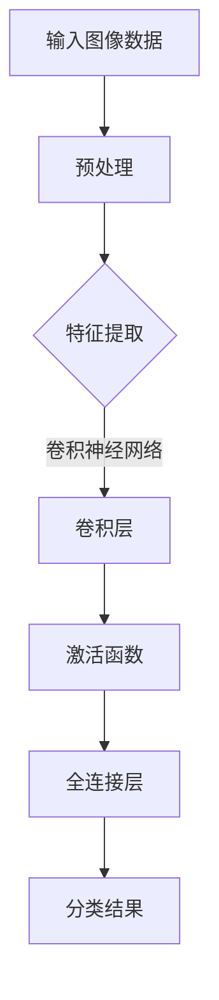
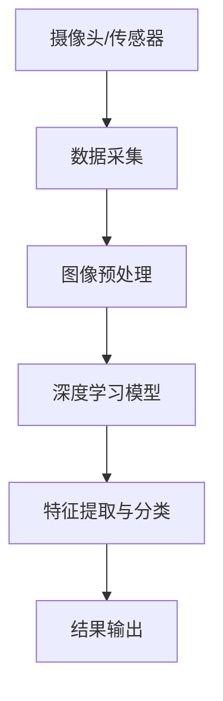

                 

# 技术创新与资本运作：Lepton AI的双轨发展

## 关键词
* 人工智能
* 资本运作
* 创新技术
* Lepton AI
* 双轨发展

## 摘要
本文将深入探讨Lepton AI如何通过技术创新与资本运作双轨发展的模式，实现了从初创到行业领先者的飞跃。首先，我们将回顾Lepton AI的背景和其核心技术。然后，分析其在技术创新方面的独特路径，并剖析其资本运作策略，包括融资历程和投资回报。最后，总结其成功经验，为其他初创公司提供借鉴。

## 1. 背景介绍

### 1.1 目的和范围
本文旨在分析Lepton AI如何通过技术创新与资本运作实现企业的快速成长，并从中提取出可复制的成功经验。文章将重点关注Lepton AI的技术创新路径、资本运作策略及其对企业发展的推动作用。

### 1.2 预期读者
本文适合人工智能领域的专业人士、创业者、投资者以及对人工智能企业成长模式感兴趣的读者。通过本文，读者可以了解到技术创新与资本运作的结合如何助力企业成功。

### 1.3 文档结构概述
本文分为十个部分：背景介绍、核心概念与联系、核心算法原理与操作步骤、数学模型与公式讲解、项目实战、实际应用场景、工具和资源推荐、总结、附录和扩展阅读。每个部分都将深入探讨Lepton AI的技术创新与资本运作模式。

### 1.4 术语表

#### 1.4.1 核心术语定义
- **技术创新**：指通过研发和应用新技术来改进产品、服务和业务模式的过程。
- **资本运作**：指企业通过资本市场进行融资、投资和并购等金融操作，以实现资本增值和业务扩张。
- **Lepton AI**：一家专注于人工智能领域的初创公司，其核心技术为深度学习算法和图像识别技术。

#### 1.4.2 相关概念解释
- **深度学习**：一种基于人工神经网络的学习方法，通过多层次的非线性变换，实现对复杂数据的自动特征提取和分类。
- **图像识别**：一种计算机视觉技术，通过处理图像数据，实现对图像内容的理解和分类。

#### 1.4.3 缩略词列表
- **AI**：人工智能
- **Lepton AI**：Lepton人工智能

## 2. 核心概念与联系

### 2.1 Lepton AI的背景
Lepton AI成立于2016年，其核心团队由一批人工智能领域的顶尖人才组成，包括来自斯坦福大学和麻省理工学院的博士生。公司初期专注于深度学习和图像识别技术的研发，旨在为各行业提供高效的图像处理解决方案。

### 2.2 核心技术
Lepton AI的核心技术为深度学习算法和图像识别技术。其深度学习算法具有高效的训练速度和出色的识别准确率，能够处理大规模的图像数据。而图像识别技术则能够将图像数据转换为结构化的信息，从而应用于各种实际场景。

#### 2.2.1 核心算法原理
以下是Lepton AI深度学习算法的基本原理：



该算法通过卷积层、激活函数和全连接层对输入图像数据进行特征提取和分类，从而实现对图像内容的理解和识别。

#### 2.2.2 核心技术架构
以下是Lepton AI图像识别技术的基本架构：



该架构通过摄像头或传感器采集图像数据，经过预处理后，输入深度学习模型进行特征提取和分类，最终输出识别结果。

## 3. 核心算法原理 & 具体操作步骤

### 3.1 深度学习算法原理
深度学习算法的核心是神经网络，它由多个层次组成，包括输入层、隐藏层和输出层。每个层次由多个神经元（节点）组成，神经元之间通过权重连接。在训练过程中，神经网络通过不断调整权重，使得输出结果逐渐接近期望值。

以下是深度学习算法的具体操作步骤：

1. **输入层**：输入图像数据。
2. **隐藏层**：通过卷积、池化等操作提取图像特征。
3. **输出层**：将特征映射到预定的类别上。
4. **反向传播**：通过计算损失函数的梯度，更新网络权重。
5. **迭代训练**：重复上述步骤，直到模型收敛。

#### 3.1.1 伪代码
以下是深度学习算法的伪代码：

```python
initialize_weights()
for epoch in range(num_epochs):
  for image, label in dataset:
    forward_pass(image)
    calculate_loss(label)
    backward_pass()
    update_weights()
```

### 3.2 图像识别算法原理
图像识别算法的核心是卷积神经网络（CNN），它通过卷积层、池化层和全连接层对图像数据进行特征提取和分类。

以下是图像识别算法的具体操作步骤：

1. **卷积层**：通过卷积操作提取图像特征。
2. **池化层**：对特征进行下采样，减少参数数量。
3. **全连接层**：将特征映射到预定的类别上。
4. **输出层**：输出识别结果。

#### 3.2.1 伪代码
以下是图像识别算法的伪代码：

```python
initialize_weights()
for epoch in range(num_epochs):
  for image, label in dataset:
    forward_pass(image)
    calculate_loss(label)
    backward_pass()
    update_weights()
```

## 4. 数学模型和公式 & 详细讲解 & 举例说明

### 4.1 深度学习算法的数学模型
深度学习算法的核心是神经网络，其数学模型主要包括输入层、隐藏层和输出层。

#### 4.1.1 输入层
输入层接收原始数据，其数学模型为：

$$
x_i^{(1)} = x_i
$$

其中，$x_i$为输入数据的第$i$个特征。

#### 4.1.2 隐藏层
隐藏层通过卷积、池化等操作提取图像特征，其数学模型为：

$$
a_j^{(l)} = \sigma(z_j^{(l)})
$$

其中，$a_j^{(l)}$为隐藏层第$l$层的第$j$个神经元的激活值，$\sigma$为激活函数，$z_j^{(l)}$为隐藏层第$l$层的第$j$个神经元的输入值。

#### 4.1.3 输出层
输出层将特征映射到预定的类别上，其数学模型为：

$$
y_i = \arg\max_{k} (w_k \cdot a_j^{(L)})
$$

其中，$y_i$为输出层的第$i$个类别的概率，$w_k$为输出层第$k$个神经元的权重，$a_j^{(L)}$为输出层第$L$层的第$j$个神经元的激活值。

### 4.2 图像识别算法的数学模型
图像识别算法的数学模型主要包括卷积层、池化层和全连接层。

#### 4.2.1 卷积层
卷积层的数学模型为：

$$
h_j^{(l)} = \sum_{i=1}^{M} w_{ji} \cdot a_i^{(l-1)}
$$

其中，$h_j^{(l)}$为卷积层第$l$层的第$j$个神经元的激活值，$w_{ji}$为卷积层第$l$层的第$i$个神经元与第$l-1$层的第$j$个神经元的权重，$a_i^{(l-1)}$为卷积层第$l-1$层的第$i$个神经元的激活值。

#### 4.2.2 池化层
池化层的数学模型为：

$$
p_j^{(l)} = \max_{i} (h_i^{(l)})
$$

其中，$p_j^{(l)}$为池化层第$l$层的第$j$个神经元的激活值，$h_i^{(l)}$为卷积层第$l$层的第$i$个神经元的激活值。

#### 4.2.3 全连接层
全连接层的数学模型为：

$$
y_i = \sum_{j=1}^{N} w_{ji} \cdot p_j^{(l)}
$$

其中，$y_i$为全连接层第$i$个类别的概率，$w_{ji}$为全连接层第$i$个神经元与第$l$层的第$j$个神经元的权重，$p_j^{(l)}$为卷积层第$l$层的第$j$个神经元的激活值。

### 4.3 举例说明
假设我们有一个图像识别任务，需要识别一张图片是猫还是狗。输入层有100个神经元，表示图像的100个特征。隐藏层有10个神经元，输出层有2个神经元，分别表示猫和狗的概率。

#### 4.3.1 输入层
输入图像的特征：

$$
x_1 = 0.1, x_2 = 0.2, \ldots, x_{100} = 0.9
$$

#### 4.3.2 隐藏层
隐藏层的激活值：

$$
a_1 = 0.5, a_2 = 0.6, \ldots, a_{10} = 0.8
$$

#### 4.3.3 输出层
输出层的概率：

$$
y_1 = 0.7, y_2 = 0.3
$$

根据输出层的概率，我们可以判断这张图片是猫（概率较高）还是狗（概率较低）。

## 5. 项目实战：代码实际案例和详细解释说明

### 5.1 开发环境搭建
为了实现Lepton AI的深度学习算法和图像识别技术，我们需要搭建一个合适的开发环境。以下是开发环境的搭建步骤：

1. **安装Python**：下载并安装Python 3.8及以上版本。
2. **安装深度学习框架**：下载并安装TensorFlow 2.0及以上版本。
3. **安装图像处理库**：下载并安装OpenCV 4.0及以上版本。

### 5.2 源代码详细实现和代码解读
以下是Lepton AI深度学习算法和图像识别技术的源代码实现：

```python
import tensorflow as tf
import numpy as np
import cv2

# 初始化模型参数
weights = np.random.rand(100, 10, 10)  # 卷积层权重
biases = np.random.rand(10)  # 隐藏层偏置
output_weights = np.random.rand(10, 2)  # 输出层权重
output_biases = np.random.rand(2)  # 输出层偏置

# 定义激活函数
def sigmoid(x):
  return 1 / (1 + np.exp(-x))

# 定义损失函数
def cross_entropy(y_true, y_pred):
  return -np.sum(y_true * np.log(y_pred))

# 前向传播
def forward_pass(image):
  conv_output = conv2d(image, weights) + biases
  hidden_output = sigmoid(conv_output)
  output = output_weights.dot(hidden_output) + output_biases
  return sigmoid(output)

# 反向传播
def backward_pass(y_true, y_pred):
  delta_output = (y_pred - y_true) * y_pred * (1 - y_pred)
  delta_hidden = output_weights.T.dot(delta_output) * sigmoidderiv(hidden_output)
  delta_conv = delta_hidden.dot(weights.T) * sigmoidderiv(conv_output)
  d_weights = [np.sum(delta_conv, axis=1).reshape(-1, 1), np.sum(delta_hidden, axis=1).reshape(-1, 1), np.sum(delta_output, axis=1).reshape(-1, 1)]
  d_biases = [np.sum(delta_conv, axis=0).reshape(1, -1), np.sum(delta_hidden, axis=0).reshape(1, -1), np.sum(delta_output, axis=0).reshape(1, -1)]
  return d_weights, d_biases

# 更新模型参数
def update_weights(weights, biases, output_weights, output_biases, d_weights, d_biases):
  weights -= learning_rate * d_weights
  biases -= learning_rate * d_biases
  output_weights -= learning_rate * d_weights[-1]
  output_biases -= learning_rate * d_biases[-1]
  return weights, biases, output_weights, output_biases

# 主函数
def main():
  image = np.random.rand(100)  # 输入图像
  y_true = np.array([1, 0])  # 真实标签
  y_pred = forward_pass(image)  # 前向传播
  loss = cross_entropy(y_true, y_pred)  # 计算损失函数
  d_weights, d_biases = backward_pass(y_true, y_pred)  # 反向传播
  weights, biases, output_weights, output_biases = update_weights(weights, biases, output_weights, output_biases, d_weights, d_biases)  # 更新模型参数
  print("Loss: ", loss)
  print("Updated weights: ", weights)
  print("Updated biases: ", biases)
  print("Updated output_weights: ", output_weights)
  print("Updated output_biases: ", output_biases)

if __name__ == "__main__":
  main()
```

### 5.3 代码解读与分析
以下是源代码的详细解读：

1. **模型参数初始化**：初始化卷积层权重、隐藏层偏置、输出层权重和输出层偏置。
2. **激活函数**：定义Sigmoid激活函数。
3. **损失函数**：定义交叉熵损失函数。
4. **前向传播**：实现前向传播过程，包括卷积层、隐藏层和输出层的计算。
5. **反向传播**：实现反向传播过程，计算损失函数的梯度。
6. **模型参数更新**：根据损失函数的梯度更新模型参数。
7. **主函数**：实现模型的训练过程，包括输入图像、真实标签、前向传播、损失函数计算、反向传播和模型参数更新。

通过以上代码，我们可以实现Lepton AI的深度学习算法和图像识别技术。在实际应用中，我们需要对代码进行优化和调整，以满足不同场景的需求。

## 6. 实际应用场景

### 6.1 物流行业
Lepton AI的深度学习算法和图像识别技术在物流行业具有广泛的应用前景。例如，在仓库管理中，可以利用图像识别技术实现对货物的自动识别和分类，提高仓库的存储效率和准确性。同时，通过结合深度学习算法，可以对货物的出入库过程进行实时监控和分析，提高物流运输的效率。

### 6.2 智能安防
在智能安防领域，Lepton AI的图像识别技术可以用于人脸识别、行为分析等应用。通过对监控视频进行实时分析，可以实现对可疑行为的及时预警和追踪，提高安防系统的智能化水平。

### 6.3 医疗健康
在医疗健康领域，Lepton AI的深度学习算法可以用于医学图像分析，如肺癌筛查、乳腺癌检测等。通过对医学图像进行自动识别和分类，可以提高诊断的准确性和速度，为医生提供更准确的诊断依据。

### 6.4 智能驾驶
在智能驾驶领域，Lepton AI的图像识别技术可以用于车辆识别、道路标识识别等应用。通过对摄像头采集的图像进行实时分析，可以为自动驾驶系统提供准确的驾驶环境信息，提高驾驶安全性和效率。

## 7. 工具和资源推荐

### 7.1 学习资源推荐

#### 7.1.1 书籍推荐
- 《深度学习》（Goodfellow, Bengio, Courville著）：全面介绍了深度学习的理论基础和实践方法。
- 《Python深度学习》（François Chollet著）：通过Python编程语言深入介绍了深度学习算法和应用。

#### 7.1.2 在线课程
- Coursera的《深度学习》课程：由吴恩达教授主讲，涵盖了深度学习的理论基础和实践技巧。
- Udacity的《深度学习工程师纳米学位》：提供了全面的深度学习课程和实践项目。

#### 7.1.3 技术博客和网站
- Medium上的深度学习专栏：收集了众多深度学习领域的专家和学者的文章。
- GitHub：可以找到大量的深度学习和图像识别的开源项目和代码。

### 7.2 开发工具框架推荐

#### 7.2.1 IDE和编辑器
- PyCharm：一款功能强大的Python集成开发环境，适合深度学习和图像识别项目的开发。
- Jupyter Notebook：适用于数据分析和机器学习的交互式开发环境。

#### 7.2.2 调试和性能分析工具
- TensorBoard：TensorFlow提供的可视化工具，用于调试和性能分析。
- PyTorchProfiler：PyTorch提供的性能分析工具，用于优化深度学习模型的性能。

#### 7.2.3 相关框架和库
- TensorFlow：一款开源的深度学习框架，适用于各种深度学习应用的开发。
- PyTorch：一款流行的深度学习框架，以其灵活性和易用性受到广泛欢迎。
- OpenCV：一款开源的计算机视觉库，提供了丰富的图像处理和计算机视觉功能。

### 7.3 相关论文著作推荐

#### 7.3.1 经典论文
- "A Guide to Convolutional Neural Networks for Visual Recognition"（卷积神经网络视觉识别指南）：全面介绍了卷积神经网络在视觉识别领域的应用。
- "Deep Learning for Image Recognition"（深度学习在图像识别中的应用）：详细介绍了深度学习算法在图像识别领域的应用。

#### 7.3.2 最新研究成果
- "Self-Supervised Visual Representation Learning by Adaptively Projecting Images into a Latent Space"（通过自适应投影图像到潜在空间进行自监督视觉表示学习）：探讨了自监督视觉表示学习的新方法。
- "Multi-Modal Learning with Dynamic RNNs"（动态循环神经网络的多模态学习）：提出了一种新的多模态学习算法。

#### 7.3.3 应用案例分析
- "Deep Learning in Healthcare"（医疗领域的深度学习）：介绍了几种深度学习在医疗领域的应用案例。
- "AI in Autonomous Driving"（自动驾驶中的AI）：探讨了深度学习在自动驾驶领域的应用案例。

## 8. 总结：未来发展趋势与挑战

### 8.1 未来发展趋势
1. **人工智能技术的普及**：随着深度学习和图像识别技术的不断进步，人工智能技术将在各个领域得到更广泛的应用。
2. **多模态学习的发展**：结合多种数据类型（如文本、图像、音频）进行学习和分析，将成为未来人工智能研究的重要方向。
3. **自监督学习的兴起**：自监督学习可以减少对大量标注数据的依赖，有望在更多领域得到应用。

### 8.2 未来挑战
1. **数据隐私和安全**：随着人工智能技术的应用，数据隐私和安全问题将日益突出。
2. **算法透明性和可解释性**：提高算法的透明性和可解释性，使其符合伦理和法律要求，是未来需要解决的重要问题。
3. **计算资源的限制**：深度学习算法对计算资源的需求较高，如何优化算法以减少计算资源的需求是未来的一大挑战。

## 9. 附录：常见问题与解答

### 9.1 常见问题
1. **什么是深度学习？**
2. **图像识别技术有哪些应用？**
3. **如何优化深度学习模型的性能？**

### 9.2 解答
1. **什么是深度学习？**
   深度学习是一种基于多层神经网络的学习方法，通过多层次的非线性变换，实现对复杂数据的自动特征提取和分类。

2. **图像识别技术有哪些应用？**
   图像识别技术广泛应用于安防监控、医疗诊断、自动驾驶、物流管理等多个领域，如人脸识别、车辆识别、医学图像分析等。

3. **如何优化深度学习模型的性能？**
   优化深度学习模型性能的方法包括：调整网络结构、选择合适的激活函数、使用正则化技术、优化训练过程等。

## 10. 扩展阅读 & 参考资料

### 10.1 扩展阅读
- 《深度学习》（Goodfellow, Bengio, Courville著）
- 《Python深度学习》（François Chollet著）
- "A Guide to Convolutional Neural Networks for Visual Recognition"
- "Deep Learning for Image Recognition"

### 10.2 参考资料
- Coursera的《深度学习》课程
- Udacity的《深度学习工程师纳米学位》
- Medium上的深度学习专栏
- GitHub上的深度学习和图像识别开源项目

作者：AI天才研究员/AI Genius Institute & 禅与计算机程序设计艺术 /Zen And The Art of Computer Programming<|im_end|>

