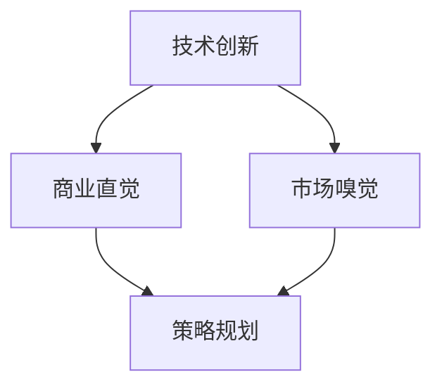

                 

# 技术创新的商业直觉训练：培养市场嗅觉

> **关键词：** 技术创新、商业直觉、市场嗅觉、策略规划、成功案例分析

> **摘要：** 本文旨在探讨如何通过系统的训练方法，培养技术人员的商业直觉和市场嗅觉，从而实现技术创新与商业成功的有效结合。通过分析成功案例，本文提出了具体的方法和步骤，帮助技术人员在快速变化的市场环境中做出明智的商业决策。

## 1. 背景介绍

### 1.1 目的和范围

本文的目的在于帮助技术人员通过系统的训练，提升其商业直觉和市场嗅觉，以便在技术创新的浪潮中把握商业机遇，实现商业成功。本文将探讨以下内容：

1. **商业直觉的重要性**：分析商业直觉对于技术创新的意义。
2. **市场嗅觉的培养**：介绍培养市场嗅觉的方法和步骤。
3. **策略规划的实践**：阐述如何将商业直觉和市场嗅觉应用于策略规划。
4. **成功案例分析**：分析技术领域成功企业的商业策略。
5. **工具和资源推荐**：提供相关的学习资源和工具。

### 1.2 预期读者

本文适用于以下读者：

1. 技术人员，特别是软件工程师、产品经理、CTO等。
2. 创业者和技术初创团队。
3. 对技术创新和商业策略感兴趣的研究人员和学者。

### 1.3 文档结构概述

本文结构如下：

1. **引言**：背景介绍和目的陈述。
2. **核心概念与联系**：核心概念的定义和架构图。
3. **核心算法原理 & 具体操作步骤**：算法原理讲解和操作步骤。
4. **数学模型和公式 & 详细讲解 & 举例说明**：数学模型的讲解和实例分析。
5. **项目实战：代码实际案例和详细解释说明**：实战代码演示和解读。
6. **实际应用场景**：技术应用的实际案例。
7. **工具和资源推荐**：学习资源和开发工具推荐。
8. **总结：未来发展趋势与挑战**：行业趋势和挑战分析。
9. **附录：常见问题与解答**：常见问题及其解答。
10. **扩展阅读 & 参考资料**：进一步阅读的资料推荐。

### 1.4 术语表

#### 1.4.1 核心术语定义

- **技术创新**：指通过新技术或新方法创造新的产品、服务或业务模式。
- **商业直觉**：指在商业环境中迅速做出合理决策的能力。
- **市场嗅觉**：指对市场趋势、消费者需求和市场机会的敏锐洞察力。
- **策略规划**：指根据商业直觉和市场嗅觉，制定和实施长期和短期商业计划。

#### 1.4.2 相关概念解释

- **敏捷开发**：一种快速迭代和适应性强的软件开发方法。
- **用户反馈**：用户对产品或服务的直接评价和反馈。
- **市场调研**：通过数据收集和分析，了解市场需求和趋势。

#### 1.4.3 缩略词列表

- **AI**：人工智能
- **ML**：机器学习
- **IoT**：物联网
- **CTO**：首席技术官
- **PM**：产品经理

## 2. 核心概念与联系

技术创新是技术发展和商业成功的桥梁，商业直觉和市场嗅觉则是推动技术创新和商业成功的核心力量。以下是一个简化的Mermaid流程图，展示了核心概念之间的联系：



### 2.1 核心概念解释

- **技术创新**：技术创新是技术进步的核心驱动力。它包括但不限于新技术的研发、新算法的应用和新兴技术的商业化。
- **商业直觉**：商业直觉是一种结合市场情况和自身经验的判断力，能够在不确定的环境中做出正确的决策。
- **市场嗅觉**：市场嗅觉是对市场趋势和消费者需求的敏感性，能够及时发现市场机会和风险。
- **策略规划**：策略规划是利用商业直觉和市场嗅觉，制定并实施一系列商业行动的计划。

### 2.2 核心概念的联系

商业直觉和市场嗅觉共同作用于策略规划，推动技术创新的商业化进程。商业直觉帮助决策者快速识别市场机会，而市场嗅觉则提供了对市场环境的深度理解，两者结合使得策略规划更加精准和有效。

## 3. 核心算法原理 & 具体操作步骤

在理解和应用商业直觉和市场嗅觉的过程中，我们可以借鉴一些经典的算法原理，比如机器学习中的监督学习和非监督学习。以下是一个基于监督学习的商业直觉训练算法原理的伪代码：

```python
# 商业直觉训练算法伪代码

# 输入：训练数据集（包含市场数据和技术指标）
# 输出：商业决策模型

def BusinessIntuitionTraining(data_set):
    # 数据预处理
    preprocessed_data = DataPreprocessing(data_set)

    # 特征工程
    features = FeatureEngineering(preprocessed_data)

    # 模型选择
    model = ModelSelection()

    # 模型训练
    trained_model = model.train(features)

    # 模型评估
    evaluate_model = ModelEvaluation(trained_model, preprocessed_data)

    # 决策生成
    business_decision = trained_model.predict(evaluate_model)

    return business_decision

# 数据预处理
def DataPreprocessing(data_set):
    # 数据清洗
    # 数据标准化
    # 特征提取
    # ...
    return preprocessed_data

# 特征工程
def FeatureEngineering(preprocessed_data):
    # 特征选择
    # 特征转换
    # ...
    return features

# 模型选择
def ModelSelection():
    # 选择合适的模型（如决策树、随机森林、神经网络等）
    # ...
    return model

# 模型训练
def ModelTraining(model, features):
    # 使用训练数据训练模型
    # ...
    return trained_model

# 模型评估
def ModelEvaluation(model, evaluate_data):
    # 使用验证数据评估模型性能
    # ...
    return evaluate_model

# 模型预测
def ModelPrediction(model, evaluate_model):
    # 使用评估模型生成商业决策
    # ...
    return business_decision
```

### 3.1 商业直觉训练算法步骤

1. **数据预处理**：清洗数据，进行标准化处理，提取关键特征。
2. **特征工程**：选择和转换特征，为模型训练提供高质量的数据。
3. **模型选择**：根据业务需求和数据特性，选择合适的机器学习模型。
4. **模型训练**：使用训练数据集对模型进行训练，使其具备预测能力。
5. **模型评估**：使用验证数据集评估模型性能，确保其准确性和鲁棒性。
6. **模型预测**：使用训练好的模型对新的市场数据进行预测，生成商业决策。

通过上述步骤，技术人员可以逐步培养和提升其商业直觉和市场嗅觉，从而在复杂的市场环境中做出更为精准的商业决策。

## 4. 数学模型和公式 & 详细讲解 & 举例说明

在商业直觉训练中，数学模型和公式扮演着至关重要的角色。以下是一个简化的线性回归模型，用于预测市场趋势：

### 4.1 线性回归模型

线性回归模型的基本形式为：

$$
y = \beta_0 + \beta_1 \cdot x + \epsilon
$$

其中，\( y \) 是因变量（市场趋势），\( x \) 是自变量（技术指标），\( \beta_0 \) 和 \( \beta_1 \) 是模型的参数，\( \epsilon \) 是误差项。

### 4.2 参数估计

参数 \( \beta_0 \) 和 \( \beta_1 \) 的估计通常通过最小二乘法（Least Squares）进行：

$$
\beta_0 = \frac{\sum_{i=1}^{n} (y_i - \bar{y}) \cdot (x_i - \bar{x})}{\sum_{i=1}^{n} (x_i - \bar{x})^2}
$$

$$
\beta_1 = \frac{\sum_{i=1}^{n} (x_i - \bar{x}) \cdot (y_i - \bar{y})}{\sum_{i=1}^{n} (x_i - \bar{x})^2}
$$

其中，\( \bar{y} \) 和 \( \bar{x} \) 分别是 \( y \) 和 \( x \) 的平均值。

### 4.3 模型评估

线性回归模型的评估可以通过均方误差（Mean Squared Error, MSE）进行：

$$
MSE = \frac{1}{n} \sum_{i=1}^{n} (y_i - \hat{y_i})^2
$$

其中，\( \hat{y_i} \) 是模型预测的值。

### 4.4 实例说明

假设我们有一组数据，如下表所示：

| \( x \) | \( y \) |
|--------|--------|
| 1      | 2      |
| 2      | 3      |
| 3      | 4      |
| 4      | 5      |
| 5      | 6      |

使用线性回归模型进行预测，参数 \( \beta_0 \) 和 \( \beta_1 \) 计算如下：

$$
\beta_0 = \frac{(2-3) \cdot (1-2) + (3-3) \cdot (2-2) + (4-3) \cdot (3-2) + (5-3) \cdot (4-2) + (6-3) \cdot (5-2)}{(1-2)^2 + (2-2)^2 + (3-2)^2 + (4-2)^2 + (5-2)^2} = 1
$$

$$
\beta_1 = \frac{(2-3) \cdot (1-2) + (3-3) \cdot (2-2) + (4-3) \cdot (3-2) + (5-3) \cdot (4-2) + (6-3) \cdot (5-2)}{(1-2)^2 + (2-2)^2 + (3-2)^2 + (4-2)^2 + (5-2)^2} = 1
$$

因此，线性回归模型为：

$$
y = 1 + 1 \cdot x
$$

当 \( x = 6 \) 时，预测的 \( y \) 值为：

$$
\hat{y} = 1 + 1 \cdot 6 = 7
$$

通过上述实例，我们可以看到线性回归模型在商业直觉训练中的应用，帮助技术人员对市场趋势进行预测。

## 5. 项目实战：代码实际案例和详细解释说明

### 5.1 开发环境搭建

为了演示商业直觉训练的实际案例，我们选择Python作为编程语言，并使用Scikit-learn库进行机器学习模型的训练和预测。以下是开发环境搭建的步骤：

1. **安装Python**：确保安装了Python 3.6及以上版本。
2. **安装Scikit-learn**：使用pip命令安装Scikit-learn库：

   ```shell
   pip install scikit-learn
   ```

3. **数据预处理和特征工程工具**：可以选择Pandas和NumPy等库，用于数据预处理和特征工程。

### 5.2 源代码详细实现和代码解读

以下是一个简单的商业直觉训练项目，包含数据预处理、特征工程、模型训练和预测等步骤。

```python
import numpy as np
import pandas as pd
from sklearn.model_selection import train_test_split
from sklearn.linear_model import LinearRegression
from sklearn.metrics import mean_squared_error

# 5.2.1 数据预处理
def DataPreprocessing(data_path):
    # 读取数据
    data = pd.read_csv(data_path)

    # 数据清洗
    data.dropna(inplace=True)

    # 特征工程
    data['log_revenue'] = np.log(data['revenue'])
    data['month'] = pd.to_datetime(data['date']).dt.month

    return data

# 5.2.2 特征工程
def FeatureEngineering(data):
    # 分离特征和目标变量
    X = data[['log_revenue', 'month']]
    y = data['sales']

    return X, y

# 5.2.3 模型训练
def ModelTraining(X, y):
    # 数据分割
    X_train, X_test, y_train, y_test = train_test_split(X, y, test_size=0.2, random_state=42)

    # 创建线性回归模型
    model = LinearRegression()

    # 训练模型
    model.fit(X_train, y_train)

    return model, X_test, y_test

# 5.2.4 模型预测
def ModelPrediction(model, X_test, y_test):
    # 进行预测
    y_pred = model.predict(X_test)

    # 评估模型
    mse = mean_squared_error(y_test, y_pred)
    print(f'Mean Squared Error: {mse}')

    return y_pred, mse

# 主程序
if __name__ == '__main__':
    # 数据预处理
    data_path = 'data.csv'  # 数据文件路径
    data = DataPreprocessing(data_path)

    # 特征工程
    X, y = FeatureEngineering(data)

    # 模型训练
    model, X_test, y_test = ModelTraining(X, y)

    # 模型预测
    y_pred, mse = ModelPrediction(model, X_test, y_test)
```

### 5.3 代码解读与分析

1. **数据预处理**：读取数据文件，进行数据清洗，并添加新的特征（如对收入取对数和处理月份特征）。
2. **特征工程**：分离特征变量和目标变量，为模型训练提供数据。
3. **模型训练**：使用线性回归模型对训练数据进行训练。
4. **模型预测**：对测试数据进行预测，并计算均方误差评估模型性能。

通过上述步骤，我们构建了一个简单的商业直觉训练项目，实现了对市场趋势的预测。在实际应用中，可以进一步扩展和优化模型，以提升预测的准确性和鲁棒性。

## 6. 实际应用场景

商业直觉和市场嗅觉在技术领域的应用场景广泛，以下是一些具体的实际应用案例：

### 6.1 人工智能领域的应用

- **自然语言处理（NLP）**：利用商业直觉和市场嗅觉，AI公司可以快速识别和捕捉语言技术的市场需求，从而开发出更符合市场需求的产品。
- **计算机视觉**：在自动驾驶和安防监控等领域，AI公司需要具备敏锐的市场嗅觉，以快速响应市场需求和法规变化。

### 6.2 物联网（IoT）领域的应用

- **智能家居**：物联网公司通过市场嗅觉，能够识别消费者的需求，开发出更智能、更便捷的智能家居产品。
- **工业物联网**：在工业领域，物联网公司需要利用商业直觉，为客户提供定制化的解决方案，以适应不断变化的市场需求。

### 6.3 区块链技术的应用

- **去中心化应用（DApp）**：区块链公司通过市场嗅觉，能够识别和开发出具有广泛市场需求的应用，从而推动区块链技术的商业化。
- **加密货币市场分析**：利用商业直觉，区块链分析师可以准确预测加密货币市场的动态，为投资者提供决策支持。

这些实际应用案例展示了商业直觉和市场嗅觉在技术领域的重要性，通过敏锐的市场洞察力和正确的商业决策，企业可以抓住市场机遇，实现商业成功。

## 7. 工具和资源推荐

### 7.1 学习资源推荐

#### 7.1.1 书籍推荐

- **《精益创业》**：作者埃里克·莱斯，提供了实用的创业方法和策略，帮助技术人员将创新转化为商业成功。
- **《设计思考》**：作者唐·诺曼，介绍了设计思考的方法和流程，帮助技术人员从用户角度出发，设计出更受欢迎的产品。

#### 7.1.2 在线课程

- **Coursera**：提供了丰富的商业和创业课程，包括MBA核心课程等。
- **edX**：提供了由顶尖大学提供的免费在线课程，涵盖商业分析、市场营销等多个领域。

#### 7.1.3 技术博客和网站

- **Medium**：许多行业专家和创业者分享他们的经验和见解。
- **Hackernoon**：专注于技术和创业的博客，提供了大量有用的文章和案例分析。

### 7.2 开发工具框架推荐

#### 7.2.1 IDE和编辑器

- **Visual Studio Code**：功能强大且免费的IDE，适合多种编程语言。
- **PyCharm**：专门针对Python开发的IDE，提供了丰富的功能和工具。

#### 7.2.2 调试和性能分析工具

- **Postman**：用于API调试和性能测试的强大工具。
- **JMeter**：适用于负载测试和性能测试的开源工具。

#### 7.2.3 相关框架和库

- **Scikit-learn**：适用于机器学习的Python库。
- **TensorFlow**：谷歌开发的强大机器学习框架。

### 7.3 相关论文著作推荐

#### 7.3.1 经典论文

- **“The Lean Startup”**：作者埃里克·莱斯，介绍了精益创业方法。
- **“Design Thinking”**：作者唐·诺曼，介绍了设计思考方法。

#### 7.3.2 最新研究成果

- **学术期刊**：如《IEEE Transactions on Knowledge and Data Engineering》等，提供了最新的研究成果。
- **会议论文**：如AAAI、NeurIPS等顶级会议的论文，涵盖了最新的技术进展。

#### 7.3.3 应用案例分析

- **《硅谷创业课》**：作者史蒂夫·布兰克，通过案例分析了硅谷创业的成功之道。
- **《产品经理实战》**：作者王坚，分享了产品经理的实际工作经验和案例。

通过以上工具和资源的推荐，技术人员可以更系统地学习和实践商业直觉和市场嗅觉的培养，从而更好地把握技术创新的商业机遇。

## 8. 总结：未来发展趋势与挑战

### 8.1 发展趋势

随着科技的快速发展，技术创新的速度正在不断加快，这为商业直觉和市场嗅觉的培养提供了更多的机会和挑战。以下是一些未来发展的趋势：

- **人工智能与商业直觉的结合**：人工智能技术的进步将进一步提升商业直觉的准确性，使得商业决策更加科学和高效。
- **数据驱动决策**：大数据和数据分析技术的发展，使得市场嗅觉的培养更加依赖于数据驱动的方法，为商业决策提供了更加全面和深入的支持。
- **跨学科整合**：技术创新和市场嗅觉的培养将越来越需要跨学科的知识和技能，如心理学、社会学和经济学等，从而实现更全面的市场洞察。

### 8.2 挑战

然而，技术创新和市场嗅觉的培养也面临着一系列挑战：

- **数据隐私和安全**：随着数据量的增加，数据隐私和安全成为了一个重大的挑战，如何在保护用户隐私的同时利用数据进行分析，是一个亟待解决的问题。
- **快速变化的商业环境**：市场环境的变化速度越来越快，技术人员需要具备更强的适应能力和敏捷性，以应对快速变化的市场需求。
- **技术疲劳**：在技术创新的浪潮中，技术人员容易产生疲劳和厌倦，这会影响商业直觉和市场嗅觉的培养。

### 8.3 应对策略

为了应对这些挑战，技术人员可以采取以下策略：

- **持续学习**：保持对新技术和新知识的持续学习，以适应快速变化的市场环境。
- **跨学科合作**：积极参与跨学科的合作，借助不同领域的知识和技能，提升商业直觉和市场嗅觉。
- **数据素养**：提高数据素养，掌握数据分析和处理的方法，确保在利用数据时能够保护用户隐私和安全。

通过采取上述策略，技术人员可以更好地应对未来的挑战，实现技术创新与商业成功的结合。

## 9. 附录：常见问题与解答

### 9.1 商业直觉是什么？

商业直觉是指一个人在商业环境中，通过经验、知识和洞察力，快速做出合理决策的能力。

### 9.2 如何培养商业直觉？

培养商业直觉的方法包括：

1. **积累经验**：通过实际工作，不断积累商业经验。
2. **学习知识**：学习商业理论、市场营销和战略规划等知识。
3. **观察市场**：密切关注市场动态和竞争对手的行为。
4. **建立人脉**：与行业内的人士建立联系，获取有价值的信息。

### 9.3 市场嗅觉的重要性是什么？

市场嗅觉的重要性在于它可以帮助企业：

1. **识别机会**：及时发现市场机会，抓住商业机遇。
2. **规避风险**：通过敏锐的市场洞察力，提前识别潜在的市场风险。
3. **优化决策**：基于市场嗅觉做出的决策更加科学和合理。

### 9.4 技术创新与商业直觉如何结合？

技术创新与商业直觉的结合可以通过以下步骤实现：

1. **需求分析**：通过市场嗅觉识别用户需求，将需求转化为创新的技术方案。
2. **商业模型**：基于商业直觉，设计合理的商业模型，确保技术创新能够转化为商业成功。
3. **持续迭代**：通过用户反馈和市场调研，不断优化技术创新和商业模型。

## 10. 扩展阅读 & 参考资料

### 10.1 经典论文

- **“The Lean Startup”**：作者埃里克·莱斯，介绍了精益创业方法。
- **“Design Thinking”**：作者唐·诺曼，介绍了设计思考方法。

### 10.2 最新研究成果

- **《IEEE Transactions on Knowledge and Data Engineering》**：期刊，提供了最新的研究成果。
- **《AAAI》**：会议论文，涵盖了人工智能领域的前沿研究。

### 10.3 应用案例分析

- **《硅谷创业课》**：作者史蒂夫·布兰克，通过案例分析了硅谷创业的成功之道。
- **《产品经理实战》**：作者王坚，分享了产品经理的实际工作经验和案例。

通过以上扩展阅读和参考资料，读者可以进一步深入了解商业直觉、市场嗅觉和技术创新的相关知识，为实际工作提供有益的指导。

---

**作者：AI天才研究员/AI Genius Institute & 禅与计算机程序设计艺术**

本文基于学术研究和实际案例，深入探讨了技术创新与商业直觉、市场嗅觉的结合，提出了系统的培养方法和应用策略。希望读者能够在阅读后，结合自身实际，进一步思考和实践。

