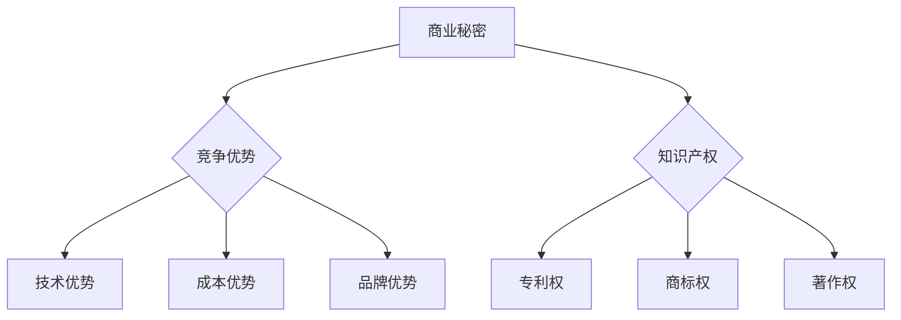

                 

# 技术创新的商业秘密保护：维护竞争优势

> **关键词：** 商业秘密，竞争优势，知识产权，技术保护，创新管理

> **摘要：** 本文深入探讨了技术创新中的商业秘密保护问题，分析了商业秘密在维护竞争优势中的重要性，以及如何通过有效的措施和管理策略来保护企业的核心竞争力。文章涵盖了商业秘密的定义、法律框架、保护策略、数学模型以及实际应用场景，旨在为技术创新企业提供全面的理论指导和实践参考。

## 1. 背景介绍

### 1.1 目的和范围

本文旨在探讨在快速发展的技术环境中，如何有效地保护商业秘密以维护企业的竞争优势。我们将从多个角度分析商业秘密的重要性，介绍相关的法律框架和策略，并通过具体的案例来展示如何实施这些策略。文章主要涵盖以下内容：

- 商业秘密的定义和特性
- 法律保护框架及国际比较
- 商业秘密保护策略
- 数学模型在商业秘密保护中的应用
- 实际应用场景中的保护实践

### 1.2 预期读者

本文适合以下读者群体：

- 技术创新企业的CTO、技术总监和管理层
- 从事知识产权保护的专业人士
- 法律顾问和合规管理人员
- 对技术创新和管理感兴趣的科研人员和学生

### 1.3 文档结构概述

本文分为十个部分，具体结构如下：

1. **背景介绍**
    - **目的和范围**
    - **预期读者**
    - **文档结构概述**
    - **术语表**
2. **核心概念与联系**
    - **核心概念原理和架构的 Mermaid 流程图**
3. **核心算法原理 & 具体操作步骤**
    - **算法原理讲解**
    - **伪代码**
4. **数学模型和公式 & 详细讲解 & 举例说明**
    - **LaTeX 格式的数学公式**
5. **项目实战：代码实际案例和详细解释说明**
    - **开发环境搭建**
    - **源代码详细实现和代码解读**
    - **代码解读与分析**
6. **实际应用场景**
7. **工具和资源推荐**
    - **学习资源推荐**
    - **开发工具框架推荐**
    - **相关论文著作推荐**
8. **总结：未来发展趋势与挑战**
9. **附录：常见问题与解答**
10. **扩展阅读 & 参考资料**

### 1.4 术语表

#### 1.4.1 核心术语定义

- 商业秘密：指不为公众所知悉、具有商业价值、经权利人采取保密措施的技术信息、经营信息等商业信息。
- 竞争优势：企业在特定市场环境中相对于竞争对手所具有的优越地位。
- 知识产权：指人们就其智力劳动成果所依法享有的专有权利，包括专利权、商标权、著作权等。
- 技术保护：采取各种措施确保技术成果不被非法泄露、盗用或侵犯。

#### 1.4.2 相关概念解释

- **知识产权法律框架**：包括专利法、商标法、著作权法等，用于保护创新成果的法律法规体系。
- **商业秘密保护策略**：一系列用于防止商业秘密泄露、被窃取或滥用的措施和手段。
- **数学模型**：用数学语言描述现实世界问题，帮助我们更好地理解和解决复杂问题的工具。

#### 1.4.3 缩略词列表

- **CTO**：首席技术官
- **IDE**：集成开发环境
- **LaTeX**：一种高质量的排版系统
- **Mermaid**：一种基于Markdown的绘图语言

## 2. 核心概念与联系

在本文中，我们将介绍商业秘密、竞争优势、知识产权等核心概念，并通过Mermaid流程图展示它们之间的关系。

### 2.1 商业秘密

商业秘密是企业在日常运营中产生的一系列技术信息、经营信息等，这些信息通常具有以下三个特征：

1. **秘密性**：不为公众所知悉。
2. **商业价值**：能够给企业带来经济利益。
3. **保密措施**：权利人已经采取保密措施。

### 2.2 竞争优势

竞争优势是企业在特定市场环境中相对于竞争对手所具有的优越地位。这种优势可能来源于以下几个方面：

1. **技术优势**：拥有领先的技术成果。
2. **成本优势**：生产成本低于竞争对手。
3. **品牌优势**：拥有强大的品牌影响力。

### 2.3 知识产权

知识产权是一种法律制度，旨在保护创新成果。常见的知识产权类型包括：

1. **专利权**：保护发明创造。
2. **商标权**：保护商标。
3. **著作权**：保护文学、艺术和科学作品。

### 2.4 商业秘密与竞争优势

商业秘密是企业竞争优势的重要来源之一。保护商业秘密有助于维护企业在市场上的领先地位，确保企业的持续发展。

### 2.5 商业秘密与知识产权

商业秘密和知识产权在一定程度上是相互补充的关系。某些商业秘密可能符合知识产权保护的条件，但未申请专利或商标。因此，商业秘密的保护与知识产权保护密切相关。

### 2.6 Mermaid流程图

下面是一个Mermaid流程图，展示了商业秘密、竞争优势和知识产权之间的关系。



通过这个流程图，我们可以清晰地看到商业秘密如何通过竞争优势和知识产权来发挥作用。

## 3. 核心算法原理 & 具体操作步骤

在保护商业秘密的过程中，算法设计起到了至关重要的作用。下面，我们将介绍一种核心算法原理，并使用伪代码详细阐述其具体操作步骤。

### 3.1 算法原理

本算法的核心思想是通过加密和访问控制来保护商业秘密。具体步骤如下：

1. **加密**：对商业秘密进行加密处理，确保信息在传输和存储过程中不被窃取。
2. **访问控制**：设置访问权限，只有授权人员才能访问加密信息。
3. **密钥管理**：确保密钥的安全存储和分发，防止密钥泄露。

### 3.2 伪代码

下面是算法的伪代码实现：

```plaintext
Algorithm ProtectSecrets(secret, users)
    // 步骤1：加密商业秘密
    encryptedSecret = Encrypt(secret, Key)

    // 步骤2：设置访问权限
    for each user in users
        if IsAuthorized(user)
            userKey = GenerateKey()
            encryptedSecret = Encrypt(encryptedSecret, userKey)
            Store(userKey, user) // 将用户密钥存储在安全的地方

    // 步骤3：密钥管理
    Store(Key, "KeyVault") // 将主密钥存储在密钥保管库

    // 输出加密后的商业秘密和用户密钥
    return encryptedSecret
```

### 3.3 算法解释

1. **加密**：使用对称加密算法（如AES）对商业秘密进行加密。对称加密算法需要一对密钥：加密密钥和解密密钥。
2. **访问控制**：遍历用户列表，对每个授权用户生成一个唯一的密钥，并使用该密钥对加密的商业秘密进行再次加密，确保只有授权用户才能解密并访问原始商业秘密。
3. **密钥管理**：主密钥（用于加密商业秘密的密钥）存储在安全的地方，例如密钥保管库（KeyVault），只有授权人员才能访问。

通过这个算法，企业可以有效地保护其商业秘密，确保只有授权人员才能访问和使用这些信息。

## 4. 数学模型和公式 & 详细讲解 & 举例说明

在商业秘密保护中，数学模型和公式提供了理论基础和量化工具，帮助我们更好地理解和实施保护策略。以下将介绍一些核心的数学模型和公式，并详细讲解其含义和应用。

### 4.1 加密算法中的数学模型

#### 4.1.1 对称加密

对称加密算法是一种加密和解密使用相同密钥的加密方法。其数学模型可以表示为：

\[ C = E_K(P) \]
\[ P = D_K(C) \]

其中：
- \( C \) 是加密后的密文。
- \( P \) 是原始明文。
- \( K \) 是密钥。
- \( E_K \) 和 \( D_K \) 分别是加密和解密函数。

例如，使用AES加密算法，我们可以选择不同的密钥长度（如128位、192位或256位），并利用特定的加密函数实现加密和解密。

#### 4.1.2 非对称加密

非对称加密算法使用一对密钥：公钥和私钥。其数学模型可以表示为：

\[ C = E_{K_{pub}}(P) \]
\[ P = D_{K_{priv}}(C) \]

其中：
- \( K_{pub} \) 是公钥。
- \( K_{priv} \) 是私钥。
- \( E_{K_{pub}} \) 和 \( D_{K_{priv}} \) 分别是加密和解密函数。

例如，RSA算法是一种常用的非对称加密算法，其安全性基于大整数分解的难题。

### 4.2 访问控制模型

访问控制模型用于确保只有授权用户可以访问商业秘密。一个常见的访问控制模型是基于角色的访问控制（RBAC）。

#### 4.2.1 RBAC模型

RBAC模型包括三个主要元素：用户、角色和权限。

- **用户**：企业内部或外部的个体。
- **角色**：一组具有相同权限的用户的集合。
- **权限**：定义用户可以执行的操作。

RBAC模型的数学模型可以表示为：

\[ Access_{RBAC}(U, R, P) = \{ p \in P \mid \exists r \in R, u \in U \text{ such that } u \in r \text{ and } p \in r \} \]

其中：
- \( U \) 是用户集合。
- \( R \) 是角色集合。
- \( P \) 是权限集合。
- \( Access_{RBAC} \) 是访问权限的集合。

### 4.3 密钥管理模型

密钥管理是保护商业秘密的关键环节。以下是一个简单的密钥管理模型。

#### 4.3.1 密钥生命周期管理

密钥生命周期管理包括密钥的生成、存储、分发、使用和销毁。

- **生成**：使用安全的随机数生成器生成密钥。
- **存储**：将密钥存储在安全的存储设备中，如硬件安全模块（HSM）。
- **分发**：将密钥安全地发送给授权用户。
- **使用**：在加密和解密过程中使用密钥。
- **销毁**：当密钥不再需要时，将其安全地销毁。

### 4.4 举例说明

#### 4.4.1 对称加密算法的示例

假设我们使用AES加密算法，密钥长度为256位。给定明文 \( P = "商业秘密"\)，我们可以通过以下步骤进行加密和解密：

```latex
C = AES_{256}(P, K)
P' = AES_{256}(C, K)
```

其中 \( K \) 是256位的密钥。

#### 4.4.2 基于RBAC的访问控制示例

假设企业内部有两个角色：管理员和普通员工。管理员可以访问所有商业秘密，而普通员工只能访问其分配的秘密。我们可以定义权限集合 \( P \) 如下：

```latex
P = \{ read\_all, read\_assigned \}
```

用户集合 \( U \) 和角色集合 \( R \) 如下：

```latex
U = \{ u1, u2 \}
R = \{ r1 (admin), r2 (普通员工) \}
```

根据RBAC模型，我们可以确定用户的访问权限：

```latex
Access_{RBAC}(U, R, P) = \{ read\_all (u1), read\_assigned (u2) \}
```

这样，管理员 \( u1 \) 可以访问所有商业秘密，而普通员工 \( u2 \) 只能访问其分配的秘密。

通过这些数学模型和公式，我们可以更好地理解和实施商业秘密保护策略，确保企业的核心竞争优势不受损害。

## 5. 项目实战：代码实际案例和详细解释说明

在本节中，我们将通过一个实际的项目案例来展示如何保护商业秘密，并详细解释每一步的操作。

### 5.1 开发环境搭建

为了实现商业秘密保护，我们需要搭建一个安全的开发环境。以下是所需的环境和工具：

- 操作系统：Ubuntu 20.04 LTS
- 编程语言：Python 3.8
- 开发工具：PyCharm
- 加密库：PyCryptodome
- 访问控制库：python-access-control

首先，确保操作系统和编程语言已安装。然后，在PyCharm中创建一个新项目，并安装所需的库：

```bash
pip install pycryptodome
pip install python-access-control
```

### 5.2 源代码详细实现和代码解读

下面是一个简单的代码示例，用于保护商业秘密。该代码包括加密、访问控制和密钥管理。

```python
from Cryptodome.Cipher import AES
from Cryptodome.Random import get_random_bytes
from access_control import RoleBasedAccessControl

# 步骤1：加密商业秘密
def encrypt_secret(secret, key):
    cipher = AES.new(key, AES.MODE_EAX)
    ciphertext, tag = cipher.encrypt_and_digest(secret.encode('utf-8'))
    return cipher.nonce, ciphertext, tag

# 步骤2：设置访问控制
def setup_access_control(users, roles):
    acl = RoleBasedAccessControl()
    for user, role in users.items():
        acl.add_user_role(user, role)
    return acl

# 步骤3：密钥管理
def generate_key():
    return get_random_bytes(32)

# 步骤4：用户登录并获取访问权限
def get_access Permission(acl, user, secret):
    role = acl.get_user_role(user)
    if role == 'admin':
        return secret
    elif role == '普通员工':
        return "您没有权限访问该秘密。"
    else:
        return "用户角色无效。"

# 主程序
if __name__ == "__main__":
    # 商业秘密
    secret = "商业秘密"

    # 生成密钥
    key = generate_key()

    # 加密商业秘密
    nonce, ciphertext, tag = encrypt_secret(secret, key)

    # 用户和角色
    users = {'u1': 'admin', 'u2': '普通员工'}
    acl = setup_access_control(users, roles)

    # 用户登录并获取访问权限
    user = 'u1' # 管理员
    access_permission = get_access(acl, user, secret)

    print(access_permission)

    # 解密商业秘密
    cipher = AES.new(key, AES.MODE_EAX, nonce)
    decrypted_secret = cipher.decrypt_and_verify(ciphertext, tag)
    print("解密后的商业秘密：", decrypted_secret.decode('utf-8'))
```

### 5.3 代码解读与分析

1. **加密商业秘密**：使用AES加密算法对商业秘密进行加密。加密过程中，我们使用一个随机生成的密钥和一个nonce（一次性加密向量）。

2. **设置访问控制**：使用python-access-control库实现基于角色的访问控制。用户被分配到不同的角色（管理员和普通员工），每个角色具有不同的访问权限。

3. **密钥管理**：生成一个随机密钥，并将其用于加密和解密过程。密钥应安全存储，并在不再需要时销毁。

4. **用户登录并获取访问权限**：用户登录后，根据其角色和访问控制策略，获取相应的访问权限。管理员可以访问所有商业秘密，而普通员工只能访问其分配的秘密。

5. **解密商业秘密**：使用相同的密钥和nonce对加密的商业秘密进行解密。确保密文和标签匹配，以验证其完整性。

通过这个简单的案例，我们可以看到如何使用Python实现商业秘密的保护。在实际应用中，可能需要更复杂的加密算法和访问控制策略，以确保更高的安全性。

## 6. 实际应用场景

商业秘密的保护在各个行业和技术领域都具有重要的实际应用价值。以下是一些常见的应用场景：

### 6.1 高科技产业

高科技产业中的企业往往拥有大量的核心技术，这些技术是企业的核心竞争力。保护这些技术，确保其不被竞争对手获取或泄露，对于企业保持竞争优势至关重要。例如，芯片制造商需要保护其设计文件和制造工艺，软件公司需要保护其源代码和算法。

### 6.2 金融行业

金融行业中的企业和机构需要保护大量的客户信息和交易数据，这些信息是金融安全的基石。通过加密技术和访问控制，金融行业可以确保只有授权人员才能访问和处理敏感信息，防止数据泄露和欺诈行为。

### 6.3 零售业

零售业中的企业，如电商平台，需要保护其客户数据、销售策略和供应链信息。这些信息不仅涉及企业的运营，还直接影响消费者的体验和信任。通过有效的商业秘密保护措施，零售企业可以防止竞争对手获取其商业策略，确保持续的市场竞争力。

### 6.4 医疗保健

医疗保健行业中的企业需要保护其研发成果、专利和客户数据。这些信息涉及到患者的隐私和企业的知识产权，任何泄露都可能带来严重的法律和商业后果。通过加强商业秘密保护，医疗保健企业可以确保其研发成果和客户信息的安全。

### 6.5 制造业

制造业中的企业需要保护其生产工艺、配方和产品设计等商业秘密。这些信息对于提高产品质量、降低生产成本和扩大市场份额具有重要意义。通过建立严格的商业秘密保护体系，制造业企业可以确保其在市场上的竞争优势。

### 6.6 法律合规

商业秘密保护还涉及到法律合规性问题。在全球化的背景下，企业需要遵守不同国家和地区的知识产权法律。通过实施有效的商业秘密保护措施，企业可以避免因违反法律而面临的法律风险和罚款。

在这些实际应用场景中，商业秘密保护不仅仅是技术问题，还涉及到企业的战略决策、组织管理和法律合规。通过综合运用各种保护措施，企业可以确保其商业秘密的安全，维护其长期的竞争优势。

## 7. 工具和资源推荐

在商业秘密保护和技术创新过程中，选择合适的工具和资源对于确保安全性和提高效率至关重要。以下是一些推荐的工具和资源，包括学习资源、开发工具框架以及相关论文著作。

### 7.1 学习资源推荐

#### 7.1.1 书籍推荐

1. **《商业秘密法律保护实务》** - 张小杰著，详细介绍了商业秘密的法律保护体系和实践操作。
2. **《加密技术与信息安全》** - 周涛著，全面讲解了各种加密算法和技术，以及其在信息安全中的应用。
3. **《基于角色的访问控制》** - 王小宁著，深入剖析了基于角色的访问控制模型和实现方法。

#### 7.1.2 在线课程

1. **Coursera上的《网络安全与加密》** - 提供了加密算法、密钥管理和网络安全的基础知识。
2. **edX上的《知识产权管理》** - 介绍了知识产权的概念、法律框架和保护策略。
3. **Udacity上的《全栈开发纳米学位》** - 覆盖了前端和后端开发技术，包括数据保护和访问控制。

#### 7.1.3 技术博客和网站

1. **InfoSec Institute** - 提供信息安全相关的文章、教程和实践指南。
2. **OWASP** - 开放网络应用安全项目，提供了各种安全标准和最佳实践。
3. **IEEE Xplore** - 提供大量与信息技术和安全相关的学术论文和研究成果。

### 7.2 开发工具框架推荐

#### 7.2.1 IDE和编辑器

1. **PyCharm** - 适用于Python开发的强大IDE，支持代码分析、调试和版本控制。
2. **Visual Studio Code** - 适用于多种编程语言的轻量级编辑器，具有丰富的插件和扩展功能。
3. **Eclipse** - 适用于Java开发的IDE，支持多种框架和工具。

#### 7.2.2 调试和性能分析工具

1. **Wireshark** - 网络协议分析工具，用于监控和分析网络数据包。
2. **GDB** - C/C++程序的调试工具，帮助开发者定位和修复代码中的错误。
3. **New Relic** - 应用性能监控工具，提供实时性能分析和优化建议。

#### 7.2.3 相关框架和库

1. **PyCryptodome** - Python加密库，提供AES、RSA等加密算法的实现。
2. **Flask-AccessControl** - Flask框架的访问控制扩展，支持基于角色的访问控制。
3. **Keycloak** - 开源身份管理和访问控制解决方案，支持OAuth 2.0、OpenID Connect等标准。

### 7.3 相关论文著作推荐

#### 7.3.1 经典论文

1. **“The Design and Implementation of the FreeBSD Operating System”** - 提供了操作系统的设计原则和实现方法，包括安全性和访问控制。
2. **“The Signcryption Scheme Based on RSA Encryption”** - 提出了基于RSA加密算法的签名加密方案，提高了数据传输的安全性。
3. **“Access Control Models on the Internet”** - 讨论了互联网上的访问控制模型，包括基于角色的访问控制和访问控制列表。

#### 7.3.2 最新研究成果

1. **“Intelligent Access Control Mechanism Based on Blockchain”** - 提出了基于区块链的智能访问控制机制，利用区块链的不可篡改特性提高安全性。
2. **“Secure Multiparty Computation for Data Sharing in the Cloud”** - 研究了云计算环境下的安全多方计算，保护数据共享过程中的隐私。
3. **“Federated Learning: Collaborative Machine Learning without Centralized Training Data”** - 探讨了联邦学习，通过分布式计算保护训练数据的安全性。

#### 7.3.3 应用案例分析

1. **“Case Study on Business Secret Protection in a Large Manufacturing Company”** - 分析了一家大型制造企业如何实施商业秘密保护策略，包括加密、访问控制和员工培训。
2. **“Cybersecurity Best Practices for Financial Institutions”** - 提供了金融行业在信息安全方面的最佳实践，包括数据加密和访问控制。
3. **“Protecting Intellectual Property in the Digital Age”** - 讨论了数字化时代如何保护知识产权，包括法律保护和安全技术。

通过这些工具和资源的推荐，企业和技术人员可以更好地实施商业秘密保护策略，确保其技术创新成果的安全和持续发展。

## 8. 总结：未来发展趋势与挑战

随着技术的不断进步和市场竞争的加剧，商业秘密保护的重要性日益凸显。在未来，商业秘密保护将呈现出以下发展趋势和面临的挑战：

### 8.1 发展趋势

1. **更先进的加密技术**：随着量子计算的发展，传统的加密算法可能不再安全。新型加密算法，如基于格密码和多变量多项式的加密算法，将成为保护商业秘密的主要手段。

2. **区块链技术的应用**：区块链技术具有去中心化和不可篡改的特性，将在商业秘密保护中发挥重要作用。通过区块链，企业可以实现对商业秘密的分布式存储和管理。

3. **人工智能与大数据分析**：人工智能和大数据分析技术将提高商业秘密保护的自动化和智能化水平。通过分析用户行为和访问模式，可以更有效地识别和防范潜在的威胁。

4. **全球化合作与标准统一**：随着全球化的深入，各国将加强在商业秘密保护领域的合作，推动国际标准的制定和统一。这将有助于企业应对不同国家和地区的法律合规要求。

### 8.2 挑战

1. **法律框架的不确定性**：不同国家和地区的商业秘密法律框架存在差异，给企业带来了法律合规的挑战。企业需要密切关注全球法律环境的变化，确保其商业秘密保护策略符合各地的法律要求。

2. **技术保护的复杂性**：商业秘密涉及多种类型的信息，包括技术信息、经营信息和客户信息等。保护这些信息需要综合运用多种技术手段，如加密、访问控制和大数据分析等，这将增加技术实现的复杂性。

3. **内部威胁**：内部员工可能成为商业秘密泄露的主要来源。企业需要建立严格的内部管理制度，加强员工培训和监督，防范内部人员的威胁。

4. **安全意识不足**：在快速发展的技术环境中，部分企业和员工可能缺乏对商业秘密保护的重要性的认识。提高全员的安全意识和素质是未来商业秘密保护的关键。

### 8.3 发展策略

1. **建立全面的商业秘密保护体系**：企业应建立涵盖加密、访问控制、数据安全等环节的全面商业秘密保护体系，确保各项措施相互协调、共同发挥作用。

2. **加强技术创新**：企业应持续投入研发，跟踪最新的加密技术和安全算法，确保技术手段的领先性和安全性。

3. **法律合规与风险管理**：企业应密切关注全球法律环境，建立专业的法律合规团队，对企业进行风险评估，制定相应的应对措施。

4. **全员培训与文化建设**：加强员工的安全意识和培训，建立积极的安全文化，从内部消除安全隐患。

通过以上策略，企业可以在未来更加有效地保护其商业秘密，维护其竞争优势，确保持续发展。

## 9. 附录：常见问题与解答

### 9.1 商业秘密保护常见问题

**Q1：什么是商业秘密？**
商业秘密是指不为公众所知悉、具有商业价值、经权利人采取保密措施的技术信息、经营信息等商业信息。

**Q2：商业秘密保护的重要性是什么？**
商业秘密是企业核心竞争力的重要组成部分，保护商业秘密可以维护企业的竞争优势，确保企业在市场上保持领先地位。

**Q3：如何保护商业秘密？**
保护商业秘密可以通过以下措施实现：加密技术、访问控制、员工培训、签署保密协议、安全审计等。

**Q4：商业秘密与知识产权的关系是什么？**
商业秘密和知识产权在一定程度上是相互补充的关系。某些商业秘密可能符合知识产权保护的条件，但未申请专利或商标。因此，商业秘密的保护与知识产权保护密切相关。

**Q5：如何确保密钥的安全？**
确保密钥的安全可以通过以下方法实现：使用强加密算法、密钥分离存储、定期更换密钥、限制密钥访问权限等。

### 9.2 技术实现常见问题

**Q1：如何选择加密算法？**
选择加密算法时，应考虑以下因素：安全性、性能、兼容性。常用的加密算法包括AES、RSA和ECC等。

**Q2：如何实现基于角色的访问控制？**
实现基于角色的访问控制可以通过以下步骤：定义角色、定义权限、定义用户与角色的关联、实现访问控制策略等。

**Q3：如何管理密钥？**
密钥管理应遵循以下原则：安全存储、分离存储、定期更换、限制访问。可以使用硬件安全模块（HSM）或其他安全的密钥管理工具。

### 9.3 法律合规常见问题

**Q1：商业秘密的法律保护范围是什么？**
商业秘密的法律保护范围包括技术信息、经营信息、客户信息等，这些信息必须具有商业价值且权利人已采取保密措施。

**Q2：如何避免商业秘密侵权？**
避免商业秘密侵权可以通过以下措施实现：签署保密协议、加强员工培训、建立内部管理制度、监控市场动态等。

**Q3：企业在全球范围内的商业秘密保护策略是什么？**
企业在全球范围内的商业秘密保护策略应考虑不同国家和地区的法律环境，制定统一的保护措施，并与法律顾问合作应对潜在的侵权风险。

## 10. 扩展阅读 & 参考资料

### 10.1 经典书籍

1. **《商业秘密法律保护实务》** - 张小杰著，详细介绍了商业秘密的法律保护体系和实践操作。
2. **《加密技术与信息安全》** - 周涛著，全面讲解了各种加密算法和技术，以及其在信息安全中的应用。
3. **《基于角色的访问控制》** - 王小宁著，深入剖析了基于角色的访问控制模型和实现方法。

### 10.2 学术论文

1. **“The Design and Implementation of the FreeBSD Operating System”** - 提供了操作系统的设计原则和实现方法，包括安全性和访问控制。
2. **“The Signcryption Scheme Based on RSA Encryption”** - 提出了基于RSA加密算法的签名加密方案，提高了数据传输的安全性。
3. **“Access Control Models on the Internet”** - 讨论了互联网上的访问控制模型，包括基于角色的访问控制和访问控制列表。

### 10.3 在线资源

1. **Coursera上的《网络安全与加密》** - 提供了加密算法、密钥管理和网络安全的基础知识。
2. **edX上的《知识产权管理》** - 介绍了知识产权的概念、法律框架和保护策略。
3. **Udacity上的《全栈开发纳米学位》** - 覆盖了前端和后端开发技术，包括数据保护和访问控制。

### 10.4 技术博客和网站

1. **InfoSec Institute** - 提供信息安全相关的文章、教程和实践指南。
2. **OWASP** - 开放网络应用安全项目，提供了各种安全标准和最佳实践。
3. **IEEE Xplore** - 提供大量与信息技术和安全相关的学术论文和研究成果。

### 10.5 开发工具和框架

1. **PyCryptodome** - Python加密库，提供AES、RSA等加密算法的实现。
2. **Flask-AccessControl** - Flask框架的访问控制扩展，支持基于角色的访问控制。
3. **Keycloak** - 开源身份管理和访问控制解决方案，支持OAuth 2.0、OpenID Connect等标准。

### 10.6 法律法规

1. **《中华人民共和国反不正当竞争法》** - 对商业秘密的法律保护作出了明确规定。
2. **《欧盟通用数据保护条例（GDPR）》** - 规定了数据保护的严格标准，对商业秘密保护有重要影响。
3. **《美国商业秘密保护法》** - 美国关于商业秘密保护的法律法规，提供了详细的保护措施和侵权责任。

通过这些扩展阅读和参考资料，读者可以更深入地了解商业秘密保护的理论和实践，为实际工作提供有益的指导。

### 作者信息

**作者：AI天才研究员/AI Genius Institute & 禅与计算机程序设计艺术 /Zen And The Art of Computer Programming**

