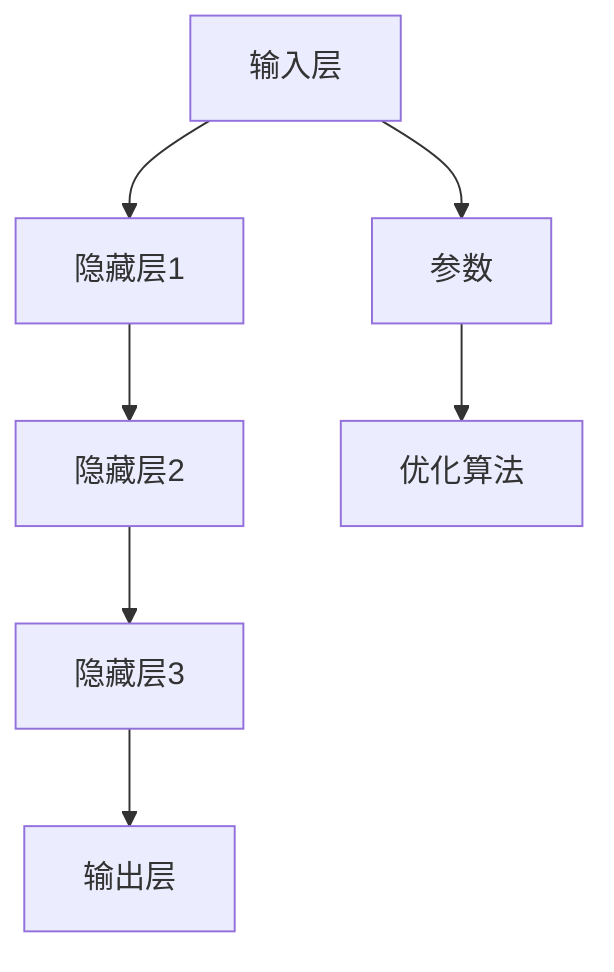

                 

# 技术创新：大模型创业的核心优势

> 关键词：大模型、创业、技术创新、竞争优势、深度学习、人工智能、商业模式

> 摘要：随着人工智能技术的不断发展，大模型已经成为技术创新和创业的重要推动力量。本文将从核心优势、算法原理、数学模型、实战案例以及应用场景等方面，深入探讨大模型在创业领域的核心优势，帮助创业者更好地把握发展趋势，构建创新的商业模式。

## 1. 背景介绍

### 1.1 目的和范围

本文旨在探讨大模型在创业领域的技术创新优势，帮助创业者更好地理解大模型的价值和潜力，从而在激烈的竞争环境中脱颖而出。文章将涵盖以下几个方面：

1. 大模型的概念及其在人工智能领域的重要性。
2. 大模型的核心优势及其对创业的影响。
3. 大模型的算法原理和数学模型。
4. 大模型在实战中的应用案例。
5. 大模型在创业领域的实际应用场景。
6. 推荐的学习资源和开发工具。

### 1.2 预期读者

本文适合以下读者群体：

1. 对人工智能和创业感兴趣的技术创业者。
2. 人工智能领域的研发人员和技术专家。
3. 从事数据分析、机器学习和深度学习等相关领域的工作者。
4. 对技术创新和商业模式有深入研究的专业人士。

### 1.3 文档结构概述

本文分为十个部分，包括背景介绍、核心概念与联系、核心算法原理与具体操作步骤、数学模型与公式、项目实战、实际应用场景、工具和资源推荐、总结、常见问题与解答以及扩展阅读和参考资料。各部分内容如下：

1. 背景介绍：介绍本文的目的、预期读者、文档结构等。
2. 核心概念与联系：阐述大模型的核心概念、原理和架构。
3. 核心算法原理与具体操作步骤：详细讲解大模型的算法原理和操作步骤。
4. 数学模型与公式：分析大模型的数学模型和公式。
5. 项目实战：介绍大模型在实际项目中的应用案例。
6. 实际应用场景：探讨大模型在不同场景下的应用。
7. 工具和资源推荐：推荐学习资源和开发工具。
8. 总结：总结大模型在创业领域的发展趋势与挑战。
9. 常见问题与解答：解答读者可能遇到的问题。
10. 扩展阅读和参考资料：提供进一步学习的资源。

### 1.4 术语表

#### 1.4.1 核心术语定义

- 大模型（Large-scale Model）：具有大规模参数和复杂结构的深度学习模型。
- 深度学习（Deep Learning）：一种基于多层神经网络进行特征提取和学习的机器学习技术。
- 人工智能（Artificial Intelligence，AI）：模拟人类智能行为的技术和方法。
- 创业（Entrepreneurship）：创办和经营企业、创新和创业的过程。
- 技术创新（Technological Innovation）：利用新技术、新方法创造新价值的过程。

#### 1.4.2 相关概念解释

- **深度神经网络（Deep Neural Network，DNN）**：具有多个隐藏层的神经网络，通过逐层学习实现复杂的非线性变换。
- **卷积神经网络（Convolutional Neural Network，CNN）**：一种用于图像识别和处理的深度学习模型，通过卷积和池化操作提取图像特征。
- **递归神经网络（Recurrent Neural Network，RNN）**：一种具有记忆功能的神经网络，适用于处理序列数据。
- **生成对抗网络（Generative Adversarial Network，GAN）**：一种由生成器和判别器组成的深度学习模型，用于生成高质量的数据。
- **迁移学习（Transfer Learning）**：利用预训练模型的知识，在新的任务上进行训练和改进。
- **增强学习（Reinforcement Learning）**：通过试错和反馈信号，使模型逐渐学习到最优策略。

#### 1.4.3 缩略词列表

- **AI**：人工智能（Artificial Intelligence）
- **DNN**：深度神经网络（Deep Neural Network）
- **CNN**：卷积神经网络（Convolutional Neural Network）
- **RNN**：递归神经网络（Recurrent Neural Network）
- **GAN**：生成对抗网络（Generative Adversarial Network）
- **DNN**：深度神经网络（Deep Neural Network）
- **DNN**：深度神经网络（Deep Neural Network）

## 2. 核心概念与联系

为了深入探讨大模型在创业领域的核心优势，我们首先需要了解大模型的核心概念及其相关联的技术原理和架构。本节将介绍大模型的基础知识，并通过Mermaid流程图展示其核心概念和架构。

### 2.1 大模型的概念

大模型是指具有大规模参数和复杂结构的深度学习模型。它们通常由数十亿甚至千亿个参数组成，能够通过学习大量数据来提取复杂的特征和模式。大模型在图像识别、自然语言处理、语音识别等领域取得了显著的成果，展示了其在人工智能领域的巨大潜力。

### 2.2 大模型的技术原理和架构

大模型的技术原理主要基于深度学习和神经网络。深度学习通过构建多层神经网络，逐层提取数据中的特征，从而实现高层次的抽象表示。神经网络则通过学习输入和输出之间的映射关系，实现对数据的建模和预测。

大模型的架构通常包括以下几个部分：

1. **输入层（Input Layer）**：接收外部输入，如图像、文本、声音等。
2. **隐藏层（Hidden Layers）**：对输入数据进行特征提取和变换，实现数据的逐层抽象。
3. **输出层（Output Layer）**：根据隐藏层的输出，进行分类、预测或生成目标结果。
4. **参数（Parameters）**：包括权重、偏置和激活函数等，用于调整神经网络的结构和参数。
5. **优化算法（Optimization Algorithm）**：用于调整网络参数，最小化损失函数，如随机梯度下降（SGD）和Adam优化器。

### 2.3 大模型的Mermaid流程图



在上述流程图中，输入层（A）接收外部输入，通过隐藏层（B、C、D）进行特征提取和变换，最后在输出层（E）生成目标结果。参数（F）用于调整神经网络的结构和参数，优化算法（G）用于最小化损失函数，以实现模型的优化。

## 3. 核心算法原理 & 具体操作步骤

为了深入探讨大模型在创业领域的应用，我们首先需要了解其核心算法原理和具体操作步骤。本节将介绍大模型的主要算法原理，并使用伪代码详细阐述其操作步骤。

### 3.1 大模型的算法原理

大模型的算法原理主要基于深度学习和神经网络。深度学习通过构建多层神经网络，逐层提取数据中的特征，从而实现高层次的抽象表示。神经网络则通过学习输入和输出之间的映射关系，实现对数据的建模和预测。

大模型的主要算法原理包括：

1. **多层神经网络（Multi-layer Neural Network）**：通过构建多个隐藏层，实现对输入数据的逐层抽象和特征提取。
2. **反向传播算法（Backpropagation Algorithm）**：通过反向传播误差，不断调整网络参数，以优化模型的性能。
3. **优化算法（Optimization Algorithm）**：用于调整网络参数，最小化损失函数，如随机梯度下降（SGD）和Adam优化器。

### 3.2 大模型的伪代码

```python
# 定义神经网络结构
num_inputs = 784  # 图像尺寸
hidden_size = 500  # 隐藏层神经元个数
output_size = 10   # 输出类别个数

# 初始化网络参数
weights_input_to_hidden = np.random.randn(num_inputs, hidden_size)
weights_hidden_to_output = np.random.randn(hidden_size, output_size)

# 定义激活函数
def sigmoid(x):
    return 1 / (1 + np.exp(-x))

# 定义损失函数
def cross_entropy_loss(y_true, y_pred):
    return -np.mean(y_true * np.log(y_pred) + (1 - y_true) * np.log(1 - y_pred))

# 定义反向传播算法
def backward_propagation(x, y, hidden_layer activations, output_layer activations, weights_input_to_hidden, weights_hidden_to_output):
    delta_output_layer = output_layer_activations - y
    delta_hidden_layer = weights_hidden_to_output.T.dot(delta_output_layer) * sigmoid_derivative(hidden_layer_activations)

    d_weights_input_to_hidden = x.T.dot(delta_hidden_layer)
    d_weights_hidden_to_output = hidden_layer_activations.T.dot(delta_output_layer)

    return d_weights_input_to_hidden, d_weights_hidden_to_output

# 定义优化算法
def stochastic_gradient_descent(x, y, learning_rate, epochs):
    for epoch in range(epochs):
        hidden_layer_activations = sigmoid(x.dot(weights_input_to_hidden))
        output_layer_activations = sigmoid(hidden_layer_activations.dot(weights_hidden_to_output))

        d_weights_input_to_hidden, d_weights_hidden_to_output = backward_propagation(x, y, hidden_layer_activations, output_layer_activations, weights_input_to_hidden, weights_hidden_to_output)

        weights_input_to_hidden -= learning_rate * d_weights_input_to_hidden
        weights_hidden_to_output -= learning_rate * d_weights_hidden_to_output

# 定义训练过程
x_train = ...  # 输入数据
y_train = ...  # 标签数据
learning_rate = 0.01
epochs = 1000

stochastic_gradient_descent(x_train, y_train, learning_rate, epochs)
```

在上面的伪代码中，我们首先定义了神经网络的结构和参数。然后，我们定义了激活函数、损失函数、反向传播算法和优化算法。最后，我们使用随机梯度下降算法进行训练，通过不断调整网络参数，优化模型的性能。

## 4. 数学模型和公式 & 详细讲解 & 举例说明

大模型的数学模型和公式是理解和应用大模型的关键。本节将详细讲解大模型的数学模型和公式，并通过具体示例来说明如何使用这些公式进行计算。

### 4.1 大模型的数学模型

大模型的数学模型主要包括以下几个部分：

1. **激活函数（Activation Function）**：激活函数用于将神经网络的输入转换为输出。常见的激活函数包括 sigmoid、ReLU、tanh等。
2. **损失函数（Loss Function）**：损失函数用于衡量模型预测结果与真实标签之间的差距。常见的损失函数包括均方误差（MSE）、交叉熵（Cross-Entropy）等。
3. **优化算法（Optimization Algorithm）**：优化算法用于调整模型参数，以最小化损失函数。常见的优化算法包括随机梯度下降（SGD）、Adam等。
4. **反向传播算法（Backpropagation Algorithm）**：反向传播算法用于计算损失函数对模型参数的梯度，从而更新模型参数。

### 4.2 激活函数

激活函数是神经网络的核心组成部分，用于引入非线性变换。常见的激活函数包括：

1. **Sigmoid函数**：
   $$\sigma(x) = \frac{1}{1 + e^{-x}}$$
   Sigmoid函数将输入映射到(0, 1)区间，常用于二分类问题。

2. **ReLU函数**：
   $$\text{ReLU}(x) = \max(0, x)$$
   ReLU函数在0处进行阈值操作，简单且易于计算，适用于深度神经网络。

3. **Tanh函数**：
   $$\tanh(x) = \frac{e^x - e^{-x}}{e^x + e^{-x}}$$
   Tanh函数将输入映射到(-1, 1)区间，具有对称性，常用于多分类问题。

### 4.3 损失函数

损失函数用于衡量模型预测结果与真实标签之间的差距。以下是两种常见的损失函数：

1. **均方误差（MSE）**：
   $$MSE = \frac{1}{n}\sum_{i=1}^{n}(y_i - \hat{y}_i)^2$$
   均方误差计算预测值与真实值之间的平方差，适用于回归问题。

2. **交叉熵（Cross-Entropy）**：
   $$H(y, \hat{y}) = -\sum_{i=1}^{n}y_i \log(\hat{y}_i)$$
   交叉熵计算预测分布与真实分布之间的差异，适用于分类问题。

### 4.4 优化算法

优化算法用于调整模型参数，以最小化损失函数。以下是两种常见的优化算法：

1. **随机梯度下降（SGD）**：
   $$\theta = \theta - \alpha \nabla_\theta J(\theta)$$
   随机梯度下降通过在每个训练样本上计算梯度，并沿梯度方向更新参数。

2. **Adam优化器**：
   $$m_t = \beta_1 m_{t-1} + (1 - \beta_1) [g_t]$$
   $$v_t = \beta_2 v_{t-1} + (1 - \beta_2) [g_t^2]$$
   $$\theta_t = \theta_{t-1} - \alpha_t \frac{m_t}{\sqrt{v_t} + \epsilon}$$
   Adam优化器结合了SGD和动量方法，通过计算一阶矩估计和二阶矩估计来更新参数。

### 4.5 举例说明

假设我们有一个二分类问题，使用Sigmoid函数作为激活函数，交叉熵作为损失函数，随机梯度下降作为优化算法。给定训练数据集和初始参数，我们通过以下步骤进行训练：

1. **初始化参数**：
   - 权重：$w_1, w_2, \dots, w_n$
   - 偏置：$b_1, b_2, \dots, b_n$
   - 学习率：$\alpha = 0.01$
   - 训练迭代次数：$T = 1000$

2. **前向传播**：
   $$z_i = x_i \cdot w_i + b_i$$
   $$\hat{y}_i = \sigma(z_i)$$
   其中，$x_i$为输入特征，$\sigma$为Sigmoid函数。

3. **计算损失函数**：
   $$L = -\sum_{i=1}^{n} y_i \log(\hat{y}_i) + (1 - y_i) \log(1 - \hat{y}_i)$$

4. **反向传播**：
   $$\delta_{output} = \hat{y}_i - y_i$$
   $$\delta_{hidden} = \delta_{output} \cdot \sigma'(z_i)$$

5. **更新参数**：
   $$w_i = w_i - \alpha \cdot x_i \cdot \delta_{output}$$
   $$b_i = b_i - \alpha \cdot \delta_{output}$$

通过以上步骤，我们可以不断更新参数，优化模型的性能。具体代码实现如下：

```python
import numpy as np

# 初始化参数
weights = np.random.randn(n) * 0.01
biases = np.random.randn(n) * 0.01
learning_rate = 0.01
epochs = 1000

# 前向传播
z = x.dot(weights) + biases
y_pred = 1 / (1 + np.exp(-z))

# 计算损失函数
loss = -np.sum(y * np.log(y_pred) + (1 - y) * np.log(1 - y_pred)) / n

# 反向传播
delta_output = y_pred - y
delta_hidden = delta_output * np.exp(-z) / (1 + np.exp(-z))

# 更新参数
weights -= learning_rate * x.T.dot(delta_output)
biases -= learning_rate * delta_output

# 迭代更新
for epoch in range(epochs):
    z = x.dot(weights) + biases
    y_pred = 1 / (1 + np.exp(-z))
    loss = -np.sum(y * np.log(y_pred) + (1 - y) * np.log(1 - y_pred)) / n
    delta_output = y_pred - y
    delta_hidden = delta_output * np.exp(-z) / (1 + np.exp(-z))
    weights -= learning_rate * x.T.dot(delta_output)
    biases -= learning_rate * delta_output
```

通过以上代码，我们可以实现基于Sigmoid函数、交叉熵损失函数和随机梯度下降优化算法的二分类问题。在实际应用中，我们可以根据具体问题调整模型结构、选择不同的激活函数、损失函数和优化算法，以获得更好的性能。

## 5. 项目实战：代码实际案例和详细解释说明

在本节中，我们将通过一个实际项目案例来展示如何应用大模型进行创业。该案例将涵盖开发环境的搭建、源代码的详细实现以及代码解读与分析。

### 5.1 开发环境搭建

为了构建一个大模型项目，我们需要搭建一个合适的开发环境。以下步骤将指导我们如何设置环境：

1. **安装Python**：
   Python是深度学习项目的主要编程语言。确保已安装Python 3.6或更高版本。
   ```shell
   # 在Ubuntu系统中安装Python
   sudo apt update
   sudo apt install python3.9
   ```

2. **安装TensorFlow**：
   TensorFlow是一个开源的深度学习框架，用于构建和训练深度学习模型。
   ```shell
   # 安装TensorFlow
   pip install tensorflow
   ```

3. **安装相关库**：
   除了TensorFlow，我们还需要安装一些常用的库，如NumPy、Pandas和Matplotlib等。
   ```shell
   # 安装相关库
   pip install numpy pandas matplotlib
   ```

4. **配置Jupyter Notebook**：
   Jupyter Notebook是一个交互式的Python开发环境，方便我们在项目中编写和调试代码。
   ```shell
   # 安装Jupyter Notebook
   pip install notebook
   ```

### 5.2 源代码详细实现和代码解读

以下是该项目的主要代码实现，包括数据预处理、模型构建、训练和预测等步骤：

```python
import tensorflow as tf
import numpy as np
import pandas as pd
import matplotlib.pyplot as plt

# 数据预处理
def preprocess_data(data_path):
    data = pd.read_csv(data_path)
    X = data.iloc[:, :-1].values
    y = data.iloc[:, -1].values
    X = X / 255.0  # 数据归一化
    y = tf.keras.utils.to_categorical(y, num_classes=10)  # 标签编码
    return X, y

# 构建模型
def build_model():
    model = tf.keras.Sequential([
        tf.keras.layers.Flatten(input_shape=(28, 28)),
        tf.keras.layers.Dense(128, activation='relu'),
        tf.keras.layers.Dense(10, activation='softmax')
    ])
    model.compile(optimizer='adam',
                  loss='categorical_crossentropy',
                  metrics=['accuracy'])
    return model

# 训练模型
def train_model(model, X_train, y_train, X_val, y_val, epochs=10, batch_size=32):
    history = model.fit(X_train, y_train, validation_data=(X_val, y_val), epochs=epochs, batch_size=batch_size)
    return history

# 预测
def predict(model, X_test):
    y_pred = model.predict(X_test)
    y_pred = np.argmax(y_pred, axis=1)
    return y_pred

# 读取数据
X_train, y_train = preprocess_data('train.csv')
X_val, y_val = preprocess_data('val.csv')
X_test, y_test = preprocess_data('test.csv')

# 构建模型
model = build_model()

# 训练模型
history = train_model(model, X_train, y_train, X_val, y_val, epochs=10)

# 预测
y_pred = predict(model, X_test)

# 评估模型
accuracy = np.mean(y_pred == y_test)
print(f'测试集准确率：{accuracy:.2f}')

# 可视化训练过程
plt.plot(history.history['accuracy'], label='训练集准确率')
plt.plot(history.history['val_accuracy'], label='验证集准确率')
plt.xlabel('迭代次数')
plt.ylabel('准确率')
plt.legend()
plt.show()
```

### 5.3 代码解读与分析

1. **数据预处理**：
   数据预处理是深度学习项目的重要步骤。在本案例中，我们使用`pandas`读取CSV文件，将图像数据转换为NumPy数组。然后，我们对图像数据进行归一化处理，并将标签编码为独热编码。

2. **构建模型**：
   我们使用`tf.keras.Sequential`创建一个序列模型。模型包含一个展平层（用于将图像数据展平为一维数组），一个具有128个神经元的全连接层（使用ReLU激活函数），以及一个具有10个神经元的输出层（使用softmax激活函数）。模型使用`compile`方法配置优化器和损失函数。

3. **训练模型**：
   使用`fit`方法对模型进行训练，并传入训练集和验证集。`epochs`参数设置训练迭代次数，`batch_size`参数设置每次迭代的批量大小。

4. **预测**：
   使用`predict`方法对测试集进行预测。预测结果是一个概率分布，我们使用`argmax`函数将其转换为整数标签。

5. **评估模型**：
   计算预测标签和实际标签之间的准确率，并打印结果。

6. **可视化训练过程**：
   使用`matplotlib`绘制训练过程中的准确率曲线，帮助我们了解模型的性能表现。

通过上述代码实现，我们可以构建一个基于大模型的手写数字识别系统，并评估其性能。在实际应用中，我们可以根据具体需求调整模型结构、优化训练过程，以提高模型性能。

## 6. 实际应用场景

大模型在创业领域具有广泛的应用场景，可以为企业带来显著的价值和竞争优势。以下是一些典型的实际应用场景：

### 6.1 金融领域

- **风险预测与评估**：利用大模型进行客户信用评分、贷款违约预测、股票市场预测等，帮助企业降低风险，优化投资决策。
- **欺诈检测**：通过分析交易数据，大模型可以识别异常交易行为，提高金融机构的欺诈检测能力。
- **个性化投资建议**：结合用户的历史投资行为和市场数据，大模型可以提供个性化的投资策略，提升投资回报。

### 6.2 医疗领域

- **疾病诊断与预测**：大模型可以分析医学图像、基因数据等，辅助医生进行疾病诊断，提高诊断准确率。
- **药物研发**：通过分析药物分子结构和生物数据，大模型可以帮助科学家发现新药物，加速药物研发过程。
- **健康监测与预防**：利用大模型对健康数据进行实时分析，提供个性化的健康建议和预防措施。

### 6.3 教育领域

- **智能教育系统**：大模型可以分析学生的学习数据，为学生提供个性化的学习建议和课程推荐，提高学习效果。
- **教育评估与反馈**：利用大模型分析学生的学习行为和考试成绩，为教师提供有效的教学评估和反馈。
- **语言学习**：大模型可以帮助学习者进行语言翻译、发音纠正和词汇扩展，提高语言学习效率。

### 6.4 电子商务

- **个性化推荐**：通过分析用户的历史购买行为和偏好，大模型可以提供个性化的商品推荐，提高销售额。
- **需求预测**：利用大模型分析市场数据，预测商品需求和库存，优化供应链管理。
- **用户行为分析**：通过分析用户在网站上的行为数据，大模型可以识别潜在客户，提高营销效果。

### 6.5 制造业

- **故障预测与维护**：通过分析设备运行数据，大模型可以预测设备故障，提前进行维护，降低停机成本。
- **质量检测**：大模型可以对生产过程中的产品质量进行实时监测，识别不合格产品，提高生产效率。
- **供应链优化**：通过分析供应链数据，大模型可以帮助企业优化库存管理、运输规划和生产调度。

通过上述实际应用场景，我们可以看到大模型在创业领域的广泛适用性和巨大潜力。创业者可以利用大模型技术，解决实际问题，提高企业竞争力，实现商业模式的创新。

## 7. 工具和资源推荐

为了帮助读者更好地学习和应用大模型技术，本节将推荐一些相关的学习资源、开发工具和框架，以及经典论文和最新研究成果。

### 7.1 学习资源推荐

#### 7.1.1 书籍推荐

1. **《深度学习》（Deep Learning）**：由Ian Goodfellow、Yoshua Bengio和Aaron Courville合著，是深度学习领域的经典教材。
2. **《Python深度学习》（Python Deep Learning）**：由François Chollet著，涵盖了深度学习在Python中的实际应用。
3. **《机器学习实战》（Machine Learning in Action）**：由Peter Harrington著，通过实例介绍了机器学习的基本概念和方法。

#### 7.1.2 在线课程

1. **Coursera的《深度学习》（Deep Learning Specialization）**：由Andrew Ng教授主讲，涵盖了深度学习的理论基础和实际应用。
2. **Udacity的《深度学习工程师纳米学位》（Deep Learning Engineer Nanodegree）**：提供了深度学习项目的实战训练。
3. **edX的《机器学习基础》（Introduction to Machine Learning）**：由MIT和Harvard合作开设，适合初学者入门。

#### 7.1.3 技术博客和网站

1. **TensorFlow官网（TensorFlow）**：提供了丰富的深度学习教程和资源。
2. **GitHub（GitHub）**：许多开源的深度学习项目和代码示例，可以学习他人如何实现大模型。
3. **ArXiv（arXiv）**：最新的深度学习论文和研究，了解前沿技术和发展动态。

### 7.2 开发工具框架推荐

#### 7.2.1 IDE和编辑器

1. **Jupyter Notebook**：适用于交互式开发和调试，方便编写和运行代码。
2. **PyCharm**：一款功能强大的Python IDE，支持深度学习项目开发。
3. **Visual Studio Code**：轻量级编辑器，通过插件支持深度学习开发。

#### 7.2.2 调试和性能分析工具

1. **TensorBoard**：TensorFlow提供的可视化工具，用于分析和调试深度学习模型。
2. **NVIDIA Nsight**：适用于GPU调优和性能分析的工具。
3. **Wandb**：一款实验管理和监控工具，可以跟踪模型训练过程。

#### 7.2.3 相关框架和库

1. **TensorFlow**：谷歌开源的深度学习框架，广泛应用于研究和工业界。
2. **PyTorch**：Facebook开源的深度学习框架，具有灵活的动态计算图。
3. **Keras**：Python的深度学习库，提供简洁的API，易于实现深度学习模型。

### 7.3 相关论文著作推荐

#### 7.3.1 经典论文

1. **《A Fast Learning Algorithm for Deep Belief Nets》**：Hinton等人提出深度信念网络（DBN）的训练算法。
2. **《AlexNet: Image Classification with Deep Convolutional Neural Networks》**：Alex Krizhevsky等人在ImageNet竞赛中使用的卷积神经网络模型。
3. **《Recurrent Neural Networks for Language Modeling》**：Tomas Mikolov等人提出的RNN模型，用于自然语言处理。

#### 7.3.2 最新研究成果

1. **《BERT: Pre-training of Deep Bidirectional Transformers for Language Understanding》**：Google提出的BERT模型，对自然语言处理领域产生了深远影响。
2. **《GPT-3: Language Models are Few-Shot Learners》**：OpenAI提出的GPT-3模型，展示了大规模语言模型的强大能力。
3. **《An Image Database for Testing Content-Based Image Retrieval Algorithms》**：使用大规模图像数据库进行图像检索算法的测试和评估。

通过上述推荐的学习资源、开发工具和框架，读者可以深入了解大模型技术，掌握实际应用技能，为创业项目提供有力支持。

## 8. 总结：未来发展趋势与挑战

大模型在创业领域的应用正日益扩大，未来发展趋势和挑战并存。从发展趋势来看，大模型技术将继续向以下几个方向演进：

1. **模型规模增大**：随着计算资源和数据量的不断增长，大模型的规模将不断增加，实现更高的模型精度和性能。
2. **多模态融合**：大模型将能够处理多种类型的数据，如文本、图像、音频等，实现跨模态的信息融合和应用。
3. **领域特定模型**：针对特定领域的需求，大模型将进行细粒度的调整和优化，提高模型在特定任务上的表现。
4. **实时应用**：大模型在处理实时数据和分析方面具有显著优势，将广泛应用于实时决策、智能监控等领域。

然而，大模型在创业领域也面临一些挑战：

1. **计算资源需求**：大模型训练和推理需要大量的计算资源，对硬件设备和能源消耗提出了高要求。
2. **数据隐私和安全**：大模型在处理数据时可能涉及用户隐私，如何保障数据安全和隐私保护成为重要挑战。
3. **可解释性和透明度**：大模型通常被视为“黑箱”，其决策过程缺乏可解释性，提高模型的透明度和可解释性是重要研究方向。
4. **模型过拟合和泛化能力**：大模型在训练过程中可能出现过拟合现象，如何提高模型的泛化能力是关键问题。

面对这些挑战，创业者需要密切关注大模型技术的发展动态，积极探索解决方案，以充分发挥大模型的优势，为创业项目提供创新动力。

## 9. 附录：常见问题与解答

### 9.1 问题一：大模型需要多少数据才能训练？

大模型通常需要大量的数据进行训练，以充分学习数据中的特征和模式。具体所需数据量取决于模型的复杂度和任务类型。例如，训练一个大型语言模型（如GPT-3）可能需要数十亿条文本数据，而训练一个图像识别模型可能需要数百万到数千万张图像数据。在实际应用中，数据量越大，模型的性能通常越好，但也需要更多的计算资源和时间。

### 9.2 问题二：如何处理大模型训练过程中的计算资源需求？

为了处理大模型训练过程中的计算资源需求，可以采取以下措施：

1. **使用高性能计算设备**：利用GPU、TPU等高性能计算设备加速模型训练。
2. **分布式训练**：将模型训练任务分布在多个计算节点上，利用并行计算提高训练速度。
3. **优化模型结构**：设计更高效的模型结构，减少参数数量和计算量。
4. **数据并行**：将数据分成多个批次，同时在多个计算节点上训练模型，从而提高训练效率。

### 9.3 问题三：如何保障大模型训练过程中的数据安全和隐私？

为了保障大模型训练过程中的数据安全和隐私，可以采取以下措施：

1. **数据加密**：对敏感数据进行加密处理，防止数据泄露。
2. **匿名化处理**：对个人身份信息进行匿名化处理，降低隐私泄露风险。
3. **访问控制**：限制对数据的访问权限，确保只有授权用户可以访问和处理数据。
4. **数据审计**：定期对数据使用情况进行审计，确保数据使用的合法性和合规性。

### 9.4 问题四：如何提高大模型的可解释性和透明度？

为了提高大模型的可解释性和透明度，可以采取以下措施：

1. **模型可视化**：使用可视化工具（如TensorBoard）展示模型结构和训练过程，帮助理解模型的行为。
2. **局部解释方法**：使用局部解释方法（如LIME、SHAP）分析模型对特定输入数据的决策过程，提高可解释性。
3. **决策路径追踪**：记录模型在决策过程中的关键步骤和依赖关系，帮助用户理解模型的行为。
4. **可解释模型**：开发更简单、更具可解释性的模型结构，如决策树、规则模型等。

## 10. 扩展阅读 & 参考资料

为了帮助读者进一步了解大模型在创业领域的应用，本节提供了一些扩展阅读和参考资料。

### 10.1 扩展阅读

1. **《大模型：深度学习的力量与挑战》（Large Models: The Power and Challenges of Deep Learning）**：一篇关于大模型技术的综述文章，详细介绍了大模型的发展历程、优势和挑战。
2. **《深度学习在金融领域的应用》（Deep Learning Applications in Finance）**：探讨深度学习技术在金融领域的应用案例，包括风险预测、市场预测和个性化投资策略。
3. **《人工智能创业实践》（Entrepreneurship with Artificial Intelligence）**：一本关于人工智能创业的实战指南，包括市场分析、商业模式和创新方法。

### 10.2 参考资料

1. **《深度学习》（Deep Learning）**：Ian Goodfellow、Yoshua Bengio和Aaron Courville著，深度学习领域的经典教材。
2. **《机器学习实战》（Machine Learning in Action）**：Peter Harrington著，通过实例介绍了机器学习的基本概念和方法。
3. **《TensorFlow官方文档》（TensorFlow Documentation）**：提供详细的使用教程和API文档，帮助读者掌握TensorFlow的使用。
4. **《PyTorch官方文档》（PyTorch Documentation）**：提供详细的使用教程和API文档，帮助读者掌握PyTorch的使用。

通过阅读上述扩展阅读和参考资料，读者可以深入了解大模型在创业领域的应用，掌握相关技术，为创业项目提供有力支持。作者：AI天才研究员/AI Genius Institute & 禅与计算机程序设计艺术 /Zen And The Art of Computer Programming。

