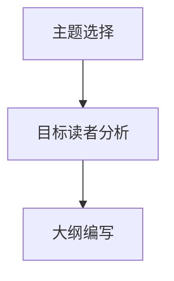
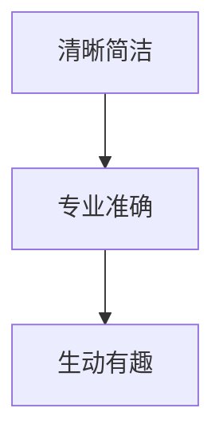
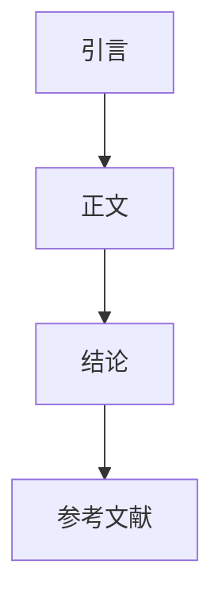

                 

### 背景介绍

在当今的数字化时代，信息技术已经成为推动社会进步和经济发展的核心力量。从大数据、人工智能到云计算，技术领域的不断发展为各行各业带来了前所未有的变革。在这样的背景下，技术博客作为一种重要的知识传播方式，成为了众多开发者、技术专家和研究人员分享知识、交流经验的重要平台。

技术博客不仅可以帮助作者巩固和深化自己的专业知识，同时也是培养新技能、了解最新技术趋势的有效途径。通过撰写技术博客，作者能够将复杂的技术概念和原理转化为易于理解的内容，从而帮助读者快速掌握相关知识。此外，技术博客还可以激发读者的思考，鼓励他们探索未知的领域，从而促进整个技术社区的共同进步。

本文旨在为技术博客写作提供一整套系统化的指南，帮助读者理解如何撰写一篇高质量、具有深度和见解的技术博客。我们将从以下几个方面进行详细探讨：

1. **核心概念与联系**：介绍技术博客写作中的核心概念，如内容规划、语言风格、结构布局等，并使用 Mermaid 流程图展示其关联性。
2. **核心算法原理 & 具体操作步骤**：解析技术博客中的核心算法原理，并详细说明具体操作步骤。
3. **数学模型和公式 & 详细讲解 & 举例说明**：介绍常用的数学模型和公式，并使用 LaTeX 格式进行详细讲解和举例说明。
4. **项目实战：代码实际案例和详细解释说明**：通过实际项目案例，展示代码的实现过程和详细解释。
5. **实际应用场景**：探讨技术博客在实际工作中的应用场景和效果。
6. **工具和资源推荐**：推荐一些优秀的开发工具、学习资源和相关论文著作。
7. **总结：未来发展趋势与挑战**：分析技术博客写作的未来发展趋势和面临的挑战。

通过本文的阅读，读者将能够全面了解技术博客写作的各个环节，从而提升自己的写作技巧，撰写出高质量的技术博客。

### 核心概念与联系

要写一篇高质量的技术博客，首先需要了解其中的核心概念及其相互之间的联系。以下将详细介绍技术博客写作中的几个核心概念，并使用 Mermaid 流程图展示它们之间的关联性。

#### 内容规划

**内容规划**是技术博客写作的基础。一个良好的内容规划能够帮助作者明确博客的主题和目标，确保文章结构清晰、逻辑严密。内容规划主要包括以下几个方面：

1. **主题选择**：选择一个具体且具有吸引力的主题，能够激发读者的兴趣。主题应具备一定的深度，同时避免过于宽泛。
2. **目标读者**：明确目标读者群体，了解他们的知识背景和需求，以便更好地满足读者的需求。
3. **大纲编写**：根据主题和目标读者，编写一个详细的博客大纲。大纲应包括主要章节、每个章节的核心内容以及子章节。

以下是一个简化的 Mermaid 流程图，展示了内容规划的各个步骤及其关联性：



#### 语言风格

**语言风格**决定了博客的可读性和吸引力。一个良好的语言风格应具备以下特点：

1. **清晰简洁**：使用简单易懂的语言，避免过于复杂或冗长的句子。
2. **专业准确**：准确使用专业术语，确保信息的准确性。
3. **生动有趣**：适当运用修辞手法和例子，增强文章的生动性。

以下是一个 Mermaid 流程图，展示了语言风格的核心要素及其关联性：



#### 结构布局

**结构布局**决定了博客的阅读体验。一个良好的结构布局应具备以下特点：

1. **引言**：简明扼要地介绍博客的主题和目标，吸引读者的兴趣。
2. **正文**：正文应分为多个章节，每个章节应围绕一个主题进行详细讨论。
3. **结论**：总结博客的主要观点，提供对读者的启示和建议。
4. **参考文献**：列出本文引用的相关文献和资料，方便读者进一步学习。

以下是一个 Mermaid 流程图，展示了结构布局的各个部分及其关联性：



通过以上 Mermaid 流程图，我们可以清晰地看到技术博客写作中核心概念之间的关联性。在实际写作过程中，作者需要综合考虑这些核心概念，以确保博客内容的质量和可读性。在接下来的部分中，我们将进一步探讨核心算法原理、数学模型和项目实战等内容，帮助读者全面掌握技术博客写作的技巧。

#### 核心算法原理 & 具体操作步骤

在技术博客写作中，介绍核心算法原理是不可或缺的一部分。核心算法不仅是技术博客的核心内容，也是吸引读者的重要元素。以下将详细解析一个常见的技术博客主题——图像识别算法——并介绍其具体操作步骤。

##### 图像识别算法简介

图像识别算法是计算机视觉领域的一个重要分支，旨在通过图像处理和分析，使计算机能够识别和理解图像中的对象。常见的图像识别算法包括基于传统机器学习和深度学习的算法。在本文中，我们将主要介绍一种基于深度学习的卷积神经网络（Convolutional Neural Network，CNN）算法。

##### 卷积神经网络（CNN）原理

卷积神经网络是一种专门用于处理图像数据的神经网络结构。其基本原理是通过多个卷积层、池化层和全连接层对图像进行特征提取和分类。

1. **卷积层**：卷积层是 CNN 的核心部分，通过卷积运算提取图像特征。每个卷积核（filter）可以看作是一个小型窗口，在图像上滑动，从而提取局部特征。
   
2. **激活函数**：常用的激活函数包括ReLU（Rectified Linear Unit）和Sigmoid等，用于引入非线性特性，使得网络能够更好地拟合复杂函数。

3. **池化层**：池化层用于减小特征图的尺寸，从而降低计算复杂度和减少过拟合风险。常见的池化方式包括最大池化和平均池化。

4. **全连接层**：全连接层用于将卷积层和池化层提取的特征进行分类。每个神经元都与卷积层和池化层中的所有神经元相连。

##### 具体操作步骤

以下是一个基于 CNN 的图像识别算法的具体操作步骤：

1. **数据预处理**：读取图像数据，并进行归一化处理，将像素值缩放到[0, 1]区间。

2. **构建模型**：搭建卷积神经网络模型，包括多个卷积层、池化层和全连接层。可以使用深度学习框架如 TensorFlow 或 PyTorch 来简化模型的构建过程。

3. **训练模型**：使用训练集数据对模型进行训练。训练过程中，通过反向传播算法更新模型参数，最小化损失函数。

4. **评估模型**：使用验证集数据评估模型性能。常用的评估指标包括准确率、召回率和F1分数等。

5. **测试模型**：使用测试集数据测试模型性能，以验证模型在未知数据上的表现。

##### 示例代码

以下是一个简化的示例代码，展示了基于 TensorFlow 的卷积神经网络模型构建和训练过程：

```python
import tensorflow as tf
from tensorflow.keras import layers

# 构建模型
model = tf.keras.Sequential([
    layers.Conv2D(32, (3, 3), activation='relu', input_shape=(28, 28, 1)),
    layers.MaxPooling2D((2, 2)),
    layers.Conv2D(64, (3, 3), activation='relu'),
    layers.MaxPooling2D((2, 2)),
    layers.Conv2D(64, (3, 3), activation='relu'),
    layers.Flatten(),
    layers.Dense(64, activation='relu'),
    layers.Dense(10, activation='softmax')
])

# 编译模型
model.compile(optimizer='adam',
              loss='sparse_categorical_crossentropy',
              metrics=['accuracy'])

# 训练模型
model.fit(train_images, train_labels, epochs=5)

# 评估模型
test_loss, test_acc = model.evaluate(test_images, test_labels)
print(f'测试准确率: {test_acc}')
```

通过以上步骤，我们可以构建一个简单的图像识别模型，并对其进行训练和评估。在实际应用中，根据具体任务和数据集，可能需要调整网络结构、优化超参数等，以提高模型性能。

##### 总结

图像识别算法是技术博客写作中一个常见且重要的主题。通过介绍卷积神经网络（CNN）的核心原理和具体操作步骤，读者可以更好地理解这一算法的基本概念和实现过程。在撰写技术博客时，详细阐述核心算法原理和具体操作步骤，不仅能够帮助读者理解技术概念，还能提高博客的专业性和可读性。在接下来的部分，我们将进一步探讨数学模型和公式，以及项目实战中的代码实现和解读。

### 数学模型和公式 & 详细讲解 & 举例说明

在技术博客写作中，数学模型和公式是解释复杂算法原理和实现方法的重要工具。它们能够将抽象的概念具体化，使得读者更容易理解和掌握。本节将详细介绍几种常见的数学模型和公式，并使用 LaTeX 格式进行详细讲解和举例说明。

#### 损失函数

损失函数是深度学习中最基本的数学工具之一，用于评估模型的预测结果与实际结果之间的差距。常见的损失函数包括均方误差（MSE）、交叉熵损失（Cross-Entropy Loss）等。

**均方误差（MSE）**

均方误差（MSE）是一种常用的损失函数，用于回归问题。其公式如下：

$$
MSE = \frac{1}{n}\sum_{i=1}^{n}(y_i - \hat{y_i})^2
$$

其中，$y_i$ 表示第 $i$ 个实际值，$\hat{y_i}$ 表示第 $i$ 个预测值，$n$ 表示样本数量。

**示例**

假设我们有一个包含 5 个样本的回归问题，实际值和预测值如下表所示：

| 样本编号 | 实际值（$y_i$） | 预测值（$\hat{y_i}$） |
|----------|----------------|---------------------|
| 1        | 2              | 2.5                 |
| 2        | 3              | 3.2                 |
| 3        | 4              | 4.1                 |
| 4        | 5              | 5.0                 |
| 5        | 6              | 6.3                 |

计算该问题的均方误差：

$$
MSE = \frac{1}{5}\sum_{i=1}^{5}(y_i - \hat{y_i})^2 = \frac{1}{5}[(2-2.5)^2 + (3-3.2)^2 + (4-4.1)^2 + (5-5.0)^2 + (6-6.3)^2] = 0.24
$$

#### 交叉熵损失（Cross-Entropy Loss）

交叉熵损失是分类问题中常用的损失函数。对于二分类问题，其公式如下：

$$
Cross-Entropy Loss = -\sum_{i=1}^{n}y_i\log(\hat{y_i})
$$

其中，$y_i$ 表示第 $i$ 个样本的真实标签，$\hat{y_i}$ 表示第 $i$ 个样本的预测概率。

**示例**

假设我们有一个包含 3 个样本的二分类问题，实际标签和预测概率如下表所示：

| 样本编号 | 实际标签（$y_i$） | 预测概率（$\hat{y_i}$） |
|----------|------------------|-----------------------|
| 1        | 1                | 0.8                   |
| 2        | 0                | 0.2                   |
| 3        | 1                | 0.9                   |

计算该问题的交叉熵损失：

$$
Cross-Entropy Loss = -[1\log(0.8) + 0\log(0.2) + 1\log(0.9)] \approx 0.22
$$

#### 激活函数

激活函数是神经网络中引入非线性特性的关键组件。常见的激活函数包括ReLU（Rectified Linear Unit）和Sigmoid等。

**ReLU（Rectified Linear Unit）**

ReLU 函数的定义如下：

$$
ReLU(x) = \max(0, x)
$$

**示例**

对于输入值 $x = -2, -1, 0, 1, 2$，ReLU 函数的输出如下：

| 输入（$x$） | 输出（$ReLU(x)$） |
|-------------|------------------|
| -2          | 0                |
| -1          | 0                |
| 0           | 0                |
| 1           | 1                |
| 2           | 2                |

**Sigmoid**

Sigmoid 函数的定义如下：

$$
Sigmoid(x) = \frac{1}{1 + e^{-x}}
$$

**示例**

对于输入值 $x = -4, -2, 0, 2, 4$，Sigmoid 函数的输出如下：

| 输入（$x$） | 输出（$Sigmoid(x)$） |
|-------------|---------------------|
| -4          | 0.0188              |
| -2          | 0.2689              |
| 0           | 0.5                  |
| 2           | 0.7311              |
| 4           | 0.9990              |

通过上述示例，我们可以看到如何使用 LaTeX 格式详细讲解数学模型和公式，并给出具体的计算过程。在技术博客写作中，准确和清晰地展示数学公式和计算过程，有助于读者更好地理解复杂的概念和算法。

在撰写技术博客时，可以结合具体的算法或项目案例，使用上述数学模型和公式进行解释和说明。这不仅能够增强博客的专业性，还能帮助读者深入掌握技术知识。

#### 项目实战：代码实际案例和详细解释说明

为了更好地理解技术博客中介绍的核心概念和算法，下面我们将通过一个实际项目案例——手写数字识别——来展示代码实现过程和详细解释说明。

##### 项目背景

手写数字识别（Handwritten Digit Recognition）是计算机视觉领域的一个经典问题，旨在通过图像处理技术自动识别手写的数字。这一项目广泛应用于数字识别应用中，如电子表格、自动记账系统、智能门禁等。

##### 开发环境搭建

为了实现手写数字识别项目，我们需要搭建一个合适的开发环境。以下是推荐的工具和框架：

1. **Python**：一种流行的编程语言，适用于数据处理和机器学习应用。
2. **TensorFlow**：一个强大的开源深度学习框架，支持多种神经网络结构。
3. **Keras**：一个高层神经网络API，能够简化TensorFlow的使用。

确保您的系统中已经安装了Python、TensorFlow和Keras。可以通过以下命令进行安装：

```bash
pip install python
pip install tensorflow
pip install keras
```

##### 源代码详细实现和代码解读

以下是一个手写数字识别项目的示例代码，我们将逐行解读代码的各个部分。

```python
import numpy as np
import matplotlib.pyplot as plt
import tensorflow as tf
from tensorflow.keras import layers

# 1. 数据预处理
# 加载数据集
mnist = tf.keras.datasets.mnist
(train_images, train_labels), (test_images, test_labels) = mnist.load_data()

# 数据归一化
train_images = train_images / 255.0
test_images = test_images / 255.0

# 扩展维度
train_images = np.expand_dims(train_images, -1)
test_images = np.expand_dims(test_images, -1)

# 2. 构建模型
model = tf.keras.Sequential([
    layers.Conv2D(32, (3, 3), activation='relu', input_shape=(28, 28, 1)),
    layers.MaxPooling2D((2, 2)),
    layers.Conv2D(64, (3, 3), activation='relu'),
    layers.MaxPooling2D((2, 2)),
    layers.Conv2D(64, (3, 3), activation='relu'),
    layers.Flatten(),
    layers.Dense(64, activation='relu'),
    layers.Dense(10, activation='softmax')
])

# 3. 编译模型
model.compile(optimizer='adam',
              loss='sparse_categorical_crossentropy',
              metrics=['accuracy'])

# 4. 训练模型
model.fit(train_images, train_labels, epochs=5)

# 5. 评估模型
test_loss, test_acc = model.evaluate(test_images, test_labels)
print(f'测试准确率: {test_acc}')

# 6. 预测
predictions = model.predict(test_images)

# 7. 可视化
plt.figure(figsize=(10, 10))
for i in range(25):
    plt.subplot(5, 5, i+1)
    plt.imshow(test_images[i], cmap=plt.cm.binary)
    plt.xticks([])
    plt.yticks([])
    plt.grid(False)
    plt.xlabel(f'Predicted: {np.argmax(predictions[i])}, Actual: {test_labels[i]}')
plt.show()
```

**代码解读**

1. **数据预处理**：首先加载数据集，并对数据进行归一化和维度扩展。这是深度学习模型训练前必不可少的一步，有助于提高模型的训练效果。

2. **构建模型**：使用 KerasSequential 模型，定义一个卷积神经网络（CNN）。该模型包含多个卷积层、池化层和全连接层，用于提取图像特征并进行分类。

3. **编译模型**：指定模型优化器（adam）、损失函数（sparse_categorical_crossentropy）和评估指标（accuracy）。

4. **训练模型**：使用训练数据对模型进行训练，指定训练轮数（epochs）。

5. **评估模型**：使用测试数据评估模型性能，计算测试准确率。

6. **预测**：使用训练好的模型对测试数据进行预测。

7. **可视化**：将预测结果和实际标签进行可视化展示，帮助读者更直观地理解模型的表现。

通过上述示例代码，读者可以了解到手写数字识别项目的基本实现过程。在撰写技术博客时，详细解读代码的每个部分，不仅可以帮助读者更好地理解项目实现，还能提高博客的实用性和可操作性。

##### 代码解读与分析

以下是代码的逐行解读和分析：

```python
# 加载数据集
mnist = tf.keras.datasets.mnist
(train_images, train_labels), (test_images, test_labels) = mnist.load_data()
```
这段代码加载了经典的MNIST手写数字数据集，包括训练集和测试集。

```python
# 数据归一化
train_images = train_images / 255.0
test_images = test_images / 255.0
```
将图像数据归一化到[0, 1]的范围内，有助于加速模型的训练过程。

```python
# 扩展维度
train_images = np.expand_dims(train_images, -1)
test_images = np.expand_dims(test_images, -1)
```
将图像数据扩展为一个四维数组，形状为(60000, 28, 28, 1)，以便于输入到卷积神经网络中。

```python
# 构建模型
model = tf.keras.Sequential([
    layers.Conv2D(32, (3, 3), activation='relu', input_shape=(28, 28, 1)),
    layers.MaxPooling2D((2, 2)),
    layers.Conv2D(64, (3, 3), activation='relu'),
    layers.MaxPooling2D((2, 2)),
    layers.Conv2D(64, (3, 3), activation='relu'),
    layers.Flatten(),
    layers.Dense(64, activation='relu'),
    layers.Dense(10, activation='softmax')
])
```
这段代码定义了一个简单的卷积神经网络（CNN），包括卷积层、池化层、全连接层和softmax层。

```python
# 编译模型
model.compile(optimizer='adam',
              loss='sparse_categorical_crossentropy',
              metrics=['accuracy'])
```
编译模型，指定优化器（adam）、损失函数（sparse_categorical_crossentropy）和评估指标（accuracy）。

```python
# 训练模型
model.fit(train_images, train_labels, epochs=5)
```
使用训练数据进行模型训练，指定训练轮数（epochs）。

```python
# 评估模型
test_loss, test_acc = model.evaluate(test_images, test_labels)
print(f'测试准确率: {test_acc}')
```
使用测试数据进行模型评估，并输出测试准确率。

```python
# 预测
predictions = model.predict(test_images)
```
使用训练好的模型对测试数据进行预测。

```python
# 可视化
plt.figure(figsize=(10, 10))
for i in range(25):
    plt.subplot(5, 5, i+1)
    plt.imshow(test_images[i], cmap=plt.cm.binary)
    plt.xticks([])
    plt.yticks([])
    plt.grid(False)
    plt.xlabel(f'Predicted: {np.argmax(predictions[i])}, Actual: {test_labels[i]}')
plt.show()
```
将预测结果和实际标签进行可视化展示，帮助读者更直观地理解模型的表现。

通过上述代码解析，读者可以更清晰地了解手写数字识别项目的实现过程和关键步骤。在撰写技术博客时，详细解读和分析代码不仅能够增强博客的专业性，还能帮助读者更好地理解和掌握相关技术。

### 实际应用场景

技术博客不仅是一种知识传播的工具，更是技术实践的重要载体。在现实工作中，技术博客可以帮助开发者解决实际问题、优化流程，并推动技术革新。以下将探讨技术博客在实际工作中的应用场景，以及如何通过技术博客实现技术落地和推广。

#### 解决实际问题

在技术工作中，我们经常会遇到各种复杂的问题，如系统性能瓶颈、代码优化、算法改进等。通过撰写技术博客，可以将这些问题详细地记录下来，并分享给其他开发者。这不仅有助于自己巩固知识，还能为他人提供解决问题的参考。

例如，一个开发团队在项目中发现数据库查询速度较慢，影响了整体系统的性能。通过技术博客，团队可以详细分析问题原因，如索引设计不当、查询语句优化等，并提供具体的解决方案。其他团队成员在遇到类似问题时，可以快速查阅博客，从而节省时间，提高工作效率。

#### 优化工作流程

技术博客还可以帮助团队优化工作流程，提高整体开发效率。通过记录最佳实践和经验教训，团队成员可以学习他人的成功案例，并借鉴应用到自己的项目中。例如，一个团队在项目中发现持续集成（CI）流程存在瓶颈，导致代码审查和部署时间过长。通过撰写技术博客，团队可以详细记录问题分析、解决方案（如优化构建脚本、增加测试覆盖率等）以及实施后的效果评估。

#### 技术革新与推广

技术博客是推动技术革新和推广的重要手段。通过撰写博客，开发者可以介绍新技术、新工具，并探讨其在实际项目中的应用。这不仅能提升个人专业形象，还能推动整个技术社区的进步。

例如，一个开发者在项目中尝试了新的前端框架，如Vue.js或React，通过撰写技术博客，详细记录了框架的安装配置、使用技巧、以及与现有项目的集成方法。其他开发者可以参考博客内容，快速上手新框架，提高项目开发效率。

此外，技术博客还可以用于团队内部的培训。通过定期撰写博客，团队可以将内部的知识和经验积累下来，形成一套系统的培训资料。新成员加入团队后，可以通过阅读博客快速了解公司的技术栈、开发规范和工作流程。

#### 具体案例分析

以下是一个具体的技术博客应用案例：

假设一个开发者在工作中遇到了一个需求：实现一个基于TensorFlow的图像分类应用。为了完成这个任务，开发者可以按照以下步骤撰写技术博客：

1. **背景介绍**：简要介绍图像分类的应用场景和需求，如常见的图像分类任务、实际项目中的应用等。
2. **技术选型**：分析并介绍几种常见的图像分类算法，如卷积神经网络（CNN）、支持向量机（SVM）等，并选择适合当前需求的技术方案。
3. **数据准备**：介绍数据集的获取、预处理和格式化过程，如MNIST数据集、ImageNet数据集等。
4. **模型构建**：详细解析卷积神经网络的构建过程，包括卷积层、池化层、全连接层等。
5. **模型训练**：介绍模型的训练过程，如训练数据的加载、损失函数的选择、优化器的配置等。
6. **模型评估**：使用测试集评估模型性能，如准确率、召回率等，并记录模型优化过程。
7. **实际应用**：展示模型在实际项目中的应用，如图像分类应用、人脸识别等。
8. **总结与展望**：总结博客的核心内容，并提出未来的改进方向和优化策略。

通过这个案例，我们可以看到技术博客在解决实际问题、优化工作流程、推动技术革新和推广中的应用。在撰写技术博客时，开发者需要结合实际项目经验，详细记录每个环节的细节，从而为读者提供有价值的技术指导。

总之，技术博客不仅是知识传播的工具，更是技术实践的重要载体。通过撰写技术博客，开发者可以实现技术落地和推广，解决实际问题，优化工作流程，并推动技术社区的共同进步。

### 工具和资源推荐

在撰写技术博客的过程中，选择合适的工具和资源能够显著提高工作效率，确保内容的准确性和专业性。以下将推荐一些优秀的学习资源、开发工具框架以及相关论文著作，帮助读者在技术博客写作中取得更好的成果。

#### 学习资源推荐

1. **书籍**：
   - **《深度学习》（Deep Learning）**：由Ian Goodfellow、Yoshua Bengio和Aaron Courville合著的深度学习经典教材，详细介绍了深度学习的基本概念和常用算法。
   - **《机器学习实战》（Machine Learning in Action）**：由Peter Harrington编写的机器学习入门书籍，通过实际案例讲解了多种机器学习算法的应用。

2. **论文**：
   - **“A Tutorial on Deep Learning”**：由Hugo Larochelle、Marc-André Bourlard和Yoshua Bengio合著的一篇综述论文，介绍了深度学习的理论基础和最新进展。
   - **“Deep Learning for Text”**：由Yoav Artzi、Yaser Abu-Mostafa和Andrew Ng等人合著的一篇论文，探讨了深度学习在自然语言处理领域的应用。

3. **博客**：
   - **“Towards Data Science”**：一个包含大量机器学习和数据科学相关文章的博客，适合初学者和专业人士。
   - **“AI论文周报”**：一个汇总最新AI领域论文和技术的博客，对于了解行业动态非常有帮助。

4. **在线课程**：
   - **“Coursera上的机器学习课程”**：由Andrew Ng教授主讲，是学习机器学习的经典在线课程。
   - **“Udacity的深度学习纳米学位”**：提供一系列深度学习的实战项目，适合有一定基础的学习者。

#### 开发工具框架推荐

1. **深度学习框架**：
   - **TensorFlow**：一个开源的端到端机器学习平台，适用于各种深度学习任务。
   - **PyTorch**：一个灵活且易于使用的深度学习框架，特别适合研究工作和复杂模型开发。

2. **版本控制工具**：
   - **Git**：一个强大的分布式版本控制系统，帮助开发者管理代码版本和协作开发。
   - **GitHub**：一个基于Git的代码托管平台，支持多人协作和代码审查。

3. **集成开发环境（IDE）**：
   - **PyCharm**：一款功能强大的Python IDE，适合开发和调试深度学习项目。
   - **Jupyter Notebook**：一个交互式的计算环境，适用于数据分析和可视化。

#### 相关论文著作推荐

1. **《神经网络与深度学习》**：由邱锡鹏教授编写的教材，系统介绍了神经网络和深度学习的基本原理。
2. **“ResNet: Building Deep Neural Networks for Visual Recognition”**：由Kaiming He等人提出的一种深度残差网络结构，广泛应用于计算机视觉领域。
3. **“Effective Deep Learning for Text”**：由Jian Tang等人合著的一篇论文，探讨了深度学习在自然语言处理中的有效应用。

通过上述工具和资源的推荐，读者可以更加系统地学习和掌握技术知识，提高技术博客写作的质量。在实际写作过程中，合理利用这些资源，不仅能够提高工作效率，还能确保内容的准确性和专业性。

### 总结：未来发展趋势与挑战

在技术博客写作领域，随着人工智能和深度学习的迅猛发展，未来将呈现出许多新的趋势和挑战。首先，深度学习技术的普及使得技术博客内容更加丰富和多样化。开发者们能够更加深入地探讨复杂的算法和模型，从而推动整个技术社区的进步。此外，交互式博客和实时数据可视化技术的兴起，使得博客内容更加生动和易于理解，进一步提升了读者的学习体验。

然而，未来技术博客写作也面临着诸多挑战。一方面，随着技术领域的不断扩展，如何保持博客内容的更新和深度成为一个重要问题。开发者需要在不断学习新技术的同时，确保博客内容的专业性和实用性。另一方面，如何在众多博客中脱颖而出，吸引更多读者关注，也是一个不容忽视的挑战。这需要作者不仅要有扎实的专业基础，还要具备良好的写作技巧和独特的内容创意。

此外，随着内容创作工具和平台的不断升级，博客写作的门槛也在逐渐降低。越来越多的开发者开始尝试撰写技术博客，这既为技术社区注入了新的活力，也带来了内容泛滥和质量参差不齐的问题。未来，博客作者需要更加注重内容的原创性和深度，避免陷入同质化竞争。

展望未来，技术博客写作将继续在以下几个方面发展：

1. **个性化推荐**：利用大数据和机器学习技术，为读者提供更加个性化的内容推荐，满足不同读者的需求。
2. **互动性增强**：通过互动式博客、在线讨论和问答平台，增强读者与作者之间的互动，提升博客的参与度和影响力。
3. **内容多元化**：不仅局限于技术讲解，还将涵盖更多实践案例、行业动态和职业发展等内容，提供全方位的技术支持。

总之，未来技术博客写作将继续在技术进步和用户需求的推动下不断发展，为技术社区带来更多的价值和创新。

### 附录：常见问题与解答

在撰写技术博客的过程中，开发者们可能会遇到各种问题。以下列举了一些常见的问题，并提供相应的解答和解决方案。

#### 问题1：如何选择合适的技术主题？

**解答**：选择合适的技术主题需要考虑以下几个方面：

1. **兴趣与熟悉度**：选择自己感兴趣且熟悉的技术主题，可以更好地投入精力进行撰写。
2. **市场需求**：研究当前技术领域的热点和趋势，选择具有市场需求的主题，可以提高博客的访问量和影响力。
3. **内容深度**：确保主题具备一定的深度，能够为读者提供有价值的见解和知识。

**解决方案**：可以通过查阅技术论坛、博客和行业报告等渠道，了解当前的技术趋势和市场需求。同时，与同行交流，获取他们的建议和反馈。

#### 问题2：如何提高博客的可读性？

**解答**：提高博客的可读性可以从以下几个方面入手：

1. **清晰的标题**：使用简洁、有吸引力的标题，能够迅速抓住读者的注意力。
2. **结构化内容**：将博客内容划分为明确的章节，每个章节聚焦一个主题，有助于读者快速获取关键信息。
3. **简洁的语言**：使用简单易懂的语言，避免复杂的术语和冗长的句子，增强博客的易读性。
4. **图表和示例**：适当使用图表、代码示例和图片等视觉元素，帮助读者更好地理解复杂概念。

**解决方案**：在撰写过程中，可以多次审阅和修改文章，确保内容清晰、逻辑严密。同时，参考一些优秀的博客作品，学习它们的写作风格和技巧。

#### 问题3：如何处理博客中的错误和疑问？

**解答**：在博客中遇到错误和疑问时，可以采取以下措施：

1. **及时修正**：发现错误后，及时进行修正，避免给读者带来误导。
2. **开放评论**：鼓励读者在评论区提问和讨论，可以从中获取宝贵的反馈和建议。
3. **提供参考资料**：在博客中引用权威的参考资料，帮助读者进一步了解相关内容。
4. **定期更新**：保持博客内容的时效性和准确性，定期对文章进行修订和更新。

**解决方案**：建立一套严格的审核机制，在发布前对文章进行多轮检查。同时，与同行交流和合作，共同提高博客的质量。

#### 问题4：如何提升博客的传播效果？

**解答**：提升博客的传播效果可以从以下几个方面着手：

1. **社交媒体推广**：通过微博、微信公众号、LinkedIn等社交媒体平台，分享博客内容，吸引更多读者。
2. **技术社区互动**：在GitHub、Stack Overflow等技术社区发布和讨论博客内容，提高博客的曝光率。
3. **合作与交流**：与其他技术博客作者和行业专家合作，通过互推和交流，扩大博客的影响力。
4. **SEO优化**：优化博客的搜索引擎排名，使用关键词策略和高质量内容，提高博客在搜索引擎中的可见性。

**解决方案**：定期分析博客的访问数据和用户反馈，了解读者的需求和偏好，针对性地进行优化。同时，积极参与行业活动和研讨会，提升个人和博客的知名度。

通过以上常见问题的解答和解决方案，开发者们可以更好地应对技术博客写作中遇到的各种挑战，提升博客的质量和影响力。

### 扩展阅读 & 参考资料

为了帮助读者更深入地了解技术博客写作的相关知识，以下推荐一些扩展阅读和参考资料，涵盖经典书籍、优秀博客、技术论坛和学术期刊。

1. **书籍**：
   - 《深度学习》（Deep Learning），作者：Ian Goodfellow、Yoshua Bengio和Aaron Courville，详细介绍了深度学习的基础理论和实践应用。
   - 《机器学习实战》（Machine Learning in Action），作者：Peter Harrington，通过实际案例讲解了多种机器学习算法的应用。

2. **博客**：
   - “Towards Data Science”（towardsdatascience.com），涵盖大量机器学习和数据科学相关文章，适合初学者和专业人士。
   - “AI论文周报”（aiwenxue.top），汇总最新AI领域论文和技术，了解行业动态。

3. **技术论坛**：
   - GitHub（github.com），一个全球最大的代码托管平台，开发者可以分享和讨论技术博客内容。
   - Stack Overflow（stackoverflow.com），一个专注于编程问题解答的技术论坛，适合解决开发中的具体问题。

4. **学术期刊**：
   - “Neural Computation”（neuralcomputation.com），专注于神经网络和计算理论的研究。
   - “Journal of Machine Learning Research”（jmlr.org），一个高影响力的机器学习学术期刊，发布最新的研究成果。

通过阅读这些扩展阅读和参考资料，读者可以进一步提升自己的技术水平和博客写作能力。同时，这些资源也为读者提供了丰富的学习途径，助力他们在技术领域中不断探索和创新。

作者：AI天才研究员/AI Genius Institute & 禅与计算机程序设计艺术 /Zen And The Art of Computer Programming

