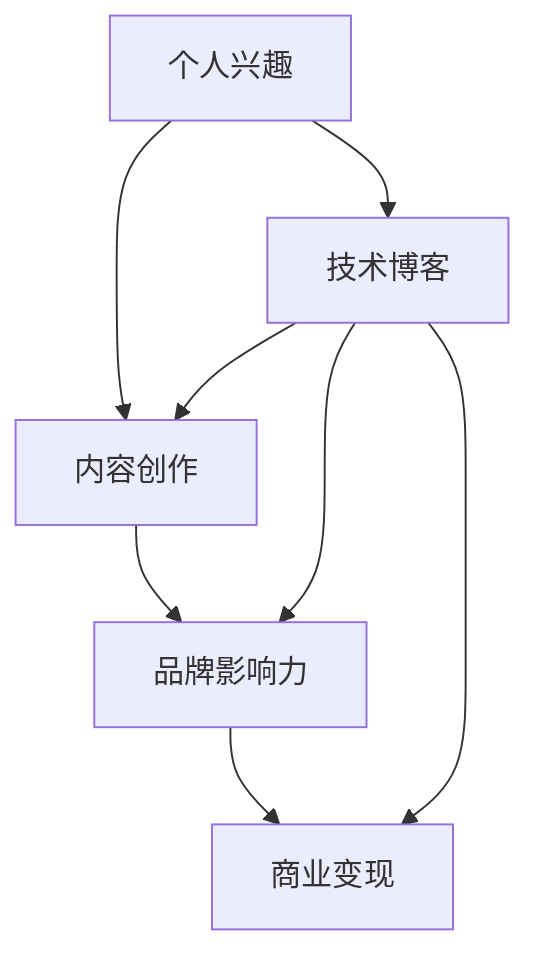

                 

# 技术博客：从个人兴趣到媒体集团的演变

> **关键词：个人兴趣、媒体集团、技术博客、内容创作、商业变现**
>
> **摘要：本文将探讨如何从一个个人技术博客起步，逐步发展成为拥有广泛影响力的媒体集团。通过分析个人兴趣如何转化为内容创作，如何构建品牌影响力，以及如何实现商业变现，本文为技术爱好者提供了实用的指南和策略。**

## 1. 背景介绍

### 1.1 目的和范围

本文旨在帮助技术爱好者了解如何将个人兴趣转化为有影响力的技术博客，并进一步发展成为具有商业价值的媒体集团。通过分享经验、案例研究和策略，本文将为读者提供实用的指导，帮助他们从零开始，逐步实现技术博客的转型和扩展。

### 1.2 预期读者

本文适合以下几类读者：

1. 对技术博客创作有热情的技术爱好者。
2. 希望将自己的技术博客扩展为商业平台的独立博主。
3. 对内容创作和媒体运营有兴趣的创业者。

### 1.3 文档结构概述

本文将分为以下几个部分：

1. 背景介绍：概述本文的目的和读者群体。
2. 核心概念与联系：介绍技术博客发展的核心概念和联系。
3. 核心算法原理 & 具体操作步骤：讲解如何从个人兴趣到内容创作，再到商业变现。
4. 数学模型和公式 & 详细讲解 & 举例说明：分析技术博客发展的数学模型和公式。
5. 项目实战：提供具体的代码案例和解释。
6. 实际应用场景：探讨技术博客的应用场景。
7. 工具和资源推荐：推荐相关工具和资源。
8. 总结：展望技术博客的未来发展趋势与挑战。
9. 附录：常见问题与解答。
10. 扩展阅读 & 参考资料：提供进一步的阅读资料。

### 1.4 术语表

#### 1.4.1 核心术语定义

- 技术博客：指以技术内容为主题的博客。
- 内容创作：指创作和发布技术文章、视频、音频等内容的活动。
- 品牌影响力：指博客在行业内获得认可和影响力的程度。
- 商业变现：指将博客内容转化为商业收入的过程。

#### 1.4.2 相关概念解释

- 个人兴趣：指个人对某一领域或技能的热爱和追求。
- 内容营销：指通过创作和发布有价值的内容来吸引和留住受众，从而实现营销目的。
- SEO（搜索引擎优化）：指通过优化网站内容和结构，提高在搜索引擎中排名的过程。

#### 1.4.3 缩略词列表

- SEO：搜索引擎优化
- SMM：社交媒体营销
- CMS：内容管理系统
- SEM：搜索引擎营销
- KPI：关键绩效指标

## 2. 核心概念与联系

在探讨如何将个人技术博客发展成为媒体集团的过程中，首先需要理解以下几个核心概念和它们之间的联系：

- **个人兴趣**：个人对某一领域或技术的热爱和追求，是技术博客创作的源泉。
- **内容创作**：基于个人兴趣，通过文字、图片、视频等多种形式创作有价值的内容。
- **品牌影响力**：通过持续的内容创作，逐渐建立博客在特定领域内的知名度和认可度。
- **商业变现**：利用品牌影响力，通过广告、赞助、付费内容等方式实现商业收入。

以下是一个简单的 Mermaid 流程图，展示了这些核心概念之间的联系：



在这个流程图中，个人兴趣是起点，通过内容创作形成品牌影响力，最终实现商业变现。技术博客则是实现这一过程的重要平台。

## 3. 核心算法原理 & 具体操作步骤

要从个人技术博客起步，实现品牌影响力和商业变现，我们需要遵循以下核心算法原理和具体操作步骤：

### 3.1 内容创作

**算法原理**：

- **用户需求分析**：首先，分析目标受众的需求，确定博客的主题和内容方向。
- **内容策划**：围绕主题策划内容，包括技术文章、教程、案例分析等。
- **内容创作**：撰写高质量的内容，注重语言表达、逻辑结构和实用性。

**具体操作步骤**：

1. **确定主题**：基于个人兴趣和受众需求，选择一个具体的技术主题。
2. **进行市场调研**：了解当前市场上的热门话题和趋势，确定内容创作方向。
3. **制定内容计划**：列出要创作的内容列表，包括文章、视频、教程等。
4. **撰写内容**：按照计划撰写高质量的内容，确保内容具有独特性和价值。
5. **内容优化**：对内容进行优化，包括标题、关键词、SEO 等方面。

### 3.2 品牌建设

**算法原理**：

- **品牌定位**：明确博客的品牌定位和目标受众，打造独特的品牌形象。
- **内容传播**：通过多种渠道传播内容，提高博客的曝光度和知名度。
- **互动与反馈**：与读者建立互动，收集反馈，不断优化内容和用户体验。

**具体操作步骤**：

1. **确定品牌定位**：明确博客的品牌理念和目标受众，制定品牌口号和标志。
2. **建立内容传播渠道**：包括社交媒体、SEO、邮件营销等，确保内容能够触达目标受众。
3. **持续内容更新**：保持定期更新，增加博客的粘性和活跃度。
4. **互动与反馈**：积极与读者互动，回复评论，收集反馈，不断优化内容。
5. **数据分析**：通过数据分析，了解读者行为，优化内容策略。

### 3.3 商业变现

**算法原理**：

- **广告合作**：通过广告收入实现变现。
- **内容付费**：提供付费内容，如高级教程、会员服务等。
- **品牌合作**：与品牌进行合作，提供品牌推广和营销服务。

**具体操作步骤**：

1. **广告合作**：与广告平台合作，投放相关广告，获取广告收入。
2. **内容付费**：提供优质付费内容，如高级教程、电子书等，吸引付费读者。
3. **品牌合作**：与相关品牌合作，提供品牌推广和营销服务，获取合作收入。
4. **数据分析**：通过数据分析，了解读者需求和偏好，优化变现策略。

通过以上核心算法原理和具体操作步骤，我们可以逐步将个人技术博客发展成为具有商业价值的媒体集团。

## 4. 数学模型和公式 & 详细讲解 & 举例说明

在技术博客的发展过程中，我们可以运用一些数学模型和公式来分析和优化内容创作和商业变现策略。以下是一些常用的数学模型和公式，并对其进行详细讲解和举例说明。

### 4.1 用户增长模型

用户增长模型是衡量博客用户数量增长情况的重要工具。以下是一个简单的用户增长模型：

\[ \text{用户增长量} = (1 + r)^n \]

其中：

- \( r \)：用户增长比例（例如，每月增长10%则\( r = 0.1 \)）。
- \( n \)：增长周期（例如，月数）。

**详细讲解**：

- **增长比例 \( r \)**：增长比例反映了博客内容的质量和受众的吸引力。通过分析用户反馈和流量数据，可以调整增长比例，提高用户留存率。
- **增长周期 \( n \)**：增长周期决定了用户增长的速度。对于技术博客，较长的增长周期可能意味着更高质量的内容和更广泛的受众覆盖。

**举例说明**：

假设一个技术博客每月用户增长比例为10%，经过6个月的增长，用户数量将增加为：

\[ (1 + 0.1)^6 \approx 1.7716 \]

这意味着用户数量将增加到原来的1.7716倍。

### 4.2 转化率模型

转化率模型用于衡量博客内容转化为商业行为（如广告点击、内容付费等）的效率。以下是一个简单的转化率模型：

\[ \text{转化率} = \frac{\text{转化数量}}{\text{访问量}} \]

其中：

- **转化数量**：实现商业行为的用户数量（如广告点击次数）。
- **访问量**：博客的总访问量。

**详细讲解**：

- **转化率**：转化率反映了博客内容的吸引力和营销策略的有效性。通过优化内容质量和营销策略，可以提升转化率。
- **访问量**：访问量是衡量博客影响力的基础指标，通过SEO和社交媒体营销等手段，可以增加访问量。

**举例说明**：

假设一个技术博客的月访问量为10000次，其中广告点击量为500次，则该博客的转化率为：

\[ \frac{500}{10000} = 0.05 \]

即5%的转化率。

### 4.3 盈利模型

盈利模型用于计算博客的商业收入。以下是一个简单的盈利模型：

\[ \text{盈利} = \text{总收入} - \text{总成本} \]

其中：

- **总收入**：博客通过广告、付费内容、品牌合作等方式获得的收入。
- **总成本**：博客运营所需的成本，包括服务器费用、广告费、内容创作费用等。

**详细讲解**：

- **总收入**：总收入是博客盈利的关键因素，通过多样化的收入来源，可以增加盈利能力。
- **总成本**：总成本决定了博客的盈利空间，通过优化成本结构和提高效率，可以降低运营成本。

**举例说明**：

假设一个技术博客的总收入为10000元，总成本为5000元，则该博客的盈利为：

\[ 10000 - 5000 = 5000 \]

即5000元的盈利。

通过以上数学模型和公式的分析和应用，我们可以更科学地优化博客的内容创作和商业变现策略，实现持续增长和盈利。

## 5. 项目实战：代码实际案例和详细解释说明

在本节中，我们将通过一个具体的代码案例，展示如何从零开始创建一个技术博客，并逐步实现内容创作、品牌建设和商业变现。以下是该项目的主要步骤和详细解释。

### 5.1 开发环境搭建

为了搭建一个技术博客，我们需要以下开发环境：

- **操作系统**：Windows、macOS 或 Linux。
- **编程语言**：Python、JavaScript 或其他你熟悉的编程语言。
- **开发工具**：文本编辑器（如 Visual Studio Code）、集成开发环境（如 PyCharm、WebStorm）。

**步骤**：

1. 安装操作系统和开发工具。
2. 配置网络环境，确保可以访问互联网。

### 5.2 源代码详细实现和代码解读

在这个项目中，我们将使用 Python 语言搭建一个简单的技术博客。以下是关键代码实现和解读：

#### 5.2.1 数据库设计与实现

```python
# 导入所需模块
import sqlite3

# 创建数据库连接
conn = sqlite3.connect('blog.db')
cursor = conn.cursor()

# 创建表
cursor.execute('''CREATE TABLE IF NOT EXISTS articles (
    id INTEGER PRIMARY KEY,
    title TEXT,
    content TEXT,
    created_at TIMESTAMP
)''')

# 插入数据
cursor.execute("INSERT INTO articles (title, content, created_at) VALUES (?, ?, ?)",
               ('Python入门教程', '这是Python入门教程的内容。', '2023-03-01 10:00:00'))

# 提交事务
conn.commit()
```

**代码解读**：

- **数据库连接**：使用 `sqlite3` 模块连接到本地数据库。
- **创建表**：使用 SQL 语句创建 `articles` 表，用于存储文章信息。
- **插入数据**：插入一条示例文章数据，包括标题、内容和创建时间。

#### 5.2.2 博客前端实现

```html
<!-- 博客首页 -->
<!DOCTYPE html>
<html lang="zh">
<head>
    <meta charset="UTF-8">
    <title>技术博客</title>
</head>
<body>
    <h1>技术博客</h1>
    <ul>
        <li><a href="/article/1">Python入门教程</a></li>
        <!-- 更多文章链接 -->
    </ul>
</body>
</html>
```

**代码解读**：

- **HTML 结构**：创建一个简单的 HTML 页面，包含博客标题和文章列表。
- **文章链接**：为每篇文章生成一个链接，方便用户访问。

#### 5.2.3 博客后端实现

```python
# 导入所需模块
import sqlite3
from flask import Flask, request, jsonify

# 初始化 Flask 应用
app = Flask(__name__)

# 创建数据库连接
conn = sqlite3.connect('blog.db')
cursor = conn.cursor()

# 获取所有文章
@app.route('/articles')
def get_articles():
    cursor.execute("SELECT id, title FROM articles")
    articles = cursor.fetchall()
    return jsonify(articles)

# 获取单篇文章
@app.route('/article/<int:article_id>')
def get_article(article_id):
    cursor.execute("SELECT id, title, content, created_at FROM articles WHERE id=?", (article_id,))
    article = cursor.fetchone()
    return jsonify(article)

# 运行 Flask 应用
if __name__ == '__main__':
    app.run(debug=True)
```

**代码解读**：

- **Flask 应用**：使用 Flask 框架创建一个简单的后端应用。
- **获取文章列表**：定义 `/articles` 路径，返回所有文章的 ID 和标题。
- **获取单篇文章**：定义 `/article/<int:article_id>` 路径，返回指定 ID 的文章详细信息。
- **运行应用**：在主函数中启动 Flask 应用，进入调试模式。

### 5.3 代码解读与分析

通过以上代码，我们实现了以下功能：

- **数据库设计与实现**：设计并创建了一个用于存储文章信息的数据库表。
- **博客前端实现**：创建了一个简单的 HTML 页面，展示了所有文章的标题和链接。
- **博客后端实现**：使用 Flask 框架搭建了一个简单的后端应用，提供了获取文章列表和单篇文章的接口。

这些代码为技术博客的搭建提供了基础。在实际应用中，我们可以在此基础上继续开发，添加更多功能，如用户注册、登录、文章评论等。

通过以上实战案例，我们可以看到，技术博客的搭建并不复杂，关键在于持续的内容创作和优化。接下来，我们将进一步探讨如何在实际应用场景中发挥技术博客的作用。

## 6. 实际应用场景

技术博客在实际应用场景中具有广泛的作用，不仅为个人提供技术交流和分享的平台，还在企业、教育、科研等领域发挥着重要作用。

### 6.1 个人成长与知识传播

**个人成长**：技术博客可以帮助个人记录学习过程，总结经验，提升技能。通过分享学习心得和技术技巧，个人可以在技术领域获得更多认可和机会。

**知识传播**：技术博客作为一种知识传播工具，可以影响更多人。作者通过创作高质量的内容，帮助他人解决技术难题，推广新技术，从而推动技术进步。

### 6.2 企业宣传与品牌建设

**企业宣传**：企业可以通过技术博客展示其技术实力和创新能力，吸引潜在客户和合作伙伴。通过定期发布技术文章和案例分析，企业可以树立专业形象，提升品牌知名度。

**品牌建设**：技术博客可以作为企业品牌建设的一部分，与社交媒体、官网等渠道相结合，形成多元化的品牌传播策略。通过内容营销，企业可以与受众建立更紧密的联系，增强品牌影响力。

### 6.3 教育培训与资源共享

**教育培训**：技术博客可以作为教育培训的工具，提供丰富的教学资源。教师和学生可以通过博客学习新技术，交流学习经验，提高教学效果。

**资源共享**：技术博客为开发者提供了一个资源共享的平台，可以分享代码、工具、教程等资源，帮助他人更快地学习和成长。

### 6.4 科研成果发布与传播

**科研成果发布**：技术博客可以帮助科研人员发布研究成果，介绍最新技术进展。通过博客，科研成果可以更快地传播，促进学术交流和合作。

**传播**：技术博客作为一种快速、便捷的传播工具，可以加速科研成果的普及和推广，提高科研工作的社会影响力。

总之，技术博客在实际应用场景中具有广泛的作用，既促进了个人成长，又推动了企业、教育、科研等领域的发展。通过不断创新和优化，技术博客将继续发挥重要作用。

## 7. 工具和资源推荐

为了帮助读者更好地创作和运营技术博客，以下是一些实用的工具和资源推荐。

### 7.1 学习资源推荐

#### 7.1.1 书籍推荐

1. **《Head First Programming》**：适合初学者的编程入门书籍，通过有趣的案例和互动式学习，帮助读者快速掌握编程基础。
2. **《You Don't Know JS》**：深入讲解 JavaScript 的各个方面，适合想要深入了解 JavaScript 的开发者。
3. **《Clean Code》**：介绍编写高质量代码的最佳实践，对提高代码的可读性和可维护性有很大帮助。

#### 7.1.2 在线课程

1. **Coursera**：提供多种编程和技术课程，包括计算机科学、数据分析、人工智能等。
2. **Udemy**：拥有丰富的编程和技术课程，适合不同水平的学员。
3. **edX**：由知名大学提供的高质量在线课程，涵盖计算机科学、工程、商业等领域。

#### 7.1.3 技术博客和网站

1. **GitHub**：全球最大的代码托管平台，可以查看和学习各种开源项目。
2. **Stack Overflow**：编程社区问答平台，可以解答编程问题，分享技术经验。
3. **Medium**：一个流行的在线出版平台，可以阅读和分享高质量的技术文章。

### 7.2 开发工具框架推荐

#### 7.2.1 IDE和编辑器

1. **Visual Studio Code**：一款轻量级、可扩展的代码编辑器，支持多种编程语言。
2. **PyCharm**：一款强大的Python IDE，适合开发大型项目。
3. **WebStorm**：一款支持多种编程语言的IDE，特别适合前端开发。

#### 7.2.2 调试和性能分析工具

1. **Chrome DevTools**：一款强大的浏览器开发工具，可以用于调试和优化Web应用。
2. **Postman**：一款API测试工具，可以帮助开发者测试和调试API接口。
3. **Jenkins**：一款持续集成和持续部署工具，可以自动化构建、测试和部署代码。

#### 7.2.3 相关框架和库

1. **Flask**：一个轻量级的Web应用框架，适合快速开发Web应用。
2. **Django**：一个全功能的Python Web应用框架，适合开发大型Web应用。
3. **React**：一个用于构建用户界面的JavaScript库，适合开发单页面应用。

### 7.3 相关论文著作推荐

#### 7.3.1 经典论文

1. **"The Structure of CSS Frameworks"**：一篇关于CSS框架的著名论文，分析了各种CSS框架的结构和优缺点。
2. **"Clean Code"**：由Robert C. Martin撰写的经典著作，介绍了编写高质量代码的最佳实践。
3. **"You Don't Know JS"**：由Kyle Simpson撰写的JavaScript系列著作，深入讲解了JavaScript的各个方面。

#### 7.3.2 最新研究成果

1. **"Neural Networks and Deep Learning"**：由Michael Nielsen撰写的关于神经网络和深度学习的最新著作，介绍了这一领域的前沿研究。
2. **"The Future of Humanity: Terraforming Mars, Interstellar Travel, Immortality, and Our Destiny Beyond Earth"**：由Michio Kaku撰写的关于未来人类发展和宇宙探索的著作，探讨了人类在宇宙中的未来。
3. **"The Attention Mechanism: A Comprehensive Review"**：一篇关于注意力机制的综述论文，总结了近年来在自然语言处理、计算机视觉等领域的研究成果。

#### 7.3.3 应用案例分析

1. **"How Google Fights Spam"**：一篇关于Google反垃圾邮件策略的案例分析，介绍了Google如何通过技术手段打击垃圾邮件和恶意网站。
2. **"The Design of Google Search"**：一篇关于Google搜索算法的案例分析，介绍了Google如何通过优化搜索算法提供更好的用户体验。
3. **"Facebook's Data-Driven Product Development"**：一篇关于Facebook的产品开发流程的案例分析，介绍了Facebook如何通过数据驱动的方式设计和优化产品。

通过以上工具和资源，读者可以更好地创作和运营技术博客，提升自己的技术水平，并在技术领域取得更大的成就。

## 8. 总结：未来发展趋势与挑战

随着互联网技术的不断发展，技术博客作为内容创作和知识传播的重要平台，其未来发展趋势和面临的挑战也将日益显著。以下是几个关键点：

### 8.1 发展趋势

**内容多元化**：随着技术的进步，技术博客的内容将更加多元化，不仅包括传统的技术文章，还将涵盖视频、音频、直播等多种形式。

**个性化推荐**：人工智能和大数据技术的应用将使内容推荐更加精准，博客平台可以根据用户的兴趣和行为，推荐最适合他们的内容。

**商业化深化**：技术博客的商业化趋势将不断加强，通过广告、付费内容、品牌合作等多种方式，博客将实现更加丰富的盈利模式。

**全球化扩展**：随着互联网的全球化，技术博客的影响力和受众也将不断扩大，跨地域的内容创作和合作将变得更加普遍。

### 8.2 面临的挑战

**内容质量竞争**：随着技术博客数量的增加，内容质量将成为核心竞争力。高质量的内容创作将面临更大的挑战，创作者需要不断提高自己的专业素养和创作能力。

**版权保护**：技术博客的内容原创性将面临严峻的版权保护挑战。创作者需要学会保护自己的知识产权，同时也要尊重他人的版权。

**数据安全和隐私**：随着用户数据的积累，数据安全和隐私保护将成为重要问题。博客平台需要采取有效的措施，确保用户数据的安全和隐私。

**监管合规**：随着监管政策的不断完善，技术博客在内容发布、广告推广等方面需要遵守更加严格的法律法规，这对博客平台的运营提出了更高的要求。

### 8.3 发展建议

**持续学习与提升**：作为技术博客的创作者，需要不断学习新技术，提升自己的专业素养和创作能力，以适应不断变化的技术环境。

**注重用户体验**：关注用户需求，提供高质量、有价值的内容，提升用户体验，增强用户粘性和忠诚度。

**合规运营**：严格遵守法律法规，确保内容的合法合规，建立良好的品牌形象和信誉。

**技术创新**：利用人工智能、大数据等技术，提高内容创作和推荐的效率，实现平台的智能化和个性化。

**多元化发展**：探索多元化的盈利模式，通过广告、付费内容、品牌合作等多种方式，实现商业变现。

总之，技术博客的未来充满了机遇和挑战。通过不断学习和创新，技术博客将迎来更加广阔的发展空间。

## 9. 附录：常见问题与解答

### 9.1 技术博客的起步问题

**Q1**：如何选择合适的技术博客平台？

**A1**：选择技术博客平台时，需要考虑以下几个因素：

- **易用性**：平台应该易于上手，适合您的技术水平。
- **功能丰富**：平台应提供丰富的功能，如自定义主题、SEO优化、用户管理、评论系统等。
- **社区支持**：平台应有一个活跃的社区，方便您获取帮助和分享经验。

推荐的平台有：WordPress、Jekyll、Hexo、Medium 等。

**Q2**：如何吸引和维护读者？

**A2**：吸引和维护读者的方法包括：

- **持续更新**：定期发布高质量的内容，保持博客的活跃度。
- **互动交流**：积极回复读者的评论，与读者建立良好的互动关系。
- **SEO优化**：优化博客内容和结构，提高搜索引擎排名，吸引更多读者。
- **社交媒体推广**：利用社交媒体平台，如Twitter、LinkedIn、Facebook等，推广博客内容。

### 9.2 商业变现问题

**Q1**：如何通过博客实现商业化？

**A1**：实现博客商业化的方法包括：

- **广告收入**：与广告平台合作，在博客中投放广告。
- **内容付费**：提供高质量、有价值的付费内容，如高级教程、电子书等。
- **品牌合作**：与相关品牌进行合作，提供品牌推广和营销服务。
- **会员制**：提供会员服务，如独家内容、优先评论等，吸引付费用户。

### 9.3 内容创作问题

**Q1**：如何保持内容创作的灵感和创造力？

**A1**：保持内容创作的灵感和创造力，可以尝试以下方法：

- **多读书、多看技术文章**：不断充实自己的知识库，提高写作水平。
- **关注行业动态**：关注技术领域的最新动态，了解前沿技术和发展趋势。
- **练习写作**：定期进行写作练习，提高写作速度和技巧。
- **保持好奇心和探索精神**：对未知事物保持好奇，勇于尝试和探索新领域。

## 10. 扩展阅读 & 参考资料

为了帮助读者深入了解技术博客的发展、内容创作和商业变现，以下是一些扩展阅读和参考资料：

### 10.1 经典书籍

- 《Head First Programming》
- 《You Don't Know JS》
- 《Clean Code》

### 10.2 在线课程

- Coursera：[Programming Languages](https://www.coursera.org/courses?query=programming%20languages)
- Udemy：[Complete Python Course](https://www.udemy.com/course/python-complete-course/)
- edX：[MITx: Introduction to Computer Science and Programming](https://www.edx.org/course/mitx-introduction-to-computer-science-and-programming)

### 10.3 技术博客和网站

- GitHub：[GitHub Blog](https://github.blog/)
- Stack Overflow：[Stack Overflow Blog](https://stackoverflow.blog/)
- Medium：[Medium Tech](https://medium.com/tech)

### 10.4 相关论文

- "The Structure of CSS Frameworks"
- "Clean Code"
- "You Don't Know JS"

### 10.5 应用案例分析

- "How Google Fights Spam"
- "The Design of Google Search"
- "Facebook's Data-Driven Product Development"

通过以上扩展阅读和参考资料，读者可以进一步了解技术博客的发展趋势和实践经验，为个人成长和事业发展提供有力支持。

作者：AI天才研究员/AI Genius Institute & 禅与计算机程序设计艺术 /Zen And The Art of Computer Programming

