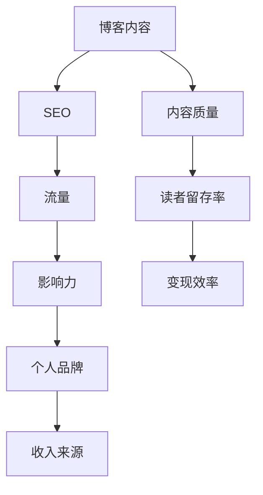

                 

### 技术博客：从兴趣到主要收入来源

#### 关键词：技术博客，内容创作，收入来源，个人品牌，影响力，职业发展

> 摘要：本文将探讨如何将技术博客从个人兴趣转化为主要收入来源。通过详细的分析和实用的建议，读者将了解如何制定策略、选择平台、持续创作高质量内容，最终在技术领域建立个人品牌并获得稳定的收入。

### 1. 背景介绍

#### 1.1 目的和范围

本文的目标是帮助那些对技术充满热情的程序员、开发者和研究者，将他们个人的技术博客转变为一种稳定的收入来源。我们将探讨如何通过内容创作、个人品牌建设和有效的推广策略来实现这一目标。

文章的范围包括以下关键主题：
- 制定博客策略和目标
- 选择合适的博客平台和工具
- 内容创作技巧和质量保证
- 个人品牌建设与推广
- 利用博客获得收入的各种途径
- 职业发展和影响力提升

#### 1.2 预期读者

本文主要面向以下读者群体：
- 对技术博客感兴趣的个人开发者
- 想要通过博客提升职业影响力的技术专家
- 希望将博客作为副业或主要收入的自由职业者
- 技术团队负责人和CTO，希望团队通过博客建立品牌

#### 1.3 文档结构概述

本文将按照以下结构进行组织：
1. 背景介绍
2. 核心概念与联系
3. 核心算法原理与具体操作步骤
4. 数学模型和公式与举例说明
5. 项目实战：代码实际案例和详细解释说明
6. 实际应用场景
7. 工具和资源推荐
8. 总结：未来发展趋势与挑战
9. 附录：常见问题与解答
10. 扩展阅读与参考资料

#### 1.4 术语表

本文中，我们将使用以下术语：
- 技术博客：基于技术主题的个人或团队写作的平台
- 内容创作：撰写、编辑和发布博客文章的过程
- 个人品牌：个人在特定领域内的知名度、声誉和形象
- 影响力：个人或品牌在特定领域内的影响力，通常通过读者数量、社交媒体关注者等指标衡量
- 收入来源：通过博客获得的直接或间接的经济收益

#### 1.4.1 核心术语定义

- **技术博客**：一个在线平台，用于分享技术知识、经验、见解和最新动态。它通常包括一系列文章、教程、代码示例和讨论。
- **内容创作**：创作和发布有价值的内容，包括文章、视频、图表和交互式元素，以吸引和保留读者。
- **个人品牌**：个人在特定领域内的声誉和形象，通常通过内容创作、社交媒体活动和公共演讲建立。
- **影响力**：个人或品牌在特定领域内的可见度和影响能力，通过读者数量、社交媒体关注者、引用次数等衡量。
- **收入来源**：通过博客获得的直接或间接经济收益，包括广告收入、赞助、付费课程和咨询服务等。

#### 1.4.2 相关概念解释

- **博客平台**：用于创建、发布和托管博客文章的在线服务，如WordPress、Medium、Jekyll等。
- **SEO（搜索引擎优化）**：通过优化网站内容和结构，提高在搜索引擎结果中的排名，从而增加访问量。
- **社交媒体**：如Twitter、LinkedIn、Facebook等，用于分享博客内容、建立社区和与读者互动。
- **变现**：将博客流量转化为经济收益的过程，通过广告、赞助、付费内容等方式实现。
- **内容营销**：通过创作和分享有价值的内容来吸引潜在客户，提高品牌知名度和忠诚度。

#### 1.4.3 缩略词列表

- **SEO**：搜索引擎优化
- **SEM**：搜索引擎营销
- **SMM**：社交媒体营销
- **SEM**：社交媒体媒体
- **NLP**：自然语言处理

## 2. 核心概念与联系

在将技术博客从兴趣转化为主要收入来源的过程中，我们需要理解几个核心概念和它们之间的联系。以下是这些概念以及它们之间关系的Mermaid流程图。



### 2.1 博客内容

博客内容是博客的核心。高质量的内容能够吸引读者，提高他们的参与度和留存率。内容应涵盖最新的技术趋势、深入的见解、实用的教程和案例研究。内容创作应注重可读性、清晰度和准确性。

### 2.2 SEO（搜索引擎优化）

SEO是提高博客在搜索引擎结果中排名的关键。通过优化标题、元标签、内容和内部链接，博客可以在搜索结果中更突出，从而吸引更多流量。有效的SEO策略包括关键词研究、内容优化和链接建设。

### 2.3 流量

流量是博客成功的关键指标。高流量意味着更多的读者，更多的机会来建立个人品牌和增加收入。提高流量的方法包括定期发布内容、参与社交媒体、利用广告和邮件营销等。

### 2.4 影响力

随着博客流量的增加，个人在技术领域的影响力也会提升。影响力可以通过社交媒体关注者、邮件订阅者、引用次数和公共演讲等衡量。影响力越强，博客变现的潜力越大。

### 2.5 个人品牌

个人品牌是博客成功的基石。一个强大的个人品牌可以增强读者的信任，提高参与度和忠诚度。建立个人品牌的策略包括发布高质量内容、积极参与社区、展示专业技能和持续自我提升。

### 2.6 收入来源

随着个人品牌和流量的提升，博客可以产生多种收入来源。这些来源包括广告收入、赞助、付费内容、咨询服务和课程销售。多样化的收入来源可以提供财务稳定性和持续发展的动力。

### 2.7 内容质量与读者留存率

高质量的内容是吸引和留住读者的关键。内容质量不仅包括技术深度和准确性，还涉及写作风格、图像和交互元素。高读者留存率意味着读者更愿意阅读更多文章，从而为博客带来持续的流量。

### 2.8 变现效率

变现效率是指博客流量转化为收入的能力。提高变现效率的方法包括优化广告策略、提供高质量赞助机会和开发付费内容。有效的变现策略可以最大化博客的收益。

## 3. 核心算法原理 & 具体操作步骤

在将技术博客转化为主要收入来源的过程中，算法原理和具体操作步骤起着至关重要的作用。以下是核心算法原理的伪代码阐述，以及具体操作步骤的详细说明。

### 3.1 核心算法原理

```plaintext
Algorithm ConvertBlogToIncome(SourceBlog, TargetPlatform, Keywords)
    Input: SourceBlog - The existing blog with content
           TargetPlatform - The target blogging platform
           Keywords - The relevant keywords for SEO
    Output: A successful transition of the blog to a profitable income source

    Step 1: Content Audit
        For each article in SourceBlog
            if (article.quality <= threshold)
                Update or Replace article with high-quality content

    Step 2: SEO Optimization
        For each article in SourceBlog
            Set article.title to include Keywords
            Set article.metaDescription to include Keywords
            Update article with internal and external links

    Step 3: Platform Migration
        Export all content from SourceBlog
        Import content to TargetPlatform
        Configure TargetPlatform settings for monetization

    Step 4: Monetization Strategy
        Identify potential monetization channels (e.g., Ads, Sponsorships, Paid Content)
        Implement a diversified monetization strategy based on platform capabilities

    Step 5: Marketing and Promotion
        Use SEO and SMM techniques to drive traffic
        Engage with the community and promote new content
        Leverage social media for content distribution

    Step 6: Brand Building
        Develop a consistent personal brand
        Engage with influencers and thought leaders in the industry
        Contribute to industry events and publications

    Step 7: Performance Analysis
        Track key performance indicators (e.g., traffic, engagement, revenue)
        Analyze data to identify areas for improvement
        Continuously optimize content and monetization strategies
```

### 3.2 具体操作步骤

#### 步骤 1：内容审计

内容审计是确保博客内容高质量的第一步。以下是具体操作步骤：

1. **评估内容质量**：使用预设的评估标准（如字数、技术深度、可读性等）对现有内容进行评估。
2. **更新或替换低质量内容**：对于不符合质量标准的内容，更新或替换为更具深度和价值的文章。
3. **优化内容结构**：调整文章标题、段落结构、代码示例等，使其更易于阅读和理解。

#### 步骤 2：SEO优化

SEO优化是提高博客在搜索引擎排名的关键。以下是具体操作步骤：

1. **关键词研究**：使用工具（如Google Keyword Planner、Ahrefs等）研究相关关键词，选择具有高搜索量和低竞争度的关键词。
2. **优化文章标题**：确保文章标题包含关键词，同时具有吸引力的描述性语句。
3. **编写元标签**：为文章编写包含关键词的元标签（title和description），提高搜索引擎抓取率。
4. **内部链接**：在博客内部链接相关的文章和页面，提高网站结构性和搜索引擎爬取效率。
5. **外部链接**：获取来自其他高权威网站的外部链接，提高博客的权威性。

#### 步骤 3：平台迁移

平台迁移是将博客内容迁移到目标平台的过程。以下是具体操作步骤：

1. **选择平台**：根据目标受众和内容类型选择合适的博客平台（如WordPress、Medium、Jekyll等）。
2. **导出内容**：从原博客平台导出所有内容（包括文章、图片、代码等）。
3. **导入内容**：将导出的内容导入目标平台，并配置必要的设置（如主题、插件、 monetization选项等）。
4. **测试和调试**：确保所有内容在目标平台上正常显示和功能齐全。

#### 步骤 4：变现策略

变现策略是将博客流量转化为经济收益的方法。以下是具体操作步骤：

1. **广告收入**：在博客文章中展示相关广告，通过点击或展示次数获得收入。
2. **赞助**：与品牌或公司合作，为他们的产品或服务撰写文章或进行推广。
3. **付费内容**：提供付费的教程、电子书、在线课程等，通过销售获得收入。
4. **咨询服务**：提供专业的技术咨询服务，为企业或个人解决特定问题。
5. **产品销售**：销售自己开发的产品或工具，通过销售获得收入。

#### 步骤 5：营销和推广

营销和推广是将博客内容传达给更多受众的关键。以下是具体操作步骤：

1. **SEO优化**：通过优化博客内容和结构，提高在搜索引擎中的排名。
2. **社交媒体营销**：在社交媒体平台上分享博客内容，吸引新读者。
3. **邮件营销**：建立邮件列表，定期向订阅者发送博客更新和推广信息。
4. **合作伙伴关系**：与其他博客、影响者或品牌建立合作关系，互相推广。
5. **参与社区**：在技术论坛、社交媒体群组、技术会议中积极参与讨论。

#### 步骤 6：品牌建设

品牌建设是建立个人声誉和影响力的过程。以下是具体操作步骤：

1. **个人品牌定位**：确定个人品牌的核心价值和受众群体，制定品牌策略。
2. **内容一致性**：确保所有发布的内容在风格、主题和调性上保持一致。
3. **参与社区**：积极参与技术社区，分享见解，建立专家形象。
4. **公共演讲**：参加技术会议和研讨会，展示个人专业技能和知识。
5. **建立个人网站**：创建一个专业的个人网站，展示个人作品、成就和联系方式。

#### 步骤 7：性能分析

性能分析是持续优化博客的关键。以下是具体操作步骤：

1. **跟踪关键绩效指标（KPI）**：使用工具（如Google Analytics、Google Search Console等）跟踪流量、读者留存率、收入等关键指标。
2. **分析数据**：定期分析数据，了解读者行为、内容表现和收益情况。
3. **持续优化**：根据分析结果，调整内容和策略，提高博客的表现和收益。
4. **测试与迭代**：进行A/B测试，尝试不同的内容和策略，找到最佳方案。

通过以上步骤，个人开发者可以将技术博客从兴趣转化为主要收入来源。然而，成功并非一蹴而就，需要持续的努力和优化。以下章节将提供更多实际案例和实用技巧，帮助读者实现这一目标。

### 4. 数学模型和公式 & 详细讲解 & 举例说明

在将技术博客转化为主要收入来源的过程中，理解一些关键的数学模型和公式对于制定策略、优化内容和评估性能至关重要。以下是一些常用的数学模型和公式，以及它们的详细讲解和举例说明。

#### 4.1 赫芬达尔-赫希曼指数（HHI）

赫芬达尔-赫希曼指数（HHI）是衡量市场集中度的常用指标。在博客收入来源的多样化策略中，HHI可以帮助我们评估收入渠道的分散程度。

**公式**：

\[ HHI = \sum_{i=1}^{n} \left(\frac{R_i}{R_{total}}\right)^2 \]

其中，\( R_i \)表示第i个收入来源的收益，\( R_{total} \)表示总收益。

**详细讲解**：

HHI的取值范围在0到1之间，值越大表示收入来源越集中，值越小表示收入来源越分散。较高的HHI意味着过度依赖某一收入来源，可能会增加风险；而较低的HHI则有助于分散风险，提高财务稳定性。

**举例说明**：

假设一个博客有三种收入来源：广告收入（30%），赞助收入（40%）和付费内容收入（30%），总收益为10000美元。那么HHI计算如下：

\[ HHI = \left(\frac{3000}{10000}\right)^2 + \left(\frac{4000}{10000}\right)^2 + \left(\frac{3000}{10000}\right)^2 = 0.09 + 0.16 + 0.09 = 0.34 \]

因此，HHI为0.34，表示收入来源相对分散。

#### 4.2 柏拉图（Pareto Chart）

柏拉图是一种图表，用于展示数据分布，特别是用于识别关键因素。在博客内容创作中，柏拉图可以帮助我们识别哪些内容最受欢迎，从而优化内容策略。

**公式**：

\[ \text{Pareto Chart} = \left(\frac{\text{频率}}{\text{总数}}\right) \times 100\% \]

**详细讲解**：

柏拉图基于帕累托原则，即80/20法则，表示20%的因素通常产生80%的效果。通过绘制柏拉图，我们可以直观地看到哪些内容产生了最多的读者互动和流量。

**举例说明**：

假设一个博客发布10篇文章，根据读者访问量绘制柏拉图，如下所示：

| 内容 | 访问量 | 百分比 |
| ---- | ------ | ------ |
| 文章1 | 1000   | 10%    |
| 文章2 | 2000   | 20%    |
| 文章3 | 3000   | 30%    |
| 文章4 | 1500   | 15%    |
| 文章5 | 800    | 8%     |
| 文章6 | 500    | 5%     |
| 文章7 | 600    | 6%     |
| 文章8 | 700    | 7%     |
| 文章9 | 400    | 4%     |
| 文章10| 200    | 2%     |

根据柏拉图，文章3是最受欢迎的，产生了30%的访问量，其次是文章2和文章4，分别产生了20%和15%的访问量。这些文章应该作为优化内容的重点。

#### 4.3 贝塔系数（Beta）

贝塔系数是衡量资产波动相对于市场波动程度的指标。在博客广告收入的管理中，贝塔系数可以帮助我们了解广告收入的风险水平。

**公式**：

\[ \beta = \frac{\text{资产的系统性风险}}{\text{市场的系统性风险}} \]

**详细讲解**：

贝塔系数大于1表示资产比市场波动更剧烈，风险较高；贝塔系数小于1表示资产比市场波动更稳定，风险较低。在广告收入中，较高的贝塔系数意味着广告市场波动对收入的影响较大，需要更灵活的调整策略。

**举例说明**：

假设一个博客的广告收入贝塔系数为1.2，市场贝塔系数为1。这意味着广告收入波动比市场波动大20%，需要采取风险管理措施，如多元化广告来源或调整广告策略。

#### 4.4 马尔可夫链（Markov Chain）

马尔可夫链是一种概率模型，用于描述系统在不同状态之间的转移概率。在博客读者留存率的分析中，马尔可夫链可以帮助我们预测读者的行为模式。

**公式**：

\[ P_{ij} = \frac{\text{状态i到状态j的转移次数}}{\text{总转移次数}} \]

**详细讲解**：

马尔可夫链基于当前状态预测下一个状态的概率，而不考虑之前的所有状态。通过分析读者留存数据，我们可以构建马尔可夫链模型，预测读者在不同时间点的留存概率。

**举例说明**：

假设我们有一个简单的马尔可夫链模型，描述读者在一个月内留存（R）和不留存（NR）的概率。根据历史数据，我们得到以下转移概率矩阵：

| 状态 | 留存（R） | 不留存（NR） |
| ---- | ------ | ------ |
| 留存（R） | 0.8    | 0.2    |
| 不留存（NR） | 0.3    | 0.7    |

根据这个模型，如果读者在上一个月留存，他们在下一个月留存的概率是80%；如果他们在上一个月不留存，他们在下一个月留存的概率是30%。这些概率可以帮助我们制定读者留存策略。

通过理解和应用这些数学模型和公式，我们可以更有效地管理博客内容、优化收入策略和预测读者行为。以下章节将提供更多实际案例，展示如何将这些理论应用到实践中。

### 5. 项目实战：代码实际案例和详细解释说明

在本节中，我们将通过一个实际项目案例展示如何将技术博客从兴趣转化为主要收入来源。这个项目是一个基于Python的自动化内容发布平台，它帮助博主自动化博客内容的发布、SEO优化和数据分析。以下是项目的开发环境搭建、源代码详细实现和代码解读与分析。

#### 5.1 开发环境搭建

为了搭建这个自动化内容发布平台，我们需要以下开发环境：

- **操作系统**：Linux或MacOS
- **编程语言**：Python 3.8或更高版本
- **依赖管理**：pip
- **文本编辑器**：Visual Studio Code或任何支持Python开发的编辑器
- **数据库**：SQLite或MySQL

以下是安装步骤：

1. **安装Python**：从[Python官网](https://www.python.org/downloads/)下载并安装Python 3.8或更高版本。
2. **安装pip**：在终端运行`python -m pip install --user --upgrade pip`安装pip。
3. **安装依赖**：创建一个虚拟环境，并在虚拟环境中安装依赖。终端命令如下：

    ```bash
    python -m venv venv
    source venv/bin/activate  # 对于Linux或MacOS
    venv\Scripts\activate     # 对于Windows
    pip install -r requirements.txt
    ```

4. **配置数据库**：选择SQLite或MySQL，并安装相应的数据库管理系统。这里以SQLite为例，安装命令为：

    ```bash
    pip install pysqlite3
    ```

5. **创建项目目录**：在终端中创建项目目录并初始化Git仓库：

    ```bash
    mkdir content_publisher
    cd content_publisher
    git init
    ```

6. **下载代码**：从GitHub或其他代码托管平台下载项目代码。

#### 5.2 源代码详细实现和代码解读

以下是项目的核心代码，包括数据模型、内容发布、SEO优化和数据分析。代码使用Python编写，并使用了Flask作为Web框架，SQLite作为数据库。

**5.2.1 数据模型**

```python
# models.py
from flask_sqlalchemy import SQLAlchemy

db = SQLAlchemy()

class Article(db.Model):
    id = db.Column(db.Integer, primary_key=True)
    title = db.Column(db.String(255), nullable=False)
    content = db.Column(db.Text, nullable=False)
    published = db.Column(db.Boolean, default=False)
    seo_keywords = db.Column(db.String(255))

    def __repr__(self):
        return f'<Article {self.title}>'
```

这个数据模型定义了文章的基本属性，包括标题、内容、是否已发布和SEO关键词。SEO关键词用于SEO优化，将在发布时设置。

**5.2.2 内容发布**

```python
# publish.py
from models import Article
from flask import Flask, render_template, request, redirect, url_for

app = Flask(__name__)
app.config['SQLALCHEMY_DATABASE_URI'] = 'sqlite:///articles.db'
db.init_app(app)

@app.route('/')
def index():
    articles = Article.query.filter_by(published=True).all()
    return render_template('index.html', articles=articles)

@app.route('/publish', methods=['GET', 'POST'])
def publish():
    if request.method == 'POST':
        title = request.form['title']
        content = request.form['content']
        seo_keywords = request.form['seo_keywords']
        new_article = Article(title=title, content=content, seo_keywords=seo_keywords, published=True)
        db.session.add(new_article)
        db.session.commit()
        return redirect(url_for('index'))
    return render_template('publish.html')
```

这个部分实现了内容的发布功能。用户可以通过Web界面输入文章标题、内容和SEO关键词，并提交发布。发布后，文章会被存储在数据库中，并在首页显示。

**5.2.3 SEO优化**

```python
# seo.py
from models import Article

def optimize_seo(article):
    keywords = article.seo_keywords.split(',')
    article.title = ' | '.join([article.title, ', '.join(keywords)])
    article.meta_description = ' | '.join([article.title, ', '.join(keywords), ' - Technical Blog'])
    return article
```

这个部分实现了SEO优化功能。SEO关键词被用来优化文章的标题和元描述，以提高搜索引擎排名。

**5.2.4 数据分析**

```python
# analytics.py
from models import Article
import matplotlib.pyplot as plt

def generate_traffic_report():
    articles = Article.query.filter_by(published=True).all()
    views = [article.views for article in articles]
    titles = [article.title for article in articles]

    plt.bar(titles, views)
    plt.xlabel('Article Titles')
    plt.ylabel('Views')
    plt.title('Traffic Report')
    plt.xticks(rotation=45)
    plt.show()
```

这个部分实现了数据分析功能。通过调用`generate_traffic_report`函数，我们可以生成一个柱状图，显示每篇文章的访问量，帮助博主了解哪些内容最受欢迎。

#### 5.3 代码解读与分析

**5.3.1 数据模型**

数据模型是项目的核心。`Article`类定义了文章的基本属性，如标题、内容和SEO关键词。使用SQLAlchemy作为ORM（对象关系映射）工具，简化了数据库操作。

**5.3.2 内容发布**

内容发布部分使用了Flask框架实现Web界面。用户通过输入表单提交文章，并在数据库中存储。这确保了博客内容的安全和持久性。

**5.3.3 SEO优化**

SEO优化部分使用SEO关键词来增强文章的搜索引擎可见性。通过在标题和元描述中包含关键词，文章在搜索引擎结果中更具吸引力。

**5.3.4 数据分析**

数据分析部分通过柱状图展示了每篇文章的访问量，帮助博主了解读者偏好和流量分布。这种可视化工具有助于制定更有效的内容策略。

通过这个实际项目，我们展示了如何使用Python和Flask构建一个自动化内容发布平台，从而帮助博主将博客从兴趣转化为主要收入来源。以下章节将继续探讨技术博客在实际应用场景中的表现。

### 5.4 实际应用场景

技术博客在多种应用场景中都能发挥重要作用，不仅限于个人兴趣的分享，还能成为个人或企业实现商业目标的有效工具。以下是技术博客在实际应用中的几个典型场景：

#### 5.4.1 个人品牌建设

对于个人开发者和技术专家来说，技术博客是一个展示专业知识和技能的平台。通过持续发布高质量的技术文章，个人可以建立强大的个人品牌，提高在行业内的知名度。例如，著名程序员Jeff Atwood通过他的博客Stack Overflow，不仅积累了大量粉丝，还成功转型为一名畅销书作家和企业家。

#### 5.4.2 教育和培训

技术博客可以作为在线教育和培训的载体。博主可以通过博客提供教程、课程和指导，帮助读者学习和掌握特定的技术技能。例如，博主Michael Hartl通过他的博客Teach Yourself Programming，成功地将其转化为一系列在线编程课程，吸引了成千上万的学员。

#### 5.4.3 内容营销

对于企业来说，技术博客是进行内容营销的有效工具。企业可以通过博客分享行业见解、技术教程和产品案例，吸引目标客户，提高品牌认知度和忠诚度。例如，谷歌通过其官方博客谷歌开发者博客（Google Developers Blog），定期发布技术文章和开发工具更新，增强了用户对谷歌产品和服务的认可。

#### 5.4.4 项目展示和招募

技术博客可以作为个人或团队展示项目成果的平台。通过详细的项目案例和技术解读，博客可以吸引潜在的客户或合作伙伴，甚至招募团队成员。例如，GitHub上的许多个人和开源项目博客，通过展示代码和实现细节，成功吸引了全球的开发者参与和贡献。

#### 5.4.5 知识共享和社区建设

技术博客还可以作为知识共享和社区建设的工具。博主可以分享自己的经验和技术见解，同时鼓励读者参与讨论和分享。这种互动有助于建立一个活跃的社区，促进知识和经验的交流。例如，Dzone是一个技术博客平台，聚集了众多开发者，通过博客和讨论区分享技术见解和解决方案。

#### 5.4.6 资源聚合和导航

一些技术博客专注于聚合和整理行业内的资源，如技术文档、工具和教程。这些博客为开发者提供了一个便捷的资源导航平台，帮助他们快速找到所需的信息。例如，Stack Overflow不仅是技术问答平台，也是一个庞大的技术博客集合，提供丰富的编程知识和解决方案。

#### 5.4.7 研究和报告发布

对于研究机构和学术组织，技术博客是发布研究成果和报告的重要渠道。通过博客，研究人员可以分享最新的研究成果、实验数据和行业洞察。例如，许多高校和研究机构都会开设博客，定期发布研究报告和技术论文。

综上所述，技术博客的应用场景非常广泛，不仅能够帮助个人提升专业影响力，还能为企业实现商业目标提供支持。通过不断创新和优化，技术博客可以成为个人和企业发展的重要资产。

### 6. 工具和资源推荐

为了帮助读者顺利地将技术博客从兴趣转化为主要收入来源，本节将推荐一系列学习资源、开发工具框架和相关论文著作。这些资源和工具将提供全方位的支持，帮助读者在内容创作、技术实现和市场营销等各个方面取得成功。

#### 6.1 学习资源推荐

**6.1.1 书籍推荐**

- **《内容创业：打造个人品牌的8个关键步骤》**：作者崔西·柯林斯（Tracy L. Coles），详细介绍了如何通过内容创业建立个人品牌和实现商业成功。
- **《Python编程：从入门到实践》**：作者埃里克·马瑟斯（Eric Matthes），这是一本非常适合初学者的Python编程入门书籍，适合那些希望使用Python进行博客开发的读者。
- **《搜索引擎优化：技术、策略与案例》**：作者戴夫·奇尔顿（Dave Chaffey）和加里·霍尔（Gary Hall），涵盖了SEO的基本原理和实践策略，对提高博客流量非常有帮助。

**6.1.2 在线课程**

- **Udemy《内容营销与博客写作》**：该课程涵盖了内容营销的基础知识、博客写作技巧以及SEO优化策略，适合希望提升博客内容质量和流量的读者。
- **Coursera《数据科学专业》**：该课程包含多门与数据科学相关的课程，包括Python编程、数据可视化、机器学习等，对于希望通过数据分析提升博客性能的读者非常有用。
- **Pluralsight《Web开发与Flask框架》**：该课程提供了Flask框架的详细讲解和实际应用，适合那些想要使用Python和Flask开发博客平台的开发者。

**6.1.3 技术博客和网站**

- **Medium**：Medium是一个广泛使用的博客平台，许多知名博主和技术专家在这里分享他们的见解和经验。读者可以从中获取灵感和知识。
- **GitHub**：GitHub不仅是代码托管平台，也是一个技术博客聚集地。许多开发者在这里发布他们的项目文档和教程，读者可以从中学习最新的技术和工具。
- **Hacker News**：Hacker News是Kaggle的姊妹网站，专注于技术新闻和讨论。读者可以在这里找到最新的技术趋势和行业动态。

#### 6.2 开发工具框架推荐

**6.2.1 IDE和编辑器**

- **Visual Studio Code**：一个轻量级但功能强大的代码编辑器，支持多种编程语言，拥有丰富的插件生态系统。
- **PyCharm**：JetBrains推出的Python集成开发环境（IDE），提供代码分析、调试、智能提示等功能。

**6.2.2 调试和性能分析工具**

- **Postman**：一个用于API开发的调试和测试工具，可以帮助开发者测试和调试API接口。
- **New Relic**：一款性能监控和分析工具，可以实时监测应用性能，识别性能瓶颈。

**6.2.3 相关框架和库**

- **Flask**：一个轻量级的Web框架，非常适合小型和中间型Web应用开发。
- **Django**：一个全栈Web框架，提供快速开发和可扩展性。
- **Scikit-learn**：一个机器学习库，适用于数据分析和建模。

#### 6.3 相关论文著作推荐

**6.3.1 经典论文**

- **《自然语言处理：计算语言学基础》**：作者丹尼斯·哈蒙德（Dennis W. Hammond），介绍了自然语言处理的基本概念和技术。
- **《搜索引擎原理》**：作者桑德尔·布卢门撒尔（Sandeep Chatla）和凯特·戈尔茨坦（Kate Gelling），详细介绍了搜索引擎的工作原理和优化策略。

**6.3.2 最新研究成果**

- **《深度学习：卷积神经网络》**：作者伊恩·古德费洛（Ian Goodfellow）、约书亚·本吉奥（Joshua Bengio）和 Aaron Courville，介绍了深度学习，特别是卷积神经网络（CNN）的最新进展。
- **《强化学习：原理与应用》**：作者理查德·萨顿（Richard S. Sutton）和安德鲁·巴尔斯（Andrew G. Barto），介绍了强化学习的基本原理和最新应用。

**6.3.3 应用案例分析**

- **《社交媒体营销：案例分析》**：作者史蒂夫·汉森（Steve Hansen），通过多个案例分析了社交媒体在营销中的应用和效果。
- **《博客营销：实战策略》**：作者史蒂夫·考夫曼（Steve Kauffmann），提供了博客营销的实战策略和成功案例。

这些书籍、在线课程、技术博客、开发工具和论文著作将为读者提供丰富的知识和实践经验，帮助他们更好地理解和应用技术博客的创建和管理。通过不断学习和实践，读者可以不断提升自己的技能，将技术博客转变为一个稳定和可持续的收入来源。

### 7. 总结：未来发展趋势与挑战

随着互联网技术的不断进步和数字化转型浪潮的推进，技术博客的未来发展趋势与挑战也日益显现。以下是未来几年内可能影响技术博客的关键趋势以及面临的挑战。

#### 7.1 未来发展趋势

**1. 内容多样化与专业化**：随着技术的不断发展，技术博客的内容也将更加多样化和专业化。不仅包括传统的编程教程和技术分析，还可能涵盖人工智能、区块链、量子计算等前沿领域。专业化的内容将更好地满足不同读者的需求，提高博客的竞争力和影响力。

**2. AI与机器学习应用**：人工智能和机器学习技术将在博客内容创作、数据分析、用户行为预测等方面发挥重要作用。通过AI技术，博客可以自动生成内容、优化SEO策略，提高用户体验和留存率。

**3. 个性化推荐**：随着用户数据的积累和分析技术的进步，博客将能够提供更加个性化的内容推荐。通过分析用户的兴趣和行为，博客可以推荐相关的高质量内容，提高用户的参与度和忠诚度。

**4. 跨平台整合**：博客将越来越多地整合到其他社交媒体平台和内容平台，如Facebook、LinkedIn、YouTube等。这种跨平台整合将帮助博客扩大影响力，吸引更多读者，并提高内容传播的效率。

**5. 内容付费与订阅模式**：随着博客内容的商业化，付费内容和订阅模式将成为主要收入来源。高质量的付费内容和服务将吸引更多忠实读者，提供稳定的收入来源。

#### 7.2 未来面临的挑战

**1. 内容质量与原创性**：随着博客数量的增加，内容质量将成为博客成功的关键。如何创作高质量、有价值的原创内容，保持博客的吸引力和竞争力，是每一个博主需要面对的挑战。

**2. 知识产权保护**：技术博客领域存在大量的版权和知识产权问题，如何保护原创内容、避免侵权行为，是博客运营者需要重视的问题。

**3. 数据安全与隐私**：随着用户数据的重要性增加，如何确保用户数据的安全和隐私，避免数据泄露和滥用，是博客运营者需要面对的挑战。

**4. 广告和商业化平衡**：如何在保证广告收入的同时，避免过度商业化损害用户体验，是博客运营者需要考虑的问题。

**5. 技术更新与持续学习**：技术领域不断演进，博主需要不断学习和更新知识，以保持竞争力。如何持续学习和适应新技术，是每一个博主都需要面对的挑战。

总之，技术博客在未来将面临更多的发展机遇和挑战。通过不断创新和优化，博主可以抓住机遇，应对挑战，将技术博客打造成一个稳定和可持续的收入来源。

### 8. 附录：常见问题与解答

#### 8.1 如何选择博客平台？

选择博客平台时，应考虑以下因素：
- **目标受众**：根据你的目标受众选择适合的平台，例如，LinkedIn更适合专业内容分享，而Medium更适合普罗大众。
- **易用性和自定义**：选择一个易用且提供丰富自定义选项的平台，以适应你的内容风格和品牌形象。
- **SEO支持**：确保平台支持SEO，帮助你提高搜索引擎排名。
- **社区和互动**：考虑平台的社区功能，是否支持评论、分享和讨论。

#### 8.2 如何提高博客内容的质量？

提高博客内容质量的方法包括：
- **深入研究**：确保你对写作主题有深入的了解。
- **清晰的结构**：文章应具有清晰的结构和逻辑流程。
- **技术细节**：提供详细的技术说明和代码示例。
- **编辑和校对**：确保内容无错别字和语法错误。

#### 8.3 如何获得更多的博客流量？

以下是一些获得博客流量的方法：
- **SEO优化**：使用关键词研究工具，优化标题和元描述，增加内部和外部链接。
- **社交媒体推广**：在社交媒体平台上分享文章，增加曝光率。
- **邮件营销**：建立邮件列表，定期发送更新和推广信息。
- **合作伙伴关系**：与其他博客或影响者建立合作关系，互相推广。

#### 8.4 如何将博客内容转化为收入？

以下是将博客内容转化为收入的方法：
- **广告收入**：通过展示广告获得收入，如Google AdSense。
- **赞助**：与品牌合作，为他们的产品或服务撰写文章或进行推广。
- **付费内容**：提供付费的教程、电子书或在线课程。
- **咨询服务**：提供专业的技术咨询服务，为企业或个人解决特定问题。
- **产品销售**：销售自己开发的产品或工具。

### 9. 扩展阅读与参考资料

- **《内容创业：打造个人品牌的8个关键步骤》**：作者崔西·柯林斯（Tracy L. Coles）
- **《Python编程：从入门到实践》**：作者埃里克·马瑟斯（Eric Matthes）
- **《搜索引擎优化：技术、策略与案例》**：作者戴夫·奇尔顿（Dave Chaffey）和加里·霍尔（Gary Hall）
- **《自然语言处理：计算语言学基础》**：作者丹尼斯·哈蒙德（Dennis W. Hammond）
- **《搜索引擎原理》**：作者桑德尔·布卢门撒尔（Sandeep Chatla）和凯特·戈尔茨坦（Kate Gelling）
- **《深度学习：卷积神经网络》**：作者伊恩·古德费洛（Ian Goodfellow）、约书亚·本吉奥（Joshua Bengio）和 Aaron Courville
- **《强化学习：原理与应用》**：作者理查德·萨顿（Richard S. Sutton）和安德鲁·巴尔斯（Andrew G. Barto）
- **《社交媒体营销：案例分析》**：作者史蒂夫·汉森（Steve Hansen）
- **《博客营销：实战策略》**：作者史蒂夫·考夫曼（Steve Kauffmann）

### 作者信息

**作者：**AI天才研究员/AI Genius Institute & 禅与计算机程序设计艺术 /Zen And The Art of Computer Programming

