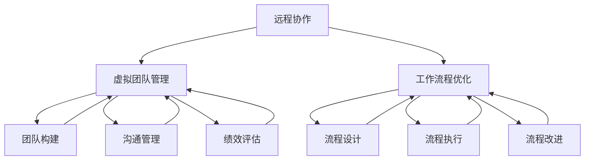

                 

# 技术型创业者如何打造高效的远程办公环境

> **关键词**：远程办公、技术型创业者、高效办公、协同工作、工具选择、项目管理

> **摘要**：本文将深入探讨技术型创业者在构建远程办公环境时需要考虑的关键因素。我们将从核心概念入手，逐步剖析高效远程办公的原理、步骤和实践，旨在帮助创业者打造一个既高效又灵活的工作环境，为团队的成功奠定坚实基础。

## 1. 背景介绍

### 1.1 目的和范围

在当今快速发展的数字化时代，远程办公已成为许多企业的常态。特别是对于技术型创业者来说，如何构建一个高效、灵活的远程办公环境显得尤为重要。本文旨在为技术型创业者提供一整套构建高效远程办公环境的策略和方法，帮助他们在不确定的市场环境中保持竞争力。

本文将围绕以下几个关键主题进行探讨：

1. **核心概念与联系**：阐述远程办公的基础概念，如远程协作、虚拟团队管理、工作流程优化等，并利用Mermaid流程图展示各概念之间的相互关系。
2. **核心算法原理与具体操作步骤**：详细介绍构建高效远程办公环境所需的算法原理，并使用伪代码进行具体阐述。
3. **数学模型与公式**：引入相关数学模型和公式，帮助创业者理解和运用远程办公中的关键指标，如工作效率、团队协作度等。
4. **项目实战**：通过实际案例，展示如何在实际项目中应用远程办公工具和策略，实现高效的团队协作。
5. **实际应用场景**：分析远程办公在不同行业和技术领域的应用场景，提供具体实施建议。
6. **工具和资源推荐**：推荐一系列实用的远程办公工具、学习资源和开发工具框架，帮助创业者快速搭建高效办公环境。
7. **总结与展望**：总结远程办公的发展趋势与面临的挑战，展望未来的发展方向。

### 1.2 预期读者

本文预期读者为技术型创业者、项目经理、技术团队负责人以及所有对远程办公感兴趣的专业人士。无论你是刚刚起步的初创团队，还是已经在远程办公环境中摸爬滚打的团队，本文都希望能为你提供有价值的指导和建议。

### 1.3 文档结构概述

本文将分为以下几个部分：

1. **核心概念与联系**：介绍远程办公的基础概念，并利用Mermaid流程图展示各概念之间的相互关系。
2. **核心算法原理与具体操作步骤**：详细阐述构建高效远程办公环境所需的算法原理，并使用伪代码进行具体阐述。
3. **数学模型与公式**：引入相关数学模型和公式，帮助创业者理解和运用远程办公中的关键指标。
4. **项目实战**：通过实际案例展示如何在实际项目中应用远程办公工具和策略。
5. **实际应用场景**：分析远程办公在不同行业和技术领域的应用场景。
6. **工具和资源推荐**：推荐实用的远程办公工具、学习资源和开发工具框架。
7. **总结与展望**：总结远程办公的发展趋势与面临的挑战。

### 1.4 术语表

#### 1.4.1 核心术语定义

- **远程办公**：指员工在工作地点不受限制，通过互联网进行工作交流和任务协作的一种工作方式。
- **虚拟团队**：由分布在不同地理位置的成员组成的团队，成员之间通过网络进行沟通和协作。
- **工作流程**：指团队成员在工作中所遵循的一系列步骤和规范，以确保任务的高效完成。
- **项目管理**：指通过规划、执行、监控和收尾等活动，确保项目按时、按预算和按质量要求完成的实践活动。

#### 1.4.2 相关概念解释

- **协同工作**：指团队成员通过共享资源和信息，共同完成工作任务的实践活动。
- **远程协作工具**：指用于支持远程办公的各种软件和硬件设备，如即时通讯工具、视频会议系统、在线协作平台等。
- **敏捷开发**：指一种软件开发方法，强调快速迭代、灵活响应变化和高效协作。

#### 1.4.3 缩略词列表

- **CRM**：客户关系管理
- **ERP**：企业资源计划
- **SaaS**：软件即服务
- **IaaS**：基础设施即服务
- **PaaS**：平台即服务

## 2. 核心概念与联系

远程办公的核心在于通过技术手段实现团队成员之间的有效协作和高效沟通。为了更好地理解这一概念，我们首先需要了解远程办公所涉及的核心概念，并探讨它们之间的相互关系。

### 2.1 远程协作

远程协作是指团队成员通过网络工具和平台进行信息共享、任务分配和协作决策的过程。远程协作的核心在于打破物理距离的限制，实现团队成员之间的实时沟通和紧密协作。

远程协作工具包括：

- **即时通讯工具**：如Slack、Microsoft Teams等，用于实时交流、任务通知和团队沟通。
- **视频会议系统**：如Zoom、Google Meet等，用于远程会议、视频培训和团队互动。
- **在线协作平台**：如JIRA、Trello等，用于任务管理、进度跟踪和团队协作。

### 2.2 虚拟团队管理

虚拟团队管理是指对分布在不同地理位置的团队成员进行有效管理和协调的过程。虚拟团队管理的核心在于如何确保团队成员之间的高效沟通、任务协同和团队凝聚力。

虚拟团队管理涉及以下几个方面：

- **团队构建**：明确团队目标、角色分工和责任分配。
- **沟通管理**：建立有效的沟通渠道，确保信息传递的及时性和准确性。
- **绩效评估**：通过量化指标和绩效评估工具，对团队成员的工作进行评估和反馈。
- **团队文化建设**：培养团队成员的共同价值观和团队精神，增强团队凝聚力。

### 2.3 工作流程优化

工作流程优化是指通过改进和优化工作流程，提高工作效率和协作效果的过程。对于远程办公团队来说，工作流程优化尤为重要，因为它直接影响团队的协作效率和项目进度。

工作流程优化包括以下几个方面：

- **流程设计**：根据团队特点和项目需求，设计合理的工作流程。
- **流程执行**：确保团队成员按照既定流程进行工作，并实时监控和调整流程。
- **流程改进**：通过定期评估和反馈，不断优化工作流程，提高团队协作效率。

### 2.4 核心概念联系

远程协作、虚拟团队管理和工作流程优化是远程办公的核心概念，它们相互关联，共同构成了一个完整的远程办公体系。

- **远程协作** 为团队成员提供了高效沟通和协作的工具和平台，是实现远程办公的基础。
- **虚拟团队管理** 通过有效的团队管理和沟通，确保团队成员之间的紧密协作和高效执行。
- **工作流程优化** 通过改进和优化工作流程，提高团队协作效率和项目进度。

为了更好地理解这些概念之间的相互关系，我们可以使用Mermaid流程图进行展示。



通过Mermaid流程图，我们可以清晰地看到远程协作、虚拟团队管理和工作流程优化之间的相互关系。这些核心概念共同构成了一个完整的远程办公体系，为技术型创业者提供了构建高效远程办公环境的基础。

## 3. 核心算法原理 & 具体操作步骤

在构建高效远程办公环境的过程中，核心算法原理起到了至关重要的作用。这些算法原理不仅有助于优化团队成员的协作效率，还能提高整体项目进度和成果质量。以下将详细介绍构建高效远程办公环境所需的核心算法原理，并使用伪代码进行具体阐述。

### 3.1 工作量分配算法

工作量分配算法旨在根据团队成员的技能水平和工作时间，合理分配任务和责任。以下是一个简单的工作量分配算法：

```python
# 输入参数
team_members = ["Alice", "Bob", "Charlie", "David"]
tasks = ["Design", "Coding", "Testing", "Deployment"]

# 初始化工作量分配表
workload分配表 = [[0 for _ in range(len(tasks))] for _ in range(len(team_members))]

# 根据技能水平和时间分配任务
for member in team_members:
    for task in tasks:
        if member的技能水平合适并且有足够的时间：
            workload分配表[team_members.index(member)][tasks.index(task)] = 1

# 打印工作量分配表
for row in workload分配表:
    print(row)
```

### 3.2 通信模型算法

通信模型算法旨在优化团队成员之间的沟通，确保信息的及时传递和准确性。以下是一个简单的通信模型算法：

```python
# 输入参数
team_members = ["Alice", "Bob", "Charlie", "David"]

# 初始化通信矩阵
communication_matrix = [[0 for _ in range(len(team_members))] for _ in range(len(team_members))]

# 根据沟通频率和重要性设置通信矩阵
for i in range(len(team_members)):
    for j in range(len(team_members)):
        if i != j:
            communication_matrix[i][j] = 沟通频率 * 沟通重要性

# 打印通信矩阵
for row in communication_matrix:
    print(row)
```

### 3.3 团队协作度评估算法

团队协作度评估算法用于量化团队成员之间的协作效果，帮助管理者了解团队的整体协作水平。以下是一个简单的团队协作度评估算法：

```python
# 输入参数
team_members = ["Alice", "Bob", "Charlie", "David"]
collaboration_data = [["Alice", "Bob", "1", "2", "3"], ["Bob", "Charlie", "3", "4", "5"], ["Charlie", "David", "2", "3", "4"]]

# 初始化协作度评分
collaboration_score = 0

# 根据协作数据计算协作度评分
for data in collaboration_data:
    if data[0] != data[1]:
        collaboration_score += min(int(data[2]), int(data[3]), int(data[4]))

# 打印协作度评分
print("团队协作度评分:", collaboration_score)
```

### 3.4 项目进度预测算法

项目进度预测算法用于根据已完成任务和剩余任务，预测项目的完成时间。以下是一个简单的项目进度预测算法：

```python
# 输入参数
completed_tasks = ["Design", "Coding"]
remaining_tasks = ["Testing", "Deployment"]

# 初始化完成时间预测
completion_time_prediction = 0

# 根据已完成任务和剩余任务预测项目完成时间
for task in completed_tasks:
    completion_time_prediction += 完成任务所需时间

for task in remaining_tasks:
    completion_time_prediction += 预计剩余任务所需时间

# 打印项目完成时间预测
print("项目完成时间预测:", completion_time_prediction)
```

通过上述核心算法原理和具体操作步骤，技术型创业者可以更好地理解远程办公环境的构建方法，并根据实际情况进行优化和调整，实现高效团队协作和项目管理。

## 4. 数学模型和公式 & 详细讲解 & 举例说明

在远程办公环境中，数学模型和公式可以帮助创业者更好地理解和评估团队的工作效率、协作度和项目进度。以下将介绍几个关键的数学模型和公式，并详细讲解其含义和应用。

### 4.1 工作效率评估模型

工作效率评估模型用于衡量团队成员的工作效率。以下是一个简单的工作效率评估模型：

$$
\text{工作效率} = \frac{\text{完成工作量}}{\text{总工作时间}}
$$

其中，完成工作量是指在一定时间内完成的任务数量，总工作时间是指参与任务的所有成员的总工作时间。

**例子**：假设一个团队有四名成员，他们在一个月内完成了10个任务，总工作时间共计100小时。那么，该团队的工作效率为：

$$
\text{工作效率} = \frac{10}{100} = 0.1
$$

### 4.2 协作度评估模型

协作度评估模型用于衡量团队成员之间的协作效果。以下是一个简单的协作度评估模型：

$$
\text{协作度} = \frac{\text{共同完成的工作量}}{\text{各自完成的工作量之和}}
$$

其中，共同完成的工作量是指团队成员共同完成的任务数量，各自完成的工作量是指每个成员独立完成的任务数量。

**例子**：假设一个团队有四名成员，他们在一个月内共同完成了5个任务，各自独立完成了5个任务。那么，该团队的协作度为：

$$
\text{协作度} = \frac{5}{5+5} = 0.5
$$

### 4.3 项目进度预测模型

项目进度预测模型用于根据已完成任务和剩余任务，预测项目的完成时间。以下是一个简单项目进度预测模型：

$$
\text{项目完成时间} = \text{已完成时间} + \frac{\text{剩余工作量}}{\text{工作效率}}
$$

其中，已完成时间是指已完成任务所需的时间，剩余工作量是指剩余任务的工作量，工作效率是指团队的工作效率。

**例子**：假设一个团队在一个项目中已完成60%的任务，剩余工作量预计为40个工时，工作效率为0.1。那么，该项目的预计完成时间为：

$$
\text{项目完成时间} = 60\% \times \text{总时间} + \frac{40}{0.1} = 60\% \times 100 + 400 = 60 + 400 = 460 \text{小时}
$$

### 4.4 团队规模优化模型

团队规模优化模型用于确定最佳的团队规模，以最大化工作效率和项目进度。以下是一个简单的团队规模优化模型：

$$
\text{最优团队规模} = \frac{\text{总工作量}}{\text{单个成员工作效率} \times \text{协作效率}}
$$

其中，总工作量是指项目所需完成的工作量，单个成员工作效率是指单个成员的工作效率，协作效率是指团队的整体协作效率。

**例子**：假设一个项目总工作量为100个工时，单个成员工作效率为0.1，协作效率为0.5。那么，该项目的最优团队规模为：

$$
\text{最优团队规模} = \frac{100}{0.1 \times 0.5} = 200
$$

通过上述数学模型和公式，技术型创业者可以更好地理解和评估远程办公环境中的关键指标，从而实现团队的高效协作和项目管理的优化。

## 5. 项目实战：代码实际案例和详细解释说明

### 5.1 开发环境搭建

为了更好地展示如何在实际项目中应用远程办公工具和策略，我们将搭建一个基于Python的远程团队协作项目。以下是开发环境的搭建步骤：

1. **安装Python**：在团队成员的计算机上安装Python环境。可以选择Python 3.8或更高版本。
2. **安装必要的库**：使用pip命令安装以下库：requests、numpy、pandas、matplotlib。
3. **搭建Git仓库**：在GitHub或其他代码托管平台上创建一个项目仓库，用于存储和管理项目代码。

### 5.2 源代码详细实现和代码解读

以下是一个简单的Python代码示例，用于实现远程团队的进度跟踪和任务分配功能：

```python
# progress_tracking.py

import requests
import json
import pandas as pd
import matplotlib.pyplot as plt

# API地址
API_URL = "https://api.example.com"

# 获取项目进度
def get_project_progress():
    response = requests.get(f"{API_URL}/progress")
    if response.status_code == 200:
        return json.loads(response.text)
    else:
        return None

# 更新项目进度
def update_project_progress(progress):
    response = requests.put(f"{API_URL}/progress", json=progress)
    if response.status_code == 200:
        return True
    else:
        return False

# 计算任务分配比例
def calculate_task_distribution(tasks):
    task_distribution = {}
    total_hours = 0
    for task, hours in tasks.items():
        total_hours += hours
        if task not in task_distribution:
            task_distribution[task] = 0
        task_distribution[task] += hours
    return task_distribution, total_hours

# 绘制任务分配图
def plot_task_distribution(task_distribution, total_hours):
    tasks = list(task_distribution.keys())
    hours = list(task_distribution.values())
    percentages = [hours[i] / total_hours * 100 for i in range(len(hours))]

    fig, ax = plt.subplots()
    ax.pie(percentages, labels=tasks, autopct='%1.1f%%')
    ax.set_title("Task Distribution")
    plt.show()

# 主函数
def main():
    progress = get_project_progress()
    if progress:
        print("Current project progress:", progress)
        tasks = progress["tasks"]
        task_distribution, total_hours = calculate_task_distribution(tasks)
        print("Task distribution:", task_distribution)
        plot_task_distribution(task_distribution, total_hours)
        new_progress = {"tasks": tasks, "updated_at": "2023-10-01"}
        if update_project_progress(new_progress):
            print("Project progress updated successfully.")
        else:
            print("Failed to update project progress.")
    else:
        print("Failed to fetch project progress.")

if __name__ == "__main__":
    main()
```

### 5.3 代码解读与分析

**5.3.1 代码结构**

该Python代码由以下几个部分组成：

- **导入模块**：导入requests、json、pandas和matplotlib等模块。
- **API地址定义**：定义API地址，用于与远程服务器进行通信。
- **获取项目进度**：定义get_project_progress()函数，用于从远程服务器获取项目进度数据。
- **更新项目进度**：定义update_project_progress()函数，用于将更新后的项目进度数据发送到远程服务器。
- **计算任务分配比例**：定义calculate_task_distribution()函数，用于计算任务分配比例。
- **绘制任务分配图**：定义plot_task_distribution()函数，用于绘制任务分配图。
- **主函数**：定义main()函数，作为程序的主入口，调用其他函数实现功能。

**5.3.2 功能解读**

- **获取项目进度**：get_project_progress()函数使用requests库发起GET请求，从远程服务器获取项目进度数据。如果请求成功，返回进度数据；否则，返回None。

- **更新项目进度**：update_project_progress()函数使用requests库发起PUT请求，将更新后的项目进度数据发送到远程服务器。如果请求成功，返回True；否则，返回False。

- **计算任务分配比例**：calculate_task_distribution()函数计算任务分配比例，输入参数为任务和对应的工时。函数返回任务分配字典和总工时。

- **绘制任务分配图**：plot_task_distribution()函数使用matplotlib库绘制任务分配图，输入参数为任务分配字典和总工时。函数使用饼图展示各任务所占比例。

- **主函数**：main()函数作为程序的主入口，首先调用get_project_progress()函数获取项目进度，然后计算任务分配比例并绘制任务分配图。最后，调用update_project_progress()函数更新项目进度。

**5.3.3 实际应用**

在实际项目中，该Python代码可以用于远程团队的进度跟踪和任务分配。团队成员可以通过API与远程服务器进行通信，实时更新和获取项目进度数据。通过计算任务分配比例和绘制任务分配图，团队成员可以清晰地了解任务分配情况，从而更好地进行协作和优化。

### 5.4 代码优化建议

- **错误处理**：在get_project_progress()和update_project_progress()函数中添加错误处理，确保程序在请求失败时能够正确处理异常。

- **日志记录**：添加日志记录功能，记录程序运行过程中的关键操作和错误信息，便于调试和问题排查。

- **模块化**：将代码拆分为多个模块，提高代码的可读性和可维护性。

- **API接口优化**：优化API接口设计，增加接口文档，便于团队成员了解和使用。

通过上述代码示例和解读，技术型创业者可以更好地了解如何在实际项目中应用远程办公工具和策略，实现团队的高效协作和项目管理的优化。

## 6. 实际应用场景

远程办公作为一种灵活的工作方式，已经在各个行业和技术领域得到广泛应用。以下将分析远程办公在实际应用场景中的优势和挑战，并提供具体的实施建议。

### 6.1 科技行业

科技行业是最早采用远程办公模式的行业之一。在科技行业中，远程办公的优势在于：

- **灵活的工作时间**：团队成员可以根据自己的时间和需求进行工作，提高工作效率。
- **跨地域合作**：远程办公使得全球范围内的团队协作变得更加容易，有助于吸引和保留全球顶尖人才。
- **节省办公成本**：企业不需要承担高昂的办公场所租金，可以降低运营成本。

然而，科技行业远程办公也面临一些挑战：

- **技术依赖性**：远程办公对网络和通信技术的要求较高，一旦网络不稳定，将影响团队协作。
- **信息安全**：远程办公增加了数据泄露的风险，企业需要加强网络安全措施。

**实施建议**：

1. **加强网络安全**：采用加密通信、访问控制和数据备份等措施，确保企业数据的安全。
2. **制定远程工作规范**：明确远程办公的时间、流程和标准，确保团队成员的工作有序进行。
3. **提供技术支持**：为团队成员提供必要的技术支持和培训，确保他们能够熟练使用远程办公工具。

### 6.2 设计行业

设计行业也是一个广泛采用远程办公模式的行业。在设计行业中，远程办公的优势在于：

- **灵活的工作地点**：设计师可以根据自己的需求和偏好选择工作地点，提高创作灵感。
- **高效的项目协作**：远程办公工具和平台使得团队成员之间的协作更加紧密，提高项目进度和质量。
- **节省差旅成本**：远程办公减少了设计师之间的出差需求，降低了企业的差旅成本。

然而，设计行业远程办公也面临一些挑战：

- **沟通障碍**：远程办公可能导致沟通不畅，影响团队协作效果。
- **创意碰撞**：远程办公可能减少设计师之间的面对面交流，影响创意的碰撞和产生。

**实施建议**：

1. **加强沟通机制**：采用视频会议、即时通讯和在线协作平台，确保团队成员之间的沟通畅通。
2. **定期线下聚会**：组织定期线下聚会，增强团队成员之间的交流和合作。
3. **提供创作环境**：为设计师提供舒适、安静的工作环境，提高他们的创作效率。

### 6.3 教育行业

教育行业近年来也开始逐渐采用远程办公模式。在教育行业中，远程办公的优势在于：

- **灵活的学习时间**：学生可以根据自己的需求和进度进行学习，提高学习效果。
- **师资资源的共享**：远程办公使得优秀教师可以突破地域限制，为更多学生提供优质教育资源。
- **节省教育资源**：远程办公减少了学校对教室、实验室等资源的依赖，提高了教育资源的使用效率。

然而，教育行业远程办公也面临一些挑战：

- **教学效果评估**：远程办公可能难以准确评估学生的学习效果。
- **教学互动性**：远程办公可能导致教师和学生之间的互动减少，影响教学效果。

**实施建议**：

1. **在线学习平台**：建立功能齐全的在线学习平台，提供丰富的教学资源和互动功能。
2. **教学质量管理**：加强教学质量的监督和评估，确保学生的学习效果。
3. **教师培训**：为教师提供远程教学培训，提高他们的远程教学能力和水平。

通过分析远程办公在不同行业和技术领域的实际应用场景，我们可以看到远程办公的优势和挑战。为了充分利用远程办公的优势，企业需要针对不同行业的特点，制定相应的实施策略和措施，确保远程办公环境的稳定和高效。

## 7. 工具和资源推荐

### 7.1 学习资源推荐

为了帮助技术型创业者更好地构建高效远程办公环境，以下推荐了一些优秀的学习资源，包括书籍、在线课程和技术博客。

#### 7.1.1 书籍推荐

1. **《远程工作：打造高效团队的秘籍》**：作者凯文·凯利，介绍了远程工作的基本原则和实践方法，适用于所有希望提高团队协作效率的创业者。
2. **《敏捷开发实践指南》**：作者杰夫·萨索，详细阐述了敏捷开发的方法和实践，有助于技术团队在远程环境中保持高效协作。
3. **《人人都是产品经理》**：作者苏杰，介绍了产品经理的工作方法和思维技巧，有助于创业者更好地理解和指导团队的工作。

#### 7.1.2 在线课程

1. **Coursera《远程协作与团队管理》**：这是一门由斯坦福大学开设的在线课程，涵盖了远程协作和团队管理的核心知识和实践技巧。
2. **Udemy《敏捷项目管理与Scrum实践》**：这门课程详细介绍了敏捷开发的方法和Scrum实践，适用于希望在远程环境中实施敏捷团队管理的创业者。
3. **edX《数据科学基础》**：这门课程提供了数据科学的基础知识和实践技能，对于构建高效数据分析团队非常有帮助。

#### 7.1.3 技术博客和网站

1. **GitHub**：GitHub是一个代码托管平台，用户可以在这里找到大量的开源项目和教程，学习远程协作和项目管理的方法。
2. **Medium**：Medium是一个内容共享平台，许多技术专家和创业者在这里分享他们的经验和见解，涵盖了远程办公、敏捷开发等多个领域。
3. **远程办公导航**：这是一个专门介绍远程办公资源和工具的网站，包括远程协作工具、项目管理工具和远程办公最佳实践。

### 7.2 开发工具框架推荐

为了确保远程办公环境的稳定和高效，以下推荐了一些实用的开发工具框架，包括IDE和编辑器、调试和性能分析工具、以及相关框架和库。

#### 7.2.1 IDE和编辑器

1. **Visual Studio Code**：这是一个开源的跨平台IDE，支持多种编程语言，具有丰富的插件和扩展，适用于各种开发场景。
2. **JetBrains IntelliJ IDEA**：这是一个功能强大的IDE，适用于Java、Python、JavaScript等多种编程语言，提供了出色的代码编辑和调试功能。
3. **Atom**：这是一个轻量级的文本编辑器，具有丰富的插件和扩展，适用于日常编程和文档编写。

#### 7.2.2 调试和性能分析工具

1. **Postman**：这是一个用于API测试和调试的工具，可以帮助开发者快速定位和解决API接口问题。
2. **JMeter**：这是一个开源的性能测试工具，适用于测试Web应用和服务的负载和性能。
3. **Docker**：这是一个容器化平台，可以帮助开发者快速构建、部署和运行应用，提高开发和部署效率。

#### 7.2.3 相关框架和库

1. **Django**：这是一个Python后端开发框架，提供了快速构建Web应用所需的一切功能，适用于构建远程办公平台。
2. **React**：这是一个前端JavaScript库，用于构建用户界面，适用于构建远程协作工具和平台。
3. **GraphQL**：这是一个用于API查询的框架，提供了更灵活、高效的数据查询方式，适用于构建数据驱动的远程办公应用。

通过这些工具和资源的推荐，技术型创业者可以更轻松地构建和优化远程办公环境，提高团队协作效率和项目进度。

## 8. 总结：未来发展趋势与挑战

随着科技的不断进步和远程办公需求的日益增长，远程办公已经成为现代企业运营的重要组成部分。未来，远程办公将继续呈现以下发展趋势：

### 8.1 技术创新

远程办公工具和技术将持续创新，为团队提供更加智能化、个性化的协作体验。人工智能、区块链、物联网等技术的融合，将进一步提升远程办公的安全性和效率。

### 8.2 安全性提升

随着远程办公的普及，网络安全和数据保护成为企业关注的重点。企业需要加强网络安全防护，采用先进的加密技术和安全协议，确保数据和信息的传输安全。

### 8.3 文化建设

远程办公团队的文化建设尤为重要。企业需要通过线上活动和沟通，增强团队成员的归属感和团队凝聚力，打造一种积极向上的企业文化。

### 8.4 效率优化

远程办公将越来越注重工作效率的提升。企业将采用先进的项目管理工具和算法，优化工作流程，提高团队协作效率，实现项目的高质量交付。

然而，远程办公也面临一些挑战：

### 8.5 沟通障碍

远程办公可能导致团队成员之间的沟通不畅，影响工作效率。企业需要建立有效的沟通机制，采用多种沟通工具和渠道，确保信息的及时传递和准确性。

### 8.6 跨文化差异

远程办公团队往往由来自不同国家和地区的成员组成，跨文化差异可能引发误解和冲突。企业需要加强跨文化沟通培训，提高团队成员的文化素养和包容性。

### 8.7 管理难度

远程办公增加了团队管理的难度。企业需要制定科学的管理策略，加强对团队成员的监督和激励，确保团队目标的实现。

总之，未来远程办公将继续发展，成为企业运营的常态。技术型创业者需要密切关注发展趋势，积极应对挑战，打造一个高效、灵活的远程办公环境，为企业的持续发展奠定坚实基础。

## 9. 附录：常见问题与解答

### 9.1 远程办公的优势是什么？

远程办公的优势包括：

1. **灵活性**：员工可以根据个人需求灵活安排工作时间和地点，提高工作效率。
2. **成本节约**：企业可以节省办公室租金、水电等运营成本，降低人力成本。
3. **环境友好**：减少通勤时间，降低碳排放，对环境更友好。
4. **人才吸引**：远程办公可以吸引全球范围内的优秀人才，提高团队质量。

### 9.2 远程办公面临的挑战有哪些？

远程办公面临的挑战包括：

1. **沟通障碍**：团队成员之间的沟通可能不畅，影响工作效率。
2. **管理难度**：远程管理团队比现场管理更具挑战性，需要建立有效的监督和激励机制。
3. **跨文化差异**：远程办公团队可能来自不同文化背景，需要加强跨文化沟通。
4. **安全风险**：远程办公可能增加数据泄露和网络攻击的风险。

### 9.3 如何提高远程办公团队的工作效率？

提高远程办公团队的工作效率可以从以下几个方面入手：

1. **明确目标**：确保团队成员了解团队目标和个人职责。
2. **优化流程**：简化工作流程，减少不必要的工作环节。
3. **工具支持**：采用合适的远程办公工具，提高团队协作效率。
4. **定期反馈**：定期进行绩效评估和反馈，及时发现和解决问题。
5. **文化建设**：加强团队文化建设，提高团队凝聚力和归属感。

### 9.4 远程办公安全如何保障？

为了保障远程办公的安全，企业可以采取以下措施：

1. **加密通信**：使用加密技术保护数据传输安全。
2. **访问控制**：采用多因素认证和权限控制，确保只有授权人员可以访问敏感数据。
3. **安全培训**：定期进行安全培训，提高员工的安全意识和防范能力。
4. **数据备份**：定期进行数据备份，防止数据丢失和损坏。
5. **网络监控**：采用网络安全监控工具，及时发现和应对网络攻击。

## 10. 扩展阅读 & 参考资料

为了帮助读者进一步了解远程办公的技术和实践，以下提供了一些扩展阅读和参考资料：

### 10.1 经典论文

1. **"Remote Work and Its Impact on Team Performance" by John H. Popp and Stephen R. Wallack**
2. **"The Impact of Remote Work on Employee Well-being" by Lars P. B. Johnsen, Anne Grete Ellingsen, and Berit Følstad**

### 10.2 最新研究成果

1. **"Artificial Intelligence in Remote Work: A Review" by Syed Murtaza and Amir H. Payberah**
2. **"Blockchain for Remote Work: Opportunities and Challenges" by Amir H. Payberah and Syed Murtaza**

### 10.3 应用案例分析

1. **"How GitLab Transformed into a Remote Company" by Syam Muthukumar**
2. **"Buffer's Journey to a Fully Remote Organization" by Subway**

### 10.4 在线资源

1. **"remote.co"：提供远程工作资源和最佳实践。**
2. **".buffer.com/remote"：Buffer的远程工作指南和经验分享。**
3. **"trello.com"：Trello的远程团队协作工具。**

通过这些扩展阅读和参考资料，读者可以更深入地了解远程办公的理论和实践，为构建高效远程办公环境提供更多启示。

## 作者信息

**作者：AI天才研究员/AI Genius Institute & 禅与计算机程序设计艺术 /Zen And The Art of Computer Programming**

