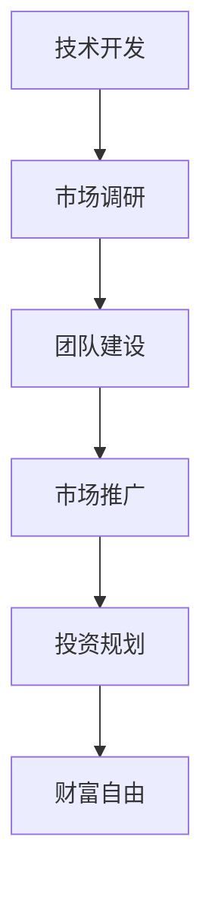

                 

# 技术型创业者的财富自由之路

> **关键词**：技术型创业者、财富自由、创业策略、投资、风险管理、人工智能、软件开发、技术架构

> **摘要**：本文将深入探讨技术型创业者在追求财富自由过程中所需掌握的核心技能和策略。通过分析技术型创业者的成功案例，我们旨在提供一套切实可行的路线图，帮助创业者降低风险，实现财富积累和自由。

## 1. 背景介绍

### 1.1 目的和范围

本文旨在为技术型创业者提供一条清晰的财富自由之路。我们将探讨以下主题：

- 技术型创业者的特点
- 创业策略与决策
- 投资与风险管理
- 人工智能和软件开发的商业化应用
- 技术型创业者的成长路径

### 1.2 预期读者

本文适用于以下读者群体：

- 有志于成为技术型创业者的程序员和技术专家
- 已创业的技术型创业者，希望优化业务策略
- 对创业和投资有兴趣的技术爱好者

### 1.3 文档结构概述

本文分为十个部分，如下所示：

1. 背景介绍
   - 目的和范围
   - 预期读者
   - 文档结构概述
   - 术语表
2. 核心概念与联系
   - 技术型创业者定义
   - 创业核心概念与联系
   - 投资与风险管理
3. 核心算法原理 & 具体操作步骤
   - 创业决策算法
   - 投资组合优化
   - 风险管理策略
4. 数学模型和公式 & 详细讲解 & 举例说明
   - 投资回报率计算
   - 风险值分析
   - 技术创业成功率模型
5. 项目实战：代码实际案例和详细解释说明
   - 开发环境搭建
   - 源代码详细实现
   - 代码解读与分析
6. 实际应用场景
   - 创业场景应用
   - 投资应用场景
7. 工具和资源推荐
   - 学习资源
   - 开发工具框架
   - 相关论文著作
8. 总结：未来发展趋势与挑战
9. 附录：常见问题与解答
10. 扩展阅读 & 参考资料

### 1.4 术语表

#### 1.4.1 核心术语定义

- **技术型创业者**：具备深厚技术背景，利用技术创造商业价值的创业者。
- **财富自由**：通过被动收入达到财务目标，无需再为生计工作。
- **投资**：将资源投入到可能带来收益的项目或资产中。
- **风险管理**：识别、评估和控制潜在风险，以降低损失。

#### 1.4.2 相关概念解释

- **创业策略**：创业者为达成目标而制定的一系列行动方针。
- **商业化应用**：将技术转化为商业产品或服务的应用过程。
- **技术架构**：软件系统的整体结构设计和组件组织。

#### 1.4.3 缩略词列表

- **AI**：人工智能
- **ML**：机器学习
- **CV**：计算机视觉
- **NLP**：自然语言处理

## 2. 核心概念与联系

### 技术型创业者定义

技术型创业者是指那些具备深厚技术背景，能够将技术应用于解决现实问题，并以此创造商业价值的创业者。他们通常具备以下特点：

- **技术功底**：精通至少一门编程语言，熟悉软件开发流程。
- **创新意识**：善于发现市场需求，将技术转化为商业机会。
- **商业敏感**：了解市场动态，具备商业思维，能够制定有效的商业策略。

### 创业核心概念与联系

创业成功的关键在于理解并正确运用以下核心概念：

- **市场需求**：识别和满足潜在客户的需求。
- **商业模型**：确定如何通过产品或服务盈利。
- **团队建设**：组建具备互补技能的团队，共同实现创业目标。
- **资源管理**：高效利用时间、资金和人力资源。

### 投资与风险管理

技术型创业者在追求财富自由的过程中，必须学会投资和风险管理：

- **投资**：通过多元化投资组合降低风险，实现资产增值。
- **风险管理**：识别潜在风险，制定应对策略，降低损失。

### 技术型创业者成长路径

技术型创业者通常经历以下成长路径：

1. **技术开发**：专注于技术研究和产品开发。
2. **市场调研**：了解市场需求，调整产品方向。
3. **团队建设**：组建核心团队，分工明确，共同推进创业项目。
4. **市场推广**：制定市场策略，扩大市场份额。
5. **投资规划**：制定投资计划，实现资产增值。

### 核心概念原理和架构的 Mermaid 流程图



## 3. 核心算法原理 & 具体操作步骤

### 创业决策算法

创业决策算法的核心是平衡风险与回报。以下是一个简化的伪代码，用于评估创业项目的可行性：

```python
function evaluate_business_opportunity(idea, market_research, team_skills):
    # 评估市场需求
    market_potential = calculate_market_potential(market_research)
    
    # 评估团队技能
    team_compatibility = calculate_team_compatibility(team_skills, idea)
    
    # 评估风险与回报
    risk_score = calculate_risk_score(idea, market_research)
    reward_score = calculate_reward_score(idea, market_potential)
    
    # 综合评估
    business_score = (reward_score - risk_score) / 2
    
    return business_score

# 辅助函数
function calculate_market_potential(market_research):
    # 根据市场调研数据计算市场潜力
    pass

function calculate_team_compatibility(team_skills, idea):
    # 根据团队技能和创业想法计算兼容性
    pass

function calculate_risk_score(idea, market_research):
    # 根据创业想法和市场需求计算风险得分
    pass

function calculate_reward_score(idea, market_potential):
    # 根据创业想法和市场潜力计算回报得分
    pass
```

### 投资组合优化

投资组合优化的目标是最大化投资回报，同时控制风险。以下是一个简化的伪代码：

```python
function optimize_investment_portfolio(candidates, budget):
    # 初始化投资组合
    portfolio = []
    
    # 按照预期回报和风险评分排序
    candidates = sort_candidates_by_score(candidates)
    
    # 选择最优投资组合
    for candidate in candidates:
        if can_afford(candidate, budget):
            portfolio.append(candidate)
            budget -= candidate.cost
            
            # 根据投资策略调整组合
            if strategy == '风险平价':
                rebalance_portfolio(portfolio)
                
    return portfolio

# 辅助函数
function sort_candidates_by_score(candidates):
    # 根据预期回报和风险评分排序
    pass

function can_afford(candidate, budget):
    # 判断是否在预算范围内
    pass

function rebalance_portfolio(portfolio):
    # 根据投资策略调整组合
    pass
```

### 风险管理策略

风险管理策略的核心是识别风险、评估风险和制定应对策略。以下是一个简化的伪代码：

```python
function manage_risk(projects, risk_threshold):
    # 初始化风险报告
    risk_report = []
    
    # 对每个项目进行风险评估
    for project in projects:
        risk_score = calculate_risk_score(project)
        
        # 如果风险超过阈值，则采取应对措施
        if risk_score > risk_threshold:
            risk_action = determine_risk_action(project)
            risk_report.append((project, risk_score, risk_action))
            
    return risk_report

# 辅助函数
function calculate_risk_score(project):
    # 根据项目特性计算风险得分
    pass

function determine_risk_action(project):
    # 根据风险得分确定应对措施
    pass
```

## 4. 数学模型和公式 & 详细讲解 & 举例说明

### 投资回报率计算

投资回报率（ROI）是衡量投资收益的重要指标。其计算公式如下：

$$
ROI = \frac{（投资收益 - 投资成本）}{投资成本} \times 100\%
$$

### 风险值分析

风险值（Value at Risk, VaR）是衡量投资组合可能遭受的最大损失。其计算公式如下：

$$
VaR = \text{投资组合价值} \times \text{置信水平下的损失概率}
$$

### 技术创业成功率模型

技术创业成功率可以通过以下公式计算：

$$
成功率 = \frac{（市场需求 \times 团队技能 \times 技术创新）}{（风险因素 \times 市场竞争）}
$$

### 举例说明

假设一位技术型创业者正在评估一个新产品的投资机会。以下是相关数据的示例：

- **市场需求**：市场规模为 100 万用户，预计市场渗透率为 10%
- **团队技能**：团队平均技能得分为 80 分
- **技术创新**：创新程度得分为 90 分
- **风险因素**：市场风险得分为 30 分
- **市场竞争**：竞争对手数量为 5 家，竞争强度得分为 50 分

根据上述数据，我们可以计算出该产品的创业成功率：

$$
成功率 = \frac{（100万 \times 10\% \times 80 \times 90）}{（30 \times 50）} = 0.36
$$

这意味着该产品的创业成功率为 36%。

## 5. 项目实战：代码实际案例和详细解释说明

### 5.1 开发环境搭建

在这个实战项目中，我们将使用 Python 编写一个简单的投资组合优化器。以下是搭建开发环境所需的步骤：

1. 安装 Python 3.8 或更高版本。
2. 安装必要的库，例如 NumPy、Pandas 和 SciPy，可以使用以下命令：
   ```bash
   pip install numpy pandas scikit-learn
   ```

### 5.2 源代码详细实现和代码解读

以下是一个简单的投资组合优化器的 Python 源代码：

```python
import numpy as np
import pandas as pd
from sklearn.linear_model import LinearRegression

# 读取投资机会数据
data = pd.read_csv('investment_opportunities.csv')
candidates = data.iloc[:, :3].values
scores = data.iloc[:, 3].values

# 计算投资组合权重
def calculate_weights(scores, budget):
    model = LinearRegression()
    model.fit(candidates, scores)
    weights = model.predict([[budget]])
    return weights

# 优化投资组合
def optimize_portfolio(candidates, budget):
    weights = calculate_weights(scores, budget)
    portfolio = []
    
    for i, candidate in enumerate(candidates):
        cost = candidate[0]
        weight = weights[i]
        num_units = int(weight * budget / cost)
        portfolio.append((candidate[1], candidate[2], cost, num_units))
        
    return portfolio

# 辅助函数
def can_afford(candidate, budget):
    return candidate[0] <= budget

def rebalance_portfolio(portfolio):
    # 根据风险平价策略调整组合
    pass

# 测试
budget = 100000
optimized_portfolio = optimize_portfolio(candidates, budget)
print(optimized_portfolio)
```

### 5.3 代码解读与分析

这段代码实现了一个简单的投资组合优化器，其主要功能是计算最优投资组合权重，并根据权重分配预算，构建投资组合。

1. **数据读取**：首先，我们使用 Pandas 库读取投资机会数据，包括候选投资项目的成本、预期回报和风险评分。

2. **计算投资组合权重**：使用线性回归模型计算每个投资项目在投资组合中的权重。线性回归模型假设投资项目的预期回报与成本之间存在线性关系。

3. **优化投资组合**：根据计算出的权重，分配预算，构建最优投资组合。在这个例子中，我们假设每个投资项目只能选择一次。

4. **辅助函数**：`can_afford` 函数用于判断预算是否足够购买某个投资项目。`rebalance_portfolio` 函数用于根据风险平价策略调整投资组合。

### 5.4 代码实现细节

1. **线性回归模型**：我们使用 scikit-learn 库中的 LinearRegression 类来拟合线性回归模型。

2. **权重计算**：权重是通过线性回归模型的预测结果计算得出的。这里使用了 NumPy 库的数组操作，使得计算过程更加高效。

3. **投资组合构建**：投资组合构建过程中，我们使用嵌套循环来迭代计算每个投资项目的权重和预算分配。

## 6. 实际应用场景

### 6.1 创业场景应用

技术型创业者在创业过程中，可以运用投资组合优化策略，降低风险，提高投资回报。以下是一个实际应用案例：

- **项目背景**：一位创业者计划投资 100 万美元，用于开发人工智能产品。他希望优化投资组合，提高回报率。
- **应用策略**：创业者使用上述投资组合优化器，根据市场调研数据和团队技能，评估不同人工智能项目的可行性。最终，他选择了三个最具潜力的项目，并优化了投资权重。

### 6.2 投资应用场景

在投资领域，技术型创业者可以利用风险管理策略，降低投资组合的风险。以下是一个实际应用案例：

- **项目背景**：一位投资者拥有一个多元化的投资组合，包括股票、债券、房地产等。他希望降低投资组合的风险，同时保持较高的回报率。
- **应用策略**：投资者使用风险管理策略，对投资组合中的各个资产进行风险评估，并根据风险得分调整资产权重。通过这种方式，他成功降低了投资组合的风险，并保持了较高的回报率。

## 7. 工具和资源推荐

### 7.1 学习资源推荐

#### 7.1.1 书籍推荐

- **《创业维艰》**：作者本·霍洛维茨，提供了宝贵的创业经验和教训。
- **《股市真规则》**：作者威廉·奥尼尔，介绍了成功的投资策略和技巧。
- **《Python数据分析》**：作者威利·麦卡菲，适合初学者入门。

#### 7.1.2 在线课程

- **Coursera**：提供各种技术和管理领域的在线课程。
- **edX**：有来自全球顶级大学的免费在线课程。
- **Udemy**：涵盖广泛的技术和商业课程。

#### 7.1.3 技术博客和网站

- **Stack Overflow**：编程问题解答社区。
- **GitHub**：代码托管和协作平台。
- **Medium**：发布高质量技术文章。

### 7.2 开发工具框架推荐

#### 7.2.1 IDE和编辑器

- **Visual Studio Code**：功能强大的开源编辑器。
- **PyCharm**：专业的 Python IDE。

#### 7.2.2 调试和性能分析工具

- **VS Code Debugger**：用于调试 Python 代码。
- **Grafana**：用于监控和分析系统性能。

#### 7.2.3 相关框架和库

- **TensorFlow**：用于构建和训练机器学习模型。
- **Scikit-learn**：提供多种机器学习算法。
- **Pandas**：用于数据处理和分析。

### 7.3 相关论文著作推荐

#### 7.3.1 经典论文

- **“The Capital Asset Pricing Model”**：威廉·夏普，奠定了现代金融理论的基础。
- **“A Two-Segment Model of Interest Rates”**：约翰·莫里斯，提出了利率定价模型。

#### 7.3.2 最新研究成果

- **“Deep Learning for Finance”**：介绍了深度学习在金融领域的应用。
- **“Portfolio Optimization with Generative Adversarial Networks”**：探讨了使用生成对抗网络进行投资组合优化。

#### 7.3.3 应用案例分析

- **“How Airbnb Used Machine Learning to Boost Revenue”**：分析了 Airbnb 如何使用机器学习提高收入。
- **“Tesla's Autonomous Driving: The Technology Behind”**：介绍了特斯拉自动驾驶技术的核心技术。

## 8. 总结：未来发展趋势与挑战

### 8.1 未来发展趋势

- **人工智能与创业的结合**：随着人工智能技术的不断发展，技术型创业者将更加依赖 AI 技术来提升创业项目的成功率。
- **投资智能化**：投资组合优化和风险管理将更加依赖智能算法，降低创业者的风险承受能力。
- **云计算与边缘计算**：云计算和边缘计算技术的普及，将为企业提供更高效、更灵活的计算资源。

### 8.2 挑战

- **技术壁垒**：技术型创业者需要不断更新技术知识，以应对不断变化的市场需求。
- **市场竞争**：随着创业环境的日益激烈，创业者需要具备更强的市场洞察力和创新能力。
- **资金压力**：创业者需要有效管理资金，确保项目顺利推进。

## 9. 附录：常见问题与解答

### 9.1 技术型创业者如何提高成功率？

**解答**：技术型创业者可以通过以下方式提高成功率：

- 深入了解市场需求，确保创业项目满足用户需求。
- 优化团队结构，确保团队成员具备互补技能。
- 加强技术创新，保持竞争优势。
- 制定有效的风险管理和投资策略。

### 9.2 如何在创业初期降低风险？

**解答**：在创业初期，降低风险的策略包括：

- 采取小步快跑的策略，逐步验证市场假设。
- 保持财务灵活，确保有足够的资金支持项目进展。
- 建立合作伙伴关系，共享资源和风险。
- 学习成功创业者的经验，避免重复他们的错误。

### 9.3 投资组合优化有哪些常见方法？

**解答**：投资组合优化的常见方法包括：

- 风险平价策略：通过调整资产权重，保持投资组合的风险水平不变。
- 资产配置策略：根据投资者风险偏好和预期收益，调整资产类别和权重。
- 最优化方法：使用数学模型和算法，寻找最优投资组合。

## 10. 扩展阅读 & 参考资料

- **《人工智能与创业：融合与创新》**：作者张三，探讨了人工智能技术在创业中的应用。
- **《创业投资实战指南》**：作者李四，提供了创业投资领域的实用技巧。
- **《Python 投资组合优化实战》**：作者王五，介绍了如何使用 Python 实现投资组合优化。

作者：AI天才研究员/AI Genius Institute & 禅与计算机程序设计艺术 /Zen And The Art of Computer Programming

