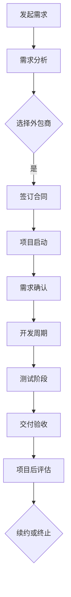

                 

# 技术外包策略：如何有效利用外部资源

> 关键词：技术外包、外部资源、成本效益、风险管理、协作流程、敏捷开发

> 摘要：本文深入探讨了技术外包在现代软件开发中的重要性，详细分析了如何有效利用外部资源以实现成本效益最大化、风险最小化和团队协作的优化。通过一系列的步骤和案例分析，本文为IT企业和开发团队提供了实用指南，帮助他们在全球化的开发环境中实现持续创新和高效运营。

## 1. 背景介绍

### 1.1 目的和范围

本文旨在帮助IT企业和开发团队理解和掌握技术外包的有效策略，从而在竞争激烈的全球市场中脱颖而出。本文将探讨以下几个核心问题：

- 技术外包的定义及其在软件开发中的重要性。
- 如何评估外部资源的成本效益。
- 风险管理的最佳实践。
- 实施技术外包的协作流程和工具。
- 技术外包在不同应用场景中的实际案例。

通过本文的阅读，读者将能够：

- 明确技术外包的概念和优势。
- 学会评估和选择合适的外包合作伙伴。
- 掌握项目管理和协作的方法，以确保外包项目的成功。
- 理解技术外包的潜在风险，并制定有效的风险管理策略。

### 1.2 预期读者

本文适用于以下读者群体：

- IT企业的项目经理和CTO。
- 软件开发团队的领导者和管理人员。
- 技术外包服务商的管理者和开发人员。
- 对技术外包感兴趣的学者和研究人员。
- 对全球软件开发和协作流程感兴趣的IT爱好者。

### 1.3 文档结构概述

本文结构如下：

1. **背景介绍**：介绍技术外包的背景、目的和预期读者。
2. **核心概念与联系**：通过Mermaid流程图展示技术外包的基本概念和架构。
3. **核心算法原理与具体操作步骤**：详细讲解技术外包的算法原理和操作步骤，使用伪代码阐述。
4. **数学模型和公式**：介绍与技术外包相关的数学模型，使用latex格式详细讲解。
5. **项目实战**：通过实际案例展示技术外包的实施过程和代码实现。
6. **实际应用场景**：分析技术外包在不同场景中的应用。
7. **工具和资源推荐**：推荐学习资源和开发工具。
8. **总结**：总结技术外包的未来发展趋势和挑战。
9. **附录**：常见问题与解答。
10. **扩展阅读**：推荐相关阅读资料。

### 1.4 术语表

#### 1.4.1 核心术语定义

- **技术外包**：指企业将部分软件项目开发、测试、维护等工作交给外部专业团队完成。
- **成本效益分析**：通过比较内部开发和外包的成本，评估外包的性价比。
- **风险评估**：识别和评估外包项目可能面临的风险，并制定应对策略。
- **敏捷开发**：一种以用户需求为导向，快速迭代开发的软件开发方法。
- **协作流程**：定义项目管理、沟通、代码管理等外包项目的执行流程。

#### 1.4.2 相关概念解释

- **远程协作**：利用互联网工具实现异地团队的实时沟通和协作。
- **敏捷开发框架**：如Scrum和Kanban，用于指导敏捷开发过程。
- **代码库**：用于存储和管理项目代码的仓库。

#### 1.4.3 缩略词列表

- **Scrum**：一种敏捷开发框架。
- **Kanban**：另一种敏捷开发框架。
- **SaaS**：软件即服务（Software as a Service）。
- **IaaS**：基础设施即服务（Infrastructure as a Service）。
- **PaaS**：平台即服务（Platform as a Service）。

## 2. 核心概念与联系

### 2.1 技术外包的基本概念

技术外包是指企业将一部分软件开发、测试、维护等任务交给外部专业团队来完成。这种合作模式在当今全球化的软件开发环境中越来越普遍，主要原因包括：

- **成本节约**：通过外包，企业可以减少在人员、硬件和软件等方面的投入。
- **专业化优势**：外包团队通常在特定领域拥有丰富的经验和专业技能。
- **灵活性**：企业可以根据项目需求灵活调整外包团队的规模和职责。
- **全球资源**：企业可以充分利用全球各地的优秀人才资源，提高项目质量。

### 2.2 技术外包的架构

为了更好地理解技术外包，我们可以使用Mermaid流程图来展示其基本架构。以下是一个简单的Mermaid流程图示例：



### 2.3 技术外包的流程和工具

技术外包的流程通常包括以下几个阶段：

1. **需求分析**：明确项目目标和需求，与外包商进行沟通。
2. **选择外包商**：评估外包商的资质、经验、价格等因素，选择合适的外包合作伙伴。
3. **签订合同**：明确双方的权利和义务，确保项目顺利进行。
4. **项目启动**：启动项目，建立项目团队，制定项目计划。
5. **需求确认**：确认项目的需求是否与外包商的理解一致。
6. **开发周期**：外包商根据需求进行软件开发，定期更新项目进度。
7. **测试阶段**：对开发完成的软件进行测试，确保质量符合要求。
8. **交付验收**：完成测试后，外包商将软件交付给企业，企业进行验收。
9. **项目后评估**：评估项目成果，收集反馈，为未来项目提供参考。

在这个过程中，常用的工具和平台包括：

- **远程协作工具**：如Slack、Trello、JIRA，用于团队沟通和任务管理。
- **代码库**：如GitHub、GitLab，用于代码的存储和管理。
- **敏捷开发框架**：如Scrum和Kanban，用于指导开发流程。
- **项目管理工具**：如Asana、Microsoft Project，用于项目进度跟踪和资源调度。

## 3. 核心算法原理与具体操作步骤

### 3.1 成本效益分析算法原理

成本效益分析是技术外包决策的重要环节。其核心原理是计算内部开发和外包的总成本，然后比较两者的效益。以下是成本效益分析的伪代码：

```plaintext
function costBenefitAnalysis(internalCost, outsourcingCost, outsourcingQuality):
    internalTotalCost = internalCost
    outsourcingTotalCost = outsourcingCost + (outsourceQuality * qualityPremium)
    costDifference = internalTotalCost - outsourcingTotalCost
    if (costDifference < 0):
        return "Outsource"
    else:
        return "Keep in-house"
```

在这个算法中，`internalCost` 表示内部开发的成本，`outsourceCost` 表示外包的成本，`qualityPremium` 表示外包质量相对于内部开发的溢价。

### 3.2 风险评估算法原理

风险评估是确保外包项目顺利进行的重要步骤。以下是风险评估的伪代码：

```plaintext
function riskAssessment(projectRisks, mitigationStrategies):
    riskList = projectRisks
    mitigationPlan = {}
    for risk in riskList:
        if risk.type == "Financial":
            mitigationPlan[risk] = "Increase Budget"
        elif risk.type == "Technical":
            mitigationPlan[risk] = "Hire Expertise"
        elif risk.type == "Legal":
            mitigationPlan[risk] = "Legal Consulting"
        else:
            mitigationPlan[risk] = "Contingency Planning"
    return mitigationPlan
```

在这个算法中，`projectRisks` 是一个包含项目风险的列表，`mitigationStrategies` 是一个包含缓解策略的字典。

### 3.3 项目管理和协作算法原理

项目管理和协作是确保外包项目按时交付和质量达标的关键。以下是项目管理和协作的伪代码：

```plaintext
function projectManagement(projectPlan, teamMembers):
    sprintSchedule = scheduleSprints(projectPlan)
    taskAssignment = assignTasks(teamMembers, sprintSchedule)
    statusUpdate = checkProjectStatus(sprintSchedule, taskAssignment)
    if statusUpdate["Status"] == "Behind Schedule":
        adjustSprintSchedule(sprintSchedule)
        adjustTaskAssignment(taskAssignment)
    return sprintSchedule, taskAssignment
```

在这个算法中，`projectPlan` 是项目计划，`teamMembers` 是团队成员列表，`sprintSchedule` 是迭代计划，`taskAssignment` 是任务分配。

## 4. 数学模型和公式与详细讲解

### 4.1 成本效益分析模型

成本效益分析的核心是计算内部开发和外包的总成本，并比较两者的效益。以下是成本效益分析的数学模型：

$$
C_{outsource} = C_{outsourceCost} + (Q_{outsource} \times P_{qualityPremium})
$$

$$
C_{in-house} = C_{internalCost}
$$

$$
E_{benefit} = C_{in-house} - C_{outsource}
$$

其中，$C_{outsource}$ 表示外包的总成本，$C_{in-house}$ 表示内部开发的总成本，$Q_{outsource}$ 表示外包的质量，$P_{qualityPremium}$ 表示质量溢价。

### 4.2 风险评估模型

风险评估的目标是识别和评估项目风险，并制定缓解策略。以下是风险评估的数学模型：

$$
R_i = P_i \times L_i
$$

$$
R_{total} = \sum_{i=1}^{n} R_i
$$

其中，$R_i$ 表示第 $i$ 个风险的评估值，$P_i$ 表示第 $i$ 个风险的概率，$L_i$ 表示第 $i$ 个风险的损失，$R_{total}$ 表示总风险值。

### 4.3 项目管理和协作模型

项目管理和协作的目标是确保项目按时交付，以下是项目管理和协作的数学模型：

$$
S_{sprint} = T_{total} / n
$$

$$
A_{task} = C_{deadline} - D_{current}
$$

其中，$S_{sprint}$ 表示每个迭代的时间长度，$T_{total}$ 表示总时间，$n$ 表示迭代次数，$A_{task}$ 表示剩余任务量，$C_{deadline}$ 表示截止日期，$D_{current}$ 表示当前进度。

### 4.4 举例说明

假设一个项目的内部开发成本为 100 万美元，外包成本为 80 万美元，外包质量溢价为 20%。质量提升 10% 的溢价为 5%。

$$
C_{outsource} = 80 + (1.1 \times 0.05) = 80.55 \text{ 万美元}
$$

内部开发总成本为 100 万美元。

$$
E_{benefit} = 100 - 80.55 = 19.45 \text{ 万美元}
$$

因此，成本效益分析表明外包比内部开发更划算。

对于风险评估，假设有三个主要风险：

- 财务风险：概率为 0.2，损失为 10 万美元。
- 技术风险：概率为 0.3，损失为 20 万美元。
- 法律风险：概率为 0.1，损失为 5 万美元。

$$
R_1 = 0.2 \times 10 = 2
$$

$$
R_2 = 0.3 \times 20 = 6
$$

$$
R_3 = 0.1 \times 5 = 0.5
$$

$$
R_{total} = 2 + 6 + 0.5 = 8.5
$$

总风险值为 8.5。

对于项目管理和协作，假设项目总时间为 12 个月，迭代次数为 4 次。

$$
S_{sprint} = 12 / 4 = 3 \text{ 个月}
$$

假设当前进度为 3 个月，截止日期为 12 个月，剩余任务量为 9 个月。

$$
A_{task} = 12 - 3 = 9
$$

## 5. 项目实战：代码实际案例和详细解释说明

### 5.1 开发环境搭建

在开始项目之前，我们需要搭建一个合适的开发环境。以下是搭建开发环境的基本步骤：

1. **安装Git**：Git是一个分布式版本控制系统，用于代码的存储和管理。可以从官方网站（https://git-scm.com/downloads）下载并安装Git。

2. **安装Mermaid**：Mermaid是一个用于绘制流程图的工具。可以使用npm命令在本地安装Mermaid：

   ```bash
   npm install -g mermaid-cli
   ```

3. **选择IDE**：根据个人喜好选择一个合适的IDE，如Visual Studio Code、Eclipse等。

4. **配置远程代码库**：在外包商的服务器上创建一个GitHub仓库，并配置SSH密钥以确保安全访问。

### 5.2 源代码详细实现和代码解读

以下是一个简单的Python示例代码，用于展示如何在外包项目中实现一个基本的功能。

```python
# 文件：my_function.py

def greet(name):
    """
    输入一个人的名字，并返回问候语。
    """
    return f"Hello, {name}!"

if __name__ == "__main__":
    # 在这里测试greet函数
    name = input("请输入您的名字：")
    print(greet(name))
```

**代码解读：**

- **第1行**：定义了一个名为 `greet` 的函数，该函数接受一个名为 `name` 的参数。
- **第2行**：使用 f-string 格式化字符串，将 `Hello, {name}!` 返回。
- **第4行**：定义了一个条件语句，只有当该脚本被直接运行时（而不是作为模块导入时），才会执行以下代码。
- **第6行**：提示用户输入他们的名字。
- **第7行**：调用 `greet` 函数，并打印返回的问候语。

### 5.3 代码解读与分析

**代码分析：**

- **函数定义**：`greet` 函数是一个简单的 Python 函数，接受一个字符串类型的参数 `name`，并返回一个问候语字符串。
- **输入处理**：使用 `input()` 函数从用户那里接收输入，并将其存储在变量 `name` 中。
- **输出**：使用 `print()` 函数将问候语输出到控制台。
- **异常处理**：该代码没有显式的异常处理，但在实际应用中，我们可能需要添加对用户输入的异常处理，以确保程序的健壮性。

**改进建议：**

- **异常处理**：添加对用户输入的异常处理，确保输入的是有效的字符串。
- **代码注释**：添加详细的代码注释，以便其他开发人员更好地理解代码逻辑。

```python
# 文件：my_function.py

def greet(name):
    """
    输入一个人的名字，并返回问候语。
    :param name: 字符串，表示用户的姓名。
    :return: 字符串，表示问候语。
    """
    try:
        # 确保输入的是有效字符串
        if not isinstance(name, str) or len(name.strip()) == 0:
            raise ValueError("请输入一个有效名字。")
        return f"Hello, {name}!"
    except ValueError as e:
        print(e)

if __name__ == "__main__":
    # 在这里测试greet函数
    try:
        name = input("请输入您的名字：")
        print(greet(name))
    except Exception as e:
        print(f"发生错误：{e}")
```

## 6. 实际应用场景

### 6.1 跨国企业软件开发

在跨国企业中，技术外包可以帮助企业利用全球资源，提高开发效率。例如，一家美国公司可能将其前端开发外包给印度或中国的团队，以利用这些地区的低成本和高素质劳动力。

### 6.2 创业公司资金有限

对于初创公司来说，资金通常有限。通过技术外包，初创公司可以避免高昂的开发成本，同时利用外部资源快速推进项目。

### 6.3 高端技术需求

一些高端技术领域，如人工智能、大数据等，对人才和资源的要求较高。外包可以帮助企业快速获取所需技术，而不必自行培养。

### 6.4 临时性项目

对于一些临时性项目，如市场调研、数据分析等，企业可以通过外包快速获取所需服务，而不必长期维护团队。

### 6.5 资源优化

一些企业可能拥有强大的内部开发能力，但在特定领域缺乏资源。通过技术外包，企业可以优化资源配置，集中精力在核心业务上。

## 7. 工具和资源推荐

### 7.1 学习资源推荐

#### 7.1.1 书籍推荐

- 《敏捷软件开发：原则、模式与实践》（Agile Software Development: Principles, Patterns, and Practices）
- 《软件外包管理：策略、过程和团队》（Software Outsourcing Management: Strategies, Processes, and Teams）
- 《技术领导力：打造高效的工程团队》（Tech Leadership: Crafting Efficient Engineering Teams）

#### 7.1.2 在线课程

- Coursera：软件工程与敏捷开发
- Udemy：敏捷项目管理与Scrum实践
- Pluralsight：软件外包管理

#### 7.1.3 技术博客和网站

- Agile Alliance：https://www.agilealliance.org/
- HackerRank：https://www.hackerrank.com/
- Stack Overflow：https://stackoverflow.com/

### 7.2 开发工具框架推荐

#### 7.2.1 IDE和编辑器

- Visual Studio Code
- IntelliJ IDEA
- Eclipse

#### 7.2.2 调试和性能分析工具

- Chrome DevTools
- Visual Studio Enterprise
- JProfiler

#### 7.2.3 相关框架和库

- React.js
- Angular
- Vue.js

### 7.3 相关论文著作推荐

#### 7.3.1 经典论文

- 《敏捷软件开发宣言》（Manifesto for Agile Software Development）
- 《外包软件开发中的风险评估与风险管理》（Risk Management in Outsourced Software Development）

#### 7.3.2 最新研究成果

- 《敏捷开发：理论与实践的新进展》（Agile Development: Theory and Practice in the Age of AI）
- 《跨文化软件开发中的协作与沟通》（Collaboration and Communication in Global Software Development）

#### 7.3.3 应用案例分析

- 《华为海外研发中心的成功经验》（Huawei's Success in Overseas R&D Centers）
- 《硅谷外包公司的案例分析》（Case Studies of Silicon Valley Outsourcing Companies）

## 8. 总结：未来发展趋势与挑战

### 8.1 发展趋势

- **全球化进一步深化**：随着全球化的推进，技术外包将更加普及，企业将越来越多地利用全球资源。
- **人工智能和机器学习的应用**：人工智能和机器学习将帮助提高外包项目的效率和质量，自动化流程将进一步优化。
- **敏捷开发和DevOps的普及**：敏捷开发和DevOps实践的深入应用将使外包项目更加灵活和高效。
- **区块链技术的应用**：区块链技术将提供更安全、透明的外包协作方式，解决信任和风险管理问题。

### 8.2 挑战

- **人才竞争**：随着技术外包的普及，全球范围内的专业人才竞争将更加激烈。
- **风险管理**：外包项目的风险管理将面临更大的挑战，企业需要建立完善的应对策略。
- **文化差异**：跨国合作中的文化差异可能影响项目进展和团队协作，需要加强跨文化沟通和管理。
- **数据安全和隐私**：外包过程中的数据安全和隐私保护将成为重要议题，企业需要确保合规性和安全性。

## 9. 附录：常见问题与解答

### 9.1 什么是技术外包？

技术外包是指企业将部分软件项目开发、测试、维护等工作交给外部专业团队来完成。这种合作模式可以帮助企业节约成本、提高效率。

### 9.2 技术外包有哪些优点？

技术外包的优点包括：

- **成本节约**：通过外包，企业可以减少在人员、硬件和软件等方面的投入。
- **专业化优势**：外包团队通常在特定领域拥有丰富的经验和专业技能。
- **灵活性**：企业可以根据项目需求灵活调整外包团队的规模和职责。
- **全球资源**：企业可以充分利用全球各地的优秀人才资源，提高项目质量。

### 9.3 技术外包有哪些风险？

技术外包的主要风险包括：

- **项目管理难度**：外包项目的管理和协调可能比较复杂，需要建立有效的沟通和协作机制。
- **风险转移不均**：外包合同中可能存在风险转移不均的问题，需要仔细审查合同条款。
- **质量控制**：外包项目的质量可能不如内部开发，需要制定严格的质量控制标准。
- **数据安全和隐私**：外包过程中的数据安全和隐私保护需要得到保障。

### 9.4 如何选择合适的外包合作伙伴？

选择合适的外包合作伙伴需要考虑以下几个因素：

- **资质和经验**：评估外包公司的资质、经验和在特定领域的专业能力。
- **价格**：比较不同外包公司的报价，确保性价比。
- **沟通**：与外包公司的团队进行沟通，评估其沟通能力和协作意愿。
- **合同**：审查合同条款，确保双方的权利和义务明确。

### 9.5 技术外包如何确保项目成功？

要确保技术外包项目的成功，可以采取以下措施：

- **明确项目需求**：与外包合作伙伴明确项目目标和需求，确保理解一致。
- **建立有效的沟通机制**：确保项目团队之间的沟通顺畅，定期更新项目进度。
- **制定严格的质量控制标准**：确保外包项目的质量符合预期。
- **风险管理**：识别和评估项目风险，并制定有效的应对策略。
- **项目后评估**：项目完成后，进行项目后评估，收集反馈，为未来项目提供参考。

## 10. 扩展阅读 & 参考资料

- 《技术外包：成功的实践与策略》（Outsourcing Technology: Practical Strategies for Success）
- 《敏捷软件开发指南》（Agile Software Development Handbook）
- 《软件外包：全球视角》（Software Outsourcing: A Global Perspective）
- 《跨文化软件开发》（Cross-Cultural Software Development）
- 《AI与软件开发：未来趋势与实践》（AI and Software Development: Trends and Practices for the Future）

[返回目录](#技术外包策略-如何有效利用外部资源) | [上一页](#背景介绍) | [下一页](#核心概念与联系)

---

**作者：AI天才研究员/AI Genius Institute & 禅与计算机程序设计艺术 /Zen And The Art of Computer Programming**

本文旨在为IT企业和开发团队提供技术外包策略的全面指南，帮助他们在全球化的开发环境中实现持续创新和高效运营。希望本文能够为读者带来启发和帮助。如果您有任何疑问或建议，欢迎在评论区留言。感谢您的阅读！[返回目录](#技术外包策略-如何有效利用外部资源)

