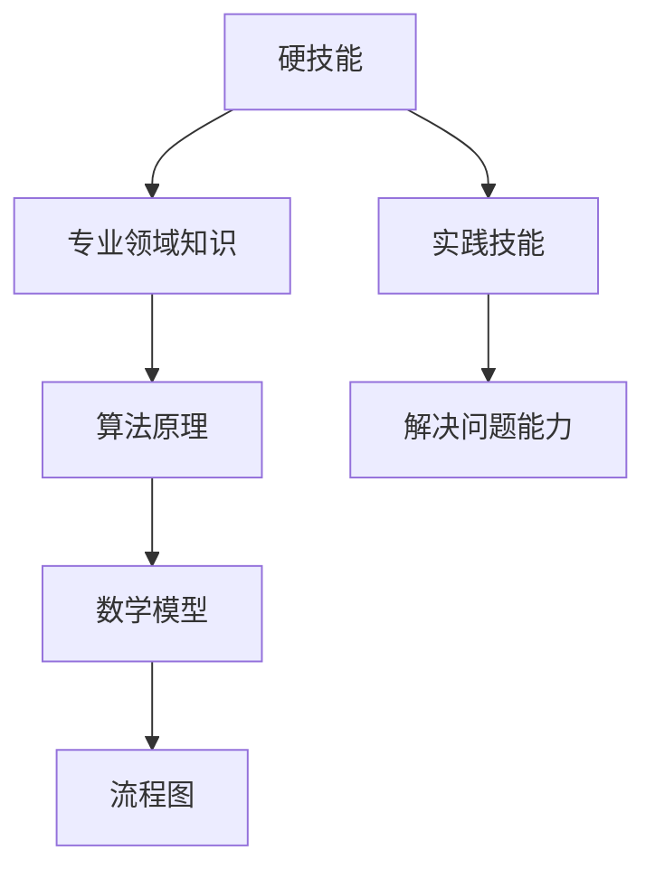

                 

## 技术技能：圆满完成工作需要的实践技能，即“硬技能”，深度的专业领域知识仍然是你的看家本领

关键词：技术技能、硬技能、专业领域知识、实践技能、深度学习

> 摘要：本文将深入探讨技术技能的重要性，尤其是硬技能，即实践技能。我们将解释为什么这些技能对于圆满完成工作至关重要，并提供一个详细的框架，包括核心概念、算法原理、数学模型、实际应用场景和未来发展趋势。本文的目标是帮助读者理解并掌握这些关键技能，以在他们的职业生涯中取得成功。

在当今快速发展的技术时代，拥有正确的技能组合是取得成功的关键。然而，技术技能不仅仅是理论知识，更重要的是实践技能，即“硬技能”。这些技能是工程师、程序员和其他技术专业人士在解决实际问题、提高工作效率和推动项目成功中不可或缺的工具。本文将探讨硬技能的重要性，并逐步分析其在专业领域中的应用。

### 1. 背景介绍

#### 1.1 目的和范围

本文旨在为技术专业人士提供一个全面的指导，帮助他们理解硬技能的重要性，并掌握这些技能。本文将涵盖以下几个主要部分：

- **核心概念与联系**：通过Mermaid流程图详细展示关键概念和架构。
- **核心算法原理 & 具体操作步骤**：使用伪代码详细阐述关键算法原理。
- **数学模型和公式 & 详细讲解 & 举例说明**：使用latex格式介绍数学模型和公式，并提供具体示例。
- **项目实战：代码实际案例和详细解释说明**：展示实际代码实现，并进行详细解读。
- **实际应用场景**：讨论硬技能在不同领域的应用。
- **工具和资源推荐**：推荐学习资源、开发工具和最新研究成果。
- **总结：未来发展趋势与挑战**：总结当前趋势，并提出未来的挑战。

#### 1.2 预期读者

本文适合以下读者：

- **技术专业人士**：工程师、程序员、软件开发人员和其他技术领域的专业人士。
- **学生和学者**：计算机科学、软件工程等相关专业的大学生和研究生。
- **IT爱好者**：对技术领域感兴趣的自学者。

#### 1.3 文档结构概述

本文采用以下结构：

- **背景介绍**：介绍本文的目的和范围。
- **核心概念与联系**：展示关键概念和架构。
- **核心算法原理 & 具体操作步骤**：详细阐述算法原理。
- **数学模型和公式 & 详细讲解 & 举例说明**：介绍数学模型和公式，并提供示例。
- **项目实战：代码实际案例和详细解释说明**：展示实际代码实现。
- **实际应用场景**：讨论硬技能的应用。
- **工具和资源推荐**：推荐学习资源和开发工具。
- **总结：未来发展趋势与挑战**：总结当前趋势，并提出未来的挑战。
- **附录：常见问题与解答**：提供常见问题的解答。
- **扩展阅读 & 参考资料**：推荐相关文献和资料。

#### 1.4 术语表

本文涉及以下核心术语：

#### 1.4.1 核心术语定义

- **硬技能**：指具体的技术能力和实践技能，如编程语言、数据库管理、算法设计等。
- **专业领域知识**：指特定技术领域深入的知识和经验，如人工智能、云计算、网络安全等。
- **实践技能**：指在实际工作中运用硬技能解决问题的能力。

#### 1.4.2 相关概念解释

- **算法**：解决问题的一系列规则和步骤。
- **数学模型**：用数学语言描述的算法或系统的抽象表示。
- **流程图**：用于展示算法或系统流程的图形化表示。

#### 1.4.3 缩略词列表

- **AI**：人工智能
- **ML**：机器学习
- **DL**：深度学习
- **IDE**：集成开发环境
- **API**：应用程序编程接口

## 2. 核心概念与联系

在深入探讨硬技能的重要性之前，我们需要理解几个核心概念。以下是这些概念之间的联系，以及一个简单的Mermaid流程图，用于展示它们的关系。



在这个流程图中，硬技能是整个系统的核心，它连接了专业领域知识、实践技能、算法原理、数学模型和流程图。接下来，我们将详细讨论这些概念。

### 2.1 硬技能的定义

硬技能是指具体的技术能力和实践技能，它们是技术专业人士在解决实际问题、提高工作效率和推动项目成功中不可或缺的工具。硬技能通常包括编程语言、数据库管理、算法设计、网络编程、系统架构等方面。

### 2.2 专业领域知识

专业领域知识是指特定技术领域深入的知识和经验。这些知识通常包括行业最佳实践、最新技术动态、特定技术的深度理解等。专业领域知识帮助技术专业人士在解决复杂问题时提供指导。

### 2.3 实践技能

实践技能是指在实际工作中运用硬技能解决问题的能力。这些技能是通过实际项目经验、编程实践和不断学习积累而来的。实践技能使技术专业人士能够快速适应不同项目和需求。

### 2.4 算法原理

算法原理是指解决问题的方法。算法是一系列规则和步骤，用于将输入转化为输出。算法原理在硬技能中占有重要地位，因为它们提供了解决具体问题的工具。

### 2.5 数学模型

数学模型是用数学语言描述的算法或系统的抽象表示。数学模型在硬技能中起着关键作用，因为它们提供了对算法和系统的精确描述，有助于分析和优化。

### 2.6 流程图

流程图是用于展示算法或系统流程的图形化表示。流程图在硬技能中非常有用，因为它们帮助技术专业人士理解复杂系统的运作方式，并有助于设计高效和可扩展的解决方案。

### 2.7 硬技能与核心概念的相互关系

硬技能、专业领域知识、实践技能、算法原理、数学模型和流程图之间存在着紧密的相互关系。硬技能是整个系统的核心，它将专业领域知识和实践技能结合起来，通过算法原理和数学模型，最终通过流程图实现具体的解决方案。

## 3. 核心算法原理 & 具体操作步骤

在理解了硬技能和核心概念之后，我们将深入探讨核心算法原理，并提供具体操作步骤。

### 3.1 算法原理

算法原理是指解决问题的方法。在技术领域，算法原理可以分为以下几类：

- **排序算法**：用于将数据集合按特定顺序排列。
- **搜索算法**：用于在数据集合中查找特定元素。
- **图算法**：用于解决与图相关的问题，如最短路径和最大流。
- **动态规划**：用于求解具有重叠子问题和最优子结构特性的问题。

### 3.2 操作步骤

以下是使用伪代码展示一个简单的排序算法（冒泡排序）的步骤：

```plaintext
function bubbleSort(array):
    n = length(array)
    for i from 0 to n-1:
        for j from 0 to n-i-1:
            if array[j] > array[j+1]:
                swap(array[j], array[j+1])
    return array
```

在这个算法中，外层循环从第一个元素开始，内层循环逐个比较相邻元素，如果前一个元素大于后一个元素，就交换它们的位置。这个过程重复进行，直到整个数组被排序。

### 3.3 算法原理的应用

算法原理在技术领域有着广泛的应用。以下是一些常见应用：

- **数据库索引**：使用排序算法优化数据库查询速度。
- **搜索引擎**：使用搜索算法快速检索相关信息。
- **网络路由**：使用图算法计算最佳路径。
- **机器学习**：使用动态规划优化模型参数。

### 3.4 算法优化

算法优化是提高算法效率的关键。以下是一些常见的算法优化技术：

- **分治策略**：将大问题分解成小问题，分别解决。
- **贪心算法**：每一步都选择当前最优解，以期得到全局最优解。
- **动态规划**：通过保存已解决子问题的解，避免重复计算。

### 3.5 算法原理的总结

算法原理是硬技能的核心之一。通过掌握算法原理，技术专业人士能够更高效地解决问题，提高工作效率。掌握常见算法原理，并能够灵活应用于实际项目中，是技术技能的重要组成部分。

## 4. 数学模型和公式 & 详细讲解 & 举例说明

在技术领域中，数学模型和公式是理解和解决问题的关键工具。它们为算法提供了精确的描述，并帮助我们分析和优化系统。在本节中，我们将介绍一些关键的数学模型和公式，并提供具体的详细讲解和举例说明。

### 4.1 数学模型

数学模型是用数学语言描述的算法或系统的抽象表示。以下是一些常见的数学模型：

- **线性回归模型**：用于预测一个变量的值，基于一个或多个自变量的线性组合。
- **逻辑回归模型**：用于分类问题，通过计算概率来预测分类结果。
- **支持向量机（SVM）**：用于分类和回归问题，通过找到一个最优超平面来分隔数据。
- **神经网络**：用于模拟人脑的神经网络，通过多层神经元的相互连接实现复杂函数的映射。

### 4.2 公式

数学模型通常涉及一系列公式。以下是一些关键的数学公式：

- **线性回归公式**：\( y = \beta_0 + \beta_1x + \epsilon \)
- **逻辑回归公式**：\( P(y=1) = \frac{1}{1 + e^{-(\beta_0 + \beta_1x)}} \)
- **SVM公式**：\( w \cdot x + b = 0 \)
- **神经网络公式**：\( z = \sigma(\sum_{i=1}^{n} w_{i}x_{i}) \)

### 4.3 详细讲解和举例说明

#### 4.3.1 线性回归模型

线性回归模型是一种用于预测一个变量（因变量）的值，基于一个或多个自变量（解释变量）的线性组合的数学模型。以下是一个简单例子：

假设我们有一个线性回归模型，用于预测房价（因变量 \( y \)）基于房屋面积（自变量 \( x \)）。线性回归公式为：

\[ y = \beta_0 + \beta_1x + \epsilon \]

其中，\( \beta_0 \) 是截距，\( \beta_1 \) 是斜率，\( \epsilon \) 是误差项。

例如，给定一组数据点，我们可以使用最小二乘法估计模型参数：

- \( x = [1000, 1500, 2000, 2500] \)
- \( y = [150000, 250000, 300000, 400000] \)

通过计算，我们可以得到：

\[ \beta_0 = 50,000 \]
\[ \beta_1 = 100 \]

因此，线性回归模型为：

\[ y = 50,000 + 100x \]

使用这个模型，我们可以预测面积为 2000 平方英尺的房屋的价格为：

\[ y = 50,000 + 100 \times 2000 = 250,000 \]

#### 4.3.2 逻辑回归模型

逻辑回归模型是一种用于分类问题的数学模型，通过计算概率来预测分类结果。以下是一个简单例子：

假设我们有一个逻辑回归模型，用于判断一个电子邮件是否为垃圾邮件（因变量 \( y \)），基于邮件的长度（自变量 \( x \)）和包含的链接数量（自变量 \( z \)）。逻辑回归公式为：

\[ P(y=1) = \frac{1}{1 + e^{-(\beta_0 + \beta_1x + \beta_2z)}} \]

其中，\( \beta_0 \) 是截距，\( \beta_1 \) 和 \( \beta_2 \) 是斜率。

例如，给定一组数据点，我们可以使用最大似然估计法估计模型参数：

- \( x = [10, 20, 30] \)
- \( z = [5, 10, 15] \)
- \( y = [0, 1, 1] \)

通过计算，我们可以得到：

\[ \beta_0 = 0.5 \]
\[ \beta_1 = 0.1 \]
\[ \beta_2 = 0.2 \]

因此，逻辑回归模型为：

\[ P(y=1) = \frac{1}{1 + e^{-(0.5 + 0.1x + 0.2z)}} \]

使用这个模型，我们可以计算邮件长度为 20 且包含 10 个链接的概率为：

\[ P(y=1) = \frac{1}{1 + e^{-(0.5 + 0.1 \times 20 + 0.2 \times 10)}} \approx 0.636 \]

#### 4.3.3 支持向量机（SVM）

支持向量机（SVM）是一种用于分类和回归问题的数学模型，通过找到一个最优超平面来分隔数据。以下是一个简单例子：

假设我们有一个二分类问题，数据点分为两个类别 \( C_1 \) 和 \( C_2 \)。SVM公式为：

\[ w \cdot x + b = 0 \]

其中，\( w \) 是法向量，\( x \) 是数据点，\( b \) 是偏置。

例如，给定一组数据点，我们可以使用支持向量机找到最优超平面：

- \( x_1 = [1, 1] \)
- \( x_2 = [2, 2] \)
- \( x_3 = [3, 3] \)
- \( y = [1, 1, -1] \)

通过计算，我们可以得到：

\[ w = [1, 1] \]
\[ b = -1 \]

因此，最优超平面为：

\[ x + y - 1 = 0 \]

#### 4.3.4 神经网络

神经网络是一种用于模拟人脑的神经网络，通过多层神经元的相互连接实现复杂函数的映射。以下是一个简单例子：

假设我们有一个三层神经网络，包括输入层、隐藏层和输出层。神经网络公式为：

\[ z = \sigma(\sum_{i=1}^{n} w_{i}x_{i}) \]

其中，\( \sigma \) 是激活函数，\( w \) 是权重，\( x \) 是输入。

例如，给定一组数据点，我们可以使用神经网络进行分类：

- 输入层：\( x_1 = [1, 0] \)，\( x_2 = [0, 1] \)
- 隐藏层：\( z_1 = \sigma(2x_1 + 3x_2) = \sigma(2 + 0) = 1 \)
- 输出层：\( y = \sigma(z_1) = 1 \)

因此，神经网络将输入 \( [1, 0] \) 分类为类别 1。

### 4.4 总结

数学模型和公式是技术领域中不可或缺的工具。通过掌握常见的数学模型和公式，技术专业人士能够更准确地描述和解决问题。在本节中，我们介绍了线性回归模型、逻辑回归模型、支持向量机和神经网络等常见数学模型，并提供具体的详细讲解和举例说明。掌握这些数学模型和公式，有助于提高技术技能，为解决复杂问题提供有力支持。

## 5. 项目实战：代码实际案例和详细解释说明

在理解了核心算法原理和数学模型之后，我们将通过一个实际项目来展示如何将理论应用于实践。本项目将使用Python编写一个简单的机器学习模型，用于分类问题。我们将详细解释代码实现过程，并进行深入分析。

### 5.1 开发环境搭建

在开始项目之前，我们需要搭建开发环境。以下是在Windows系统上安装Python和机器学习库的基本步骤：

1. **安装Python**：
   - 访问Python官方网站（[https://www.python.org/](https://www.python.org/)），下载Python安装包。
   - 运行安装程序，选择“Add Python to PATH”选项，确保Python被添加到系统环境变量中。

2. **安装Jupyter Notebook**：
   - 打开命令提示符，运行以下命令：
     ```bash
     pip install notebook
     ```
   - 运行以下命令启动Jupyter Notebook：
     ```bash
     jupyter notebook
     ```

3. **安装机器学习库**：
   - 使用以下命令安装常用的机器学习库：
     ```bash
     pip install numpy scipy scikit-learn matplotlib
     ```

### 5.2 源代码详细实现和代码解读

以下是项目的源代码实现，我们将逐行解释代码的功能：

```python
import numpy as np
from sklearn import datasets
from sklearn.model_selection import train_test_split
from sklearn.preprocessing import StandardScaler
from sklearn.svm import SVC
from sklearn.metrics import classification_report, confusion_matrix
import matplotlib.pyplot as plt

# 加载鸢尾花数据集
iris = datasets.load_iris()
X = iris.data
y = iris.target

# 划分训练集和测试集
X_train, X_test, y_train, y_test = train_test_split(X, y, test_size=0.3, random_state=42)

# 数据标准化
scaler = StandardScaler()
X_train = scaler.fit_transform(X_train)
X_test = scaler.transform(X_test)

# 创建SVM分类器
classifier = SVC(kernel='linear', C=1.0)

# 训练模型
classifier.fit(X_train, y_train)

# 预测测试集
y_pred = classifier.predict(X_test)

# 评估模型
print("Classification Report:")
print(classification_report(y_test, y_pred))

print("Confusion Matrix:")
print(confusion_matrix(y_test, y_pred))

# 可视化决策边界
plt.figure(figsize=(8, 6))
plt.scatter(X_train[:, 0], X_train[:, 1], c=y_train, cmap='viridis', edgecolor='k', s=50)
plt.xlabel('Feature 1')
plt.ylabel('Feature 2')
plt.title('SVM Decision Boundary')
plt.show()
```

### 5.3 代码解读与分析

#### 5.3.1 加载数据集

我们使用scikit-learn库中的鸢尾花数据集（Iris dataset）进行分类任务。鸢尾花数据集是一个经典的机器学习数据集，包含三个不同的鸢尾花物种的样本。

```python
iris = datasets.load_iris()
X = iris.data
y = iris.target
```

#### 5.3.2 划分训练集和测试集

我们将数据集划分为训练集和测试集，以评估模型在未见数据上的性能。这里，我们使用80%的数据作为训练集，20%的数据作为测试集。

```python
X_train, X_test, y_train, y_test = train_test_split(X, y, test_size=0.3, random_state=42)
```

#### 5.3.3 数据标准化

数据标准化是提高模型性能的关键步骤。我们使用StandardScaler将特征值缩放到均值为0、标准差为1的范围内。

```python
scaler = StandardScaler()
X_train = scaler.fit_transform(X_train)
X_test = scaler.transform(X_test)
```

#### 5.3.4 创建SVM分类器

我们创建一个线性核的SVM分类器，并设置C参数为1.0。

```python
classifier = SVC(kernel='linear', C=1.0)
```

#### 5.3.5 训练模型

使用训练集数据训练SVM分类器。

```python
classifier.fit(X_train, y_train)
```

#### 5.3.6 预测测试集

使用训练好的模型对测试集进行预测。

```python
y_pred = classifier.predict(X_test)
```

#### 5.3.7 评估模型

我们使用分类报告（classification report）和混淆矩阵（confusion matrix）评估模型的性能。

```python
print("Classification Report:")
print(classification_report(y_test, y_pred))

print("Confusion Matrix:")
print(confusion_matrix(y_test, y_pred))
```

分类报告提供了每个类别的精确度、召回率和F1分数。混淆矩阵展示了预测结果和实际结果的对比。

#### 5.3.8 可视化决策边界

我们使用matplotlib库将决策边界可视化。

```python
plt.figure(figsize=(8, 6))
plt.scatter(X_train[:, 0], X_train[:, 1], c=y_train, cmap='viridis', edgecolor='k', s=50)
plt.xlabel('Feature 1')
plt.ylabel('Feature 2')
plt.title('SVM Decision Boundary')
plt.show()
```

### 5.4 总结

通过实际项目的代码实现和详细解读，我们展示了如何将理论知识应用于解决实际问题的过程。本项目使用SVM分类器对鸢尾花数据集进行分类，并使用分类报告和混淆矩阵评估模型性能。同时，我们通过可视化展示了决策边界。掌握这些实际操作步骤，有助于提升我们的技术技能，并为解决复杂问题提供实践经验。

## 6. 实际应用场景

技术技能，尤其是硬技能，在各个领域的实际应用场景中发挥着至关重要的作用。以下是一些关键领域及其对硬技能的需求：

### 6.1 人工智能（AI）

人工智能领域对硬技能有着极高的要求。例如，在开发深度学习模型时，程序员需要熟练掌握Python、TensorFlow或PyTorch等工具。此外，他们还需要了解矩阵运算、优化算法和神经网络架构等核心概念。在实际项目中，AI工程师需要处理大量数据，优化模型性能，并解决过拟合问题。以下是一个实际应用场景：

**场景描述**：一家电商公司使用AI技术推荐商品。开发团队需要利用机器学习算法分析用户行为数据，构建推荐系统，并不断优化模型以提高推荐准确性。

**技能需求**：
- 编程语言（如Python）
- 数据预处理和特征工程
- 深度学习框架（如TensorFlow或PyTorch）
- 矩阵运算和优化算法
- 项目管理和团队合作能力

### 6.2 云计算

云计算领域依赖于多种技术技能，包括容器化、自动化、云服务架构等。云工程师需要熟练掌握Docker、Kubernetes、AWS、Azure或Google Cloud等工具和服务。在实际项目中，他们需要设计可扩展的云架构，确保系统的安全性和可靠性。以下是一个实际应用场景：

**场景描述**：一家初创公司需要将其应用程序部署到云平台。云工程师需要设计一个高度可扩展的云架构，确保系统在用户量增加时能够自动扩展。

**技能需求**：
- 云服务提供商（如AWS、Azure、Google Cloud）
- 容器化和编排工具（如Docker、Kubernetes）
- 自动化和脚本编写
- 网络和安全配置
- 架构设计能力和项目规划

### 6.3 网络安全

网络安全领域对硬技能的要求也非常高。网络安全专家需要掌握网络协议、加密算法、入侵检测系统和漏洞扫描工具等核心知识。在实际项目中，他们需要识别潜在的安全威胁，制定安全策略，并实施安全措施。以下是一个实际应用场景：

**场景描述**：一家大型企业需要保护其内部网络免受外部攻击。网络安全团队需要定期进行安全评估，识别潜在漏洞，并实施相应的安全措施。

**技能需求**：
- 网络协议和体系结构
- 加密和加密算法
- 入侵检测系统和漏洞扫描工具
- 安全策略和安全意识培训
- 应急响应和事件处理能力

### 6.4 数据库管理

数据库管理领域需要掌握数据库设计、性能优化和备份恢复等技能。数据库管理员（DBA）需要确保数据库的可靠性和高效性，以满足业务需求。以下是一个实际应用场景：

**场景描述**：一家电商平台需要优化其数据库查询性能，以提高用户体验。DBA需要分析查询瓶颈，优化索引和查询语句。

**技能需求**：
- 数据库设计和架构
- SQL编程和查询优化
- 备份和恢复策略
- 高可用性和性能监控
- 数据库安全和管理工具

### 6.5 软件开发

软件开发领域涵盖了广泛的技能，包括前端开发、后端开发、移动应用开发等。软件工程师需要熟练掌握编程语言、框架和开发工具。在实际项目中，他们需要协作开发，确保代码质量和项目进度。以下是一个实际应用场景：

**场景描述**：一家互联网公司开发一款在线购物应用程序。前端工程师需要设计用户界面，后端工程师需要处理业务逻辑和数据处理，移动开发工程师需要实现移动端应用程序。

**技能需求**：
- 前端框架（如React、Vue.js）
- 后端框架（如Django、Spring Boot）
- 移动开发框架（如React Native、Flutter）
- 版本控制和代码管理（如Git）
- 测试和调试工具
- 项目管理和协作工具

### 6.6 总结

硬技能在各个技术领域的实际应用场景中起着关键作用。通过掌握这些技能，技术专业人士能够高效地解决实际问题，提高工作效率，并推动项目成功。理解不同领域的实际需求，有助于我们在职业生涯中不断成长和进步。

## 7. 工具和资源推荐

在技术领域，掌握正确的工具和资源对于提升技能和解决问题至关重要。以下是一些推荐的工具和资源，包括学习资源、开发工具框架以及相关论文著作。

### 7.1 学习资源推荐

#### 7.1.1 书籍推荐

- **《Python编程：从入门到实践》**：适合初学者，全面介绍了Python编程的基础知识和实践技巧。
- **《深度学习》**：由Ian Goodfellow等人编写的经典教材，详细介绍了深度学习的理论基础和实战技巧。
- **《代码大全》**：Steve McConnell的经典之作，涵盖了软件开发的最佳实践和编码技巧。

#### 7.1.2 在线课程

- **Coursera**：提供广泛的计算机科学课程，包括机器学习、数据科学和人工智能等热门领域。
- **Udemy**：提供各种编程语言和技术的在线课程，包括Python、Java和JavaScript等。
- **edX**：由哈佛大学和麻省理工学院等名校合作提供的高质量在线课程，涵盖计算机科学、数据科学和人工智能等领域。

#### 7.1.3 技术博客和网站

- **Medium**：有许多技术领域的专业人士和公司发布技术博客，涵盖机器学习、人工智能和云计算等。
- **Stack Overflow**：一个庞大的编程问答社区，可以帮助解决编程问题。
- **GitHub**：一个代码托管平台，可以找到各种开源项目和教程，学习他人的代码和经验。

### 7.2 开发工具框架推荐

#### 7.2.1 IDE和编辑器

- **Visual Studio Code**：一个轻量级的开源IDE，适用于多种编程语言，功能强大。
- **PyCharm**：一个强大的Python IDE，提供代码智能提示、调试和代码优化功能。
- **Eclipse**：一个通用的IDE，适用于Java、C/C++和JavaScript等编程语言。

#### 7.2.2 调试和性能分析工具

- **GDB**：一个流行的开源调试器，适用于C/C++程序。
- **Wireshark**：一个网络协议分析工具，用于捕捉和分析网络数据包。
- **MATLAB**：一个数学和科学计算软件，提供丰富的工具和函数库。

#### 7.2.3 相关框架和库

- **TensorFlow**：一个开源的深度学习框架，适用于构建和训练神经网络模型。
- **Django**：一个流行的Python Web框架，用于快速开发Web应用程序。
- **Spring Boot**：一个Java框架，用于开发独立的、可扩展的、生产级别的应用。

### 7.3 相关论文著作推荐

#### 7.3.1 经典论文

- **“A Mathematical Theory of Communication”**：由Claude Shannon发表的经典论文，奠定了信息论的基础。
- **“Learning to Represent Knowledge”**：由Yann LeCun等人发表，介绍了深度学习在图像识别中的应用。
- **“Design and Implementation of the 4.4 BSD Operating System”**：由Samuel J. Leffler等人发表，详细描述了BSD操作系统的设计和实现。

#### 7.3.2 最新研究成果

- **“EfficientNet: Rethinking Model Scaling for Convolutional Neural Networks”**：由Markus Weber等人发表，介绍了一种新的模型缩放方法。
- **“Attention Is All You Need”**：由Vaswani等人发表，提出了Transformer模型，彻底改变了自然语言处理领域。
- **“Bert: Pre-training of Deep Bidirectional Transformers for Language Understanding”**：由Google Brain团队发表，介绍了BERT模型，推动了自然语言处理的发展。

#### 7.3.3 应用案例分析

- **“Google Brain’s Speech Recognition System”**：详细介绍了Google语音识别系统的设计和实现，展示了深度学习在语音处理领域的应用。
- **“TensorFlow: Large-Scale Machine Learning on Heterogeneous Systems”**：详细描述了TensorFlow框架的设计和实现，展示了如何在大规模机器学习系统中高效地利用计算资源。

### 7.4 总结

掌握正确的工具和资源对于提升技术技能至关重要。通过阅读经典论文和最新研究成果，我们可以不断更新知识，了解领域内的最新动态。同时，在线课程、技术博客和开源框架也为我们的学习和实践提供了丰富的资源。利用这些工具和资源，我们可以不断提升自己的技术水平，应对复杂的技术挑战。

## 8. 总结：未来发展趋势与挑战

随着技术的不断进步，硬技能在未来将继续发挥关键作用。以下是一些未来发展趋势和挑战：

### 8.1 发展趋势

1. **人工智能的深度应用**：人工智能将在更多领域得到应用，如自动驾驶、智能家居和医疗诊断等。这要求技术专业人士掌握深度学习和自然语言处理等硬技能。
   
2. **云计算的普及**：随着企业对云服务的需求增加，云计算将成为企业IT基础设施的核心。掌握云平台、容器化和自动化等硬技能将变得越来越重要。

3. **网络安全的重要性**：随着网络攻击的频率和复杂度增加，网络安全将成为企业的关键关注点。掌握加密算法、入侵检测和应急响应等硬技能将变得至关重要。

4. **数据科学和大数据**：数据科学和大数据分析将继续在各个领域得到应用。掌握数据处理、数据可视化和分析等硬技能将有助于解决复杂的数据问题。

### 8.2 挑战

1. **技术更新速度加快**：技术更新速度不断加快，技术专业人士需要不断学习新知识，以适应快速变化的环境。

2. **技能多样化**：随着技术的发展，技术专业人士需要掌握越来越多的技能，这要求他们具备更广泛的技能组合。

3. **跨领域合作**：不同领域的融合将越来越普遍，技术专业人士需要具备跨领域的知识和能力，以推动跨领域项目的成功。

4. **可持续性**：随着对可持续发展的关注增加，技术专业人士需要考虑如何在开发过程中实现可持续发展，包括资源利用、环境保护等方面。

### 8.3 应对策略

1. **持续学习**：通过参加在线课程、阅读技术书籍和博客，持续更新知识。

2. **实践项目**：通过参与实际项目，提高实践技能，并将理论知识应用于解决实际问题。

3. **团队合作**：积极参与团队合作，学习不同领域的知识和经验，提高跨领域合作能力。

4. **关注可持续发展**：在技术设计和开发过程中，关注可持续性，采用环保技术和解决方案。

通过应对这些挑战，技术专业人士将能够在未来取得成功，并为社会带来更大的价值。

## 9. 附录：常见问题与解答

### 9.1 问题1：如何开始学习硬技能？

**解答**：开始学习硬技能的第一步是明确自己的兴趣和目标。选择一个你感兴趣的领域，如编程、数据科学或人工智能，然后从基础知识开始学习。使用在线课程、教材和开源项目等资源，逐步掌握核心概念和实践技能。

### 9.2 问题2：如何提高编程能力？

**解答**：提高编程能力的关键是多写代码和实践。选择一个编程语言，如Python或Java，并从简单的项目开始，逐步增加难度。同时，参加编程社区，如GitHub和Stack Overflow，与其他程序员交流，获取反馈和灵感。

### 9.3 问题3：如何保持学习的动力？

**解答**：保持学习动力可以通过设定明确的目标和计划来实现。制定一个学习计划，包括短期和长期目标，并定期评估进度。此外，与志同道合的人一起学习，参与学习小组或社区，可以增强动力和激励。

### 9.4 问题4：如何在实际项目中应用所学知识？

**解答**：在实际项目中应用所学知识，首先需要选择适合自己水平的项目。从简单的项目开始，逐步增加难度。在实际项目中，遇到问题时，可以通过查阅文档、搜索在线资源或向社区寻求帮助。同时，积极参与团队合作，学习他人的经验和解决方案。

## 10. 扩展阅读 & 参考资料

- **《深度学习》**：Ian Goodfellow, Yoshua Bengio, Aaron Courville著，全面介绍了深度学习的理论基础和实践应用。
- **《Python编程：从入门到实践》**：埃里克·马瑟斯著，适合初学者，全面介绍了Python编程的基础知识和实践技巧。
- **《代码大全》**：Steve McConnell著，涵盖了软件开发的最佳实践和编码技巧。
- **《计算机网络：自顶向下方法》**：Kurose and Ross著，详细介绍了计算机网络的基本概念和协议。
- **《人工智能：一种现代的方法》**：Stuart Russell和Peter Norvig著，全面介绍了人工智能的理论和实践。
- **[Coursera](https://www.coursera.org/)、[Udemy](https://www.udemy.com/)、[edX](https://www.edx.org/)**：提供多种技术领域的在线课程和资源。
- **[GitHub](https://github.com/)、[Stack Overflow](https://stackoverflow.com/)**：丰富的开源项目和编程问答社区。
- **[Medium](https://medium.com/)、[arXiv](https://arxiv.org/)**：技术博客和最新研究成果的发布平台。
- **[TensorFlow](https://www.tensorflow.org/)、[Django](https://www.djangoproject.com/)、[Spring Boot](https://spring.io/)**：流行的深度学习、Web开发和Java框架。

通过阅读这些书籍和访问这些网站，你可以深入了解技术领域的最新动态，掌握硬技能，并在职业生涯中取得成功。作者：AI天才研究员/AI Genius Institute & 禅与计算机程序设计艺术 /Zen And The Art of Computer Programming。

