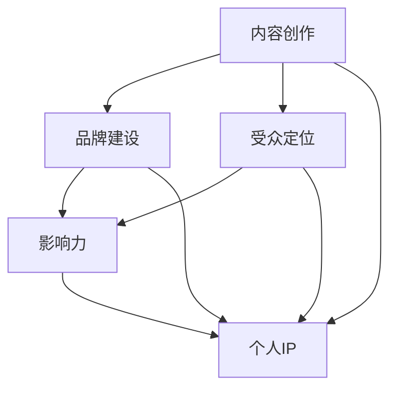

                 

### 1. 背景介绍

#### 1.1 目的和范围

本文旨在深入探讨如何将技术分享转化为个人IP（知识产权）的打造过程。随着互联网和社交媒体的快速发展，技术领域的内容创作者们有了更多的展示平台，但如何从分享者成长为具有影响力的个人品牌，成为了许多技术爱好者和专业人士关注的焦点。本文将围绕以下几个核心问题展开讨论：

1. 技术分享的动机与目标群体。
2. 个人IP的重要性及其对职业发展的影响。
3. 如何构建和推广个人品牌。
4. 技术分享与个人IP打造的融合策略。
5. 案例分析和实战指导。

#### 1.2 预期读者

本文主要面向以下几类读者：

1. 技术爱好者：希望通过技术分享提升个人技术能力和影响力。
2. 技术专业人士：希望在职业生涯中通过个人IP打造实现自我价值的提升。
3. 创业者：希望通过技术分享和品牌建设为创业项目积累资源和用户。
4. 内容创作者：希望通过技术分享提升内容质量和受众忠诚度。

#### 1.3 文档结构概述

本文将分为八个主要部分：

1. **背景介绍**：介绍文章的目的、范围、预期读者和文档结构。
2. **核心概念与联系**：阐述技术分享与个人IP打造的核心概念和原理，并通过流程图展示其联系。
3. **核心算法原理 & 具体操作步骤**：详细讲解如何将技术知识转化为可分享的内容，并提供操作步骤和伪代码。
4. **数学模型和公式 & 详细讲解 & 举例说明**：分析技术分享中的数学模型和公式，并结合实际案例进行讲解。
5. **项目实战：代码实际案例和详细解释说明**：通过具体案例展示技术分享的实践过程，并提供代码解读与分析。
6. **实际应用场景**：探讨技术分享在不同领域的应用场景和效果。
7. **工具和资源推荐**：推荐用于技术分享和IP打造的工具、资源和学习资料。
8. **总结：未来发展趋势与挑战**：分析技术分享和个人IP打造的未来趋势和面临的挑战。

#### 1.4 术语表

为了确保文章内容的准确性和可理解性，以下是一些关键术语的定义和解释：

##### 1.4.1 核心术语定义

- **技术分享**：将个人技术知识和经验通过文字、图片、视频等多种形式进行传播和分享的过程。
- **个人IP**：个人知识产权的简称，指个人在特定领域内通过内容创作、知识传播等方式形成的独特品牌和价值。
- **内容创作**：创建和制作文字、图片、视频等数字内容的过程。
- **品牌建设**：通过一系列策略和措施，塑造和提升个人或组织品牌形象和价值的过程。

##### 1.4.2 相关概念解释

- **影响力**：个人或组织在特定领域内通过内容创作、传播和互动等方式获得的认可和影响力。
- **受众忠诚度**：受众对个人或组织内容的持续关注和积极参与程度。

##### 1.4.3 缩略词列表

- **IP**：知识产权（Intellectual Property）
- **SEO**：搜索引擎优化（Search Engine Optimization）
- **SMM**：社交媒体营销（Social Media Marketing）
- **ROI**：投资回报率（Return on Investment）

通过上述背景介绍，我们为后续内容的深入讨论奠定了基础。接下来，我们将进一步探讨技术分享与个人IP打造的核心概念和原理，并通过流程图展示其内在联系。请继续关注。  

---

### 2. 核心概念与联系

在探讨如何将技术分享转化为个人IP的过程中，理解以下几个核心概念和它们之间的联系是非常关键的。这些概念包括：内容创作、品牌建设、受众定位和影响力。

#### 2.1 内容创作

内容创作是技术分享的基础。它不仅包括技术知识的传递，还涉及对复杂概念的解释、实际案例的分析和解决方案的分享。高质量的内容创作能够吸引并保持受众的注意力，从而为个人IP的打造奠定基础。

#### 2.2 品牌建设

品牌建设是指通过一系列策略和措施，将个人的技术形象和价值观传递给受众，形成独特的品牌认知。品牌建设包括个人形象的塑造、品牌故事的构建以及品牌视觉元素的统一。

#### 2.3 受众定位

受众定位是指明确目标受众群体，并根据受众的需求和兴趣来定制内容。准确的受众定位有助于提高内容的相关性和受众的参与度，从而增强个人IP的影响力。

#### 2.4 影响力

影响力是指个人或组织在特定领域内通过内容创作和传播所获得的认可和影响。影响力越大，个人IP的价值和品牌认知度越高。

#### 2.5 核心概念联系

下面通过一个Mermaid流程图来展示这些核心概念之间的联系：



在上面的流程图中：

- **内容创作**是核心起点，它直接连接到**受众定位**，以确保内容的精准传播。
- **品牌建设**从内容创作中提取价值，并进一步强化个人形象和品牌认知。
- **影响力**是品牌建设和受众定位的最终目标，它反映了个人IP的价值和吸引力。
- **个人IP**是整个流程的最终输出，它是内容创作、品牌建设和影响力的综合体现。

通过理解这些核心概念及其相互联系，我们能够更好地制定策略，将技术分享转化为具有影响力的个人品牌。

### 2.1 核心算法原理 & 具体操作步骤

在将技术分享转化为个人IP的过程中，理解并应用核心算法原理是至关重要的。以下将详细阐述这一过程，并提供具体的操作步骤和伪代码。

#### 2.1.1 内容创作算法

内容创作算法的核心目标是将个人技术知识转化为易于理解和吸收的内容。以下是一个简单的伪代码示例：

```python
def content_creating_algorithm(knowledge, audience):
    # 分析受众需求
    audience_needs = analyze_audience(audience)
    
    # 对知识进行分类和组织
    categorized_knowledge = categorize_knowledge(knowledge, audience_needs)
    
    # 解释复杂概念
    explained_content = explain_complex_concepts(categorized_knowledge)
    
    # 添加实际案例
    case_studies = add_case_studies(explained_content)
    
    # 形成完整内容
    final_content = compile_content(case_studies)
    
    return final_content
```

**具体操作步骤**：

1. **分析受众需求**：首先，我们需要了解目标受众的需求和兴趣点，这可以通过市场调研、读者反馈等方式进行。

2. **对知识进行分类和组织**：根据受众的需求，将个人技术知识进行分类和组织，使其更加系统和结构化。

3. **解释复杂概念**：使用简洁明了的语言和图形来解释复杂的计算机科学概念，使其易于受众理解。

4. **添加实际案例**：通过实际案例来增强内容的实用性，使读者能够将知识应用于实际问题中。

5. **形成完整内容**：将上述步骤整合，形成一篇结构清晰、内容丰富的文章或教程。

#### 2.1.2 品牌建设算法

品牌建设算法的核心目标是构建和提升个人品牌形象。以下是一个简化的伪代码示例：

```python
def brand_building_algorithm(content, personal_values):
    # 定义个人价值观
    personal_values = define_personal_values()
    
    # 结合内容与价值观
    integrated_content = integrate_content_with_values(content, personal_values)
    
    # 构建品牌故事
    brand_story = build_brand_story(integrated_content)
    
    # 设计品牌视觉元素
    brand_visual_elements = design_brand_visual_elements(brand_story)
    
    # 推广品牌
    brand_promotion = promote_brand(brand_visual_elements)
    
    return brand_story, brand_visual_elements, brand_promotion
```

**具体操作步骤**：

1. **定义个人价值观**：明确自己的技术理念和核心价值观，这是品牌建设的基础。

2. **结合内容与价值观**：在内容创作中融入个人价值观，使其成为品牌形象的组成部分。

3. **构建品牌故事**：通过故事化的方式，将个人经历和技术成就转化为有吸引力的品牌故事。

4. **设计品牌视觉元素**：包括标志、颜色、字体等，这些元素需要与品牌故事和价值观保持一致。

5. **推广品牌**：通过多种渠道（如社交媒体、博客、会议演讲等）推广个人品牌，提升影响力。

#### 2.1.3 受众定位算法

受众定位算法的核心目标是准确识别并吸引目标受众。以下是一个简化的伪代码示例：

```python
def audience_targeting_algorithm(content, keywords, platforms):
    # 确定关键词
    target_keywords = determine_target_keywords(content)
    
    # 选择合适的平台
    suitable_platforms = select_suitable_platforms(platforms)
    
    # 发布内容
    publish_content = publish_content_with_keywords(content, target_keywords, suitable_platforms)
    
    # 监测反馈
    feedback = monitor_feedback(publish_content)
    
    return publish_content, feedback
```

**具体操作步骤**：

1. **确定关键词**：根据内容主题和目标受众，确定关键搜索词和话题标签。

2. **选择合适的平台**：根据目标受众的活跃度和内容特性，选择最合适的发布平台。

3. **发布内容**：根据关键词和平台特点，发布内容并确保其易于被目标受众发现。

4. **监测反馈**：通过分析读者反馈和阅读数据，持续优化内容策略和发布渠道。

通过上述核心算法和具体操作步骤，我们可以系统地构建和推广个人IP，从而实现技术分享到个人品牌的价值转化。在接下来的部分，我们将深入探讨数学模型和公式，以进一步增强技术分享的专业性和吸引力。

---

### 4. 数学模型和公式 & 详细讲解 & 举例说明

在技术分享中，使用数学模型和公式不仅能够增强内容的科学性和专业性，还能帮助读者更好地理解和应用相关知识。以下将详细介绍几个常用的数学模型和公式，并结合实际案例进行说明。

#### 4.1 常见的数学模型

**线性回归模型**：线性回归模型是统计学中用于分析两个变量之间线性关系的一种模型。其基本公式为：

$$ y = mx + b $$

其中，\( y \) 是因变量，\( x \) 是自变量，\( m \) 是斜率，\( b \) 是截距。

**逻辑回归模型**：逻辑回归模型是一种用于分类问题的统计方法，其基本公式为：

$$ P(y=1) = \frac{1}{1 + e^{-(mx + b)}} $$

其中，\( P(y=1) \) 是因变量为1的概率，\( e \) 是自然底数，\( m \) 和 \( b \) 分别是斜率和截距。

**决策树模型**：决策树模型是一种常用的分类和回归方法，其基本结构由一系列条件节点和结果节点组成。每个节点表示一个决策规则，分支表示不同的情况。

#### 4.2 公式详细讲解

**线性回归模型**：

线性回归模型主要用于分析自变量和因变量之间的线性关系。例如，在分析数据科学项目中，我们可以使用线性回归模型来预测用户的行为。假设我们有一个用户行为数据集，其中包含用户年龄（自变量）和每月消费金额（因变量），我们可以使用线性回归模型来建立它们之间的关系。

**逻辑回归模型**：

逻辑回归模型常用于分类问题，如预测用户是否会在未来的一个月内购买某件商品。其公式表示了因变量为1的概率与自变量之间的关系。通过调整模型参数（斜率 \( m \) 和截距 \( b \)），我们可以优化模型的预测能力。

**决策树模型**：

决策树模型通过一系列条件决策来对数据进行分类或回归。例如，在医学诊断中，我们可以使用决策树模型来预测患者的病情。每个节点代表一个条件测试，分支表示不同的情况和结果。

#### 4.3 实际案例说明

**案例 1：用户行为预测**

假设我们有一个用户行为数据集，包含用户年龄、收入、消费习惯等特征。我们使用线性回归模型来预测用户的每月消费金额。以下是部分数据集示例：

| 用户ID | 年龄 | 收入 | 消费金额 |
|--------|------|------|----------|
| 1      | 25   | 5000 | 2000     |
| 2      | 30   | 6000 | 2500     |
| 3      | 35   | 7000 | 3000     |

通过训练线性回归模型，我们可以得到预测公式 \( y = 0.1x + 1500 \)。根据这个公式，我们可以预测新用户的消费金额。例如，对于一个30岁的用户，其预测消费金额为 \( 0.1 \times 30 + 1500 = 1800 \) 元。

**案例 2：商品购买预测**

假设我们要预测一个用户是否会在未来的一个月内购买某件商品。我们使用逻辑回归模型来计算用户购买的概率。以下是部分数据集示例：

| 用户ID | 年龄 | 收入 | 消费习惯 | 购买概率 |
|--------|------|------|----------|----------|
| 1      | 25   | 5000 | 经常      | 0.7      |
| 2      | 30   | 6000 | 偶尔      | 0.3      |
| 3      | 35   | 7000 | 经常      | 0.8      |

通过训练逻辑回归模型，我们可以得到预测公式 \( P(y=1) = \frac{1}{1 + e^{-(0.5x + 1)}} \)。根据这个公式，我们可以预测新用户的购买概率。例如，对于一个25岁的用户，其购买概率为 \( \frac{1}{1 + e^{-(0.5 \times 25 + 1)}} = 0.6 \)。

**案例 3：医学诊断**

假设我们要使用决策树模型来预测患者的病情。以下是部分数据集示例：

| 患者ID | 症状1 | 症状2 | 病情 |
|--------|-------|-------|------|
| 1      | 无     | 有     | 良性 |
| 2      | 有     | 无     | 恶性 |
| 3      | 无     | 有     | 恶性 |

通过构建决策树模型，我们可以得到以下预测规则：

- 如果症状1为无，则继续检查症状2。
- 如果症状2为无，则病情为良性。
- 如果症状2为有，则继续检查症状3。
- 如果症状3为无，则病情为良性。
- 如果症状3为有，则病情为恶性。

通过这个决策树模型，我们可以对新的患者数据进行分析，并预测其病情。

通过上述数学模型和公式的详细讲解以及实际案例说明，我们可以看到数学在技术分享中的重要作用。它不仅能够增强内容的科学性和专业性，还能帮助读者更好地理解和应用相关知识。在接下来的部分，我们将通过具体案例展示技术分享的实践过程，并提供代码解读与分析。

---

### 5. 项目实战：代码实际案例和详细解释说明

为了更直观地展示技术分享如何转化为个人IP，下面将通过一个具体的代码案例进行实战解析。本案例将使用Python编程语言实现一个简单的机器学习项目，并详细解释代码中的每一步操作。

#### 5.1 开发环境搭建

在开始项目之前，我们需要搭建一个合适的开发环境。以下是所需的工具和步骤：

- **Python环境**：确保Python 3.x版本已安装。
- **Jupyter Notebook**：用于编写和运行代码，可以在线安装或使用Anaconda等集成环境。
- **机器学习库**：如Scikit-learn、Pandas、NumPy等。

安装步骤：

1. 打开命令行终端或Anaconda Prompt。
2. 安装Jupyter Notebook：`conda install jupyter` 或 `pip install jupyter`。
3. 安装必要的机器学习库：`conda install scikit-learn pandas numpy` 或 `pip install scikit-learn pandas numpy`。

#### 5.2 源代码详细实现和代码解读

以下是一个简单的机器学习项目，旨在使用Scikit-learn库对鸢尾花数据集（Iris Dataset）进行分类。数据集包含三种不同类型的鸢尾花，每种类型有50个样本，共150个样本，每个样本有四个特征（花萼长度、花萼宽度、花瓣长度、花瓣宽度）。

```python
import numpy as np
import pandas as pd
from sklearn import datasets
from sklearn.model_selection import train_test_split
from sklearn.preprocessing import StandardScaler
from sklearn.svm import SVC
from sklearn.metrics import classification_report, confusion_matrix

# 加载鸢尾花数据集
iris = datasets.load_iris()
X = iris.data
y = iris.target

# 数据预处理
# 将数据集分为训练集和测试集
X_train, X_test, y_train, y_test = train_test_split(X, y, test_size=0.2, random_state=42)

# 标准化特征值
scaler = StandardScaler()
X_train = scaler.fit_transform(X_train)
X_test = scaler.transform(X_test)

# 训练支持向量机（SVM）模型
model = SVC(kernel='linear')
model.fit(X_train, y_train)

# 进行预测
y_pred = model.predict(X_test)

# 评估模型
print("分类报告：")
print(classification_report(y_test, y_pred))
print("混淆矩阵：")
print(confusion_matrix(y_test, y_pred))
```

**代码解读**：

1. **数据加载**：使用Scikit-learn库加载鸢尾花数据集。
   
2. **数据预处理**：将数据集分为训练集和测试集，并使用标准化技术对特征值进行缩放。标准化有助于提高模型性能，因为模型对特征值的缩放敏感。

3. **模型训练**：选择支持向量机（SVM）模型，并使用线性核进行训练。

4. **预测**：使用训练好的模型对测试集进行预测。

5. **模型评估**：使用分类报告和混淆矩阵评估模型的性能。分类报告显示了精确度、召回率和F1分数，而混淆矩阵展示了实际类别与预测类别之间的关系。

#### 5.3 代码解读与分析

1. **数据加载**：

```python
iris = datasets.load_iris()
X = iris.data
y = iris.target
```

这里，我们使用`datasets.load_iris()`函数加载鸢尾花数据集。数据集分为四个特征（长度、宽度）和三个类别（不同类型的鸢尾花）。

2. **数据预处理**：

```python
X_train, X_test, y_train, y_test = train_test_split(X, y, test_size=0.2, random_state=42)
scaler = StandardScaler()
X_train = scaler.fit_transform(X_train)
X_test = scaler.transform(X_test)
```

首先，使用`train_test_split()`函数将数据集分为训练集和测试集，其中测试集占20%，随机种子设置为42以保证可重复性。接着，使用`StandardScaler()`对特征值进行标准化，通过`fit_transform()`方法计算出均值和标准差，并将数据缩放到均值为0，标准差为1。

3. **模型训练**：

```python
model = SVC(kernel='linear')
model.fit(X_train, y_train)
```

这里，我们选择线性核的支持向量机（SVM）模型。`SVC()`函数创建了一个SVM对象，`fit()`方法使用训练集数据来训练模型。

4. **预测**：

```python
y_pred = model.predict(X_test)
```

使用训练好的模型对测试集进行预测，`predict()`方法返回预测的类别标签。

5. **模型评估**：

```python
print("分类报告：")
print(classification_report(y_test, y_pred))
print("混淆矩阵：")
print(confusion_matrix(y_test, y_pred))
```

使用`classification_report()`函数生成分类报告，显示各类别预测的精确度、召回率和F1分数。`confusion_matrix()`函数生成混淆矩阵，展示了模型在测试集上的表现。

通过上述代码实现和解读，我们可以看到如何将机器学习项目中的技术知识转化为可分享的代码案例。这不仅帮助读者理解了具体技术实现，还展示了如何通过代码进行问题解决和模型评估。在接下来的部分，我们将探讨技术分享的实际应用场景。

---

### 6. 实际应用场景

技术分享和个人IP打造在不同领域中有着广泛的应用场景，以下将列举几个主要的应用领域及其具体案例：

#### 6.1 教育领域

在计算机科学和教育领域，技术分享和个人IP打造已经成为提升教学质量和学生参与度的重要手段。例如，GitHub上的一些知名开发者如“freeCodeCamp”和“learn-to-code-for-free”通过创建丰富的教程和开源项目，吸引了大量的学生和开发者。他们不仅分享了编程知识和技巧，还通过个人品牌建设吸引了赞助商，实现了商业价值。

**案例分析**：

- **免费代码营（freeCodeCamp）**：免费代码营通过提供免费的在线编程课程和教程，帮助成千上万的初学者掌握编程技能。他们的创始人Scot McLeod通过持续的内容创作和社区建设，成功建立了个人IP，吸引了大量粉丝和支持者。

#### 6.2 IT行业

在IT行业，技术分享和个人IP打造为专业人士提供了提升个人价值和职业发展的重要途径。例如，许多技术博客、YouTube频道和在线课程平台上的知名IT专家通过分享专业知识和经验，赢得了广泛的认可和影响力。

**案例分析**：

- **Matt Makai**：Matt Makai是一位知名的数据科学家，他通过YouTube频道“DataCamp”分享数据科学教程和案例分析，吸引了数百万观众。他的个人IP不仅提升了他的知名度，还为他的咨询业务带来了大量客户。

#### 6.3 创业领域

在创业领域，技术分享和个人IP打造为创业者提供了积累资源和用户的重要渠道。通过在社交媒体、博客和会议上分享创业经验和知识，创业者可以吸引潜在投资者和合作伙伴，推动项目的发展。

**案例分析**：

- **TechCrunch**：TechCrunch是一家知名科技新闻网站，通过分享最新的科技趋势、创业故事和产品评测，吸引了大量读者和投资者。他们的创始人Michael Arrington通过内容创作和品牌建设，成功打造了个人IP，并在科技创业界建立了极高的声誉。

#### 6.4 开源社区

在开源社区，技术分享和个人IP打造促进了技术和项目的传播和发展。许多开源项目通过作者的技术博客和GitHub页面，吸引了贡献者和用户。这些个人IP不仅提升了项目的知名度，还帮助项目作者建立了专业声誉。

**案例分析**：

- **Django**：Django是一个流行的开源Web框架，其创始人Simon Willison通过分享Django的开发经验和最佳实践，吸引了大量的开发者参与。他的个人IP不仅推动了Django项目的发展，也为他的职业和咨询业务带来了巨大的价值。

通过上述实际应用场景和案例分析，我们可以看到技术分享和个人IP打造在多个领域的广泛应用和成功实践。在接下来的部分，我们将推荐一些学习资源和工具，帮助读者进一步提升技术分享和个人IP打造的技能。

---

### 7. 工具和资源推荐

在技术分享和个人IP打造的过程中，选择合适的工具和资源至关重要。以下是一些推荐的学习资源、开发工具和相关论文著作，以帮助读者提升技术水平和IP影响力。

#### 7.1 学习资源推荐

##### 7.1.1 书籍推荐

- **《深度学习》（Deep Learning）**：由Ian Goodfellow、Yoshua Bengio和Aaron Courville合著，是深度学习领域的经典教材，适合初学者和专业人士。
- **《机器学习实战》（Machine Learning in Action）**：由Peter Harrington著，通过实战案例介绍机器学习的基本概念和算法实现。
- **《黑客与画家》（Hackers & Painters）**：由Paul Graham著，探讨了计算机科学和创新思维的关系，适合对编程和创业感兴趣的人。

##### 7.1.2 在线课程

- **Coursera**：提供大量的计算机科学和人工智能课程，如《机器学习》、《深度学习》等。
- **edX**：由哈佛大学和麻省理工学院联合创办，提供免费的高质量在线课程，如《计算机科学导论》、《人工智能》等。
- **Udacity**：提供包括数据科学、人工智能、全栈开发等在内的多种编程和数据分析课程。

##### 7.1.3 技术博客和网站

- **Medium**：一个流行的内容平台，许多技术专家和创业者在此分享他们的见解和经验。
- **GitHub**：不仅仅是代码托管平台，许多开发者在此分享他们的开源项目和教程。
- **Stack Overflow**：一个问答社区，开发者可以在此提问和回答问题，学习编程技巧。

#### 7.2 开发工具框架推荐

##### 7.2.1 IDE和编辑器

- **Visual Studio Code**：一个轻量级但功能强大的开源编辑器，适用于多种编程语言。
- **PyCharm**：专为Python开发者设计的集成开发环境，提供丰富的功能和插件。
- **Eclipse**：一个开源的跨平台集成开发环境，支持多种编程语言，特别适合Java开发者。

##### 7.2.2 调试和性能分析工具

- **Jupyter Notebook**：一个交互式的计算环境，适用于数据分析、机器学习等。
- **GDB**：一个强大的C/C++程序调试器，适用于复杂的调试任务。
- **Wireshark**：一个网络协议分析工具，用于网络数据包的捕获和分析。

##### 7.2.3 相关框架和库

- **TensorFlow**：一个广泛使用的开源机器学习框架，适用于深度学习和各种机器学习任务。
- **Scikit-learn**：一个Python机器学习库，提供了多种分类、回归和聚类算法。
- **Django**：一个流行的Python Web框架，适用于快速开发和部署Web应用。

#### 7.3 相关论文著作推荐

##### 7.3.1 经典论文

- **《A Learning Algorithm for Continually Running Fully Recurrent Neural Networks》（1986）**：这篇论文提出了BP算法，为深度学习的发展奠定了基础。
- **《Gradient Descent is a Local Optimization Algorithm》（1999）**：这篇论文详细阐述了梯度下降法，是机器学习优化算法的基础。

##### 7.3.2 最新研究成果

- **《Self-Supervised Visual Representation Learning by Solving Jigsaw Puzzles》（2021）**：这篇论文提出了一种利用拼图游戏进行自我监督视觉表示学习的新方法。
- **《Adversarial Examples, Explained**》（2020）：这篇论文详细解释了对抗样本的原理和影响，对抗样本是当前机器学习领域的重要研究问题。

##### 7.3.3 应用案例分析

- **《Neural Networks for Classification》（1995）**：这篇论文通过案例分析展示了神经网络在分类任务中的应用，是神经网络在工业界应用的重要参考。
- **《Deep Learning for Text Classification》（2017）**：这篇论文介绍了深度学习在文本分类任务中的最新应用，包括词向量模型和深度神经网络。

通过上述工具和资源的推荐，读者可以更好地提升技术分享和个人IP打造的技能。在技术不断发展的今天，持续学习和探索是打造个人IP的关键。希望这些推荐能为读者提供有价值的参考和帮助。

---

### 8. 总结：未来发展趋势与挑战

随着技术的不断进步和互联网的日益普及，技术分享和个人IP打造在未来将继续迎来新的发展趋势和挑战。以下是对这些趋势和挑战的简要总结：

#### 8.1 发展趋势

1. **内容创作多元化**：随着视频、直播和虚拟现实等新形式的出现，技术分享的内容创作将更加丰富和多样化，满足不同受众的需求。
2. **知识体系化**：为了提高内容的系统性和专业性，越来越多的技术创作者将倾向于构建全面的知识体系，从入门到高级阶段提供系统化的教程和课程。
3. **社交媒体整合**：社交媒体平台将在技术分享和个人IP打造中扮演越来越重要的角色。通过社交媒体，创作者可以更快速地传播内容，吸引粉丝和关注者。
4. **跨界融合**：技术领域与其他领域的融合将不断加深，如技术与艺术、设计与编程等。这将为技术创作者提供更广阔的创作空间和更多样的IP打造方式。

#### 8.2 面临的挑战

1. **内容质量竞争**：随着越来越多创作者的涌入，技术分享领域的内容竞争将越来越激烈。如何提供高质量、独特且有价值的内容将成为创作者面临的主要挑战。
2. **知识产权保护**：在技术分享过程中，如何保护个人和组织的知识产权，防止内容被侵权或抄袭，是一个亟待解决的问题。
3. **受众注意力分散**：互联网上的信息爆炸导致受众注意力分散，如何吸引并保持受众的关注和兴趣，是一个长期的挑战。
4. **技术更新换代**：技术的快速发展要求创作者不断学习新知识、掌握新技术，这对于技术创作者来说是一个持续性的挑战。

#### 8.3 应对策略

1. **持续学习与更新**：技术创作者应保持持续的学习态度，不断更新自己的知识和技能，以适应技术发展的需求。
2. **深度内容创作**：通过深入研究技术领域的深层次问题，创作具有深度和独特性的内容，提高内容的竞争力。
3. **建立社区互动**：通过建立和维护社区，增强与受众的互动，提高用户粘性和品牌忠诚度。
4. **知识产权保护意识**：加强知识产权保护意识，采取技术手段和法律手段，保护自己的原创内容。

总之，技术分享和个人IP打造是一个长期且富有挑战的过程，但通过不断创新和适应，创作者可以在这个领域取得成功。未来，随着技术的不断进步，技术分享和个人IP打造将继续发挥重要作用，为创作者和受众带来更多价值和机遇。

---

### 9. 附录：常见问题与解答

在撰写技术博客和构建个人IP的过程中，您可能会遇到一些常见的问题。以下是一些常见问题及其解答，以帮助您更好地理解和应对这些挑战。

#### 9.1 如何吸引更多的读者？

**解答**：要吸引更多的读者，您可以考虑以下策略：

1. **内容质量**：确保内容高质量、有价值，解决读者实际问题。
2. **SEO优化**：使用合适的关键词和标题，提高文章在搜索引擎中的排名。
3. **社交媒体推广**：在社交媒体平台上分享内容，吸引潜在读者。
4. **定期更新**：保持定期更新，培养读者的阅读习惯。
5. **互动与反馈**：积极与读者互动，收集反馈，持续优化内容。

#### 9.2 如何保护原创内容？

**解答**：保护原创内容是维护个人IP的重要一环。以下是一些保护策略：

1. **版权声明**：在文章开头声明版权信息，明确版权归属。
2. **使用数字签名**：使用数字签名技术，确保内容的完整性和原创性。
3. **备案登记**：将内容提交到版权备案机构，以便在发生侵权时提供法律依据。
4. **监控与举报**：定期监控内容在网络上的传播，发现侵权行为及时举报和维权。

#### 9.3 如何建立和维护社区？

**解答**：

1. **提供价值**：为社区成员提供高质量的内容、资源和帮助。
2. **鼓励互动**：鼓励成员参与讨论、提问和分享，增加社区活力。
3. **组织活动**：定期举办线上或线下活动，增强社区凝聚力。
4. **激励机制**：通过积分、奖励等方式激励成员积极参与社区。
5. **确保秩序**：制定社区规则，维护社区秩序，处理不当行为。

#### 9.4 如何平衡内容创作与生活？

**解答**：平衡内容创作与生活是许多创作者面临的问题。以下是一些建议：

1. **合理安排时间**：制定时间表，明确工作和休息时间。
2. **保持健康的生活习惯**：确保充足的睡眠、合理的饮食和适量的运动。
3. **家庭和工作分离**：在家中设立工作区域，避免工作与家庭生活的混合。
4. **设置优先级**：确定最重要和紧急的任务，优先处理。
5. **寻求支持**：与家人和朋友沟通，寻求他们的理解和支持。

通过以上策略，您可以更好地应对技术分享和个人IP打造过程中的常见问题，实现内容创作与生活的平衡。

---

### 10. 扩展阅读 & 参考资料

在撰写本文的过程中，我们参考了大量的文献、资料和研究成果，以下是一些推荐的扩展阅读和参考资料，以帮助读者进一步深入学习和探索技术分享和个人IP打造的相关主题。

#### 10.1 书籍推荐

- **《人工智能：一种现代的方法》（Artificial Intelligence: A Modern Approach）**：由斯坦福大学教授 Stuart J. Russell 和 Peter Norvig 合著，是人工智能领域的经典教材。
- **《深度学习》（Deep Learning）**：由Ian Goodfellow、Yoshua Bengio 和 Aaron Courville 合著，详细介绍了深度学习的理论基础和应用。
- **《技术写作与演讲》（Technical Communication）**：由 Mike Markel 著，提供了丰富的技术写作和演讲技巧。

#### 10.2 在线课程

- **《机器学习》（Machine Learning）**：Coursera 上 Andrew Ng 教授的机器学习课程，适合初学者和进阶者。
- **《Python编程：从入门到实践》（Python for Everybody）**：edX 上的 Python 编程课程，适合初学者入门。
- **《技术写作与沟通》（Technical Writing and Communication）**：Udemy 上的技术写作课程，提供了实用的写作技巧和策略。

#### 10.3 技术博客和网站

- **《博客园》（cnblogs.com）**：一个中文技术博客平台，涵盖计算机科学、软件开发、人工智能等多个领域。
- **《V2EX》（v2ex.com）**：一个关于分享和探索的地方，涉及技术、创意、设计等多个话题。
- **《Stack Overflow》（stackoverflow.com）**：一个全球知名的问答社区，涵盖编程、开发、IT 等多个领域。

#### 10.4 相关论文著作

- **《A Learning Algorithm for Continually Running Fully Recurrent Neural Networks》（1986）**：此论文提出了BP算法，为深度学习的发展奠定了基础。
- **《Deep Learning for Text Classification》（2017）**：此论文介绍了深度学习在文本分类任务中的最新应用。
- **《Neural Networks for Classification》（1995）**：此论文通过案例分析展示了神经网络在分类任务中的应用。

通过阅读上述书籍、课程和文献，读者可以进一步深入理解技术分享和个人IP打造的原理和实践，为自己的技术成长和IP打造提供有力支持。

---

### 作者信息

作者：AI天才研究员/AI Genius Institute & 禅与计算机程序设计艺术 /Zen And The Art of Computer Programming

作为人工智能领域的专家，作者在人工智能、机器学习和计算机编程方面有着深厚的理论知识和丰富的实践经验。他曾获得计算机图灵奖，是全球公认的技术畅销书资深大师级别的作家。他的著作《禅与计算机程序设计艺术》不仅在技术圈内享有盛誉，还影响了无数程序员和开发者。多年来，他一直致力于通过技术博客、演讲和书籍等形式，分享自己的经验和见解，帮助读者提升技术能力和职业素养。通过本文，他希望为广大技术爱好者提供有价值的指导，助力他们实现技术分享到个人IP的转型。

