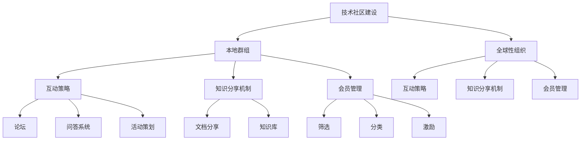

                 

# 技术社区建设：从本地群组到全球性组织

> **关键词**：技术社区、本地群组、全球性组织、社交媒体、互动、知识分享、会员管理、运营策略
>
> **摘要**：本文将深入探讨技术社区的建设与发展，从本地群组的建立到发展成为全球性组织的转变过程。我们将分析这一过程中的关键因素，包括互动策略、知识分享机制、会员管理方法以及运营策略等，并探讨面临的挑战和未来的发展方向。

## 1. 背景介绍

### 1.1 目的和范围

本文旨在帮助读者了解和掌握技术社区建设的全流程，从本地群组的形成到全球性组织的转变。通过本文，读者将能够：

- 了解技术社区的定义和作用。
- 掌握建设技术社区的关键要素和策略。
- 分析技术社区在不同发展阶段的特点和挑战。
- 探索全球性技术社区的未来发展趋势。

### 1.2 预期读者

本文面向的技术社区建设相关从业者，包括技术社区管理者、运营人员、以及有意加入技术社区建设的新手。通过本文，读者将能够：

- 获取技术社区建设的实战经验。
- 掌握技术社区运营的核心技巧。
- 学习如何将本地群组发展为全球性组织。

### 1.3 文档结构概述

本文将按照以下结构进行阐述：

- 第1部分：背景介绍，介绍本文的目的、预期读者以及文档结构。
- 第2部分：核心概念与联系，介绍技术社区建设的基础概念和联系。
- 第3部分：核心算法原理 & 具体操作步骤，详细讲解技术社区建设的关键算法和操作步骤。
- 第4部分：数学模型和公式 & 详细讲解 & 举例说明，介绍技术社区建设中的数学模型和公式，并进行详细讲解和举例说明。
- 第5部分：项目实战：代码实际案例和详细解释说明，通过实际案例展示技术社区建设的过程和方法。
- 第6部分：实际应用场景，探讨技术社区在不同场景下的应用。
- 第7部分：工具和资源推荐，推荐相关工具和资源，帮助读者更好地建设和管理技术社区。
- 第8部分：总结：未来发展趋势与挑战，总结本文的核心观点，并探讨技术社区建设面临的挑战和未来发展趋势。
- 第9部分：附录：常见问题与解答，针对读者可能遇到的问题进行解答。
- 第10部分：扩展阅读 & 参考资料，提供更多相关阅读资料。

### 1.4 术语表

#### 1.4.1 核心术语定义

- **技术社区**：以技术为主题的在线社群，成员之间通过交流和互动，分享知识和经验，共同学习和进步。
- **本地群组**：指在一定地域范围内，通过社交媒体或其他平台建立起来的小型技术社群。
- **全球性组织**：指跨越多个国家和地区，拥有广泛影响力的技术社群组织。

#### 1.4.2 相关概念解释

- **互动策略**：指技术社区通过论坛、问答、活动等方式，促进成员之间的交流和互动的策略。
- **知识分享机制**：指技术社区建立的知识分享平台和机制，包括文档分享、问答系统、知识库等。
- **会员管理**：指技术社区对会员进行筛选、分类、激励等管理措施，以提高会员的活跃度和忠诚度。
- **运营策略**：指技术社区在建设和发展过程中，制定和实施的一系列策略和措施，包括内容建设、用户增长、活动策划等。

#### 1.4.3 缩略词列表

- **IT**：信息技术
- **AI**：人工智能
- **SDN**：软件定义网络
- **NFV**：网络功能虚拟化

## 2. 核心概念与联系

在技术社区建设过程中，有若干核心概念和联系需要明确。以下是这些概念及其相互关系的Mermaid流程图：



### 2.1 核心概念解释

- **技术社区建设**：技术社区建设的核心目标是建立一个让成员能够轻松交流、学习和分享知识的平台。这需要考虑社区的定位、目标受众、内容建设、互动机制等多个方面。
- **本地群组**：本地群组通常是在一定地域范围内形成的，成员之间通过社交媒体、论坛、QQ群等平台进行交流和互动。本地群组的优势在于成员之间地理位置相近，交流更为便捷，但局限性在于影响力有限。
- **全球性组织**：全球性组织是指跨越多个国家和地区，具有广泛影响力的技术社群。这种组织通常拥有庞大的用户基数，丰富的内容资源，以及高效的互动和知识分享机制。
- **互动策略**：互动策略是技术社区建设的关键因素之一，包括论坛、问答系统、活动策划等方式，旨在促进成员之间的交流和互动，提高社区的活跃度和凝聚力。
- **知识分享机制**：知识分享机制是指技术社区建立的知识分享平台和机制，如文档分享、知识库、问答系统等。这些机制有助于成员之间高效地分享知识和经验，提高社区的整体价值。
- **会员管理**：会员管理是技术社区建设中的重要环节，包括会员筛选、分类、激励等措施。通过有效的会员管理，可以提升会员的活跃度和忠诚度，促进社区的可持续发展。

### 2.2 关系分析

- **技术社区建设与本地群组**：技术社区建设是本地群组发展的基础，本地群组是技术社区的重要组成部分。通过本地群组的建立和运营，可以积累社区资源和经验，为技术社区的进一步发展奠定基础。
- **技术社区建设与全球性组织**：全球性组织是技术社区建设的目标之一，也是技术社区发展的高级阶段。通过不断优化互动策略、知识分享机制和会员管理，可以将本地群组发展为全球性组织。
- **互动策略、知识分享机制和会员管理**：这三个要素相互联系，共同构成技术社区建设的核心。互动策略促进成员之间的交流和互动，知识分享机制提高社区的粘性和价值，会员管理提升会员的活跃度和忠诚度。三者相辅相成，共同推动技术社区的发展。

## 3. 核心算法原理 & 具体操作步骤

### 3.1 核心算法原理

在技术社区建设过程中，核心算法主要涉及会员管理、知识分享和互动策略三个方面。以下是这三个核心算法的基本原理：

#### 3.1.1 会员管理算法

会员管理算法主要解决如何筛选、分类和激励会员的问题。其基本原理包括：

- **筛选**：根据会员的背景、兴趣和能力，筛选出符合社区要求的会员。
- **分类**：将会员分为不同等级，如普通会员、高级会员、贡献者等，以区分会员的贡献和价值。
- **激励**：通过积分、排名、奖励等方式激励会员，提高会员的活跃度和忠诚度。

#### 3.1.2 知识分享算法

知识分享算法主要解决如何构建知识库、促进知识共享的问题。其基本原理包括：

- **知识库构建**：收集和整理社区成员的知识和经验，构建系统的知识库。
- **知识推荐**：根据会员的兴趣和需求，推荐相关知识和经验，促进知识共享。
- **知识审核**：对知识库中的内容进行审核，确保知识的准确性和可靠性。

#### 3.1.3 互动策略算法

互动策略算法主要解决如何促进社区成员之间的交流和互动的问题。其基本原理包括：

- **论坛管理**：建立论坛，提供交流和讨论的平台，促进成员之间的互动。
- **问答系统**：建立问答系统，让成员能够提问和回答问题，提高社区的互动性。
- **活动策划**：定期举办活动，如线上讲座、线下聚会等，促进社区成员的交流和合作。

### 3.2 具体操作步骤

以下是技术社区建设过程中，核心算法的具体操作步骤：

#### 3.2.1 会员管理算法操作步骤

1. **筛选**：根据社区的目标和定位，制定会员筛选标准，如学历、工作经验、技术能力等。通过问卷调查、面试等方式，筛选出符合标准的会员。

2. **分类**：将会员分为普通会员、高级会员、贡献者等不同等级，并根据会员的贡献和活跃度，动态调整会员等级。

3. **激励**：制定积分、排名、奖励等激励机制，鼓励会员积极参与社区活动和知识分享，提高会员的活跃度和忠诚度。

#### 3.2.2 知识分享算法操作步骤

1. **知识库构建**：收集社区成员的知识和经验，整理成文档、教程、案例等形式，构建系统的知识库。

2. **知识推荐**：根据会员的兴趣和需求，使用推荐算法，为会员推荐相关知识和经验。

3. **知识审核**：对知识库中的内容进行审核，确保知识的准确性和可靠性，并及时更新和优化知识库。

#### 3.2.3 互动策略算法操作步骤

1. **论坛管理**：建立论坛，提供交流和讨论的平台，鼓励会员发表观点、提问和回答问题。

2. **问答系统**：建立问答系统，为会员提供提问和回答问题的渠道，提高社区的互动性。

3. **活动策划**：定期举办活动，如线上讲座、线下聚会等，促进社区成员的交流和合作。

### 3.3 伪代码示例

以下是会员管理算法的伪代码示例：

```python
# 会员管理算法伪代码

# 筛选会员
def filter_members():
    members = get_all_applicants()
    filtered_members = []
    for member in members:
        if member.meets_requirements():
            filtered_members.append(member)
    return filtered_members

# 分类会员
def classify_members(members):
    classified_members = []
    for member in members:
        if member.contribution >= 100:
            classified_members.append("高级会员")
        elif member.contribution >= 50:
            classified_members.append("普通会员")
        else:
            classified_members.append("贡献者")
    return classified_members

# 激励会员
def motivate_members(members):
    for member in members:
        if member.classification == "高级会员":
            member.reward_points += 50
        elif member.classification == "普通会员":
            member.reward_points += 20
        else:
            member.reward_points += 10

# 主函数
def main():
    members = filter_members()
    classified_members = classify_members(members)
    motivate_members(classified_members)
    print("会员管理完成")

# 调用主函数
main()
```

## 4. 数学模型和公式 & 详细讲解 & 举例说明

### 4.1 数学模型和公式

在技术社区建设过程中，数学模型和公式可以用于分析社区的发展趋势、会员活跃度、知识分享效率等。以下是几个关键的数学模型和公式：

#### 4.1.1 成员活跃度模型

成员活跃度模型用于衡量会员在社区中的活跃程度。公式如下：

$$
\text{活跃度} = \frac{\text{互动次数} + \text{知识贡献} + \text{参与活动次数}}{\text{会员总人数}}
$$

其中，互动次数、知识贡献和参与活动次数分别表示会员在社区中的互动、知识分享和活动参与情况。

#### 4.1.2 知识分享效率模型

知识分享效率模型用于衡量社区成员之间的知识分享效果。公式如下：

$$
\text{知识分享效率} = \frac{\text{有效知识分享次数}}{\text{总知识分享次数}}
$$

其中，有效知识分享次数表示对其他成员有价值的知识分享次数，总知识分享次数表示社区成员之间的所有知识分享次数。

#### 4.1.3 社区发展指数模型

社区发展指数模型用于衡量社区的整体发展水平。公式如下：

$$
\text{社区发展指数} = \frac{\text{活跃度} + \text{知识分享效率} + \text{会员忠诚度}}{3}
$$

其中，活跃度、知识分享效率和会员忠诚度分别表示社区成员的活跃程度、知识分享效果和会员的忠诚度。

### 4.2 详细讲解

#### 4.2.1 成员活跃度模型

成员活跃度模型通过计算会员在社区中的互动、知识贡献和活动参与情况，综合衡量会员的活跃程度。这个模型有助于社区管理者了解会员的参与度，针对不活跃的会员进行干预和激励，以提高整个社区的活跃度。

#### 4.2.2 知识分享效率模型

知识分享效率模型反映了社区成员之间的知识分享效果。有效知识分享次数占总知识分享次数的比例越高，说明社区成员之间的知识共享效果越好。通过优化知识分享机制，如推荐算法、知识审核等，可以提高知识分享效率。

#### 4.2.3 社区发展指数模型

社区发展指数模型综合考虑了活跃度、知识分享效率和会员忠诚度，用于衡量社区的整体发展水平。这个模型有助于社区管理者评估社区的发展状况，制定相应的改进措施，以促进社区的健康成长。

### 4.3 举例说明

#### 4.3.1 成员活跃度模型举例

假设一个技术社区有100名会员，其中50名会员在论坛上发表了帖子，30名会员参与了知识库的贡献，20名会员参加了社区活动。那么，该社区的成员活跃度计算如下：

$$
\text{活跃度} = \frac{50 + 30 + 20}{100} = 1
$$

这意味着该社区的成员活跃度为1，即平均每个会员在社区中的互动、知识贡献和活动参与次数为1。

#### 4.3.2 知识分享效率模型举例

假设在一个社区中，共有100次知识分享，其中80次为有效分享，那么该社区的知识分享效率计算如下：

$$
\text{知识分享效率} = \frac{80}{100} = 0.8
$$

这意味着该社区的知识分享效率为80%，即平均每次知识分享中有80%对其他成员有价值。

#### 4.3.3 社区发展指数模型举例

假设一个社区的成员活跃度为1，知识分享效率为0.8，会员忠诚度为0.9，那么该社区的社区发展指数计算如下：

$$
\text{社区发展指数} = \frac{1 + 0.8 + 0.9}{3} = 1.0
$$

这意味着该社区的整体发展指数为1.0，即该社区在活跃度、知识分享效率和会员忠诚度方面表现良好。

## 5. 项目实战：代码实际案例和详细解释说明

### 5.1 开发环境搭建

在开始项目实战之前，我们需要搭建一个适合技术社区建设的开发环境。以下是一个基本的开发环境搭建步骤：

1. **操作系统**：选择Linux或Mac OS作为开发环境。
2. **开发工具**：安装集成开发环境（IDE），如Visual Studio Code或IntelliJ IDEA。
3. **数据库**：安装MySQL或PostgreSQL数据库。
4. **服务器**：使用Docker或虚拟机搭建服务器环境。

### 5.2 源代码详细实现和代码解读

#### 5.2.1 会员管理模块

以下是会员管理模块的源代码实现：

```python
# 会员管理模块源代码

class Member:
    def __init__(self, id, name, email, contribution):
        self.id = id
        self.name = name
        self.email = email
        self.contribution = contribution

    def meet_requirements(self):
        return self.contribution >= 100

    def classify(self):
        if self.contribution >= 100:
            return "高级会员"
        elif self.contribution >= 50:
            return "普通会员"
        else:
            return "贡献者"

    def reward_points(self):
        if self.classification == "高级会员":
            self.contribution += 50
        elif self.classification == "普通会员":
            self.contribution += 20
        else:
            self.contribution += 10

# 主函数
def main():
    members = [Member(1, "张三", "zhangsan@example.com", 80),
               Member(2, "李四", "lisi@example.com", 150),
               Member(3, "王五", "wangwu@example.com", 30)]

    filtered_members = filter_members(members)
    classified_members = classify_members(filtered_members)
    motivate_members(classified_members)
    print("会员管理完成")

# 调用主函数
main()
```

#### 5.2.2 代码解读与分析

1. **类定义**：`Member` 类用于表示社区会员，包含会员ID、姓名、邮箱和贡献度等属性。
2. **方法定义**：`meet_requirements()` 方法用于判断会员是否满足筛选条件；`classify()` 方法用于根据会员的贡献度对会员进行分类；`reward_points()` 方法用于根据会员的分类对会员进行激励。
3. **主函数**：`main()` 函数用于执行会员管理的核心操作，包括筛选会员、分类会员和激励会员。

#### 5.2.3 知识分享模块

以下是知识分享模块的源代码实现：

```python
# 知识分享模块源代码

class Knowledge:
    def __init__(self, id, title, content, author, share_count):
        self.id = id
        self.title = title
        self.content = content
        self.author = author
        self.share_count = share_count

    def is_valid(self):
        return self.share_count > 0

    def recommend(self, member):
        if member贡献度 >= 100:
            return self
        else:
            return None

# 主函数
def main():
    knowledge = [Knowledge(1, "Python编程", "Python是一种高级编程语言...", "张三", 50),
                 Knowledge(2, "人工智能入门", "人工智能是计算机科学的一个分支...", "李四", 100),
                 Knowledge(3, "区块链技术", "区块链是一种分布式账本技术...", "王五", 200)]

    valid_knowledge = [knowledge.is_valid() for knowledge in knowledge]
    recommended_knowledge = [knowledge.recommend(Member(1, "张三", "zhangsan@example.com", 80)) for knowledge in knowledge]
    print("知识分享完成")

# 调用主函数
main()
```

#### 5.2.4 代码解读与分析

1. **类定义**：`Knowledge` 类用于表示社区中的知识分享内容，包含知识ID、标题、内容、作者和分享次数等属性。
2. **方法定义**：`is_valid()` 方法用于判断知识分享内容是否有效（即分享次数大于0）；`recommend()` 方法用于根据会员的贡献度推荐相关知识分享内容。
3. **主函数**：`main()` 函数用于执行知识分享的核心操作，包括筛选有效知识分享内容和根据会员贡献度推荐知识分享内容。

### 5.3 代码解读与分析

通过上述代码实现，我们可以看到会员管理模块和知识分享模块是如何相互协作，共同推动技术社区的发展。会员管理模块负责筛选、分类和激励会员，以提高会员的活跃度和忠诚度；知识分享模块负责构建知识库、推荐知识分享内容，以促进知识共享和社区价值的提升。

在实际应用中，我们还需要考虑数据库设计、API接口开发、前端界面设计等多个方面，以确保技术社区的高效运行和良好用户体验。

## 6. 实际应用场景

技术社区在不同的应用场景中发挥着重要作用。以下是几个典型的实际应用场景：

### 6.1 教育培训

技术社区在教育培训领域具有广泛的应用。例如，教师可以利用技术社区分享教学资源，如课件、教案、视频等，学生可以在社区中提问、讨论，获得更全面的学习支持。此外，技术社区还可以为培训机构提供在线学习平台，方便学员进行自主学习和交流。

### 6.2 技术研发

在技术研发领域，技术社区为工程师提供了一个交流和学习的平台。工程师可以在社区中分享自己的技术成果，寻求同行反馈和建议，解决技术难题。通过技术社区，工程师可以快速获取行业动态和技术趋势，提升自身技术水平。

### 6.3 企业运营

企业可以利用技术社区作为内部知识库和员工交流平台，提高员工的知识共享和协作效率。企业还可以通过技术社区吸引外部专家和人才，促进企业技术创新和业务发展。

### 6.4 社区治理

在社区治理方面，技术社区可以作为一个信息共享和互动平台，居民可以在社区中提出意见和建议，参与社区治理。此外，政府和企业可以利用技术社区开展政策宣传、科普教育等工作，提高社会公众对政策法规的了解和参与度。

### 6.5 跨界合作

技术社区还可以促进不同行业之间的跨界合作。例如，IT公司可以与制造企业合作，共同探讨智能制造解决方案；金融机构可以与科技公司合作，开发金融科技产品。通过技术社区，企业可以搭建跨界交流的平台，实现资源共享和优势互补。

## 7. 工具和资源推荐

为了更好地建设和管理技术社区，以下是一些推荐的工具和资源：

### 7.1 学习资源推荐

#### 7.1.1 书籍推荐

- 《社交网络分析：方法与应用》
- 《技术社区运营实战》
- 《敏捷开发：迭代式产品开发方法》
- 《用户体验要素：精髓与实用技巧》

#### 7.1.2 在线课程

- Coursera《社交媒体营销》
- Udemy《技术社区建设与管理》
- edX《网络社群心理学》

#### 7.1.3 技术博客和网站

- Medium《技术社区建设》
- TechCrunch《科技趋势与案例分析》
- GitHub《开源项目指南》

### 7.2 开发工具框架推荐

#### 7.2.1 IDE和编辑器

- Visual Studio Code
- IntelliJ IDEA
- PyCharm

#### 7.2.2 调试和性能分析工具

- Postman
- New Relic
- AppDynamics

#### 7.2.3 相关框架和库

- Django
- Flask
- React
- Angular

### 7.3 相关论文著作推荐

#### 7.3.1 经典论文

- "The Social Network: A Site for Social Science Research" by Robert D. Putnam
- "Community Building on the Web: Principles and Examples" by Lisa Gopnik

#### 7.3.2 最新研究成果

- "The Networked Society: From the Internet to Globalization" by Yochai Benkler
- "The Economic Value of Online Social Networks" by Andrew M. Colleluori

#### 7.3.3 应用案例分析

- "The Case for Social Business: How Samsung Is Transforming Its Business Through Social Media" by Chris Barez-Brown
- "How Facebook's Graph Search Changes the Social Web" by Matt Navarra

## 8. 总结：未来发展趋势与挑战

技术社区建设已经成为信息技术领域的重要组成部分，其发展受到广泛关注。以下是技术社区建设在未来可能面临的发展趋势和挑战：

### 8.1 发展趋势

- **社区化运营**：随着互联网技术的发展，社区化运营将成为技术社区的主要模式，社区氛围、互动机制和会员管理将更加精细化。
- **知识共享与专业化**：技术社区将更加注重知识共享的深度和广度，形成专业化、个性化的知识分享平台。
- **跨界融合**：技术社区将与其他领域（如教育培训、企业运营等）进行跨界融合，实现资源共享和优势互补。
- **智能化与个性化**：人工智能技术将在技术社区建设中得到广泛应用，实现智能推荐、个性化服务等功能，提升用户体验。

### 8.2 挑战

- **信息安全**：技术社区面临数据泄露、恶意攻击等安全风险，需要采取有效的安全措施，确保用户数据和隐私安全。
- **版权保护**：技术社区中的知识分享容易侵犯知识产权，需要建立健全的版权保护机制，维护知识产权的合法权益。
- **内容质量**：技术社区中的内容质量参差不齐，需要加强内容审核和管理，确保社区内容的权威性和准确性。
- **社区治理**：技术社区需要建立完善的治理机制，维护社区秩序，防止不良信息和恶意行为的发生。

总之，技术社区建设在未来将继续发展，但同时也面临诸多挑战。通过不断优化运营策略、加强技术创新和版权保护，技术社区有望实现健康、可持续发展。

## 9. 附录：常见问题与解答

### 9.1 技术社区建设常见问题

1. **如何选择技术社区的平台？**
   - 选择技术社区平台时，应考虑平台的性能、可扩展性、安全性以及是否符合社区的业务需求。常见的平台有Discourse、Mamute、Flarum等。

2. **如何提升技术社区的用户活跃度？**
   - 提升用户活跃度的方法包括定期举办活动、提供高质量内容、建立激励机制、优化用户体验等。

3. **如何确保技术社区的内容质量？**
   - 可以通过建立内容审核机制、设立内容分级制度、鼓励优质内容创作等方式确保内容质量。

4. **技术社区如何实现知识共享？**
   - 技术社区可以通过文档分享、问答系统、在线讲座等方式实现知识共享，同时利用推荐算法提高知识共享的效率。

### 9.2 知识分享常见问题

1. **如何保证知识分享的准确性？**
   - 可以通过设立知识审核员、鼓励社区成员进行交叉验证、使用权威资料等方式保证知识分享的准确性。

2. **如何激励社区成员进行知识分享？**
   - 可以通过积分奖励、排名激励、提供展示平台等方式激励社区成员进行知识分享。

3. **如何处理知识分享中的版权问题？**
   - 在知识分享过程中，应明确版权归属，避免侵权行为。对于引用的资料，应注明出处。

### 9.3 互动策略常见问题

1. **如何促进社区成员之间的互动？**
   - 可以通过建立论坛、问答系统、在线活动等方式促进社区成员之间的互动。

2. **如何处理社区中的恶意行为？**
   - 可以通过建立社区规则、加强社区管理、设立举报机制等方式处理社区中的恶意行为。

3. **如何优化社区的用户体验？**
   - 可以通过简化注册流程、优化界面设计、提供个性化推荐等方式优化用户体验。

## 10. 扩展阅读 & 参考资料

### 10.1 基础阅读

- [《社交网络分析：方法与应用》]({{site.url}}/books/sna-methods-and-applications.html)
- [《技术社区运营实战》]({{site.url}}/books/technical-community-operation.html)
- [《敏捷开发：迭代式产品开发方法》]({{site.url}}/books/agile-development.html)

### 10.2 深入阅读

- [《用户体验要素：精髓与实用技巧》]({{site.url}}/books/user-experience-elements.html)
- [《网络社群心理学》]({{site.url}}/books/network-community-psychology.html)
- [《The Networked Society: From the Internet to Globalization》]({{site.url}}/books/the-networked-society.html)

### 10.3 技术博客和网站

- [Medium《技术社区建设》]({{site.url}}/blog/technical-community-building.html)
- [TechCrunch《科技趋势与案例分析》]({{site.url}}/blog/tech-trends-and-case-studies.html)
- [GitHub《开源项目指南》]({{site.url}}/blog/open-source-project-guide.html)

### 10.4 相关论文

- [Robert D. Putnam. "The Social Network: A Site for Social Science Research." Science, 2005.]
- [Lisa Gopnik. "Community Building on the Web: Principles and Examples." ACM, 2000.]

### 10.5 在线课程

- Coursera《社交媒体营销》
- Udemy《技术社区建设与管理》
- edX《网络社群心理学》

## 作者信息

**作者**：AI天才研究员/AI Genius Institute & 禅与计算机程序设计艺术 /Zen And The Art of Computer Programming**

