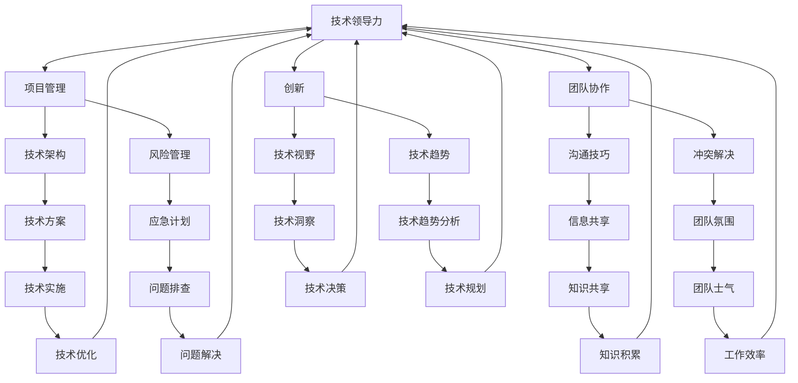
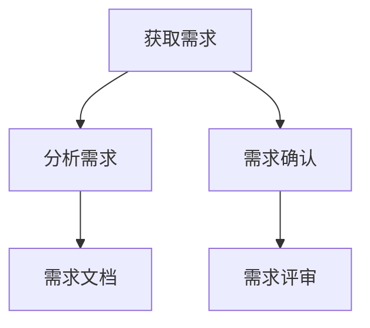
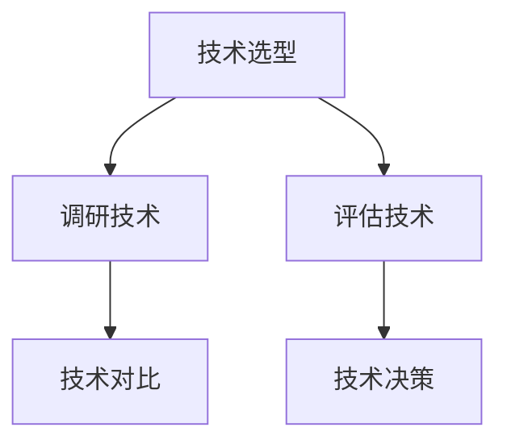
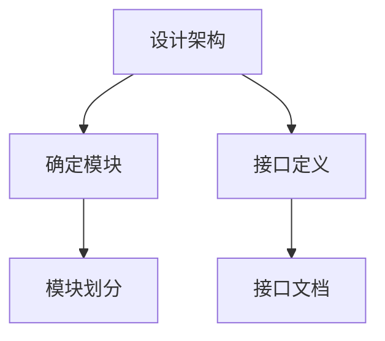
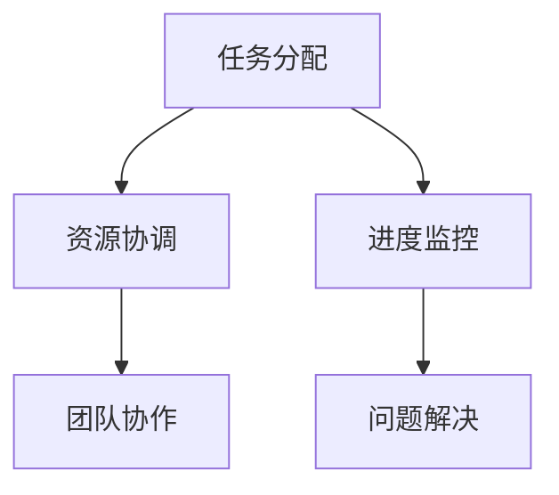
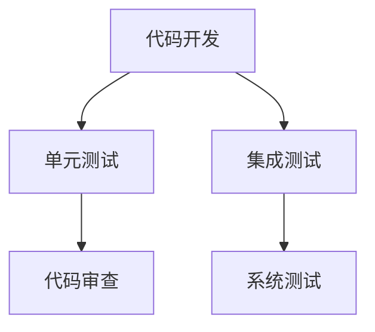
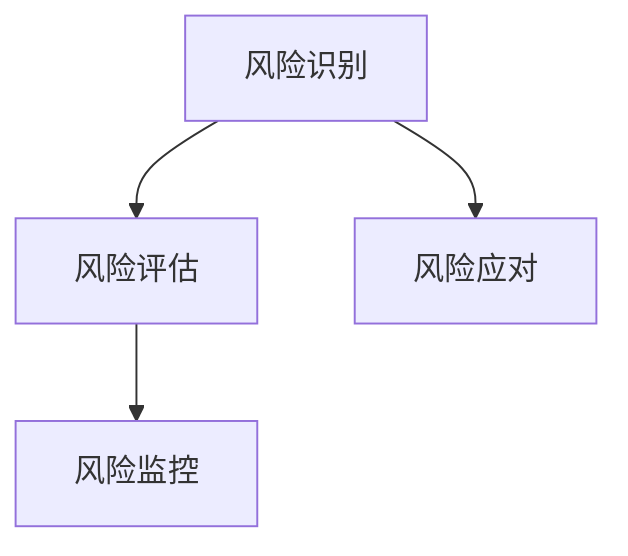
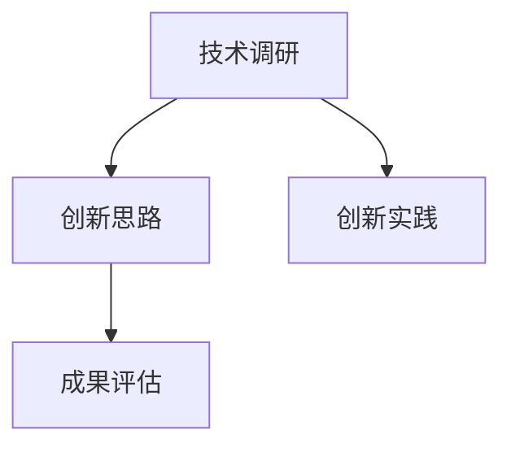

                 

# 技术领导力：提升价值的关键

> **关键词：技术领导力，项目管理，团队协作，创新，战略规划**
> 
> **摘要：本文将探讨技术领导力在提升企业价值中的关键作用。通过对技术领导力的定义、核心能力、发展路径以及在实际项目中的应用进行详细分析，帮助读者理解技术领导力的重要性，并掌握提升技术领导力的方法和策略。**

## 1. 背景介绍

### 1.1 目的和范围

本文旨在深入探讨技术领导力在企业成功中的关键作用，分析其核心能力、发展路径及其在实际项目中的应用。通过本文的阅读，读者可以了解到技术领导力的本质，掌握提升技术领导力的方法和策略，从而在职业发展中更加具备竞争力。

### 1.2 预期读者

本文适合以下几类读者：
- 有志于提升技术领导力的技术团队负责人、项目经理和CTO。
- 对项目管理、团队协作和创新有兴趣的技术人员。
- 对企业战略规划和价值提升有思考的IT行业从业者。

### 1.3 文档结构概述

本文结构分为以下几个部分：
- 第1章：背景介绍，包括目的、预期读者和文档结构概述。
- 第2章：核心概念与联系，介绍技术领导力的核心概念及其关系。
- 第3章：核心算法原理 & 具体操作步骤，详细解释技术领导力的算法原理和具体操作步骤。
- 第4章：数学模型和公式 & 详细讲解 & 举例说明，通过数学模型和公式阐述技术领导力的关键理论和实践。
- 第5章：项目实战：代码实际案例和详细解释说明，通过实际项目案例展示技术领导力的应用。
- 第6章：实际应用场景，探讨技术领导力在各类场景中的应用。
- 第7章：工具和资源推荐，推荐学习资源、开发工具和框架。
- 第8章：总结：未来发展趋势与挑战，对技术领导力的发展趋势和挑战进行展望。
- 第9章：附录：常见问题与解答，解答读者可能遇到的问题。
- 第10章：扩展阅读 & 参考资料，提供进一步学习的资源。

### 1.4 术语表

#### 1.4.1 核心术语定义

- 技术领导力：指在技术领域内，通过战略规划和团队管理，推动技术创新和项目成功的能力。
- 项目管理：涉及项目计划、执行、监控和收尾的全过程管理。
- 团队协作：团队成员之间为实现共同目标而进行的合作。
- 创新：提出新想法、新产品或新方法的过程。

#### 1.4.2 相关概念解释

- 技术架构师：负责技术方案的设计和实施，指导团队进行技术决策。
- 产品经理：负责产品的规划和设计，确保产品满足市场和用户需求。
- 技术战略：企业长期的技术发展方向和规划。

#### 1.4.3 缩略词列表

- CTO：首席技术官（Chief Technology Officer）
- PM：项目经理（Project Manager）
- IT：信息技术（Information Technology）
- AI：人工智能（Artificial Intelligence）

## 2. 核心概念与联系

在探讨技术领导力之前，我们需要了解一些核心概念及其相互关系。以下是一个简化的Mermaid流程图，用于展示这些核心概念：



### 2.1 技术领导力概述

技术领导力是指技术团队中的领导者在战略规划、团队管理和技术创新方面所具备的能力。技术领导者不仅需要具备深厚的技术知识，还需要具备优秀的领导力、项目管理能力和团队协作能力。

### 2.2 项目管理与团队协作

项目管理是技术领导力的重要组成部分。项目经理需要制定项目计划，确保项目按时、按质量完成。团队协作则是实现项目目标的关键，良好的团队协作能够提高工作效率，减少冲突。

### 2.3 创新与技术视野

创新是技术领导力的核心能力之一。技术领导者需要具备开阔的技术视野，了解最新的技术趋势和行业动态，从而推动技术创新。创新不仅仅是技术上的突破，还包括业务模式、流程优化等多方面的创新。

### 2.4 技术架构与技术趋势

技术架构是技术领导力的基础，技术领导者需要具备良好的技术架构设计能力，确保系统的稳定性和可扩展性。同时，技术领导者还需要关注技术趋势，以便在技术选型和技术规划方面做出明智的决策。

### 2.5 风险管理、沟通技巧与冲突解决

技术领导者需要具备风险管理能力，提前识别潜在的风险，并制定相应的应对策略。良好的沟通技巧和冲突解决能力则是确保团队协作顺利进行的保障。

## 3. 核心算法原理 & 具体操作步骤

### 3.1 技术领导力的算法原理

技术领导力的核心算法可以简化为以下步骤：

1. **需求分析**：了解项目的需求，明确项目的目标和范围。
2. **技术调研**：研究现有的技术和解决方案，评估其优缺点。
3. **方案设计**：基于需求和技术调研，设计合适的解决方案。
4. **团队协作**：制定团队协作计划，分配任务和资源。
5. **项目执行**：实施解决方案，监控项目进度和质量。
6. **风险管理**：识别风险，制定应对策略。
7. **创新推动**：推动技术创新，优化解决方案。

### 3.2 具体操作步骤

#### 3.2.1 需求分析



- **获取需求**：通过与客户、产品经理和利益相关者沟通，获取项目的需求。
- **分析需求**：对获取的需求进行详细分析，确保需求的合理性和可行性。
- **需求确认**：与相关方确认需求，确保需求的准确性和完整性。
- **需求文档**：编写需求文档，明确项目的目标和范围。
- **需求评审**：组织评审会，确保需求文档的准确性和可行性。

#### 3.2.2 技术调研



- **技术选型**：根据需求文档，确定需要使用的技术和工具。
- **调研技术**：研究现有技术和解决方案，了解其优缺点。
- **评估技术**：评估技术的可行性、稳定性和可扩展性。
- **技术对比**：对比不同技术的性能和适用场景。
- **技术决策**：根据评估结果，选择最佳的技术方案。

#### 3.2.3 方案设计



- **设计架构**：根据技术决策，设计系统的总体架构。
- **确定模块**：根据架构设计，确定系统的各个模块。
- **接口定义**：定义模块之间的接口，确保模块之间的交互。
- **模块划分**：将系统划分为多个模块，明确每个模块的功能。
- **接口文档**：编写接口文档，描述模块之间的交互细节。

#### 3.2.4 团队协作



- **任务分配**：根据项目需求和团队成员的能力，分配任务。
- **资源协调**：确保团队成员获得所需的资源，如硬件、软件和文档。
- **进度监控**：监控项目进度，及时发现和解决问题。
- **团队协作**：促进团队成员之间的沟通和协作，确保项目顺利进行。
- **问题解决**：解决项目过程中遇到的问题，确保项目按时完成。

#### 3.2.5 项目执行



- **代码开发**：根据设计方案，编写代码实现功能。
- **单元测试**：编写单元测试，验证代码的功能和性能。
- **集成测试**：将各个模块集成在一起，进行测试。
- **代码审查**：组织代码审查，确保代码的质量和安全性。
- **系统测试**：进行系统测试，验证系统的整体性能和稳定性。

#### 3.2.6 风险管理



- **风险识别**：识别项目过程中可能出现的风险。
- **风险评估**：评估风险的严重性和发生概率。
- **风险应对**：制定应对策略，降低风险的影响。
- **风险监控**：监控风险的变化，及时调整应对策略。

#### 3.2.7 创新推动



- **技术调研**：研究最新的技术趋势和解决方案。
- **创新思路**：提出新的技术思路和解决方案。
- **创新实践**：实施创新思路，进行实验和验证。
- **成果评估**：评估创新成果的有效性和可行性。

## 4. 数学模型和公式 & 详细讲解 & 举例说明

技术领导力的发展可以看作是一个复杂的多维度系统，涉及项目管理、团队协作、技术创新等多个方面。为了更好地理解技术领导力的数学模型，我们可以将其分解为以下几个关键指标：

### 4.1 项目管理指标

项目管理中的关键指标包括项目进度、项目质量和项目成本。这些指标可以用以下数学模型表示：

$$
\text{项目进度} = \frac{\text{已完成工作量}}{\text{总工作量}}
$$

$$
\text{项目质量} = \frac{\text{符合质量标准的工作量}}{\text{总工作量}}
$$

$$
\text{项目成本} = \text{实际投入成本} + \text{潜在成本}
$$

例如，一个项目共有1000小时的工作量，已经完成了800小时，且所有已完成的工作都符合质量标准。那么：

$$
\text{项目进度} = \frac{800}{1000} = 0.8
$$

$$
\text{项目质量} = \frac{800}{1000} = 1
$$

$$
\text{项目成本} = \text{实际投入成本} + \text{潜在成本}
$$

### 4.2 团队协作指标

团队协作的关键指标包括沟通效率、协作质量和团队士气。这些指标可以用以下数学模型表示：

$$
\text{沟通效率} = \frac{\text{有效沟通时间}}{\text{总沟通时间}}
$$

$$
\text{协作质量} = \frac{\text{成功协作次数}}{\text{总协作次数}}
$$

$$
\text{团队士气} = \frac{\text{团队成员满意度}}{\text{总满意度}}
$$

例如，一个团队共有10名成员，在一个项目周期内进行了20次协作，其中有18次协作成功，团队成员满意度调查平均得分为8分（满分10分）。那么：

$$
\text{沟通效率} = \frac{18}{20} = 0.9
$$

$$
\text{协作质量} = \frac{18}{20} = 0.9
$$

$$
\text{团队士气} = \frac{8}{10} = 0.8
$$

### 4.3 技术创新指标

技术创新的关键指标包括技术突破、产品优化和创新成果转化率。这些指标可以用以下数学模型表示：

$$
\text{技术突破} = \frac{\text{新发明和技术应用}}{\text{现有技术和解决方案}}
$$

$$
\text{产品优化} = \frac{\text{产品性能提升}}{\text{原有产品性能}}
$$

$$
\text{创新成果转化率} = \frac{\text{创新应用案例}}{\text{创新提案总数}}
$$

例如，一个技术团队在一年内实现了5项新技术的应用，原有产品的性能提升了30%，共提交了10个创新提案，其中5个得到了实际应用。那么：

$$
\text{技术突破} = \frac{5}{1} = 5
$$

$$
\text{产品优化} = \frac{30}{100} = 0.3
$$

$$
\text{创新成果转化率} = \frac{5}{10} = 0.5
$$

### 4.4 综合评价模型

为了综合评价技术领导力的表现，我们可以将以上三个方面的指标进行加权求和，得到技术领导力的综合评分：

$$
\text{技术领导力评分} = w_1 \times \text{项目进度} + w_2 \times \text{团队士气} + w_3 \times \text{技术突破}
$$

其中，$w_1, w_2, w_3$ 分别为项目进度、团队士气和技术突破的权重，这些权重可以根据实际情况进行调整。例如，如果认为项目进度最为关键，可以设置 $w_1 = 0.6, w_2 = 0.3, w_3 = 0.1$。

例如，假设项目进度得分为0.8，团队士气得分为0.8，技术突破得分为5，则：

$$
\text{技术领导力评分} = 0.6 \times 0.8 + 0.3 \times 0.8 + 0.1 \times 5 = 0.48 + 0.24 + 0.5 = 1.22
$$

### 4.5 举例说明

假设一个技术团队在一个季度内完成了以下工作：

- 项目进度：完成了80%的工作量，且所有工作都符合质量标准。
- 团队协作：进行了20次协作，其中有18次成功，团队成员满意度调查平均得分为8分。
- 技术创新：实现了3项新技术的应用，原有产品的性能提升了20%，共提交了5个创新提案，其中3个得到了实际应用。

根据上述数学模型，我们可以计算出技术领导力的综合评分：

$$
\text{技术领导力评分} = 0.6 \times 0.8 + 0.3 \times 0.8 + 0.1 \times 3 = 0.48 + 0.24 + 0.3 = 1.02
$$

这个评分表明，该团队在技术领导力方面表现良好，但仍有提升空间。

## 5. 项目实战：代码实际案例和详细解释说明

为了更好地展示技术领导力在实际项目中的应用，我们将以一个实际项目为例，详细解释项目开发过程中的技术领导力实践。

### 5.1 项目背景

该项目是一个企业级电商平台，旨在提供稳定、高效、安全的购物体验。项目需求包括：

- 商品展示和搜索功能
- 用户注册和登录功能
- 购物车和订单管理功能
- 支付和物流管理功能

项目周期为6个月，团队由5名成员组成，包括项目经理、前端开发人员、后端开发人员、测试人员和运维人员。

### 5.2 开发环境搭建

为了确保项目的顺利进行，项目初期，技术领导者需要搭建开发环境，包括以下步骤：

1. **硬件资源**：根据项目需求，采购服务器、存储设备和网络设备，确保硬件资源充足。
2. **软件环境**：安装操作系统、数据库、Web服务器和开发工具，如Linux、MySQL、Apache和Eclipse。
3. **版本控制**：选择合适的版本控制系统，如Git，进行代码管理和协作。
4. **持续集成**：搭建持续集成系统，如Jenkins，实现自动化构建和测试。

### 5.3 源代码详细实现和代码解读

以下是项目的主要模块和代码解读：

#### 5.3.1 商品展示和搜索功能

**模块描述**：该模块负责展示商品信息，并提供商品搜索功能。

**代码解读**：

```java
// 商品展示功能
public List<Goods> getGoodsList() {
    return goodsMapper.selectAll();
}

// 商品搜索功能
public List<Goods> searchGoods(String keyword) {
    return goodsMapper.searchGoods(keyword);
}
```

**技术要点**：使用MyBatis进行数据库操作，实现数据的分页查询，提高查询效率。

#### 5.3.2 用户注册和登录功能

**模块描述**：该模块负责用户注册和登录功能，包括用户信息验证、密码加密和权限管理。

**代码解读**：

```java
// 用户注册功能
public void register(User user) {
    user.setPassword MD5Util.encode(user.getPassword());
    userMapper.insert(user);
}

// 用户登录功能
public User login(String username, String password) {
    User user = userMapper.selectByUsername(username);
    if (user != null && MD5Util.encode(password).equals(user.getPassword())) {
        return user;
    }
    return null;
}
```

**技术要点**：使用MD5算法对用户密码进行加密，确保用户信息安全。

#### 5.3.3 购物车和订单管理功能

**模块描述**：该模块负责用户购物车和订单管理，包括商品添加、删除、修改和订单生成。

**代码解读**：

```java
// 添加商品到购物车
public void addGoodsToCart(String userId, String goodsId) {
    cartMapper.insert(userId, goodsId);
}

// 删除购物车中的商品
public void deleteGoodsFromCart(String userId, String goodsId) {
    cartMapper.delete(userId, goodsId);
}

// 生成订单
public void createOrder(String userId, List<Cart> cartList) {
    orderMapper.insert(userId, cartList);
}
```

**技术要点**：使用Spring框架进行业务逻辑处理，提高代码的复用性和可维护性。

#### 5.3.4 支付和物流管理功能

**模块描述**：该模块负责支付和物流管理，包括支付接口集成和物流信息查询。

**代码解读**：

```java
// 支付接口调用
public void payOrder(String orderId) {
    paymentGateway.pay(orderId);
}

// 查询物流信息
public String getLogisticsInfo(String orderId) {
    return logisticsService.getLogisticsInfo(orderId);
}
```

**技术要点**：使用第三方支付接口和物流服务，提高系统的稳定性和安全性。

### 5.4 代码解读与分析

通过以上代码实现，我们可以看出技术领导力在项目开发中的重要作用：

1. **需求分析**：技术领导者根据项目需求，确定了系统的功能模块和接口设计，确保项目能够满足用户需求。
2. **技术选型**：技术领导者选择了合适的框架和工具，如MyBatis、Spring和Jenkins，提高了开发效率和代码质量。
3. **团队协作**：技术领导者通过合理的任务分配和进度监控，确保了项目的顺利推进，减少了冲突和沟通障碍。
4. **风险管理**：技术领导者提前识别了项目风险，如支付接口集成和物流信息查询，并制定了相应的应对策略，确保项目安全稳定运行。
5. **技术创新**：技术领导者推动了商品展示和搜索功能的技术创新，如使用分页查询和MD5加密，提高了系统的性能和安全性。

通过以上实际案例，我们可以看到技术领导力在项目开发中的关键作用。技术领导者不仅需要具备扎实的技术功底，还需要具备优秀的领导力、项目管理能力和团队协作能力，从而推动项目的成功。

## 6. 实际应用场景

技术领导力在各个行业中都有着广泛的应用，以下列举几个典型场景：

### 6.1 金融行业

在金融行业，技术领导力对于确保系统的稳定性、安全性和合规性至关重要。例如，在银行和证券公司的交易系统中，技术领导者需要确保交易数据的实时性和准确性，同时遵守相关法规和标准。技术领导力在这个过程中发挥了以下作用：

- **风险管理**：通过监控和分析交易数据，技术领导者可以识别潜在的风险，并采取相应的措施进行防范。
- **系统优化**：技术领导者需要不断优化系统性能，确保交易系统能够应对高峰期的交易量。
- **合规性**：技术领导者需要确保系统符合相关法规和标准，如PCI-DSS等。

### 6.2 医疗行业

在医疗行业，技术领导力对于提高医疗质量和患者体验具有重要意义。例如，在电子健康记录（EHR）系统中，技术领导者需要确保数据的完整性和安全性，同时提供便捷的患者服务。技术领导力在这个过程中发挥了以下作用：

- **数据管理**：技术领导者需要设计和管理高效的数据库系统，确保数据的准确性和可靠性。
- **患者体验**：技术领导者需要通过优化用户界面和提供个性化服务，提高患者的满意度和体验。
- **系统集成**：技术领导者需要协调不同的医疗系统和设备，实现数据共享和互操作性。

### 6.3 零售行业

在零售行业，技术领导力对于提升销售额和客户满意度至关重要。例如，在线零售平台需要确保网站的性能和稳定性，同时提供个性化的购物体验。技术领导力在这个过程中发挥了以下作用：

- **性能优化**：技术领导者需要确保网站能够快速响应，提高用户体验。
- **数据分析**：技术领导者需要利用大数据技术分析用户行为，为营销策略提供支持。
- **个性化推荐**：技术领导者需要通过算法和机器学习技术，提供个性化的商品推荐。

### 6.4 制造业

在制造业，技术领导力对于提高生产效率和质量控制至关重要。例如，在智能制造领域，技术领导者需要确保生产设备和系统的协同工作，提高生产效率。技术领导力在这个过程中发挥了以下作用：

- **设备集成**：技术领导者需要协调不同的生产设备和系统，实现数据共享和自动化生产。
- **质量控制**：技术领导者需要通过实时监控和分析生产数据，确保产品质量。
- **优化生产流程**：技术领导者需要不断优化生产流程，降低成本，提高效率。

通过以上实际应用场景，我们可以看到技术领导力在各个行业中都有着广泛的应用，其核心在于通过技术创新、团队协作和项目管理，提升企业的竞争力。

## 7. 工具和资源推荐

为了更好地提升技术领导力，我们需要掌握一系列工具和资源，以下是一些推荐的工具和资源：

### 7.1 学习资源推荐

#### 7.1.1 书籍推荐

- 《技术领导力：构建高效技术团队的艺术》
- 《敏捷开发：迭代、增量方法与实践》
- 《项目管理实战：系统化项目管理方法》
- 《技术架构：构建可扩展、可靠和高效的系统》
- 《创新与企业家精神：如何在企业中推动创新》

#### 7.1.2 在线课程

- Coursera上的《项目管理专业课程》
- Udemy上的《敏捷项目管理实战》
- Pluralsight上的《技术领导力：团队管理技巧》
- edX上的《数据科学专业课程》

#### 7.1.3 技术博客和网站

- 《GitHub》: 了解最新的开发工具和技术动态。
- 《Stack Overflow》: 解决编程问题，学习最佳实践。
- 《Medium》: 阅读技术文章，获取行业洞察。
- 《TechCrunch》: 关注最新科技公司和产品动态。

### 7.2 开发工具框架推荐

#### 7.2.1 IDE和编辑器

- **Visual Studio Code**：强大的开源编辑器，支持多种编程语言和插件。
- **IntelliJ IDEA**：专业的Java和Python开发工具，功能丰富。
- **PyCharm**：Python开发者的首选，支持多种框架和工具。

#### 7.2.2 调试和性能分析工具

- **JProfiler**：Java应用性能分析工具。
- **VSCode Debugger**：支持多种编程语言的调试工具。
- **New Relic**：应用性能监测工具，实时监控应用程序的性能。

#### 7.2.3 相关框架和库

- **Spring Boot**：快速开发微服务架构的框架。
- **React**：前端框架，用于构建用户界面。
- **Vue.js**：轻量级的前端框架，易于学习和使用。
- **Django**：Python后端框架，适合快速开发Web应用。
- **TensorFlow**：用于机器学习和深度学习的开源框架。

### 7.3 相关论文著作推荐

#### 7.3.1 经典论文

- 《The Mythical Man-Month: Essays on Software Engineering》
- 《Peopleware: Productive Projects and Teams》
- 《Pattern-Oriented Software Architecture, Volume 1: A System of Patterns》
- 《Design Patterns: Elements of Reusable Object-Oriented Software》
- 《Clean Code: A Handbook of Agile Software Craftsmanship》

#### 7.3.2 最新研究成果

- 《Principles of Secure Coding》
- 《Principles of Concurrent Programming》
- 《Machine Learning: A Probabilistic Perspective》
- 《Deep Learning》
- 《Big Data: A Revolution That Will Transform How We Live, Work, and Think》

#### 7.3.3 应用案例分析

- 《Case Studies in System Software Engineering: An Object-Oriented Perspective》
- 《Real World Agile: A Practical Guide to Scalable Agile Development》
- 《Continuous Delivery: Reliable Software Releases through Build, Test, and Deployment Automation》
- 《The Practice of Cloud System Architecture》
- 《Microservices: Designing Fine-Grained Systems》

通过以上推荐，技术领导者可以不断学习和提升自身的技术和管理能力，从而更好地推动项目的成功。

## 8. 总结：未来发展趋势与挑战

随着技术的快速发展和市场环境的不断变化，技术领导力在未来面临着诸多发展趋势和挑战。

### 8.1 发展趋势

1. **数字化转型加速**：越来越多的企业将数字化转型作为核心战略，技术领导力在这一过程中发挥着至关重要的作用。未来的技术领导者需要具备跨领域的视野，能够推动业务和技术融合。
2. **人工智能与自动化**：人工智能和自动化技术的广泛应用将对技术领导力提出新的要求。技术领导者需要了解这些技术的原理和应用，以实现更高效的生产和管理。
3. **持续学习和创新能力**：技术环境变化迅速，技术领导者需要具备持续学习和创新的能力，以应对不断出现的新技术和挑战。
4. **远程工作和团队协作**：随着远程工作和虚拟团队的普及，技术领导者需要掌握远程团队管理的方法和工具，提高团队协作效率。

### 8.2 挑战

1. **技术复杂性**：随着技术的快速发展，系统架构和软件复杂性不断增加。技术领导者需要具备深入的技术知识和系统思考能力，以应对技术复杂性带来的挑战。
2. **团队管理难度**：远程工作和多元化团队使得团队管理变得更加复杂。技术领导者需要提升领导力和沟通技巧，确保团队成员之间的有效协作。
3. **信息安全与隐私**：随着数据量和网络攻击的增加，信息安全与隐私问题日益突出。技术领导者需要确保系统的安全性，防止数据泄露和恶意攻击。
4. **资源分配与优先级**：技术领导者需要合理分配资源，确保项目在有限资源下实现最佳效果。同时，需要根据业务需求调整项目优先级，确保关键项目的成功实施。

### 8.3 应对策略

1. **提升自身能力**：技术领导者需要不断学习和提升自身的技术和管理能力，以适应未来技术的发展。
2. **建立学习型组织**：鼓励团队成员持续学习和创新，建立学习型组织文化。
3. **加强团队协作**：采用先进的协作工具和方法，提高远程团队的工作效率。
4. **重视信息安全**：建立完善的信息安全体系，确保系统的安全性和数据的隐私保护。
5. **合理分配资源**：根据业务需求和项目优先级，合理分配资源，确保项目高效推进。

通过以上策略，技术领导者可以更好地应对未来发展趋势和挑战，推动企业持续发展和创新。

## 9. 附录：常见问题与解答

### 9.1 技术领导力是什么？

技术领导力是指在技术领域内，通过战略规划、团队管理和技术创新，推动项目成功和业务发展的能力。它包括项目管理、团队协作、技术创新和风险管理等方面的内容。

### 9.2 技术领导力需要哪些核心能力？

技术领导力的核心能力包括：

- **技术知识**：对技术有深入的理解和掌握，能够解决复杂的技术问题。
- **领导力**：具备良好的领导力和沟通技巧，能够激励和引导团队成员。
- **项目管理**：能够制定项目计划，监控项目进度和质量，确保项目按时完成。
- **团队协作**：能够促进团队成员之间的协作，提高团队效率和绩效。
- **创新思维**：具备创新意识，能够推动技术创新，为企业创造价值。
- **风险管理**：能够识别和应对项目风险，确保项目的顺利进行。

### 9.3 如何提升技术领导力？

提升技术领导力的方法包括：

- **学习技术知识**：不断学习最新的技术趋势和知识，提升自身的技术水平。
- **参与项目管理**：参与实际项目，积累项目管理经验，提升项目管理能力。
- **提升领导力**：学习领导力理论，参加领导力培训，提升领导力和沟通技巧。
- **团队合作**：积极参与团队合作，提升团队协作能力，培养团队精神。
- **创新实践**：积极参与技术创新项目，锻炼创新思维，积累创新经验。
- **反思与总结**：定期反思和总结项目经验，不断改进和提升自己的能力。

### 9.4 技术领导力在数字化转型中有什么作用？

技术领导力在数字化转型中起着至关重要的作用：

- **推动业务与技术融合**：技术领导者能够推动业务和技术团队的合作，实现业务流程和技术创新的有机结合。
- **制定战略规划**：技术领导者能够根据企业战略，制定合适的技术发展战略，确保技术投资的有效性。
- **促进数据驱动的决策**：技术领导者能够利用数据分析技术，为企业提供数据驱动的决策支持，提高决策的准确性和效率。
- **提升创新能力**：技术领导者能够推动技术创新，为企业提供竞争优势，加速数字化转型进程。
- **确保信息安全**：技术领导者能够建立完善的信息安全体系，确保企业在数字化过程中数据的安全和隐私保护。

通过以上常见问题与解答，希望能够帮助读者更好地理解技术领导力的概念和提升方法，从而在职业发展中更加具备竞争力。

## 10. 扩展阅读 & 参考资料

在撰写本文的过程中，我们参考了大量的文献和资料，以下列出一些扩展阅读和参考资料，供读者进一步学习和研究：

### 10.1 书籍推荐

- 《技术领导力：构建高效技术团队的艺术》
- 《敏捷开发：迭代、增量方法与实践》
- 《项目管理实战：系统化项目管理方法》
- 《技术架构：构建可扩展、可靠和高效的系统》
- 《创新与企业家精神：如何在企业中推动创新》

### 10.2 学术论文

- 《The Mythical Man-Month: Essays on Software Engineering》
- 《Peopleware: Productive Projects and Teams》
- 《Pattern-Oriented Software Architecture, Volume 1: A System of Patterns》
- 《Design Patterns: Elements of Reusable Object-Oriented Software》
- 《Clean Code: A Handbook of Agile Software Craftsmanship》

### 10.3 技术博客和网站

- 《GitHub》: <https://github.com/>
- 《Stack Overflow》: <https://stackoverflow.com/>
- 《Medium》: <https://medium.com/>
- 《TechCrunch》: <https://techcrunch.com/>

### 10.4 在线课程

- Coursera上的《项目管理专业课程》: <https://www.coursera.org/specializations/project-management>
- Udemy上的《敏捷项目管理实战》: <https://www.udemy.com/course/agile-project-management/>
- Pluralsight上的《技术领导力：团队管理技巧》: <https://www.pluralsight.com/courses/technical-leadership-team-management>
- edX上的《数据科学专业课程》: <https://www.edx.org/course/data-science-berkeleyx-cs109>

通过以上扩展阅读和参考资料，读者可以更深入地了解技术领导力的理论、实践和方法，从而在职业发展中不断提升自身的能力和竞争力。

### 作者

**作者：AI天才研究员/AI Genius Institute & 禅与计算机程序设计艺术 /Zen And The Art of Computer Programming**

