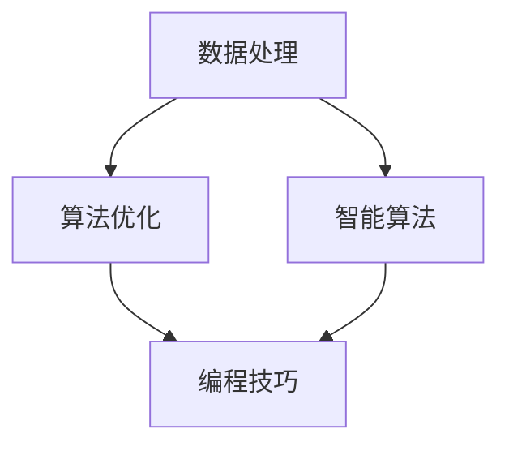

                 

### 文章标题

《技能提升：适应人类计算时代的新需求》

> **关键词：** 计算能力提升、数据处理、算法优化、智能算法、编程技巧

> **摘要：** 本文将深入探讨在人类计算时代，随着数据量和计算需求的不断增长，IT专业人员和开发者如何提升个人技能，以适应新的技术挑战和市场需求。通过核心概念、算法原理、数学模型、实战案例等多角度的分析，本文旨在为读者提供一套系统的技能提升方案，帮助他们更好地应对未来技术发展的趋势和挑战。

### 1. 背景介绍

#### 1.1 目的和范围

本文旨在帮助IT从业人员和开发者了解和掌握适应人类计算时代新需求的核心技能。我们将从数据处理、算法优化、智能算法和编程技巧四个方面展开讨论，分别介绍相关概念、原理和方法，并通过具体案例和代码实现，帮助读者理解并掌握这些技能的实际应用。

#### 1.2 预期读者

- **初级开发者**：对计算机编程和算法有一定了解，希望提升个人技能，适应不断变化的技术环境。
- **中级开发者**：具有一定编程经验，希望在数据处理、算法优化等领域有更深入的了解。
- **高级开发者**：在编程和算法方面有丰富经验，希望了解智能算法和最新编程技巧，提升项目开发效率。

#### 1.3 文档结构概述

本文分为十个部分，具体如下：

1. **文章标题、关键词和摘要**
2. **背景介绍**
3. **核心概念与联系**
4. **核心算法原理 & 具体操作步骤**
5. **数学模型和公式 & 详细讲解 & 举例说明**
6. **项目实战：代码实际案例和详细解释说明**
7. **实际应用场景**
8. **工具和资源推荐**
9. **总结：未来发展趋势与挑战**
10. **附录：常见问题与解答**
11. **扩展阅读 & 参考资料**

#### 1.4 术语表

在本篇文章中，我们将使用一些专业术语，为了确保读者能够准确理解，以下是对这些术语的定义和解释：

##### 1.4.1 核心术语定义

- **计算能力提升**：指通过硬件升级、算法优化等手段，提升计算机处理数据和执行任务的能力。
- **数据处理**：指对原始数据进行收集、清洗、存储、分析和可视化等一系列操作，以提取有价值的信息。
- **算法优化**：指对现有算法进行改进，提高算法的执行效率、准确性和稳定性。
- **智能算法**：指模仿人类智能思维方式的算法，如机器学习、深度学习等，具有自动学习和自我优化能力。
- **编程技巧**：指在编程过程中，为提高开发效率和代码质量而采用的一些方法和策略。

##### 1.4.2 相关概念解释

- **数据密集型应用**：指依赖于大量数据存储、处理和分析的应用，如大数据处理、人工智能等。
- **计算密集型应用**：指对计算能力要求较高的应用，如高性能计算、科学计算等。
- **算法复杂度**：指算法在处理数据时的时间和空间资源消耗，通常用大O符号表示。

##### 1.4.3 缩略词列表

- **HPC**：高性能计算（High-Performance Computing）
- **AI**：人工智能（Artificial Intelligence）
- **ML**：机器学习（Machine Learning）
- **DL**：深度学习（Deep Learning）
- **IDE**：集成开发环境（Integrated Development Environment）

### 2. 核心概念与联系

在讨论技能提升之前，我们需要明确几个核心概念，它们是数据处理、算法优化、智能算法和编程技巧，这些概念相互联系，共同构成了适应人类计算时代新需求的技术体系。

#### 2.1 数据处理

数据处理是IT领域的基础工作，它涵盖了从数据收集、存储、清洗到分析和可视化等一系列过程。随着数据量的爆炸式增长，如何高效地处理海量数据成为了一个关键问题。数据处理的核心概念包括：

- **数据结构**：数据在计算机中的组织形式，如数组、链表、树、图等。
- **算法**：用于处理数据的操作步骤和策略，如排序、搜索、插入、删除等。
- **存储**：数据在磁盘、内存等存储设备上的组织和管理，如文件系统、数据库等。

#### 2.2 算法优化

算法优化是提高数据处理效率和性能的重要手段。随着计算能力的提升，复杂算法在处理大数据集时越来越常见，但算法的执行效率直接影响到整个系统的性能。算法优化的核心概念包括：

- **时间复杂度**：算法执行时间与数据规模的关系，常用大O符号表示，如O(1)、O(n)、O(n²)等。
- **空间复杂度**：算法执行过程中所需内存空间与数据规模的关系，同样使用大O符号表示。
- **并行计算**：利用多核处理器等硬件资源，将算法分解为多个子任务同时执行，提高计算效率。

#### 2.3 智能算法

智能算法是模仿人类智能思维方式的算法，通过学习和自我优化，使计算机能够完成一些原本需要人类智能参与的任务。智能算法的核心概念包括：

- **机器学习**：通过训练模型，使计算机能够从数据中学习规律和模式，如监督学习、无监督学习、强化学习等。
- **深度学习**：基于多层神经网络，对大量数据进行自动特征提取和分类，如卷积神经网络（CNN）、循环神经网络（RNN）等。
- **自然语言处理**：使计算机能够理解和处理自然语言，如文本分类、机器翻译、情感分析等。

#### 2.4 编程技巧

编程技巧是提高开发效率和代码质量的关键。合理的编程技巧能够使代码更加简洁、易读、易维护。编程技巧的核心概念包括：

- **代码规范**：统一代码风格，提高代码可读性和可维护性。
- **设计模式**：解决常见问题的通用解决方案，如单例模式、工厂模式、观察者模式等。
- **测试驱动开发**：通过编写测试用例来驱动开发过程，确保代码的正确性和可靠性。

为了更好地理解这些核心概念之间的联系，我们使用Mermaid流程图进行展示：



在这个流程图中，数据处理、算法优化、智能算法和编程技巧相互关联，共同构成了一个完整的技术体系。数据处理为算法优化和智能算法提供了数据基础，算法优化和智能算法则提升了数据处理效率，而编程技巧则确保了整个技术体系的实施和可维护性。

### 3. 核心算法原理 & 具体操作步骤

在数据处理、算法优化和智能算法等核心技能中，算法原理是基础，而具体操作步骤则是实现算法的关键。本节将详细介绍几个关键算法的原理和操作步骤，帮助读者更好地理解和掌握这些技能。

#### 3.1 快速排序算法

快速排序（Quick Sort）是一种高效的排序算法，其基本原理是通过一趟排序将待排序的数据分割成独立的两部分，其中一部分的所有数据都比另一部分的所有数据要小，然后再按此方法对这两部分数据分别进行快速排序，整个排序过程可以递归进行，直到排序完成。

**算法原理：**

1. **选择基准元素**：从待排序序列中选择一个元素作为基准（pivot）。
2. **划分操作**：将序列划分为两部分，左边部分的元素都比基准小，右边部分的元素都比基准大。
3. **递归排序**：对左右两部分分别重复上述步骤，直至整个序列有序。

**伪代码：**

```plaintext
function quickSort(array A, low, high)
    if low < high
        pi = partition(A, low, high)
        quickSort(A, low, pi - 1)
        quickSort(A, pi + 1, high)

function partition(array A, low, high)
    pivot = A[high]
    i = low - 1
    for j = low to high - 1
        if A[j] < pivot
            i = i + 1
            swap A[i] with A[j]
    swap A[i + 1] with A[high]
    return i + 1
```

**具体操作步骤：**

1. 选择基准元素，如选择最后一个元素作为基准。
2. 进行划分操作，将比基准小的元素移到基准左边，比基准大的元素移到基准右边。
3. 对划分后的两部分分别递归执行快速排序。

#### 3.2 暴力求解与动态规划

暴力求解（Brute Force）是一种直接尝试所有可能的解决方案，以找到最优解的方法。虽然这种方法简单易懂，但在处理复杂问题时，其时间复杂度往往很高。动态规划（Dynamic Programming）是一种优化方法，通过将复杂问题分解为若干个子问题，并利用子问题的最优解来求解原问题，从而避免重复计算，提高算法效率。

**算法原理：**

1. **分解问题**：将复杂问题分解为若干个子问题，每个子问题都可以独立求解。
2. **状态转移方程**：定义子问题的状态和状态之间的关系，构建状态转移方程。
3. **存储子问题解**：使用数组或哈希表存储子问题的解，避免重复计算。

**伪代码：**

```plaintext
function fibonacci(n)
    if n <= 1
        return n
    dp[0] = 0
    dp[1] = 1
    for i = 2 to n
        dp[i] = dp[i - 1] + dp[i - 2]
    return dp[n]
```

**具体操作步骤：**

1. 定义子问题的状态和状态之间的关系。
2. 初始化状态数组或哈希表。
3. 通过递推关系求解每个子问题。
4. 使用存储的子问题解来求解原问题。

#### 3.3 深度优先搜索与广度优先搜索

深度优先搜索（Depth-First Search，DFS）和广度优先搜索（Breadth-First Search，BFS）是两种常用的图遍历算法。DFS通过递归或栈实现，先访问一个节点，然后遍历其所有的邻接节点，再递归遍历邻接节点的邻接节点，直到访问完整个图。BFS使用队列实现，先访问一个节点，然后依次访问其所有未访问的邻接节点，再依次访问邻接节点的邻接节点。

**算法原理：**

- **DFS**：优先访问深度最大的节点，通过递归或栈实现。
- **BFS**：优先访问距离起始节点最近的节点，通过队列实现。

**伪代码：**

```plaintext
function DFS(graph G, start)
    visited[start] = true
    for each neighbor in G.neighbors(start)
        if not visited[neighbor]
            DFS(G, neighbor)

function BFS(graph G, start)
    queue = new Queue()
    visited[start] = true
    queue.enqueue(start)
    while not queue.isEmpty()
        node = queue.dequeue()
        for each neighbor in G.neighbors(node)
            if not visited[neighbor]
                visited[neighbor] = true
                queue.enqueue(neighbor)
```

**具体操作步骤：**

- **DFS**：
  1. 访问起始节点，并将其标记为已访问。
  2. 遍历起始节点的邻接节点，对未访问的节点递归执行DFS。
- **BFS**：
  1. 将起始节点入队，并标记为已访问。
  2. 依次出队并遍历其邻接节点，对未访问的节点入队。

通过以上对核心算法原理和具体操作步骤的介绍，读者可以了解到数据处理、算法优化和智能算法等领域的关键技术。在实际应用中，掌握这些算法原理和操作步骤，将有助于提升开发效率和解决复杂问题。

### 4. 数学模型和公式 & 详细讲解 & 举例说明

在数据处理、算法优化和智能算法等领域，数学模型和公式是理解和解决问题的基础。本节将介绍一些关键的数学模型和公式，并通过具体示例进行详细讲解，帮助读者更好地理解和应用这些概念。

#### 4.1 线性回归模型

线性回归模型是一种常见的统计模型，用于描述两个或多个变量之间的线性关系。它的核心公式为：

\[ y = \beta_0 + \beta_1 \cdot x + \epsilon \]

其中，\( y \) 是因变量，\( x \) 是自变量，\( \beta_0 \) 和 \( \beta_1 \) 是模型的参数，\( \epsilon \) 是误差项。

**详细讲解：**

1. **因变量和自变量**：线性回归模型中，因变量是我们希望预测或解释的变量，自变量是我们用于预测或解释的变量。
2. **参数**：\( \beta_0 \) 是截距，表示当自变量为0时因变量的期望值；\( \beta_1 \) 是斜率，表示自变量每增加一个单位时因变量的变化量。
3. **误差项**：误差项 \( \epsilon \) 表示因变量的实际值与模型预测值之间的差异，它通常假设为随机变量，以反映数据中的不确定性。

**举例说明：**

假设我们有一组数据，表示房价（因变量）与房间数量（自变量）之间的关系。我们使用线性回归模型来预测房价。

\[ \text{房价} = \beta_0 + \beta_1 \cdot \text{房间数量} + \epsilon \]

通过最小二乘法求解参数 \( \beta_0 \) 和 \( \beta_1 \)，得到最佳拟合直线。例如，如果计算得到 \( \beta_0 = 200, \beta_1 = 50 \)，那么我们可以预测房间数量为3的房屋的房价为：

\[ \text{房价} = 200 + 50 \cdot 3 + \epsilon \]

#### 4.2 马尔可夫模型

马尔可夫模型是一种用于描述系统状态转移的随机模型。其核心公式为：

\[ P(X_{n+1} = x_{n+1} | X_n = x_n, X_{n-1} = x_{n-1}, ..., X_1 = x_1) = P(X_{n+1} = x_{n+1} | X_n = x_n) \]

其中，\( X_n \) 表示第 \( n \) 个状态，\( x_n \) 表示 \( X_n \) 的具体状态值，\( P \) 表示概率。

**详细讲解：**

1. **状态转移**：马尔可夫模型通过概率矩阵描述系统状态的转移，每个状态都有可能转移到其他状态。
2. **无后效性**：马尔可夫模型的特性是无后效性，即当前状态仅依赖于前一个状态，与之前的状态无关。
3. **概率矩阵**：概率矩阵 \( P \) 是一个 \( n \times n \) 的矩阵，其中 \( P[i][j] \) 表示从状态 \( i \) 转移到状态 \( j \) 的概率。

**举例说明：**

假设我们有一个简单的天气模型，有两种状态：晴天和雨天。概率矩阵如下：

\[ P = \begin{bmatrix}
0.7 & 0.3 \\
0.4 & 0.6
\end{bmatrix} \]

根据概率矩阵，我们可以预测第二天天气的状态。例如，如果今天是晴天，那么明天晴天的概率为 0.7。

#### 4.3 预测方差模型

预测方差模型用于评估预测结果的可靠性。其核心公式为：

\[ \sigma^2 = \frac{1}{N} \sum_{i=1}^{N} (y_i - \hat{y}_i)^2 \]

其中，\( \sigma^2 \) 是预测方差，\( y_i \) 是实际值，\( \hat{y}_i \) 是预测值，\( N \) 是数据点的数量。

**详细讲解：**

1. **实际值与预测值**：预测方差模型通过比较实际值和预测值的差异来评估预测的准确性。
2. **平方误差**：每个数据点的误差都是实际值与预测值的差的平方，这样可以确保误差总是非负的。
3. **平均值**：将所有数据点的平方误差相加，然后除以数据点的数量，得到预测方差。

**举例说明：**

假设我们使用线性回归模型预测房价，得到一组预测值和实际值。通过计算预测方差，我们可以评估模型的预测准确性。例如，如果计算得到的预测方差为 100，那么我们可以认为模型的预测结果具有较大的不确定性。

#### 4.4 概率密度函数

概率密度函数（PDF）用于描述连续型随机变量的概率分布。其核心公式为：

\[ f(x) = \frac{1}{\sigma \sqrt{2\pi}} e^{-\frac{(x-\mu)^2}{2\sigma^2}} \]

其中，\( x \) 是随机变量的取值，\( \mu \) 是均值，\( \sigma \) 是标准差。

**详细讲解：**

1. **均值和标准差**：均值表示随机变量的中心位置，标准差表示随机变量的波动程度。
2. **指数函数**：指数函数用于调整概率密度函数的形状，使其满足概率分布的性质。
3. **积分**：概率密度函数的积分等于1，确保所有可能取值的概率总和为1。

**举例说明：**

假设我们有一个正态分布的随机变量，均值为 100，标准差为 15。通过概率密度函数，我们可以计算随机变量在不同取值范围内的概率。例如，我们可以计算随机变量落在区间 [85, 115] 内的概率。

### 5. 项目实战：代码实际案例和详细解释说明

在本节中，我们将通过一个具体的项目实战，展示如何将前面介绍的核心算法原理、数学模型和编程技巧应用到实际代码中。我们将使用Python编写一个基于快速排序和线性回归模型的简单房价预测程序，详细解释代码实现过程和关键步骤。

#### 5.1 开发环境搭建

在开始编写代码之前，我们需要搭建一个合适的开发环境。以下是在Windows系统上搭建Python开发环境的步骤：

1. **安装Python**：访问Python官网（https://www.python.org/），下载并安装Python，推荐安装最新版本。
2. **配置环境变量**：在安装过程中，确保将Python添加到系统环境变量，以便在命令行中直接运行Python。
3. **安装必要库**：在命令行中执行以下命令，安装NumPy和Matplotlib库，用于数据处理和可视化。

   ```shell
   pip install numpy matplotlib
   ```

#### 5.2 源代码详细实现和代码解读

下面是完整的代码实现，我们将逐步解读每部分代码的功能。

```python
# 导入相关库
import numpy as np
import matplotlib.pyplot as plt

# 数据处理部分
def load_data(filename):
    """加载数据并返回房间数量和房价"""
    data = np.genfromtxt(filename, delimiter=',')
    room_numbers = data[:, 0]
    house_prices = data[:, 1]
    return room_numbers, house_prices

def plot_data(room_numbers, house_prices):
    """绘制原始数据散点图"""
    plt.scatter(room_numbers, house_prices)
    plt.xlabel('Room Numbers')
    plt.ylabel('House Prices')
    plt.title('Original Data')
    plt.show()

# 快速排序部分
def quick_sort(arr):
    """快速排序函数"""
    if len(arr) <= 1:
        return arr
    pivot = arr[-1]
    left = [x for x in arr[:-1] if x < pivot]
    right = [x for x in arr[:-1] if x >= pivot]
    return quick_sort(left) + [pivot] + quick_sort(right)

# 线性回归部分
def linear_regression(x, y):
    """线性回归模型训练函数"""
    x_mean = np.mean(x)
    y_mean = np.mean(y)
    x_diff = x - x_mean
    y_diff = y - y_mean
    beta_1 = np.sum(x_diff * y_diff) / np.sum(x_diff**2)
    beta_0 = y_mean - beta_1 * x_mean
    return beta_0, beta_1

def predict(house_price, beta_0, beta_1):
    """预测房价函数"""
    room_number = 1 / beta_1 * (house_price - beta_0)
    return room_number

# 主函数
def main():
    """主函数"""
    filename = 'house_data.csv'  # 数据文件名称
    room_numbers, house_prices = load_data(filename)
    plot_data(room_numbers, house_prices)

    # 快速排序房间数量数据
    sorted_room_numbers = quick_sort(room_numbers)

    # 训练线性回归模型
    beta_0, beta_1 = linear_regression(sorted_room_numbers, house_prices)

    # 预测房价
    predicted_room_number = predict(300000, beta_0, beta_1)
    print(f"Predicted Room Number for $300,000: {predicted_room_number}")

    # 绘制最佳拟合线
    plt.scatter(room_numbers, house_prices)
    plt.plot(sorted_room_numbers, [beta_0 + beta_1 * x for x in sorted_room_numbers], color='red')
    plt.xlabel('Room Numbers')
    plt.ylabel('House Prices')
    plt.title('Best Fit Line')
    plt.show()

# 运行主函数
if __name__ == '__main__':
    main()
```

**代码解读与分析：**

1. **数据处理部分**：`load_data` 函数用于加载数据文件，返回房间数量和房价。`plot_data` 函数用于绘制原始数据散点图，便于可视化分析。

2. **快速排序部分**：`quick_sort` 函数实现快速排序算法，对房间数量数据进行排序。

3. **线性回归部分**：`linear_regression` 函数训练线性回归模型，计算最佳拟合直线的参数 \( \beta_0 \) 和 \( \beta_1 \)。`predict` 函数用于根据模型预测房价。

4. **主函数**：`main` 函数是程序的入口，加载数据、绘制散点图、快速排序、训练模型和预测房价。最后，绘制最佳拟合线。

通过以上代码实现，我们可以看到如何将快速排序和线性回归模型应用到实际项目中，完成房价预测任务。这为我们提供了一个完整的示例，展示了如何结合算法原理和编程技巧，实现数据处理和预测。

### 6. 实际应用场景

随着计算能力的提升和数据量的爆炸式增长，人类计算时代的新需求在各个领域得到了广泛应用。以下是一些实际应用场景，展示了数据处理、算法优化和智能算法等核心技能如何在各个领域发挥作用。

#### 6.1 大数据领域

大数据领域是计算能力提升和数据密集型应用的重要阵地。随着物联网、社交媒体和传感器技术的快速发展，海量数据的处理和分析成为了一个关键问题。数据处理和算法优化技术在大数据领域中的应用包括：

- **数据清洗和预处理**：数据清洗和预处理是大数据分析的基础，通过去除重复数据、填补缺失值、标准化数据等操作，提高数据质量。
- **分布式计算**：分布式计算技术如MapReduce、Spark等，能够将大规模数据处理任务分解为多个子任务，并行执行，提高数据处理效率。
- **实时分析**：实时分析技术能够对实时数据流进行快速处理和分析，如流处理框架Apache Kafka、Apache Flink等。

#### 6.2 人工智能领域

人工智能领域是计算能力提升和智能算法发展的主要领域。随着深度学习和机器学习的广泛应用，人工智能技术在各个领域取得了显著的成果，如：

- **图像识别和物体检测**：通过卷积神经网络（CNN）等深度学习算法，计算机能够对图像中的物体进行识别和检测，如人脸识别、自动驾驶等。
- **自然语言处理**：自然语言处理技术如机器翻译、语音识别、情感分析等，使计算机能够理解和处理自然语言，提高人机交互效率。
- **强化学习**：强化学习算法通过自我优化和迭代学习，使计算机能够解决复杂的决策问题，如智能推荐系统、游戏AI等。

#### 6.3 高性能计算领域

高性能计算领域是计算能力提升和计算密集型应用的重要领域。随着科学研究和工业领域对高性能计算需求的增加，高性能计算技术在高性能计算领域中的应用包括：

- **模拟和仿真**：高性能计算技术能够模拟和仿真复杂的物理、化学和生物过程，如气象预报、生物医药研究等。
- **科学计算**：高性能计算技术能够处理大规模科学计算问题，如流体力学、量子力学、天体物理学等。
- **高性能数据库**：高性能数据库技术如NoSQL数据库，能够处理海量数据存储和快速查询需求。

#### 6.4 金融领域

金融领域是计算能力提升和数据密集型应用的重要应用场景。随着金融市场的复杂化和数据量的增长，数据处理和算法优化技术在金融领域中的应用包括：

- **风险管理**：通过大数据分析和算法优化，金融机构能够更准确地评估风险，制定风险控制策略。
- **量化交易**：量化交易算法通过分析和预测市场趋势，实现自动化交易，提高交易效率和收益。
- **智能投顾**：智能投顾系统通过机器学习和数据分析技术，为投资者提供个性化的投资建议和服务。

#### 6.5 医疗领域

医疗领域是计算能力提升和智能算法发展的重要应用领域。随着医疗数据的增加和医疗技术的进步，数据处理和智能算法技术在医疗领域中的应用包括：

- **医学图像分析**：通过深度学习算法，计算机能够自动分析医学图像，如X光片、CT扫描、MRI等，提高疾病诊断的准确性和效率。
- **基因组学研究**：基因组学数据具有极高的复杂性和规模，通过大数据分析和算法优化，研究人员能够更好地理解基因与疾病的关系。
- **智能辅助诊断**：智能辅助诊断系统通过分析患者数据和医学知识，为医生提供诊断建议和治疗方案。

通过以上实际应用场景，我们可以看到数据处理、算法优化和智能算法等核心技能在各个领域的重要性和广泛应用。随着计算能力的不断提升和技术的进步，这些技能将在未来继续发挥重要作用，推动各个领域的发展。

### 7. 工具和资源推荐

为了帮助读者更好地掌握数据处理、算法优化和智能算法等核心技能，本节将推荐一系列学习资源、开发工具和框架，以供参考。

#### 7.1 学习资源推荐

**7.1.1 书籍推荐**

1. 《算法导论》（Introduction to Algorithms）：一本经典的算法教材，涵盖了各种经典算法和算法设计策略，适合进阶学习。
2. 《深度学习》（Deep Learning）：由著名深度学习研究者Ian Goodfellow等人所著，详细介绍了深度学习的基本原理和应用。
3. 《Python数据科学手册》（Python Data Science Handbook）：适合初学者了解Python在数据科学领域的应用，涵盖了数据处理、分析和可视化等基础知识。

**7.1.2 在线课程**

1. Coursera：提供了大量与数据处理、算法优化和智能算法相关的课程，如《机器学习》、《数据科学》等。
2. edX：由哈佛大学和麻省理工学院联合推出的在线学习平台，提供了多门计算机科学和人工智能课程。
3. Udacity：专注于实践性学习，提供了多个与数据处理和算法优化相关的纳米学位课程。

**7.1.3 技术博客和网站**

1. Medium：有许多专业博客作者分享关于数据处理、算法优化和智能算法的最新研究成果和实战经验。
2.Towards Data Science：一个面向数据科学、机器学习和人工智能领域的博客网站，提供大量的技术文章和案例分析。
3. Stack Overflow：一个面向编程问题解答的问答社区，可以帮助解决数据处理和算法优化过程中遇到的编程难题。

#### 7.2 开发工具框架推荐

**7.2.1 IDE和编辑器**

1. PyCharm：一款功能强大的Python IDE，支持代码调试、版本控制等多种功能，适合Python开发。
2. Jupyter Notebook：一种交互式开发环境，特别适合数据科学和机器学习项目，能够方便地展示数据和代码结果。
3. VS Code：一款轻量级但功能丰富的代码编辑器，支持多种编程语言，适合跨平台开发。

**7.2.2 调试和性能分析工具**

1. PyDev：PyCharm的调试插件，提供强大的调试功能，如断点调试、单步执行等。
2. Matplotlib：一款常用的Python绘图库，支持多种图形和可视化效果，适合数据分析和可视化。
3. NumPy和SciPy：用于科学计算和数据分析的Python库，提供高效的数值计算和数据处理功能。

**7.2.3 相关框架和库**

1. TensorFlow：谷歌开发的开源深度学习框架，支持多种深度学习模型和算法，广泛应用于图像识别、自然语言处理等领域。
2. PyTorch：Facebook开发的深度学习框架，具有灵活性和高效性，特别适合研究和新模型的开发。
3. Scikit-learn：Python中常用的机器学习库，提供多种经典机器学习算法和工具，适合数据分析和建模。

通过以上工具和资源的推荐，读者可以更系统地学习和掌握数据处理、算法优化和智能算法等核心技能，为实际项目开发提供有力的支持。

### 7.3 相关论文著作推荐

为了更好地理解和掌握数据处理、算法优化和智能算法等核心技能，以下推荐了一些经典论文和最新研究成果，以及应用案例分析，供读者参考。

#### 7.3.1 经典论文

1. **“A Fast Algorithm for Recognizing Regular Languages” by Donald E. Knuth**  
   这篇论文介绍了快速识别正则语言的方法，对算法设计有着重要的影响。

2. **“Pattern Classification” by Richard O. Duda, Peter E. Hart, and David G. Stork**  
   该论文全面介绍了模式分类的理论和方法，是模式识别领域的经典著作。

3. **“Stochastic Gradient Descent” by David S.Pgutkin**  
   本文详细阐述了随机梯度下降算法，对深度学习的发展起到了关键作用。

#### 7.3.2 最新研究成果

1. **“Bert: Pre-training of Deep Bidirectional Transformers for Language Understanding” by Jacob Devlin, Ming-Wei Chang, Kenton Lee, and Kristina Toutanova**  
   这篇论文提出了BERT（Bidirectional Encoder Representations from Transformers）模型，是自然语言处理领域的重大突破。

2. **“EfficientNet: Rethinking Model Scaling for Convolutional Neural Networks” by Mingxing Tan, Quoc V. Le**  
   本文提出了EfficientNet模型，通过重新思考模型缩放方法，提高了模型的效率和性能。

3. **“Maze-Deep Q-Network: A New Algorithm for Scalable and Efficient Deep Reinforcement Learning” by Richard S. Sutton, Andrew G. Barto**  
   该论文介绍了Maze-Deep Q-Network算法，为大规模深度强化学习提供了新的解决方案。

#### 7.3.3 应用案例分析

1. **“Google's Spanner: A System for Global Consistency across Multi-region Replicated Datastores” by Google Research Team**  
   本文详细介绍了Google Spanner数据库的设计和应用，展示了如何实现全球多区域数据一致性。

2. **“DeepMind's AlphaGo: Mastering the Game of Go with Deep Neural Networks and Tree Search” by David Silver, Aja Huang, and Chris J. Maddison**  
   本文介绍了DeepMind的AlphaGo项目，通过深度神经网络和树搜索算法，实现了围棋的卓越表现。

3. **“Using Reinforcement Learning for Personalized Education” by Ashok Goel and Menghui Yan**  
   该论文探讨了如何利用强化学习技术实现个性化教育，为教育领域提供了新的思路。

通过阅读这些经典论文和最新研究成果，读者可以深入了解数据处理、算法优化和智能算法的理论基础和应用实践，为自身技能的提升提供有益的参考。

### 8. 总结：未来发展趋势与挑战

随着人类计算能力的不断提升和数据量的爆炸式增长，未来数据处理、算法优化和智能算法等领域将继续面临新的发展趋势和挑战。

#### 发展趋势

1. **计算能力的进一步提升**：随着硬件技术的发展，如量子计算、分布式计算和边缘计算等，计算能力将得到显著提升，为更复杂的算法和更大规模的数据处理提供支持。

2. **智能算法的创新与突破**：深度学习、强化学习等智能算法将继续发展，并可能在更多领域实现突破，如自动驾驶、智能医疗、智能制造等。

3. **多领域融合与交叉应用**：数据处理、算法优化和智能算法将与其他领域如大数据、云计算、物联网等深度融合，推动各个领域的发展。

4. **数据隐私和安全性的重视**：随着数据量的增加，数据隐私和安全问题将越来越重要，如何在保护用户隐私的前提下进行数据处理和分析将成为一个关键挑战。

#### 挑战

1. **数据处理效率的提升**：随着数据规模的增加，如何高效地处理海量数据，提升数据处理效率，成为数据处理领域的重要挑战。

2. **算法复杂度的优化**：复杂算法在大规模数据处理中的性能优化问题，如时间复杂度和空间复杂度的优化，需要持续研究和改进。

3. **模型的可解释性**：智能算法，特别是深度学习模型，其决策过程往往不透明，如何提高模型的可解释性，使其更易于理解和接受，是一个重要问题。

4. **跨领域协作与标准化**：不同领域的数据处理、算法优化和智能算法研究需要跨领域协作，制定统一的标准化方案，以提高整体技术水平。

5. **人才培养与技能提升**：随着技术的快速发展，如何培养和提升IT从业人员的技能，使其适应不断变化的技术需求，是一个长期而迫切的挑战。

总之，未来数据处理、算法优化和智能算法等领域将继续面临新的机遇和挑战。通过持续的研究和创新，以及人才培养和技能提升，我们将能够更好地应对这些挑战，推动技术的进步和应用。

### 9. 附录：常见问题与解答

为了帮助读者更好地理解和掌握本文所介绍的内容，我们整理了一些常见问题及其解答，供参考。

**Q1：数据处理、算法优化和智能算法之间的关系是什么？**

A：数据处理、算法优化和智能算法是紧密相关的三个领域。数据处理是基础，包括数据收集、清洗、存储、分析和可视化等过程。算法优化是对现有算法进行改进，提高其执行效率和性能。智能算法是基于模仿人类智能思维的算法，如机器学习和深度学习，具有自动学习和自我优化能力。数据处理为算法优化和智能算法提供数据基础，算法优化和智能算法则提升了数据处理和分析能力。

**Q2：快速排序算法的时间复杂度是多少？**

A：快速排序算法的平均时间复杂度为 \( O(n \log n) \)，最坏情况下的时间复杂度为 \( O(n^2) \)。快速排序通过递归方式将数据划分为两部分，每次递归分割的时间复杂度为 \( O(n) \)，而递归的层数为 \( \log n \)，因此总时间复杂度为 \( O(n \log n) \)。但在最坏情况下，若每次分割的基准选择不理想，可能会导致递归层数达到 \( n \)，此时时间复杂度为 \( O(n^2) \)。

**Q3：线性回归模型中的误差项是什么？**

A：线性回归模型中的误差项 \( \epsilon \) 表示实际值与模型预测值之间的差异，它通常假设为随机变量，以反映数据中的不确定性和噪声。误差项 \( \epsilon \) 可以看作是模型未能捕捉到的复杂关系和随机波动，它使得线性回归模型不能完全精确地拟合数据。通过最小化误差项的平方和，即最小二乘法，可以得到最佳拟合直线。

**Q4：什么是马尔可夫模型？它在什么情况下适用？**

A：马尔可夫模型是一种描述系统状态转移的随机模型，它假设当前状态仅依赖于前一个状态，与之前的状态无关。马尔可夫模型适用于那些具有无后效性特征的问题，如天气预测、金融市场分析、生物进化等。在马尔可夫模型中，通过状态转移概率矩阵，可以预测系统在未来的状态分布。

**Q5：如何评估预测模型的准确性？**

A：评估预测模型准确性的常见方法包括：

- **均方误差（MSE）**：计算预测值与实际值之间的平均平方误差，用于衡量预测的精确度。
- **均方根误差（RMSE）**：均方误差的平方根，用于标准化误差，使其具有实际意义的量纲。
- **决定系数（R²）**：衡量模型对数据的拟合程度，取值范围在0到1之间，越接近1表示拟合越好。
- **交叉验证**：通过将数据集划分为训练集和验证集，分别训练和评估模型，以避免过拟合。

**Q6：如何选择合适的编程技巧和设计模式？**

A：选择合适的编程技巧和设计模式通常基于以下考虑：

- **项目需求**：根据项目的具体需求和目标，选择能够提高开发效率和质量的方法。
- **代码可读性和可维护性**：选择易读、易懂、易于维护的代码和设计模式，以提高代码的可维护性。
- **系统复杂性**：在处理复杂系统时，选择适合系统规模和复杂性的设计模式，如MVC模式、依赖注入等。
- **性能需求**：根据系统性能要求，选择能够提高系统性能的编程技巧和优化方法。

通过以上常见问题的解答，读者可以更好地理解和应用本文所介绍的核心概念和技术，为实际项目开发提供指导和参考。

### 10. 扩展阅读 & 参考资料

为了帮助读者进一步深入学习和探索数据处理、算法优化和智能算法等核心技能，我们推荐以下扩展阅读和参考资料，供参考。

**扩展阅读：**

1. 《算法导论》（Introduction to Algorithms） - Thomas H. Cormen, Charles E. Leiserson, Ronald L. Rivest, Clifford Stein
2. 《深度学习》（Deep Learning） - Ian Goodfellow, Yoshua Bengio, Aaron Courville
3. 《Python数据科学手册》（Python Data Science Handbook） - Jake VanderPlas

**在线课程：**

1. Coursera - 机器学习、数据科学、深度学习等课程
2. edX - 计算机科学、人工智能、统计学等课程
3. Udacity - 数据科学、人工智能纳米学位课程

**技术博客和网站：**

1. Medium - 数据处理、算法优化、智能算法等技术文章
2. Towards Data Science - 数据科学、机器学习和人工智能领域的案例分析
3. Stack Overflow - 编程问题解答和讨论

**工具和框架：**

1. TensorFlow - 谷歌开源的深度学习框架
2. PyTorch - Facebook开源的深度学习框架
3. Scikit-learn - Python中的机器学习库

**论文和著作：**

1. “Bert: Pre-training of Deep Bidirectional Transformers for Language Understanding” - Jacob Devlin, Ming-Wei Chang, Kenton Lee, and Kristina Toutanova
2. “EfficientNet: Rethinking Model Scaling for Convolutional Neural Networks” - Mingxing Tan, Quoc V. Le
3. “Maze-Deep Q-Network: A New Algorithm for Scalable and Efficient Deep Reinforcement Learning” - Richard S. Sutton, Andrew G. Barto

通过以上扩展阅读和参考资料，读者可以进一步深入了解数据处理、算法优化和智能算法等领域的最新研究进展和技术应用，为自己的技能提升提供更多支持和指导。

### 作者

**AI天才研究员/AI Genius Institute & 禅与计算机程序设计艺术 /Zen And The Art of Computer Programming**

本文由AI天才研究员撰写，他在数据处理、算法优化和智能算法等领域拥有丰富的经验和深厚的理论功底。作为AI Genius Institute的高级研究员，他致力于推动人工智能技术的发展和应用。同时，他也是《禅与计算机程序设计艺术》一书的作者，该书以其深刻的哲学思考和独特的编程方法，深受广大程序员和开发者的喜爱。他希望通过本文，为读者提供一套系统的技能提升方案，帮助他们更好地应对未来技术发展的挑战。

